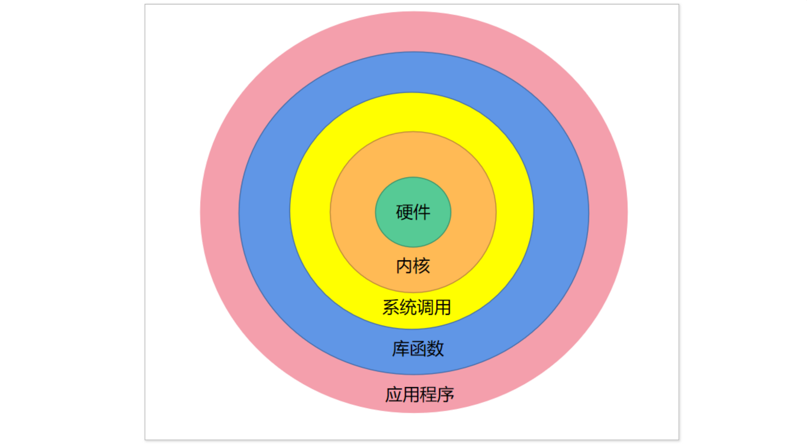
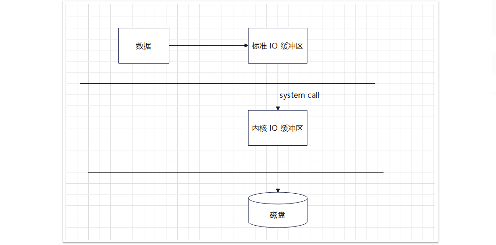
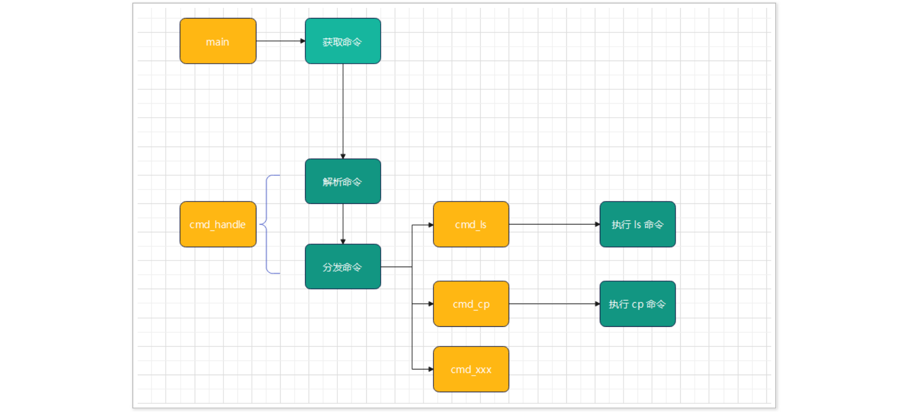

# 1.操作系统与Linux io框架

## 1.1 io与操作系统

### 1.1.1 io概念

- io 描述的是硬件设备之间的数据交互，分为输⼊ (input) 与输出 (output)。
  - 输⼊：应⽤程序从其他设备获取数据 (read) 暂存到内存设备中；
  - 输出：应⽤程序将内存暂存的数据写⼊到其他设备 (write)。

### 1.1.2 操作系统概念

- 操作系统通常包含两种不同的含义

  - 第⼀种含义: 指完整的软件包 : 包括核⼼软件与应⽤软件。
    - 应⽤软件: 命令解释器, 图形⽤户界⾯, ⽂件操作⼯具与⽂件编辑器；
    - 核⼼软件: 管理和分配计算机资源 (这些计算机资源即 cpu,RAM, 其他设备)，即操作系统核⼼软件 (内核)。
  - 第⼆种含义: 专指操作系统核⼼软件 (内核)。我们以后就按第二种含义来理解。

  - 内核的职责如下:
    - 进程管理 : 分配 cpu 资源，⽤于执⾏程序指令；
    - 内存管理 : 如今计算机内存容量可谓相当可观, 但软件的规模也保持了相应的增⻓, 内存资源仍然属于有限资源, 内核必须公平与⾼效的管理内存资源, 其中虚拟内存管理技术；
    - ⽂件管理 : 允许对⽂件执⾏创建，获取，更新以及删除；
    - 设备管理 : 计算机外界设备可实现计算机与外部世界的通讯；
    - 联⽹管理 : 使计算机可以进⾏⽹络通讯；
    - 提供应⽤编程接⼝ (API): 进程可利⽤内核⼊⼝点请求内核区执⾏各种任务。

### 1.1.3 Linux操作系统结构

- Linux操作系统结构

  - ⼀般分为⽤户层与内核层

    - ⽤户层 : 表示在内核层之上的库 (如 glibc) 与 应⽤程序 (app)；
    - 内核层 : 操作系统内核；

  - ⽤户层与内核层是相辅相成，⽤户层的应⽤程序依赖于库或者内核, 库与内核给应⽤层提供服务；

  - 内核通过系统调⽤来给应⽤层提供接⼝。

    

- 系统调用与库函数

  - 系统调⽤是 Linux 内核提供给应⽤程序的访问接⼝, 当需要 Linux 内核提供服务时, 则需要访问系统调⽤。
  - 库函数是为了实现某个功能⽽封装起来的 API 集合, 能够提供统⼀的编程接⼝，更加便于应⽤程序的移植。
  - glibc 是属于 GNU(GNU’s Not unix) ⼯程的⼀部分, 这个⼯程当初的⽬标是为了开发⼀款完整的操作系统, 但在开发过程中将除了 Linux 内核以外的组件都开发完成, 由于难度很⼤, 开发周期⻓, 在 1992 年 由 Linus Torvalds 开发出来了 Linux 内核, 填补了 GNU 系统的⼀个重要空⽩, 所有后⾯将 GNU 组件与 Linux 合并组成现在的 GNU/Linux。
  - glibc 包含 标准 c 库函数集合 和 系统调⽤
    - 标准的 c 库函数是跨平台的，既可以在 Linux 系统下调⽤, 也可以在 windows 系统下调⽤；
    - 系统调⽤是 Linux 内核给⽤户提供的访问接⼝, 但在 glibc 中封装了系统调⽤接⼝⽽形成了 glibc 的库函数；
    - glibc 库函数主要是封装了系统调⽤的过程, 相应的系统调⽤⼀般实现在 Linux 内核中；
    - ⼀般的 glibc 中的库函数都会与系统调⽤关联，但也有库函数不需要使⽤系统调⽤，⽐如字符串操作函数。

## 1.2 Linux io框架

### 1.2.1 Linux io框架介绍

- Linux io 框架也是分层设计, 这⾥以将内存中的数据存储到硬盘中为例

  

- 应⽤程序通过调⽤操作系统提供的 io 接⼝ (函数) 向内核进⾏ io 请求 , 由内核最终完整相应的io操作；
- Linux io 框架基于⼀切皆⽂件的思想来设计；
  - ⽬的 : 屏蔽底层不同设备之间的 io 差异, 给应⽤层提供统⼀的操作接⼝；
  - 思想 : 即将底层的 io 操作统⼀抽象成⽂件操作，操作提供系统只需要提供⼀组⽂件 io操作接⼝就可以为应⽤程序提供 io 服务。

- ⽂件 io 操作主要包含:
  - open：打开
  - close：关闭
  - read：读取
  - write：写⼊
  - lseek：定位

- ⽂件 io 接⼝的设计本身来沿⽤了⼈的 操作习惯

  - ⼤脑相当于 内存设备
  - 书籍或者其他笔记本相当于另⼀个设备
  - 读书 : 相当于⼤脑获取数据 (read)
  - 写字 : 相当于将⼤脑数据写⼊到其他存储介质中

- 下⾯以 printf io 过程为例来说明

  

  - printf io 的过程本质上是将暂存在内存中的数据写⼊到显示器中;

  - printf 函数⾸先会调⽤ glibc 中 write 函数来发出 io 请求;

  - write 函数在通过调⽤由操作系统内核提供的系统调⽤ sys_write 函数最终完成 io 操作.

  - 下⾯是 sys_write 系统调⽤在内核中的实现

    ```c++
    SYSCALL_DEFINE3(write, unsigned int, fd, const char __user *, buf, size_t, count)
    {
        struct fd f = fdget_pos(fd);
        ssize_t ret = -EBADF;
        if (f.file) 
        {
            loff_t pos = file_pos_read(f.file);
            ret = vfs_write(f.file, buf, count, &pos);
            if (ret >= 0)
            	file_pos_write(f.file, pos);
            fdput_pos(f);
        } 
        return ret; 
    }
    ```


# 2.Linux文件io接口

## 2.1 Linux文件io简介

### 2.1.1 关于Linux文件io

- 在 Linux 系统下, ⽤于对⽂件操作的库函数叫做⽂件 I/O；
- 主要包括 open()/close()/read()/write() /lseek() 相应的系统调⽤（准确说法是对系统调⽤的封装的库函数）。

### 2.1.2 文件描述符

- ⽂件描述符是⼀个⾮负整数 , 当打开⼀个已存在⽂件或者创建⼀个新⽂件时, 内核向进程返回⼀个⽂件描述符；

- 每个程序运⾏后, 操作系统会默认打开三个⽂件(标准输⼊、标准输出、标准错误输出) , ⽂件描述符分别为 0 , 1 , 2；

  - 标准输⼊对应的设备⼀般为键盘；
  - 标准输出与标准错误输出设备⼀般为显示器；

- 示例：通过 write 函数 (后⾯会详细讲解) 使⽤标准输出来打印 Hello world。

  ```c
  #include <stdio.h>
  #include <sys/types.h>
  #include <sys/stat.h>
  #include <fcntl.h>
  #include <errno.h>
  #include <unistd.h>
  int main(int argc,char *argv[])
  {
      write(1,"helloworld",10); 
      return 0;
  }
  ```

  

## 2.2 Linux文件io操作

### 2.2.1 open函数

- open函数说明

  - 函数功能

    - 打开文件，并得到文件描述符。

  - 函数原型

    ```c
    int open(const char *pathname, int flags);
    int open(const char *pathname, int flags, mode_t mode);
    ```

  - 头文件说明

    ```c
    #include <sys/types.h>
    #include <sys/stat.h>
    #include <fcntl.h>
    ```

  - 参数说明

    - pathname : ⽂件路径名
    - flags : 打开标志
      - O_RDONLY: 只读⽅式打开⽂件(read only)
      - O_WRONLY: 可写⽅式打开⽂件(write only)
      - O_RDWR: 读写⽅式打开⽂件(read write)
      - O_CREAT: 如果该⽂件不存在就创建⼀个新的⽂件，并⽤第三的参数为其设置权限
      - O_EXCL: 如果使⽤ O_CRATE 时⽂件存在, open() 报错（exclusive，排外的）
      - O_TRUNC: 如果⽂件已经存在，并且以读 / 写或只写成功打开, 并清零，即清空文件内容；
      - O_APPEND: 以添加的⽅式打开⽂件，在打开⽂件的同时，⽂件指针指向⽂件末尾
    - mode : 指定创建新的⽂件的默认权限

  - 返回值

    ```
    成功：返回⽂件描述符
    失败：返回-1, 并将错误编码保存到 errno
    ```

- 示例1：通过只读的⽅式打开⼀个⽂件

  ```c
  #include <stdio.h>
  #include <sys/types.h>
  #include <sys/stat.h>
  #include <fcntl.h>
  #include <errno.h>
  #include <unistd.h>
  #include <string.h>
  int main(int argc,char *argv[])
  {
      int fd; 
  
      if (argc != 2)
      { 
          /*
              int main(int argc, const char *argv[])
              argc:命令行传递参数的个数
              argv[0]:命令行传递的第一个参数
              argv[1]:命令行传递的第二个参数
              argv[2]:命令行传递的第三个参数
          */
          fprintf(stderr,"Usage : < %s > < pathname >\n", argv[0]);
          return -1; 
      } 
      fd = open(argv[1], O_RDONLY);
      
      if (fd == -1)
      {
          perror("Open(): ");
          return -1; 
      } 
  
      close(fd);
      return 0;
  }
  ```

- 练习：以只写的⽅式打开⽂件, 如果不存在则创建, 如果⽂件存在则截短（即清空文件内容）

  ```c
  #include <stdio.h>
  #include <stdlib.h>
  #include <sys/types.h>
  #include <sys/stat.h>
  #include <fcntl.h>
  #include <unistd.h>
  int main(int argc,char *argv[])
  {
      int fd; 
      if(argc != 2)
      {
      	printf("Usage : %s <pathname> .\n",argv[0]);
      }
  
      fd = open(argv[1],O_WRONLY|O_CREAT|O_TRUNC,0644);
      if (fd == -1) 
      { 
      	perror("open()");
   		exit(-1);
   	} 
   	printf("fd = %d\n",fd);
   	close(fd);
   	return 0;
  }
  ```

  

- 函数错误处理与errno

  - errno 是 Linux 操作系统中⽤于存储错误编码的全局变量, 错误编码在 Linux 系统中的定义如下：

    ```c
    #define EPERM 1 
    #define ENOENT 2 
    #define ESRCH 3 
    #define EINTR 4 
    #define EIO 5 
    #define ENXIO 6 
    #define E2BIG 7 
    #define ENOEXEC 8 
    #define EBADF 9 
    #define ECHILD 10 
    #define EAGAIN 11 
    #define ENOMEM 12 
    #define EACCES 13 
    #define EFAULT 14 
    #define ENOTBLK 15 
    #define EBUSY 16
    ```


- 错误信息打印

  - 错误信息打印主要使用perror() 函数。

    - 函数头文件

      ```c
      #include <stdio.h>
      ```

    - 函数原型

      ```c
      void perror(const char *s)
      ```

    - 函数参数

      ```
      s : ⾃定义字符串参数
      ```

  - 错误信息转换主要使⽤ strerror() 函数, 具体说明如下：

    - 函数头文件

      ```c
      #include <string.h>
      ```

    - 函数原型

      ```c
      char *strerror(int errnum)
      ```

    - 函数功能

      将错误编码转换成字符串信息，并返回该字符串的地址。

    - 函数参数

      ```
      errnum : 错误编码
      ```

    - 函数返回值

      返回错误码转换之后的字符串 or “Unknown error nnn”。

    - 示例 : 使⽤ perror 函数打印 出错信息

      ```c
      #include <stdio.h>
      #include <sys/types.h>
      #include <sys/stat.h>
      #include <fcntl.h>
      int main(int argc,char *argv[])
      {
          int fd; 
          fd = open(argv[1],O_RDONLY,0644);
          if (fd == -1) 
          { 
              perror("open(): ");
              //perror(strerror(EIO));
              //将错误编码EIO转换成出错信息字符串，通过perror函数将出错信息字符串打印出来
              return -1; 
          } 
          return 0;
      }
      ```

### 2.2.2 close函数

- close函数说明

  - 函数头文件

    ```c
    #include <unistd.h>
    ```

  - 函数原型

    ```c
    int close(int fd);
    ```

  - 函数功能

    close 函数⽤于关闭⽂件，在 io 操作结束后需要关闭⽂件，释放相关资源。

  - 函数参数

    ```
    fd : ⽂件描述符
    ```

  - 函数返回值

    ```
    成功：返回0
    失败：返回-1
    ```

- 示例：将前⾯已经打开的⽂件使⽤ close 函数关闭。


### 2.2.3 read函数

- 函数头文件

  ```c
  #include <unistd.h>
  ```

- 函数原型

  ```c
  ssize_t read(int fd, void *buf, size_t count)
  ```

- 函数功能

  从⽂件中读取数据保存缓冲区中。

- 函数参数

  ```c
  fd : ⽂件描述符
  buf : 数据缓冲区
  count : 能够读取的最⼤字节数
  ```

- 函数返回值

  ```
  成功 : 返回实际读取的字节数
  失败 : -1, 并将错误编码设置到 errno 中
  ```

- 示例：从指定⽂件中读取 10 个字节数据，并进⾏打印

  ```c
  #include <stdio.h>
  #include <sys/types.h>
  #include <sys/stat.h>
  #include <fcntl.h> 
  #include <errno.h>
  #include <unistd.h>
  int main(int argc,char *argv[])
  {
      int fd;
      char buffer[64] = {0};
      ssize_t rbytes;
      if (argc != 2)
      {
          fprintf(stderr,"Usage : < %s > < pathname >\n",argv[0]);
          return -1; 
      }
      fd = open(argv[1],O_RDONLY); 
      if (fd == -1)
      { 
          perror("Open(): ");
          return -1;
   	}
      rbytes = read(fd,buffer,10);
      if (rbytes == -1)
      {
      	perror("Read(): ");
      	return -1;
      }
   	printf("Buffer : %s\n",buffer);
  	close(fd);
   	return 0;
  }
  ```

### 2.2.4 write函数

- 函数头文件

  ```c
  #include <unistd.h>
  ```

- 函数原型

  ```c
  ssize_t write(int fd, const void *buf, size_t count);
  ```

- 函数功能

  把缓冲区中的数据写入到指定文件中。

- 函数参数

  ```
  fd : ⽂件描述符
  buf : 缓冲区地址
  count : 需要写⼊的字节数
  ```

- 函数返回值

  ```
  成功: 返回实际成功写⼊的字节数
  失败: 返回 -1, 并设置 errno
  ```

- 示例：将 ABCDE12345 字符串写⼊到指定⽂件中, 并验证是否写⼊正确

  ```c
  #include <stdio.h>
  #include <sys/types.h>
  #include <sys/stat.h>
  #include <fcntl.h>
  #include <errno.h>
  #include <unistd.h>
  int main(int argc,char *argv[])
  {
      int fd;
      char buffer[64] = "ABCED12345";
      ssize_t wbytes;
      if (argc != 2)
      {
          fprintf(stderr,"Usage : < %s > < pathname >\n",argv[0]);
          return -1;
      }
      fd = open(argv[1],O_RDWR|O_CREAT);
      if (fd == -1)
      {
          perror("Open(): ");
          return -1;
      }
      wbytes = write(fd,buffer,10);
      if (wbytes == -1)
      {
          perror("Write(): ");
          return -1;
      }
      close(fd);
      return 0;
  }
  ```

  

### 2.2.5 lseek函数

- 函数原型

  ```c
  off_t lseek(int fd, off_t offset, int whence);
  ```

- 函数参数

  - fd : ⽂件描述符
  - offset : 偏移量, 可以为正数或者负数
  - whence : 偏移相对位置
    - SEEK_CUR : 相对于⽂件当前偏移
    - SEEK_SET : 相对于⽂件开始位置
    - SEEK_END : 相对于⽂件尾偏移

- 函数返回值

  - 成功: 返回 0
  - 失败 : 返回 -1, 并设置 errno
  - 当前⽂件的偏移量决定下次 io 操作时的起始位置
  - 对于同⼀个⽂件描述符，共享同⼀个偏移量

- 示例：将⼀个字符串 "hello,linux io" 写⼊到⽂件中，在读取出来

  ```c
  #include <sys/types.h>
  #include <sys/stat.h>
  #include <fcntl.h>
  #include <errno.h>
  #include <unistd.h>
  #include <string.h>
  int main(int argc,char *argv[])
  {
      int fd; 
      char buffer[64] = "hello,Linux io";
      char rbuffer[64] = {0};
      ssize_t wbytes = 0,rbytes = 0;
      if (argc != 2)
      { 
          fprintf(stderr,"Usage : < %s > < pathname >\n",argv[0]);
          return -1; 
      } 
      fd = open(argv[1],O_RDWR|O_CREAT);
      if (fd == -1)
      {
          perror("Open(): ");
          return -1; 
      } 
  
      wbytes = write(fd,buffer,strlen(buffer));
      if (wbytes == -1)
      {
          perror("Write(): ");
          return -1;
      } 
      lseek(fd,0,SEEK_SET);
      rbytes = read(fd,rbuffer,wbytes);
      if (rbytes == -1)
      {
          perror("Read(): ");
          return -1; 
      } 
      printf("rbuffer : %s\n",rbuffer);
      close(fd);
      return 0;
  }
  ```

  

- 练习 : 使⽤ Linux ⽂件 io 接⼝实现 ⽂件复制

  ```c
  #include <unistd.h>
  #include <string.h>
  int main(int argc, const char *argv[])
  {
  	if(argc != 3)
  	{
  		fprintf(stderr, "Usage : <%s> <pathname>\n", argv[0]);
  		return -1;
  	}
  	int source_fd = open(argv[1], O_RDONLY);
  	int destination_fd = open(argv[2], O_RDWR | O_CREAT);
  	int rbytes = 0;
  	char buffer[64] = {0};
  	if(source_fd == -1 || destination_fd == -1)
  	{
  		perror("open()");
  		return -1;
  	}
  	while(rbytes = read(source_fd, buffer, 64))
  	{
  		if(rbytes == -1)
  		{
  			perror("read()");
  			return -1;
  		}
  		int wbytes = write(destination_fd, buffer, rbytes);
  		if(wbytes == -1)
  		{
  			perror("write()");
  			return -1;
  		}
  	}
  
  	close(source_fd);
  	close(destination_fd);
  	return 0;
  }
  ```

# 3.Linux标准io接口

## 3.1 标准io简介

### 3.1.1 标准io与文件io

- 标准 IO 是另外⼀套 IO 接⼝，具有如下特点:
  - 标准 I/O 是属于跨平台, 可以在 Linux、windows、mac os 上运⾏, ⽂件 IO 只能在Linux 平台运⾏
  - 标准 I/O ⾃带缓冲区，有更⾼的 IO 效率
  - 标准 IO 提供丰富的操作⽂本信息接⼝
  - 标准 IO 底层需要依赖于 ⽂件 IO
  - 在 Linux 系统下, 标准 I/O 是属于 glibc 库的⼀部分


### 3.1.2 流与FILE对象

- 流（stream）：流是⼀串连续不断的传输的数据的集合，就像⽔管⼀⾥的⽔流，在⽔管的⼀端⼀点⼀点地供⽔，⽽在⽔管的另⼀端看到的是⼀股连续不断的⽔流。

- ⼀般流可以分为 ⽂本流 与 ⼆进制流

  - ⽂本流：
    - 在流中处理的数据是以字符出现。
    - 在⽂本流中，’\n’被转换成回⻋符 CR 和换⾏符 LF的 ASCII 码 0DH 和 0AH, ⽽当输出时，0DH 和 0AH 被转换成’\n’。
  - 二进制流：
    - 流中处理的是⼆进制序列。
    - 若流中有字符，则⽤⼀个字节的⼆进制 ASCII 码表示；若是数字，则⽤对应的⼆进制数表示

- ⽂件指针:

  - FILE 指针：每个被使⽤的⽂件都在内存中开辟⼀个区域，⽤来存放⽂件的有关信息，这些信息是保存在⼀个结构体类型的变量中，该结构体类型是由系统定义的，取名为 FILE。

  - FILE 结构体定义在 /usr/libio.h 中 struct _IO_FILE

    ```c
     struct _IO_FILE;
     typedef struct _IO_FILE __FILE;
    ```

  - 标准 I/O 库的所有操作都是围绕流 (stream) 来进⾏的，在标准 I/O 中，流⽤ FILE * 来描述
  - 标准 I/O 库是由 Dennis Ritchie 在 1975 年左右编写的

- ⽂件指针关联到数据流的两端, 可以抽象成 “⽔管”

## 3.2 标准输入、标准输出、标准错误输出

### 3.2.1 简介

- 标准 I/O 预定义 3 个流对象指针, 在应⽤程序运⾏⾃动被打开.
  - 标准输⼊ : 流对象操作的是标准输⼊设备, 流对象指针的名称为 stdin , 对应的⽂件描述符为 0
  - 标准输出 : 流对象操作的是标准输出设备, 流对象指针的名称为 stdout, 对应的⽂件描述符为 1
  - 标准错误输出: 流对象操作的是标准错误输出设备, 流对象指针的名称为 stderr, 对应的⽂件描述符为 2
- 对应的 printf , 函数操作的就是 stdout , 由于是默认操作, ⼀般⽆需指定具体的流对象参数
- 当在输出时需要指定流对象的类型时, 则需要使⽤ fprintf 函数

### 3.2.2 fprintf函数

- 函数原型

  ```
  int fprintf(FILE *stream, const char *format, …);
  ```

- 函数功能

  将格式化数据写⼊到指定⽂件中。

- 函数参数

  ```
  stream : 流对象指针
  format : 格式字符串
  ```

  

- 示例 : 通过 stdout 与 stderr 进⾏输出

  ```c
  int main(void)
  {
      fprintf(stdout,"Linux std io .\n");
      fprintf(stderr,"can't open file.\n"); 
      while(1){}
      return 0;
  }
  
  ```

  - 注意: 在上述程序中, 将 ‘\n’ 去掉之后, 在添加⼀个死循环后, 则程序运⾏的结果则不同, 这⾥是 与标准 I/O 的缓冲区有关系.

### 3.2.3 文件缓冲

- 文件缓冲系统
  - 缓冲文件系统
    - 尽量减少使⽤ read/write 的调⽤次数, 来提⾼效率, 每次进⾏系统调⽤都会涉及到从 ⽤户空间到内核空间的切换以及内核进⾏系统调⽤所产⽣的开销 
    - 系统⾃动的在内存中为每⼀个正在使⽤的⽂件开辟⼀个缓冲区，从内存向磁盘输出数据必须先 送到内存缓冲区，装满缓冲区在⼀起送到磁盘中去. 
    - 从磁盘中读数据，则⼀次从磁盘⽂件将⼀批数据读⼊到内存缓冲区中，然后再从缓冲区逐个的 将数据送到程序的数据区



- 标准 I/O 的缓存⼤⼩为 8192, 在系统中定义如下 (stdio.h):

  ```C
  #define BUFSIZE 8192
  ```

  

-  ⼀般标准 I/O 的分类为: 

  - 全缓存 : 当相应的缓冲区已经装满数据时, 才进⾏⼀次 I/O 操作 
  - ⾏缓存 : 当相应的缓冲区存储⼀⾏时，则进⾏⼀次 I/O 操作, stdout 就是⾏缓存 
  - 不缓存 : 直接进⾏ I/O 操作, 不进⾏缓存, stderr 就是不缓存 

### 3.2.4 缓冲区强制刷新

- ⼀般情况下, 程序在结束时会 ⾃动刷新缓冲区, 但是当程序还未结束时, 刷新缓冲区则需要调⽤ fflush() 函数

  - 函数原型

    ```
    int fflush(FILE *stream);
    ```

  - 函数功能

    强制刷新缓冲区。
    
  - 函数参数

    ```
    stream：流对象指针
    ```

  - 函数返回值

    ```
    成功：返回0
    失败：返回-1
    ```

- 示例 : 使⽤ fflush 函数刷新缓冲区的数据

  ```c
  #include <stdio.h>
  int main(void)
  {
      printf("hello.");
      fflush(stdout);
      while(1){}
      return 0;
  }
  ```

- 练习 : 使⽤ fprintf 函数 "Hello,Linux io" 到 标准输出，并使⽤ fflush 函数进⾏强制刷新.

  ```c
  #include <stdio.h>
  
  int main(int argc, const char *argv[])
  {
  	fprintf(stdout, "Hello, Linux io");
  	fflush(stdout);	
  	while(1){}
  	return 0;
  }
  
  ```

  

## 3.3 Linux标准io-fopen/fclose

### 3.3.1 fopen函数

- 函数头文件

  ```c
  #include <stdio.h>
  ```

- 函数原型

  ```c
   FILE *fopen(const char *pathname, const char *mode);
  ```

- 函数功能

  打开⽂件，并获取流对象指针.

- 函数参数

  - pathname : 路径名
  - mode : 打开模式
    - r或rb：以只读方式打开⽂件，前提是该⽂件必须存在
    - r+或r+b：以可读可写方式打开⽂件，前提是该⽂件必须存在
    - w或wb：以只写方式打开⽂件，若⽂件存在则⽂件⻓度清为 0, 即会清空⽂件以前内容。若⽂件不存在则创建该⽂件.
    - w+或w+b或wb+：以可读可写方式打开⽂件，若⽂件存在则⽂件⻓度清为零，即会清空⽂件以前内容， 若⽂件不存在则创建该⽂件.
    - a或ab：以只写与追加的方式打开文件，若⽂件不存在，则会新建该⽂件, 如果⽂件存在，写⼊的数据会被加到⽂件尾，即⽂件原先的内容会被保留。

- 函数返回值

  - 成功：返回⽂件指针
  - 失败：返回 NULL, 并设置 errno

### 3.3.2 fclose函数

- 函数头文件

  ```c
  #include <stdio.h>
  ```

- 函数原型

  ```
  int fclose(FILE *stream);
  ```

- 函数功能

  关闭已经打开的⽂件.

- 函数参数

  ```
  stream : ⽂件指针
  ```

- 示例 : 以读写⽅式打开⽂件 test.txt，如果该⽂件不存在，则创建. 如果该⽂件已经存在，则⻓度截短为 0.

  ```c
  int main(int argc, const char *argv[])
  {
  	if(argc != 2)
  	{
  		fprintf(stderr, "usage <%s> <pathname>\n", argv[1]);
  		return -1;
  	}
  
  	FILE* fd = NULL;
  	fd = fopen(argv[1], "w+");
  	if(fd == NULL)
  	{
  		fprintf(stderr, "fopen()\n");
  		return -1;
  	}
  
  	return 0;
  }
  ```

## 3.4 Linux标准io-fgetc/fputc

### 3.4.1 fgetc函数

- 函数头文件

  ```c
  #include <stdio.h>
  ```

- 函数功能

  从文件中读取一个字符。

- 函数原型

  ```c
  int fgetc(FILE* stream);
  ```

- 函数参数

  ```
  stream:文件指针
  ```

- 函数返回值

  - 成功：返回所读到字符的ASCII码
  - 失败：返回EOF

  

### 3.4.2 fputc函数

- 函数头文件

  ```c
  #include <stdio.h>
  ```

- 函数功能

  输出一个字符到文件中；

- 函数原型

  ```c
  int fputc(int c, FILE* stream);
  ```

- 函数参数

  ```
  c:待写⼊的字符
  stream:文件指针
  ```

- 函数返回值

  - 成功：返回写入字符的ASCII码
  - 失败：返回EOF，并设置errno

- 示例 : 实现 cat 命令功能, 将⽂件中的数据显示到 stdout 上.

  ```c
  #include <stdio.h>
  #include <stdlib.h>
  int main(int argc,char *argv[])
  {
      FILE *fp = NULL;
      if (argc != 2)
      {   
          fprintf(stderr,"Usage : ./a.out <filename>\n"); 
          exit(-1);
      }   
      fp = fopen(argv[1],"r");
      if (fp == NULL)
      {   
      	fprintf(stderr,"fopen failed.\n");  
      	exit(-1);
      }   
      
      char ch; 
      for (;;){
      	ch = fgetc(fp);
      	if (ch == EOF)
      		break;
      	fputc(ch,stdout);
      }
      fclose(fp);
      return 0;
  }
  ```

  练习: 使⽤ fgetc 与 fputc 实现⽂件复制功能
  
  ```c
  #include <stdio.h>
  
  int main(int argc, const char *argv[])
  {
  	FILE *src_fd = NULL, *des_fd = NULL;
  	char ch;
  	if(argc != 3)
  	{
  		fprintf(stderr, "usage <%s> <pathname>\n", argv[0]);
  		return -1;
  	}
  	src_fd = fopen(argv[1], "r");
  	des_fd = fopen(argv[2], "w+");
  	if(src_fd == NULL || des_fd == NULL)
  	{
  		fprintf(stderr, "fopen()\n");
  		return -1;
  	}
  	while((ch = fgetc(src_fd)) != EOF)
  	{
  		fputc(ch, des_fd);
  	}
  
  	fclose(src_fd);
  	fclose(des_fd);
  	return 0;
  }
  ```

## 3.5 Linux标准io-fgets/fputs

### 3.5.1 fgets函数

- 函数头文件

  ```c
  #include <stdio.h>
  ```

- 函数功能

  从文件中读取一行数据到缓冲区中。

- 函数原型

  ```c
  char *fgets(char *s, int size, FILE *stream);
  ```

- 函数参数

  ```
  s : 缓冲区地址
  size : 最⼤可读取⼤⼩
  stream : ⽂件指针
  ```

- 函数返回值

  ```
  成功 : 返回缓冲区的地址, 当读到⽂件尾时,会返回 NULL
  失败 : 返回 NULL
  ```

- 使⽤注意点
  - 会将’\n’ 存储到 buffer 中
  - 会⾃动在 buffer 的末尾添加’\0’
  - 如果⼀⾏⼩于 size, 读取到⼀⾏就返回
  - 如果 size ⼩于⼀⾏, 读取 size 返回

### 3.5.2 fputs函数

- 函数头文件

  ```c
  #include <stdio.h>
  ```

- 函数功能

  将一行文本数据写入到文件中。

- 函数原型

  ```c
  int fputs(const char *s, FILE *stream);
  ```

- 函数参数

  ```
  s:缓冲区地址
  stream:文件指针
  ```

- 函数返回值

  ```
  成功：返回⼀个⾮负数
  失败：返回 EOF
  ```

- 示例：使⽤ fgets 与 fputs 输出⽂件内容到 stdout 上

  ```c
  #include <stdio.h>
  #include <stdlib.h>
  #include <errno.h>
  #include <string.h>
  int main(int argc,char *argv[])
  {
      FILE *fp = NULL;
      char buffer[64];
  
      fp = fopen(argv[1],"r");
      if (fp == NULL)
      { 
          fprintf(stderr,"cat't open file");
          exit(-1);
      } 
  
      while(fgets(buffer,64,fp) != NULL)
      { 
      	fputs(buffer,stdout); 
      } 
      fclose(fp);
      return 0;
  }
  ```

  

- 练习：使⽤ fputs 与 fgets 来复制⽂件

  ```c
  #include <stdio.h>
  #include <stdlib.h>
  
  
  int main(int argc, const char *argv[])
  {
  	FILE *src_fd = NULL, *des_fd = NULL;
  	char buffer[64] = {0};
  	int buffer_size = sizeof(buffer);
  	if(argc != 3)
  	{
  		fprintf(stderr, "Usage <%s> <pathname>\n", argv[0]);
  		return -1;
  	}
  	src_fd = fopen(argv[1], "r");
  	des_fd = fopen(argv[2], "w+");
  	if(src_fd == NULL || des_fd == NULL)
  	{
  		fprintf(stderr, "fopen()\n");
  		exit(-1);
  	}
  	while((fgets(buffer, buffer_size, src_fd)) != NULL)
  	{
  		fputs(buffer, des_fd);
  	}
  	fclose(src_fd);
  	fclose(des_fd);
  	return 0;
  }
  ```


## 3.6 Linux标准io-格式化输入输出与时间获取

当遇到典型的格式化数据进⾏处理时, 就需要相应⽤于格式化输⼊ / 输出的函数来完成, ⽐如⽇期就是典型的具有格式的数据

⽇期数据 : 2022 年 10 ⽉ 22 ⽇

地址数据 : 湖北省武汉市…

### 3.6.1 格式化输出函数


- printf函数

  - 函数头文件

    ```c
    #include <stdio.h>
    ```

  - 函数功能

    输出信息到标准输出。

  - 函数原型

    ```c
    int printf(const char *format, …);
    ```

  - 函数返回值

    实际输出的字节数。

- fprintf函数

  - 函数头文件

    ```c
    #include <stdio.h>
    ```

  - 函数功能

    将格式化数据输出到文件。

  - 函数原型

    ```c
    int fprintf(FILE *stream, const char *format, …);
    ```

  - 函数参数

    ```
    stream : 流对象指针
    format : 格式字符串
    ```

  - 函数返回值

    实际输出的字节数。

- sprintf函数

  - 函数头文件

    ```c
    #include <stdio.h>
    ```

  - 函数功能

    将格式化数据输出到字符串缓冲区中。

  - 函数原型

    ```c
    int sprintf(char *str, const char *format, …);
    ```

  - 函数参数

    ```
    str : 字符串缓冲区地址
    format : 格式字符串地址
    ```

  - 函数返回值

    实际输出的字节数。

### 3.6.2 格式化输入函数


- scanf函数

  - 函数头文件

    ```c
    #include <stdio.h>
    ```

  - 函数功能

    从标准输⼊读取格式化数据到缓冲区中。

  - 函数原型

    ```c
    int scanf(const char *format, …);
    ```

  - 函数参数

    ```
    format : 格式字符串地址
    ```

  - 函数返回值

    实际读取的字节数。

- fscanf函数

  - 函数头文件

    ```c
    #include <stdio.h>
    ```

  - 函数功能

    从⽂件中读取格式化数据。

  - 函数原型

    ```c
    int fscanf(FILE *stream, const char *format, …);
    ```

  - 函数参数

    ```
    stream : 流对象指针
    format : 格式字符串地址
    ```

  - 函数返回值

    实际读取的字节数。

  - 例：格式化输出

    ```c
    #include <stdio.h>
    #include <stdlib.h>
    #include <errno.h>
    #include <string.h>
    int main(int argc,char *argv[])
    {
        FILE *fp = NULL; 
    
        fp = fopen(argv[1],"w");
        if ( fp == NULL)
        { 
            fprintf(stderr,"can't open file.\n");
            return -1;
        } 
        int numa = 10; 
        float numb = 1.23456;
        char *str = "Hello";
        char buffer[64];
        fprintf(fp,"%d-%f-%s",numa,numb,str);
        sprintf(buffer,"%d-%f-%s",numa,numb,str);
        puts(buffer);
        fclose(fp);
        return 0;
    }
    ```

    

- sscanf函数

  - 函数头文件

    ```c
    #include <stdio.h>
    ```

  - 函数功能

    从字符串读取格式化数据。

  - 函数原型

    ```c
    int sscanf(const char *str, const char *format, …);
    ```

  - 函数参数

    ```
    str : 字符串地址
    format : 格式字符串地址
    ```

  - 函数返回值

    实际读取的字节数。

  - 例：格式化输入

    ```c
    #include <stdio.h>
    #include <stdlib.h>
    int main(int argc,char *argv[])
    {
        FILE *fp = NULL; 
        int numa = 0,numb = 0,numc = 0; 
        char buffer[64] = "10-20-30";
        if (argc != 2)
        { 
            fprintf(stderr,"Usage : %s <pathname> \n",argv[0]);
            return -1; 
        } 
        fp = fopen(argv[1],"r");
        if (fp == NULL)
        {
            perror("Error fopen(): ");
            return -1; 
        } 
    
        fscanf(fp,"%d-%d-%d",&numa,&numb,&numc);
    
        printf("numa = %d,numb = %d,numc = %d\n",numa,numb,numc);
        numa = 0,numb = 0,numc = 0;
        sscanf(buffer,"%d-%d-%d",&numa,&numb,&numc);
        printf("numa = %d,numb = %d,numc = %d\n",numa,numb,numc);
        fclose(fp);
        return 0;
    }
    ```

### 3.6.3 获取系统时间

- 在 Linux 中获取主要需要以下两个步骤

  - Step 1 : 通过 time() 函数获取从 1970 年⾄今的秒数

  - Step 2 : 通过 localtime() 或者 ctime() 函数

- time函数

  - 函数头文件

    ```c
    #include <time.h>
    ```

  - 函数功能

    获取从 1970-1-1 ⾄今的时间秒数 (时间戳)。

  - 函数原型

    ```c
    time_t time(time_t *tloc);
    ```

  - 函数参数

    ```
    tloc:输出参数，存储时间变量的指针。
    
    ```

  - 函数返回值

    ```
    如果参数为空，则返回当前时间距1970年1月1日00:00点 UTC的秒数；
    如果参数不为空，此时返回值和参数都为当前时间距1970年1月1日00:00点 UTC的秒数。
    ```

  - 注意：

    ```
    UTC就是一个全世界都用的“标准时间”。这个时间是基于非常准确的原子钟来计算的，所以非常准确。
    UTC就像一把全球统一的“尺子”，用来量时间。这样，不论你在世界的哪个角落，只要提到UTC时间，大家都知道现在是几点。
    当然，每个地方因为日出日落的时间不同，所以会在UTC的基础上加或者减几个小时，形成自己的地方时间。
    但UTC时间就像一个基准，帮助大家更好地理解和沟通时间。
    ```

- localtime函数

  - 函数头文件

    ```c
    #include <time.h>
    ```

  - 函数功能

    将时间戳转换成本地时间, 并存储到 struct tm 结构体变量中。

  - 函数原型

    ```c
    struct tm *localtime(const time_t *timep);
    ```

  - 函数参数

    ```
    timep：这是一个指向 time_t 类型变量的指针，该变量包含了要转换的时间。
    ```

  - 函数返回值

    ```
    返回 struct tm 结构体指针
    ```

    `struct tm` 的定义大致如下：

    ```c
    struct tm {
        int tm_sec;    /* Seconds (0-60) */
        int tm_min;    /* Minutes (0-59) */
        int tm_hour;   /* Hours (0-23) */
        int tm_mday;   /* Day of the month (1-31) */
        int tm_mon;    /* Month (0-11) */
        int tm_year;   /* Year - 1900 */
        int tm_wday;   /* Day of the week (0-6, Sunday = 0) */
        int tm_yday;   /* Day in the year (0-365, 1 Jan = 0) */
        int tm_isdst;  /* Daylight saving time */
    };
    ```

  - 获取当前时间并转换本地时间，以 %d-%d-%d %d::%d::%d 进⾏打印

    ```c
    #include <stdio.h>
    #include <time.h>
    int main(void)
    {
        time_t t;
    
        struct tm *p_datetime;
        t = time(NULL);
        p_datetime = localtime(&t);
        printf(" %d-%d-%d %d::%d::%d\n"
        	,p_datetime->tm_year + 1900
        	,p_datetime->tm_mon + 1
        	,p_datetime->tm_mday
        	,p_datetime->tm_hour
        	,p_datetime->tm_min 
        	,p_datetime->tm_sec );
        return 0;
    }
    ```

    练习 :

    获取系统时间，按照 <2022-5-8 23::15:00> 格式写⼊到⽂件中

    ```c
    #include <stdio.h>
    #include <time.h>
    #include <stdlib.h>
    int main(int argc, const char *argv[])
    {
    	time_t sec = time(NULL);
    	struct tm * date_time_p = localtime(&sec);
    	FILE *fd = NULL;
    	if(argc != 2)
    	{
    		fprintf(stderr, "Usage <%s> <pathname>\n", argv[0]);
    		return -1;
    	}
    	
    	fd = fopen(argv[1], "w+");
    	if(fd == NULL)
    	{
    		fprintf(stderr, "fopen()\n");
    		exit(-1);
    	}
    	fprintf(fd, "<%d-%d-%d::%d:%d:%d>\n", 
    			date_time_p->tm_year + 1900,
    			date_time_p->tm_mon + 1,
    			date_time_p->tm_mday,
    			date_time_p->tm_hour,
    			date_time_p->tm_min,
    			date_time_p->tm_sec
    			);
    	return 0;
    }
    
    ```

## 3.7.Linux标准io-⼆进制读写与⽂件定位

### 3.7.1 二进制文件读写

在标准 I/O 中, ⽤于进⾏⼆进制⽂件进⾏读写时需要调⽤ fread 与 fwrite。

- fread函数

  - 函数头文件

    ```c
    #include <stdio.h>
    ```

  - 函数功能

    ```
    从⼆进制⽂件中读取数据到缓冲区
    ```

  - 函数原型

    ```c
    size_t fread(void *ptr, size_t size, size_t nmemb, FILE *stream);
    ```

  - 函数参数

    ```
    ptr : 缓冲区地址
    size : 读取每个数据块的⼤⼩
    nmemb : 读取数据对象的个数
    stream : ⽂件指针
    ```

  - 函数返回值

    ```
    成功 : 返回实际读取的数据对象的个数
    失败: 当到达⽂件尾或者发⽣错误，返回较⼩的数据对象个数或者 0
    ```

- fwrite函数

  - 函数头文件

    ```c
    #include <stdio.h>
    ```

  - 函数功能

    ```
    将缓冲区中的数据写⼊到⽂件中 
    ```

  - 函数原型

    ```c
    size_t fwrite(const void *ptr, size_t size, size_t nmemb, FILE *stream);
    ```

  - 函数参数

    ```
    ptr : 缓冲区地址
    size : 写入的每个数据块的⼤⼩
    nmemb : 写入的数据对象的个数
    stream : ⽂件指针
    ```

  - 函数返回值

    ```
    成功 : 返回实际写入的数据对象的个数
    失败: 当到达⽂件尾或者发⽣错误，返回较⼩的数据对象个数或者 0
    ```

  - 示例 : 使⽤ fwrite 存储⼀个浮点数组的数据到⽂件中。

    ```c
    #include <stdio.h>
    #include <stdlib.h>
    #include <string.h>
    #include <time.h>
    #include <errno.h>
    int main(int argc,char * argv[])
    {
        FILE *fp = NULL;
    
        fp = fopen(argv[1], "w+");
        if (fp == NULL)
        {
            fprintf(stderr,"can't open file.");
            exit(-1);
        }
        float numbers[5] = {1.1,1.2,1.3,1.4,1.5};
        size_t nwbytes = 0 ;
        nwbytes = fwrite(numbers,sizeof(float),5,fp);
        if (nwbytes != 5)
        {
            fprintf(stderr,"fwrite():%s\n",strerror(errno));
            exit(-1);
        }
        rewind(fp);
        size_t nrbytes = 0;
        float rnumbers[5] = {0.0};
        nrbytes = fread(rnumbers,sizeof(float),5,fp);
        if (nrbytes != 5)
        {
            fprintf(stderr,"fread():%s\n",strerror(errno));
            exit(-1);
        }
        int i;
        for (i = 0;i < 5;i++)
        {
            printf(" %f ",rnumbers[i]);
        }
        putchar('\n');
        fclose(fp);
        return 0;
    }
    ```

### 3.7.2 文件定位

在对⽂件流进⾏操作时, ⼀般情况下都是顺序操作, 但如果定位到⽂件流某⼀个地⽅进⾏操作，则需要使⽤ fseek 函数进⾏⽂件流的定位。

- fseek函数

  - 函数头文件

    ```c
    #include <stdio.h>
    ```

  - 函数功能

    ```
    对⽂件进⾏定位
    ```

  - 函数原型

    ```c
    int fseek(FILE *stream, long offset, int whence);
    ```

  - 函数参数

    - stream : ⽂件指针
    - offset : 偏移量
    - whence: 偏移相对位置
      - SEEK_SET ：相对于⽂件头
      - SEEK_CUR : 相对于⽂件当前位置
      - SEEK_END : 相对于⽂件尾

  - 函数返回值

    ```
    成功: 返回设置后的偏移位置
    失败：返回 -1, 并设置 errno
    ```

  - 示例 : 使⽤ fseek 函数进⾏数据流的定位

    ```c
    int main(int argc,char * argv[])
    {
        FILE *fp = NULL;
        char temp;
        fp = fopen(argv[1],"r");
    
        if (fp == NULL)
        {
            fprintf(stderr,"open failed.");
            return -1;
        }
    
        fseek(fp,5,SEEK_SET);
        temp = fgetc(fp);
        printf("temp = %c\n",temp);
    
        fclose(fp);
        return 0;
    }
    ```

  - 练习 : 使⽤⼆进制操作接⼝ fread 与 fwrite 复制⼀张图⽚
  
    ```c
    #include <stdio.h>
    #include <stdlib.h>
    #include <string.h>
    #include <errno.h>
    #define BUFFER_SIZE 1024
    int main(int argc, const char *argv[])
    {
    	FILE * src_fd = NULL, * des_fd = NULL;
    	char buffer[BUFFER_SIZE] = {0};
    	int nrbytes = 0, nwbytes = 0;
    	if(argc != 3)
    	{
    		fprintf(stderr, "Usage <%s> <pathname>\n", argv[0]);
    		exit(-1);
    	}
    	src_fd = fopen(argv[1], "r");
    	des_fd = fopen(argv[2], "w+");
    	if(src_fd == NULL || des_fd == NULL)
    	{
    		fprintf(stderr, "fopen():%s\n", strerror(errno));
    		exit(-1);
    	}
    	
    	while((nrbytes = fread(buffer, 1, BUFFER_SIZE, src_fd)) > 0)
    	{
    		fwrite(buffer, 1, nrbytes, des_fd);
    	}
    
    	fclose(src_fd);
    	fclose(des_fd);
    	return 0;
    }
    
    ```
  
    

# 4.静态库与动态库的原理与制作

## 4.1 程序的编译过程

- 程序在编译时分为多个阶段

  - 预处理
    - 处理所有预处理命名，包括宏定义、条件编译指令、⽂件包含指令；
  - 编译
    - 进⾏词法分析、语法分析、语义分析后，将代码翻译成汇编指令；
  - 汇编
    - 将汇编指令翻译成机器指令，也就是⼆进制，形成⽬标⽂件；

  - 链接

    - 将多个⽬标⽂件进⾏链接，得到⼀个程序最后的执⾏⽂件。

    

- 编译过程演示示例，假定源⽂件名为 hello.c

  - Step 1：预处理

    ```shell
    gcc -E hello.c -o hello.i
    ```

  - Step 2：编译

    ```shell
    gcc -S hello.i -o hello.S
    ```

  - Step 3：汇编

    ```shell
    gcc -c hello.S -o hello.o
    ```

  - Step 4：链接

    ```shell
    gcc hello.o -o hello
    ```

    

  

## 4.2 静态库

### 4.2.1 函数库

- 函数库是实现了某⼀类功能的若⼲个函数的集合。
- 函数库可以编译独⽴的⼆进制⽂件，在进⼀步制作成静态库与动态库进⾏链接使⽤。

### 4.2.2 静态库的文件格式

- 静态库是函数库⼆进制⽂件的⼀种形式, 在 windows 与 Linux 下对应的⽂件类型。
  - Windows：name.lib
  - Linux：libname.a

### 4.2.3 静态库的特点

- 当编译器链接静态库的时候，如果在可执⾏⽂件中有调⽤静态库的函数接⼝，则会将静态库拷⻉到可执⾏⽂件中；
- 由于可执⾏⽂件中有静态库中函数接⼝的实现代码，运⾏的时候不需要静态库；
- 由于链接的时候，需要将库函数接⼝实现代码拷⻉到可执⾏⽂件中，所以⽣成。

### 4.2.4 静态库的制作

- 静态库的制作

  - 将file.c编译成file.o

    ```shell
    gcc -c file.c -o file.o
    ```

  - 将file.o生成静态库

    ```shell
    ar -rs libfile.a file.o
    ```

  - ar 命令⽤于制作静态库的命令, 可以使⽤⼀些常⽤的选项

    ```
    -s：将⽬标⽂件的索引符号添加到库中；
    -r : 在库中更新⽂件或者添加新的⽂件。
    ```


### 4.2.5 静态库的链接

- 静态库在链接使⽤时需要指定头⽂件的位置与静态库的位置

  - -I：指定头⽂件
  - -L：指定库的位置
  - -l：指定链接的库的名字

  ```shell
  gcc -I <头⽂件路径> -L < 库的路径 > -l < 静态库的名字 > -o < 可执⾏⽂件名 >
  ```

- gcc 编译器默认搜索头⽂件与库⽂件的路径

  ```
  /usr/include 为头⽂件默认路径
  /usr/lib 与 /lib 为库的默认路径
  ```

- 静态库的优点与缺点

  - 优点
    - 可执⾏程序在执⾏的时候，不需要加载动态库，可以直接运⾏；
  - 缺点
    - 多个程序链接静态库的时候，需要拷⻉多份静态库的代码，占⽤的内存较多；

- 练习 ： 设计⼀个⽤于进⾏算术运算的库 add.h 与 add.c ，然后制作成静态库进⾏链接

  - 第一步：写程序

    add.c

    ```c
    int add(int a, int b)
    {
    	return a + b;
    }
    ```

    add.h

    ```c
    #ifndef __ADD_H__
    #define __ADD_H__
    extern int add(int a, int b);
    #endif
    ```

    main.c

    ```c
    #include <stdio.h>
    #include "add.h"
    int main(int argc, const char *argv[])
    {
    	printf("%d\n", add(10, 20));
    	return 0;
    }
    ```

  - 第二步：写命令

    ```
    gcc -c add.c -o add.o
    ar -rs libadd.a add.o
    gcc -I . -L .  main.c -l add -o exec
    ```

## 4.3 动态库

### 4.3.1 动态库的文件格式

- 动态库的文件格式如下：
  - Windows：name.dll
  - Linux：libname.so

### 4.3.2 动态库的特点

- 当编译器链接动态库的时候，会在可执⾏⽂件的头信息中记录库的名字，便于在操作系统执⾏这个可执行文件时, 让操作系统去加载对应的动态库。
- 当操作系统执⾏可执⾏⽂件时候，会先读取可执⾏⽂件的头信息，然后加载头信息中记录的动态库到内存中运⾏。
- 当可执⾏⽂件调⽤动态库中的函数时，则需要加载动态库到内存中。

### 4.3.3 动态库的制作

- 动态库的制作过程如下：

  - 将 file.c 编译成 file.o

    ```shell
    gcc -c file.c -o file.o
    ```

  - 将file.o生成动态库

    ```shell
    gcc -shared file.o -o libfile.so
    ```

### 4.3.4 动态库的链接

- 动态库库在链接使⽤时需要指定头⽂件的位置与动态库库的位置

  - -I：指定头⽂件

  - -L：指定库的位置

  - -l：指定链接的库的名字

  ```
  gcc -I <头⽂件路径> -L < 库的路径 > -l < 动态库的名字 > < 源⽂件 >-o < 可执⾏⽂件名 >
  ```

- gcc 编译器默认搜索头⽂件与库⽂件的路径

  - /usr/include 为头⽂件默认路径

  - /usr/lib 与 /lib 为库的默认路径

- 与静态库不同的是 动态库在链接成功之后，还需要加载动态库到内存中, 编译与加载是两个不同的动作

  - 编译器在编译时并没有将动态库中的函数拷⻉到可执⾏程序中，只是记录动态库的名字；

  - 在程序运⾏中调⽤到动态苦衷的函数时时，则需要将动态库加载到内存中；

  - 动态库默认加载动态库的路径与链接动态库的默认路径是相同的，都是 /lib 与 /usr/lib；

  - 当默认路径下没有时，则会到 LD_LIBRARY_PATH 环境变量下去找；

  - 可以通过 LD_LIBRARY_PATH 来设置动态库的路径。

  ```
  export LD_LIBRARY_PATH=$LD_LIBRARY_PATH: ⾃⼰库所在的路径
  ```

- 练习: 将前⼀次练习对应的 算术运算库 (add.h/add.c) 制作成动态库进⾏链接, 并测试

  ```
  gcc -c add.c -o add.o
  gcc -I . -L . main.c -l add -o exec
  export LD_LIBRARY_PATH=.
  ./exec
  ```

  

# 5.项目-实现一个基础的shell程序

## 5.1 项目简介与框架设计

### 5.1.1 项目简介

- 实现⼀个基础的 shell 程序，主要完成两个命令的功能 cp 和 ls
  - cp 命令主要实现:
    - ⽂件复制
    - ⽬录复制
  - ls 命令主要实现:
    - ls -l 命令的功能

### 5.1.2 项目框架设计

- 在框架设计上，采⽤模块化设计思想，并具备⼀定的可扩展性, 具体框架如下:

  

  

  - cmd_handle 模块: ⽤于解析命令相关信息，并进⾏命令的分发执⾏

  - cmd_ls 模块 : ⽤于执⾏ ls 命令

  - cmd_cp 模块 : ⽤于执⾏ cp 命令

  - cmd_xxx 模块 : ⽤于扩展

### 5.1.3 基本框架搭建

- step1：根据框架规划创建相关源文件

  | 模块             | 源文件                     |
  | ---------------- | -------------------------- |
  | 命令处理中⼼模块 | cmd_handle.c、cmd_handle.h |
  | ls 命令模块      | cmd_cp.c、cmd_cp.h         |
  | cp 命令模块      | cmd_ls.c、cmd_ls.h         |
  | ⼯程管理         | Makefile                   |
  | 主函数           | main.c                     |

- step2：创建Makefile用于管理工程

  ```makefile
  OBJS := main.o cmd_ls.o cmd_cp.o cmd_handle.o 
  TARGET := tinyshell 
  $(TARGET): $(OBJS) 
  	@gcc $^ -o $@ 
  	@echo "Done."
  %.o:%.c 
  	@gcc -c $< -o $@ 
  clean: 
  	rm -rf *.o $(TARGET)
  ```

  - := 表示当前位置所赋的值，⽽不是整个 Makefile 展开之后的值,= 是整个 Makefile 展开之后的所赋的值

    - = 号示例

      ```makefile
       x = foo
       y = $(x) bar
       x = xyz
      ```

      - 上述示例中的 y 的值为 xyz bar

    - := 号示例

      ```makefile
       x := foo
       y := $(x) bar
       x := xyz
      ```

      - 上述示例中的 y 的值为 foo bar

  - $(TARGET) : 表示获取 TARGET 变量的值

  - %.o : %.c :

    - % 表示通配符
    - %.o : ⽤于匹配任意 .o ⽂件, 如 cmd_handle.o ,cmd_ls.o ,…
    - %.c : ⽤于匹配任意 .c ⽂件, 如 cmd_handle.c ,cmd_ls.c ,…

- step3：在main.c编写基本的main函数

  ```c
  int main()
  {
  	return 0;
  }
  ```

- step4：编译测试

  在命令⾏输⼊ make 命令进⾏测试, 显示 Done , 则表示编译通过

### 5.1.4 项目主循环实现

- 项⽬的主循环主要完成的功能:

  - step1：循环获取⽤户输⼊ main.c

    ```c
    #include <stdio.h>
    #include <string.h>
    
    #define SZ_CMD 64
    
    int main(void)
    {
        char command[SZ_CMD] = {0}; 
    
        for(;;)
        {
            printf("TinyShell > ");
            fgets(command,SZ_CMD,stdin); 
            command[strlen(command) - 1] = '\0'; 
            if (strncmp(command,"quit",4) == 0)
            { 
                printf("GoodBye\n");
                break;
            }
    
            cmd_execute(command); 
        } 
        return 0;
    }
    ```
  
  - step 2 : 调⽤ cmd_handle 的 cmd_execute 接⼝执⾏相应的命令 cmd_handle.h cmd_handle.c
  
    cmd_handle.h
  
    ```c
    #ifndef __CMD_HANDLE_H_
    #define __CMD_HANDLE_H_
    #define DEBUG
    extern int cmd_execute(char *cmd_str); 
    #endif
    ```
  
    cmd_handle.c
  
    ```c
    int cmd_execute( char *cmd_str)
    {
    #ifdef DEBUG
     printf("[DEBUG] : cmd string : < %s >\n",cmd_str);
    #endif
     return 0;
    }
    ```
  
  - step 3 ： 编译并执⾏⼯程
