# 1.进程

## 1.1 进程的概念

### 1.1.1 什么是进程

- 进程描述是一个程序执行过程，当程序执行后，执行过程开始，则进程产生, 执行过程结束, 则进程也就结束。

- 下面是 windows 系统中，所有的进程，即正在执行的程序, 一旦结束进程，就意味着进程结束

  

### 1.1.2 进程的特点

- 进程是一个独立的可调度的活动, 由操作系统进行统一调度, 相应的任务会被调度到cpu中进行执行

  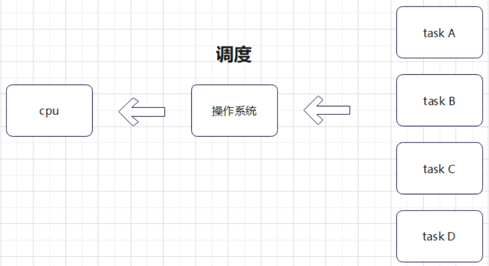

- 进程一旦产生，则需要分配相关资源，同时进程是资源分配的最小单位

  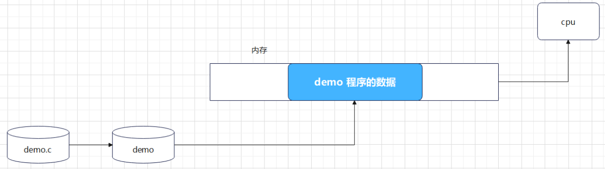

### 1.1.3 进程和程序的区别

- 程序是静态的，它是一些保存在磁盘上的指令的有序集合，没有任何执行的概念
- 进程是一个动态的概念，它是程序执行的过程，包括了动态创建、调度和消亡的整个过程

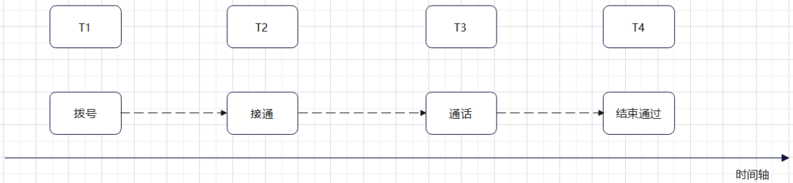

### 1.1.4 并行执行和并发执行

- 并行执行

  - 表示多个任务能够同时执行，依赖于 物理的支持，比如 cpu 是 4 核心，则可以同时执行 4 个任务

- 并发执行

  - 在同一时间段有多个任务在同时执行，由操作系统调度算法来实现，比较典型的就是时间片轮转

  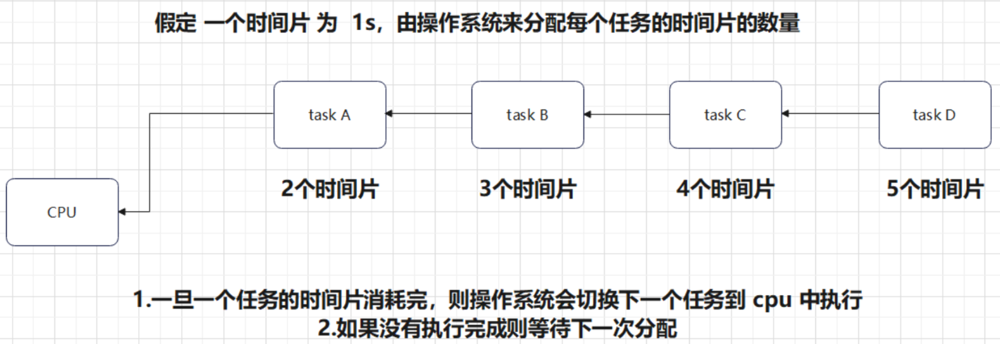

## 1.2 Linux进程管理

- 在 Linux 系统中管理进程使用树型管理方式

  - 每个进程都需要与其他某一个进程建立 父子关系, 对应的进程则叫做 父进程

- Linux 系统会为每个进程分配 id , 这个 id 作为当前进程的唯一标识, 当进程结束, 则会回收

- 进程的 id 与 父进程的 id 分别通过 getpid() 与 getppid() 来获取

- getpid()函数

  - 头文件

    - ```
      #include <sys/types.h>
      #include <unistd.h>
      ```

  - 函数原型

    - ```
      pid_t getpid(void);
      pid_t getppid(void);
      ```

  - 函数功能

    - 获取当前进程 id 与 父进程 id

  - 函数返回值

    - 成功 : getpid() 返回当前进程 id ,getppid() 返回父进程 id
    - pid_t 的类型 实际为 int , 在系统中采用 typedef 的形式

  - 示例 : 获取当前进程 pid 与 ppid

    - ```c
      #include <stdio.h>
      #include <sys/types.h>
      #include <unistd.h>
      int main(void)
      {
          printf(" pid : %d ppid : %d\n",getpid(),getppid());
          return 0;
      }
      ```

## 1.3 进程的地址空间

### 1.3.1 进程的地址空间组成

- 一旦进程建立之后, 系统则要为这个进程分配相应的资源, 一般系统会为每个进程分配 4G 的地址空间
- 4G 的地址空间结构如下:
  - 
  - 4G 的进程地址空间主要分为两部分:
    - 0 - 3G : 用户空间
    - 3G - 4G ： 内核空间
  - 用户空间又具体分为如下区间
    - stack : 存放非静态的局部变量
    - heap : 动态申请的内存
    - bss : 未初始化过的全局变量（包括初始化为 0 的, 未初始化过的静态变量 (包括初始化为 0)
    - data : 初始化过并且值不为 0 的全局变量, 初始化过的不为 0 静态变量
    - rodata : 只读变量（字符串之类）
    - text : 程序文本段（包括函数，符号常量）
- 当用户进程需要通过内核获取资源时, 会切换到内核态运行, 这时当前进程会使用内核空间的资源
- 用户需要切换到内核态运行时, 主要是通过 系统调用

### 1.3.2 虚拟地址与物理地址

- 在程序执行过程中，操作系统会分配 4G 的 虚拟地址空间
- 虚拟地址空间中的每个地址都是一个虚拟地址
  - 虚拟地址 : 虚拟地址并不代表真实的内存空间, 而是一个用于寻址的编号
  - 物理地址 : 是指内存设备中真实存在的存储空间的编号
- 虚拟地址通过映射的方式建立与物理地址的关联, 从而达到访问虚拟地址就可以访问到对应的物理地址
  - 在 cpu 中有一个硬件 MMU(内存管理单元) , 负责虚拟地址与物理地址的映射管理以及虚拟地址访问
  - 操作系统可以设置 MMU 中的映射内存段
  - 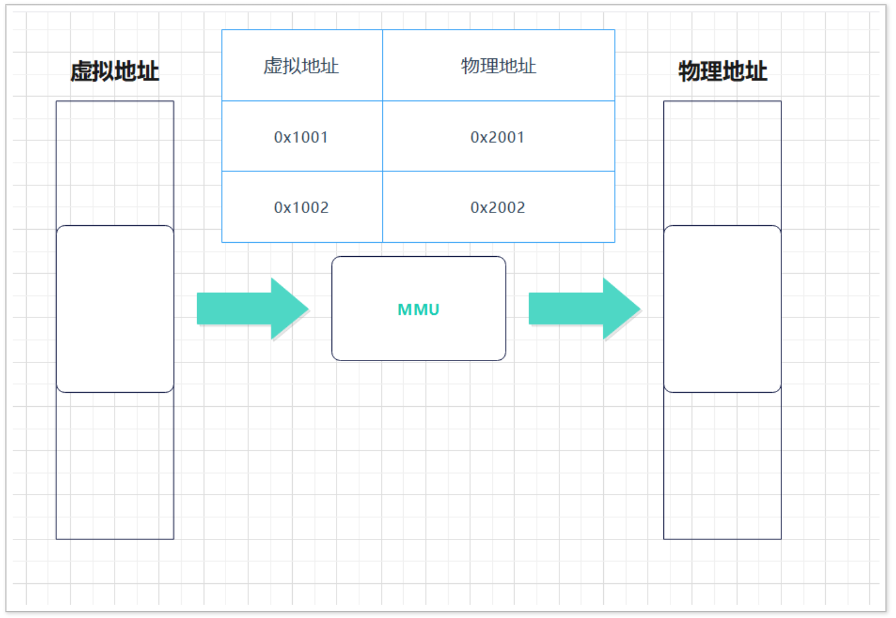
  - 在操作系统中使用虚拟地址空间主要是基于以下原因:
    - 直接访问物理地址, 会导致地址空间没有隔离, 很容易导致数据被修改
    - 通过虚拟地址空间可以实现每个进程地址空间都是独立的，操作系统会映射到不用的物理地址区间，在访问时互不干扰.

## 1.4 进程的状态管理

### 1.4.1 进程的状态简介

- 进程是动态过程，操作系统内核在管理整个动态过程时会使用了状态机,
  - 给不同时间节点设计一个状态，通过状态来确定当前的过程进度
  - 在管理动态过程时，使用状态机是一种非常好的方式

### 1.4.2 进程的状态与转换

- 进程的状态一般分为如下:

  - 运行态 (TASK_RUNNING) : 此时进程或者正在运行，或者准备运行, 就绪或者正在进行都属于运行态
  - 睡眠态 () : 此时进程在等待一个事件的发生或某种系统资源
    - 可中断的睡眠 (TASK_INTERRUPT) : 可以被信号唤醒或者等待事件或者资源就绪
    - 不可中断的睡眠 (TASK_UNTERRUPT) : 只能等待特定的事件或者资源就绪

  - 停止态 (TASK_STOPPED) : 进程暂停接受某种处理。例如：gdb 调试断点信息处理。
  - 僵尸态（TASK_ZOMBIE）：进程已经结束但是还没有释放进程资源
  - 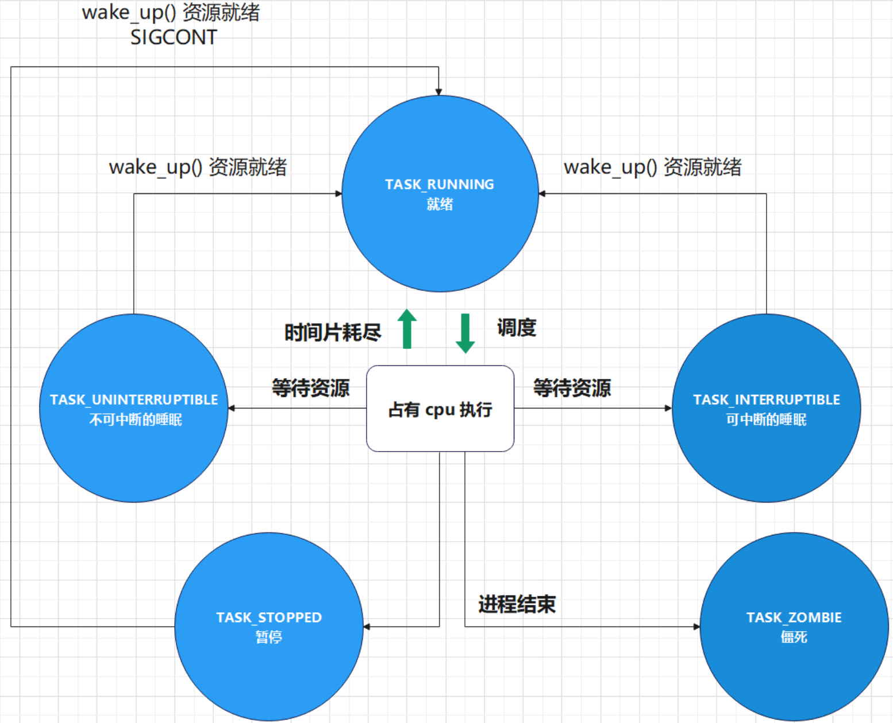

## 1.5 进程的相关命令

### 1.5.1 ps命令

- 功能

  - 显示当前进程的状态 (Process Status)

- 语法

  - ```
    ps [options]
    ```

  - 常用语法选项

    - ```
      -A：列出所有的进程
      -e：与 -A 功能类似
      -w：显示加宽可以显示较多的资讯
      -au：显示较详细的信息
      -aux：显示所有包含其他使⽤者的进程
      ```

- 示例

  - ps -aux 显示所有进程的详细信息
    - 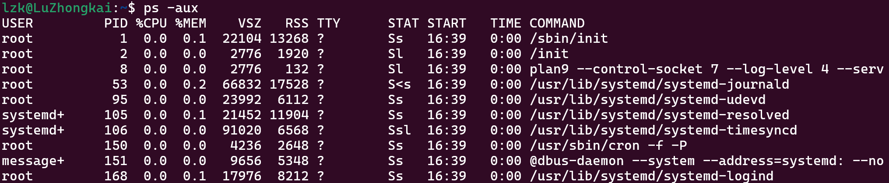
  - ps -ef 列出所有的进程，相⽐ ps -aux 信息要少⼀些
    - 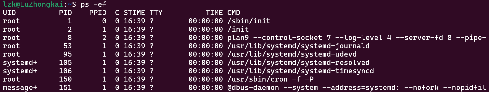
  - ps -ef | grep “可执⾏⽂件名” 根据名称查找指定名字
    - 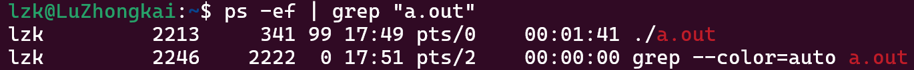

### 1.5.2 top命令

- 功能

  - 实时显示进程的信息

- 语法

  - ```
    top [-] [d delay] [q] [c] [S] [s] [i] [n] [b]
    ```

  - 选项

    - ```
      d : 改变显示的更新速度，或是在交谈式指令列 (interactive command) 按 s
      q : 没有任何延迟的显示速度，如果使⽤者是有 superuser 的权限，则 top 将会以最⾼的优先序执⾏
      c : 切换显示模式，共有两种模式，⼀是只显示执⾏档的名称，另⼀种是显示完整的路径与名称
      S : 累积模式，会将⼰完成或消失的⼦进程 (dead child process) 的 CPU time 累积起来
      s : 安全模式，将交谈式指令取消, 避免潜在的危机
      i : 不显示任何闲置 (idle) 或⽆⽤ (zombie) 的进程
      n : 更新的次数，完成后将会退出 top
      b : 批次档模式，搭配 “n” 参数⼀起使⽤，可以⽤来将 top 的结果输出到档案内
      ```

- 示例
  - 显示所有进程实时信息：top
    - 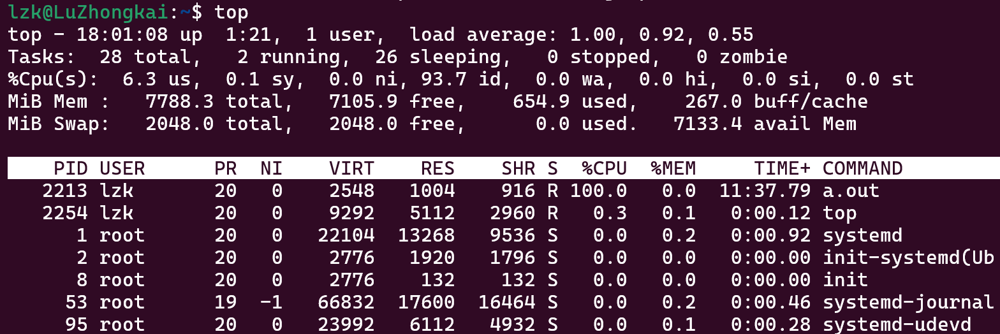
  - 显示指定进程实时信息：top -p 进程编号
    - 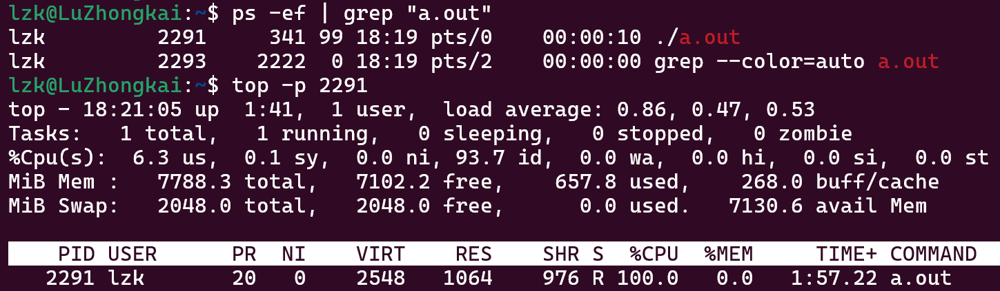

### 1.5.3 pstree命令

将所有的进程以树型结构的⽅式进⾏展示

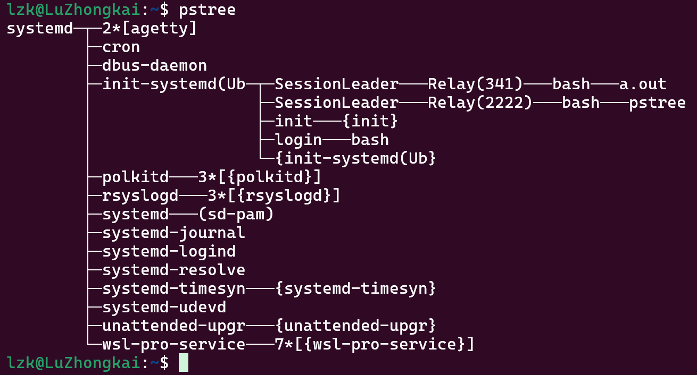

### 1.5.4 kill命令

- 功能

  - ⽤于结束进程

- 语法

  - ```
    kill -9 进程编号
    ```

- 示例

  - 结束a.out进程

    - 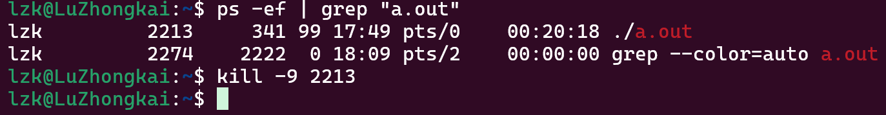

      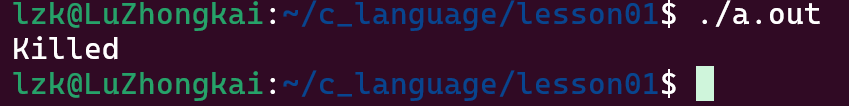

## 1.6 进程的创建

### 1.6.1 关于并发与并行

- 为了提⾼计算机执⾏任务的效率，⼀般采⽤的解决⽅案就是能够让多个任务同时进⾏，这⾥可以使⽤并发与并⾏ 两种⽅式。
  - 并⾏ : 在 cpu 多核的⽀持下，实现物理上的同时执⾏
  - 并发 : 在有限的 cpu 核⼼的情况下（如只有⼀个 cpu 核⼼) , 利⽤快速交替 (时间⽚轮转) 执⾏来达到宏观上的同时执⾏
  - 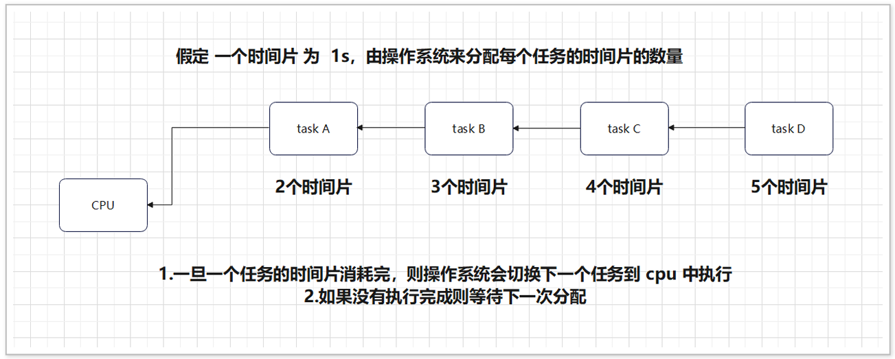
- 并⾏是基于硬件完成，⽽并发则可以使⽤软件算法来完成, 在完成任务时，可以创建多个进程并 发执⾏

### 1.6.2 fork()函数

- 创建进程的函数需要调⽤ fork() 函数, 则会产⽣⼀个新的进程

- 调⽤ fork() 函数的进程叫做 ⽗进程，产⽣的新进程则为 ⼦进程

- 头文件

  - ```
    #include <unistd.h>
    ```

- 函数原型

  - ```
    pid_t fork(void); 
    ```

- 函数功能
  - 创建⼀个⼦进程

- 函数返回值
  - 成功 : 返回给⽗进程是⼦进程 的 pid , 返回给⼦进程的是 0 
  - 失败 : 返回 -1, 并设置 errno

- 示例 : 创建⼀个⼦进程，并打印 HelloWorld

  - ```c
     #include <stdio.h>
     #include <unistd.h>
     int main(void)
     {
         pid_t cpid;
         cpid = fork();
         if (cpid == -1)
         {
             perror("fork(): ");
             return -1; 
         }   
         printf("Hello world.\n");
         return 0;
     }
    ```

    - 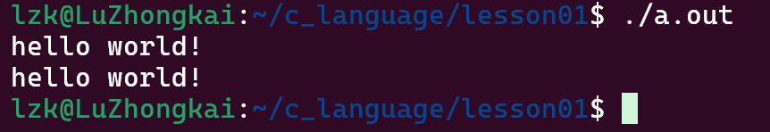

    - 之所以 显示两个 “helloworld” 是因为打印语句在两个进程中都运⾏了

### 1.6.3 关于父子进程

- 通过 fork() 函数创建⼦进程之后，有如下特点:

  - ⽗⼦进程并发执⾏, ⼦进程从 fork() 之后开始执⾏

    - 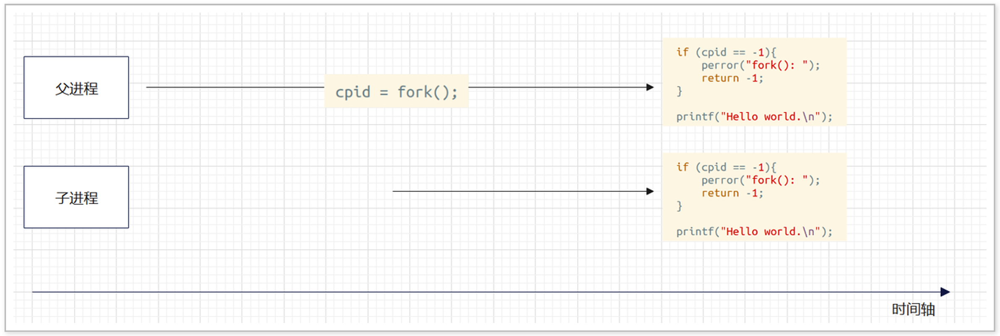

  - ⽗⼦进程的执⾏顺序由操作系统算法决定的，不是由程序本身决定

  - ⼦进程会拷⻉⽗进程地址空间的内容, 包括缓冲区、⽂件描述符等

    - 

    - 示例：父子进程数据空间拷贝，缓冲区的拷贝

      - ```
        #include <stdio.h>
        #include <sys/types.h>
        #include <unistd.h>
        int main(void)
        {
            pid_t cpid;
            write(STDOUT_FILENO,"Hello",6);
            fputs("Hello",stdout);
            cpid = fork();
            if (cpid == -1){
                perror("fork(): ");
                return -1; 
            }   
            return 0;
        }
        
        ```
        

## 1.7 进程多任务

### 1.7.1 父子进程执行不同的任务

- 使⽤ fork() 函数之后，会创建⼦进程，fork() 之后的代码会在⽗⼦进程中都执⾏⼀遍

  - 如果⽗⼦进程执⾏相同的任务，则正常执⾏

  - 如果⽗⼦进程执⾏不同的任务，则需要利⽤ fork() 函数返回值

    - ```
      #include <stdio.h>
      #include <stdlib.h>
      #include <sys/types.h>
      #include <unistd.h>
      int main(void)
      {
          pid_t cpid;
          cpid = fork();
          if (cpid == -1)
          {
              perror("[ERROR] fork()");
              exit(EXIT_FAILURE);
          }else if(cpid == 0)
          { 
              printf("Child process task.\n");
              exit(EXIT_SUCCESS);
          }
          else if (cpid > 0)
          { 
          	printf("Parent process task.\n");
          }   
          printf("Child and Process Process task.\n");
          return 0;
      }
      ```

  - 在创建多个进程时, 最主要的原则为 由⽗进程统⼀创建，统⼀管理, 不能进⾏递归创建

    - ```
      #include <stdio.h>
       #include <stdlib.h>
       #include <sys/types.h>
       #include <unistd.h>
       #include <sys/wait.h>
       int main(void)
       {
          int cpid;
          cpid = fork();
          if (cpid == -1){
              perror("fork(): ");
              exit(EXIT_FAILURE);
          }else if (cpid == 0){ 
              printf("The child process < %d > running...\n",getpid());
              sleep(2);
              printf("The child process < %d > has exited\n",getpid());
              exit(EXIT_SUCCESS);
          }else if (cpid > 0){
              cpid = fork();
              if (cpid == -1){
                  perror("fork(): ");
              }else if (cpid == 0){ 
                  printf("The child process < %d > running...\n",getpid());
                  sleep(3);
                  printf("The child process < %d > has exited\n",getpid());
                  exit(EXIT_SUCCESS);
              }else if (cpid > 0){
              }
          }
          return 0;
      }
      ```

## 1.8 进程的退出

### 1.8.1 进程的退出介绍

- 在进程结束时，需要释放进程地址空间 以及内核中产⽣的各种数据结构
- 资源的释放需要通过调⽤ exit() 函数或者 _exit() 函数来完成
- 在程序结束时，会⾃动调⽤ exit() 函数

### 1.8.2 exit() 与 _exit()

- exit 函数让当前进程退出, 并刷新缓冲区

  - exit底层调用了_exit

- _exit 函数让当前进程退出，不会刷新缓冲区

- 退出状态值

  - 正常退出：EXIT_SUCCESS
  - 异常退出：EXIT_FAILURE

- 示例: 创建⼀个⼦进程，让⼦进程延时 3 s 后退出

  - ```
    int main(void)
    {
        pid_t cpid;
        cpid = fork();
        if (cpid == -1)
        {
            perror("[ERROR] fork(): ");
            exit(EXIT_FAILURE);
        }
        else if(cpid == 0)
        { 
    		printf("Child Process < %d > running...\n",getpid());
            sleep(3);
            printf("Child Process < %d >  has exited.\n",getpid());
            exit(EXIT_SUCCESS);
        }
        else if(cpid > 0)
        { 
            sleep(5);
    	}   
        return 0;
    }
    ```

- 示例: 验证 exit 函数刷新缓冲区

  - ```
    #include <stdio.h>
    #include <stdlib.h>
    #include <sys/types.h>
    #include <unistd.h>
    int main(void)
    {
    	pid_t cpid;
        cpid = fork();
        if (cpid == -1){
            perror("[ERROR] fork(): ");
            exit(EXIT_FAILURE);
        }else if(cpid == 0){ 
            printf("I/O BUFFER.");
            sleep(3);
            exit(EXIT_SUCCESS);
        }else if(cpid > 0){ 
            sleep(5);
        } 
        return 0; 
    }
    
    ```

## 1.9 进程的等待

### 1.9.1 关于进程等待

- 在⼦进程运⾏结束后，进⼊僵死状态, 并释放资源, ⼦进程在内核中的 数据结构 依然保留 

- ⽗进程 调⽤ wait() 与 waitpid() 函数等待⼦进程退出后，释放⼦进程遗留的资源 （task_struct）

### 1.9.2 wait() 和 waitpid()

- wait()

  - 功能：让函数调⽤者进程（一般为父进程）进⼊到睡眠状态, 等待⼦进程进⼊僵死状态后，释放相关资源并返回

  - 原型：

    - ```
      pid_t wait(int *wstatus);
      ```

  - 参数：

    - wstatus : 保存⼦进程退出状态值变量的指针
    - 获取具体值需要使⽤ WEXITSTATUS() 宏定义

  - 函数返回值

    - 成功：返回退出⼦进程的 pid
    - 失败：返回 -1

  - 示例：创建⼀个⼦进程, 延时 3s 后退出, ⽗进程等待⼦进程退出

    - ```c
      #include <stdio.h>
      #include <stdlib.h>
      #include <sys/types.h>
      #include <unistd.h>
      #include <sys/wait.h>
      int main(void)
      {
          pid_t cpid;
          cpid = fork();
          if (cpid == -1)
          {
              perror("[ERROR] fork(): ");
              exit(EXIT_FAILURE);
          }
          else if(cpid == 0)
          { 
              printf("The Child process < %d > running...\n",getpid());
              sleep(3);
              exit(88);
          }
          else if(cpid > 0)
          { 
              int rpid,status = 0;
              rpid = wait(&status);
              if (rpid == -1)
              {
                  perror("[ERROR] wait() : ");
                  exit(EXIT_FAILURE);
              }
          	printf("The Child Process <%d> has exited,exit code <%d>.\n",rpid,WEXITSTATUS(status))
          }   
          return 0;
      }
      ```

  - 注意
    - 在 wait 存储在 satus 变量的值, 存储了很多信息, 通过⼀系列 W 开头的宏来解析获取
    - WEXITSTATUS(wstatus) : 获取进程退出状态值, exit 函数的参数

- waitpid()

  - waitpid 函数的功能与 wait 函数⼀样，但⽐ wait() 函数功能更强⼤, 可以理解成 wait() 底层调⽤ waitpid() 函数

  - 原型：

    - ```
      pid_t waitpid(pid_t pid, int *wstatus, int options);
      ```

  - 参数

    - pid : 进程 id
      - -1 : 可以等待任意⼦进程
      - 0 : 等待 id 为 pid 的进程
    - wstatus : 保存⼦进程退出状态值变量的指针
    - options : 选项
      -  WNOHANG （⾮阻塞等待）
        - 如果指定的子进程还没有结束，`waitpid` 不会一直等待，而是立即返回。
      - 默认选项（0）
        - 如果 options 设置为 0，waitpid 会阻塞等待，直到指定的子进程结束。

  - 返回值

    - ```
      成功:
      	>0 : 退出进程的pid
      	=0 : 在非阻塞模式下，没有进程退出
      失败：
      	-1 : 并设置errno
      ```

  - 示例 : 创建⼀个⼦进程, ⼦进程运⾏后 3s 退出, ⽗进程等待⼦进程退出

    - ```c
      #include <stdio.h>
      #include <stdlib.h>
      #include <sys/types.h>
      #include <unistd.h>
      #include <sys/wait.h>
      int main(void)
      {
          pid_t cpid;
          cpid = fork();
          if (cpid == -1)
          {
              perror("[ERROR] fork(): ");
              exit(EXIT_FAILURE);
          }
          else if(cpid == 0)
          { 
              printf("The Child process < %d > running...\n",getpid());
              sleep(3);
              exit(88);
          }
          else if(cpid > 0)
          { 
           	int rpid,status = 0;
              rpid = waitpid(-1,&status,0);
              if (rpid == -1)
              {
                  perror("[ERROR] wait() : ");
                  exit(EXIT_FAILURE);
              }
              while((rpid = waitpid(-1,&status,WNOHANG)) == 0)
              { 
              }
      		printf("Child Process <%d> has exited,exit code <%d >.\n",rpid,WEXITSTATUS(status))
         }
         return 0;
      }
      ```


## 1.10 进程的替换

- 创建⼀个进程后，pid 以及在内核中的信息保持 保持不变, 但进程所执⾏的代码进⾏替换。

- 作⽤ : 通过⼀个进程启动另外⼀个进程。

- 应⽤场景

  - Linux 终端应⽤程序，执⾏命令时，通过创建⼀个进程后，在替换成命令的可执⾏程序，再执⾏。

- 在 Linux 系统中提供了⼀组⽤于进程替换的替换，共有 6 个函数

  - 函数原型

    - ```c
      int execl(const char *pathname, const char arg, … / (char *) NULL */);
      int execlp(const char *file, const char arg, … / (char *) NULL */);
      int execle(const char *pathname, const char arg, … /, (char *) NULL, char *const envp[] */);
      int execv(const char *pathname, char *const argv[]);
      int execvp(const char *file, char *const argv[]);
      int execvpe(const char *file, char *const argv[], char *const envp[]);
      ```

  - 函数参数

    - ```
      path：可执⾏⽂件的路径名
      file：可执⾏⽂件名，可以通过 path 环境变量指定的路径
      arg：参数列表，以 NULL 结尾
      argv[]：参数数组
      envp[]：环境变量数组
      ```

  - 函数返回值

    - ```
      成功：0 
      失败：-1
      ```

- 示例：通过 execl 函数族执⾏ ls -l 命令

  - ```c
    #include <stdio.h>
    #include <stdlib.h>
    #include <unistd.h>
    int main(void)
    {
        int ret;
        ret = execl("/bin/ls","ls","-l",NULL);
        if (ret == -1)
        {
            perror("[ERROR] execl(): ");
            exit(EXIT_FAILURE);
        }   
        return 0;
    }
    ```

    

# 2.进程间通信

- linux 下的进程通信⼿段基本上是从 Unix 平台上的进程通信⼿段继承⽽来的。
- 每个进程都有⾃⼰独⽴的地址空间, 当两个不同进程需要进⾏交互时, 就需要使⽤进程间通讯
- 进程间通讯分为单个计算机的进程间通讯与局域⽹的计算机的进程间通讯
- 进程间通讯⽅式有 管道, 信号, 消息队列, 共享内存，⽹络

## 2.1 管道

- 管道分为 ⽆名管道 与 有名管道 
  - ⽆名管道⽤于⽗⼦进程之间通讯 
  - 有名管道⽤于任意进程之间通讯 
- 管道的本质是在内存建⽴⼀段缓冲区，由操作系统内核来负责创建与管理, 具体通讯模型如下:
  - 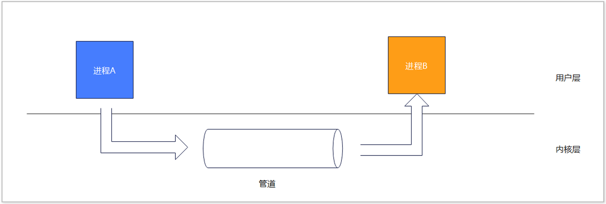

### 2.1.1 无名管道

- 特点
  - ⽆名管道属于单向通讯
  - ⽆名管道只能⽤于 ⽗⼦进程通讯
  - ⽆名管道发送端叫做 写端, 接收端叫做 读端
  - ⽆名管道读端与写端抽象成两个⽂件进⾏操作，在⽆名管道创建成功之后，则会返回读端与写端的⽂件描述符
  - 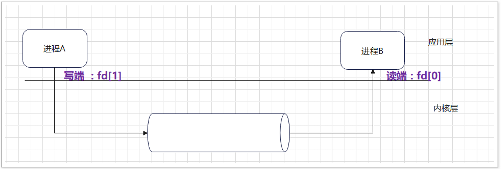

- 创建⽆名管道需要调⽤ pipe() 函数

  - 函数原型

    - ```
      int pipe(int pipefd[2]);
      ```

  - 函数参数

    - ```
      pipefd : ⽤于存储⽆名管道读端与写端的⽂件描述符的数组
      pipefd[0] : 读端⽂件描述符
      pipefd[1] : 写端⽂件描述符
      ```

  - 函数返回值:

    - ```
      成功 : 0
      失败 ：-1, 设置 errno
      ```

  - 示例 : 创建⼦进程，⽗进程通过管道向⼦进程发送 “ Hello,pipe”

    - ```c
      #include <stdio.h>
      #include <stdlib.h>
      #include <string.h>
      #include <sys/types.h>
      #include <unistd.h>
      #include <sys/wait.h>
      int main(void)
      {
          pid_t cpid;
          int ret;
          int pipefd[2];
          ret = pipe(pipefd);
          if (ret == -1)
          {
              perror("[ERROR] pipe(): ");
              exit(EXIT_FAILURE);
          }   
          cpid = fork();
          if (cpid == -1)
          {
              perror("[ERROR] fork(): ");
              exit(EXIT_FAILURE);
          }
          else if (cpid == 0)
          {
              ssize_t rbytes; 
              char buffer[64] = {0};
              close(pipefd[1]);
              rbytes = read(pipefd[0],buffer,sizeof(buffer));
              if (rbytes == -1){
                  perror("[ERROR] read(): ");
                  close(pipefd[0]);
                  exit(EXIT_FAILURE);
              }
              printf("buffer : %s\n",buffer);
              close(pipefd[0]);
          }
          else if (cpid > 0)
          { 
              ssize_t wbytes;
              char buffer[] = "hello,pipe.";
              close(pipefd[0]);
              wbytes = write(pipefd[1],buffer,strlen(buffer));
              if (wbytes == -1)
              {
                  perror("[ERROR] write(): ");
                  wait(NULL);
                  close(pipefd[1]);
                  exit(EXIT_FAILURE);
              }
              close(pipefd[1]);
              wait(NULL);
          }   
      	return 0;
      }
      ```

    - 上述代码模型图如下图所示：

      - 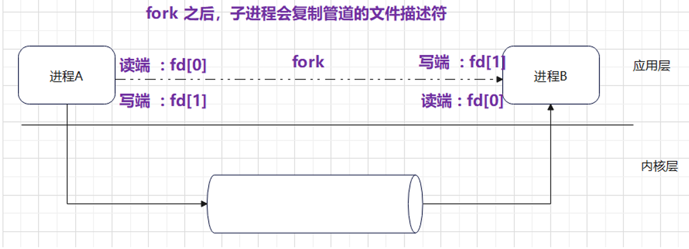

        

### 2.1.2 有名管道

# 3.进程间同步

# 4.线程

# 5.线程间同步

# 6.阻塞/非阻塞IO

# 7.多路复用IO

