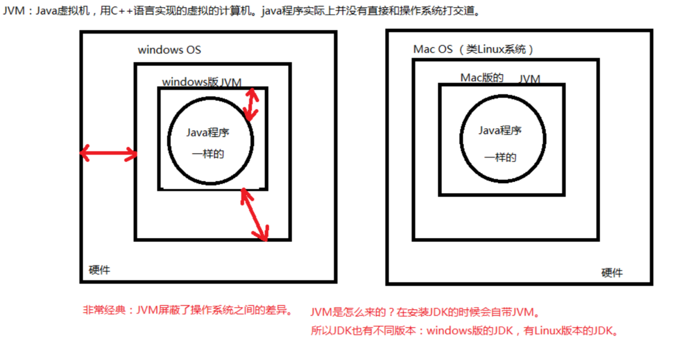
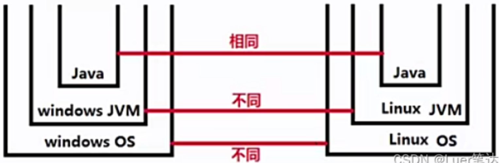
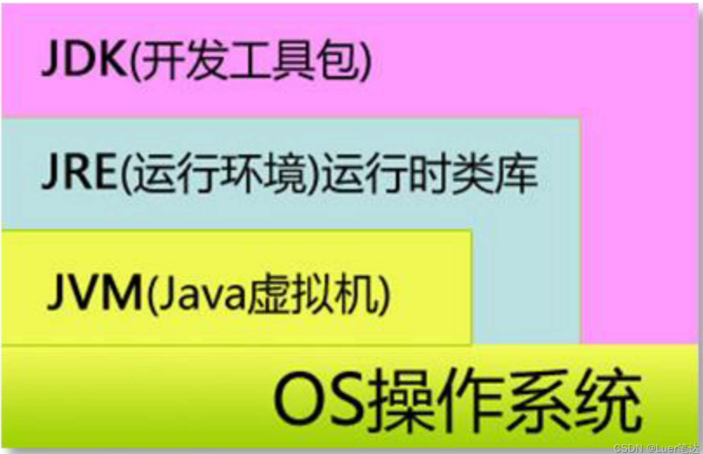
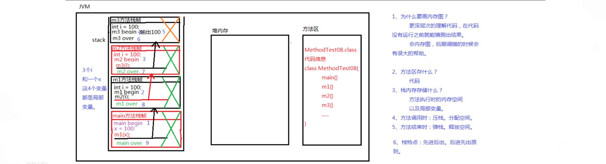
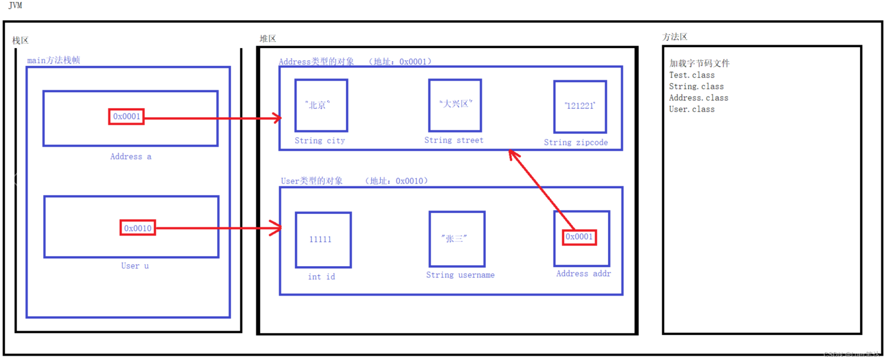
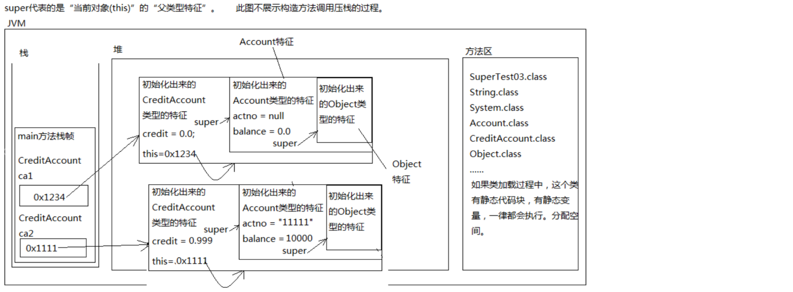

# 1.Java开发环境的搭建

## 1.1 常用的dos命令

- 什么是dos命令？

  ```
  在DOS命令窗口中才可以输入并执行DOS命令。在最初的windows计算机中没有图形界面的，只有DOS命令窗口。也就是说通过执行DOS命令窗口可以完全完成文件的新建、编辑、保存、删除等一系列操作。
  ```

- 默认情况下DOS命令窗口打开之后，定位的位置是哪里？

  ```
  C:\Users\Administrator 这是默认的当前路径
  ```

- 在DOS命令窗口中怎么复制内容？

  ```
  win11：左键直接选中，然后右键单击一下就到剪贴板里面了。
  ```

- 切换盘符

  ```
  直接输入盘符就行
  
  c: 回车
  d: 回车
  e: 回车
  f: 回车
  
  当切换到D盘根下了，那么当前路径就是：D:\>
  当前路径是当前所在的位置。
  ```

- 切换目录

  ```
  cd 路径
  ```

  - 相对路径和绝对路径

    - 相对路径

      ```
      相对路径一定是相对于当前所在“位置”而言的。从当前所在的位置作为起点。
      死记：相对路径一定是从当前位置作为起点开始找。
      ```

    - 绝对路径

      ```
      绝对路径：在windows操作系统中凡是路径起点是盘符的都是绝对路径。
      例如：
              C:\Users\Administrator
              C:\Users
              C:\Users\Public\gakataka
              C:\Windows\System32
              D:\BaiduNetdiskDownload
              D:\course\01-开课\OneNote
              
      注意：
              cd .. 回到上级路径。
              cd \ 直接回到根路径。
                  . 一个点，代表当前路径。（cd命令用不着。以后配置环境变量的时候一个点有用处。）
      ```

      

- 清屏

  ```
  cls
  ```

- 查看当前目录下的内容

  ```
  dir
  ```

- 退出DOS命令窗口

  ```
  exit
  ```

- 删除一个或者多个文件

  ```
  del
  ```

  - 删除T1.class文件

    ```
    C:\Users\Administrator>del T1.class
    ```

  - 删除所有.class结尾的文件，支持模糊匹配

    ```
    C:\Users\Administrator>del *.class
    ```

- 查看本机的IP地址

  ```
  ipconfig（查看ip地址的配置信息。）
  
  ipconfig /all 
  该命令后面添加一个/all参数可以查看更详细的网络信息。
  这个详细信息中包括网卡 的物理地址，例如：70-8B-CD-A7-BA-25
  这个物理地址具有全球唯一性。物理地址通常叫做MAC地址。
  ```

  - 什么是IP地址？有什么用呢？

    ```
    A计算机在网络当中要想定位到（连接到）B计算机，那么必须要先知道B计算机的IP地址，IP地址也可以看做计算机在同一个网络当中的身份证号（唯一标识）。
    ```

- 查看两台计算机是否可以正常通信

  ```
  ping IP地址
  ping 域名
  ping www.baidu.com
  ping 61.135.169.121  （61.135.169.121是百度的IP地址）
  ping 61.135.169.121 -t （-t参数表示一直ping）
  一直ping的目的可以查看网络是否稳定。
  
  在一个DOS命令窗口中如果有一个命令一直在执行，想强行终止怎么办？ctrl + c 组合键
  ```

## 1.2 文本编辑快捷键

掌握常用的通用的文本编辑快捷键很重要，可以大大提升开发效率。所以，必须熟练掌握，从此刻开始强迫自己少用鼠标，用组合键快捷键的方式。

| 功能                         | 快捷键                       |
| ---------------------------- | ---------------------------- |
| 复制                         | ctrl + c                     |
| 粘贴                         | ctrl + v                     |
| 剪切                         | ctrl + x                     |
| 保存                         | ctrl + s                     |
| 撤销                         | ctrl + z                     |
| 重做                         | ctrl + y                     |
| 回到行首                     | home键                       |
| 回到行尾                     | end键                        |
| 当光标在行尾，怎么选中一行？ | shift + home键               |
| 当光标在行首，怎么选中一行？ | shift + end键                |
| 回到文件头                   | ctrl + home                  |
| 回到文件尾                   | ctrl + end                   |
| 全选                         | ctrl + a                     |
| 查找                         | ctrl + f                     |
| 选中一个单词                 | 鼠标双击                     |
| 选中一行                     | 鼠标连续击3次                |
| 不用鼠标选中一个单词         | ctrl + shift + 右箭头/左箭头 |
| 代码左缩进                   | tab键                        |
| 代码右缩进                   | shift + tab键                |

## 1.3 计算机编程语言发展史

```
第一代语言：机器语言
第二代语言：汇编语言
第三代语言：高级语言

计算机编程语言是什么？是一个团队，或者一个组织制定的一套固定的语法规则，你可以学习这套语法规则，然后通过这套语法规则和计算机交互。
我们为什么要学习汉语？原因是我们学习了汉语之后，可以完成人和人的沟通。
我们为什么要学习日语？因为我们要和日本人沟通。
```

## 1.4 Java语言的概述和发展史

- JDK

  ```
  Java开发工具箱，做Java开发必须安装的，这是最根本的一个环境，JDK不是集成开发环境，JDK这个开发工具箱中是Java最核心的库。
  ```

- 98年的时候，Java升级到JDK1.2，Java被分为三大块：

  ```
  J2SE：标准版（基础，要学java，必须先学习SE。基础语法+基础库）
  J2EE：企业版（专门为企业开发软件，为企业提供解决方案。例如：OA办公系统，保险行业的系统，金融行业的系统，医院系统....）
  J2ME：微型版（专门为微型设备做嵌入式开发的。）
  ```

- java诞生十周年的时候改了名字

  ```
  JavaSE、JavaEE、JavaME。
  ```


## 1.5 Java语言的特性

- 简单性

  ```
  在Java语言当中真正操作内存的是JVM（Java虚拟机）。所有的java程序都是运行在Java虚拟机当中的。而Java虚拟机执行过程中再去操作内存。
  
  对于C或者C++来说程序员都是可以直接通过指针操作内存的。C或者C++更灵活，可以直接程序员操作内存，但是要求程序员技术精湛。C语言或者C++更有驾驭感。
  
  Java语言屏蔽了指针概念，程序员不能直接操作指针，或者说程序员不能直接操作内存。这种方式有优点也有缺点：
  优点：不容易导致内存泄漏。（简单了。）
  缺点：效率问题，包括驾驭感比较差。
  例如飞机航行：
         如果是C语言表示程序员是飞机驾驶员。
         如果是Java语言表示程序员是飞机上的乘客。
  
  Java语言底层是C++，所以JVM是用C++语言写好的一个虚拟的电脑。
  JVM在哪里？告诉大家，安装了JDK之后，JVM就代表安装好了。
  ```

- 完全面向对象

  ```
  面向对象更容易让人理解，人类通常是以对象的方式认知世界的。采用面向对象的方式可以让复杂问题简单化。  
  ```

- 健壮性

  ```
  主要是因为Java中有一种机制：自动垃圾回收机制（GC机制）。
  java语言是健壮的，相对于C语言来说，C语言没有Java健壮。
  Java不容易导致内存的泄漏，C++或者C语言使用不当时很容易导致内存泄漏。
  
  JVM负责调度GC机制。程序员不需要干涉。
  
  以上讲解中又描述了这几个术语：
      JVM（C++语言写的一个虚拟的计算机）、GC（垃圾回收机制）
  ```

- java完全/完美支持多线程并发

- 可移植性/跨平台

  ```
  java语言只要编写一次，可以做到到处运行。
  例如：java程序编写完之后，可以运行在windows操作系统上，不需要做任何改动可以直接运行在Linux操作系统上，同样也可以运行到Mac OS上面。
  
  一次编写，到处运行。（平台改变了，程序不需要改。）
  ```

  

  

  - JVM这种机制实现了跨平台，那么这种机制优点和缺点分别是什么？

    - 优点

      ```
      一次编写到处运行，可以跨平台。
      ```

    - 缺点

      ```
      麻烦，对于运行java程序来说必须先有一个JVM。就像你要想在网页上看视频，你必须先安装一个flash是一样的。
      ```

  - Java语言可以编写病毒吗？

    ```
    可以，没问题。但是很难让用户中毒。
    中毒的一般都是java程序员。所以很少有人编写java的病毒脚本。
    ```


## 1.6 JDK、JRE、JVM三者之间的关系

```
JDK：Java开发工具箱
JRE：Java运行环境
JVM：Java虚拟机

关系：JDK包括JRE，JRE包括JVM。
```



```
有单独的JDK安装包，也有单独的JRE安装包，没有单独的JVM安装包。因此JDK和JRE都是可以独立安装的，JVM是不能独立安装的。

安装JDK的时候，JRE就自动安装了，同时JRE内部的JVM也就自动安装了。
安装JRE的时候，JVM也就自动安装了。
```

- 问题：假设你在软件公司开发了一个新的软件，现在要去客户那边给客户把项目部署一下，把项目跑起来，你需要安装JDK吗？

  ```
  只需要安装JRE就行了。JRE体积很小，安装非常便捷快速。
  ```

- 问题：为什么安装JDK的时候会自带一个JRE？

  ```
  因为java程序员开发完程序之后，要测试这个程序，让这个程序运行起来，需要JRE。所以JDK安装的时候内部自带一个JRE。
  ```

## 1.7 对Java的加载与执行的理解（理论比较重要）

- java程序从编写到最终运行经历了哪些过程？

  ```
  java程序非常重要的两个阶段：编译阶段和运行阶段。
  
  注意：java程序员直接编写的java代码（普通文本）是无法执行被JVM识别的。java程序员编写的java代码这种普通文本必须经过一个编译，将这个“普通文本代码”变成“字节码”，JVM能够识别“字节码”。java代码这种普通文本变成字节码的过程，被称为：编译。
  
  java代码这种普通文本被称为：java源代码。源代码不能被JVM直接执行，需要先进行编译，生成源代码对应的“字节码”JVM可以识别的是字节码。
  ```

- 编译阶段和运行阶段可以在不同的操作系统上完成吗？

  ```
  在windows上编译，编译之后生成了“字节码”，把“字节码”放到linux上运行完全可以，因为Java是跨平台的，可以做到一次编写到处运行。    
  ```

- java源代码一旦编译之后，源代码可以删除吗？只留下字节码可以执行吗？

  ```
  完全可以执行，因为源代码不参与程序的执行过程。参与程序执行过程的是字节码。但是最好不要删除源代码。因为有可能执行结果不是你需要的，当执行结果不是你需要的时候，你可以重新打开源代码进行修改，然后重新编译生成新的字节码，再重新执行。这样会有新的执行结果。
      
  放源代码的文件扩展名必须是：xxx.java；编译生成的字节码文件扩展名是：xxx.class。
  另外需要注意的是：1个java源文件是可以编译生成多个class文件的。最终运行的是class文件。
  ```

- 字节码文件是二进制文件吗？

  ```
  字节码文件不是二进制文件。如果是二进制的话，就不需要JVM了。因为操作系统可以直接执行二进制。
  ```

- java程序从开发到最终运行经历了什么？

  - 编译期：（可以在windows上）

    ```
    第一步：在硬盘的某个位置（随意），新建一个xxx.java文件。
    第二步：使用记事本或者其它文本编辑器例如EditPlus打开xxx.java文件。
    第三步：在xxx.java文件中编写“符合java语法规则的”源代码。
    第四步：保存（一定要将xxx.java文件保存一下）。
    第五步：使用编译器（javac【JDK安装后自带】）对xxx.java文件进行编译。
    第六步：如果xxx.java文件中编写的源代码是符合语法规则的，编译会通过，如果xxx.java文件中编写的源代码违背了语法规则，那么编译器会报错，编译器报错之后class文件是不会生成的，只有编译通过了才会生成class字节码文件。并且一个java源文件是可以生成多个class文件的。（编译实质上是检查语法）
    ```

  - 运行期（JRE在起作用）：（可以在windows上，也可以在其他的OS上。）

    ```
    第七步：如果是在Linux上运行，需要将windows上生成的class文件拷贝过去，不需要拷贝源代码，真正运行的是字节码。（但是源代码也不要删除，有用）
    第八步：使用JDK自带的一个命令/工具：java（负责运行的命令/工具）执行字节码。
    第九步：往下的步骤就全部交给JVM了，就不需要程序员干涉了。JVM会将字节码文件通过类加载器装载进去，然后JVM中的解释器对字节码进行解释（解释器负责将字节码解释为1010101010..等的二进制）
    第十步：JVM会将生成的二进制码交给OS操作系统，操作系统会执行二进制码和硬件进行交互。
    ```

    ```
    注意：在以上的过程中，需要使用两个非常重要的命令，javac 命令，负责编译；java 命令，负责运行。
    
    小插曲：xxx.java源文件经过编译之后生成了A.class、B.class、C.class等文件，那么我们称A是一个类、B是一个类、C是一个类。其中A、B、C是类的名字。没有为什么，死记硬背，SUN公司的java语法就是这么规定的。
    
    以上是一个复杂的过程，那么缩减一下，程序员到底要干啥？
        新建java文件
        打开java文件
        写java源代码
        保存
        javac命令编译
        java命令运行
    总结为：编写、编译、运行
    ```

## 1.8 编写java中的第一个java程序：HelloWorld

这个程序不需要理解，主要是为了搭建java的开发环境，测试java的环境是否能用。

- 第一步：安装文本编辑器（EditPlus）

- 第二步：安装JDK（先下载JDK）

  ```
  安装JDK13，直接下一步就行。JDK13安装的时候内置了一个JRE，独立于JDK之外的JRE并没有生成。对于java13来说，如果你希望生成一个独立于JDK之外的JRE的话需要执行特殊的命令。这里先不讲，后期用到的时候再说。
  注意：JDK8安装的时候，不仅JDK内置了一个JRE，而且还会在JDK目录之外 独立的生成一个单独的JRE。（以前低版本的时候，JRE实际上是有2个。）一个是JDK内置的，一个是独立于JDK之外的。
  JDK的bin目录下有：javac.exe 负责编译、java.exe 负责运行。
  ```

- 第三步：写代码

  ```
  括号：[]、()、{}都要成对写。
  ```

- 第四步：编译

  ```
  需要使用的命令是：C:\Program Files\Java\jdk-13.0.2\bin\javac.exe。这个命令需要先测试一下，打开DOS命令窗口，看看javac命令是否可用。
  
  C:\Users\Administrator>javac
  'javac' 不是内部或外部命令，也不是可运行的程序或批处理文件。
  
  这说明：windows操作系统没有发现“javac.exe”命令在哪里。 windows操作系统没有找到javac.exe文件在哪。
  ```

  - 为什么ipconfig、ping等命令可以使用呢，为什么javac用不了？

    ```
    我们发现windows操作系统中有这样一个环境变量，名字叫做：path。
    并且发现path环境变量的值是：C:\Windows\system32;%SystemRoot%;等........
    我们还发现了在：C:\Windows\System32 这个目录下存在：ipconfig.exe
    
    注意：修改完环境变量之后，DOS命令窗口必须关闭重新打开才会起作用。
    
    将path环境变量中的:C:\windows\system32; 删除之后再测试：
    C:\Users\Administrator>ipconfig
    'ipconfig' 不是内部或外部命令，也不是可运行的程序或批处理文件。
    ```

  - 配置环境变量path的步骤：

    ```
    桌面计算机上右键-->属性-->高级系统设置-->环境变量。找到path，鼠标双击！path环境变量当中都是路径，路径和路径之间必须采用“半角的分号”分隔。为了让javac.exe能用，我们将C:\Program Files\Java\jdk-13.0.2\bin配置到path当中。
    
    注意：环境变量包括“系统变量”和“用户变量”
            系统变量：范围比较大，系统变量会让计算机所有用户都起作用。
            用户变量：范围比较小，这个变量只是作用于当前用户。
    ```

  - 怎么查看编译器版本？

    ```
    C:\Users\Administrator>javac -version
    javac 13.0.2    
    ```

  - 怎么查看java虚拟机的版本？

    ```
    C:\Users\Administrator>java -version
    java version "13.0.2" 2020-01-14
    Java(TM) SE Runtime Environment (build 13.0.2+8)
    Java HotSpot(TM) 64-Bit Server VM (build 13.0.2+8, mixed mode, sharing)
    ```

  - 问题1：path环境变量的作用是什么？

    ```
    path环境变量的作用就是给windows操作系统指路的。告诉windows操作系统去哪里找这个命令文件。path环境变量中有很多很多的路径，路径和路径之间用半角分号分隔。
    
    path=A;B;C;D......。path是环境变量的名字。A;B;C;D......是环境变量path的值。
    ```

  - 问题2：path环境变量是java中的机制，还是windows操作系统中的机制？

    ```
    path环境变量本质上是隶属于windows操作系统的，和java没有关系。java只不过用了一下path环境变量。
            
    要学会融会贯通，学一通百。以后在安装其他软件之后，希望在DOS命令窗口中使用该软件的某个命令的时候，如果出现“命令找不到错误了”，这个时候希望大家能够想起来配置环境变量path。
    ```

  - javac命令用法：

    ```
    javac java源文件的路径
    ```

- 第五步：运行

  ```
  运行的前提是：class文件（字节码）生成了。没有字节码文件程序是无法运行的。
  使用JDK的bin目录下的java.exe命令来运行。先在DOS命令窗口中测试java.exe这个命令是否可用！java -version
  ```

  - java命令用法：

    ```
    java 类名
    
    注意：java这个命令，后面跟的是“类名”，而绝对不能跟“文件路径”。
        对于这个字节：Test.class，应该：java Test
        对于这个字节码：A.class ，应该 java A
        对于这个字节码：Hello.class，应该java Hello
    
    运行java程序的步骤：
    第一步（必须这样做，这是必须的，先记住）：先使用cd命令切换到Test.class文件所在的路径。
    第二步：执行java Test。
    ```

## 1.9 到目前为止我们一共配置了哪些环境变量？

```
到目前为止，我们只配置了一个环境变量path，并且这个环境变量path和java实际上没关系，是人家windows操作系统的机制。

对于Java的JDK所属的环境变量，有一个叫做：JAVA_HOME，目前我们不需要配置，不配置这个环境变量也不会影响当前java程序的运行。但是后期学习到JavaWEB的时候需要安装Tomcat服务器，那个时候JAVA_HOME就必须配置了。

那么除了JAVA_HOME环境变量之外，JDK相关的环境变量还有classpath。
```

## 1.10 “java HelloWorld”的执行过程以及原理

- java HelloWorld 敲完回车，都发生了什么？

  - 第一步：会先启动JVM（java虚拟机）

  - 第二步：JVM启动之后，JVM会去启动“类加载器classloader”

    ```
    类加载器的作用：加载类的。本质上类加载器负责去硬盘上找“类”对应的“字节码”文件。
    假设是“java HelloWorld”，那么类加载器会去硬盘上搜索：HelloWorld.class文件。
    假设是“java Test”，那么类加载器会去硬盘上搜索：Test.class文件。
    ```

  - 第三步：

    ```
    类加载器如果在硬盘上找不到对应的字节码文件，会报错（错误: 找不到或无法加载主类）。
    类加载器如果在硬盘上找到了对应的字节码文件，类加载器会将该字节码文件装载到JVM当中，JVM启动“解释器”将字节码解释为“101010000...”这种二进制码，操作系统执行二进制码和硬件交互。
    ```

- 默认情况下，类加载器去硬盘上找“字节码”文件的时候，默认从哪找？

  ```
  默认情况下类加载器（classloader）会从当前路径下找。  
  ```

- 能不能给类加载器指定一个路径，让类加载器去指定的路径下加载字节码文件？

  ```
  可以的。但是我们需要设置一个环境变量，叫做：classpath；  
  classpath是一个环境变量，是给“类加载器”指路的；
  classpath环境变量不属于windows操作系统，classpath环境变量隶属于java。
  classpath环境变量是java特有的。
          classpath=A路径;B路径;C路径.....
          classpath是一个变量名
          A路径;B路径;C路径.....是变量值
  ```

- 配置classpath环境变量：

  ```
  计算机-->右键-->属性-->高级系统设置-->环境变量-->新建...
      
  注意：变量名不能随意写：大小写无所谓，但必须叫做：classpath
  
  例如：随意配置classpath=D:\course，重启CMD。
  
  配置了classpath=D:\course之后，类加载器只会去D:\course目录下找“xxx.class”文件，不再从当前路径下找了。
          
  结论是：到目前为止，classpath环境变量不需要配置。但必须理解classpath环境变量是干什么的。   
  ```

- classpath环境变量的作用是什么？

  ```
  是给类加载器指路的。
  在没有配置环境变量classpath的时候，默认从当前路径下加载。
  如果配置了环境变量classpath的话，就只能从指定的路径下加载了。
  ```

## 1.11 JDK13新特性

```
注意：了解即可，不需要掌握，现阶段也不需要这样写。

在高版本的JDK当中，有这样的一个新特性，可以直接这样一步到位：
    java x/y/z/xxx.java（java后面直接加java源文件的路径）。

这个特性是为了简化开发而提出，但实际上底层的实现原理还是和以前一样的，以上命令在执行过程中，还是会先进行编译，然后再运行。并且以上的运行方式，编译生成的class文件在硬盘上不存在，看不到。
```

## 1.12 Java中的注释

```
// 单行注释

/*
   多行注释
*/

/**
* javadoc注释：这里的注释信息可以自动被javadoc.exe命令解析提取并生成到帮助文档当中。
*/
```

- 注释是对java源代码的解释说明。注释可以帮程序员更好的理解程序。

- 注释信息只保存在java源文件当中，java源文件编译生成的字节码class文件，这个class文件中是没有这些注释信息的。

- 在实际的开发中，一般项目组都要求积极的编写注释。这也是一个java软件工程师的基本素养。

## 1.13 一些注意事项

- 在java中任何有效的代码必须写到“类体”当中，最外层必须是一个类的定义。

- public表示公开的，class表示定义一个类，后跟的是一个类名。类名后面必须是一对大括号，这一对大括号被称为“类体”

- main方法（程序的入口，SUN公司java语言规定的），JVM在执行程序的时候，会主动去找这样一个方法。没有这个规格的方法，程序是无法执行的。任何一个程序都要有一个入口，没有入口进不来，无法执行。

  - 如果完全不写main方法，编译能通过，但是无法运行。

  - main方法前的public不能丢，若丢了public，编译能通过，但是无法运行。

  - args可以改名字，随意，对于主方法来说只有这个位置可以改，其它位置不能动。

  - main方法中什么都不写也可以编译通过并运行。

  - 任何方法必须放到“类体”中，不能放到“类体”外面。

  - 类体当中应该是方法，而不是直接的java语句，否则编译直接报错。

## 1.14 一些结论

- 一个java源文件中可以定义多个class。

- 在源文件中只要有一个class的定义，那么必然会对应生成一个class文件。

- public的类不是必须的，可以没有，但如果有的话，public修饰的类名必须和源文件名保持一致。public的类有也只能有1个。

# 2.Java中的标识符与关键字

## 2.1 标识符

- 标识符可以标识什么，什么是标识符？

  ```
  可以标识：类名、方法名、变量名、接口名、常量名……等。
  凡是程序员自己有权利命名的单词都是标识符。
  ```

- 标识符的命名规则（命名规则属于语法机制，必须遵守，不遵守命名规则表示不符合语法，这样编译器会报错）。
  - 标识符只能由数字、字母（包括中文）、下划线_、美元符号$组成，不能含有其它符号。
  - 标识符不能以数字开头。
  - 关键字不能做标识符。例如：public class static void 都是关键字，关键字是不能做标识符的。
  - 标识符是严格区分大小写的。大写A和小写a不一样。
  - 标识符理论上是没有长度限制的。

- 标识符的命名规范

  - 见名知意；

  - 遵循驼峰命名方式：
    - 类名和接口名首字母大写，后面每个单词首字母大写。如StudentTest、UserTest。
    - 变量名和方法名首字母小写，后面每个单词首字母大写。如studentAge，userName。

  - 所有“常量”名：全部大写，并且单词和单词之间采用下划线衔接。

    ```
    USER_AGE ：用户年龄
    MATH_PI：固定不变的常量3.1415926.....
    ```

## 2.2 关键字

- 什么是关键字？

  ```
  在SUN公司开发Java语言的时候，提前定义好了一些具有特殊含义的单词，这些单词全部小写，具有特殊含义，不能用作标识符。
  注意：java语言中是严格区分大小写的。public和Public不一样。Class和class不一样。static和Static也不一样。
  ```

- 那么关键字有哪些呢，我们需要背会吗？需要单独去记忆吗？

  ```
  关键字：public、static、void、class、byte、short、int、long、float、double、boolean、char、true、false、if、while、for、private、protected........
  
  对于这些关键字来说不需要单独花费时间去记忆，随着后面程序的积累，会接触到所有的关键字。
  ```

# 3.Java中的变量

## 3.1 字面量

- 开发软件是为了解决现实世界中的问题。而现实世界当中，有很多问题都是使用数据进行描述的。所以软件执行过程中最主要就是对数据的处理。软件在处理数据之前需要能够表示数据，在java代码中使用字面量来表示数据。
- 在java语言中“数据”被称为“字面量”。例如：10、1.23、true、false、'a'、"abc"。以上这些都是数据，在程序中都被叫做“字面量”。
- 字面量可以分为很多种类：
  - 整数型字面量：1 2 3 100 -100 -20 ....
  - 浮点型字面量：1.3 1.2 3.14.....
  - 布尔型字面量：true、false
  - 字符型字面量：'a'、'b'、'中'
  - 字符串型字面量："abc"、"a"、"b"、"中国"。
- 其中字符型和字符串型都是描述了现实世界中的文字。
- 需要注意的是：所有的字符型只能使用单引号括起来，所有的字符串型只能使用双引号括起来。字符型一定是单个字符才能成为“字符型”。在语法级别上区分字符型和字符串型的方法是主要看是双引号还是单引号。单引号的一定是字符型。双引号的一定是字符串型。

## 3.2 变量

- 变量的概念
  - 变量其实就是内存当中存储数据的最基本的单元，变量就是一个存储数据的盒子。

- 数据类型的作用
  - 在java语言当中任何数据都是有数据类型的，如byte、short、int、long、float、double、boolean、char。
  - 不同的数据类型，在内存中分配的空间大小不同。也就是说，Java虚拟机到底给这个数据分配多大的空间，主要还是看这个变量的数据类型。根据不同的类型，分配不同大小的空间。

- 变量的三要素

  - 变量的三要素为：变量的数据类型、变量的名字、变量中保存的值。
  - 类型决定空间的大小。
  - 起个名字是为了以后方便访问。（以后在程序中访问这个数据是通过名称来访问的，变量名属于标识符）。
  - 值是变量保存的数据。

- 变量声明/定义的语法格式

  - 数据类型 变量名;

    ```
    例如：int userAge;
    ```

- 变量的赋值

  - 在java语言中有一个规定，变量必须先声明，再赋值才能访问（没有值相当于这个空间没有开辟）。
  - 在java语言中使用一个运算符，叫做“=”，这个运算符被称为赋值运算符。
  - 赋值运算符“=”的运算特点是：等号右边先执行，执行完之后赋值给左边的变量。
  - 变量可以一边声明一边赋值，如：String userName = "Joker";

- 变量的分类（“死记硬背”）

  - 变量根据出现的位置进行划分：
    - 在方法体当中声明的变量：局部变量。
    - 在方法体之外，类体内声明的变量：成员变量。
  - 重点依据是：声明的位置。
  - 注意：局部变量只在方法体当中有效，方法体执行结束该变量的内存就释放了。
- 变量的作用域
  - 变量的作用域是指：变量的有效范围。
  - 关于变量的作用域，可以记住一句话：出了大括号就不认识了。（死记这句话。）
  - java中有一个很重要的原则：
    - 就近原则。（不仅java中是这样，其它编程语言都有这个原则。）
    - 哪个离我近，就访问哪个。

- 一些注意事项

  - 方法体中的代码遵循自上而下的顺序执行。
  - 在同一个域当中，变量名不能重名、不能重复声明。
  - 可以一行声明多个变量。

# 4.Java中的数据类型

## 4.1 数据类型

- 数据类型的作用

  - 数据类型用来声明变量，程序在运行过程中根据不同的数据类型分配不同大小的空间。

    ```
    例如：
    int i = 10;        
    double d = 1.23;        
    // i变量和d变量类型不同，空间大小不同。
    ```

- 数据类型在Java中包括两种

  - 基本数据类型（4大类，8小种）

    - 整数型

      ```
      byte,short,int,long （没有小数的） 
      ```

    - 浮点型

      ```
      float,double （带有小数的）
      ```

    - 布尔型

      ```
      boolean
      只有两个值true和false，true表示真，false表示假
      ```

    - 字符型

      ```
      char
      java中规定字符型字面量必须使用单引号括起来。属于文字。
      ```

  - 引用数据类型

    - 字符串型String属于引用数据类型，String字符串不属于基本数据类型范畴。
    - java中除了基本数据类型之外，剩下的都是引用数据类型。引用数据类型后期面向对象的时候才会接触。

- 各数据类型当中的区别

  - 整数型byte short int long有什么区别，浮点型float和double有什么区别？占用的空间大小不同。

    | **类型** | **占用字节数量（Byte）** |
    | -------- | ------------------------ |
    | byte     | 1                        |
    | short    | 2                        |
    | int      | 4                        |
    | long     | 8                        |
    | float    | 4                        |
    | double   | 8                        |
    | boolean  | 1                        |
    | char     | 2                        |

  - 关于计算机的存储单位

    ```
    1B = 8b
    1KB = 1024Byte = 2^10B
    1MB = 1024KB = 2^20B
    1GB = 1024MB = 2^30B
    1TB = 1024GB = 2^40B
    =========================================================================================
    byte b = 2; 在计算机中是这样表示的：												00000010
    short s = 2; 在计算机中是这样表示的：									00000000 	00000010
    int i = 2;在计算机中是这样表示的：				00000000 	00000000 	00000000 	00000010
    ……
    ```

- 必须熟记的几个取值范围

  - short和char实际上容量相同，不过char可以表示更大的数字。因为char表示的是文字，文字没有正负之分，所以char可以表示更大的数字。

    | byte  | -128 ~ 127                                  |
    | ----- | ------------------------------------------- |
    | short | -32768 ~ 32767（可以表示65536个不同的数字） |
    | int   | -2147483648 ~ 2147483647                    |
    | char  | 0~65535（可以表示65536个不同的数字）        |

- 字符编码

  - 对于8种基本数据类型来说：其中byte,short,int,long,float,double,boolean，这7种类型计算机表示起来比较容易，因为他们都是数字。其中布尔类型只有两个值true和false，实际上true和false分别在C++中对应的是1和0，1为true，0为false。

  - 对于char类型来说计算机表示起来比较麻烦，因为char对应的是文字，每一个国家的文字不一样，文字不能直接通过“自然算法”转换成二进制。这个时候怎么办？字符编码诞生了。

  - 字符编码是人为的定义的一套转换表。在字符编码中规定了一系列的文字对应的二进制。字符编码其实本质上就是一本字典，该字典中描述了文字与二进制之间的对照关系。字符编码是人为规定的。（是某个计算机协会规定的。）

  - 字符编码涉及到编码和解码两个过程，编码和解码的时候必须采用同一套字符编码方式，不然就会出现乱码。

  - 关于字符编码的发展过程：

    - 起初的时候计算机是不支持文字的，只支持科学计算。实际上计算机起初是为了战争而开发的，计算导弹的轨道....后来随着计算机的发展，计算机开始支持文字，最先支持的文字是英文，英文对应的字符编码方式是：ASCII码。ASCII码采用1byte进行存储，因为英文字母是26个。（键盘上所有的键全部算上也超不过256个。1byte可以表示256种不同的情况。所以英文本身在计算机方面就占有优势。）

      ```
      'a' --(采用ASCII码进行编码)-> 01100001
       01100001 --(采用ASCII码进行解码)-> 'a'
      ```

    - 如果编码和解码采用的不是同一个编码方式，会出现乱码。随着计算机语言的发展，后来国际标准组织制定了ISO-8859-1编码方式，又称为latin-1编码方式，向上兼容ASCII码，但不支持中文，后来发展到亚洲，才支持中文，日文，韩文....

    - 中文这块的编码方式：GB2312<GBK<GB18030 （容量的关系），这三种编码方式是简体中文。

      - 繁体中文：big5（台湾使用的是大五码。）

  - 在java中，java语言为了支持全球所有的文字，采用了一种字符编码方式叫做unicode编码。unicode编码统一了全球所有的文字，支持所有文字。UTF表示Unicode 转换格式，具体的实现包括：UTF-8 UTF-16 UTF-32....

## 4.2 原码、反码、补码

- 计算机中实际只存储补码。

- 正数的原码=反码=补码；

- 负数的如下计算：

  - 原码→反码：符号位不变，其余取反。

  - 反码→补码：反码+1。

    ```
    byte b = (byte)150; 这个b是多少？
    int类型的4个字节的150的二进制码是：
        00000000 00000000 00000000 10010110
    将以上的int类型强制类型转为1个字节的byte即砍掉前三个字节，最终在计算机中的二进制码是：
        10010110
    千万要注意：计算机永远存储的都是二进制补码形式。也就是说上面10010110 这个是一个二进制补码形式，你可以采用逆推导的方式推算出这个二进制补码对应的原码是啥！
        10010110 → 二进制补码形式
        10010101 → 二进制反码形式
        11101010 → 二进制原码形式 即-106
    ```

## 4.3 八种基本数据类型详解

- 字符型 char
  - char类型的字面量是使用单引号括起来的单个字符，char可以存储一个汉字。
  - 当一个整数赋值给char类型变量的时候，会自动转换成char字符型，最终的结果是一个字符。

- 整数型 byte short int long

  - 重要结论（熟记）：在任何情况下，整数型的“字面量/数据”默认被当做int类型处理。如果希望该“整数型字面量”被当做long类型来处理，需要在“字面量”后面添加L/l，建议使用大写L，因为小写l和1傻傻分不清。

  - 如果整数型字面量没有超出 byte,short,char 的取值范围，可以直接将其赋值byte,short,char 类型的变量；

- 浮点型 float double

  - 重要结论（熟记）：在任何情况下，浮点型的“字面量/数据”默认被当做double类型处理。如果希望该“浮点型字面量”被当做float类型来处理，需要在“字面量”后添加F/f。

  - 虽然long类型占用8个字节，float类型占用4个字节。但任意一个浮点型都比整数型容量大。

  - 小容量向大容量转换称为自动类型转换，容量从小到大的排序为：

    - byte < short(char) < int < long < float < double，其中 short和 char 都占用两个字节，但是char 可以表示更大的正整数；

    - 大容量转换成小容量，称为强制类型转换，编写时必须添加“强制类型转换符”，但运行时可能出现精度损失，谨慎使用；

- 布尔型 boolean
  - 在java语言中boolean类型只有两个值，没有其他值：true和false。不像C或者C++，C语言中1和0也可以表示布尔类型。 
  - boolean类型在实际开发中使用在逻辑判断当中，通常放到条件的位置上（充当条件）。
  - 八种基本数据类型中，除 boolean 类型不能转换，剩下七种类型之间都可以进行转换；

## 4.4 综合的看一下，在类型转换的时候需要遵循哪些规则

- 八种基本数据类型中，除 boolean 类型不能转换，剩下七种类型之间都可以进行转换；


- 如果整数型字面量没有超出 byte,short,char 的取值范围，可以直接将其赋值给byte,short,char 类型的变量；


- 小容量向大容量转换称为自动类型转换，容量从小到大的排序为：

  - byte < short(char) < int < long < float < double，其中 short和 char 都占用两个字节，但是char 可以表示更大的正整数；

- 大容量转换成小容量，称为强制类型转换，编写时必须添加“强制类型转换符”，但运行时可能出现精度损失，谨慎使用；


- 多种数据类型混合运算，各自先转换成容量最大的那一种再做运算，但是byte,short,char 类型混合运算时，先各自转换成 int 类型再做运算；


所有的笔试题都超不出以上的5条规则。死记硬背。

```
注： 
①byte a = 10;
// 编译不会报错，因为编译器知道10是一个未超过byte范围的整型字面量。

②int a = 10; byte b = a; 
// 编译会报错类型不兼容，因为在第二个语句中编译器只知道a是一个整型变量，并不知道a具体的值，实际的值只有在运行时才知道。   

例如：byte a = 3;
这行代码为什么可以编译通过呢？
按说 3 是 int 类型，而 a 变量是 byte 类型，大容量转换成小容量不是应该使用强制类型转换符吗，这里没有使用，也可以编译通过。
这是因为 Java 中固定的语法规则规定的，当一个整数字面量没有超出 byte 类型取值范围时，可以直接赋值给 byte 类型的变量，其实这一设计也是为了方便程序员写代码。
另外，我们如果基于以上代码再添加这行代码：byte b = a + 4;这行代码为什么又编译报错了呢？
按说 a 是 3，3+4 是 7，这个 7 并没有超出 byte 取值范围，为什么编译报错呢？
这是因为 byte 类型的 a 和 int 类型的 4 求和，结果为 int 类型，并且对于以上代码来说 a 是一个变量，变量就是一个不确定的值，所以编译器会认为 a + 4 可能会超出 byte 取值范围，所以编译报错了。
如果我们程序是这样写的：byte b = 3 + 4;对于这行代码来说，编译又通过了，这是因为 3和 4 不是变量，都是确定的值，编译器会直接检测出 3+4 等于 7，这个 7 并没有超出范围，所以编译又通过了。
```

# 5.Java中的运算符

- 算术运算符

  ```
  +    -    *    /    %    ++    --
  ```

- 关系运算符

  ```
  >    >=    <    <=    ==    != 
  一定要记住一个规则：所有的关系运算符的运算结果都是布尔类型，不是true就是false，不可能是其他值。
  ```

- 逻辑运算符

  | &    | 逻辑与 |
  | ---- | ------ |
  | \|   | 逻辑或 |
  | !    | 逻辑非 |
  | &&   | 短路与 |
  | \|\| | 短路或 |

  - 逻辑运算符两边要求都是布尔类型，并且最终的运算结果也是布尔类型。
  - 短路与&& 和 逻辑与&有什么区别？
    - 首先这两个运算符的运算结果没有任何区别，完全相同。只不过“短路与&&”会发生短路现象。右边表达式不执行，这种现象叫做短路现象。
  - 什么时候使用&&，什么时候使用& ？
    - 从效率方面来说，&&比&的效率高一些。因为逻辑与&不管第一个表达式结果是什么，第二个表达式一定会执行。
    - 以后的开发中，短路与&&和逻辑与还是需要同时并存的。大部分情况下都建议使用短路与&&，只有当既需要左边表达式执行，又需要右边表达式执行的时候，才会选择逻辑与&。

- 赋值运算符

  ```
  =        +=        -=        *=        /=        %=
  ```

  - 赋值运算符包括“基本赋值运算符”和“扩展赋值运算符”。

    - 基本赋值运算符： =


    - 扩展的赋值运算符：+=        -=        *=        /=        %=
    
      - 注意：扩展赋值运算符在编写的时候，两个符号之间不能有空格。
    
      - 很重要的语法机制：使用扩展赋值运算符的时候，永远都不会改变运算结果类型。


      ```
      例1：byte x = 100;  x += 1;
      x自诞生以来是byte类型，那么x变量的类型永远都是byte。不会变。不管后面是多大的数字。
      
      例2：x += 1 和 x = x + 1 其实不一样：
      byte x = 100; // 100没有超出byte类型取值范围，可以直接赋值
      //x = x + 1; // 编译器检测到x + 1是int类型，报错: 不兼容的类型: 从int转换到byte可能会有损失
       x += 1; // 使用扩展赋值运算符可以就可以编译通过顺利运行
      所以得出结论：x += 1 和 x = x + 1不一样。其实 x += 1 等同于：x = (byte)(x + 1);
      ```

- 三目运算符

  - 语法格式：布尔表达式 ? 表达式1 : 表达式2
    - 注意：冒号左右表达式数据类型相一致。

  - 执行原理：
    - 布尔表达式的结果为true时，表达式1的执行结果作为整个表达式的结果。
    - 布尔表达式的结果为false时，表达式2的执行结果作为整个表达式的结果。

- 字符串连接运算符

  - +运算符在java语言中有两个作用。
    - 作用1：求和
    - 作用2：字符串拼接

  - 什么时候求和？什么时候进行字符串的拼接呢？

    - 当 + 运算符两边都是数字类型的时候，求和。
    - 当 + 运算符两边的“任意一边”是字符串类型，那么这个+会进行字符串拼接操作。
  - 一定要记住：字符串拼接完之后的结果还是一个字符串。

# 6.Java中的控制语句

## 6.1 怎么接受用户键盘输入

```java
java.util.Scanner s = new java.util.Scanner(System.in);

// 接收整数
int i = s.nextInt()

// 接收字符串
String str = s.next();
```

## 6.2 控制语句

### 6.2.1 选择语句

- if语句

  - 语法格式1：

    ```
    if(布尔表达式){
    	java语句;
    	java语句;
    }
    这里的一个大括号{} 叫做一个分支。
    ```

    - 执行原理：如果布尔表达式的结果是true，则执行大括号中的程序，否则大括号中代码不执行。

  - 语法格式2：

    ```
    if(布尔表达式){    // 分支1
        java语句;   
    }else{           // 分支2
        java语句;
    }
    ```

    - 执行原理：如果布尔表达式的结果是true，则执行分支1，分支2不执行。如果布尔表达式的结果是false，分支1不执行，执行分支2.以上的这个语句可以保证一定会有一个分支执行。

  - 语法格式3：

    ```
    if(布尔表达式1){     // 分支1
    	java语句;
    }else if(布尔表达式2){ // 分支2
    	java语句;
    }else if(布尔表达式3){
    	java语句;
    }else if(布尔表达式4){
    	java语句;
    }
    ....
    ```

    - 执行原理：先判断“布尔表达式1”，如果“布尔表达式1”为true，则执行分支1，然后if语句结束了。当“布尔表达式1”结果是false，那么会继续判断布尔表达式2的结果，如果布尔表达式2的结果是true，则执行分支2，然后整个if就结束了。从上往下依次判断，主要看第一个true发生在哪个分支上。第一个true对应的分支执行，只要一个分支执行，整个if结束。

  - 语法格式4：

    ```
    if(布尔表达式1){     // 分支1
    	java语句;
    }else if(布尔表达式2){ // 分支2
    	java语句;
    }else if(布尔表达式3){
    	java语句;
    }else if(布尔表达式4){
    	java语句;
    }else{
    	java语句; // 以上条件没有一个成立的。这个else就执行了。
    }
    ```

  - 注意：

    - 对于if语句来说，在任何情况下只能有1个分支执行，不可能存在2个或者更多个分支执行。if语句中只要有1个分支执行了，整个if语句就结束了。（对于1个完整的if语句来说的。）  
    - 以上4种语法机制中，凡是带有else分支的，一定可以保证会有一个分支执行。以上4种当中，第一种和第三种没有else分支，这样的语句可能会导致最后一个分支都不执行。第二种和第四种肯定会有1个分支执行。
    - 当分支当中“java语句;”只有1条，那么大括号{}可以省略，但为了可读性，最好不要省略。（有的程序员在编写代码的时候，可能会故意将大括号{}省略，你能看懂就行。）
    - 控制语句和控制语句之间是可以嵌套的，但是嵌套的时候我们最好一个语句一个语句进行分析，不要冗杂在一起分析。

    

- switch语句

  - switch语句也是选择语句，也可以叫做分支语句。

  - 语法格式：

    ```
    switch(值){
        case 值1:
            java语句;
            java语句;...
        	break;
        case 值2:
            java语句;
            java语句;...
            break;
        case 值3:
            java语句;
            java语句;...
            break;
        default:
        	java语句;
    }
    ```

    - 以上是一个完整的switch语句，其中break;语句不是必须的。default分支也不是必须的。

  - switch语句支持的值有哪些？
    - 支持int类型以及String类型。但一定要注意JDK的版本，JDK8之前不支持String类型，只支持int。在JDK8之后，switch语句开始支持字符串String类型。switch语句本质上是只支持int和String，但是byte,short,char也可以使用在switch语句当中，因为byte short char可以进行自动类型转换。
    - switch语句中“值”与“值1”、“值2”比较的时候会使用“==”进行比较。

  - switch语句的执行原理：
    - 拿“值”与“值1”进行比较，如果相同，则执行该分支中的java语句，然后遇到"break;"语句，switch语句就结束了。如果“值”与“值1”不相等，会继续拿“值”与“值2”进行比较，如果相同，则执行该分支中的java语句，然后遇到break;语句，switch结束。若所有的case都没有匹配成功，那么最后default分支会执行。
    - 注意：如果分支执行了，但是分支最后没有“break;”，此时会发生case穿透现象。

### 6.2.2 循环语句

在现实世界当中，有很多事情都是需要反复/重复的去做。对应到程序当中，如果有一块代码需要重复执行，此时为了减少代码量，我们使用循环语句。

- for循环

  - 语法格式：

    ```
    for(初始化表达式; 条件表达式; 更新表达式){
            循环体; // 循环体由java语句构成
            java语句;
            java语句;
            java语句;
            java语句;
            ....
    }
    ```

  - 执行原理：

    - 先执行初始化表达式，并且初始化表达式只执行1次。然后判断条件表达式的结果，如果条件表达式结果为true，则执行循环体。循环体结束之后，执行更新表达式。更新完之后，再判断条件表达式的结果，如果还是true，继续执行循环体。直到更新表达式执行结束之后，再次判断条件时，条件为false，for循环终止。
    - 更新表达式的作用是：更新表达式会更新某个变量的值，这样条件表达式的结果才有可能从true变成false，从而终止for循环的执行，如果缺少更新表达式，很有可能会导致死循环。

  - 注意：

    - 初始化表达式最先执行，并且在整个循环中只执行一次。

    - 条件表达式结果必须是一个布尔类型，也就是：true或false

- while循环

  - 语法格式：

    ```
    while(布尔表达式){
    	循环体;
    }
    ```

  - 执行原理：

    - 判断布尔表达式的结果，如果为true就执行循环体，循环体结束之后，再次判断布尔表达式的结果，如果还是true，继续执行循环体，直到布尔表达式结果为false，while循环结束。

- do..while..循环

  - 语法格式：

    ```
    do {
    	循环体;
    }while(布尔表达式);
    ```

  - 执行原理：

    - 先执行循环体当中的代码，执行一次循环体之后，判断布尔表达式的结果，如果为true，则继续执行循环体，如果为false循环结束。

      - 对于do..while循环来说，循环体至少执行1次。循环体的执行次数是：1~n次。

      - 对于while循环来说，循环体执行次数是：0~n次。

  - 注意：do..while循环最后的时候别漏掉“分号”

# 7.Java中的方法

## 7.1 方法

### 7.1.1 什么是方法，有什么用？

- 方法（method）是可以完成某个特定功能的并且可以被重复利用的代码片段。在C语言中，方法被称为“函数”。在java中不叫函数，叫做方法。

- 假设你定义了一个/抽取了一个方法出来，而这个方法却无法完成某个功能，那么你抽取的这个方法毫无意义。一般一个方法就是一个“功能单元”。假设在以后的开发中，某个功能是可以独立抽取出来的，建议定义为方法，这样以后只要需要这个功能，那么直接调用这个方法即可，而不需要重复编写业务逻辑代码。

### 7.1.2 方法怎么定义，语法机制是什么？

- 格式

  ```
  [修饰符列表] 返回值类型 方法名(形式参数列表){
      方法体; 
  }
  ```

  - 注意：
    - [] 符号叫做中括号，以上中括号[]里面的内容表示不是必须的，是可选的。
    - 方法体由Java语句构成。
    - 方法定义之后需要去调用，不调用是不会执行的。

- 关于修饰符列表：
  - 修饰符列表不是必选项，是可选的。目前为止，大家统一写成：public static，后面你就理解应该怎么写了。

- 关于返回值类型：
  - 返回值类型可以是任何类型，只要是java中合法的数据类型就行，数据类型包括基本数据类型和引用数据类型，也就是说返回值类型可以是：byte short int long float double boolean char String......
  - 什么是返回值？
    - 返回值一般指的是一个方法执行结束之后的结果。结果通常是一个数据，所以被称为“值”，而且还叫“返回值”。方法就是为了完成某个特定的功能，方法结束之后大部分情况下都是有一个结果的，而体现结果的一般都是数据。数据得有类型。这就是返回值类型。
    - 当一个方法执行结束不返回任何值的时候，返回值类型也不能空白，必须写上void关键字。所以void表示该方法执行结束后不返回任何结果。
    - 如果返回值类型“不是void”，那么你在方法体执行结束的时候必须使用 "return 值;"这样的语句来完成“值”的返回，如果没有“return 值;”这样的语句那么编译器会报错。return 值; 这样的语句作用是“返回值”，返回方法的执行结果。
    - 只要有“return”关键字的语句执行，当前方法必然结束。return只要执行，当前所在的方法结束，记住：不是整个程序结束。
    - 如果返回值类型是void，那么在方法体当中不能有“return 值;”这样的语句。但是可以有“return;”语句。这个语句“return;”的作用就是用来终止当前方法的。
    - 除了void之外，剩下的都必须有“return 值;”这样的语句。

- 关于方法名

  - 方法名要见名知意。（驼峰命名方式）

  - 方法名在标识符命名规范当中，要求首字母小写，后面每个单词首字母大写。

  - 只要是合法的标识符就行。

- 关于形式参数列表

  - 形式参数列表中的每一个参数都是“局部变量”，方法结束之后内存释放。形参的个数是：0~N个。

  - 形参有多个的话使用“逗号,”隔开。逗号是英文的。

  - 形参的数据类型起决定性作用，形参对应的变量名是随意的。

- 关于方法体

  - 方法体由Java语句构成。java语句以“;”结尾。

  - 方法体当中编写的是业务逻辑代码，完成某个特定功能。

  - 在方法体中的代码遵循自上而下的顺序依次逐行执行。

  - 在方法体中处理业务逻辑代码的时候需要数据，数据来源就是这些形参。

  - 在同一个域当中，"return语句"下面不能再编写其它代码。编写之后编译报错。

### 7.1.3 方法定义之后怎么调用呢？

- 方法必须调用才能执行。

- 调用的语法格式：类名.方法名(实际参数列表);
- 实参和形参的类型必须一一对应，另外个数也要一一对应。

### 7.1.4 方法执行过程中的内存变化

- 局部变量：只在方法体中有效，方法结束之后，局部变量的内存就释放了。

- JVM三块主要的内存：栈内存、堆内存、方法区内存。

  - 方法区最先有数据：方法区中放代码片段。存放class字节码。

  - 堆内存：后面讲。

  - 栈内存：方法调用的时候，该方法需要的内存空间在栈中分配。方法不调用是不会在栈中分配空间的。方法只有在调用的时候才会在栈中分配空间，并且调用时就是压栈。方法执行结束之后，该方法所需要的空间就会释放，此时发生弹栈动作。

    - 方法调用叫做：压栈。分配空间

    - 方法结束叫做：弹栈。释放空间

    - 栈中存储什么？方法运行过程中需要的内存，以及栈中会存储方法的局部变量。

    ```
    public class MethodTest08{
    	//主方法，入口
    	public static void main(String[] args){
    		
    		//int a = 100;
    		// 这个赋值原理是：将a变量中保存的100这个数字复制一份传给b变量。
    		// 所以a和b是两个不同的内存空间，是两个局部变量。
    		//int b = a;
    
    		System.out.println("main begin");
    		int x = 100;
    		m1(x);
    		System.out.println("main over");
    	}
    	public static void m1(int i){ // i是局部变量
    		System.out.println("m1 begin");
    		m2(i);
    		System.out.println("m1 over");
    	}
    	public static void m2(int i){
    		System.out.println("m2 begin");
    		m3(i);
    		System.out.println("m2 over");
    	
    	}
    	public static void m3(int i){
    		System.out.println("m3 begin");
    		System.out.println(i);
    		System.out.println("m3 over");
    	}
    }
    ```

    

## 7.2 方法重载

### 7.2.1 什么情况下我们考虑使用方法重载机制？

- 当功能相似的时候，建议将方法名定义为一致的，这样代码美观，又方便编程。
- 注意：如果功能不相似，坚决要让方法名不一致。

### 7.2.2 代码满足什么条件的时候构成了方法重载？

- 条件1：在同一个类当中
- 条件2：方法名相同
- 条件3：形式参数列表不同（类型、个数、顺序）
- 注意：方法重载和返回值类型无关，和修饰符列表无关。

### 7.2.3 方法重载的优点

- 代码美观，方便代码的编写。

## 7.3 方法递归

### 7.3.1 什么是方法递归？

- 方法自身调用自身。

### 7.3.2 使用递归的时候，必须添加结束条件

- 没有结束条件，会发生栈内存溢出错误(StackOverflowError)
- 原因：一直压栈，没有弹栈，栈内存不够用。  

### 7.3.3 会画出递归方法的内存结构图。

- 递归的过程当中可以将图画出来。

### 7.3.4 能够使用循环代替递归的尽量使用循环

- 循环的执行耗费内存少一些，递归耗费内存相对多一些，另外递归使用不当很容易内存溢出，JVM停止工作。当然，只有极少数情况下，只能使用递归，而其它代码解决不了问题。

### 7.3.5 当递归有结束条件，并且结束条件合法的时候，就一定不会内存溢出吗？

- 也不一定。可能递归的太深了。

### 7.3.6 分享了一些递归方面的经验

- 在实际的开发中遇到递归导致的栈内存溢出错误是怎么办？
  - 第一步：先检查结束条件是否正确。
  -  第二步：如果正确，可以调整JVM的栈内存大小。(java -X)

# 8.认识面向对象

## 8.1 面向过程和面向对象有什么区别？

- 从语言方面出发

  - 对于C语言来说，是完全面向过程的。

  - 对于C++语言来说，是一半面向过程，一半是面向对象。（C++是半面向对象的）

  - 对于Java语言来说，是完全面向对象的。

- 什么是面向过程的开发方式？

  - 面向过程的开发方式主要的特点是：注重步骤，注重的是实现这个功能的步骤。

    - 第一步干什么
    - 第二步干什么
    - ....

  - 另外面向过程也注重实现功能的因果关系。

    - 因为A所有B

    - 因为B所以C

    - 因为C所以D

    - .....

  - 面向过程中没有对象的概念。只是实现这个功能的步骤以及因果关系。

- 面向过程有什么缺点？（耦合度高，扩展力差）

  - 面向过程最主要是每一步与每一步的因果关系，其中A步骤因果关系到B步骤，A和B联合起来形成一个子模块，子模块和子模块之间又因为因果关系结合在一起，假设其中任何一个因果关系出现问题（错误），此时整个系统的运转都会出现问题。（代码和代码之间的**耦合度太高，扩展力太差**。）

  - **例如：**

    - 螺栓螺母拧在一起是耦合度低的，因为螺栓螺母可以再拧开。（它们之间是有接口的。）

    - 螺栓螺母拧在一起之后，再用焊条焊接在一起，耦合度就很高了。耦合度就是黏连程度。

    - 耦合度高导致扩展力差。（集成显卡：计算机显卡不是独立的，是集成到主板上的）

    - 耦合度低导致扩展力强。（灯泡和灯口关系，螺栓螺母关系）

  - **采用面向过程的方式开发一台计算机会是怎样？**

    - 这台计算机将没有任何一个部件，所有的都是融合在一起的，这台计算机是一个实心儿的，没有部件的一体机。假设这台一体机的任何一个“部位”出问题，整个计算机就不能用了，

    - 必须扔掉了。（没有对象的概念。）

  - **采用面向对象的方式开发一台计算机会是怎样？**
    - 内存条是一个对象、主板是一个对象、CPU是一个对象、硬盘是一个对象、然后这些对象组装在一起，形成一台计算机。假设其中CPU坏了，我们可以将CPU拆下来，换一个新的。

- 面向过程有什么优点？（快速开发）
  - 对于小型项目（功能），采用面向过程的方式进行开发，效率较高。不需要前期进行对象的提取，模型的建立，采用面向过程方式可以直接开始干活。一上来直接写代码，编写因果关系。从而实现功能。

- 什么是面向对象的开发方式？
  - 采用面向对象的方式进行开发，更符合人类的思维方式，这也是面向对象成为主流的原因。人类就是以“对象”的方式去认识世界的，所以面向对象更容易让我们接受。面向对象就是将现实世界分割成不同的单元，然后每一个单元都实现成对象，然后给一个环境驱动一下，让各个对象之间协作起来形成一个系统。
    - 例如：对象“张三”、对象“香烟”、对象“打火机”、对象“吸烟的场所”，然后将这4个对象组合在一起，就可以模拟一个人的抽烟场景。其中“张三”对象可以更换为“李四”、其中“香烟”也可以更换品牌、其中“打火机”也可以更换、其中“吸烟的场所”也可以更换。

- 面向对象有什么优点？（耦合度低，扩展力强）

  - 例：面向对象和面向过程的区别
    - 蛋炒饭：鸡蛋和米饭完全混合在一起。没有独立对象的概念。假设客户提出新需求：我只想吃蛋炒饭中的米饭，怎么办？客户提出需求，软件开发者必须满足这个需求，于是开始扩展，这个软件的扩展是一场噩梦。（很难扩展，耦合度太高了。）
    - 鱼香肉丝盖饭：鱼香肉丝是一道菜，可以看成一个独立的对象。米饭可以看成一个独立的对象。两个对象准备好之后，只要有一个动作，叫做：“盖”。这样两个对象就组合在一起了。假设客户提出新需求：我不想吃鱼香肉丝盖饭,想吃西红柿鸡蛋盖饭。这个扩展就很轻松了。直接把“鱼香肉丝”对象换成“西红柿鸡蛋”对象。

  - 目前先听一下，需要三四年的时候才能彻底领悟面向对象。

  - 面向过程主要关注的是：实现步骤以及整个过程。

  - 面向对象主要关注的是：对象A，对象B，对象C，然后对象ABC组合，或者CBA组合.....

- 当我们采用面向对象的方式贯穿整个系统的话，涉及到三个术语：

  - OOA：面向对象分析
  - OOD：面向对象设计
  - OOP：面向对象编程
  - 整个软件开发的过程，都是采用OO进行贯穿的。实现一个软件的过程：分析(A) --> 设计(D) --> 编程(P)

- 面向对象包括三大特征

  - 封装、继承、多态。

  - 任何一个面向对象的编程语言都包括这三个特征，如：python也有封装 继承 多态，java也有封装 继承 多态。java只是面向对象编程语言中的一种，除了java之外，还有其它很多很多的编程语言也是面向对象的。以上三个特征的名字先背会，后面一个一个进行学习。

## 8.2 类和对象的概念

面向对象当中最主要“一词”是：对象。

- 什么是类？
  - 类实际上在现实世界当中是不存在的，是一个抽象的概念，是一个模板，是我们人类大脑进行“思考、总结、抽象”的一个结果。类本质上是现实世界当中某些事物具有共同特征，将这些共同特征提取出来形成的概念就是一个“类”，“类”就是一个模板。例如：明星就是一个类。

- 什么是对象？

  - 对象是实际存在的个体。例如：宋小宝就是一个对象、姚明就是一个对象、刘德华就是一个对象，宋小宝、姚明、刘德华这3个对象都属于“明星”这个类。

  - 在java语言中，要想得到“对象”，必须先定义“类”，“对象”是通过“类”这个模板创造出来的。类就是一个模板，类中描述的是所有对象的“共同特征信息”，对象就是通过类创建出的个体。

- 术语总结

  - 类：不存在的，人类大脑思考总结一个模板（这个模板当中描述了共同特征。）

  - 对象：实际存在的个体。

  - 实例：对象还有另一个名字叫做实例。

  - 实例化：通过类这个模板创建对象的过程，叫做实例化。

  - 抽象：多个对象具有共同特征，进行思考总结抽取共同特征的过程。

    

    - 类是一个模板，是描述共同特征的一个模板，那么共同特征包括什么呢？

      - 例如：

        -  潘长江对象（姓名：潘长江、身高：165cm、打篮球：非专业球员能力很菜、学习：考试80分）；

        -  姚明对象（姓名：姚明、身高：240cm、打篮球：NBA专业球员能力非常棒、学习：考试100分）；

        - 这两个对象共同特征包括：

          -  名字、身高都属于名词（状态特征）；

          -  打篮球、学习都属于动词（动作特征）；

          -  类 = 属性 + 方法，属性来源于**状态**，方法来源于**动作**。

            ```
            public class 明星类{
                   //属性-->状态，多见于名词
                   名字属性;
                   身高属性;
            
                   //方法-->动作，多见于动词
                   打篮球方法(){
                   
                   }
                   学习方法(){
                  
            	   }
            }
            ```

            

- 思考：“java软件工程师”在开发中起到的一个作用是什么？
  - 软件开发既然是为了解决现实世界当中的问题，那么首先java软件必须能够模拟现实世界。其实软件是一个虚拟的世界，这个虚拟的世界需要和现实世界一一对应，这才叫模拟。java软件工程师起着用软件模拟现实世界的桥梁的作用。

## 8.3 类的定义

- 语法格式

  ```
  [修饰符列表] class 类名 {
          // 类体 = 属性 + 方法
          // 属性在代码上以“变量”的形式存在（描述状态）
          // 方法描述动作/行为
  }
  ```

  - 注意：修饰符列表可以省略。

- 为什么属性是“以”变量的形式存在的？

  - 假设我们要描述一个学生，学生包括以下属性：

    ```
    学号: 110
    姓名："张三"
    性别：'男' (true/false)
    住址："深圳宝安区"
    ```

  - 答案：是因为属性对应的是“数据”，数据在程序中只能放到变量中。

  - 结论：属性其实就是变量。

    - 变量根据出现位置进行划分：

      - 方法体当中声明的变量：局部变量。

      - 方法体外声明的变量：成员变量。（这里的成员变量就是“属性”）

# 9.对象的创建和使用

## 9.1 对象的创建

- 语法格式

  ```
  类名 变量名 = new 类名();
  ```

- 什么是实例变量

  - 对象又被称为实例。实例变量实际上就是对象级别的变量。

    ```
    public class 明星类{
    	double height;
    }
    ```

    - 身高这个属性所有的明星对象都有，但是每一个对象都有“自己的身高值”。假设创建10个明星对象，height变量应该有10份。所以这种变量被称为对象级别的变量，属于实例变量。
    - 实例变量在访问的时候，是不是必须先创建对象？是

- 对象和引用的区别

  - 对象：是通过new出来的，在堆内存中存储。
  - 引用：是存储对象内存地址的一个变量，可能存储在栈中，也可能存储在堆中。

- 关于编译的过程

  Student.java文件

  ```java
  public class Student{
  	String no;
  	String name;
  	boolean gender;
  	String addr;
  }
  ```

  StudentTest.java文件

  ```java
  public class StudentTest{
  	public static void main(String[] args){
  		Student s1 = new Student();
  	}
  }
  ```

  这两个文件是在同一目录下的，按说应该先编译Student.java，然后再编译StudentTest.java，但是对于编译器来说，编译StudentTest.java文件的时候，会自动找Student.class，如果没有，会自动编译Student.java文件，生成Student.class文件。

  - 第一种方式：   

    ```
    javac Student.java
    javac StudentTest.java
    ```

  - 第二种方式：

    ```
    javac StudentTest.java
    ```

  - 第三种方式：

    ```
    javac *.java
    ```

## 9.2 内存图

- 画内存图注意事项

  - 第一：在内存图上不要体现出代码。内存上应该主要体现“数据”。

  - 第二：画图的时候，图上的图形应该有先后顺序，先画什么，再画什么，必须是有顺序的，而不是想起来这个画这个，想起来那个画那个。程序代码是有执行顺序的，程序执行到哪里你就画哪里就行了。

- 画内存图的目的

  - 第一：有了内存图，程序不运行，我也知道结果。（可以推算出结果）

  - 第二：有了内存图，有助于你调试程序。画内存图是对Java运行机制的一种理解。不知道运行机制，以后复杂的程序出现错误之后你是不会调试的，调不明白。

- 例：画出以下Java程序的内存图。

  - Address.java

    ```
    public class Address{
    	String city; 
    	String street;
    	String zipcode;
    }
    ```

  - User.java

    ```
    public class User{
    	int id;
    	String username; 
    	Address addr; 
    }
    ```

  - Test.java

    ```
    public class Test{
    	public static void main(String[] args){
    		Address a = new Address();
    		a.city = "北京";
    		a.street = "大兴区";
    		a.zipcode = "121221";
    		
    		User u = new User();
    		System.out.println(u.id); // 0
    		System.out.println(u.username); // null
    		System.out.println(u.addr); // null
    
    		u.id = 11111;
    		u.username = "zhangsan";
    		u.addr = a;
    	}
    }
    ```

    画出的内存图如下所示：

    

## 9.3 对象的使用

- 空指针异常

  - 空引用 访问 "对象相关"的数据时，会出现空指针异常。

  - 垃圾回收器主要针对堆内存。

- 方法在调用的时候参数是如何传递的？
  - 实际上，在java语言中，方法调用时参数传递，和类型无关，都是将变量中保存的那个“值”传过去，这个“值”可能是一个数字“100”，也可能是一个java对象的内存地址“0x1234”。
  - 记住这句话：不管是哪一种数据类型的传递，都是将“变量中保存的那个值复制一份传递过去。java中永远都是值传递。

## 9.4 构造方法

- 构造方法的作用
  - 创建对象，初始化实例变量（为实例变量赋初值）。

- 构造方法的定义

  ```
  [修饰符列表] 构造方法名(形式参数列表){
           构造方法体;
           通常在构造方法体当中给属性赋值，完成属性的初始化。
  }
  ```

  - 注意
    - 修饰符列表目前统一写public，千万不要写public static。
    - 构造方法名和类名必须一致。
    - 构造方法不需要指定返回值类型，也不能写void，写上void表示普通方法，就不是构造方法了。

- 构造方法的调用

  ```
  new 构造方法名(实际参数列表);
  ```

- 构造方法的一些要点

  - 当一个类中没有提供任何构造方法，系统默认提供一个无参数的构造方法。这个无参数的构造方法叫做缺省构造器。

  - 当一个类中手动的提供了构造方法，那么系统将不再默认提供无参数构造方法。建议将无参数构造方法手动的写出来，这样一定不会出问题。

  - 无参数构造方法和有参数的构造方法都可以调用。

    ```
    Student x = new Student();
    Student y = new Student(123);
    ```

  - 构造方法是支持方法重载的。在一个类当中构造方法可以有多个。并且所有的构造方法名字都是一样的。方法重载特点：在同一个类中，方法名相同，参数列表不同。

  - 对于实例变量来说，只要你在构造方法中没有手动给它赋值，统一都会默认赋值。默认赋系统值。

  - 实例变量不是在类加载时初始化，实例变量是在创建对象的时候初始化。

# 10.封装

面向对象的三大特征：封装、继承、多态。

有了封装，才有继承，有了继承，才能说多态。

## 10.1 什么是封装，有什么用？

- 现实生活中有很多现实的例子都是封装的，如手机，电视机，笔记本电脑，照相机，这些都是外部有一个坚硬的壳儿。封装起来，保护内部的部件，保证内部的部件是安全的。另外封装了之后，对于我们使用者来说，我们是看不见内部的复杂结构的，我们也不需要关心内部有多么复杂，我们只需要操作外部壳儿上的几个按钮就可以完成操作。


- 封装的作用：

  - 保证内部结构的安全。
  - 屏蔽复杂，暴露简单。

- 在代码级别上，封装有什么用？
  - 一个类体当中的数据，假设封装之后，对于代码的调用人员来说，不需要关心代码的复杂实现，只需要通过一个简单的入口就可以访问了。
  - 另外，类体中安全级别较高的数据封装起来，外部人员不能随意访问，来保证数据的安全性。

## 10.2 封装的代码实现

- 第一步：属性私有化

  - 使用private关键字进行修饰。

- 第二步：1个属性对外提供两个set和get方法。

  - 外部程序只能通过set方法修改，只能通过get方法读取，可以在set方法中设立关卡来保证数据的安全性。

  - 再强调一下：set和get方法都是实例方法，不能带static。

  - 不带static的方法称为实例方法，实例方法的调用必须先new对象。

  - set和get方法写的时候有严格的规范要求：

    - set方法长这个样子：

      ```
      public void set+属性名首字母大写(1个参数){
      	xxx = 1个参数;
      }
      ```

    - get方法长这个样子：

      ```
      public 返回值类型 get+属性名首字母大写(无参){
      	return xxx;
      }
      ```

      ​            

# 11.static和this

## 11.1 static关键字

- 变量的分类（根据声明的位置进行划分）：

  - 在方法体当中声明的变量叫做：局部变量。

  - 在方法体外声明的变量叫做：成员变量。
    - 成员变量又可以分为：实例变量和静态变量。

  - 一个对象一份的是实例变量，所有对象一份的是静态变量。

- static修饰的如何访问：

  - static修饰的统一都是静态的，都是类相关的，不需要new对象。直接采用“类名.”访问。但使用“引用.”访问也行（不建议使用"引用."），并且使用“引用.”访问静态的不会产生空指针异常。

  - 只有在“空引用”访问“实例”相关的，都会出现空指针异常。

- 成员变量什么时候定义成实例变量，什么时候定义成静态变量：
  - 当一个属性是类级别的属性，所有对象的这个属性的值是一样的，建议定义为静态变量。

- 成员方法什么时候定义成实例方法，什么时候定义成静态方法：

  - 当这个方法体当中，直接访问了实例变量，这个方法必须定义成实例方法。

  - 以后开发中，大部分情况下，如果是工具类的话，工具类当中的方法一般都是静态的。(静态方法有一个优点，是不需要new对象，直接采用类名调用，极其方便。工具类就是为了方便编程的，所以工具类中的方法一般都是static的。)

- 使用static关键字可以定义：静态代码块

  - 语法格式：

    ```
    static {
        java语句;
        java语句;
    }
    ```

  - static静态代码块在什么时候执行呢？

    - 类加载时执行，并且只执行一次，并且在main方法执行之前执行。

    - 静态代码块一般是按照自上而下的顺序执行。

    - 实例代码块在构造方法执行时执行。

  - 静态代码块的作用

    - 第一：静态代码块不是那么常用。（不是每一个类当中都要写的东西。）

    - 第二：静态代码块这种语法机制实际上是SUN公司给我们java程序员的一个特殊的时刻/时机。这个时机叫做：类加载时机。

      - 具体的业务：项目经理说了，大家注意了，所有我们编写的程序中，只要是类加载了，请记录一下

      - 类加载的日志信息（在哪年哪月哪日几时几分几秒，哪个类加载到JVM当中了）。这些记录日志的代码写到静态代码块当中。

  - 到目前为止，遇到的所有java程序，有顺序要求的是哪些？

    - 第一：对于一个方法来说，方法体中的代码是有顺序的，遵循自上而下的顺序执行。

    - 第二：静态代码块1和静态代码块2是有先后顺序的。

    - 第三：静态代码块和静态变量是有先后顺序的。

- 实例代码块

  - 除了静态代码块之外，还有一种语句块叫做实例语句块，实例语句在类加载时并没有执行。

  - 语法格式：

    ```
    {
         java语句;
         java语句;
         java语句;
    }
    ```

  - 实例语句块在什么时候执行？
    - 只要是构造方法执行，必然在构造方法执行之前，自动执行“实例语句块”中的代码。实际上这也是SUN公司为java程序员准备一个特殊的时机，叫做对象构建时机。

## 11.2 this关键字

- this是一个关键字，是一个引用。this保存当前对象的内存地址，指向自身。所以，严格意义上来说，this代表的就是“当前对象”，this存储在堆内存当中对象的内部。
- this可以使用在实例方法中，也可以使用在构造方法中。
- this出现在实例方法中其实代表的是当前对象。
- this不能使用在静态方法中。 因为静态方法使用“**类名.**”的方式调用，它不存在当前对象，this也就不存在。
- this. 大部分情况下可以省略，但是用来区分局部变量和实例变量的时候不能省略。
- this() 这种语法只能出现在构造方法第一行，表示当前构造方法调用本类其他的构造方法，目的是代码复用。

# 12.继承

## 12.1 什么是继承，有什么作用？

- 继承：在现实世界当中也是存在的，例如：父亲很有钱，儿子不用努力也很有钱。

- 继承的作用：
  - 基本作用：子类继承父类，代码可以得到复用。
  - 主要作用：因为有了继承关系，才有了后期的方法覆盖和多态机制。

## 12.2 继承的相关特性

- B类继承A类，则称A类为超类(superclass)、父类、基类，B类则称为子类(subclass)、派生类、扩展类。
- java 中的继承只支持单继承，不支持多继承，C++中支持多继承，这也是 java 体现简单性的一点，换句话说，java 中不允许这样写代码。
  - 例如：class B extends A,C{ } 这是错误的。
  - 虽然 java 中不支持多继承，但有的时候会产生间接继承的效果，
    - 例如：class C extends B，class B extends A，也就是说，C 直接继承 B，其实 C 还间接继承 A。
- java 中规定，子类继承父类，除构造方法不能继承之外，剩下都可以继承。但是私有的属性无法在子类中直接访问。(父类中private修饰的不能在子类中直接访问。可以通过间接的手段来访问。)
- java 中的类没有显示的继承任何类，则默认继承 Object类，Object类是 java 语言提供的根类（老祖宗类），也就是说，一个对象与生俱来就有 Object类型中所有的特征。
- 继承也存在一些缺点，例如：CreditAccount 类继承 Account 类会导致它们之间的耦合度非常高，Account 类发生改变之后会马上影响到 CreditAccount 类。

- 子类继承父类之后，能使用子类对象调用父类方法吗？
  - 可以，因为子类继承了父类之后，这个方法就属于子类了。当然可以使用子类对象来调用。

- 在实际开发中，满足什么条件的时候，我可以使用继承呢？

  - 凡是采用“is a”能描述的，都可以继承。例如：

    ```
    Cat is a Animal：猫是一个动物
    Dog is a Animal：狗是一个动物
    CreditAccount is a Account：信用卡账户是一个银行账户
    ....
    ```

  - 假设以后的开发中有一个A类，有一个B类，A类和B类确实也有重复的代码，那么他们两个之间就可以继承吗？不一定，还是要看一看它们之间是否能够使用is a来描述。

    ```
    class Customer{
        String name; // 名字
        // setter and getter
    }
    class Product{
        String name; // 名字
        // setter and getter
    }
    class Product extends Customer{
    
    }
    以上的继承就属于很失败的。因为：Product is a Customer，是有违伦理的。
    ```

## 12.3 任何一个类，没有显示继承任何类，默认继承Object，那么Object类当中有哪些方法呢？

- 以后慢慢的大家一定要适应看JDK的源代码（多看看牛人写的程序自己才会变成牛人。）先模仿后超越。

- java为什么比较好学呢？是因为Java内置了一套庞大的类库，程序员不需要从0开始写代码，程序员可以基于这套庞大的类库进行“二次”开发。（开发速度较快，因为JDK内置的这套库实现了很多基础的功能。）例如：String是SUN编写的字符串类、System是SUN编写的系统类。这些类都可以拿来直接使用。

-  JDK源代码在什么位置？

  ```
  C:\Program Files\Java\jdk-13.0.2\lib\src.zip
  ```

- 现在能看懂以下代码了吗？

  ```
  System.out.println("Hello World!");
  ```

  - System.out 中，out后面没有小括号，说明out是变量名。另外System是一个类名，直接使用类名System.out，说明out是一个静态变量。
  - System.out 返回一个对象，然后采用“对象.”的方式访问println()方法。

  - 我们研究了一下Object类当中有很多方法，大部分看不懂，其中有一个叫做toString()的，我们进行了测试，发现：System.out.println(引用);
    - 当直接输出一个“引用”的时候，println()方法会先自动调用“引用.toString()”，然后输出toString()方法的执行结果。

# 13.方法覆盖和多态

## 13.1 方法覆盖 

- 什么时候考虑使用方法覆盖？
  - 父类中的方法无法满足子类的业务需求，子类有必要对继承过来的方法进行覆盖。

- 什么条件满足的时候构成方法覆盖？

  - 第一：有继承关系的两个类

  - 第二：具有相同方法名、返回值类型、形式参数列表

  - 第三：访问权限不能更低。

  - 第四：抛出异常不能更多。

- 关于Object类中toString()方法的覆盖？

  - toString()方法存在的作用就是将java对象转换成字符串形式。在大多数的java类中对于继承自Object类的toString()方法都是需要覆盖的。因为Object类中提供的toString()方法输出的是一个java对象的内存地址。

  - 至于toString()方法具体怎么进行覆盖其格式可以自己定义，或者听需求的。（听项目要求的。）

- 方法重载和方法覆盖有什么区别？

  - 方法重载发生在同一个类当中。方法覆盖是发生在具有继承关系的父子类之间。

  - 方法重载是一个类中，方法名相同，参数列表不同。方法覆盖是具有继承关系的父子类，并且重写之后的方法必须和之前的方法一致（方法名一致、参数列表一致、返回值类型一致）。

## 13.2 多态

- 向上转型和向下转型的概念

  - 向上转型：子→父 (upcasting)

    - 又被称为自动类型转换：Animal a = new Cat();

  - 向下转型：父→子 (downcasting)

    - 又被称为强制类型转换：Cat c = (Cat)a; 需要添加强制类型转换符。

    - 什么时候需要向下转型？
      - 需要调用或者执行子类对象中特有的方法。必须进行向下转型，才可以调用。
    - 向下转型有风险吗？
      -  容易出现ClassCastException（类型转换异常）

    - 怎么避免这个风险？
      - instanceof运算符，可以在程序运行阶段动态的判断某个引用指向的对象是否为某一种类型。
      - 养成好习惯，向下转型之前一定要使用instanceof运算符进行判断。
      - 不管是向上转型还是向下转型，首先他们之间必须有继承关系，这样编译器就不会报错。

- 什么是多态

  - 多种形态，多种状态，编译和运行有两个不同的状态。

    - 编译期叫做静态绑定，运行期叫做动态绑定。  

      ```
      Animal a = new Cat();
      // 编译的时候编译器发现a的类型是Animal，所以编译器会去Animal类中找move()方法
      // 找到了，绑定，编译通过。但是运行的时候和底层堆内存当中的实际对象有关
      // 因为new对象发生在运行阶段。
      // 真正执行的时候会自动调用“堆内存中真实对象”的相关方法。
      a.move();
      ```

    - 多态的典型代码：父类型的引用指向子类型的对象。（java中允许这样写代码！！！）

  - 多态在开发中有什么作用（非常重要）？

    - 降低程序的耦合度，提高程序的扩展力。

      ```java
      public class Master{
          public void feed(Dog d){
          	d.eat();
          }
          public void feed(Cat c){
          	c.eat();
          }
      }
      ```

    - 以上的代码中表示：Master和Dog以及Cat的关系很紧密（耦合度高）。导致扩展力很差。

      ```java
      public class Master{
          public void feed(Pet pet){
          	pet.eat();
          }
      }
      ```

    -  以上的代码中表示：Master和Dog以及Cat的关系就脱离了，Master关注的是Pet类。这样Master和Dog以及Cat的耦合度就降低了，提高了软件的扩展性。

  -  面向对象的三大特征为封装、继承、多态，真的是一环扣一环。有了封装，有了这种整体的概念之后。对象和对象之间产生了继承。有了继承之后，才有了方法的覆盖和多态。

  -  软件开发七大原则最基本的原则：OCP（对扩展开放，对修改关闭）
    -  目的是：降低程序耦合度，提高程序扩展力。面向抽象编程，不建议面向具体编程。

  - 解释之前遗留的问题

    - 私有方法无法覆盖。
    - 方法覆盖只是针对于“实例方法”，“静态方法覆盖”没有意义。（这是因为方法覆盖通常和多态联合起来）
    - 总结两句话：私有不能覆盖，静态不谈覆盖。

    - 在方法覆盖中，关于方法的返回值类型：

      -  方法覆盖需要满足的条件：

        - 发生具有继承关系的两个类之间。

        - 父类中的方法和子类重写之后的方法：具有相同的方法名、相同的形式参数列表、相同的返回值类型。

          -  学习了多态机制之后：“相同的返回值类型”可以修改一下吗？

          -  对于返回值类型是基本数据类型来说，必须一致。

          -  对于返回值类型是引用数据类型来说，重写之后返回值类型可以变的更小（但意义不大，实际开发中没人这样写。）。

## 13.3 super关键字

- super关键字代表的就是“当前对象”的那部分父类型特征。

- super能出现在实例方法和构造方法中。

- super的语法是：“super.”、“super()”

- super不能使用在静态方法中。

- super. 大部分情况下是可以省略的。

  - super.什么时候不能省略呢？
    - 从父类继承过来的那部分特征当中的某些属性和子类中的某些属性同名，或者说有同样的方法，想在子类中访问父类型特征中的哪些属性或方法，super. 不能省略。

  - super() 只能出现在构造方法第一行，通过当前的构造方法去调用“父类”中的构造方法，目的是：创建子类对象的时候，先初始化该对象的父类型特征。

- super的使用：
  - super.属性名：访问父类型特征中的属性；
  - super.方法名(实参)：访问父类型特征中的方法；
  - super(实参)：调用父类的构造方法来初始化父类型特征中的属性。

- 用一个程序及其内存图深入理解super

  ```java
  public class SuperTest03{
  	public static void main(String[] args){
  		CreditAccount ca1 = new CreditAccount();
  		System.out.println(ca1.getActno() + "," + ca1.getBalance() + "," + ca1.getCredit());
  		CreditAccount ca2 = new CreditAccount("1111", 10000.0, 0.999);
  		System.out.println(ca2.getActno() + "," + ca2.getBalance() + "," + ca2.getCredit());
  	}
  }
  // 账户
  class Account extends Object{
  	// 属性
  	private String actno;
  	private double balance;
  	// 构造方法
  	public Account(){
  	}
  	public Account(String actno, double balance){
  		this.actno = actno;
  		this.balance = balance;
  	}
  	// setter and getter
  	public void setActno(String actno){
  		this.actno = actno;
  	}
  	public String getActno(){
  		return actno;
  	}
  	public void setBalance(double balance){
  		this.balance = balance;
  	}
  	public double getBalance(){
  		return balance;
  	}
  }
  // 信用账户
  class CreditAccount extends Account{
  	// 属性：信誉度（诚信值）
  	// 子类特有的一个特征，父类没有。
  	private double credit;
  	// 构造方法
  	public CreditAccount(String actno, double balance, double credit){
  		// 以上两行代码在恰当的位置，正好可以使用：super(actno, balance);
  		// 通过子类的构造方法调用父类的构造方法。
  		super(actno, balance);
  		this.credit = credit;
  	}
  	// 提供有参数的构造方法
  	public CreditAccount(){
  	}
  	// setter and getter方法
  	public void setCredit(double credit){
  		this.credit = credit;
  	}
  	public double getCredit(){
  		return credit;
  	}
  }
  ```

  

## 13.4 super和this对比着学习

- this

  - this能出现在实例方法和构造方法中。

  - this的语法是：“this.”、“this()”

  - this不能使用在静态方法中。

  - this. 大部分情况下是可以省略的。

  - this.什么时候不能省略呢？ 在区分局部变量和实例变量的时候不能省略。

    ```
     public void setName(String name){
         this.name = name;
     }
    ```

  -  this() 只能出现在构造方法第一行，通过当前的构造方法去调用“本类”中其它的构造方法，目的是：代码复用。

- super

  - super能出现在实例方法和构造方法中。

  -  super的语法是：“super.”、“super()”

  -  super不能使用在静态方法中。

  -  super. 大部分情况下是可以省略的。

  -  super.什么时候不能省略呢？
    - 从父类继承过来的那部分特征当中的某些属性和子类中的某些属性同名，或者说有同样的方法，想在子类中访问父类型特征中的哪些属性或方法，super. 不能省略。

  -  super() 只能出现在构造方法第一行，通过当前的构造方法去调用“父类”中的构造方法，目的是：创建子类对象的时候，先初始化父类型特征。

# 14.IDEA继承开发环境的使用

## 14.1 关于java的集成开发环境

- 常用的有eclipse、IntelliJ IDEA等，其中目前主流的集成开发环境是：IntelliJ IDEA
- 开发工具不要使用汉化版，太low。
- 英语单词太多别害怕，记位置。（一共就那几个主要的操作位置。）

## 14.2 IDEA工具的使用

- 第一步：第一次打开的时候：会弹出一个窗口（import idea settings）这个表示导入idea的设置，但我们是第一次使用idea工具，没有设置过idea，所以这里选择：do not import setting...不导入设置。
- 第二步：会让你接受条款，接受即可。
- 第三步：don't send
- 第四步：一直下一步（最终选择免费试用30天。）
- 第五步：可能会让你填写email等信息，这里不填写，继续continue。
- 第六步：弹出welcome窗口，点击create new project
  - 注意：在IDEA当中一个project相当于eclipse当中的一个workspace。
- 第七步：新建一个Empty Project，即新建一个空的工程，选择创建工程窗口下面“最后的那一项”，Empty Project
- 第八步：给空的工程起一个名字叫javase，存储到：C:\Users\Administrator\IdeaProjects\javase，点击finish。
- 第九步：自动弹出一个每日提示，这个每日提示可以取消掉。以后每一次打开就不再提示了。
- 第十步：会自动弹出一个project structure，这个窗口先取消掉。
- 第十一步：在空的工程下新建Module（模块），IDEA中模块类似于eclipse当中的project。
  - eclipse的组织方式：workspace--> project
  - idea的组织方式：project --> module
  - 怎么创建module?file菜单-->new --> Module
- 第十二步：在New Module窗口上点击左上角的java，然后next
- 第十三步：给module起一个名字：chapter15
- 第十四步：编写代码，在src目录下新建类，写代码，并运行。

## 14.3 关于IDEA工具的快捷键以及一些简单的设置

- 字体设置
  - file → settings → 输入font → 设置字体样式以及字号大小。

- 快速生成main方法：psvm

- 快速生成System.out.println()：sout 
  - 注意：IDEA是自动保存，不需要ctrl + s

- 删除一行：ctrl + y

- 运行程序
  - 方式1：代码上鼠标右键 → run
  - 方式2：点击左侧的绿色箭头。
  - 方式3：ctrl + shift + F10

- 左侧窗口中的列表怎么展开？怎么关闭？
  - 左箭头关闭，右箭头展开，上下箭头移动。

- idea中退出任何窗口：使用esc键

- 任何新增/新建/添加的快捷键是：alt + insert

- 窗口变大，变小：ctrl + shift + F12

- 切换java程序：从HelloWorld.java切换到User.java："alt + 右箭头" 或者 alt + "左箭头"

- 关闭某个java程序：ctrl + F4

- 切换窗口
  - alt + 标号
    - alt + 1（打开，关闭）
    - alt + 2

- 提示方法的参数：ctrl + p

- 注释
  - 单行注释：ctrl + /
  - 多行注释：ctrl + shift + /  

- idea中怎么定位方法/属性/变量？
  - 光标停到某个单词的下面，这个单词可能是方法名、变量名，停到单词下面之后，按ctrl键，出现下划线，点击跳转。

- idea当中复制一行：ctrl + d

# 15.面向对象进阶（养成写代码能用多态尽量用多态的习惯）

## 15.1 final关键字

- final修饰的类无法继承。

- final修饰的方法无法覆盖。

- final修饰的变量只能赋一次值。

- final修饰的引用一旦指向某个对象，则不能再重新指向其它对象，但该引用指向的对象内部的数据是可以修改的。

- final修饰的实例变量必须手动初始化，不能采用系统默认值。

- final修饰的实例变量一般和static联合使用，称为常量。

  ```
  public static final double PI = 3.1415926;
  ```

## 15.2 抽象类和接口

### 15.2.1 抽象类

- 抽象类的基础语法

  - 抽象类怎么定义？在class前添加abstract关键字就行了。

  - 抽象类是无法实例化的，无法创建对象的，所以抽象类是用来被子类继承的。

  - final和abstract不能联合使用，这两个关键字是对立的。

  - 抽象类的子类可以是抽象类。也可以是非抽象类。

  - 抽象类虽然无法实例化，但是抽象类有构造方法，这个构造方法是供子类使用的。

  - 抽象类中不一定有抽象方法，抽象方法必须出现在抽象类中。

    - 抽象方法怎么定义？

      ```
      public abstract void doSome();
      ```

  - ☆☆☆☆☆ 一个非抽象的类，继承抽象类，必须将抽象类中的抽象方法进行覆盖/重写/实现。

- 到目前为止，只是学习了抽象类的基础语法，一个类到底声明为抽象还是非抽象，这个以后慢慢来吧。写代码多的时候，自然就理解了。

- 面试题（判断题）

  - java语言中凡是没有方法体的方法都是抽象方法。

    - 答案：×

    - 解析：Object类中就有很多方法都没有方法体，都是以“;”结尾的，但他们都不是抽象方法，例如：public native int hashCode(); 这个方法底层调用了C++写的动态链接库程序。前面修饰符列表中没有abstract，有一个native，表示调用JVM本地程序。

### 15.2.2 接口


### 15.2.3 类型和类型之间的关系


### 15.2.4 抽象类和接口的区别


## 15.3 package和import（不用测，知道就行）


## 15.4 访问权限控制


## 15.5 JDK类库的根类：Object


## 15.6 匿名内部类
