# 1.Web前端介绍

web前端主要由三个部分组成：

- HTML:全称HyperTextMarkupLanguage超文本标记语言，用来搭建页面的结构

  - 超文本:超级文本，除了普通的文本文字以外，还能显示图片，音频，视频，超链接甚至应用程序等。

  - 标记语言:使用标签对文字进行标记，让普通的文本文字显示更加高级的效果。

  - HTML学习的内容就是标签的意义。

- CSS: 全称CascadingStyleSheet层叠样式表，用来对页面进行美化
  - 字体、背景、颜色、位置等属性

- JavaScript:用来和用户实现交互

  - ECMAScript: JS语法基础

  - DOM:文档对象模型,使用S代码操作页面上的标签(了解)

  - BOM:浏览器对象模型，使用JS代码操作浏览器上的功能(了解)

  - 基于JS的前端框架:

    - Vue前端页面渲染技术

    - axios异步网络请求

# 2.HTML

## 2.1 注释

```
<!-- -->
```

## 2.2 HTML介绍

```html
<!DOCTYPE html>  <!-- HTML5的文档类型声明，类似于JDK的版本 -->
<html lang="en">  <!-- HTML文档的根标签，一个HTML文档有且仅有一个根标签，所有的内容都要在这个根标签里 -->
<head>  <!-- 头标签，通常会设置字符集,标题,CSS,JS等 -->
    <meta charset="UTF-8">
    <title>hello</title>
</head>
<body>  <!-- 存放HTML的主体结构 -->
Hello world
<h1>我是一级标题</h1>
</body>
</html>
```

## 2.3 结构标签

这类标签一般对于文档的结构会有一定的影响，主要包含一下几个标签:

- h系列标签:用来显示一个标题。
- p标签:用来显示一个段落
- hr标签:用来显示一个分割线
- br标签:用来进行换行。
- div标签:无语义，块级元素，自己独占一行，配合CSS来进行界面布局。
- span标签:无语义，行内元素，自己不独占一行，配合CSS对指定的文字设置样式。

## 2.4 超链接和图片标签

### 2.4.1 超链接标签

```
<a href="http://www.baidu.com">百度一下</a>
```

- a是标签名

- href属性，用来表示a标签链接的地址
  - 可以链接到一个外部的地址，如果是一个外部地址，要写完成的URL路径 http://www.atguigu.com
  - 还可以是一个内部的文件
    - 如果href链接到的文件，浏览器认识，会直接显示；如果浏览器不认识，会下载
- target属性 用来表示超链接的打开方式
  - _self 表示在当前选显卡里打开链接(默认值)
  - _blank 开启一个新的选项卡显示页面

### 2.4.2 图片标签

img标签: 用来在页面上显示一张图片

- src 属性，用来表示图片的地址
- alt 属性，当图片加载失败时，显示的文字提示

## 2.5 列表标签

### 2.5.1 无序列表UnorderedList（掌握）

标签没有序号，通常用来表示没有逻辑先后顺序的列表

ul和ol里的列表项使用  li标签   ListItem

```
<ul>
  <li>啤酒</li>
  <li>咖啡</li>
  <li>可乐</li>
  <li>矿泉水</li>
  <li>雪碧</li>
</ul>
```

### 2.5.2 有序列表OrderedList（了解）

```
<ol type="1" start="5">
  <li>穿衣服</li>
  <li>洗漱</li>
  <li>吃早餐</li>
  <li>坐地铁</li>
</ol>
```

### 2.5.3 自定义列表DefinitionList（了解）

```
<dl>
  <dt>CPU</dt>
  <dd>中央处理器</dd>
</dl>
```

## 2.6 表格标签

使用table标签表示一个表格

使用 tr表示一行数据

th 表示表头

td 表示单元格里的数据

```
<table>
    <caption>成绩单</caption>

    <tr>
        <th>姓名</th>
        <th>性别</th>
        <th>年龄</th>
        <th>语文</th>
        <th>数学</th>
        <th>英语</th>
    </tr>

    <tr>
        <td>张三</td>
        <td rowspan="2">男</td>
        <td>18</td>
        <td>96</td>
        <td>98</td>
        <td>89</td>
    </tr>
    <tr>
        <td>jack</td>
        <td>19</td>
        <td>94</td>
        <td>99</td>
        <td>82</td>
    </tr>
    <tr>
        <td>merry</td>
        <td>女</td>
        <td>18</td>
        <td colspan="2">96</td>
        <td>95</td>
    </tr>


    <tr>
        <td>总分</td>
        <td></td>
        <td></td>
        <td>286</td>
        <td>290</td>
        <td>295</td>
    </tr>

</table>
```

## 2.7 表单相关标签

### 2.7.1 form标签

form表单用来向服务器提交一段数据,例如:注册表单，登录表单

- action属性: 表单提交的地址

- method属性: 请求的处理方式，常见的可选值 GET/POST  默认值是GET

- GET主要用来从服务器获取到数据;POST用来向服务器传入数据

### 2.7.2 label标签

和input标签配合使用，当点击label标签时，会选中对应的input标签

- for属性: 用来指定这个label标签和哪个input关联了

### 2.7.3 input标签

用来接收用户的输入

- name属性: 作用有两个
  - 当input标签是单选框时，设置相同的name属性，可以让单选框实现联动
  - 如果想要向服务器提交数据，必须要设置 name属性

- value属性:作用分为两种场景
  - 当input标签的显示效果是一个按钮时，value表示按钮上显示的内容
  - 如果input标签可以输入内容，value表示文本输入框里的内容
  - 当向服务器发送数据时，会以 name=value 形式的键值对将数据发送到服务器

- type属性:可选值很多

  - text: 用来显示一个普通的输入框

  - submit: 用来将form表单里的数据发送给服务器，只有input标签放在了form表单里才能提交表单

  - image: 使用一张图片作为 提交按钮

  - password: 显示一个密码输入框

  - number: 用来限制用户只能输入数字

  - radio: 显示一个单选框

  - checkbox:显示一个复选框

  - tel: 只在移动端有效，当点击input标签时，弹出拨号键盘

  - email: 当提交数据时，会判断数据是否是正确的邮箱格式

  - reset: 将form表单里的input标签设置为默认值

- form属性: 当 input标签不在form表单里，可以设置 form属性用来指定提交的表单

- alt属性: 当input标签的type属性值是image时，图片加载失败时显示的提示文字

- src属性: 当input标签的type属性值是 image时，src属性用来指定图片的路径

- min/max属性: 当type的值为number时，用来设定最小/最大值
- placeholder 属性: 用来设置输入框里的提示文字，如果指定了内容以后，提示文字就看不到了
- readonly属性: 标记值只读
- disabled属性: 禁用输入框,不能修改，不能点击，也不会向服务器提交
- required属性: 表示字段为必填项
- list属性: 用来和一个 datalist 的 id匹配，显示一个输入下拉框

### 2.7.4 其他标签

- select标签: 用来显示一个下拉选择框
- datalist标签: 需要配合 input标签的list属性共同使用
- option标签: 用在select或者datalist标签里，用来显示待选项
- selected属性用来设置选中

## 2.8 标签的属性

HTML学习的主要内容是标签，学习的标签名，标签属性名和标签的属性值

同一个标签，给它设置不同的属性，它的显示效果就可能会不同

例如: input标签的type属性不同，显示的效果也不同

### 2.8.1 全局属性

所有的标签都可以设置的属性，尽管有些设置以后没有效果

- id: 给标签添加一个唯一标识,在整个HTML页面里，id应该是唯一的
- class: 用来给标签分类，主要是配合CSS对页面设置样式
- title: 设置鼠标悬停时的实现文字
- style: 用来给标签设置CSS行内样式

### 2.8.2 标签特有的属性

- a标签的属性:
  - href属性: 用来设置链接的路径
  - target属性: 用来设置链接的打开方式
- img标签的属性:
  - src属性: 用来设置图片的路径
  - alt属性: 图片加载失败时显示文字
- ul/ol属性:
  - type属性: 用来显示有序/无序列表的显示方式
- form属性:
  - action属性: 用来表示提交的地址
  - method属性: 用来表示提交的方式
- input属性:
  - type属性...

### 2.8.3 自定义属性

可以给标签添加我们自定义的属性，作用是让其携带某些值，方便后期获取。

# 3.CSS

## 3.1 CSS的基本使用

- CSS全称CascadingStyleSheet层叠样式表,用来给标签设置样式

- CSS学习主要是两大内容:

  - 找到标签 - CSS选择器

  - 给标签设置样式 - CSS的属性

- CSS有三种使用方式:
    - 行内样式: 直接给标签添加 style 属性

    - 内部样式: 在 head标签里添加 style标签，在style标签里设置属性

    - 外部样式: 在 head标签里使用link标签，设置href属性引入一个外部的css文件

## 3.2 CSS基本选择器的使用

在内部样式或者外部样式里，如果想要给标签设置样式，第一步需要通过CSS选择器查找到这个标签

基本选择器:

通配符选择器(*) < 标签选择器(标签名)  < 类选择器(.类名) < id选择器(#id名) < 行内样式 < !important

```html
<!DOCTYPE html>
<html lang="en">
<head>
    <meta charset="UTF-8">
    <title>Title</title>
    <style>
        div {
            color: red;
        }
        span {
            background-color: #0f0;
            color: yellow;
        }
        .marvel {
            color: blue !important;
        }
        #spider-man {
            font-size: 26px;
            color: red;
        }
        * {
            text-decoration: underline;
            color: cyan;
        }
    </style>
</head>
<body>
<!--
在内部样式或者外部样式里，如果想要给标签设置样式，第一步需要通过CSS选择器查找到这个标签
基本选择器:
通配符选择器(*) < 标签选择器(标签名)  < 类选择器(.类名) < id选择器(#id名) < 行内样式 < !important
-->
<div>我是一个div</div>
<span class="marvel">雷神</span>
<span class="dc">超人</span>
<span class="kenan">柯南</span>
<span class="marvel">钢铁侠</span>
<span class="dc">海王</span>
<span class="marvel" id="spider-man" style="color:purple">蜘蛛侠</span>
<span class="kenan">小兰</span>
<p>我是一个p</p>
<ul>
    <li>啤酒</li>
    <li>咖啡</li>
    <li>矿泉水</li>
</ul>
</body>
</html>
```

## 3.3 隐藏的样式

```css
.cityOfChina{
    display: block;
    /*display: none;*/
}
```

## 3.4 文本的装饰样式

```css
#text{
    /*text-decoration: underline;*/
    /*text-decoration: overline;*/
    text-decoration: line-through;
    text-decoration: none;
}
```

## 3.5 列表样式

```css
ul{
    /*list-style-type: none;*/
    /*list-style-type: circle;*/
    list-style-type: square;
}
```

## 3.6 设置鼠标悬停效果

hover是专门用来设置鼠标悬停效果的

注意：hover在使用的时候，这个冒号两边都是不允许有空格的。

```
span:hover{
	color:red;	
}
```

## 3.7 内外补丁

```
padding
margin
```

## 3.8 float浮动样式

```css
img{
	/*float:left;*/
	float:right;
}
```

## 3.9 定位

```
#div1{
    width:300px;
    height:300px;
    background-color: orange;
    position: absolute;
    top:30px;
    left:30px;
}
```

## 3.10 光标样式

```
div{
	cursor:pointer;
}
```

# 4.JS

## 4.1 概述

- JS是一种脚本语言（解释型语言），Java语言是一种非脚本语言，属于编译型语言。
- 脚本语言的特点：JavaScript 的“目标程序”是以普通文本的形式保存。用记事本是可以直接打开的。浏览器打开就直接解释执行了。

- JavaScript主要用来操作HTML中的节点，产生动态效果。
- JavaScript 和Java 的区别
  - JavaScript运行在浏览器当中，浏览器中有执行JS代码的内核。。
  - Java运行在JVM当中。JavaScript 和Java没有任何关系。。
  - Java语言是SUN公司开发的，JavaScript 这个名字是SUN公司给起的名。

## 4.2 JavaScript包括三块: ECMAScript、 DOM、BOM

- ECMAScript 是ECMA制定的262标准，JavaScript 和JScript都遵守这个标准，ECMAScript 是JavaScript核心语法
- DOM编程是通过JavaScript对HTML中的dom节点进行操作, DOM是有规范的, DOM规范是W3C制定的。(DocumentObject Model:文档对象模型)。
- BOM编程是对浏览器本身操作，例如:前进、后退、地址栏、关闭窗口、弹窗等。由于浏览器有不同的厂家制造，所以BOM缺少规范，一般只是有一个默认的行业规范。(Browser Object Model:浏览器对象模型)。

## 4.3 在HTML中嵌入JS代码的三种方式

### 4.3.1 方式1：行间事件

- JavaScript是一 种事件驱动型的编程语言，通常都是在发生某:个事件的时候，去执行某段代码。其中事件包括很多，例如:鼠标单击事件click，另外还有其它事件，例如: mouseover是鼠标经过事件等。并且在JavaScript当中任何一个事件都有对应的事件句柄。例如: click对应的事件句柄是onclick，mouseover对 应的事件句柄是onmouseover。

  - 所有的事件句柄都是以标签的属性形式存在。例如以下input button就有一个onclick这样属性。

    ```html
    <input type="button" onclick="注册在onclick事件句柄当中的JS代码"/>
    ```

  - 只要有用户点击了以下的这个按钮对象，此时按钮对象上发生了鼠标单击事件，那么注册在onclick事件句柄当中的JS代码会被执行! onclick后面代码实际上是浏览器负责执行的。

  - onclick="后面的代码"并不是在浏览器打开的时候执行，浏览器打开的时候，只是将这个代码注册给onclick事件句柄了。等待该按钮的click事件发生，只要发生，后面代码会被事件监听器调用。

- 怎么使用JS代码弹窗?

  - 在JS当中有一个内置的BOM对象：window，window可以直接拿来使用，全部小写。

  - 其中window对象有一个方法/函数叫做alert()，这个函数专门用来弹出对话框!

  - 弹窗的JS代码

    ```
    window.lert('hello world!'); 
    ```

    - 通过这个代码可以知道: JS中的字符串可以使用单引号括起来，也可以使用双引号。

      ```
      <input type="button" value="hello1" onclick="window.alert('hello world!')">
      <input type="button" value="hello2" onclick='window.alert("hello world!")'>
      ```

    - JS中的一条语句可以“;”结尾，也可以不以“;”结尾。

      ```
      <input type="button" value="hello1" onclick="window.alert('hello world!');">
      <input type="button" value="hello2" onclick='window.alert("hello world!");'>
      <input type="button" value="hello3" onclick="   window.alert('hello world1!')
                                                      window.alert('hello world2!')
                                                      window.alert('hello world3!')
                                                      window.alert('hello world4!')
      ">
      ```

      

### 4.3.2 方式2：页面script标签嵌入

script标签可以放在HTML页面的任意位置。

```
<script type="text/javascript">
    alert("hello");
    alert("world");
</script>
```

### 4.3.3 方式3：外部引入

- script标签可以放在HTML页面的任意位置。

  ```
  <script type="text/javascript" src="js/1.js"></script>
  ```

- 外部引入方式中，script这对标签中间写的代码不会执行，因此也不建议这样做。

  ```
  <script type="text/javascript" src="js/1.js">
  	//script这对标签中间写的代码不会执行，因此也不建议这样做
  </script>
  ```

## 4.4 标识符和关键字

- 标识符命名规则和规范按照java执行；
- 关键字不需要刻意记忆。

## 4.5 变量

### 4.5.1 变量的声明与赋值

- 声明

  ```
  var 变量名;
  var i;
  ```

- 赋值

  ```
  变量名 = 值;
  i = 100;
  ```

- 一行可声明多个变量

  ```
  var a, b, c = 300;
  
  //声明3个变量，a b c,并且c赋值300，其中a和b变量没有赋值，系统默认赋值undefined
  //undefined在JS中一个具体的值，这个值就是undefined
  ```

- 注意

  - JS语言是一种弱类型语言，没有编译阶段，直接浏览器打开解释执行，在JS中声明变量时不需要指定变量的数据类型，程序在运行过程当中，赋什么类型的值，变量就是什么数据类型，并且变量的数据类型是可变的。

    ```
    var i;
    i = 100; //到这里i是整数型
    i = false; //到这里i就是布尔类型了
    ```

  - 变量声明了，但是没有手动赋值，系统默认赋值undefined。

  - 变量没有声明，直接访问，这个时候会报错。（用F12可以查看控制台的错误信息）

### 4.5.2 函数的定义与调用

- 定义方式1

  ```
  // 方式1
  function fun1(a, b){
  	return a + b;
  }
  alert(fun1(3, 4));
  ```

- 定义方式2

  ```
  // 方式2
  var fun2 = function (a, b){
  	return a + b;
  }
  alert(fun2(3, 4));
  ```

- 注意：

  - 以下方式也可以，因为函数声明的优先级比较高，打开网页的时候，网页中所有的函数先进行声明。

    ```
    fun();
    var fun = function (){ // 函数声明
    	alert("hello");
    }
    ```

  - 在JS中的函数是不能重载的，也不存在重载机制

    - JS中的函数只要出现同名函数,之前的函数就消失了。
    - 注意在JS中编写函数名的时候，谨慎一些 ,以防将其他函数干掉!

### 4.5.3 全局和局部变量

- 全局变量:

  - 在函数体之外声明的变量，叫做全局变量。

  - 全局变量在浏览器打开的时候分配空间，直到浏览器关闭的时候才会销毁。

  - 注意

    在javascript当中，如果一个变量声明的时候没有使用var关键字的话，这个变量不管是在哪里声明的，都是全局变量。这种全局变量在声明的时候必须手动赋值，不能采用系统默认值。

- 局部变量:

  - 在函数体当中声明的变量，叫做局部变量。
  - 局部变量在函数被调用的时候分配空间，函数执行结束之后，内存释放。

### 4.5.4 数据类型

- ES6之前的数据类型包括6种

  ```
  原始类型（或基本数据类型）
      Undefined
      Number
      String
      Boolean
      Null
      
  引用数据类型（或对象类型）
  	Object
  ```

- ES6之后引入了其他的类型（知道就行）

  ```
  Symbol
  BigInt
  ```

- 注意：ES6之后是8种类型，ES6之前是6种类型；

- typeof运算符：获取变量数据类型

  ```
  typeof 变量名
  ```

  - typeof的运算结果为以下6个字符串之一（都是小写）

    ```
    "undefined"
    "number"
    "string"
    "boolean"
    "object"
    "function"
    ```

- 在JS种判断两个字符串是否相等，应该使用“==”，JS中没有equals函数；

- 原始类型（或基本数据类型）

  - Undefined

    - 只有一个值：undefined
    - 当一个变量声明之后没有手动赋值，系统赋默认值undefined

  - Null

    - 只有一个值：null
    - 注意：`typeof null`运算结果是`object`

  - Number

    - 值：整数、小数、NaN、Infinity

    - NaN详解

      - Not a Number，表示不是一个数字。

      - 但NaN是一个值，它属于Number类型

      - 什么情况下结果是一个NaN？

        - 当一个数学表达式的运算结果本应该返回一个数字，但是最终结果无法返回一个数字的时候，结果是NaN。

      - isNaN()函数

        ```
        isNaN(数据)
        ```

        - 返回布尔类型，true表示是不是一个数字，false表示是一个数字
        - 特点：首先尝试将“数据”转换成数字，如果转换失败，结果就是true。如果转换成功，结果就是false。

    - Infinity详解

      - 表示无穷大
      - 当除数是0的时候，最终计算结果是无穷大。

    - Number()函数

      ```
      Number(数据)
      ```

      - 将`不是数字类型的数据`转换成`数字类型的数据`

    - parseInt()函数

      ```
      parseInt("字符串数字")
      ```

      - 将字符串数字转换成数字，并且向下取整；

    - Math.ceil()函数

      ```
      Math.ceil(数字)
      ```

      - 向上取整

  - Boolean

    - 只有两个值：true、false；

    - Boolean()函数

      ```
      Boolean(非布尔类型的数据)
      ```

      - 将非布尔类型的数据转换成布尔类型
      - 该函数我们一般不手动调用，它会在if(`Boolean(非布尔类型的数据`))隐式调用，侧面说明if语句中只能是true或false
  
  - String
  
    - JS中定义字符串的两种方式
  
      ```
      var s = "字符串";	// typeof s 为 String
      var s = new String("字符串");	// typeof s 为 Object
      ```
  
    - String当中的常用属性和方法
  
      - 常用属性
  
        ```
        length属性：获取字符串长度
        ```
  
      - 常用方法
  
        ```
        charAt()：获取指定下标位置的字符
        concat()：连接字符串
        indexof()：获取某个字符串在当前字符串中第一次出现处的索引
        lastIndexOf()：获取某个字符串在当前字符串中最后一次出现处的索引
        replace()：替换
        split()：拆分字符串
        substr(startIndex, length)：截取字符串，从几取几
        substring(startIndex, endIndex)：截取字符串，不包括结束下标所指向的
        toLowerCase()：转小写
        toUpperCase()：转大写
        ```

- 引用数据类型（或对象类型）
  - Object
    - 在JS当中内置了一个类型object，可以将object类型看做是所有对象的超类/基类。
    - 在JS当中默认定义的类型，没有特殊说明的话，默认继承object.
    - object类型中有哪些通用属性和方法呢?
      - 属性
        - prototype
        - constructor
      - 方法
        - toLocaleString()
        - toString()
        - valueOf()
      - 重点掌握：prototype属性
        - prototype翻译为原型，该属性可以给对象动态扩展属性和方法。

## 4.6 类

### 4.6.1 类的定义

- 方式1

  ```
  function 类名(形式参数列表){
  	this.属性名 = 参数;
  	this.属性名 = 参数;
  	
  	this.方法名 = function(){
  	
  	}
  }
  ```

  ```
  	// 类的定义方式1
      // function Emp(name, age, sal){
      //     this.name = name;
      //     this.age = age;
      //     this.sal = sal;
      //     this.showInfo = function (){
      //         console.log(this.name + ", " + this.age + ", " + this.sal);
      //     }
      // }
  ```

  

- 方式2

  ```
  类名 = function(形式参数列表){
  	this.属性名 = 参数;
  	this.属性名 = 参数;
  	
  	this.方法名 = function(){
  	
  	}
  }
  ```

  ```
      //类的定义方式2
      Emp = function (name, age, sal){
          this.name = name;
          this.age = age;
          this.sal = sal;
          this.showInfo = function (){
              console.log(this.name + ", " + this.age + ", " + this.sal);
          }
      }
  ```

  

### 4.6.2 对象的创建

```

    
    //对象的创建
    var emp = new Emp("joker", 18, 2000);
    
    //属性的访问方式1
    // console.log(emp.name);
    // console.log(emp.age);
    // console.log(emp.sal);

    //属性的访问方式1
    console.log(emp["name"]);
    console.log(emp["age"]);
    console.log(emp["sal"]);

    //方法的调用
    emp.showInfo();
```

## 4.7 null、undefined和NaN区别

### 4.7.1 `==` 和 `===` 的区别

- `==`等同运算符：只比较值是否相等。
- `===`全等运算符：既比较值是否相等，同时又比较数据类型是否相同。

### 4.7.2 null、undefined和NaN区别

- 类型都是不一样的
- null和undefined是等同关系

## 4.8 JS中的事件

### 4.8.1 常用事件

(1) blur失去焦点
(5) focus获得焦点
(3) click鼠标单击
(4) dblclick鼠标双击
(6) keydown键盘按下
(7) keyup键盘弹起
(9) mousedown鼠标按下
(10) mouseover鼠标经过
(11) mousemove鼠标移动
( 12) mouseout 鼠标离开
(13) mouseup 鼠标弹起
(16) submit表单提交
(14) reset表单重置
(15) select文本被选定
(2) change下拉列表选中项改变，或文本框内容改变
(8) 1oad页面加载完毕

### 4.8.2 注册事件的两种方式

在HTML中根据id获取节点

```
var v = document.getElementById("id名");
```

- 注册事件的第一种方式：在标签中使用“事件句柄”，在事件句柄后面编写JS代码
  - 当这个事件句柄对应的事件发生之后，“注册"在事件句柄当中的这个代码被监听器调用。
- 注册事件的第二种方式：在页面加载完毕后使用JS代码给元素绑定事件

### 4.8.3 代码的执行顺序

页面加载过程中，实际上是各种事件的绑定，把相应的回调函数绑定到该事件对应的事件句柄上。

等这些事件一个一个发生后，回调函数统一都是由监听器来负责调用的。

load事件，当页面所有元素加载完毕后触发该事件。

以后代码写成以下形式：

```html
<script type="text/javascript">

    window.onload = function (){
        document.getElementById("btn1").onclick = function (){
            console.log("按钮1的单击事件执行了！");
        }
        document.getElementById("btn2").onclick = function (){
            console.log("按钮2的单击事件执行了！");
        }
    }

</script>
```


### 4.8.4 通过keydown事件演示回车键13，ESC键27

我们在匿名函数中写一个obj，obj表示事件对象（绑定了该事件的控件对象），我们通过事件对象可以获取键盘按键的ascii码；

```
    window.onload = function (){
        document.getElementById("txt").onkeydown=function (obj){
            if(obj.keyCode == 13){
                console.log("登录,正在进行身份认证，请稍后！");
            }else if(obj.keyCode == 27){
                console.log("安全退出系统了！");
            }
        }
    }
```

## 4.9 JS运算符之void

如果我们想点击一个超链接，并且不希望这个超链接发生跳转，那么写如下代码：

```
<a href="javascript:void(0)">超链接</a>
```

## 4.10 JS内置对象

### 4.10.1 Array

- 创建数组

  - 方式1

    ```
    var arr2 = [11, 22, 33, 44, true, false];
    ```

  - 方式2

    ```
    var arr3 = new Array(11, 22, 33, 44, true, false);
    ```

- 遍历数组

  ```
  for (var i = 0; i < arr3.length; i++) {
  	console.log(arr3[i]);
  }
  ```

- 修改数组中某个元素

  ```
  arr3[2] = 99;
  ```

- 读取数组中某个元素

  ```
  console.log(arr3[2]);
  ```

- Array对象中的常用函数

  - push()

  - pop()

  - join("$")

    ```
    将数组中的每一个元素和“$”连接，最后返回一个字符串
    ```

  - reverse()

### 4.10.2 Date

```
new Date()：获取当前系统时间
new Date().getTime()：获取时间戳（自“1970年1月1日 00:00:00 000”到系统当前时间的总毫秒数）

new Date().getFullYear()：获取年份
new Date().getMonth()：获取月份，要加1
new Date().getDate()：获取日
```

## 4.11 DOM

### 4.11.1 DOM和BOM的关系

BOM(Browser Object Model) 包含 DOM(Document Object Model)

```
document.getElementById()完整的写法是window.document.getElementById()
```


### 4.11.2 DOM编程案例

- 案例1：操作div和span，设置div和span标签中的内容

  ```
  <script type="text/javascript">
    window.onload = function (){
      document.getElementById("btn").onclick = function (){
        var div1 = document.getElementById("div1");
        // div1.innerHTML = "<a href='http://www.baidu.com'>百度</a>";
        div1.innerText = "<a href='http://www.baidu.com'>百度</a>";
  
      }
  
    }
  
  </script>
  <div id="div1"></div>
  <input type="button" value="操作div1" id="btn">
  ```

  - innerHTML和innerText的区别
    - innerHTML属性会将后面的字符串当作一段HTML代码解释并执行
    - innerText后面的字符串即使是一个HTML代码，也不会当作HTML执行，只是看作普通文本。

- 案例2：复选框全选和取消全选

  ```
  <script type="text/javascript">
      window.onload = function (){
          var ckFirst = document.getElementById("first")
          var hobbies = document.getElementsByName("hobbies");
          ckFirst.onclick = function (){
              for(var i = 0; i < hobbies.length; i++){
                  hobbies[i].checked = ckFirst.checked;
              }
          }
  
          for (var i = 0; i < hobbies.length; i++) {
  
              hobbies[i].onclick = function (){
                  var checkedCount = 0;
                  for(var i = 0; i < hobbies.length; i++){
                      if(hobbies[i].checked){
                          checkedCount++;
                      }
                  }
                  ckFirst.checked = (hobbies.length == checkedCount);
              }
          }
      }
  
  </script>
  
  <input type="checkbox" id="first"><br>
  <input type="checkbox" name="hobbies">抽烟 <br>
  <input type="checkbox" name="hobbies">喝酒 <br>
  <input type="checkbox" name="hobbies">烫头 <br>
  ```

- 案例3：获取一个文本框的value

  ```
  <script type="text/javascript">
      window.onload = function (){
          document.getElementById("btn").onclick = function (){
              var txt = document.getElementById("txt");
              alert(txt.value);
          }
      }
  </script>
  <input type="text" id="txt"><br>
  <input type="button" value="获取value" id="btn">
  ```

- 案例4：获取下拉列表选项中的value

  ```
  <script type="text/javascript">
      window.onload = function (){
          var province = document.getElementById("province");
          province.onchange = function (){
              console.log(this.value);
              //这里的this代表的就是当前发生change事件的这个节点对象。
          }
      }
  </script>
  <select name="" id="province">
      <option value="">--请选择--</option>
      <option value="001">河北省</option>
      <option value="002">江苏省</option>
      <option value="003">山东省</option>
      <option value="004">甘肃省</option>
  </select>
  ```

- 案例5：显示网页时钟

  ```
  <script type="text/javascript">
      window.onload = function(){
          document.getElementById("displayTimeBtn").onclick = function (){
              // 每隔1s调用一次displayTime()函数（设置周期性调用）
              // 返回值是一个可以取消周期性调用的value
              v = window.setInterval("displayTime()", 1000);
          }
          document.getElementById("stopTimeBtn").onclick = function (){
              // 停止周期性的调用
              window.clearInterval(v);
          }
      }
      function displayTime(){
          var div = document.getElementById("div");
          div.innerHTML = new Date().toLocaleString();
      }
  </script>
  <input type="button" value="显示网页时钟" id="displayTimeBtn">
  <input type="button" value="停止网页时钟" id="stopTimeBtn">
  <div id="div"></div>
  ```

### 4.11.3 BOM编程案例

- window.open()和window.close()

  ```
  <script type="text/javascript">
      window.onload = function (){
          document.getElementById("openBtn").onclick = function (){
              window.open("016.test.html", "_blank")
          }
      }
  </script>
  <input type="button" value="打开窗口" id="openBtn">
  ```

  016.test.html

  ```
  <script type="text/javascript">
    window.onload = function (){
      document.getElementById("closeBtn").onclick = function (){
        window.close();
      }
    }
  </script>
  
  
  这是一个待关闭的窗口 <br>
  <input type="button" value="关闭窗口" id="closeBtn">
  ```

- window.alert()和window.confirm()

  ```
  <script type="text/javascript">
    window.onload = function (){
      document.getElementById("delBtn").onclick = function (){
        // confirm返回一个布尔值
        if(confirm("确认删除？")){
          alert("正在删除中，请稍后！");
        }
      }
    }
  </script>
  <input type="button" value="删除" id="delBtn">
  ```

- 如果当前窗口不是顶级窗口，则将当前窗口设置为顶级窗口

  ```
  if(window.top != window.self){
  	window.top.location = window.self.location;
  }
  ```

- 历史记录

  - 后退

    ```
    window.history.back();
    ```

  - 前进

    ```
    window.history.go(1);
    ```

- 通过浏览器向服务器发送请求，通常是以上的五种方式

  - 方式1：直接在浏览器地址栏上写URL（重点）

  - 方式2：可以点击超链接（重点）

  - 方式3：提交表单（重点）

  - 方式4：window.open(url, target)（了解）

  - 方式5：js代码（重点）

    ```
    window.location.href
    window.location
    document.location.href
    document.location
    ```

## 4.12 JSON

### 4.12.1 eval()函数

可以将一个字符串当做一段JS代码解释执行

```
window.eval("var i = 100");
```

### 4.12.2 怎么创建JSON对象以及访问JSON对象的属性

- 什么是JSON?

  - JavaScript object Notation (JavaScript标记对象)，简称JSON。

  - JSON是一种轻量级的数据交换格式。

    - 什么是轻量级:
      - 体现在JSON的体积小。 虽然一个小的体积可能表示的数据很多。

    - 什么是数据交换: 

      - C语言和Java语言之间交换数据，python和Java语言之间交换数据，javascript和java之间交换数据。

      - 透露一下:在现代的开发中，能够做数据交换的，包括两个:

        - 第一个: JSON

        - 第二个: XML

          ```
          <?xml version="1.0" encoding= ="gbk"?>
          <students>
              <student>
                  <name> zhangsan </name>
                  <age>20</age>
              </student>
              <student>
                  <name> lisi </name>
                  <age>21</age>
              </student>
              <student>
              	<name>wangwu<name>
              	<age>22 </age>
              </student>
          </students>
          c语言查询数据库之后，拼接了以上的-一个xM格式的字符串。
          C语言通过网络的方式传给了Java.
          Java语言接收到这个XM字符串之后，开始解析XML，获取xML中的数据。
          这样c语言和Java语言就完成了数据的交换。
          这就是数据交换。
          而xML是一种国际上邇用的数据交换格式。
          java和c语言之间可以使用xmL交换。
          java和C++语言之间同样可以使用xML交换。
          
          XML语法严格。体积大，解析难度大。
          JSON是-一种轻量级的数据交换格式。
          C++查询数据库之后可以拼接一一个JSON格式的字符串,
          然后把JSON格式的字符串传给Java, java语 言接收到
          这个JSON格式的字符串，解析JSON取数据，这样C++
          和Java就完成了数据的交换。
          JSON同样也是一种国际化的标准的数据交换格式。
          javascript和java之间交换数据就可以使用JSON格式。
          c和Java之间交换数据同样也可以采用JSON格式。
          JSON体积小，解析方便。
          
          ```

- 在JavaScript当中，json是以对象的形式存在的。

- JSON对象的创建和使用

  - 创建

    - 语法格式

      ```
      var jsonObj = {
          "属性名" : 属性值,
          "属性名" : 属性值,
          "属性名" : 属性值,
          "属性名" : 属性值, 
          "属性名" : 属性值
      };
      ```

      - 注意：属性值可以是任意类型。
        - JSON是一种无类型的对象，直接一个大括号包起来就是一个JSON对象了。

    - 例

      ```
      var student = {
          "no" : "1001",
          "name" : "张三",
          "age" : 18,
          "gender" : true,
          "hobbies" : ["抽烟", "喝酒", "烫头"]
      };
      ```

      

  - 使用

    - 方式1

      ```
      console.log(student.no);
      console.log(student.name);
      console.log(student.age);
      console.log(student.gender);
      ```

    - 方式2

      ```
      console.log(student["no"]);
      console.log(student["name"]);
      console.log(student["age"]);
      console.log(student["gender"]);
      var hobbies = student["hobbies"];
      for(var i = 0; i < hobbies.length; i++){
      	console.log(hobbies[i]);
      }
      ```

- 注意：在JS中[]和{}有什么区别？

  - []是数组对象
  - {}是JSON对象

- JSON对象的属性也可以是JSON对象

  ```
  var student = {
      "no" : "1001",
      "name" : "joker",
      "age" : 18,
      "addr" : {"city" : "Beijing", "street" : "daxin"}
  };
  ```

  - 设计一个JSON格式的数据可以表示全班人数和每个学生信息

    ```
      var studentInfo = {
          "total" : 3,
          "data" : [{"no" : "1001", "name" : "Tom", "age" : 18}, {"no" : "1002", "name" : "Joker", "age" : 20}, {"no" : "1003", "name" : "Peter", "age" : 12}]
      }
      console.log("总人数：" + studentInfo.total);
      var data = studentInfo.data;
      for (var i = 0; i < data.length; i++) {
          console.log(data[i].no + "," + data[i].name + "," + data[i].age)
      }
    ```

    

### 4.12.3 JSON在开发中有什么用

```
// 双引号当中的是-个普通的不能再普通的字符串，这个字符串是java给我们浏览器的.
var fromJavaJSON = "{\"name\" : \"zhangsan\", \"age\" : 20}"; //这个不是json对象，是一个字符串

// 你需要将JSON格式的字符串转换成JSON对象
// eval函数的作用是：将后面的字符串当做一段JS代码解释并执行
window.eval("var stu = " + fromJavaJSON);

// 上面的代码执行结束后，等同于这里创建了一个JSON对象
/*
var stu = {
	"name" : "zhangsan",
	"age" : 20
};
*/

// 转换成JSON对象的目的是为了取数据。（这样javascript和java之间两个不同的编程语言就完成了数据的交换！）
console.log(stu.name + "," + stu.age);

```

- 解析JSON，动态生成表格（非常具有代表性的案例，敲五遍）

  ```
  <body>
  <script type="text/javascript">
    window.onload = function (){
      document.getElementById("displaybtn").onclick = function (){
        var fromJava = "{\"total\" : 3, \"stu\" : [{\"name\" : \"joker\", \"age\" : 18}, {\"name\" : \"Queen\", \"age\" : 20}, {\"name\" : \"King\", \"age\" : 19}]}";
        window.eval("var json = " + fromJava);
        document.getElementById("totalSpan").innerHTML = json.total;
        var data = "";
        var stu = json.stu;
        for (var i = 0; i < stu.length; i++) {
          data += "<tr>";
          data += "<td>" + (i + 1) + "</td>";
          data += "<td>" + stu[i].name + "</td>";
          data += "<td>" + stu[i].age + "</td>";
          data += "</tr>";
        }
        document.getElementById("stutbody").innerHTML = data;
      }
  
  
    }
  </script>
  <input type="button" value="查看学生信息列表" id="displaybtn">
  <table border="1px" width="40%">
    <tr>
      <th>序号</th>
      <th>学生姓名</th>
      <th>学生年龄</th>
    </tr>
    <tbody id="stutbody">
  
    </tbody>
  </table>
  总记录条数：<span id="totalSpan">0</span>条
  </body>
  ```

  

## 4.13 正则表达式

### 4.13.1 什么是正则表达式，有什么用？

正则表达式是一门独立的学科，基本每个语言都支持。正则表达式不是JS专属的。不过在JS中使用居多。通常使用正则表达式进行字符串格式匹配。正则表达式是有一堆特殊的符号组成的一个表达式。
每一个特殊的符号都有特殊的代表含义。

例如:qq号的正则表达式、邮箱地址的正则表达式。

邮箱地址格式验证:程序中有一个邮箱地址的正则表达式。用户输入了一个邮箱地址。那么邮箱地址的正则表达式和邮箱地址进行匹配，能匹配成功，表示合法，反之表示不合法。

### 4.13.2 对于javascript程序员来说，我们对于正则表达式掌握到什么程度呢?

- 第一：能够看懂正则表达式
- 第二：简单的正则要会写
- 第三：要能够独立的从网络当中搜索到你想要的正则表达式(搜索能力要有)
- 第四：要会创建JS的正则表达式对象。
- 第五：要会调用JS正则表达式对象的方法。

### 4.13.3 常见的正则表达式符号有哪些?

```
.	匹配除换行符以外的任意字符
\w	匹配字母或数字或下划线或汉字
\s	匹配任意的空白符
\d	匹配数字
\b	匹配单词的开始或结束
^	匹配字符串的开始
$	匹配字符串的结束

*		重复零次或更多次			0-N次
+		重复一次或更多次			1-N次
?		重复零次或一次				0或1次
{n}		重复n次 					n次
{n,}	重复n次或更多次 			n+次
{n,m}	重复n到m次				n到m次
注意:数量永远匹的都是前面的那个字符出现的次数。


\W		匹配任意不是字母，数字，下划线，汉字的字符
\S		匹配任意不是空白符的字符
\D		匹配任意非数字的字符
\B		匹配不是单词开头或结束的位置
[^x] 	匹配除了x以外的任意字符
[^aeiou]匹配除了aeiou这几个字母以外的任意字符

|	表示或者
```

- 邮箱的正则表达式:

  ```
  ^\w+([-+.]\w+)*@\w+([-.]\w+)*\.\w+([-.]\w+)*$
  ```

  - 这个邮箱地址从网上找了之后不一定能用，你需要测试。反复测试。

### 4.13.4 在JS中怎么创建正则表达式对象呢?包括两种方式，重点使用第一种

- 第一种方式:直接量语法

  ```
  var regExp = /正则表达式/标记
  ```

- 第二种方式:使用内置类RegExp类。

  ```
  var regExp = new RegExp("正则表达式”，"标记")
  ```

  - 标记是可选项! ! ! !!都有哪些值 可选呢?

    ```
    g:全局global
    i:忽略大小写ignorecase
    gi:全局扫描，并且忽略大小写。
    ```

### 4.13.5 正则表达式对象有一个很重要的方法

```
var emailRegExp = /^\w+([-+.]\w+)*@\w+([-.]\w+)*\.\w+([-.]\w+)*$/;
var ok = emailRegExp.test("用户输入的字符串");
	返回值ok是true表示匹配成功了
```

```
<script type="text/javascript">
    window.onload = function (){
        document.getElementById("btnCheck").onclick = function (){
            var email = document.getElementById("txtEmail").value;
            var emailRegExp = /^\w+([-+.]\w+)*@\w+([-.]\w+)*\.\w+([-.]\w+)*$/;
            if(emailRegExp.test(email)){
                alert("邮箱格式正确！");
            }else{
                alert("邮箱格式错误！");
            }
        }
    }

</script>
<input type="text" id="txtEmail">
<input type="button" id="btnCheck" value="检查邮箱格式">
```

### 4.13.6 案例：表单验证

- 需求

  - 用户名不能为空
  - 用户名必须在6-14位之间
  - 用户名只能有数字和字母组成，不能含有其它符号(正则表达式)
  - 密码和确认密码一致
  - 统一失去焦点验证
  - 错误提示信息统一在span标签中提示， 并且要求字体12号，红色。
  - 文本框再次获得焦点后，清空错误提示信息
  - 最终表单中所有项均合法方可提交

  

### 4.13.6 JS中获取元素的三种方式

```
document.getElementById("id名");
document.getElementByName("name名");
document.getElementByTagName("标签名");
```

# 5.XML

> XML是EXtensible Markup Language的缩写，翻译过来就是可扩展标记语言。所以很明显，XML和HTML一样都是标记语言，也就是说它们的基本语法都是标签。

+ **可扩展** 三个字表面上的意思是XML允许自定义格式。但这不代表你可以随便写。

+ 在XML基本语法规范的基础上，你使用的那些第三方应用程序、框架会通过XML约束的方式强制规定配置文件中可以写什么和怎么写

+ XML基本语法这个知识点的定位是：我们不需要从零开始，从头到尾的一行一行编写XML文档，而是在第三方应用程序、框架已提供的配置文件的基础上修改。要改成什么样取决于你的需求，而怎么改取决XML基本语法和具体的XML约束。

## 5.1 常见配置文件类型

1.  properties文件,例如druid连接池就是使用properties文件作为配置文件
2.  XML文件,例如Tomcat就是使用XML文件作为配置文件
3.  YAML文件,例如SpringBoot就是使用YAML作为配置文件
4.  json文件,通常用来做文件传输，也可以用来做前端或者移动端的配置文件
5.  等等...

### 5.1.1 properties配置文件

> 示例

```.properties
atguigu.jdbc.url=jdbc:mysql://localhost:3306/atguigu
atguigu.jdbc.driver=com.mysql.cj.jdbc.Driver
atguigu.jdbc.username=root
atguigu.jdbc.password=root
```

> 语法规范

-   由键值对组成
-   键和值之间的符号是等号
-   每一行都必须顶格写，前面不能有空格之类的其他符号

### 5.1.2 xml配置文件

> 示例

```xml
<?xml version="1.0" encoding="UTF-8"?>
<students>
    <student>
        <name>张三</name>
        <age>18</age>
    </student>
    <student>
        <name>李四</name>
        <age>20</age>
    </student>
</students>
```

> XML的基本语法

+ XML的基本语法和HTML的基本语法简直如出一辙。其实这不是偶然的，XML基本语法+HTML约束=HTML语法。在逻辑上HTML确实是XML的子集。

-   XML文档声明 这部分基本上就是固定格式，要注意的是文档声明一定要从第一行第一列开始写

```xml
<?xml version="1.0" encoding="UTF-8"?>
```

-   根标签
    -   &#x20;根标签有且只能有一个。
-   标签关闭
    -   双标签：开始标签和结束标签必须成对出现。
    -   单标签：单标签在标签内关闭。
-   标签嵌套
    -   可以嵌套，但是不能交叉嵌套。
-   注释不能嵌套
-   标签名、属性名建议使用小写字母
-   属性
    -   属性必须有值
    -   属性值必须加引号，单双都行

> XML的约束(稍微了解)

将来我们主要就是根据XML约束中的规定来编写XML配置文件，而且会在我们编写XML的时候根据约束来提示我们编写, 而XML约束主要包括DTD和Schema两种。

-   DTD
-   Schema

Schema约束要求我们一个XML文档中，所有标签，所有属性都必须在约束中有明确的定义。

下面我们以web.xml的约束声明为例来做个说明：

```xml
<web-app xmlns="http://xmlns.jcp.org/xml/ns/javaee"
         xmlns:xsi="http://www.w3.org/2001/XMLSchema-instance"
         xsi:schemaLocation="http://xmlns.jcp.org/xml/ns/javaee http://xmlns.jcp.org/xml/ns/javaee/web-app_4_0.xsd"
         version="4.0">
```

## 5.2 DOM4J进行XML解析

### 5.2.1 DOM4J的使用步骤

1.  导入jar包 dom4j.jar
2.  创建解析器对象(SAXReader)
3.  解析xml 获得Document对象
4.  获取根节点RootElement
5.  获取根节点下的子节点

### 5.2.2 DOM4J的API介绍

1.创建SAXReader对象

```java
SAXReader saxReader = new SAXReader();
```

&#x20;2. 解析XML获取Document对象: 需要传入要解析的XML文件的字节输入流

```java
Document document = reader.read(inputStream);
```

&#x20;3\. 获取文档的根标签

```java
Element rootElement = documen.getRootElement()
```

&#x20;4\. 获取标签的子标签

```java
//获取所有子标签
List<Element> sonElementList = rootElement.elements();
//获取指定标签名的子标签
List<Element> sonElementList = rootElement.elements("标签名");
```

&#x20;5\. 获取标签体内的文本

```java
String text = element.getText();
```

&#x20;6\. 获取标签的某个属性的值

```java
String value = element.attributeValue("属性名");
```

# 6.Tomcat10

## 6.1 WEB服务器

> Web服务器通常由硬件和软件共同构成。

-   硬件：电脑，提供服务供其它客户电脑访问
-   软件：电脑上安装的服务器软件，安装后能提供服务给网络中的其他计算机，将本地文件映射成一个虚拟的url地址供网络中的其他人访问。

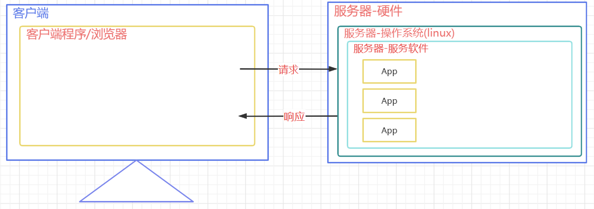

> 常见的JavaWeb服务器：

-   **Tomcat（Apache）**：当前应用最广的JavaWeb服务器
-   Jetty:更轻量级、更灵活的servlet容器
-   JBoss（Redhat红帽）：支持JavaEE，应用比较广EJB容器 –> SSH轻量级的框架代替
-   GlassFish（Orcale）：Oracle开发JavaWeb服务器，应用不是很广
-   Resin（Caucho）：支持JavaEE，应用越来越广
-   Weblogic（Orcale）：要钱的！支持JavaEE，适合大型项目
-   Websphere（IBM）：要钱的！支持JavaEE，适合大型项目

## 6.2 Tomcat服务器

### 6.2.1 简介


> Tomcat是Apache 软件基金会（Apache Software Foundation）的Jakarta 项目中的一个核心项目，由Apache、Sun 和其他一些公司及个人共同开发而成。最新的Servlet 和JSP 规范总是能在Tomcat 中得到体现，因为Tomcat 技术先进、性能稳定，而且免费，因而深受Java 爱好者的喜爱并得到了部分软件开发商的认可，成为目前比较流行的Web 应用服务器。

### 6.2.2 安装

> 版本

-   版本：企业用的比较广泛的是8.0和9.0,目前比较新正式发布版本是Tomcat10.0, Tomcat11仍然处于测试阶段。
-   JAVAEE 版本和Servlet版本号对应关系 [Jakarta EE Releases](https://jakarta.ee/release/) 

| **Servlet** Version | EE Version       |
| :------------------ | ---------------- |
| 6.1                 | Jakarta EE ?     |
| 6.0                 | Jakarta EE 10    |
| 5.0                 | Jakarta EE 9/9.1 |
| 4.0                 | JAVA EE 8        |
| 3.1                 | JAVA EE 7        |
| 3.1                 | JAVA EE 7        |
| 3.0                 | JAVAEE 6         |

+ Tomcat 版本和Servlet版本之间的对应关系

| **Servlet** Version | **Tomcat ** Version | **JDK** Version                         |
| :------------------ | :------------------ | :-------------------------------------- |
| 6.1                 | 11.0.x              | 17 and later                            |
| 6.0                 | 10.1.x              | 11 and later                            |
| 5.0                 | 10.0.x (superseded) | 8 and later                             |
| 4.0                 | 9.0.x               | 8 and later                             |
| 3.1                 | 8.5.x               | 7 and later                             |
| 3.1                 | 8.0.x (superseded)  | 7 and later                             |
| 3.0                 | 7.0.x (archived)    | 6 and later (7 and later for WebSocket) |


> 下载

-   Tomcat官方网站：[http://tomcat.apache.org/](http://tomcat.apache.org/ "http://tomcat.apache.org/")
-   安装版：需要安装，一般不考虑使用。
-   解压版: 直接解压缩使用，我们使用的版本。


> 安装

1. 正确安装JDK并配置JAVA_HOME(以JDK17为例 https://injdk.cn中可以下载各种版本的JDK)

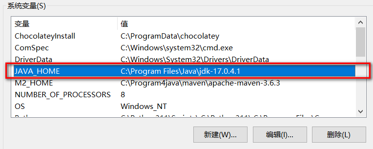

2. 解压tomcat到非中文无空格目录


3. 点击bin/startup.bat启动


4. 打开浏览器输入 http://localhost:8080访问测试


5. 直接关闭窗口或者运行 bin/shutdown.bat关闭tomcat


6. 处理dos窗口日志中文乱码问题: 修改conf/logging.properties,将所有的UTF-8修改为GBK


+ 修改前


+ 修改后


+ 重启测试


## 6.3 Tomcat目录及测试

> C:\Program4java\apache-tomcat-10.1.7 这个目录下直接包含Tomcat的bin目录，conf目录等，我们称之为**Tomcat的安装目录或根目录**。

- bin：该目录下存放的是二进制可执行文件，如果是安装版，那么这个目录下会有两个exe文件：tomcat10.exe、tomcat10w\.exe，前者是在控制台下启动Tomcat，后者是弹出GUI窗口启动Tomcat；如果是解压版，那么会有startup.bat和shutdown.bat文件，startup.bat用来启动Tomcat，但需要先配置JAVA\_HOME环境变量才能启动，shutdawn.bat用来停止Tomcat；

- conf：这是一个非常非常重要的目录，这个目录下有四个最为重要的文件：

  - **server.xml：配置整个服务器信息。例如修改端口号。默认HTTP请求的端口号是：8080**

  - tomcat-users.xml：存储tomcat用户的文件，这里保存的是tomcat的用户名及密码，以及用户的角色信息。可以按着该文件中的注释信息添加tomcat用户，然后就可以在Tomcat主页中进入Tomcat Manager页面了；

    ``` html
    <tomcat-users xmlns="http://tomcat.apache.org/xml"
                  xmlns:xsi="http://www.w3.org/2001/XMLSchema-instance"
                  xsi:schemaLocation="http://tomcat.apache.org/xml tomcat-users.xsd"
                  version="1.0">	
    	<role rolename="admin-gui"/>
    	<role rolename="admin-script"/>
    	<role rolename="manager-gui"/>
    	<role rolename="manager-script"/>
    	<role rolename="manager-jmx"/>
    	<role rolename="manager-status"/>
    	<user 	username="admin" 
    			password="admin" 
    			roles="admin-gui,admin-script,manager-gui,manager-script,manager-jmx,manager-status"
    	/>
    </tomcat-users>
    ```

    web.xml：部署描述符文件，这个文件中注册了很多MIME类型，即文档类型。这些MIME类型是客户端与服务器之间说明文档类型的，如用户请求一个html网页，那么服务器还会告诉客户端浏览器响应的文档是text/html类型的，这就是一个MIME类型。客户端浏览器通过这个MIME类型就知道如何处理它了。当然是在浏览器中显示这个html文件了。但如果服务器响应的是一个exe文件，那么浏览器就不可能显示它，而是应该弹出下载窗口才对。MIME就是用来说明文档的内容是什么类型的！

  - context.xml：对所有应用的统一配置，通常我们不会去配置它。

- lib：Tomcat的类库，里面是一大堆jar文件。如果需要添加Tomcat依赖的jar文件，可以把它放到这个目录中，当然也可以把应用依赖的jar文件放到这个目录中，这个目录中的jar所有项目都可以共享之，但这样你的应用放到其他Tomcat下时就不能再共享这个目录下的jar包了，所以建议只把Tomcat需要的jar包放到这个目录下；

- logs：这个目录中都是日志文件，记录了Tomcat启动和关闭的信息，如果启动Tomcat时有错误，那么异常也会记录在日志文件中。

- temp：存放Tomcat的临时文件，这个目录下的东西可以在停止Tomcat后删除！

- **webapps：存放web项目的目录，其中每个文件夹都是一个项目**；如果这个目录下已经存在了目录，那么都是tomcat自带的项目。其中ROOT是一个特殊的项目，在地址栏中访问：http://127.0.0.1:8080，没有给出项目目录时，对应的就是ROOT项目.http://localhost:8080/examples，进入示例项目。其中examples"就是项目名，即文件夹的名字。

- work：运行时生成的文件，最终运行的文件都在这里。通过webapps中的项目生成的！可以把这个目录下的内容删除，再次运行时会生再次生成work目录。当客户端用户访问一个JSP文件时，Tomcat会通过JSP生成Java文件，然后再编译Java文件生成class文件，生成的java和class文件都会存放到这个目录下。

- LICENSE：许可证。

- NOTICE：说明文件。

## 6.4 WEB项目的标准结构

> 一个标准的可以用于发布的WEB项目标准结构如下


+ app  本应用根目录
  + static 非必要目录,约定俗成的名字,一般在此处放静态资源 ( css  js  img)
  + WEB-INF  必要目录,必须叫WEB-INF,受保护的资源目录,浏览器通过url不可以直接访问的目录
    + classes     必要目录,src下源代码,配置文件,编译后会在该目录下,web项目中如果没有源码,则该目录不会出现
    + lib             必要目录,项目依赖的jar编译后会出现在该目录下,web项目要是没有依赖任何jar,则该目录不会出现
    + web.xml   必要文件,web项目的基本配置文件. 较新的版本中可以没有该文件,但是学习过程中还是需要该文件 
  + index.html  非必要文件,index.html/index.htm/index.jsp为默认的欢迎页

> url的组成部分和项目中资源的对应关系


## 6.5 WEB项目部署的方式

> 方式1   直接将编译好的项目放在webapps目录下  (已经演示)

> 方式2   将编译好的项目打成war包放在webapps目录下,tomcat启动后会自动解压war包(其实和第一种一样)

> 方式3   可以将项目放在非webapps的其他目录下,在tomcat中通过配置文件指向app的实际磁盘路径

+ 在磁盘的自定义目录上准备一个app


+ 在tomcat的conf下创建Catalina/localhost目录,并在该目录下准备一个app.xml文件

``` xml
<!-- 
	path: 项目的访问路径,也是项目的上下文路径,就是在浏览器中,输入的项目名称
    docBase: 项目在磁盘中的实际路径
 -->
<Context path="/app" docBase="D:\mywebapps\app" />
```

+ 启动tomcat访问测试即可

## 6.6 IDEA中开发并部署运行WEB项目

### 6.6.1 IDEA关联本地Tomcat

> 可以在创建项目前设置本地tomcat,也可以在打开某个项目的状态下找到settings


> 找到 Build,Execution,Eeployment下的Application Servers ,找到+号

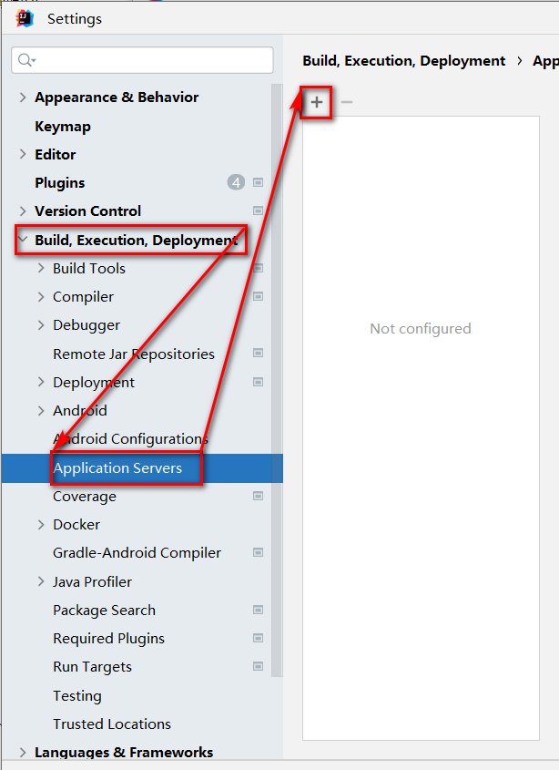

> 选择Tomcat Server


> 选择tomcat的安装目录

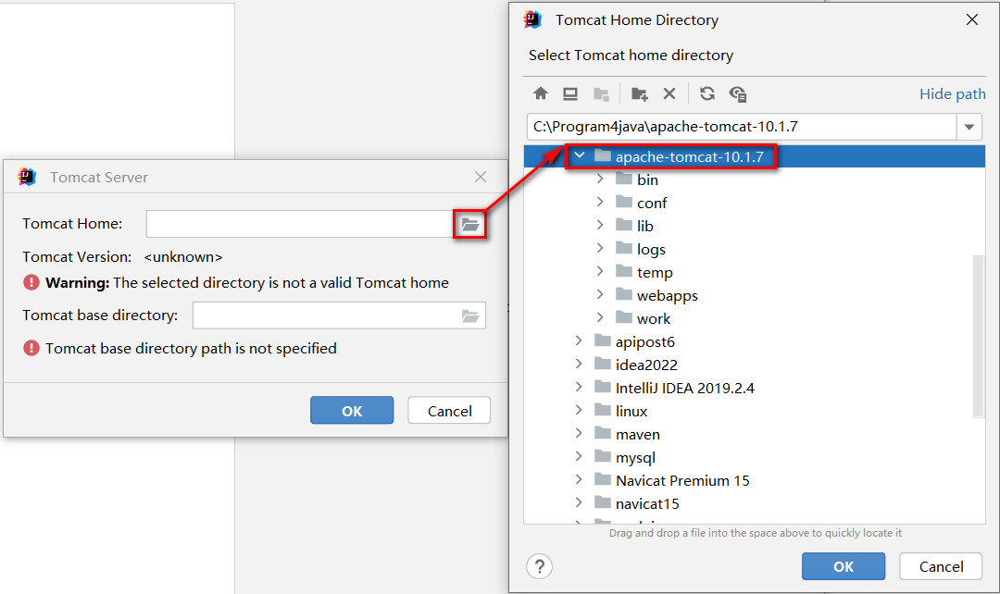

> 点击ok

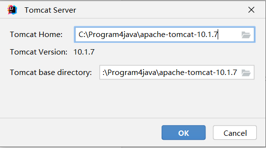

> 关联完毕


### 6.6.2 IDEA创建web工程

> 推荐先创建一个空项目,这样可以在一个空项目下同时存在多个modules,不用后续来回切换之前的项目,当然也可以忽略此步直接创建web项目

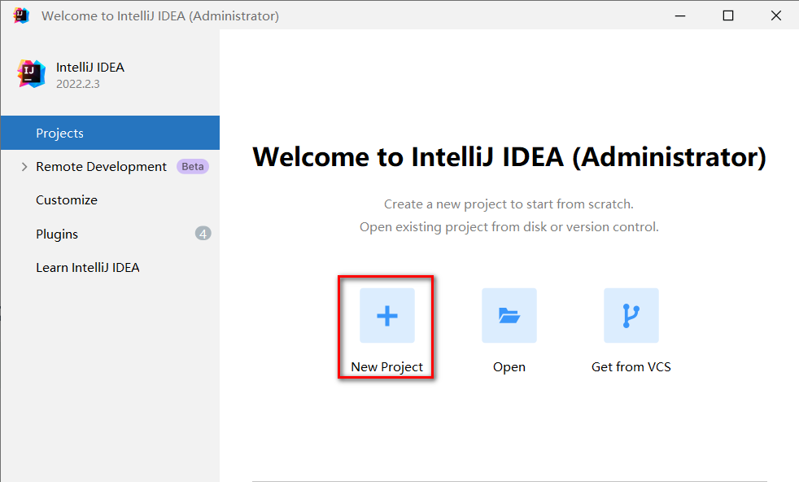


> 检查项目的SDK,语法版本,以及项目编译后的输出目录


> 先创建一个普通的JAVA项目


> 检查各项信息是否填写有误

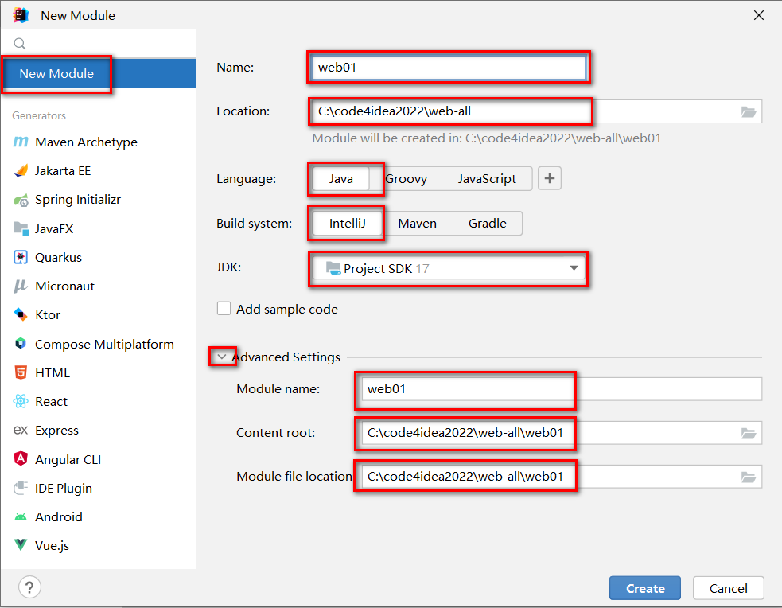

> 创建完毕后,为项目添加Tomcat依赖


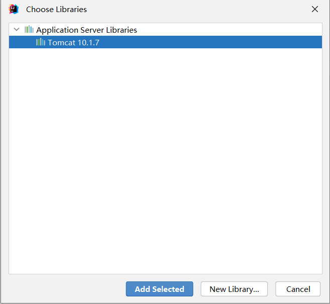


> 选择modules,添加  framework support


> 选择Web Application 注意Version,勾选  Create web.xml


> 删除index.jsp ,替换为 index.html

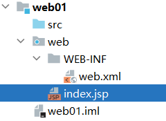


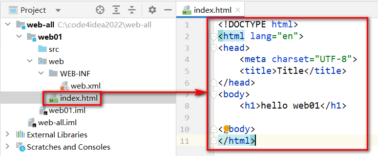

> 处理配置文件

+ 在工程下创建resources目录,专门用于存放配置文件(都放在src下也行,单独存放可以尽量避免文件集中存放造成的混乱)
+ 标记目录为资源目录,不标记的话则该目录不参与编译


+ 标记完成后,显示效果如下

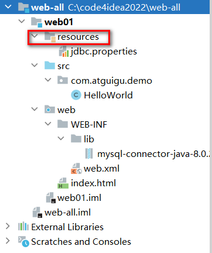-

> 处理依赖jar包问题

+ 在WEB-INF下创建lib目录
+ 必须在WEB-INF下,且目录名必须叫lib!!!
+ 复制jar文件进入lib目录


+ 将lib目录添加为当前项目的依赖,后续可以用maven统一解决


+ 环境级别推荐选择module 级别,降低对其他项目的影响,name可以空着不写


+ 查看当前项目有那些环境依赖


+ 在此位置,可以通过-号解除依赖


### 6.6.3 IDEA部署-运行web项目

> 检查idea是否识别modules为web项目并存在将项目构建成发布结构的配置

+ 就是检查工程目录下,web目录有没有特殊的识别标记


+ 以及artifacts下,有没有对应 _war_exploded,如果没有,就点击+号添加

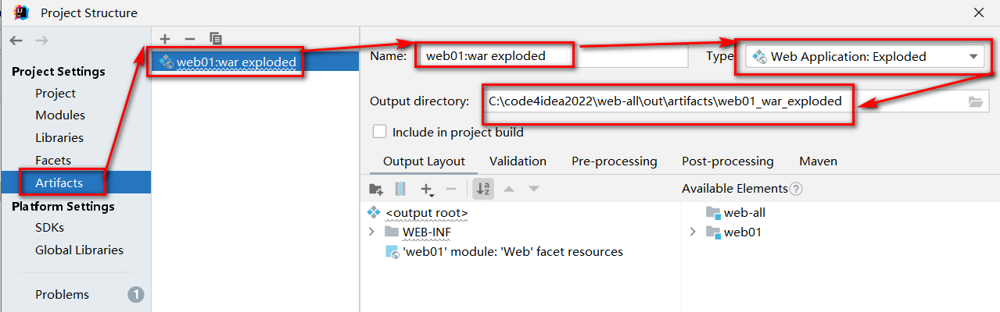

> 点击向下箭头,出现 Edit Configurations选项


> 出现运行配置界面


> 点击+号,添加本地tomcat服务器


> 因为IDEA 只关联了一个Tomcat,红色部分就只有一个Tomcat可选


> 选择Deployment,通过+添加要部署到Tomcat中的artifact


> applicationContext中是默认的项目上下文路径,也就是url中需要输入的路径,这里可以自己定义,可以和工程名称不一样,也可以不写,但是要保留/,我们这里暂时就用默认的


> 点击apply 应用后,回到Server部分. After Launch是配置启动成功后,是否默认自动打开浏览器并输入URL中的地址,HTTP port是Http连接器目前占用的端口号


> 点击OK后,启动项目,访问测试

+ 绿色箭头是正常运行模式
+ "小虫子"是debug运行模式


+ 点击后,查看日志状态是否有异常

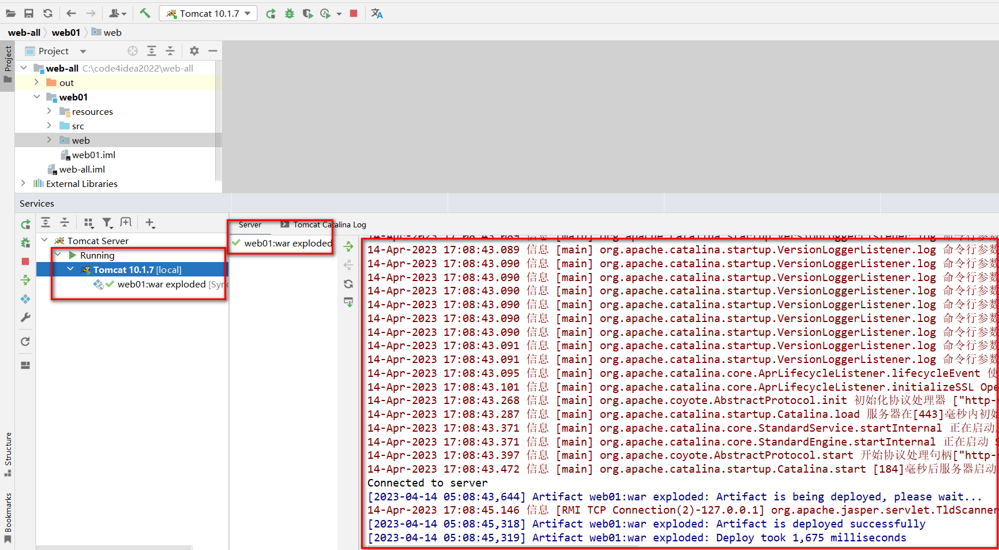

+ 浏览器自动打开并自动访问了index.html欢迎页


> 工程结构和可以发布的项目结构之间的目录对应关系


> IDEA部署并运行项目的原理

+ idea并没有直接进将编译好的项目放入tomcat的webapps中
+ idea根据关联的tomcat,创建了一个tomcat副本,将项目部署到了这个副本中
+ idea的tomcat副本在C:\用户\当前用户\AppData\Local\JetBrains\IntelliJIdea2022.2\tomcat\中
+ idea的tomcat副本并不是一个完整的tomcat,副本里只是准备了和当前项目相关的配置文件而已
+ idea启动tomcat时,是让本地tomcat程序按照tomcat副本里的配置文件运行
+ idea的tomcat副本部署项目的模式是通过conf/Catalina/localhost/*.xml配置文件的形式实现项目部署的


# 

# 8.Servlet

## 8.1 关于系统架构

1. 系统架构包括什么形式？
   - C/S架构
   - B/S架构
2. C/S架构？
   - Client / Server（客户端 / 服务器）
   - C/S架构的软件或者说系统有哪些呢？
     - QQ（先去腾讯官网下载一个QQ软件，几十MB，然后把这个客户端软件安装上去，然后输入QQ号以及密码，登录之后，就可以和你的朋友聊天了，就可以使用这个软件了。）
   - C/S架构的特点：需要安装特定的客户端软件。
   - C/S架构的系统优点和缺点分别是什么？
     - 优点：
       - 速度快（软件中的数据大部分都是集成到客户端软件当中的，很少量的数据从服务器端传送过来，所以C/S结构的系统速度快）
       - 体验好（速度又快，界面又酷炫，当然体验好了。）
       - 界面酷炫（专门的语言去实现界面的，更加灵活。）
       - 服务器压力小（因为大量的数据都是集成在客户端软件当中，所以服务器只需要传送很少的数据量，当然服务器压力小。）
       - 安全（因为大量的数据是集成在客户端软件当中的，并且客户端有很多个，服务器虽然只有一个，就算服务器那边地震了，火灾了，服务器受损了，问题也不大，因为大量的数据在多个客户端上有缓存，有存储，所以从这个方面来说，C/S结构的系统比较安全。）
       - .....
     - 缺点：
       - 升级维护比较差劲。（升级维护比较麻烦。成本比较高。每一个客户端软件都需要升级。有一些软件不是那么容易安装的。）
3. B/S架构？
   - B/S（Browser / Server，浏览器 / 服务器）
   - http://www.baidu.com
   - http://www.jd.com
   - http://www.126.com
   - B/S结构的系统是不是一个特殊的C/S系统？
     - 实际上B/S结构的系统还是一个C/S，只不过这个C比较特殊，这个Client是一个固定不变浏览器软件。
   - B/S结构的系统优点和缺点是：
     - 优点：
       - 升级维护方便，成本比较低。（只需要升级服务器端即可。）
       - 不需要安装特定的客户端软件，用户操作极其方便。只需要打开浏览器，输入网址即可。
     - 缺点：
       - 速度慢（不是因为带宽低的问题，是因为所有的数据都是在服务器上，用户发送的每一个请求都是需要服务器全身心的响应数据，所以B/S结构的系统在网络中传送的数据量比较大。）
       - 体验差（界面不是那么酷炫，因为浏览器只支持三个语言HTML CSS JavaScript。在加上速度慢。）
       - 不安全（所有的数据都在服务器上，只要服务器发生火灾，地震等不可抗力，最终数据全部丢失。）
       - ....
4. C/S和B/S结构的系统，哪个好，哪个不好？
   - 这个问题问的没有水平。并不是哪个好，哪个不好。不同结构的系统在不同的业务场景下有不同的适用场景。
   - 娱乐性软件建议使用？
     - C/S 结构
   - 公司内部使用的一些业务软件建议使用？
     - 公司内部使用的系统，需要维护成本低。
     - 公司内部使用的系统，不需要很酷炫。
     - 公司内部使用的企业级系统主要是能够进行数据的维护即可。
     - B/S 结构。
5. 注意了：开发B/S结构的系统，其实就是开发网站，其实就是开发一个WEB系统。
   - 开发一个WEB系统你需要会哪些技术？
     - WEB前端（运行在浏览器上的程序。）
       - HTML
       - CSS
       - JavaScript
     - WEB后端（WEB服务器端的程序。）
       - Java可以（Java做WEB开发我们称为JavaWEB开发。JavaWEB开发最核心的规范：Servlet【Server Applet服务器端的Java小程序。】）
       - C语言也可以
       - C++也可以
       - Python也行
       - PHP也可以
       - ....
6. JavaEE是什么？
   - Java包括三大块：
     - JavaSE
       - Java标准版（一套类库：别人写好的一套类库，只不过这个类库是标准类库，走EE，或者走ME，这个SE一定是基础，先学。）
     - JavaEE（WEB方向，WEB系统。）
       - Java企业版（也是一套类库：也是别人写好的一套类库，只不过这套类库可以帮助我们完成企业级项目的开发，专门为企业内部提供解决方案的一套（多套）类库。）
       - 别人写好的，你用就行了，用它可以开发企业级项目。
       - 可以开发web系统。
       - Java比较火爆的就是这个JavaEE方向。
     - JavaME
       - Java微型版（还是一套类库，只不过这套类库帮助我们进行电子微型设备内核程序的开发）
       - 机顶盒内核程序，吸尘器内核程序，电冰箱内核程序，电饭煲内核程序。。。。。
   - JavaEE实际上包括很多种规范，13种规范，其中Servlet就是JavaEE规范之一。学Servlet还是Java语言。

## 8.2 B/S结构的系统通信原理（没有涉及到Java小程序）

- WEB系统的访问过程
  - 第一步：打开浏览器
  - 第二步：找到地址栏
  - 第三步：输入一个合法的网址
  - 第四步：回车
  - 第五步：在浏览器上会展示响应的结果。
- 关于域名：
  - https://www.baidu.com/ （网址）
  - www.baidu.com 是一个域名
  - 在浏览器地址栏上输入域名，回车之后，域名解析器会将域名解析出来一个具体的IP地址和端口号等。
  - 解析结果也许是：http://110.242.68.3:80/index.html
- IP地址是啥？
  - 计算机在网络当中的一个身份证号。在同一个网络当中，IP地址是唯一的。
  - A计算机要想和B计算机通信，首先你需要知道B计算机的IP地址，有了IP地址才能建立连接。
- 端口号是啥？
  - 一个端口代表一个软件（一个端口代表一个应用，一个端口仅代表一个服务）。
  - 一个计算机当中有很多软件，每一个软件启动之后都有一个端口号。
  - 在同一个计算机上，端口号具有唯一性。
- 一个WEB系统的通信原理？通信步骤：
  - 第一步：用户输入网址（URL）
  - 第二步：域名解析器进行域名解析：http://110.242.68.3:80/index.html
  - 第三步：浏览器软件在网络中搜索110.242.68.3这一台主机，直到找到这台主机。
  - 第四步：定位110.242.68.3这台主机上的服务器软件，因为是80端口，可以很轻松的定位到80端口对应的服务器软件。
  - 第五步：80端口对应的服务器软件得知浏览器想要的资源名是：index.html
  - 第六步：服务器软件找到index.html文件，并且将index.html文件中的内容直接输出响应到浏览器上。
  - 第七步：浏览器接收到来自服务器的代码（HTML CSS JS）
  - 第八步：浏览器渲染，执行HTML CSS JS代码，展示效果。
- 什么是URL？
  - 统一资源定位符（http://www.baidu.com）
- 什么是请求，什么是响应？
  - 请求和响应实际上说的是数据的流向不同。
  - 从Browser端发送数据到Server端，我们称为请求。英语单词：request
  - 从Server端向浏览器Browser端发送数据，我们称为响应。英语单词：response
  - B --> S （请求request）
  - S --> B （响应response）

## 8.3 关于WEB服务器软件

- WEB服务器软件都有哪些呢？（这些软件都是提前开发好的。）
  - Tomcat（WEB服务器）
  - jetty（WEB服务器）
  - JBOSS（应用服务器）
  - WebLogic（应用服务器）
  - WebSphere（应用服务器）
- 应用服务器和WEB服务器的关系？
  - 应用服务器实现了JavaEE的所有规范。(JavaEE有13个不同的规范。)
  - WEB服务器只实现了JavaEE中的Servlet + JSP两个核心的规范。
  - 通过这个讲解说明了：应用服务器是包含WEB服务器的。
  - 用过JBOSS服务器的同学应该很清楚，JBOSS中内嵌了一个Tomcat服务器。
- Tomcat下载
  - apache官网地址：https://www.apache.org/
  - tomcat官网地址：https://tomcat.apache.org
  - tomcat开源免费的轻量级WEB服务器。
  - tomcat还有另外一个名字：catalina（catalina是美国的一个岛屿，风景秀丽，据说作者是在这个风景秀丽的小岛上开发了一个轻量级的WEB服务器，体积小，运行速度快，因此tomcat又被称为catalina）
  - tomcat的logo是一只公猫（寓意表示Tomcat服务器是轻巧的，小巧的，果然，体积小，运行速度快，只实现了Servlet+JSP规范）
  - tomcat是java语言写的。
  - tomcat服务器要想运行，必须先又jre（Java的运行时环境）
- Tomcat服务器要想运行，需要先有jre，所以要先安装JDK，配置java运行环境。
  - JAVA_HOME=C:\Program Files\Java\jdk-17.0.1
  - PATH=%JAVA_HOME%\bin
  - 目前JAVA_HOME没有配置，思考一个问题，这样行不行呢？目前只运行java程序是没问题的。真的没问题吗？
- Tomcat服务器的安装：
  - 绿色版本的安装很简单，直接zip包解压即可。解压就是安装。
  - 我有一个好习惯，在C盘的根目录下新建一个dev目录，java开发所有相关的工具都安装到dev目录下，这样比较方便管理。（你随意）
  - 启动Tomcat
    - bin目录下有一个文件：startup.bat,通过它可以启动Tomcat服务器。
      - xxx.bat文件是个什么文件？bat文件是windows操作系统专用的，bat文件是批处理文件，这种文件中可以编写大量的windows的dos命令，然后执行bat文件就相当于批量的执行dos命令。
      - startup.sh，这个文件在windows当中无法执行，在Linux环境当中可以使用。在Linux环境下能够执行的是shell命令，大量的shell命令编写在shell文件当中，然后执行这个shell文件可以批量的执行shell命令。
      - tomcat服务器提供了bat和sh文件，说明了这个tomcat服务器的通用性。
      - 分析startup.bat文件得出，执行这个命令，实际上最后是执行：catalina.bat文件。
      - catalina.bat文件中有这样一行配置：MAINCLASS=org.apache.catalina.startup.Bootstrap （这个类就是main方法所在的类。）
      - tomcat服务器就是Java语言写的，既然是java语言写的，那么启动Tomcat服务器就是执行main方法。
    - 我们尝试打开dos命令窗口，在dos命令窗口中输入startup.bat来启动tomcat服务器。
    - 启动Tomcat服务器只配置path对应的bin目录是不行的。有两个环境变量需要配置：
      - JAVA_HOME=JDK的根
      - CATALINA_HOME=Tomcat服务器的根
- 关于Tomcat服务器的目录
  - bin ： 这个目录是Tomcat服务器的命令文件存放的目录，比如：启动Tomcat，关闭Tomcat等。
  - conf： 这个目录是Tomcat服务器的配置文件存放目录。（server.xml文件中可以配置端口号，默认Tomcat端口是8080）
  - lib ：这个目录是Tomcat服务器的核心程序目录，因为Tomcat服务器是Java语言编写的，这里的jar包里面都是class文件。
  - logs: Tomcat服务器的日志目录，Tomcat服务器启动等信息都会在这个目录下生成日志文件。
  - temp：Tomcat服务器的临时目录。存储临时文件。
  - webapps：这个目录当中就是用来存放大量的webapp（web application：web应用）
  - work：这个目录是用来存放JSP文件翻译之后的java文件以及编译之后的class文件。

- 配置Tomcat服务器需要哪些环境变量？
  - JAVA_HOME=JDK的根
  - CATALINA_HOME=Tomcat服务器的根
  - PATH=%JAVA_HOME%\bin;%CATALINA_HOME%\bin
- 启动Tomcat： startup
- 关闭Tomcat：stop （shutdown.bat文件重命名为stop.bat，为什么？原因是shutdown命令和windows中的关机命令冲突。所以修改一下。）

- 怎么测试Tomcat服务器有没有启动成功呢？
  - 打开浏览器，在浏览器的地址栏上输入URL即可：
    - http://ip地址:端口号
    - ip地址是什么？端口号我知道，是8080
    - 本机的IP地址是：127.0.0.1，或者是localhost，都行。


## 8.4 实现一个最基本的web应用（这个web应用中没有java小程序）

- 第一步：找到CATALINA_HOME\webapps目录

  - 因为所有的webapp要放到webapps目录下。（没有为什么，这是Tomcat服务器的要求。如果不放到这里，Tomcat服务器找不到你的应用。）

- 第二步：在CATALINA_HOME\webapps目录下新建一个子目录，起名：oa

  - 这个目录名oa就是你这个webapp的名字。

- 第三步：在oa目录下新建资源文件，例如：index.html

  - 编写index.html文件的内容。

- 第四步：启动Tomcat服务器

- 第五步：打开浏览器，在浏览器地址栏上输入这样的URL：

- http://127.0.0.1:8080/oa/index.html

- 思考一个问题：

  - 我们在浏览器上直接输入一个URL，然后回车。这个动作和超链接一样吗？既然是一样的，我们完全可以使用超链接。

    ```html
    <!--注意以下的路径，以/开始，带项目名，是一个绝对路径。不需要添加：http://127.0.0.1:8080-->
    <a href="/oa/login.html">user login2</a>
    
    <!--多个层级也没有关系，正常访问即可。-->
    <!--注意：我们目前前端上的路径都以“/”开始的，都是加项目名的。-->
    <a href="/oa/test/debug/d.html">d page</a>
    ```


- http://127.0.0.1:8080/oa/userList.html 
  - 访问这个地址，可以展示一个用户列表页面。但是这个用户列表页面是写死在HTML文件当中的。这种资源我们称为静态资源。怎么能变成动态资源。显然需要连接数据库。
  - 连接数据库需要JDBC程序，也就是说需要编写Java程序连接数据库，数据库中有多少条记录，页面上就显示多少条记录，这种技术被称为动态网页技术。（动态网页技术并不是说页面中有flash动画。动态网页技术是说页面中的数据是动态的，根据数据库中数据的变化而变化。）

## 8.5 对于一个动态的web应用来说，一个请求和响应的过程有多少个角色参与，角色和角色之间有多少个协议

- 有哪些角色（在整个BS结构的系统当中，有哪些人参与进去了）
  - 浏览器软件的开发团队（浏览器软件太多了：谷歌浏览器、火狐浏览器、IE浏览器....）
  - WEB Server的开发团队（WEB Server这个软件也是太多了：Tomcat、Jetty、WebLogic、JBOSS、WebSphere....）
  - DB Server的开发团队（DB Server这个软件也是太多了：Oracle、MySQL.....）
  - webapp的开发团队（WEB应用是我们做为JavaWEB程序员开发的）
- 角色和角色之间需要遵守哪些规范，哪些协议
  - webapp的开发团队   和    WEB Server的开发团队  之间有一套规范: JavaEE规范之一Servlet规范。
    - Servlet规范的作用是什么？
      - WEB Server   和   webapp解耦合。
  - Browser  和   WebServer之间有一套传输协议：HTTP协议。（超文本传输协议。）
  - webapp开发团队  和  DB Server的开发团队之间有一套规范：JDBC规范。


- Servlet规范是一个什么规范？
  - 遵循Servlet规范的webapp，这个webapp就可以放在不同的WEB服务器中运行。（因为这个webapp是遵循Servlet规范的。）
  - Servlet规范包括什么呢？
    - 规范了哪些接口
    - 规范了哪些类
    - 规范了一个web应用中应该有哪些配置文件
    - 规范了一个web应用中配置文件的名字
    - 规范了一个web应用中配置文件存放的路径
    - 规范了一个web应用中配置文件的内容
    - 规范了一个合法有效的web应用它的目录结构应该是怎样的。
    - .....

## 8.6 开发一个带有Servlet（Java小程序）的webapp（重点）

- 开发步骤是怎样的？

  - 第一步：在webapps目录下新建一个目录，起名crm（这个crm就是webapp的名字）。当然，也可以是其它项目，比如银行项目，可以创建一个目录bank，办公系统可以创建一个oa。

    - 注意：crm就是这个webapp的根

  - 第二步：在webapp的根下新建一个目录：WEB-INF

    - 注意：这个目录的名字是Servlet规范中规定的，必须全部大写，必须一模一样。必须的必须。

  - 第三步：在WEB-INF目录下新建一个目录：classes

    - 注意：这个目录的名字必须是全部小写的classes。这也是Servlet规范中规定的。另外这个目录下一定存放的是Java程序编译之后的class文件（这里存放的是字节码文件）。

  - 第四步：在WEB-INF目录下新建一个目录：lib

    - 注意：这个目录不是必须的。但如果一个webapp需要第三方的jar包的话，这个jar包要放到这个lib目录下，这个目录的名字也不能随意编写，必须是全部小写的lib。例如java语言连接数据库需要数据库的驱动jar包。那么这个jar包就一定要放到lib目录下。这Servlet规范中规定的。

  - 第五步：在WEB-INF目录下新建一个文件：web.xml

    - 注意：这个文件是必须的，这个文件名必须叫做web.xml。这个文件必须放在这里。一个合法的webapp，web.xml文件是必须的，这个web.xml文件就是一个配置文件，在这个配置文件中描述了请求路径和Servlet类之间的对照关系。

    - 这个文件最好从其他的webapp中拷贝，最好别手写。没必要。复制粘贴

    - ```xml
      <?xml version="1.0" encoding="UTF-8"?>
      
      <web-app xmlns="https://jakarta.ee/xml/ns/jakartaee"
        xmlns:xsi="http://www.w3.org/2001/XMLSchema-instance"
        xsi:schemaLocation="https://jakarta.ee/xml/ns/jakartaee
                            https://jakarta.ee/xml/ns/jakartaee/web-app_5_0.xsd"
        version="5.0"
        metadata-complete="true">
      
      
      </web-app>
      
      ```

  - 第六步：编写一个Java程序，这个小Java程序也不能随意开发，这个小java程序必须实现Servlet接口。

    - 这个Servlet接口不在JDK当中。（因为Servlet不是JavaSE了。Servlet属于JavaEE，是另外的一套类库。）
    - Servlet接口（Servlet.class文件）是Oracle提供的。（最原始的是sun公司提供的。）
    - Servlet接口是JavaEE的规范中的一员。
    - Tomcat服务器实现了Servlet规范，所以Tomcat服务器也需要使用Servlet接口。Tomcat服务器中应该有这个接口，Tomcat服务器的CATALINA_HOME\lib目录下有一个servlet-api.jar，解压这个servlet-api.jar之后，你会看到里面有一个Servlet.class文件。
    - 重点：从JakartaEE9开始，Servlet接口的全名变了：jakarta.servlet.Servlet
    - 注意：编写这个Java小程序的时候，java源代码你愿意在哪里就在哪里，位置无所谓，你只需要将java源代码编译之后的class文件放到classes目录下即可。

  - 第七步：编译我们编写的HelloServlet

    - 重点：你怎么能让你的HelloServlet编译通过呢？配置环境变量CLASSPATH

      CLASSPATH=.;C:\dev\apache-tomcat-10.0.12\lib\servlet-api.jar

    - 思考问题：以上配置的CLASSPATH和Tomcat服务器运行有没有关系？

      - 没有任何关系，以上配置这个环境变量只是为了让你的HelloServlet能够正常编译生成class文件。

  - 第八步：将以上编译之后的HelloServlet.class文件拷贝到WEB-INF\classes目录下。

  - 第九步：在web.xml文件中编写配置信息，让“请求路径”和“Servlet类名”关联在一起。

    - 这一步用专业术语描述：在web.xml文件中注册Servlet类。

    - ```xml
      <?xml version="1.0" encoding="UTF-8"?>
      
      <web-app xmlns="https://jakarta.ee/xml/ns/jakartaee"
        xmlns:xsi="http://www.w3.org/2001/XMLSchema-instance"
        xsi:schemaLocation="https://jakarta.ee/xml/ns/jakartaee
                            https://jakarta.ee/xml/ns/jakartaee/web-app_5_0.xsd"
        version="5.0"
        metadata-complete="true">
      
      	<!--servlet描述信息-->
      	<!--任何一个servlet都对应一个servlet-mapping -->
      	<servlet>
      		<servlet-name>fdsafdsagfdsafdsa</servlet-name>
      		<!--这个位置必须是带有包名的全限定类名-->
      		<servlet-class>com.bjpowernode.servlet.HelloServlet</servlet-class>
      	</servlet>
      
      	<!--servlet映射信息-->
      	<servlet-mapping>
      		<!--这个也是随便的，不过这里写的内容要和上面的一样。-->
      		<servlet-name>fdsafdsagfdsafdsa</servlet-name>
      		<!--这里需要一个路径-->
      		<!--这个路径唯一的要求是必须以 / 开始-->
      		<!--当前这个路径可以随便写-->
      		<url-pattern>/fdsa/fd/saf/d/sa/fd/sa/fd</url-pattern>
      	</servlet-mapping>
      	
      </web-app>
      
      ```

      

  - 第十步：启动Tomcat服务器

  - 第十一步：打开浏览器，在浏览器地址栏上输入一个url，这个URL必须是：

    - http://127.0.0.1:8080/crm/fdsa/fd/saf/d/sa/fd/sa/fd   
    - 非常重要的一件事：浏览器上的请求路径不能随便写，这个请求路径必须和web.xml文件中的url-pattern一致。
    - 注意：浏览器上的请求路径和web.xml文件中的url-pattern的唯一区别就是：浏览器上的请求路径带项目名：/crm

  - 浏览器上编写的路径太复杂，可以使用超链接。（**非常重要：html页面只能放到WEB-INF目录外面。**）

  - 以后不需要我们编写main方法了。tomcat服务器负责调用main方法，Tomcat服务器启动的时候执行的就是main方法。我们javaweb程序员只需要编写Servlet接口的实现类，然后将其注册到web.xml文件中，即可。

  - 总结一下：一个合法的webapp目录结构应该是怎样的？

    ```
    webapproot
         |------WEB-INF
         		  |------classes(存放字节码)
         		  |------lib(第三方jar包)
         		  |------web.xml(注册Servlet)
         |------html
         |------css
         |------javascript
         |------image
         ....
    ```

  - 浏览器发送请求，到最终服务器调用Servlet中的方法，是怎样的一个过程？（以下这个过程描述的很粗糙。其中还有很多步骤我省略了。）

    - 用户输入URL，或者直接点击超链接：http://127.0.0.1:8080/crm/fdsa/fd/saf/d/sa/fd/sa/fd  
    - 然后Tomcat服务器接收到请求，截取路径：/crm/fdsa/fd/saf/d/sa/fd/sa/fd  
    - Tomcat服务器找到crm项目
    - Tomcat服务器在web.xml文件中查找/fdsa/fd/saf/d/sa/fd/sa/fd  对应的Servlet是：com.bjpowernode.servlet.HelloServlet
    - Tomcat服务器通过反射机制，创建com.bjpowernode.servlet.HelloServlet的对象。
    - Tomcat服务器调用com.bjpowernode.servlet.HelloServlet对象的service方法。

## 关于JavaEE的版本

- JavaEE目前最高版本是 JavaEE8
- JavaEE被Oracle捐献了，Oracle将JavaEE规范捐献给Apache了。
- Apache把JavaEE换名了，以后不叫JavaEE了，以后叫做 jakarta EE。
- 以后没有JavaEE了。以后都叫做Jakarta EE。
- JavaEE8版本升级之后的"JavaEE 9"，不再是"JavaEE9"这个名字了，叫做JakartaEE9
- JavaEE8的时候对应的Servlet类名是：javax.servlet.Servlet
- JakartaEE9的时候对应的Servlet类名是：jakarta.servlet.Servlet （包名都换了）
- 如果你之前的项目还是在使用javax.servlet.Servlet，那么你的项目无法直接部署到Tomcat10+版本上。你只能部署到Tomcat9-版本上。在Tomcat9以及Tomcat9之前的版本中还是能够识别javax.servlet这个包。


## 8.7 解决Tomcat服务器在DOS命令窗口中的乱码问题（控制台乱码）

将CATALINA_HOME/conf/logging.properties文件中的内容修改如下：

java.util.logging.ConsoleHandler.encoding = GBK

## 8.8 向浏览器响应一段HTML代码

```java
public void service(ServletRequest request, ServletResponse response){
    response.setContentType("text/html");
    PrintWriter out = response.getWriter();
    out.print("<h1>hello servlet!</h1>");
}
```

## 8.9 在Servlet中连接数据库，怎么做？

- Servlet是Java程序，所以在Servlet中完全可以编写JDBC代码连接数据库。
- 在一个webapp中去连接数据库，需要将驱动jar包放到WEB-INF/lib目录下。（com.mysql.cj.jdbc.Driver 这个类就在驱动jar包当中。）

## 8.10在集成开发环境当中开发Servlet程序

- 集成开发工具很多，其中目前使用比较多的是：

  - IntelliJ IDEA（这个居多，IDEA在提示功能方面要强于Eclipse，也就是说IDEA使用起来比Eclipse更加智能，更好用。JetBrain公司开发的。收费的。）
  - Eclipse（这个少一些），Eclipse目前还是有团队使用，只不过处于减少的趋势，自己从事工作之后，可能会遇到。Eclipse是IBM团队开发的。Eclipse寓意是“日食”。“日食”表示将太阳吃掉。太阳是SUN。IBM团队开发Eclipse的寓意是吞并SUN公司，但是2009年的时候SUN公司被Oracle公司并购了。IBM并没有成功并购SUN公司。

- 使用IDEA集成开发工具开发Servlet

  - 第一步：New Project（我比较习惯先创建一个Empty Project【空工程】，然后在空工程下新建Module【模块】，这不是必须的，只是一种习惯，你可以直接新建非空的Project），这个Empty Project起名为：javaweb（不是必须的，只是一个名字而已。一般情况下新建的Project的名字最好和目录的名字一致。）
  - 第二步：新建模块（File --> new --> Module...）
    - 这里新建的是一个普通的JavaSE模块（这里先不要新建Java Enterprise模块）
    - 这个Module自动会被放在javaweb的project下面。
    - 这个Module起名：servlet01
  - 第三步：让Module变成JavaEE的模块。（让Module变成webapp的模块。符合webapp规范。符合Servlet规范的Module）
    - 在Module上点击右键：Add Framework Support...（添加框架支持）
    - 在弹出的窗口中，选择Web Application（选择的是webapp的支持）
    - 选择了这个webapp的支持之后，IDEA会自动给你生成一个符合Servlet规范的webpp目录结构。
    - **重点，需要注意的：在IDEA工具中根据Web Application模板生成的目录中有一个web目录，这个目录就代表webapp的根**
  - 第四步（非必须）：根据Web Application生成的资源中有index.jsp文件，这里我选择删除这个index.jsp文件。
  - 第五步：编写Servlet（StudentServlet）
    - class StudentServlet implements Servlet
    - 这个时候发现Servlet.class文件没有。怎么办？将CATALINA_HOME/lib/servlet-api.jar和jsp-api.jar添加到classpath当中（这里的classpath说的是IDEA的classpath）
      - File --> Project Structrue --> Modules --> + 加号 --> Add JARS....
    - 实现jakarta.servlet.Servlet接口中的5个方法。
  - 第六步：在Servlet当中的service方法中编写业务代码（我们这里连接数据库了。）
  - 第七步：在WEB-INF目录下新建了一个子目录：lib（这个目录名可不能随意，必须是全部小写的lib），并且将连接数据库的驱动jar包放到lib目录下。
  - 第八步：在web.xml文件中完成StudentServlet类的注册。（请求路径和Servlet之间对应起来）

  ```java
  <?xml version="1.0" encoding="UTF-8"?>
  <web-app xmlns="http://xmlns.jcp.org/xml/ns/javaee"
           xmlns:xsi="http://www.w3.org/2001/XMLSchema-instance"
           xsi:schemaLocation="http://xmlns.jcp.org/xml/ns/javaee http://xmlns.jcp.org/xml/ns/javaee/web-app_4_0.xsd"
           version="4.0">
  
      <servlet>
          <servlet-name>studentServlet</servlet-name>
          <servlet-class>com.bjpowernode.javaweb.servlet.StudentServlet</servlet-class>
      </servlet>
      <servlet-mapping>
          <servlet-name>studentServlet</servlet-name>
          <url-pattern>/servlet/student</url-pattern>
      </servlet-mapping>
      
  </web-app>
  ```

  

  - 第九步：给一个html页面，在HTML页面中编写一个超链接，用户点击这个超链接，发送请求，Tomcat执行后台的StudentServlet。

    - student.html

    - 这个文件不能放到WEB-INF目录里面，只能放到WEB-INF目录外面。

    - student.html文件的内容

    - ```html
      <!DOCTYPE html>
      <html lang="en">
      <head>
          <meta charset="UTF-8">
          <title>student page</title>
      </head>
      <body>
          <!--这里的项目名是 /xmm ，无法动态获取，先写死-->
          <a href="/xmm/servlet/student">student list</a>
      </body>
      </html>
      ```

      

  - 第十步：让IDEA工具去关联Tomcat服务器。关联的过程当中将webapp部署到Tomcat服务器当中。

    - IDEA工具右上角，绿色小锤子右边有一个：Add Configuration
    - 左上角加号，点击Tomcat Server --> local
    - 在弹出的界面中设置服务器Server的参数（基本上不用动）
    - 在当前窗口中有一个Deployment（点击这个用来部署webapp），继续点击加号，部署即可。
    - 修改 Application context为：/xmm

  - 第十一步：启动Tomcat服务器

    - 在右上角有绿色的箭头，或者绿色的小虫子，点击这个绿色的小虫子，可以采用debug的模式启动Tomcat服务器。
    - 我们开发中建议适用debug模式启动Tomcat

  - 第十二步：打开浏览器，在浏览器地址栏上输入：http://localhost:8080/xmm/student.html

## 8.11 Servlet对象的生命周期

- 什么是Servlet对象生命周期？

  - Servlet对象什么时候被创建。
  - Servlet对象什么时候被销毁。
  - Servlet对象创建了几个？
  - Servlet对象的生命周期表示：一个Servlet对象从出生在最后的死亡，整个过程是怎样的。

- Servlet对象是由谁来维护的？

  - Servlet对象的创建，对象上方法的调用，对象最终的销毁，Javaweb程序员是无权干预的。
  - Servlet对象的生命周期是由Tomcat服务器（WEB Server）全权负责的。
  - Tomcat服务器通常我们又称为：WEB容器。（这个叫法你要知道【WEB Container】）
  - WEB容器来管理Servlet对象的死活。

- 思考：我们自己new的Servlet对象受WEB容器的管理吗？

  - 我们自己new的Servlet对象是不受WEB容器管理的。

  - WEB容器创建的Servlet对象，这些Servlet对象都会被放到一个集合当中（HashMap），只有放到这个HashMap集合中的Servlet才能够被WEB容器管理，自己new的Servlet对象不会被WEB容器管理。（自己new的Servlet对象不在容器当中）

  - web容器底层应该有一个HashMap这样的集合，在这个集合当中存储了Servlet对象和请求路径之间的关系

    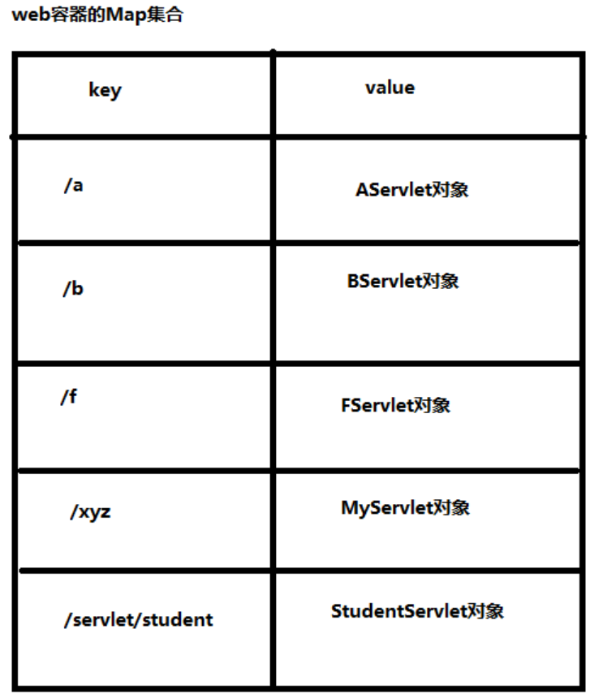

- 研究：服务器在启动的Servlet对象有没有被创建出来（默认情况下）？

  - 在Servlet中提供一个无参数的构造方法，启动服务器的时候看看构造方法是否执行。
  - 经过测试得出结论：默认情况下，服务器在启动的时候Servlet对象并不会被实例化。
  - 这个设计是合理的。用户没有发送请求之前，如果提前创建出来所有的Servlet对象，必然是耗费内存的，并且创建出来的Servlet如果一直没有用户访问，显然这个Servlet对象是一个废物，没必要先创建。

- 怎么让服务器启动的时候创建Servlet对象呢？

  - 在servlet标签中添加<load-on-startup>子标签，在该子标签中填写整数，越小的整数优先级越高。

  - ```xml
    <servlet>
        <servlet-name>aservlet</servlet-name>
        <servlet-class>com.bjpowernode.javaweb.servlet.AServlet</servlet-class>
        <load-on-startup>1</load-on-startup>
    </servlet>
    <servlet-mapping>
        <servlet-name>aservlet</servlet-name>
        <url-pattern>/a</url-pattern>
    </servlet-mapping>
    ```

- Servlet对象生命周期

  - 默认情况下服务器启动的时候AServlet对象并没有被实例化

  - 用户发送第一次请求的时候，控制台输出了以下内容：

    ```
    AServlet无参数构造方法执行了
    AServlet's init method execute!
    AServlet's service method execute!
    ```

  - 根据以上输出内容得出结论：

    - 用户在发送第一次请求的时候Servlet对象被实例化（AServlet的构造方法被执行了。并且执行的是无参数构造方法。）
    - AServlet对象被创建出来之后，Tomcat服务器马上调用了AServlet对象的init方法。（init方法在执行的时候，AServlet对象已经存在了。已经被创建出来了。）
    - 用户发送第一次请求的时候，init方法执行之后，Tomcat服务器马上调用AServlet对象的service方法。

  - 用户继续发送第二次请求，控制台输出了以下内容：

    ```
    AServlet's service method execute!
    ```

  - 根据以上输出结果得知，用户在发送第二次，或者第三次，或者第四次请求的时候，Servlet对象并没有新建，还是使用之前创建好的Servlet对象，直接调用该Servlet对象的service方法，这说明：

    - 第一：Servlet对象是单例的（单实例的。但是要注意：Servlet对象是单实例的，但是Servlet类并不符合单例模式。我们称之为假单例。之所以单例是因为Servlet对象的创建我们javaweb程序员管不着，这个对象的创建只能是Tomcat来说了算，Tomcat只创建了一个，所以导致了单例，但是属于假单例。真单例模式，构造方法是私有化的。）
    - 第二：无参数构造方法、init方法只在第一次用户发送请求的时候执行。也就是说无参数构造方法只执行一次。init方法也只被Tomcat服务器调用一次。
    - 第三：只要用户发送一次请求：service方法必然会被Tomcat服务器调用一次。发送100次请求，service方法会被调用100次。

  - 关闭服务器的时候，控制台输出了以下内容：

    ```
    AServlet's destroy method execute!
    ```

  - 通过以上输出内容，可以得出以下结论：

    - Servlet的destroy方法只被Tomcat服务器调用一次。
    - destroy方法是在什么时候被调用的？
      - 在服务器关闭的时候。
      - 因为服务器关闭的时候要销毁AServlet对象的内存。
      - 服务器在销毁AServlet对象内存之前，Tomcat服务器会自动调用AServlet对象的destroy方法。

  - 请问：destroy方法调用的时候，对象销毁了还是没有销毁呢？

    - destroy方法执行的时候AServlet对象还在，没有被销毁。destroy方法执行结束之后，AServlet对象的内存才会被Tomcat释放。

## 8.12 GenericServlet

- 我们编写一个Servlet类直接实现Servlet接口有什么缺点？

  - 我们只需要service方法，其他方法大部分情况下是不需要使用的。代码很丑陋。

- 适配器设计模式Adapter

  - 手机直接插到220V的电压上，手机直接就报废了。怎么办？可以找一个充电器。这个充电器就是一个适配器。手机连接适配器。适配器连接220V的电压。这样问题就解决了。

- 编写一个GenericServlet类，这个类是一个抽象类，其中有一个抽象方法service。

  - GenericServlet实现Servlet接口。
  - GenericServlet是一个适配器。
  - 以后编写的所有Servlet类继承GenericServlet，重写service方法即可。

- 思考：GenericServlet类是否需要改造一下？怎么改造？更利于子类程序的编写？

  - 思考第一个问题：我提供了一个GenericServlet之后，init方法还会执行吗？

    - 还会执行。会执行GenericServlet类中的init方法。

  - 思考第二个问题：init方法是谁调用的？

    - Tomcat服务器调用的。

  - 思考第三个问题：init方法中的ServletConfig对象是谁创建的？是谁传过来的？

    - 都是Tomcat干的。
    - Tomcat服务器先创建了ServletConfig对象，然后调用init方法，将ServletConfig对象传给了init方法。

  - 思考一下Tomcat服务器伪代码：

    - ```java
      public class Tomcat {
          public static void main(String[] args){
              // .....
              // Tomcat服务器伪代码
              // 创建LoginServlet对象（通过反射机制，调用无参数构造方法来实例化LoginServlet对象）
              Class clazz = Class.forName("com.bjpowernode.javaweb.servlet.LoginServlet");
              Object obj = clazz.newInstance();
              
              // 向下转型
              Servlet servlet = (Servlet)obj;
              
              // 创建ServletConfig对象
              // Tomcat服务器负责将ServletConfig对象实例化出来。
              // 多态（Tomcat服务器完全实现了Servlet规范）
              ServletConfig servletConfig = new org.apache.catalina.core.StandardWrapperFacade();
              
              // 调用Servlet的init方法
              servlet.init(servletConfig);
              
              // 调用Servlet的service方法
              // ....
              
          }
      }
      ```


## 8.13 ServletConfig

- 什么是ServletConfig？

  - Servlet对象的配置信息对象。
  - ServletConfig对象中封装了<servlet></servlet>标签中的配置信息。（web.xml文件中servlet的配置信息）

- 一个Servlet对应一个ServletConfig对象。

- Servlet对象是Tomcat服务器创建，并且ServletConfig对象也是Tomcat服务器创建。并且默认情况下，他们都是在用户发送第一次请求的时候创建。

- Tomcat服务器调用Servlet对象的init方法的时候需要传一个ServletConfig对象的参数给init方法。

- ServletConfig接口的实现类是Tomcat服务器给实现的。（Tomcat服务器说的就是WEB服务器。）

- ServletConfig接口有哪些常用的方法？

  - ```java
    public String getInitParameter(String name); // 通过初始化参数的name获取value
    public Enumeration<String> getInitParameterNames(); // 获取所有的初始化参数的name
    public ServletContext getServletContext(); // 获取ServletContext对象
    public String getServletName(); // 获取Servlet的name
    ```

  - 以上方法在Servlet类当中，都可以使用this去调用。因为GenericServlet实现了ServletConfig接口。

## 8.14 ServletContext

- 一个Servlet对象对应一个ServletConfig。100个Servlet对象则对应100个ServletConfig对象。

- 只要在同一个webapp当中，只要在同一个应用当中，所有的Servlet对象都是共享同一个ServletContext对象的。

- ServletContext对象在服务器启动阶段创建，在服务器关闭的时候销毁。这就是ServletContext对象的生命周期。ServletContext对象是应用级对象。

- Tomcat服务器中有一个webapps，这个webapps下可以存放webapp，可以存放多个webapp，假设有100个webapp，那么就有100个ServletContext对象。但是，总之，一个应用，一个webapp肯定是只有一个ServletContext对象。

- ServletContext被称为Servlet上下文对象。（Servlet对象的四周环境对象。）

- 一个ServletContext对象通常对应的是一个web.xml文件。

- ServletContext对应显示生活中的什么例子呢？

  - 一个教室里有多个学生，那么每一个学生就是一个Servlet，这些学生都在同一个教室当中，那么我们可以把这个教室叫做ServletContext对象。那么也就是说放在这个ServletContext对象（环境）当中的数据，在同一个教室当中，物品都是共享的。比如：教室中有一个空调，所有的学生都可以操作。可见，空调是共享的。因为空调放在教室当中。教室就是ServletContext对象。

- ServletContext是一个接口，Tomcat服务器对ServletContext接口进行了实现。

  - ServletContext对象的创建也是Tomcat服务器来完成的。启动webapp的时候创建的。

- ServletContext接口中有哪些常用的方法？

  - ```java
    public String getInitParameter(String name); // 通过初始化参数的name获取value
    public Enumeration<String> getInitParameterNames(); // 获取所有的初始化参数的name
    ```

  - ```xml
    <!--以上两个方法是ServletContext对象的方法，这个方法获取的是什么信息？是以下的配置信息-->
    <context-param>
        <param-name>pageSize</param-name>
        <param-value>10</param-value>
    </context-param>
    <context-param>
        <param-name>startIndex</param-name>
        <param-value>0</param-value>
    </context-param>
    <!--注意：以上的配置信息属于应用级的配置信息，一般一个项目中共享的配置信息会放到以上的标签当中。-->
    <!--如果你的配置信息只是想给某一个servlet作为参考，那么你配置到servlet标签当中即可，使用ServletConfig对象来获取。-->
    ```

  - ```java
    // 获取应用的根路径（非常重要），因为在java源代码当中有一些地方可能会需要应用的根路径，这个方法可以动态获取应用的根路径
    // 在java源码当中，不要将应用的根路径写死，因为你永远都不知道这个应用在最终部署的时候，起一个什么名字。
    public String getContextPath();
    //String contextPath = application.getContextPath();
    ```

  - ```java
    // 获取文件的绝对路径（真实路径）
    public String getRealPath(String path);
    ```

  - ```java
    // 通过ServletContext对象也是可以记录日志的
    public void log(String message);
    public void log(String message, Throwable t);
    // 这些日志信息记录到哪里了？
    // localhost.2021-11-05.log
    
    // Tomcat服务器的logs目录下都有哪些日志文件？
    //catalina.2021-11-05.log 服务器端的java程序运行的控制台信息。
    //localhost.2021-11-05.log ServletContext对象的log方法记录的日志信息存储到这个文件中。
    //localhost_access_log.2021-11-05.txt 访问日志
    ```

  - ```java
    // ServletContext对象还有另一个名字：应用域（后面还有其他域，例如：请求域、会话域）
    
    // 如果所有的用户共享一份数据，并且这个数据很少的被修改，并且这个数据量很少，可以将这些数据放到ServletContext这个应用域中
    
    // 为什么是所有用户共享的数据？ 不是共享的没有意义。因为ServletContext这个对象只有一个。只有共享的数据放进去才有意义。
    
    // 为什么数据量要小？ 因为数据量比较大的话，太占用堆内存，并且这个对象的生命周期比较长，服务器关闭的时候，这个对象才会被销毁。大数据量会影响服务器的性能。占用内存较小的数据量可以考虑放进去。
    
    // 为什么这些共享数据很少的修改，或者说几乎不修改？
    // 所有用户共享的数据，如果涉及到修改操作，必然会存在线程并发所带来的安全问题。所以放在ServletContext对象中的数据一般都是只读的。
    
    // 数据量小、所有用户共享、又不修改，这样的数据放到ServletContext这个应用域当中，会大大提升效率。因为应用域相当于一个缓存，放到缓存中的数据，下次在用的时候，不需要从数据库中再次获取，大大提升执行效率。
    
    // 存（怎么向ServletContext应用域中存数据）
    public void setAttribute(String name, Object value); // map.put(k, v)
    // 取（怎么从ServletContext应用域中取数据）
    public Object getAttribute(String name); // Object v = map.get(k)
    // 删（怎么删除ServletContext应用域中的数据）
    public void removeAttribute(String name); // map.remove(k)
    
    
    ```

- 注意：以后我们编写Servlet类的时候，实际上是不会去直接继承GenericServlet类的，因为我们是B/S结构的系统，这种系统是基于HTTP超文本传输协议的，在Servlet规范当中，提供了一个类叫做HttpServlet，它是专门为HTTP协议准备的一个Servlet类。我们编写的Servlet类要继承HttpServlet。（HttpServlet是HTTP协议专用的。）使用HttpServlet处理HTTP协议更便捷。但是你需要知道它的继承结构：

  - ```
    jakarta.servlet.Servlet（接口）【爷爷】
    jakarta.servlet.GenericServlet implements Servlet（抽象类）【儿子】
    jakarta.servlet.http.HttpServlet extends GenericServlet（抽象类）【孙子】
    
    我们以后编写的Servlet要继承HttpServlet类。
    ```

  

## 8.15 HTTP协议

- 什么是协议？

  - 协议实际上是某些人，或者某些组织提前制定好的一套规范，大家都按照这个规范来，这样可以做到沟通无障碍。
  - 协议就是一套规范，就是一套标准。由其他人或其他组织来负责制定的。
  - 我说的话你能听懂，你说的话，我也能听懂，这说明我们之间是有一套规范的，一套协议的，这套协议就是：中国普通话协议。我们都遵守这套协议，我们之间就可以沟通无障碍。

- 什么是HTTP协议？

  - HTTP协议：是W3C制定的一种超文本传输协议。（通信协议：发送消息的模板提前被制定好。）
  - W3C：
    - 万维网联盟组织
    - 负责制定标准的：HTTP HTML4.0 HTML5 XML DOM等规范都是W3C制定的。
    - 万维网之父：蒂姆·伯纳斯·李
  - 什么是超文本？
    - 超文本说的就是：不是普通文本，比如流媒体：声音、视频、图片等。
    - HTTP协议支持：不但可以传送普通字符串，同样支持传递声音、视频、图片等流媒体信息。
  - 这种协议游走在B和S之间。B向S发数据要遵循HTTP协议。S向B发数据同样需要遵循HTTP协议。这样B和S才能解耦合。
  - 什么是解耦合？
    - B不依赖S。
    - S也不依赖B。
  - B/S表示：B/S结构的系统（浏览器访问WEB服务器的系统）
  - 浏览器   向   WEB服务器发送数据，叫做：请求（request)
  - WEB服务器   向   浏览器发送数据，叫做：响应（response）
  - HTTP协议包括：
    - 请求协议
      - 浏览器  向   WEB服务器发送数据的时候，这个发送的数据需要遵循一套标准，这套标准中规定了发送的数据具体格式。
    - 响应协议
      - WEB服务器  向  浏览器发送数据的时候，这个发送的数据需要遵循一套标准，这套标准中规定了发送的数据具体格式。
  - HTTP协议就是提前制定好的一种消息模板。
    - 不管你是哪个品牌的浏览器，都是这么发。
    - 不管你是哪个品牌的WEB服务器，都是这么发。
    - FF浏览器  可以向 Tomcat发送请求，也可以向Jetty服务器发送请求。浏览器不依赖具体的服务器品牌。
    - WEB服务器也不依赖具体的浏览器品牌。可以是FF浏览器，也可以是Chrome浏览器，可以是IE，都行。

- HTTP的请求协议（B --> S）

  - HTTP的请求协议包括：4部分

    - 请求行
    - 请求头
    - 空白行
    - 请求体

  - HTTP请求协议的具体报文：GET请求

    - ```
      GET /servlet05/getServlet?username=lucy&userpwd=1111 HTTP/1.1                           请求行
      Host: localhost:8080                                                                    请求头
      Connection: keep-alive
      sec-ch-ua: "Google Chrome";v="95", "Chromium";v="95", ";Not A Brand";v="99"
      sec-ch-ua-mobile: ?0
      sec-ch-ua-platform: "Windows"
      Upgrade-Insecure-Requests: 1
      User-Agent: Mozilla/5.0 (Windows NT 10.0; Win64; x64) AppleWebKit/537.36 (KHTML, like Gecko) Chrome/95.0.4638.54 Safari/537.36
      Accept: text/html,application/xhtml+xml,application/xml;q=0.9,image/avif,image/webp,image/apng,*/*;q=0.8,application/signed-exchange;v=b3;q=0.9
      Sec-Fetch-Site: same-origin
      Sec-Fetch-Mode: navigate
      Sec-Fetch-User: ?1
      Sec-Fetch-Dest: document
      Referer: http://localhost:8080/servlet05/index.html
      Accept-Encoding: gzip, deflate, br
      Accept-Language: zh-CN,zh;q=0.9
                                                                                              空白行
                                                                                              请求体
      ```

    

  - HTTP请求协议的具体报文：POST请求

    - ```
      POST /servlet05/postServlet HTTP/1.1                                                  请求行
      Host: localhost:8080                                                                  请求头
      Connection: keep-alive
      Content-Length: 25
      Cache-Control: max-age=0
      sec-ch-ua: "Google Chrome";v="95", "Chromium";v="95", ";Not A Brand";v="99"
      sec-ch-ua-mobile: ?0
      sec-ch-ua-platform: "Windows"
      Upgrade-Insecure-Requests: 1
      Origin: http://localhost:8080
      Content-Type: application/x-www-form-urlencoded
      User-Agent: Mozilla/5.0 (Windows NT 10.0; Win64; x64) AppleWebKit/537.36 (KHTML, like Gecko) Chrome/95.0.4638.54 Safari/537.36
      Accept: text/html,application/xhtml+xml,application/xml;q=0.9,image/avif,image/webp,image/apng,*/*;q=0.8,application/signed-exchange;v=b3;q=0.9
      Sec-Fetch-Site: same-origin
      Sec-Fetch-Mode: navigate
      Sec-Fetch-User: ?1
      Sec-Fetch-Dest: document
      Referer: http://localhost:8080/servlet05/index.html
      Accept-Encoding: gzip, deflate, br
      Accept-Language: zh-CN,zh;q=0.9
                                                                                            空白行
      username=lisi&userpwd=123                                                             请求体
      ```

  - 请求行

    - 包括三部分：
      - 第一部分：请求方式（7种）
        - get（常用的）
        - post（常用的）
        - delete
        - put
        - head
        - options
        - trace
      - 第二部分：URI
        - 什么是URI？ 统一资源标识符。代表网络中某个资源的名字。但是通过URI是无法定位资源的。
        - 什么是URL？统一资源定位符。代表网络中某个资源，同时，通过URL是可以定位到该资源的。
        - URI和URL什么关系，有什么区别？
          - URL包括URI
          - http://localhost:8080/servlet05/index.html 这是URL。
          - /servlet05/index.html 这是URI。
      - 第三部分：HTTP协议版本号

  - 请求头

    - 请求的主机
    - 主机的端口
    - 浏览器信息
    - 平台信息
    - cookie等信息
    - ....

  - 空白行

    - 空白行是用来区分“请求头”和“请求体”

  - 请求体

    - 向服务器发送的具体数据。

- HTTP的响应协议（S --> B）

  - HTTP的响应协议包括：4部分

    - 状态行
    - 响应头
    - 空白行
    - 响应体

  - HTTP响应协议的具体报文：

    - ```
      HTTP/1.1 200 ok                                     状态行
      Content-Type: text/html;charset=UTF-8               响应头
      Content-Length: 160
      Date: Mon, 08 Nov 2021 13:19:32 GMT
      Keep-Alive: timeout=20
      Connection: keep-alive
                                                          空白行
      <!doctype html>                                     响应体
      <html>
          <head>
              <title>from get servlet</title>
          </head>
          <body>
              <h1>from get servlet</h1>
          </body>
      </html>
      ```

  - 状态行

    - 三部分组成
      - 第一部分：协议版本号（HTTP/1.1）
      - 第二部分：状态码（HTTP协议中规定的响应状态号。不同的响应结果对应不同的号码。）
        - 200 表示请求响应成功，正常结束。
        - 404表示访问的资源不存在，通常是因为要么是你路径写错了，要么是路径写对了，但是服务器中对应的资源并没有启动成功。总之404错误是前端错误。
        - 405表示前端发送的请求方式与后端请求的处理方式不一致时发生：
          - 比如：前端是POST请求，后端的处理方式按照get方式进行处理时，发生405
          - 比如：前端是GET请求，后端的处理方式按照post方式进行处理时，发生405
        - 500表示服务器端的程序出现了异常。一般会认为是服务器端的错误导致的。
        - 以4开始的，一般是浏览器端的错误导致的。
        - 以5开始的，一般是服务器端的错误导致的。
      - 第三部分：状态的描述信息
        - ok 表示正常成功结束。
        - not found 表示资源找不到。

  - 响应头：

    - 响应的内容类型
    - 响应的内容长度
    - 响应的时间
    - ....

  - 空白行：

    - 用来分隔“响应头”和“响应体”的。

  - 响应体：

    - 响应体就是响应的正文，这些内容是一个长的字符串，这个字符串被浏览器渲染，解释并执行，最终展示出效果。

- 怎么查看的协议内容？

  - 使用chrome浏览器：F12。然后找到network，通过这个面板可以查看协议的具体内容。

- 怎么向服务器发送GET请求，怎么向服务器发送POST请求？

  - 到目前为止，只有一种情况可以发送POST请求：使用form表单，并且form标签中的method属性值为：method="post"。
  - 其他所有情况一律都是get请求：
    - 在浏览器地址栏上直接输入URL，敲回车，属于get请求。
    - 在浏览器上直接点击超链接，属于get请求。
    - 使用form表单提交数据时，form标签中没有写method属性，默认就是get
    - 或者使用form的时候，form标签中method属性值为：method="get"
    - ....

- GET请求和POST请求有什么区别？

  - get请求发送数据的时候，数据会挂在URI的后面，并且在URI后面添加一个“?”，"?"后面是数据。这样会导致发送的数据回显在浏览器的地址栏上。（get请求在“请求行”上发送数据）
    - http://localhost:8080/servlet05/getServlet?username=zhangsan&userpwd=1111
  - post请求发送数据的时候，在请求体当中发送。不会回显到浏览器的地址栏上。也就是说post发送的数据，在浏览器地址栏上看不到。（post在“请求体”当中发送数据）
  - get请求只能发送普通的字符串。并且发送的字符串长度有限制，不同的浏览器限制不同。这个没有明确的规范。
  - get请求无法发送大数据量。
  - post请求可以发送任何类型的数据，包括普通字符串，流媒体等信息：视频、声音、图片。
  - post请求可以发送大数据量，理论上没有长度限制。
  - get请求在W3C中是这样说的：get请求比较适合从服务器端获取数据。
  - post请求在W3C中是这样说的：post请求比较适合向服务器端传送数据。
  - get请求是安全的。get请求是绝对安全的。为什么？因为get请求只是为了从服务器上获取数据。不会对服务器造成威胁。（get本身是安全的，你不要用错了。用错了之后又冤枉人家get不安全，你这样不好（太坏了），那是你自己的问题，不是get请求的问题。）
  - post请求是危险的。为什么？因为post请求是向服务器提交数据，如果这些数据通过后门的方式进入到服务器当中，服务器是很危险的。另外post是为了提交数据，所以一般情况下拦截请求的时候，大部分会选择拦截（监听）post请求。
  - get请求支持缓存。
    - https://n.sinaimg.cn/finance/590/w240h350/20211101/b40c-b425eb67cabc342ff5b9dc018b4b00cc.jpg
    - 任何一个get请求最终的“响应结果”都会被浏览器缓存起来。在浏览器缓存当中：
      - 一个get请求的路径a  对应  一个资源。
      - 一个get请求的路径b  对应  一个资源。
      - 一个get请求的路径c  对应  一个资源。
      - ......
    - 实际上，你只要发送get请求，浏览器做的第一件事都是先从本地浏览器缓存中找，找不到的时候才会去服务器上获取。这种缓存机制目的是为了提高用户的体验。
    - 有没有这样一个需求：我们不希望get请求走缓存，怎么办？怎么避免走缓存？我希望每一次这个get请求都去服务器上找资源，我不想从本地浏览器的缓存中取。
      - 只要每一次get请求的请求路径不同即可。
      - https://n.sinaimg.cn/finance/590/w240h350/20211101/7cabc342ff5b9dc018b4b00cc.jpg?t=789789787897898
      - https://n.sinaimg.cn/finance/590/w240h350/20211101/7cabc342ff5b9dc018b4b00cc.jpg?t=789789787897899
      - https://n.sinaimg.cn/finance/590/w240h350/20211101/7cabc342ff5b9dc018b4b00cc.jpg?t=系统毫秒数
      - 怎么解决？可以在路径的后面添加一个每时每刻都在变化的“时间戳”，这样，每一次的请求路径都不一样，浏览器就不走缓存了。
  - post请求不支持缓存。（POST是用来修改服务器端的资源的。）
    - post请求之后，服务器“响应的结果”不会被浏览器缓存起来。因为这个缓存没有意义。

- GET请求和POST请求如何选择，什么时候使用GET请求，什么时候使用POST请求？

  - 怎么选择GET请求和POST请求呢？衡量标准是什么呢？你这个请求是想获取服务器端的数据，还是想向服务器发送数据。如果你是想从服务器上获取资源，建议使用GET请求，如果你这个请求是为了向服务器提交数据，建议使用POST请求。
  - 大部分的form表单提交，都是post方式，因为form表单中要填写大量的数据，这些数据是收集用户的信息，一般是需要传给服务器，服务器将这些数据保存/修改等。
  - 如果表单中有敏感信息，还是建议适用post请求，因为get请求会回显敏感信息到浏览器地址栏上。（例如：密码信息）
  - 做文件上传，一定是post请求。要传的数据不是普通文本。
  - 其他情况都可以使用get请求。

- 不管你是get请求还是post请求，发送的请求数据格式是完全相同的，只不过位置不同，格式都是统一的：

  - name=value&name=value&name=value&name=value
  - name是什么？
    - 以form表单为例：form表单中input标签的name。
  - value是什么？
    - 以form表单为例：form表单中input标签的value。


## 8.16 模板方法设计模式

- 什么是设计模式？
  - 某个问题的固定的解决方案。(可以被重复使用。)
- 你知道哪些设计模式？
  - GoF设计模式：
    - 通常我们所说的23种设计模式。（Gang of Four：4人组提出的设计模式）
    - 单例模式
    - 工厂模式
    - 代理模式
    - 门面模式
    - 责任链设计模式
    - 观察者模式
    - 模板方法设计模式
    - .....
  - JavaEE设计模式：
    - DAO
    - DTO
    - VO
    - PO
    - pojo
    - ....
  - ....
- 什么是模板方法设计模式？
  - 在模板类的模板方法当中定义核心算法骨架，具体的实现步骤可以延迟到子类当中完成。
- 模板类通常是一个抽象类，模板类当中的模板方法定义核心算法，这个方法通常是final的（但也可以不是final的）
- 模板类当中的抽象方法就是不确定实现的方法，这个不确定怎么实现的事儿交给子类去做。


## 8.17 HttpServlet源码分析

- HttpServlet类是专门为HTTP协议准备的。比GenericServlet更加适合HTTP协议下的开发。
- HttpServlet在哪个包下？
  - jakarta.servlet.http.HttpServlet
- 到目前为止我们接触了servlet规范中哪些接口？
  - jakarta.servlet.Servlet  核心接口（接口）
  - jakarta.servlet.ServletConfig Servlet配置信息接口（接口）
  - jakarta.servlet.ServletContext Servlet上下文接口（接口）
  - jakarta.servlet.ServletRequest Servlet请求接口（接口）
  - jakarta.servlet.ServletResponse Servlet响应接口（接口）
  - jakarta.servlet.ServletException Servlet异常（类）
  - jakarta.servlet.GenericServlet 标准通用的Servlet类（抽象类）
- http包下都有哪些类和接口呢？jakarta.servlet.http.*;
  - jakarta.servlet.http.HttpServlet （HTTP协议专用的Servlet类，抽象类）
  - jakarta.servlet.http.HttpServletRequest （HTTP协议专用的请求对象）
  - jakarta.servlet.http.HttpServletResponse （HTTP协议专用的响应对象）
- HttpServletRequest对象中封装了什么信息？
  - HttpServletRequest，简称request对象。
  - HttpServletRequest中封装了请求协议的全部内容。
  - Tomcat服务器（WEB服务器）将“请求协议”中的数据全部解析出来，然后将这些数据全部封装到request对象当中了。
  - 也就是说，我们只要面向HttpServletRequest，就可以获取请求协议中的数据。
- HttpServletResponse对象是专门用来响应HTTP协议到浏览器的。
- 回忆Servlet生命周期？
  - 用户第一次请求
    - Tomcat服务器通过反射机制，调用无参数构造方法。创建Servlet对象。(web.xml文件中配置的Servlet类对应的对象。)
    - Tomcat服务器调用Servlet对象的init方法完成初始化。
    - Tomcat服务器调用Servlet对象的service方法处理请求。
  - 用户第二次请求
    - Tomcat服务器调用Servlet对象的service方法处理请求。
  - 用户第三次请求
    - Tomcat服务器调用Servlet对象的service方法处理请求。
  - ....
    - Tomcat服务器调用Servlet对象的service方法处理请求。
  - 服务器关闭
    - Tomcat服务器调用Servlet对象的destroy方法，做销毁之前的准备工作。
    - Tomcat服务器销毁Servlet对象。
- HttpServlet源码分析：

```java
public class HelloServlet extends HttpServlet {
	// 用户第一次请求，创建HelloServlet对象的时候，会执行这个无参数构造方法。
	public HelloServlet() {
    }
    
    //override 重写 doGet方法
    //override 重写 doPost方法
}

public abstract class GenericServlet implements Servlet, ServletConfig,
        java.io.Serializable {
           
	// 用户第一次请求的时候，HelloServlet对象第一次被创建之后，这个init方法会执行。
    public void init(ServletConfig config) throws ServletException {
        this.config = config;
        this.init();
    }
	// 用户第一次请求的时候，带有参数的init(ServletConfig config)执行之后，会执行这个没有参数的init()
	public void init() throws ServletException {
        // NOOP by default
    }
}

// HttpServlet模板类。
public abstract class HttpServlet extends GenericServlet {
    // 用户发送第一次请求的时候这个service会执行
    // 用户发送第N次请求的时候，这个service方法还是会执行。
    // 用户只要发送一次请求，这个service方法就会执行一次。
    @Override
    public void service(ServletRequest req, ServletResponse res)
        throws ServletException, IOException {

        HttpServletRequest  request;
        HttpServletResponse response;

        try {
            // 将ServletRequest和ServletResponse向下转型为带有Http的HttpServletRequest和HttpServletResponse
            request = (HttpServletRequest) req;
            response = (HttpServletResponse) res;
        } catch (ClassCastException e) {
            throw new ServletException(lStrings.getString("http.non_http"));
        }
        // 调用重载的service方法。
        service(request, response);
    }
    
    // 这个service方法的两个参数都是带有Http的。
    // 这个service是一个模板方法。
    // 在该方法中定义核心算法骨架，具体的实现步骤延迟到子类中去完成。
    protected void service(HttpServletRequest req, HttpServletResponse resp)
        throws ServletException, IOException {
        // 获取请求方式
        // 这个请求方式最终可能是：""
        // 注意：request.getMethod()方法获取的是请求方式，可能是七种之一：
        // GET POST PUT DELETE HEAD OPTIONS TRACE
        String method = req.getMethod();

        // 如果请求方式是GET请求，则执行doGet方法。
        if (method.equals(METHOD_GET)) {
            long lastModified = getLastModified(req);
            if (lastModified == -1) {
                // servlet doesn't support if-modified-since, no reason
                // to go through further expensive logic
                doGet(req, resp);
            } else {
                long ifModifiedSince;
                try {
                    ifModifiedSince = req.getDateHeader(HEADER_IFMODSINCE);
                } catch (IllegalArgumentException iae) {
                    // Invalid date header - proceed as if none was set
                    ifModifiedSince = -1;
                }
                if (ifModifiedSince < (lastModified / 1000 * 1000)) {
                    // If the servlet mod time is later, call doGet()
                    // Round down to the nearest second for a proper compare
                    // A ifModifiedSince of -1 will always be less
                    maybeSetLastModified(resp, lastModified);
                    doGet(req, resp);
                } else {
                    resp.setStatus(HttpServletResponse.SC_NOT_MODIFIED);
                }
            }

        } else if (method.equals(METHOD_HEAD)) {
            long lastModified = getLastModified(req);
            maybeSetLastModified(resp, lastModified);
            doHead(req, resp);

        } else if (method.equals(METHOD_POST)) {
            // 如果请求方式是POST请求，则执行doPost方法。
            doPost(req, resp);

        } else if (method.equals(METHOD_PUT)) {
            doPut(req, resp);

        } else if (method.equals(METHOD_DELETE)) {
            doDelete(req, resp);

        } else if (method.equals(METHOD_OPTIONS)) {
            doOptions(req,resp);

        } else if (method.equals(METHOD_TRACE)) {
            doTrace(req,resp);

        } else {
            //
            // Note that this means NO servlet supports whatever
            // method was requested, anywhere on this server.
            //

            String errMsg = lStrings.getString("http.method_not_implemented");
            Object[] errArgs = new Object[1];
            errArgs[0] = method;
            errMsg = MessageFormat.format(errMsg, errArgs);

            resp.sendError(HttpServletResponse.SC_NOT_IMPLEMENTED, errMsg);
        }
    }
    
    
    protected void doGet(HttpServletRequest req, HttpServletResponse resp)
        throws ServletException, IOException{
        // 报405错误
        String msg = lStrings.getString("http.method_get_not_supported");
        sendMethodNotAllowed(req, resp, msg);
    }
    
    protected void doPost(HttpServletRequest req, HttpServletResponse resp)
        throws ServletException, IOException {
        // 报405错误
        String msg = lStrings.getString("http.method_post_not_supported");
        sendMethodNotAllowed(req, resp, msg);
    }
    
}

/*
通过以上源代码分析：
	假设前端发送的请求是get请求，后端程序员重写的方法是doPost
	假设前端发送的请求是post请求，后端程序员重写的方法是doGet
	会发生什么呢？
		发生405这样的一个错误。
		405表示前端的错误，发送的请求方式不对。和服务器不一致。不是服务器需要的请求方式。
	
	通过以上源代码可以知道：只要HttpServlet类中的doGet方法或doPost方法执行了，必然405.

怎么避免405的错误呢？
	后端重写了doGet方法，前端一定要发get请求。
	后端重写了doPost方法，前端一定要发post请求。
	这样可以避免405错误。
	
	这种前端到底需要发什么样的请求，其实应该后端说了算。后端让发什么方式，前端就得发什么方式。
	
有的人，你会看到为了避免405错误，在Servlet类当中，将doGet和doPost方法都进行了重写。
这样，确实可以避免405的发生，但是不建议，405错误还是有用的。该报错的时候就应该让他报错。
如果你要是同时重写了doGet和doPost，那还不如你直接重写service方法好了。这样代码还能
少写一点。
*/


```

- 我们编写的HelloServlet直接继承HttpServlet，直接重写HttpServlet类中的service()方法行吗？
  - 可以，只不过你享受不到405错误。享受不到HTTP协议专属的东西。

- 到今天我们终于得到了最终的一个Servlet类的开发步骤：
  - 第一步：编写一个Servlet类，直接继承HttpServlet
  - 第二步：重写doGet方法或者重写doPost方法，到底重写谁，javaweb程序员说了算。
  - 第三步：将Servlet类配置到web.xml文件当中。
  - 第四步：准备前端的页面（form表单），form表单中指定请求路径即可。

## 8.18 关于一个web站点的欢迎页面

- 什么是一个web站点的欢迎页面？

  - 对于一个webapp来说，我们是可以设置它的欢迎页面的。
  - 设置了欢迎页面之后，当你访问这个webapp的时候，或者访问这个web站点的时候，没有指定任何“资源路径”，这个时候会默认访问你的欢迎页面。
  - 我们一般的访问方式是：
    - http://localhost:8080/servlet06/login.html 这种方式是指定了要访问的就是login.html资源。
  - 如果我们访问的方式是：
    - http://localhost:8080/servlet06 如果我们访问的就是这个站点，没有指定具体的资源路径。它默认会访问谁呢？
    - 默认会访问你设置的欢迎页面。

- 怎么设置欢迎页面呢？

  - 第一步：我在IDEA工具的web目录下新建了一个文件login.html

  - 第二步：在web.xml文件中进行了以下的配置

    - ```xml
      <welcome-file-list>
              <welcome-file>login.html</welcome-file>
          </welcome-file-list>
      ```

    - 注意：设置欢迎页面的时候，这个路径不需要以“/”开始。并且这个路径默认是从webapp的根下开始查找。

  - 第三步：启动服务器，浏览器地址栏输入地址

    - http://localhost:8080/servlet07

- 如果在webapp的根下新建一个目录，目录中再给一个文件，那么这个欢迎页该如何设置呢？

  - 在webapp根下新建page1

  - 在page1下新建page2目录

  - 在page2目录下新建page.html页面

  - 在web.xml文件中应该这样配置

    - ```
      <welcome-file-list>
          <welcome-file>page1/page2/page.html</welcome-file>
      </welcome-file-list>
      ```

    - 注意：路径不需要以“/”开始，并且路径默认从webapp的根下开始找。

- 一个webapp是可以设置多个欢迎页面的

  - ```xml
    <welcome-file-list>
        <welcome-file>page1/page2/page.html</welcome-file>
        <welcome-file>login.html</welcome-file>
    </welcome-file-list>
    ```

  - 注意：越靠上的优先级越高。找不到的继续向下找。

- 你有没有注意一件事：当我的文件名设置为index.html的时候，不需要在web.xml文件中进行配置欢迎页面。这是为什么？

  - 这是因为小猫咪Tomcat服务器已经提前配置好了。

  - 实际上配置欢迎页面有两个地方可以配置：

    - 一个是在webapp内部的web.xml文件中。（在这个地方配置的属于局部配置）

    - 一个是在CATALINA_HOME/conf/web.xml文件中进行配置。（在这个地方配置的属于全局配置）

      - ```xml
        <welcome-file-list>
            <welcome-file>index.html</welcome-file>
            <welcome-file>index.htm</welcome-file>
            <welcome-file>index.jsp</welcome-file>
        </welcome-file-list>
        ```

      - Tomcat服务器的全局欢迎页面是：index.html index.htm index.jsp。如果你一个web站点没有设置局部的欢迎页面，Tomcat服务器就会以index.html index.htm index.jsp作为一个web站点的欢迎页面。

    - 注意原则：局部优先原则。（就近原则）

- 欢迎页可以是一个Servlet吗？

  - 当然可以。

  - 你不要多想，欢迎页就是一个资源，既然是一个资源，那么可以是静态资源，也可以是动态资源。

  - 静态资源：index.html welcome.html .....

  - 动态资源：Servlet类。

  - 步骤：

    - 第一步：写一个Servlet

      - ```java
        public class WelcomeServlet extends HttpServlet {
            @Override
            protected void doGet(HttpServletRequest request, HttpServletResponse response) throws ServletException, IOException {
                response.setContentType("text/html");
                PrintWriter out = response.getWriter();
                out.print("<h1>welcome to bjpowernode!</h1>");
            }
        }
        ```

        

    - 第二步：在web.xml文件中配置servlet

      - ```xml
            <servlet>
                <servlet-name>welcomeServlet</servlet-name>
                <servlet-class>com.bjpowernode.javaweb.servlet.WelcomeServlet</servlet-class>
            </servlet>
            <servlet-mapping>
                <servlet-name>welcomeServlet</servlet-name>
                <url-pattern>/fdsa/fds/a/fds/af/ds/af/dsafdsafdsa</url-pattern>
            </servlet-mapping>
        ```

    - 第三步：在web.xml文件中配置欢迎页

      - ```xml
            <welcome-file-list>
                <welcome-file>fdsa/fds/a/fds/af/ds/af/dsafdsafdsa</welcome-file>
            </welcome-file-list>
        ```

        


