# 1.Web前端介绍

web前端主要由三个部分组成：

- HTML:全称HyperTextMarkupLanguage超文本标记语言，用来搭建页面的结构

  - 超文本:超级文本，除了普通的文本文字以外，还能显示图片，音频，视频，超链接甚至应用程序等。

  - 标记语言:使用标签对文字进行标记，让普通的文本文字显示更加高级的效果。

  - HTML学习的内容就是标签的意义。

- CSS: 全称CascadingStyleSheet层叠样式表，用来对页面进行美化
  - 字体、背景、颜色、位置等属性

- JavaScript:用来和用户实现交互

  - ECMAScript: JS语法基础

  - DOM:文档对象模型,使用S代码操作页面上的标签(了解)

  - BOM:浏览器对象模型，使用JS代码操作浏览器上的功能(了解)

  - 基于JS的前端框架:

    - Vue前端页面渲染技术

    - axios异步网络请求

# 2.HTML

## 2.1 注释

```
<!-- -->
```

## 2.2 HTML介绍

```html
<!DOCTYPE html>  <!-- HTML5的文档类型声明，类似于JDK的版本 -->
<html lang="en">  <!-- HTML文档的根标签，一个HTML文档有且仅有一个根标签，所有的内容都要在这个根标签里 -->
<head>  <!-- 头标签，通常会设置字符集,标题,CSS,JS等 -->
    <meta charset="UTF-8">
    <title>hello</title>
</head>
<body>  <!-- 存放HTML的主体结构 -->
Hello world
<h1>我是一级标题</h1>
</body>
</html>
```

## 2.3 结构标签

这类标签一般对于文档的结构会有一定的影响，主要包含一下几个标签:

- h系列标签:用来显示一个标题。
- p标签:用来显示一个段落
- hr标签:用来显示一个分割线
- br标签:用来进行换行。
- div标签:无语义，块级元素，自己独占一行，配合CSS来进行界面布局。
- span标签:无语义，行内元素，自己不独占一行，配合CSS对指定的文字设置样式。

## 2.4 超链接和图片标签

### 2.4.1 超链接标签

```
<a href="http://www.baidu.com">百度一下</a>
```

- a是标签名

- href属性，用来表示a标签链接的地址
  - 可以链接到一个外部的地址，如果是一个外部地址，要写完成的URL路径 http://www.atguigu.com
  - 还可以是一个内部的文件
    - 如果href链接到的文件，浏览器认识，会直接显示；如果浏览器不认识，会下载
- target属性 用来表示超链接的打开方式
  - _self 表示在当前选显卡里打开链接(默认值)
  - _blank 开启一个新的选项卡显示页面

### 2.4.2 图片标签

img标签: 用来在页面上显示一张图片

- src 属性，用来表示图片的地址
- alt 属性，当图片加载失败时，显示的文字提示

## 2.5 列表标签

### 2.5.1 无序列表UnorderedList（掌握）

标签没有序号，通常用来表示没有逻辑先后顺序的列表

ul和ol里的列表项使用  li标签   ListItem

```
<ul>
  <li>啤酒</li>
  <li>咖啡</li>
  <li>可乐</li>
  <li>矿泉水</li>
  <li>雪碧</li>
</ul>
```

### 2.5.2 有序列表OrderedList（了解）

```
<ol type="1" start="5">
  <li>穿衣服</li>
  <li>洗漱</li>
  <li>吃早餐</li>
  <li>坐地铁</li>
</ol>
```

### 2.5.3 自定义列表DefinitionList（了解）

```
<dl>
  <dt>CPU</dt>
  <dd>中央处理器</dd>
</dl>
```

## 2.6 表格标签

使用table标签表示一个表格

使用 tr表示一行数据

th 表示表头

td 表示单元格里的数据

```
<table>
    <caption>成绩单</caption>

    <tr>
        <th>姓名</th>
        <th>性别</th>
        <th>年龄</th>
        <th>语文</th>
        <th>数学</th>
        <th>英语</th>
    </tr>

    <tr>
        <td>张三</td>
        <td rowspan="2">男</td>
        <td>18</td>
        <td>96</td>
        <td>98</td>
        <td>89</td>
    </tr>
    <tr>
        <td>jack</td>
        <td>19</td>
        <td>94</td>
        <td>99</td>
        <td>82</td>
    </tr>
    <tr>
        <td>merry</td>
        <td>女</td>
        <td>18</td>
        <td colspan="2">96</td>
        <td>95</td>
    </tr>


    <tr>
        <td>总分</td>
        <td></td>
        <td></td>
        <td>286</td>
        <td>290</td>
        <td>295</td>
    </tr>

</table>
```

## 2.7 表单相关标签

### 2.7.1 form标签

form表单用来向服务器提交一段数据,例如:注册表单，登录表单

- action属性: 表单提交的地址

- method属性: 请求的处理方式，常见的可选值 GET/POST  默认值是GET

- GET主要用来从服务器获取到数据;POST用来向服务器传入数据

### 2.7.2 label标签

和input标签配合使用，当点击label标签时，会选中对应的input标签

- for属性: 用来指定这个label标签和哪个input关联了

### 2.7.3 input标签

用来接收用户的输入

- name属性: 作用有两个
  - 当input标签是单选框时，设置相同的name属性，可以让单选框实现联动
  - 如果想要向服务器提交数据，必须要设置 name属性

- value属性:作用分为两种场景
  - 当input标签的显示效果是一个按钮时，value表示按钮上显示的内容
  - 如果input标签可以输入内容，value表示文本输入框里的内容
  - 当向服务器发送数据时，会以 name=value 形式的键值对将数据发送到服务器

- type属性:可选值很多

  - text: 用来显示一个普通的输入框

  - submit: 用来将form表单里的数据发送给服务器，只有input标签放在了form表单里才能提交表单

  - image: 使用一张图片作为 提交按钮

  - password: 显示一个密码输入框

  - number: 用来限制用户只能输入数字

  - radio: 显示一个单选框

  - checkbox:显示一个复选框

  - tel: 只在移动端有效，当点击input标签时，弹出拨号键盘

  - email: 当提交数据时，会判断数据是否是正确的邮箱格式

  - reset: 将form表单里的input标签设置为默认值

- form属性: 当 input标签不在form表单里，可以设置 form属性用来指定提交的表单

- alt属性: 当input标签的type属性值是image时，图片加载失败时显示的提示文字

- src属性: 当input标签的type属性值是 image时，src属性用来指定图片的路径

- min/max属性: 当type的值为number时，用来设定最小/最大值
- placeholder 属性: 用来设置输入框里的提示文字，如果指定了内容以后，提示文字就看不到了
- readonly属性: 标记值只读
- disabled属性: 禁用输入框,不能修改，不能点击，也不会向服务器提交
- required属性: 表示字段为必填项
- list属性: 用来和一个 datalist 的 id匹配，显示一个输入下拉框

### 2.7.4 其他标签

- select标签: 用来显示一个下拉选择框
- datalist标签: 需要配合 input标签的list属性共同使用
- option标签: 用在select或者datalist标签里，用来显示待选项
- selected属性用来设置选中

## 2.8 标签的属性

HTML学习的主要内容是标签，学习的标签名，标签属性名和标签的属性值

同一个标签，给它设置不同的属性，它的显示效果就可能会不同

例如: input标签的type属性不同，显示的效果也不同

### 2.8.1 全局属性

所有的标签都可以设置的属性，尽管有些设置以后没有效果

- id: 给标签添加一个唯一标识,在整个HTML页面里，id应该是唯一的
- class: 用来给标签分类，主要是配合CSS对页面设置样式
- title: 设置鼠标悬停时的实现文字
- style: 用来给标签设置CSS行内样式

### 2.8.2 标签特有的属性

- a标签的属性:
  - href属性: 用来设置链接的路径
  - target属性: 用来设置链接的打开方式
- img标签的属性:
  - src属性: 用来设置图片的路径
  - alt属性: 图片加载失败时显示文字
- ul/ol属性:
  - type属性: 用来显示有序/无序列表的显示方式
- form属性:
  - action属性: 用来表示提交的地址
  - method属性: 用来表示提交的方式
- input属性:
  - type属性...

### 2.8.3 自定义属性

可以给标签添加我们自定义的属性，作用是让其携带某些值，方便后期获取。

# 3.CSS

## 3.1 CSS的基本使用

- CSS全称CascadingStyleSheet层叠样式表,用来给标签设置样式

- CSS学习主要是两大内容:

  - 找到标签 - CSS选择器

  - 给标签设置样式 - CSS的属性

- CSS有三种使用方式:
    - 行内样式: 直接给标签添加 style 属性

    - 内部样式: 在 head标签里添加 style标签，在style标签里设置属性

    - 外部样式: 在 head标签里使用link标签，设置href属性引入一个外部的css文件

## 3.2 CSS基本选择器的使用

在内部样式或者外部样式里，如果想要给标签设置样式，第一步需要通过CSS选择器查找到这个标签

基本选择器:

通配符选择器(*) < 标签选择器(标签名)  < 类选择器(.类名) < id选择器(#id名) < 行内样式 < !important

```html
<!DOCTYPE html>
<html lang="en">
<head>
    <meta charset="UTF-8">
    <title>Title</title>
    <style>
        div {
            color: red;
        }
        span {
            background-color: #0f0;
            color: yellow;
        }
        .marvel {
            color: blue !important;
        }
        #spider-man {
            font-size: 26px;
            color: red;
        }
        * {
            text-decoration: underline;
            color: cyan;
        }
    </style>
</head>
<body>
<!--
在内部样式或者外部样式里，如果想要给标签设置样式，第一步需要通过CSS选择器查找到这个标签
基本选择器:
通配符选择器(*) < 标签选择器(标签名)  < 类选择器(.类名) < id选择器(#id名) < 行内样式 < !important
-->
<div>我是一个div</div>
<span class="marvel">雷神</span>
<span class="dc">超人</span>
<span class="kenan">柯南</span>
<span class="marvel">钢铁侠</span>
<span class="dc">海王</span>
<span class="marvel" id="spider-man" style="color:purple">蜘蛛侠</span>
<span class="kenan">小兰</span>
<p>我是一个p</p>
<ul>
    <li>啤酒</li>
    <li>咖啡</li>
    <li>矿泉水</li>
</ul>
</body>
</html>
```

## 3.3 隐藏的样式

```css
.cityOfChina{
    display: block;
    /*display: none;*/
}
```

## 3.4 文本的装饰样式

```css
#text{
    /*text-decoration: underline;*/
    /*text-decoration: overline;*/
    text-decoration: line-through;
    text-decoration: none;
}
```

## 3.5 列表样式

```css
ul{
    /*list-style-type: none;*/
    /*list-style-type: circle;*/
    list-style-type: square;
}
```

## 3.6 设置鼠标悬停效果

hover是专门用来设置鼠标悬停效果的

注意：hover在使用的时候，这个冒号两边都是不允许有空格的。

```
span:hover{
	color:red;	
}
```

## 3.7 内外补丁

```
padding
margin
```

## 3.8 float浮动样式

```css
img{
	/*float:left;*/
	float:right;
}
```

## 3.9 定位

```
#div1{
    width:300px;
    height:300px;
    background-color: orange;
    position: absolute;
    top:30px;
    left:30px;
}
```

## 3.10 光标样式

```
div{
	cursor:pointer;
}
```

# 4.JS

## 4.1 概述

- JS是一种脚本语言（解释型语言），Java语言是一种非脚本语言，属于编译型语言。
- 脚本语言的特点：JavaScript 的“目标程序”是以普通文本的形式保存。用记事本是可以直接打开的。浏览器打开就直接解释执行了。

- JavaScript主要用来操作HTML中的节点，产生动态效果。
- JavaScript 和Java 的区别
  - JavaScript运行在浏览器当中，浏览器中有执行JS代码的内核。。
  - Java运行在JVM当中。JavaScript 和Java没有任何关系。。
  - Java语言是SUN公司开发的，JavaScript 这个名字是SUN公司给起的名。

## 4.2 JavaScript包括三块: ECMAScript、 DOM、BOM

- ECMAScript 是ECMA制定的262标准，JavaScript 和JScript都遵守这个标准，ECMAScript 是JavaScript核心语法
- DOM编程是通过JavaScript对HTML中的dom节点进行操作, DOM是有规范的, DOM规范是W3C制定的。(DocumentObject Model:文档对象模型)。
- BOM编程是对浏览器本身操作，例如:前进、后退、地址栏、关闭窗口、弹窗等。由于浏览器有不同的厂家制造，所以BOM缺少规范，一般只是有一个默认的行业规范。(Browser Object Model:浏览器对象模型)。

## 4.3 在HTML中嵌入JS代码的三种方式

### 4.3.1 方式1：行间事件

- JavaScript是一 种事件驱动型的编程语言，通常都是在发生某:个事件的时候，去执行某段代码。其中事件包括很多，例如:鼠标单击事件click，另外还有其它事件，例如: mouseover是鼠标经过事件等。并且在JavaScript当中任何一个事件都有对应的事件句柄。例如: click对应的事件句柄是onclick，mouseover对 应的事件句柄是onmouseover。

  - 所有的事件句柄都是以标签的属性形式存在。例如以下input button就有一个onclick这样属性。

    ```html
    <input type="button" onclick="注册在onclick事件句柄当中的JS代码"/>
    ```

  - 只要有用户点击了以下的这个按钮对象，此时按钮对象上发生了鼠标单击事件，那么注册在onclick事件句柄当中的JS代码会被执行! onclick后面代码实际上是浏览器负责执行的。

  - onclick="后面的代码"并不是在浏览器打开的时候执行，浏览器打开的时候，只是将这个代码注册给onclick事件句柄了。等待该按钮的click事件发生，只要发生，后面代码会被事件监听器调用。

- 怎么使用JS代码弹窗?

  - 在JS当中有一个内置的BOM对象：window，window可以直接拿来使用，全部小写。

  - 其中window对象有一个方法/函数叫做alert()，这个函数专门用来弹出对话框!

  - 弹窗的JS代码

    ```
    window.lert('hello world!'); 
    ```

    - 通过这个代码可以知道: JS中的字符串可以使用单引号括起来，也可以使用双引号。

      ```
      <input type="button" value="hello1" onclick="window.alert('hello world!')">
      <input type="button" value="hello2" onclick='window.alert("hello world!")'>
      ```

    - JS中的一条语句可以“;”结尾，也可以不以“;”结尾。

      ```
      <input type="button" value="hello1" onclick="window.alert('hello world!');">
      <input type="button" value="hello2" onclick='window.alert("hello world!");'>
      <input type="button" value="hello3" onclick="   window.alert('hello world1!')
                                                      window.alert('hello world2!')
                                                      window.alert('hello world3!')
                                                      window.alert('hello world4!')
      ">
      ```

      

### 4.3.2 方式2：页面script标签嵌入

script标签可以放在HTML页面的任意位置。

```
<script type="text/javascript">
    alert("hello");
    alert("world");
</script>
```

### 4.3.3 方式3：外部引入

- script标签可以放在HTML页面的任意位置。

  ```
  <script type="text/javascript" src="js/1.js"></script>
  ```

- 外部引入方式中，script这对标签中间写的代码不会执行，因此也不建议这样做。

  ```
  <script type="text/javascript" src="js/1.js">
  	//script这对标签中间写的代码不会执行，因此也不建议这样做
  </script>
  ```

## 4.4 标识符和关键字

- 标识符命名规则和规范按照java执行；
- 关键字不需要刻意记忆。

## 4.5 变量

### 4.5.1 变量的声明与赋值

- 声明

  ```
  var 变量名;
  var i;
  ```

- 赋值

  ```
  变量名 = 值;
  i = 100;
  ```

- 一行可声明多个变量

  ```
  var a, b, c = 300;
  
  //声明3个变量，a b c,并且c赋值300，其中a和b变量没有赋值，系统默认赋值undefined
  //undefined在JS中一个具体的值，这个值就是undefined
  ```

- 注意

  - JS语言是一种弱类型语言，没有编译阶段，直接浏览器打开解释执行，在JS中声明变量时不需要指定变量的数据类型，程序在运行过程当中，赋什么类型的值，变量就是什么数据类型，并且变量的数据类型是可变的。

    ```
    var i;
    i = 100; //到这里i是整数型
    i = false; //到这里i就是布尔类型了
    ```

  - 变量声明了，但是没有手动赋值，系统默认赋值undefined。

  - 变量没有声明，直接访问，这个时候会报错。（用F12可以查看控制台的错误信息）

### 4.5.2 函数的定义与调用

- 定义方式1

  ```
  // 方式1
  function fun1(a, b){
  	return a + b;
  }
  alert(fun1(3, 4));
  ```

- 定义方式2

  ```
  // 方式2
  var fun2 = function (a, b){
  	return a + b;
  }
  alert(fun2(3, 4));
  ```

- 注意：

  - 以下方式也可以，因为函数声明的优先级比较高，打开网页的时候，网页中所有的函数先进行声明。

    ```
    fun();
    var fun = function (){ // 函数声明
    	alert("hello");
    }
    ```

  - 在JS中的函数是不能重载的，也不存在重载机制

    - JS中的函数只要出现同名函数,之前的函数就消失了。
    - 注意在JS中编写函数名的时候，谨慎一些 ,以防将其他函数干掉!

### 4.5.3 全局和局部变量

- 全局变量:

  - 在函数体之外声明的变量，叫做全局变量。

  - 全局变量在浏览器打开的时候分配空间，直到浏览器关闭的时候才会销毁。

  - 注意

    在javascript当中，如果一个变量声明的时候没有使用var关键字的话，这个变量不管是在哪里声明的，都是全局变量。这种全局变量在声明的时候必须手动赋值，不能采用系统默认值。

- 局部变量:

  - 在函数体当中声明的变量，叫做局部变量。
  - 局部变量在函数被调用的时候分配空间，函数执行结束之后，内存释放。

### 4.5.4 数据类型

- ES6之前的数据类型包括6种

  ```
  原始类型（或基本数据类型）
      Undefined
      Number
      String
      Boolean
      Null
      
  引用数据类型（或对象类型）
  	Object
  ```

- ES6之后引入了其他的类型（知道就行）

  ```
  Symbol
  BigInt
  ```

- 注意：ES6之后是8种类型，ES6之前是6种类型；

- typeof运算符：获取变量数据类型

  ```
  typeof 变量名
  ```

  - typeof的运算结果为以下6个字符串之一（都是小写）

    ```
    "undefined"
    "number"
    "string"
    "boolean"
    "object"
    "function"
    ```

- 在JS种判断两个字符串是否相等，应该使用“==”，JS中没有equals函数；

- 原始类型（或基本数据类型）

  - Undefined

    - 只有一个值：undefined
    - 当一个变量声明之后没有手动赋值，系统赋默认值undefined

  - Null

    - 只有一个值：null
    - 注意：`typeof null`运算结果是`object`

  - Number

    - 值：整数、小数、NaN、Infinity

    - NaN详解

      - Not a Number，表示不是一个数字。

      - 但NaN是一个值，它属于Number类型

      - 什么情况下结果是一个NaN？

        - 当一个数学表达式的运算结果本应该返回一个数字，但是最终结果无法返回一个数字的时候，结果是NaN。

      - isNaN()函数

        ```
        isNaN(数据)
        ```

        - 返回布尔类型，true表示是不是一个数字，false表示是一个数字
        - 特点：首先尝试将“数据”转换成数字，如果转换失败，结果就是true。如果转换成功，结果就是false。

    - Infinity详解

      - 表示无穷大
      - 当除数是0的时候，最终计算结果是无穷大。

    - Number()函数

      ```
      Number(数据)
      ```

      - 将`不是数字类型的数据`转换成`数字类型的数据`

    - parseInt()函数

      ```
      parseInt("字符串数字")
      ```

      - 将字符串数字转换成数字，并且向下取整；

    - Math.ceil()函数

      ```
      Math.ceil(数字)
      ```

      - 向上取整

  - Boolean

    - 只有两个值：true、false；

    - Boolean()函数

      ```
      Boolean(非布尔类型的数据)
      ```

      - 将非布尔类型的数据转换成布尔类型
      - 该函数我们一般不手动调用，它会在if(`Boolean(非布尔类型的数据`))隐式调用，侧面说明if语句中只能是true或false
  
  - String
  
    - JS中定义字符串的两种方式
  
      ```
      var s = "字符串";	// typeof s 为 String
      var s = new String("字符串");	// typeof s 为 Object
      ```
  
    - String当中的常用属性和方法
  
      - 常用属性
  
        ```
        length属性：获取字符串长度
        ```
  
      - 常用方法
  
        ```
        charAt()：获取指定下标位置的字符
        concat()：连接字符串
        indexof()：获取某个字符串在当前字符串中第一次出现处的索引
        lastIndexOf()：获取某个字符串在当前字符串中最后一次出现处的索引
        replace()：替换
        split()：拆分字符串
        substr(startIndex, length)：截取字符串，从几取几
        substring(startIndex, endIndex)：截取字符串，不包括结束下标所指向的
        toLowerCase()：转小写
        toUpperCase()：转大写
        ```

- 引用数据类型（或对象类型）
  - Object
    - 在JS当中内置了一个类型object，可以将object类型看做是所有对象的超类/基类。
    - 在JS当中默认定义的类型，没有特殊说明的话，默认继承object.
    - object类型中有哪些通用属性和方法呢?
      - 属性
        - prototype
        - constructor
      - 方法
        - toLocaleString()
        - toString()
        - valueOf()
      - 重点掌握：prototype属性
        - prototype翻译为原型，该属性可以给对象动态扩展属性和方法。

## 4.6 类

### 4.6.1 类的定义

- 方式1

  ```
  function 类名(形式参数列表){
  	this.属性名 = 参数;
  	this.属性名 = 参数;
  	
  	this.方法名 = function(){
  	
  	}
  }
  ```

  ```
  	// 类的定义方式1
      // function Emp(name, age, sal){
      //     this.name = name;
      //     this.age = age;
      //     this.sal = sal;
      //     this.showInfo = function (){
      //         console.log(this.name + ", " + this.age + ", " + this.sal);
      //     }
      // }
  ```

  

- 方式2

  ```
  类名 = function(形式参数列表){
  	this.属性名 = 参数;
  	this.属性名 = 参数;
  	
  	this.方法名 = function(){
  	
  	}
  }
  ```

  ```
      //类的定义方式2
      Emp = function (name, age, sal){
          this.name = name;
          this.age = age;
          this.sal = sal;
          this.showInfo = function (){
              console.log(this.name + ", " + this.age + ", " + this.sal);
          }
      }
  ```

  

### 4.6.2 对象的创建

```

    
    //对象的创建
    var emp = new Emp("joker", 18, 2000);
    
    //属性的访问方式1
    // console.log(emp.name);
    // console.log(emp.age);
    // console.log(emp.sal);

    //属性的访问方式1
    console.log(emp["name"]);
    console.log(emp["age"]);
    console.log(emp["sal"]);

    //方法的调用
    emp.showInfo();
```

## 4.7 null、undefined和NaN区别

### 4.7.1 `==` 和 `===` 的区别

- `==`等同运算符：只比较值是否相等。
- `===`全等运算符：既比较值是否相等，同时又比较数据类型是否相同。

### 4.7.2 null、undefined和NaN区别

- 类型都是不一样的
- null和undefined是等同关系

## 4.8 JS中的事件

### 4.8.1 常用事件

(1) blur失去焦点
(5) focus获得焦点
(3) click鼠标单击
(4) dblclick鼠标双击
(6) keydown键盘按下
(7) keyup键盘弹起
(9) mousedown鼠标按下
(10) mouseover鼠标经过
(11) mousemove鼠标移动
( 12) mouseout 鼠标离开
(13) mouseup 鼠标弹起
(16) submit表单提交
(14) reset表单重置
(15) select文本被选定
(2) change下拉列表选中项改变，或文本框内容改变
(8) 1oad页面加载完毕

### 4.8.2 注册事件的两种方式

在HTML中根据id获取节点

```
var v = document.getElementById("id名");
```

- 注册事件的第一种方式：在标签中使用“事件句柄”，在事件句柄后面编写JS代码
  - 当这个事件句柄对应的事件发生之后，“注册"在事件句柄当中的这个代码被监听器调用。
- 注册事件的第二种方式：在页面加载完毕后使用JS代码给元素绑定事件

### 4.8.3 代码的执行顺序

页面加载过程中，实际上是各种事件的绑定，把相应的回调函数绑定到该事件对应的事件句柄上。

等这些事件一个一个发生后，回调函数统一都是由监听器来负责调用的。

load事件，当页面所有元素加载完毕后触发该事件。

以后代码写成以下形式：

```html
<script type="text/javascript">

    window.onload = function (){
        document.getElementById("btn1").onclick = function (){
            console.log("按钮1的单击事件执行了！");
        }
        document.getElementById("btn2").onclick = function (){
            console.log("按钮2的单击事件执行了！");
        }
    }

</script>
```


### 4.8.4 通过keydown事件演示回车键13，ESC键27

我们在匿名函数中写一个obj，obj表示事件对象（绑定了该事件的控件对象），我们通过事件对象可以获取键盘按键的ascii码；

```
    window.onload = function (){
        document.getElementById("txt").onkeydown=function (obj){
            if(obj.keyCode == 13){
                console.log("登录,正在进行身份认证，请稍后！");
            }else if(obj.keyCode == 27){
                console.log("安全退出系统了！");
            }
        }
    }
```

## 4.9 JS运算符之void

如果我们想点击一个超链接，并且不希望这个超链接发生跳转，那么写如下代码：

```
<a href="javascript:void(0)">超链接</a>
```

## 4.10 JS内置对象

### 4.10.1 Array

- 创建数组

  - 方式1

    ```
    var arr2 = [11, 22, 33, 44, true, false];
    ```

  - 方式2

    ```
    var arr3 = new Array(11, 22, 33, 44, true, false);
    ```

- 遍历数组

  ```
  for (var i = 0; i < arr3.length; i++) {
  	console.log(arr3[i]);
  }
  ```

- 修改数组中某个元素

  ```
  arr3[2] = 99;
  ```

- 读取数组中某个元素

  ```
  console.log(arr3[2]);
  ```

- Array对象中的常用函数

  - push()

  - pop()

  - join("$")

    ```
    将数组中的每一个元素和“$”连接，最后返回一个字符串
    ```

  - reverse()

### 4.10.2 Date

```
new Date()：获取当前系统时间
new Date().getTime()：获取时间戳（自“1970年1月1日 00:00:00 000”到系统当前时间的总毫秒数）

new Date().getFullYear()：获取年份
new Date().getMonth()：获取月份，要加1
new Date().getDate()：获取日
```

## 4.11 DOM

### 4.11.1 DOM和BOM的关系

BOM(Browser Object Model) 包含 DOM(Document Object Model)

```
document.getElementById()完整的写法是window.document.getElementById()
```


### 4.11.2 DOM编程案例

- 案例1：操作div和span，设置div和span标签中的内容

  ```
  <script type="text/javascript">
    window.onload = function (){
      document.getElementById("btn").onclick = function (){
        var div1 = document.getElementById("div1");
        // div1.innerHTML = "<a href='http://www.baidu.com'>百度</a>";
        div1.innerText = "<a href='http://www.baidu.com'>百度</a>";
  
      }
  
    }
  
  </script>
  <div id="div1"></div>
  <input type="button" value="操作div1" id="btn">
  ```

  - innerHTML和innerText的区别
    - innerHTML属性会将后面的字符串当作一段HTML代码解释并执行
    - innerText后面的字符串即使是一个HTML代码，也不会当作HTML执行，只是看作普通文本。

- 案例2：复选框全选和取消全选

  ```
  <script type="text/javascript">
      window.onload = function (){
          var ckFirst = document.getElementById("first")
          var hobbies = document.getElementsByName("hobbies");
          ckFirst.onclick = function (){
              for(var i = 0; i < hobbies.length; i++){
                  hobbies[i].checked = ckFirst.checked;
              }
          }
  
          for (var i = 0; i < hobbies.length; i++) {
  
              hobbies[i].onclick = function (){
                  var checkedCount = 0;
                  for(var i = 0; i < hobbies.length; i++){
                      if(hobbies[i].checked){
                          checkedCount++;
                      }
                  }
                  ckFirst.checked = (hobbies.length == checkedCount);
              }
          }
      }
  
  </script>
  
  <input type="checkbox" id="first"><br>
  <input type="checkbox" name="hobbies">抽烟 <br>
  <input type="checkbox" name="hobbies">喝酒 <br>
  <input type="checkbox" name="hobbies">烫头 <br>
  ```

- 案例3：获取一个文本框的value

  ```
  <script type="text/javascript">
      window.onload = function (){
          document.getElementById("btn").onclick = function (){
              var txt = document.getElementById("txt");
              alert(txt.value);
          }
      }
  </script>
  <input type="text" id="txt"><br>
  <input type="button" value="获取value" id="btn">
  ```

- 案例4：获取下拉列表选项中的value

  ```
  <script type="text/javascript">
      window.onload = function (){
          var province = document.getElementById("province");
          province.onchange = function (){
              console.log(this.value);
              //这里的this代表的就是当前发生change事件的这个节点对象。
          }
      }
  </script>
  <select name="" id="province">
      <option value="">--请选择--</option>
      <option value="001">河北省</option>
      <option value="002">江苏省</option>
      <option value="003">山东省</option>
      <option value="004">甘肃省</option>
  </select>
  ```

- 案例5：显示网页时钟

  ```
  <script type="text/javascript">
      window.onload = function(){
          document.getElementById("displayTimeBtn").onclick = function (){
              // 每隔1s调用一次displayTime()函数（设置周期性调用）
              // 返回值是一个可以取消周期性调用的value
              v = window.setInterval("displayTime()", 1000);
          }
          document.getElementById("stopTimeBtn").onclick = function (){
              // 停止周期性的调用
              window.clearInterval(v);
          }
      }
      function displayTime(){
          var div = document.getElementById("div");
          div.innerHTML = new Date().toLocaleString();
      }
  </script>
  <input type="button" value="显示网页时钟" id="displayTimeBtn">
  <input type="button" value="停止网页时钟" id="stopTimeBtn">
  <div id="div"></div>
  ```

### 4.11.3 BOM编程案例

- window.open()和window.close()

  ```
  <script type="text/javascript">
      window.onload = function (){
          document.getElementById("openBtn").onclick = function (){
              window.open("016.test.html", "_blank")
          }
      }
  </script>
  <input type="button" value="打开窗口" id="openBtn">
  ```

  016.test.html

  ```
  <script type="text/javascript">
    window.onload = function (){
      document.getElementById("closeBtn").onclick = function (){
        window.close();
      }
    }
  </script>
  
  
  这是一个待关闭的窗口 <br>
  <input type="button" value="关闭窗口" id="closeBtn">
  ```

- window.alert()和window.confirm()

  ```
  <script type="text/javascript">
    window.onload = function (){
      document.getElementById("delBtn").onclick = function (){
        // confirm返回一个布尔值
        if(confirm("确认删除？")){
          alert("正在删除中，请稍后！");
        }
      }
    }
  </script>
  <input type="button" value="删除" id="delBtn">
  ```

- 如果当前窗口不是顶级窗口，则将当前窗口设置为顶级窗口

  ```
  if(window.top != window.self){
  	window.top.location = window.self.location;
  }
  ```

- 历史记录

  - 后退

    ```
    window.history.back();
    ```

  - 前进

    ```
    window.history.go(1);
    ```

- 通过浏览器向服务器发送请求，通常是以上的五种方式

  - 方式1：直接在浏览器地址栏上写URL（重点）

  - 方式2：可以点击超链接（重点）

  - 方式3：提交表单（重点）

  - 方式4：window.open(url, target)（了解）

  - 方式5：js代码（重点）

    ```
    window.location.href
    window.location
    document.location.href
    document.location
    ```

## 4.12 JSON

### 4.12.1 eval()函数

可以将一个字符串当做一段JS代码解释执行

```
window.eval("var i = 100");
```

### 4.12.2 怎么创建JSON对象以及访问JSON对象的属性

- 什么是JSON?

  - JavaScript object Notation (JavaScript标记对象)，简称JSON。

  - JSON是一种轻量级的数据交换格式。

    - 什么是轻量级:
      - 体现在JSON的体积小。 虽然一个小的体积可能表示的数据很多。

    - 什么是数据交换: 

      - C语言和Java语言之间交换数据，python和Java语言之间交换数据，javascript和java之间交换数据。

      - 透露一下:在现代的开发中，能够做数据交换的，包括两个:

        - 第一个: JSON

        - 第二个: XML

          ```
          <?xml version="1.0" encoding= ="gbk"?>
          <students>
              <student>
                  <name> zhangsan </name>
                  <age>20</age>
              </student>
              <student>
                  <name> lisi </name>
                  <age>21</age>
              </student>
              <student>
              	<name>wangwu<name>
              	<age>22 </age>
              </student>
          </students>
          c语言查询数据库之后，拼接了以上的-一个xM格式的字符串。
          C语言通过网络的方式传给了Java.
          Java语言接收到这个XM字符串之后，开始解析XML，获取xML中的数据。
          这样c语言和Java语言就完成了数据的交换。
          这就是数据交换。
          而xML是一种国际上邇用的数据交换格式。
          java和c语言之间可以使用xmL交换。
          java和C++语言之间同样可以使用xML交换。
          
          XML语法严格。体积大，解析难度大。
          JSON是-一种轻量级的数据交换格式。
          C++查询数据库之后可以拼接一一个JSON格式的字符串,
          然后把JSON格式的字符串传给Java, java语 言接收到
          这个JSON格式的字符串，解析JSON取数据，这样C++
          和Java就完成了数据的交换。
          JSON同样也是一种国际化的标准的数据交换格式。
          javascript和java之间交换数据就可以使用JSON格式。
          c和Java之间交换数据同样也可以采用JSON格式。
          JSON体积小，解析方便。
          
          ```

- 在JavaScript当中，json是以对象的形式存在的。

- JSON对象的创建和使用

  - 创建

    - 语法格式

      ```
      var jsonObj = {
          "属性名" : 属性值,
          "属性名" : 属性值,
          "属性名" : 属性值,
          "属性名" : 属性值, 
          "属性名" : 属性值
      };
      ```

      - 注意：属性值可以是任意类型。
        - JSON是一种无类型的对象，直接一个大括号包起来就是一个JSON对象了。

    - 例

      ```
      var student = {
          "no" : "1001",
          "name" : "张三",
          "age" : 18,
          "gender" : true,
          "hobbies" : ["抽烟", "喝酒", "烫头"]
      };
      ```

      

  - 使用

    - 方式1

      ```
      console.log(student.no);
      console.log(student.name);
      console.log(student.age);
      console.log(student.gender);
      ```

    - 方式2

      ```
      console.log(student["no"]);
      console.log(student["name"]);
      console.log(student["age"]);
      console.log(student["gender"]);
      var hobbies = student["hobbies"];
      for(var i = 0; i < hobbies.length; i++){
      	console.log(hobbies[i]);
      }
      ```

- 注意：在JS中[]和{}有什么区别？

  - []是数组对象
  - {}是JSON对象

- JSON对象的属性也可以是JSON对象

  ```
  var student = {
      "no" : "1001",
      "name" : "joker",
      "age" : 18,
      "addr" : {"city" : "Beijing", "street" : "daxin"}
  };
  ```

  - 设计一个JSON格式的数据可以表示全班人数和每个学生信息

    ```
      var studentInfo = {
          "total" : 3,
          "data" : [{"no" : "1001", "name" : "Tom", "age" : 18}, {"no" : "1002", "name" : "Joker", "age" : 20}, {"no" : "1003", "name" : "Peter", "age" : 12}]
      }
      console.log("总人数：" + studentInfo.total);
      var data = studentInfo.data;
      for (var i = 0; i < data.length; i++) {
          console.log(data[i].no + "," + data[i].name + "," + data[i].age)
      }
    ```

    

### 4.12.3 JSON在开发中有什么用

```
// 双引号当中的是-个普通的不能再普通的字符串，这个字符串是java给我们浏览器的.
var fromJavaJSON = "{\"name\" : \"zhangsan\", \"age\" : 20}"; //这个不是json对象，是一个字符串

// 你需要将JSON格式的字符串转换成JSON对象
// eval函数的作用是：将后面的字符串当做一段JS代码解释并执行
window.eval("var stu = " + fromJavaJSON);

// 上面的代码执行结束后，等同于这里创建了一个JSON对象
/*
var stu = {
	"name" : "zhangsan",
	"age" : 20
};
*/

// 转换成JSON对象的目的是为了取数据。（这样javascript和java之间两个不同的编程语言就完成了数据的交换！）
console.log(stu.name + "," + stu.age);

```

- 解析JSON，动态生成表格（非常具有代表性的案例，敲五遍）

  ```
  <body>
  <script type="text/javascript">
    window.onload = function (){
      document.getElementById("displaybtn").onclick = function (){
        var fromJava = "{\"total\" : 3, \"stu\" : [{\"name\" : \"joker\", \"age\" : 18}, {\"name\" : \"Queen\", \"age\" : 20}, {\"name\" : \"King\", \"age\" : 19}]}";
        window.eval("var json = " + fromJava);
        document.getElementById("totalSpan").innerHTML = json.total;
        var data = "";
        var stu = json.stu;
        for (var i = 0; i < stu.length; i++) {
          data += "<tr>";
          data += "<td>" + (i + 1) + "</td>";
          data += "<td>" + stu[i].name + "</td>";
          data += "<td>" + stu[i].age + "</td>";
          data += "</tr>";
        }
        document.getElementById("stutbody").innerHTML = data;
      }
  
  
    }
  </script>
  <input type="button" value="查看学生信息列表" id="displaybtn">
  <table border="1px" width="40%">
    <tr>
      <th>序号</th>
      <th>学生姓名</th>
      <th>学生年龄</th>
    </tr>
    <tbody id="stutbody">
  
    </tbody>
  </table>
  总记录条数：<span id="totalSpan">0</span>条
  </body>
  ```

  

## 4.13 正则表达式

### 4.13.1 什么是正则表达式，有什么用？

正则表达式是一门独立的学科，基本每个语言都支持。正则表达式不是JS专属的。不过在JS中使用居多。通常使用正则表达式进行字符串格式匹配。正则表达式是有一堆特殊的符号组成的一个表达式。
每一个特殊的符号都有特殊的代表含义。

例如:qq号的正则表达式、邮箱地址的正则表达式。

邮箱地址格式验证:程序中有一个邮箱地址的正则表达式。用户输入了一个邮箱地址。那么邮箱地址的正则表达式和邮箱地址进行匹配，能匹配成功，表示合法，反之表示不合法。

### 4.13.2 对于javascript程序员来说，我们对于正则表达式掌握到什么程度呢?

- 第一：能够看懂正则表达式
- 第二：简单的正则要会写
- 第三：要能够独立的从网络当中搜索到你想要的正则表达式(搜索能力要有)
- 第四：要会创建JS的正则表达式对象。
- 第五：要会调用JS正则表达式对象的方法。

### 4.13.3 常见的正则表达式符号有哪些?

```
.	匹配除换行符以外的任意字符
\w	匹配字母或数字或下划线或汉字
\s	匹配任意的空白符
\d	匹配数字
\b	匹配单词的开始或结束
^	匹配字符串的开始
$	匹配字符串的结束

*		重复零次或更多次			0-N次
+		重复一次或更多次			1-N次
?		重复零次或一次				0或1次
{n}		重复n次 					n次
{n,}	重复n次或更多次 			n+次
{n,m}	重复n到m次				n到m次
注意:数量永远匹的都是前面的那个字符出现的次数。


\W		匹配任意不是字母，数字，下划线，汉字的字符
\S		匹配任意不是空白符的字符
\D		匹配任意非数字的字符
\B		匹配不是单词开头或结束的位置
[^x] 	匹配除了x以外的任意字符
[^aeiou]匹配除了aeiou这几个字母以外的任意字符

|	表示或者
```

- 邮箱的正则表达式:

  ```
  ^\w+([-+.]\w+)*@\w+([-.]\w+)*\.\w+([-.]\w+)*$
  ```

  - 这个邮箱地址从网上找了之后不一定能用，你需要测试。反复测试。

### 4.13.4 在JS中怎么创建正则表达式对象呢?包括两种方式，重点使用第一种

- 第一种方式:直接量语法

  ```
  var regExp = /正则表达式/标记
  ```

- 第二种方式:使用内置类RegExp类。

  ```
  var regExp = new RegExp("正则表达式”，"标记")
  ```

  - 标记是可选项! ! ! !!都有哪些值 可选呢?

    ```
    g:全局global
    i:忽略大小写ignorecase
    gi:全局扫描，并且忽略大小写。
    ```

### 4.13.5 正则表达式对象有一个很重要的方法

```
var emailRegExp = /^\w+([-+.]\w+)*@\w+([-.]\w+)*\.\w+([-.]\w+)*$/;
var ok = emailRegExp.test("用户输入的字符串");
	返回值ok是true表示匹配成功了
```

```
<script type="text/javascript">
    window.onload = function (){
        document.getElementById("btnCheck").onclick = function (){
            var email = document.getElementById("txtEmail").value;
            var emailRegExp = /^\w+([-+.]\w+)*@\w+([-.]\w+)*\.\w+([-.]\w+)*$/;
            if(emailRegExp.test(email)){
                alert("邮箱格式正确！");
            }else{
                alert("邮箱格式错误！");
            }
        }
    }

</script>
<input type="text" id="txtEmail">
<input type="button" id="btnCheck" value="检查邮箱格式">
```

### 4.13.6 案例：表单验证

- 需求

  - 用户名不能为空
  - 用户名必须在6-14位之间
  - 用户名只能有数字和字母组成，不能含有其它符号(正则表达式)
  - 密码和确认密码一致
  - 统一失去焦点验证
  - 错误提示信息统一在span标签中提示， 并且要求字体12号，红色。
  - 文本框再次获得焦点后，清空错误提示信息
  - 最终表单中所有项均合法方可提交

  

### 4.13.6 JS中获取元素的三种方式

```
document.getElementById("id名");
document.getElementByName("name名");
document.getElementByTagName("标签名");
```

# 5.XML

> XML是EXtensible Markup Language的缩写，翻译过来就是可扩展标记语言。所以很明显，XML和HTML一样都是标记语言，也就是说它们的基本语法都是标签。

+ **可扩展** 三个字表面上的意思是XML允许自定义格式。但这不代表你可以随便写。

+ 在XML基本语法规范的基础上，你使用的那些第三方应用程序、框架会通过XML约束的方式强制规定配置文件中可以写什么和怎么写

+ XML基本语法这个知识点的定位是：我们不需要从零开始，从头到尾的一行一行编写XML文档，而是在第三方应用程序、框架已提供的配置文件的基础上修改。要改成什么样取决于你的需求，而怎么改取决XML基本语法和具体的XML约束。

## 5.1 常见配置文件类型

1.  properties文件,例如druid连接池就是使用properties文件作为配置文件
2.  XML文件,例如Tomcat就是使用XML文件作为配置文件
3.  YAML文件,例如SpringBoot就是使用YAML作为配置文件
4.  json文件,通常用来做文件传输，也可以用来做前端或者移动端的配置文件
5.  等等...

### 5.1.1 properties配置文件

> 示例

```.properties
atguigu.jdbc.url=jdbc:mysql://localhost:3306/atguigu
atguigu.jdbc.driver=com.mysql.cj.jdbc.Driver
atguigu.jdbc.username=root
atguigu.jdbc.password=root
```

> 语法规范

-   由键值对组成
-   键和值之间的符号是等号
-   每一行都必须顶格写，前面不能有空格之类的其他符号

### 5.1.2 xml配置文件

> 示例

```xml
<?xml version="1.0" encoding="UTF-8"?>
<students>
    <student>
        <name>张三</name>
        <age>18</age>
    </student>
    <student>
        <name>李四</name>
        <age>20</age>
    </student>
</students>
```

> XML的基本语法

+ XML的基本语法和HTML的基本语法简直如出一辙。其实这不是偶然的，XML基本语法+HTML约束=HTML语法。在逻辑上HTML确实是XML的子集。

-   XML文档声明 这部分基本上就是固定格式，要注意的是文档声明一定要从第一行第一列开始写

```xml
<?xml version="1.0" encoding="UTF-8"?>
```

-   根标签
    -   &#x20;根标签有且只能有一个。
-   标签关闭
    -   双标签：开始标签和结束标签必须成对出现。
    -   单标签：单标签在标签内关闭。
-   标签嵌套
    -   可以嵌套，但是不能交叉嵌套。
-   注释不能嵌套
-   标签名、属性名建议使用小写字母
-   属性
    -   属性必须有值
    -   属性值必须加引号，单双都行

> XML的约束(稍微了解)

将来我们主要就是根据XML约束中的规定来编写XML配置文件，而且会在我们编写XML的时候根据约束来提示我们编写, 而XML约束主要包括DTD和Schema两种。

-   DTD
-   Schema

Schema约束要求我们一个XML文档中，所有标签，所有属性都必须在约束中有明确的定义。

下面我们以web.xml的约束声明为例来做个说明：

```xml
<web-app xmlns="http://xmlns.jcp.org/xml/ns/javaee"
         xmlns:xsi="http://www.w3.org/2001/XMLSchema-instance"
         xsi:schemaLocation="http://xmlns.jcp.org/xml/ns/javaee http://xmlns.jcp.org/xml/ns/javaee/web-app_4_0.xsd"
         version="4.0">
```

## 5.2 DOM4J进行XML解析

### 5.2.1 DOM4J的使用步骤

1.  导入jar包 dom4j.jar
2.  创建解析器对象(SAXReader)
3.  解析xml 获得Document对象
4.  获取根节点RootElement
5.  获取根节点下的子节点

### 5.2.2 DOM4J的API介绍

1.创建SAXReader对象

```java
SAXReader saxReader = new SAXReader();
```

&#x20;2. 解析XML获取Document对象: 需要传入要解析的XML文件的字节输入流

```java
Document document = reader.read(inputStream);
```

&#x20;3\. 获取文档的根标签

```java
Element rootElement = documen.getRootElement()
```

&#x20;4\. 获取标签的子标签

```java
//获取所有子标签
List<Element> sonElementList = rootElement.elements();
//获取指定标签名的子标签
List<Element> sonElementList = rootElement.elements("标签名");
```

&#x20;5\. 获取标签体内的文本

```java
String text = element.getText();
```

&#x20;6\. 获取标签的某个属性的值

```java
String value = element.attributeValue("属性名");
```

# 6.Tomcat10

## 6.1 WEB服务器

> Web服务器通常由硬件和软件共同构成。

-   硬件：电脑，提供服务供其它客户电脑访问
-   软件：电脑上安装的服务器软件，安装后能提供服务给网络中的其他计算机，将本地文件映射成一个虚拟的url地址供网络中的其他人访问。


> 常见的JavaWeb服务器：

-   **Tomcat（Apache）**：当前应用最广的JavaWeb服务器
-   Jetty:更轻量级、更灵活的servlet容器
-   JBoss（Redhat红帽）：支持JavaEE，应用比较广EJB容器 –> SSH轻量级的框架代替
-   GlassFish（Orcale）：Oracle开发JavaWeb服务器，应用不是很广
-   Resin（Caucho）：支持JavaEE，应用越来越广
-   Weblogic（Orcale）：要钱的！支持JavaEE，适合大型项目
-   Websphere（IBM）：要钱的！支持JavaEE，适合大型项目

## 6.2 Tomcat服务器

### 6.2.1 简介


> Tomcat是Apache 软件基金会（Apache Software Foundation）的Jakarta 项目中的一个核心项目，由Apache、Sun 和其他一些公司及个人共同开发而成。最新的Servlet 和JSP 规范总是能在Tomcat 中得到体现，因为Tomcat 技术先进、性能稳定，而且免费，因而深受Java 爱好者的喜爱并得到了部分软件开发商的认可，成为目前比较流行的Web 应用服务器。

### 6.2.2 安装

> 版本

-   版本：企业用的比较广泛的是8.0和9.0,目前比较新正式发布版本是Tomcat10.0, Tomcat11仍然处于测试阶段。
-   JAVAEE 版本和Servlet版本号对应关系 [Jakarta EE Releases](https://jakarta.ee/release/) 

| **Servlet** Version | EE Version       |
| :------------------ | ---------------- |
| 6.1                 | Jakarta EE ?     |
| 6.0                 | Jakarta EE 10    |
| 5.0                 | Jakarta EE 9/9.1 |
| 4.0                 | JAVA EE 8        |
| 3.1                 | JAVA EE 7        |
| 3.1                 | JAVA EE 7        |
| 3.0                 | JAVAEE 6         |

+ Tomcat 版本和Servlet版本之间的对应关系

| **Servlet** Version | **Tomcat ** Version | **JDK** Version                         |
| :------------------ | :------------------ | :-------------------------------------- |
| 6.1                 | 11.0.x              | 17 and later                            |
| 6.0                 | 10.1.x              | 11 and later                            |
| 5.0                 | 10.0.x (superseded) | 8 and later                             |
| 4.0                 | 9.0.x               | 8 and later                             |
| 3.1                 | 8.5.x               | 7 and later                             |
| 3.1                 | 8.0.x (superseded)  | 7 and later                             |
| 3.0                 | 7.0.x (archived)    | 6 and later (7 and later for WebSocket) |


> 下载

-   Tomcat官方网站：[http://tomcat.apache.org/](http://tomcat.apache.org/ "http://tomcat.apache.org/")
-   安装版：需要安装，一般不考虑使用。
-   解压版: 直接解压缩使用，我们使用的版本。


> 安装

1. 正确安装JDK并配置JAVA_HOME(以JDK17为例 https://injdk.cn中可以下载各种版本的JDK)


2. 解压tomcat到非中文无空格目录


3. 点击bin/startup.bat启动


4. 打开浏览器输入 http://localhost:8080访问测试


5. 直接关闭窗口或者运行 bin/shutdown.bat关闭tomcat


6. 处理dos窗口日志中文乱码问题: 修改conf/logging.properties,将所有的UTF-8修改为GBK


+ 修改前


+ 修改后


+ 重启测试


## 6.3 Tomcat目录及测试

> C:\Program4java\apache-tomcat-10.1.7 这个目录下直接包含Tomcat的bin目录，conf目录等，我们称之为**Tomcat的安装目录或根目录**。

- bin：该目录下存放的是二进制可执行文件，如果是安装版，那么这个目录下会有两个exe文件：tomcat10.exe、tomcat10w\.exe，前者是在控制台下启动Tomcat，后者是弹出GUI窗口启动Tomcat；如果是解压版，那么会有startup.bat和shutdown.bat文件，startup.bat用来启动Tomcat，但需要先配置JAVA\_HOME环境变量才能启动，shutdawn.bat用来停止Tomcat；

- conf：这是一个非常非常重要的目录，这个目录下有四个最为重要的文件：

  - **server.xml：配置整个服务器信息。例如修改端口号。默认HTTP请求的端口号是：8080**

  - tomcat-users.xml：存储tomcat用户的文件，这里保存的是tomcat的用户名及密码，以及用户的角色信息。可以按着该文件中的注释信息添加tomcat用户，然后就可以在Tomcat主页中进入Tomcat Manager页面了；

    ``` html
    <tomcat-users xmlns="http://tomcat.apache.org/xml"
                  xmlns:xsi="http://www.w3.org/2001/XMLSchema-instance"
                  xsi:schemaLocation="http://tomcat.apache.org/xml tomcat-users.xsd"
                  version="1.0">	
    	<role rolename="admin-gui"/>
    	<role rolename="admin-script"/>
    	<role rolename="manager-gui"/>
    	<role rolename="manager-script"/>
    	<role rolename="manager-jmx"/>
    	<role rolename="manager-status"/>
    	<user 	username="admin" 
    			password="admin" 
    			roles="admin-gui,admin-script,manager-gui,manager-script,manager-jmx,manager-status"
    	/>
    </tomcat-users>
    ```

    web.xml：部署描述符文件，这个文件中注册了很多MIME类型，即文档类型。这些MIME类型是客户端与服务器之间说明文档类型的，如用户请求一个html网页，那么服务器还会告诉客户端浏览器响应的文档是text/html类型的，这就是一个MIME类型。客户端浏览器通过这个MIME类型就知道如何处理它了。当然是在浏览器中显示这个html文件了。但如果服务器响应的是一个exe文件，那么浏览器就不可能显示它，而是应该弹出下载窗口才对。MIME就是用来说明文档的内容是什么类型的！

  - context.xml：对所有应用的统一配置，通常我们不会去配置它。

- lib：Tomcat的类库，里面是一大堆jar文件。如果需要添加Tomcat依赖的jar文件，可以把它放到这个目录中，当然也可以把应用依赖的jar文件放到这个目录中，这个目录中的jar所有项目都可以共享之，但这样你的应用放到其他Tomcat下时就不能再共享这个目录下的jar包了，所以建议只把Tomcat需要的jar包放到这个目录下；

- logs：这个目录中都是日志文件，记录了Tomcat启动和关闭的信息，如果启动Tomcat时有错误，那么异常也会记录在日志文件中。

- temp：存放Tomcat的临时文件，这个目录下的东西可以在停止Tomcat后删除！

- **webapps：存放web项目的目录，其中每个文件夹都是一个项目**；如果这个目录下已经存在了目录，那么都是tomcat自带的项目。其中ROOT是一个特殊的项目，在地址栏中访问：http://127.0.0.1:8080，没有给出项目目录时，对应的就是ROOT项目.http://localhost:8080/examples，进入示例项目。其中examples"就是项目名，即文件夹的名字。

- work：运行时生成的文件，最终运行的文件都在这里。通过webapps中的项目生成的！可以把这个目录下的内容删除，再次运行时会生再次生成work目录。当客户端用户访问一个JSP文件时，Tomcat会通过JSP生成Java文件，然后再编译Java文件生成class文件，生成的java和class文件都会存放到这个目录下。

- LICENSE：许可证。

- NOTICE：说明文件。

## 6.4 WEB项目的标准结构

> 一个标准的可以用于发布的WEB项目标准结构如下

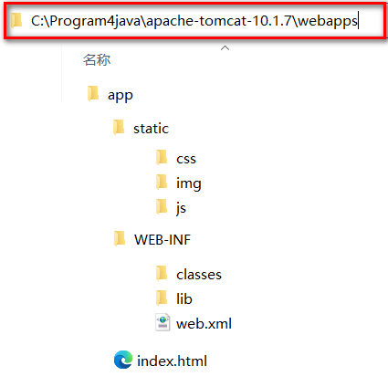

+ app  本应用根目录
  + static 非必要目录,约定俗成的名字,一般在此处放静态资源 ( css  js  img)
  + WEB-INF  必要目录,必须叫WEB-INF,受保护的资源目录,浏览器通过url不可以直接访问的目录
    + classes     必要目录,src下源代码,配置文件,编译后会在该目录下,web项目中如果没有源码,则该目录不会出现
    + lib             必要目录,项目依赖的jar编译后会出现在该目录下,web项目要是没有依赖任何jar,则该目录不会出现
    + web.xml   必要文件,web项目的基本配置文件. 较新的版本中可以没有该文件,但是学习过程中还是需要该文件 
  + index.html  非必要文件,index.html/index.htm/index.jsp为默认的欢迎页

> url的组成部分和项目中资源的对应关系


## 6.5 WEB项目部署的方式

> 方式1   直接将编译好的项目放在webapps目录下  (已经演示)

> 方式2   将编译好的项目打成war包放在webapps目录下,tomcat启动后会自动解压war包(其实和第一种一样)

> 方式3   可以将项目放在非webapps的其他目录下,在tomcat中通过配置文件指向app的实际磁盘路径

+ 在磁盘的自定义目录上准备一个app

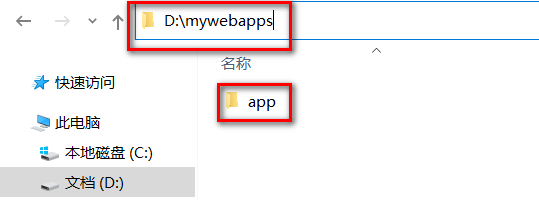

+ 在tomcat的conf下创建Catalina/localhost目录,并在该目录下准备一个app.xml文件

``` xml
<!-- 
	path: 项目的访问路径,也是项目的上下文路径,就是在浏览器中,输入的项目名称
    docBase: 项目在磁盘中的实际路径
 -->
<Context path="/app" docBase="D:\mywebapps\app" />
```

+ 启动tomcat访问测试即可

## 6.6 IDEA中开发并部署运行WEB项目

### 6.6.1 IDEA关联本地Tomcat

> 可以在创建项目前设置本地tomcat,也可以在打开某个项目的状态下找到settings

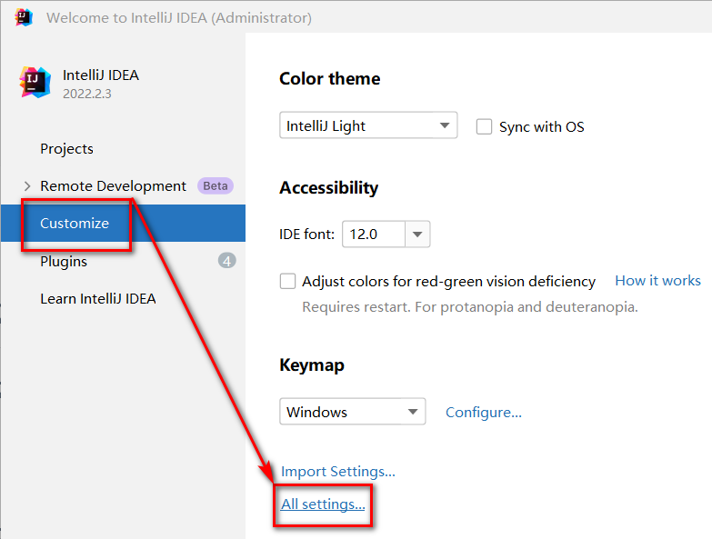

> 找到 Build,Execution,Eeployment下的Application Servers ,找到+号


> 选择Tomcat Server


> 选择tomcat的安装目录


> 点击ok


> 关联完毕


### 6.6.2 IDEA创建web工程

> 推荐先创建一个空项目,这样可以在一个空项目下同时存在多个modules,不用后续来回切换之前的项目,当然也可以忽略此步直接创建web项目


> 检查项目的SDK,语法版本,以及项目编译后的输出目录


> 先创建一个普通的JAVA项目

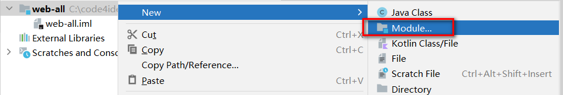

> 检查各项信息是否填写有误


> 创建完毕后,为项目添加Tomcat依赖


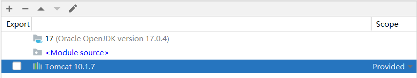

> 选择modules,添加  framework support


> 选择Web Application 注意Version,勾选  Create web.xml


> 删除index.jsp ,替换为 index.html


> 处理配置文件

+ 在工程下创建resources目录,专门用于存放配置文件(都放在src下也行,单独存放可以尽量避免文件集中存放造成的混乱)
+ 标记目录为资源目录,不标记的话则该目录不参与编译


+ 标记完成后,显示效果如下

-

> 处理依赖jar包问题

+ 在WEB-INF下创建lib目录
+ 必须在WEB-INF下,且目录名必须叫lib!!!
+ 复制jar文件进入lib目录

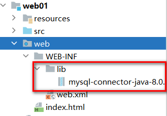

+ 将lib目录添加为当前项目的依赖,后续可以用maven统一解决


+ 环境级别推荐选择module 级别,降低对其他项目的影响,name可以空着不写


+ 查看当前项目有那些环境依赖

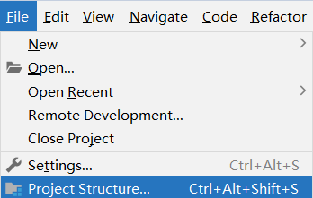


+ 在此位置,可以通过-号解除依赖


### 6.6.3 IDEA部署-运行web项目

> 检查idea是否识别modules为web项目并存在将项目构建成发布结构的配置

+ 就是检查工程目录下,web目录有没有特殊的识别标记


+ 以及artifacts下,有没有对应 _war_exploded,如果没有,就点击+号添加


> 点击向下箭头,出现 Edit Configurations选项


> 出现运行配置界面

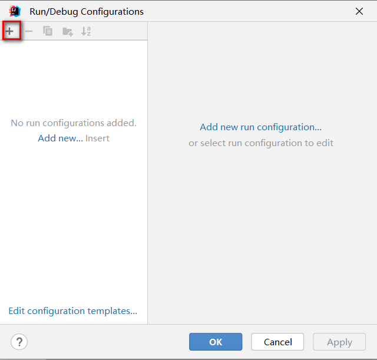


> 点击+号,添加本地tomcat服务器


> 因为IDEA 只关联了一个Tomcat,红色部分就只有一个Tomcat可选


> 选择Deployment,通过+添加要部署到Tomcat中的artifact


> applicationContext中是默认的项目上下文路径,也就是url中需要输入的路径,这里可以自己定义,可以和工程名称不一样,也可以不写,但是要保留/,我们这里暂时就用默认的


> 点击apply 应用后,回到Server部分. After Launch是配置启动成功后,是否默认自动打开浏览器并输入URL中的地址,HTTP port是Http连接器目前占用的端口号


> 点击OK后,启动项目,访问测试

+ 绿色箭头是正常运行模式
+ "小虫子"是debug运行模式

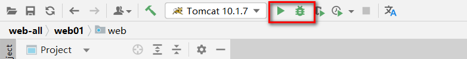

+ 点击后,查看日志状态是否有异常


+ 浏览器自动打开并自动访问了index.html欢迎页


> 工程结构和可以发布的项目结构之间的目录对应关系


> IDEA部署并运行项目的原理

+ idea并没有直接进将编译好的项目放入tomcat的webapps中
+ idea根据关联的tomcat,创建了一个tomcat副本,将项目部署到了这个副本中
+ idea的tomcat副本在C:\用户\当前用户\AppData\Local\JetBrains\IntelliJIdea2022.2\tomcat\中
+ idea的tomcat副本并不是一个完整的tomcat,副本里只是准备了和当前项目相关的配置文件而已
+ idea启动tomcat时,是让本地tomcat程序按照tomcat副本里的配置文件运行
+ idea的tomcat副本部署项目的模式是通过conf/Catalina/localhost/*.xml配置文件的形式实现项目部署的


# 7.HTTP协议

## 7.1 HTTP简介


> **HTTP 超文本传输协议** (HTTP-Hyper Text transfer protocol)，是一个属于应用层的面向对象的协议，由于其简捷、快速的方式，适用于分布式超媒体信息系统。它于1990年提出，经过十几年的使用与发展，得到不断地完善和扩展。**它是一种详细规定了浏览器和万维网服务器之间互相通信的规则**，通过因特网传送万维网文档的数据传送协议。客户端与服务端通信时传输的内容我们称之为**报文**。**HTTP协议就是规定报文的格式。**HTTP就是一个通信规则，这个规则规定了客户端发送给服务器的报文格式，也规定了服务器发送给客户端的报文格式。实际我们要学习的就是这两种报文**。客户端发送给服务器的称为"请求报文**"，**服务器发送给客户端的称为"响应报文"**。


### 7.1.1 发展历程

> HTTP/0.9 

+ 蒂姆伯纳斯李是一位英国计算机科学家，也是万维网的发明者。他在 1989 年创建了单行 HTTP 协议。它只是返回一个网页。这个协议在 1991 年被命名为 HTTP/0.9。 

>  HTTP/1.0

+  1996 年，HTTP/1.0 发布。该规范是显著扩大，并且支持三种请求方法：GET，Head，和POST。 
+  HTTP/1.0 相对于 HTTP/0.9 的改进如下：
   + 每个请求都附加了 HTTP 版本。
   + 在响应开始时发送状态代码。
   + 请求和响应都包含 HTTP 报文头。
   + 内容类型能够传输 HTML 文件以外的文档。
+  但是，HTTP/1.0 不是官方标准。

> HTTP/1.1

+ HTTP 的第一个标准化版本 HTTP/1.1 ( RFC 2068 ) 于 1997 年初发布，支持七种请求方法：OPTIONS，GET，HEAD，POST，PUT，DELETE，和TRACE 

+ HTTP/1.1 是 HTTP 1.0 的增强：

  + 虚拟主机允许从单个 IP 地址提供多个域。

  + 持久连接和流水线连接允许 Web 浏览器通过单个持久连接发送多个请求。

  + 缓存支持节省了带宽并使响应速度更快。

+ HTTP/1.1 在接下来的 15 年左右将非常稳定。 

+ 在此期间，出现了 HTTPS（安全超文本传输协议）。它是使用 SSL/TLS 进行安全加密通信的 HTTP 的安全版本。 

> HTTP/2

+  由IETF在2015年发布。HTTP/2旨在提高Web性能，减少延迟，增加安全性，使Web应用更加快速、高效和可靠。 

- 多路复用：HTTP/2 允许同时发送多个请求和响应，而不是像 HTTP/1.1 一样只能一个一个地处理。这样可以减少延迟，提高效率，提高网络吞吐量。
- 二进制传输：HTTP/2 使用二进制协议，与 HTTP/1.1 使用的文本协议不同。二进制协议可以更快地解析，更有效地传输数据，减少了传输过程中的开销和延迟。
- 头部压缩：HTTP/2 使用 HPACK 算法对 HTTP 头部进行压缩，减少了头部传输的数据量，从而减少了网络延迟。
- 服务器推送：HTTP/2 支持服务器推送，允许服务器在客户端请求之前推送资源，以提高性能。
- 改进的安全性：HTTP/2 默认使用 TLS（Transport Layer Security）加密传输数据，提高了安全性。
- 兼容 HTTP/1.1：HTTP/2 可以与 HTTP/1.1 共存，服务器可以同时支持 HTTP/1.1 和 HTTP/2。如果客户端不支持 HTTP/2，服务器可以回退到 HTTP/1.1。

> HTTP/3

+ 于 2021 年 5 月 27 日发布 , HTTP/3 是一种新的、快速、可靠且安全的协议，适用于所有形式的设备。 HTTP/3 没有使用 TCP，而是使用谷歌在 2012 年开发的新协议 QUIC 
+ HTTP/3 是继 HTTP/1.1 和 HTTP/2之后的第三次重大修订。 

+ HTTP/3 带来了革命性的变化，以提高 Web 性能和安全性。设置 HTTP/3 网站需要服务器和浏览器支持。

+ 目前，谷歌云、Cloudflare和Fastly支持 HTTP/3。Chrome、Firefox、Edge、Opera 和一些移动浏览器支持 HTTP/3。

### 7.1.2 HTTP协议的会话方式

> 浏览器与服务器之间的通信过程要经历四个步骤


-   浏览器与WEB服务器的连接过程是短暂的，每次连接只处理一个请求和响应。对每一个页面的访问，浏览器与WEB服务器都要建立一次单独的连接。
-   浏览器到WEB服务器之间的所有通讯都是完全独立分开的请求和响应对。

### 7.1.3 HTTP1.0和HTTP1.1的区别

> 在HTTP1.0版本中，浏览器请求一个带有图片的网页，会由于下载图片而与服务器之间开启一个新的连接；但在HTTP1.1版本中，允许浏览器在拿到当前请求对应的全部资源后再断开连接，提高了效率。


### 7.1.4 在浏览器中通过F12工具抓取请求响应报文包

> 几乎所有的PC端浏览器都支持了F12开发者工具,只不过不同的浏览器工具显示的窗口有差异


## 7.2 请求和响应报文

### 7.2.1 报文的格式

> 主体上分为报文部首和报文主体,中间空行隔开


> 报文部首可以继续细分为  "行" 和 "头"


### 7.2.2 请求报文

> 客户端发给服务端的报文

+ 请求报文格式
  -   请求首行（**请求行**）；    GET/POST   资源路径?参数   HTTP/1.1
  -   请求头信息（**请求头**）；
  -   空行；
  -   请求体；POST请求才有请求体

> 浏览器 f12 网络下查看请求数据包

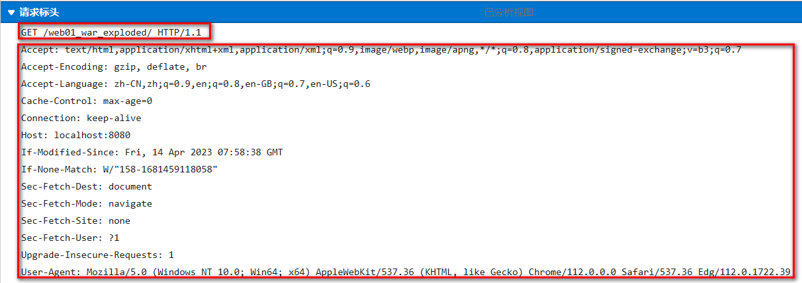

> GET请求特点

1、由于请求参数在请求首行中已经携带了，所以没有请求体，也没有请求空行
2、请求参数拼接在url地址中，地址栏可见\[url?name1=value1\&name2=value2]，不安全
3、由于参数在地址栏中携带，所以由大小限制\[地址栏数据大小一般限制为4k]，只能携带纯文本
4、get请求参数只能上传文本数据
5、没有请求体。所以封装和解析都快，效率高， 浏览器默认提交的请求都是get请求比如：地址栏输入回车,超链接,表单默认的提交方式

> 查看GET请求行,请求头,请求体

+ 请求行组成部分
  + 请求方式  GET
  + 访问服务器的资源路径?参数1=值1&参数2=值2 ... ...
  + 协议及版本 HTTP/1.1

``` http
GET /05_web_tomcat/login_success.html?username=admin&password=123213 HTTP/1.1
```

+ 请求头

```  http
Host: localhost:8080   主机虚拟地址
Connection: keep-alive 长连接
Upgrade-Insecure-Requests: 1  请求协议的自动升级[http的请求，服务器却是https的，浏览器自动会将请求协议升级为https的]
User-Agent: Mozilla/5.0 (Windows NT 6.1; WOW64) AppleWebKit/537.36 (KHTML, like Gecko) Chrome/68.0.3440.75 Safari/537.36
- 用户系统信息
Accept:text/html,application/xhtml+xml,application/xml;q=0.9,image/webp,image/apng,*/*;q=0.8
- 浏览器支持的文件类型
Referer: http://localhost:8080/05_web_tomcat/login.html
- 当前页面的上一个页面的路径[当前页面通过哪个页面跳转过来的]：   可以通过此路径跳转回上一个页面， 广告计费，防止盗链
Accept-Encoding: gzip, deflate, br
- 浏览器支持的压缩格式
Accept-Language: zh-CN,zh;q=0.9,en-US;q=0.8,en;q=0.7
- 浏览器支持的语言
```

+ 请求空行

+ 请求体
  + GET请求数据不放在请求体

> post请求特点

1、POST请求有请求体，而GET请求没有请求体。
2、post请求数据在请求体中携带，请求体数据大小没有限制，可以用来上传所有内容\[文件、文本]
3、只能使用post请求上传文件
4、post请求报文多了和请求体相关的配置\[请求头]
5、地址栏参数不可见，相对安全
6、post效率比get低

+ POST请求要求将form标签的method的属性设置为post

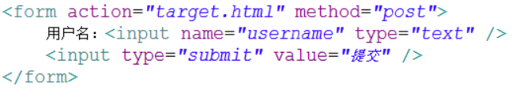

> 查看post的请求行 请求头 请求体

+ 请求行组成部分
  + 请求方式 POST
  + 访问服务器的资源路径?参数1=值1&参数2=值2 ... ...
  + 协议及版本 HTTP/1.1

``` http
POST /05_web_tomcat/login_success.html HTTP/1.1
```

+ 请求头

```  http
Host: localhost:8080
Connection: keep-alive
Content-Length: 31     -请求体内容的长度
Cache-Control: max-age=0  -无缓存
Origin: http://localhost:8080
Upgrade-Insecure-Requests: 1  -协议的自动升级
Content-Type: application/x-www-form-urlencoded   -请求体内容类型[服务器根据类型解析请求体参数]
User-Agent: Mozilla/5.0 (Windows NT 6.1; WOW64) AppleWebKit/537.36 (KHTML, like Gecko) Chrome/68.0.3440.75 Safari/537.36
Accept:text/html,application/xhtml+xml,application/xml;q=0.9,image/webp,image/apng,*/*;q=0.8
Referer: http://localhost:8080/05_web_tomcat/login.html
Accept-Encoding: gzip, deflate, br
Accept-Language: zh-CN,zh;q=0.9,en-US;q=0.8,en;q=0.7
Cookie:JSESSIONID-
```

+ 请求空行

+ 请求体:浏览器提交给服务器的数据

``` http
username=admin&password=1232131
```

### 7.2.3 响应报文

> 响应报文格式

-   响应首行（**响应行**）； 
-   响应头信息（**响应头**）；
-   空行；
-   响应体；

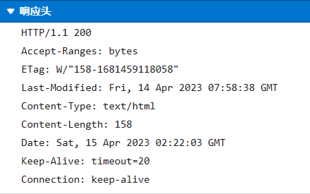


+ 响应行组成部分
  + 协议及版本 HTTP/1.1
  + 响应状态码 200
  + 状态描述   OK  (缺省)

``` http
HTTP/1.1 200 OK
说明：响应协议为HTTP1.1，响应状态码为200，表示请求成功； 
```

+ 响应头

``` http
Server: Apache-Coyote/1.1   服务器的版本信息
Accept-Ranges: bytes
ETag: W/"157-1534126125811"
Last-Modified: Mon, 13 Aug 2018 02:08:45 GMT
Content-Type: text/html    响应体数据的类型[浏览器根据类型解析响应体数据]
Content-Length: 157   响应体内容的字节数
Date: Mon, 13 Aug 2018 02:47:57 GMT  响应的时间，这可能会有8小时的时区差
```

+ 响应体

``` html
<!--需要浏览器解析使用的内容[如果响应的是html页面，最终响应体内容会被浏览器显示到页面中]-->

<!DOCTYPE html>
<html>
  <head>
    <meta charset="UTF-8">
    <title>Insert title here</title>
  </head>
  <body>
    恭喜你，登录成功了...
  </body>
</html>
```

> 响应状态码:响应码对浏览器来说很重要，它告诉浏览器响应的结果。比较有代表性的响应码如下：

+ **200：** 请求成功，浏览器会把响应体内容（通常是html）显示在浏览器中；
+ **404：** 请求的资源没有找到，说明客户端错误的请求了不存在的资源；
+ **405：** 请求的方式不允许
+ **500：** 请求资源找到了，但服务器内部出现了错误；
+ **302：** 重定向，当响应码为302时，表示服务器要求浏览器重新再发一个请求，服务器会发送一个响应头Location指定新请求的URL地址；
+ **304：** 使用了本地缓存

> 更多的响应状态码

| 状态码 | 状态码英文描述                  | 中文含义                                                     |
| :----- | :------------------------------ | :----------------------------------------------------------- |
| 1**    |                                 |                                                              |
| 100    | Continue                        | 继续。客户端应继续其请求                                     |
| 101    | Switching Protocols             | 切换协议。服务器根据客户端的请求切换协议。只能切换到更高级的协议，例如，切换到HTTP的新版本协议 |
| 2**    |                                 |                                                              |
| 200    | OK                              | 请求成功。一般用于GET与POST请求                              |
| 201    | Created                         | 已创建。成功请求并创建了新的资源                             |
| 202    | Accepted                        | 已接受。已经接受请求，但未处理完成                           |
| 203    | Non-Authoritative Information   | 非授权信息。请求成功。但返回的meta信息不在原始的服务器，而是一个副本 |
| 204    | No Content                      | 无内容。服务器成功处理，但未返回内容。在未更新网页的情况下，可确保浏览器继续显示当前文档 |
| 205    | Reset Content                   | 重置内容。服务器处理成功，用户终端（例如：浏览器）应重置文档视图。可通过此返回码清除浏览器的表单域 |
| 206    | Partial Content                 | 部分内容。服务器成功处理了部分GET请求                        |
| 3**    |                                 |                                                              |
| 300    | Multiple Choices                | 多种选择。请求的资源可包括多个位置，相应可返回一个资源特征与地址的列表用于用户终端（例如：浏览器）选择 |
| 301    | Moved Permanently               | 永久移动。请求的资源已被永久的移动到新URI，返回信息会包括新的URI，浏览器会自动定向到新URI。今后任何新的请求都应使用新的URI代替 |
| 302    | Found                           | 临时移动。与301类似。但资源只是临时被移动。客户端应继续使用原有URI |
| 303    | See Other                       | 查看其它地址。与301类似。使用GET和POST请求查看               |
| 304    | Not Modified                    | 未修改。所请求的资源未修改，服务器返回此状态码时，不会返回任何资源。客户端通常会缓存访问过的资源，通过提供一个头信息指出客户端希望只返回在指定日期之后修改的资源 |
| 305    | Use Proxy                       | 使用代理。所请求的资源必须通过代理访问                       |
| 306    | Unused                          | 已经被废弃的HTTP状态码                                       |
| 307    | Temporary Redirect              | 临时重定向。与302类似。使用GET请求重定向                     |
| 4**    |                                 |                                                              |
| 400    | Bad Request                     | 客户端请求的语法错误，服务器无法理解                         |
| 401    | Unauthorized                    | 请求要求用户的身份认证                                       |
| 402    | Payment Required                | 保留，将来使用                                               |
| 403    | Forbidden                       | 服务器理解请求客户端的请求，但是拒绝执行此请求               |
| 404    | Not Found                       | 服务器无法根据客户端的请求找到资源（网页）。通过此代码，网站设计人员可设置"您所请求的资源无法找到"的个性页面 |
| 405    | Method Not Allowed              | 客户端请求中的方法被禁止                                     |
| 406    | Not Acceptable                  | 服务器无法根据客户端请求的内容特性完成请求                   |
| 407    | Proxy Authentication Required   | 请求要求代理的身份认证，与401类似，但请求者应当使用代理进行授权 |
| 408    | Request Time-out                | 服务器等待客户端发送的请求时间过长，超时                     |
| 409    | Conflict                        | 服务器完成客户端的 PUT 请求时可能返回此代码，服务器处理请求时发生了冲突 |
| 410    | Gone                            | 客户端请求的资源已经不存在。410不同于404，如果资源以前有现在被永久删除了可使用410代码，网站设计人员可通过301代码指定资源的新位置 |
| 411    | Length Required                 | 服务器无法处理客户端发送的不带Content-Length的请求信息       |
| 412    | Precondition Failed             | 客户端请求信息的先决条件错误                                 |
| 413    | Request Entity Too Large        | 由于请求的实体过大，服务器无法处理，因此拒绝请求。为防止客户端的连续请求，服务器可能会关闭连接。如果只是服务器暂时无法处理，则会包含一个Retry-After的响应信息 |
| 414    | Request-URI Too Large           | 请求的URI过长（URI通常为网址），服务器无法处理               |
| 415    | Unsupported Media Type          | 服务器无法处理请求附带的媒体格式                             |
| 416    | Requested range not satisfiable | 客户端请求的范围无效                                         |
| 417    | Expectation Failed              | 服务器无法满足Expect的请求头信息                             |
| 5**    |                                 |                                                              |
| 500    | Internal Server Error           | 服务器内部错误，无法完成请求                                 |
| 501    | Not Implemented                 | 服务器不支持请求的功能，无法完成请求                         |
| 502    | Bad Gateway                     | 作为网关或者代理工作的服务器尝试执行请求时，从远程服务器接收到了一个无效的响应 |
| 503    | Service Unavailable             | 由于超载或系统维护，服务器暂时的无法处理客户端的请求。延时的长度可包含在服务器的Retry-After头信息中 |
| 504    | Gateway Time-out                | 充当网关或代理的服务器，未及时从远端服务器获取请求           |
| 505    | HTTP Version not supported      | 服务器不支持请求的HTTP协议的版本，无法完成处理               |

