# 第一章 开发环境搭建

## 1.VM软件简介

VMware Workstation Pro 是 VMware（威睿公司）发布的⼀代虚拟机软件，中⽂名称⼀般称为 "VMware ⼯作站". 它的主要功能是可以给⽤户在单⼀的桌⾯上同时运⾏不同的操作系统，它也是可进 ⾏开发、测试、部署新的应⽤程序的最佳解决⽅案。Vmware WorkStation 可在⼀部实体机器上模拟 完整的⽹络环境，以及可便于携带的虚拟机器。对于企业的 IT 开发⼈员和系统管理员⽽⾔，Vmware 在虚拟⽹络，实时快照，拖拽共享⽂件夹等⽅⾯的特点使它成为必不可少的⼯具。

## 2.软件安装

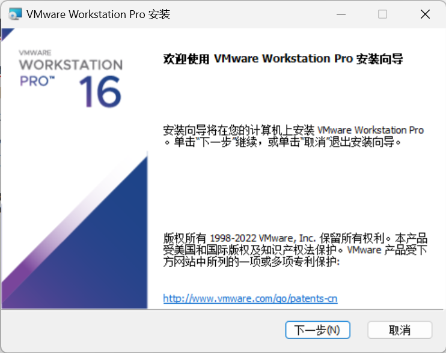

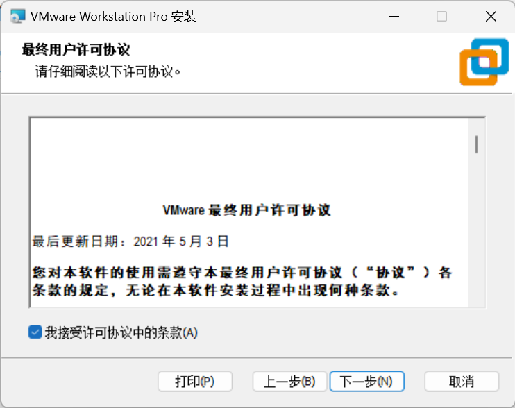

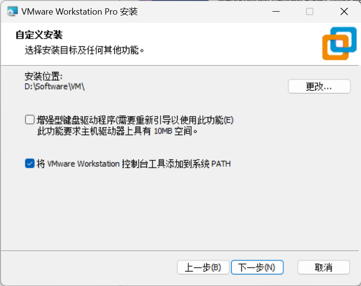

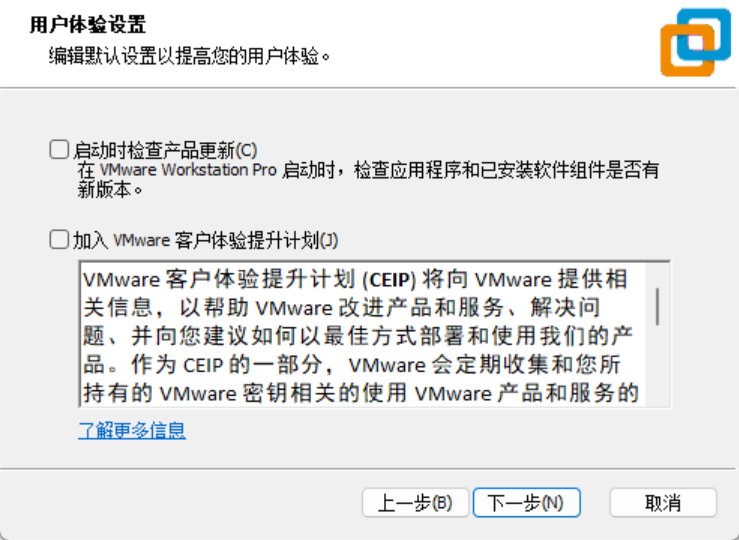

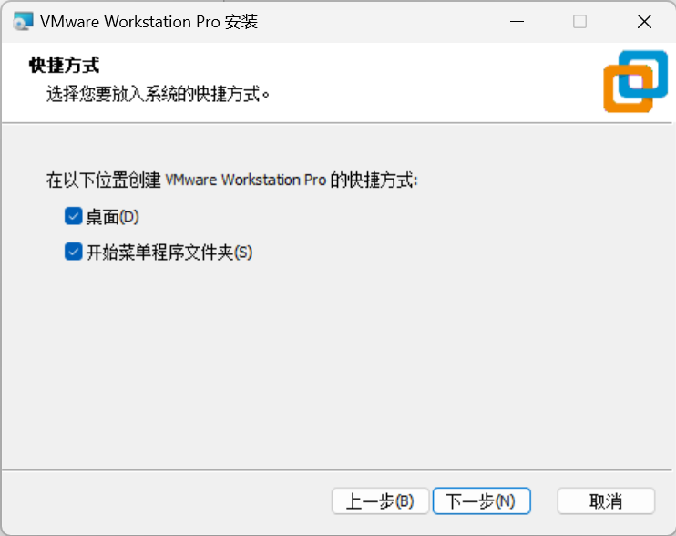

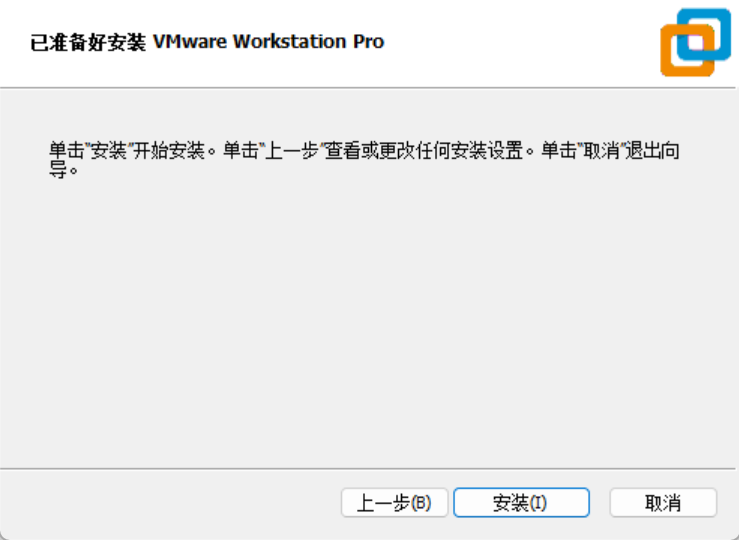

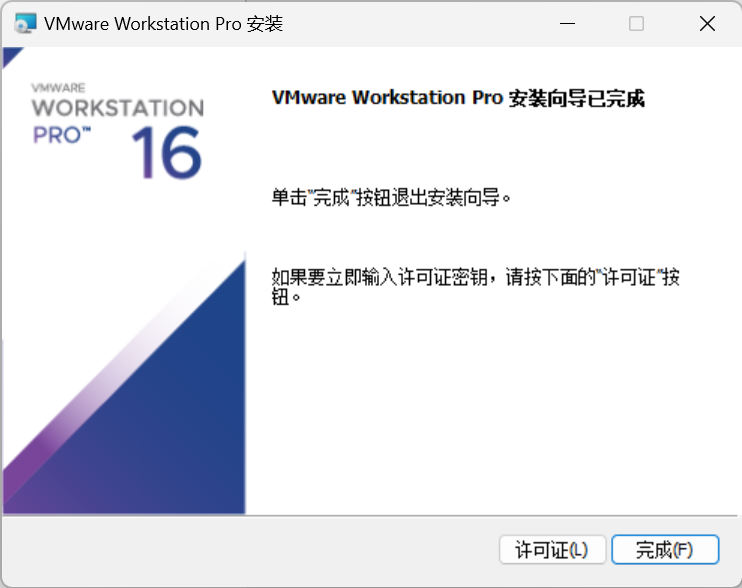

点击许可证，许可证自行搜索，都可以搜到的。

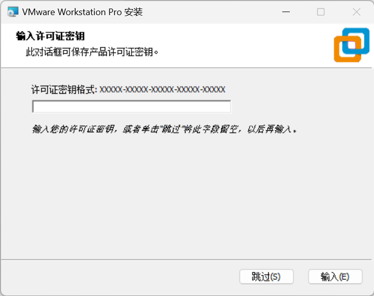

输入秘钥后安装就完成了！

# 第二章 计算机基础知识

1945 年冯诺依曼和⼀些科学家提出了⼀份报告, 报告遵循了图灵机的设计，并提出⽤电⼦元件构造计算机，约定了⽤⼆进制进⾏计算和存储，并且将计算机结构分成运算器，控制器、存储器、输⼊设备、 输出设备等 5 个部分。这⼏个部分组成了计算机的硬件。 

**存储程序的思想** ：系统的运⾏过程就是按照⼀定的顺序不断执⾏存储器中的程序指令的过程

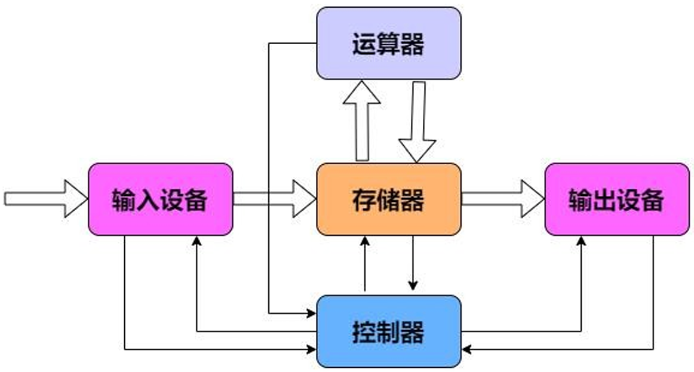

**存储器的分类**
主存储器 ：我们也叫内存, 程序中待处理的数据和处理的结果都存储在内存中。
外存储器 ： 常⽤就是硬盘, 是⽤来⻓期保存数据的⼤容量存储器。
寄存器 ： CPU 内部的⾼速存储器，速度快，数⽬少

**编程语言的发展**

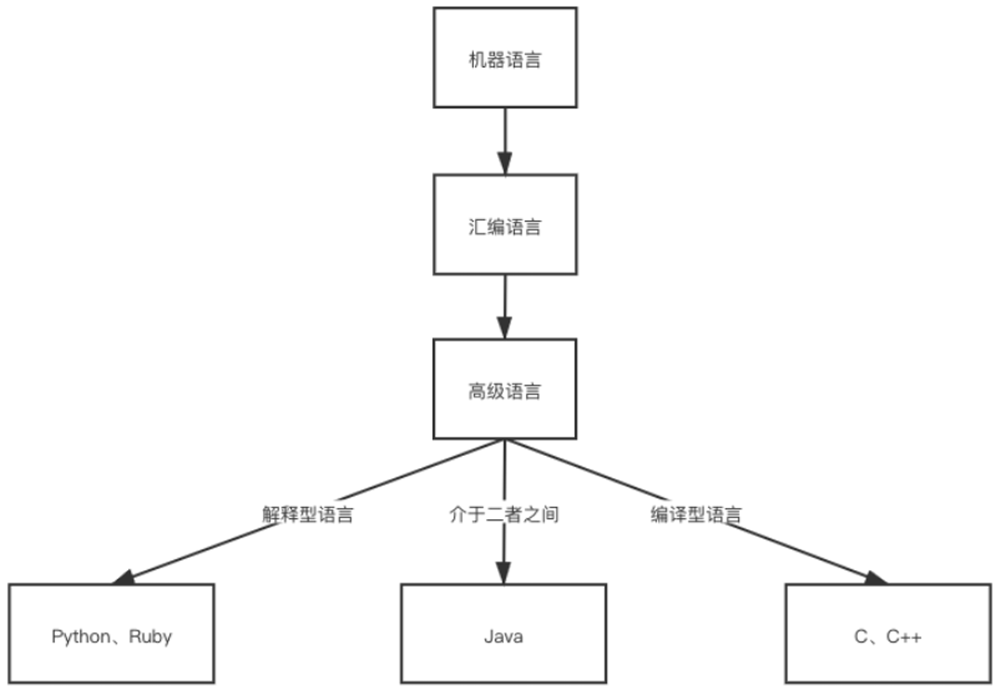

机器语⾔： 即⼆进制, 直接使⽤机器指令 (0，1 序列) 来设计程序，可以被计算机系统直接识
别。和⾃然语⾔完全不同，难于记忆和理解，⼯作量⼤，效率低，⽆法移植。

汇编语⾔： 把机器指令符号化，即通过⼀组简单的的符号来表示机器指令，更接近于⾃然语
⾔，更容易理解和使⽤。 和机器语⾔⼀样，开发⼯作量⼤，⽆法移植。

⾼级语⾔：与特定的计算机系统⽆关，更接近于⼈类⾃然语⾔。⼀条语句对应多条机器指令，
⼯作量⼩，开发效率⾼。 常⽤的解析性语⾔有 python,shell，Ruby。常⽤的编译型语⾔有
C,C++,JAVA 等。

我们常常使⽤的计算机是不能理解⾼级语⾔的，更不能直接执⾏⾼级语⾔，它只能直接理解机器语⾔，
所以使⽤任何⾼级语⾔编写的程序若想被计算机运⾏，都必须将其转换成计算机语⾔，也就是机器码。
操作系统提供了两种转换⽅法：1. 编译 2. 解释。
所以⾼级语⾔也分为编译型语⾔和解释型语⾔。主要区别在于，前者源程序编译后即可在该平台运⾏，
后者是在运⾏期间才编译。所以前者运⾏速度快，后者跨平台性好。
特点：
针对不同的平台，需要使⽤对应的编译器，它可以将⾼级语⾔源代码⼀次性的编译成可被该平台硬件执
⾏的机器码，并包装成该平台所能识别的可执⾏性程序的格式。
总结1：

1. 与特定的平台有关，在其他平台使⽤，需要想办法移植。
2. 可以编译成平台相关的机器语⾔⽂件，运⾏时脱离开发环境，运⾏效率⾼；
特点：
解释器是对源程序逐⾏解释成特定平台的机器码并⽴即执⾏。是代码在执⾏时才被解释器⼀⾏⾏动态翻
译和执⾏，⽽不是在执⾏之前就完成翻译

总结2： 

1. 解释型语⾔每次运⾏都需要将源代码解释称机器码并执⾏，效率⾏对较低，但是书写简单。 
2. 不同的平台只要提供相应的解释器，就可以运⾏源代码，所以可以⽅便源程序移植；

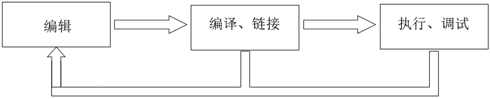

说明: ⽆论是⾼级程序设计语⾔还是专⽤程序设计语⾔，都不能被计算机系统直接识别，⽤这些语⾔所编 写 的程序代码称为源程序，源程序需要通过预先设计好的专⽤程序进⾏转换，转换为计算机系统可以识别 的机器指令，然后才能交由计算机系统执⾏。