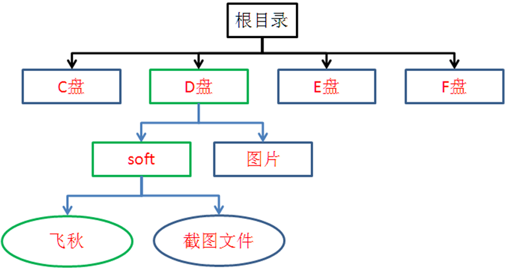
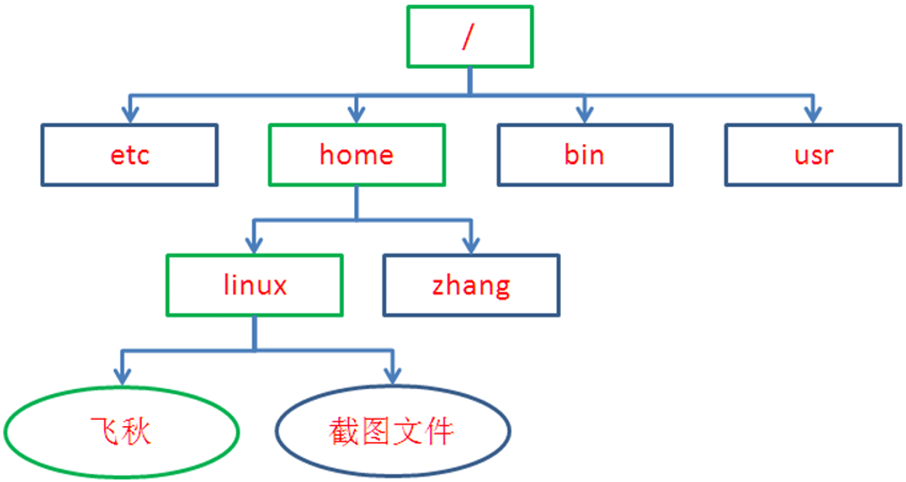

# 第一章 Linux基础命令

## 1.1 开发环境搭建

安装VM，安装ubuntu18.04

## 1.2 Windows和Linux

微软 Windows 操作系统将硬盘上的⼏个分区，⽤ A：、B：、C：、D：等符号标识。存取⽂件时⼀定要清楚存放在哪个磁盘的哪个⽬录下。



Linux 的⽂件组织模式犹如⼀颗倒置的树，这与 Windows ⽂件系统有很⼤差别。所有存储设备作为这颗树的⼀个⼦⽬录。存取⽂件时只需确定⽬录就可以了，⽆需考虑物理存储位置。



## 1.3 Linux路径含义

**/bin**：bin 是⼆进制（binary）英⽂缩写。 

**/boot**：存放的都是系统启动时要⽤到的程序。 

**/dev**：包含了所有 Linux 系统中使⽤的外部设备。 

**/etc**：存放了系统管理时要⽤到的各种配置⽂件和⼦⽬录。 

**/lib**：存放系统动态连接共享库的。 

**/home**：普通⽤户的主⽬录。

**/root**：根⽤户（超级⽤户）的主⽬录。

## 1.4 常用快捷键

开启一个新的终端：ctrl + alt + t

虚拟机全屏：ctrl + alt + 回⻋

清屏：Ctrl + l

终端字体变大：Ctrl 加 shift 加 +

终端字体缩小：ctrl + - 

鼠标退出虚拟机控制：ctrl + alt

## 1.5 Linux基础命令

| 命令  | 功能                                                         | 参数及格式                                                   |
| ----- | :----------------------------------------------------------- | ------------------------------------------------------------ |
| pwd   | print work directory 的缩写, 显示当前⽬录的绝对路径          |                                                              |
| cd    | change directory 的缩写, 切换⽬录；<br />绝对路径：以 / 为起点，遍历到⼦⽬录；<br />相对路径：以当前⽬录为起点，遍历到⼦⽬录。 | .   当前⽬录<br />..  上层⽬录 <br />-   上⼀次操作所在路径 <br />~   相当于 /home/ ⽤户名的路径 |
| ls    | list 单词的缩写, 列出当前⽬录的内容                          |                                                              |
| touch | 新建⼀个⽂件                                                 |                                                              |
| clear | 清屏                                                         |                                                              |
| mkdir | 在当前⽬录下新建⽂件夹                                       |                                                              |
| rm    | 默认删除⽂件，加上指定参数后，可删除⽂件夹                   | -r   删除文件夹<br />-f   强制执行                           |
| cp    | 复制⽂件 / ⽂件夹到指定⽬录                                  | 拷贝源文件到指定目录：   cp   源文件   目标路径<br />创建文件副本：   cp   源文件   目标文件<br />拷贝源文件夹：   cp   源文件夹   目标文件夹   -a |
| mv    | 移动文件                                                     | 把源文件移动到指定目录：mv   源文件   目标路径<br />把源文件重命名为目标文件：mv   源文件   目标文件<br />把源文件夹移动到指定目录：mv   原文件夹   目标文件夹 |

**例1：cd用法**

```shell
cd  /home/linux/Desktop   		#绝对路径的⽤法
cd  /home/linux           		#相对路径的⽤法
cd  ./Desktop
cd  ../                   		#返回上层⽬录
cd  -                     		#返回上次操作的路径
```

**例2：ls和pwd用法**

```shell
pwd                          	#显示当前⽬录
cd   /home/linux             	#进⼊linux⽂件夹中
ls                           	#列出当前⽬录下的内容
pwd
cd   ..                      	#进⼊上层⽬录
pwd
cd  ./linux                  	#进⼊当前⽬录下的linux⽂件夹中
 
```

**例3：mkdir、touch、rm用法**

```shell
cd     /home/linux                      #进⼊/home/linux⽂件夹
mkdir  Cbase                            #新建⽂件Cbase⽂件夹
cd    ./Cbase                           #进⼊Cbase⽂件夹
touch  log1.txt  log2.txt log3.txt      #创建log1.txt log2.txt log3.txt⽂件
mkdir  dirTest                          #新建dirTest⽬录
clear                                   #清屏
rm     log1.txt log2.txt                #删除log1.txt log2.txt⽂件
rm  -rf dirTest                         #删除dirTest⽂件夹
```


**练习**5

①进⼊ / home/linux ⽬录, 利⽤ ls 查看当前⽂件下的内容，⽤ pwd 命令观察路径。

②再次进⼊ / etc ⽬录, 利⽤ ls 查看当前⽬录下的内容。

③再次进⼊到 / home/linux ⽬录下新建⼀个 first ⽂件夹

④进⼊ first ⽂件夹中新建⼀个 log1.txt 和 log2.txt, ⿏标双击打开写⼊ "Hello World"

⑤然后把 log1.txt 拷⻉到上层⽬录.

⑥然后把 log2.txt 重命名为 log.c

**答案**

①cd /home/linux；   ls；    pwd；

②cd /etc；ls

⑥cd /home/linux

mkdir first

cd first

touch log1.txt log2.txt

cp log1.txt ../

mv log2.txt log.c