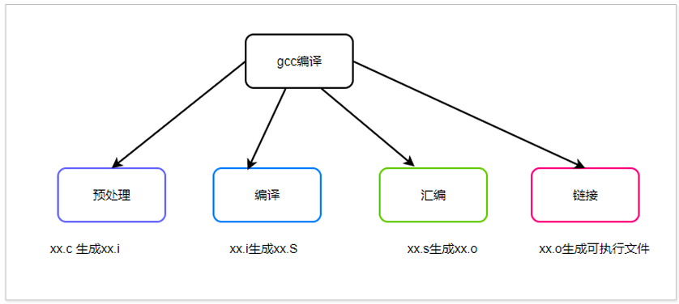
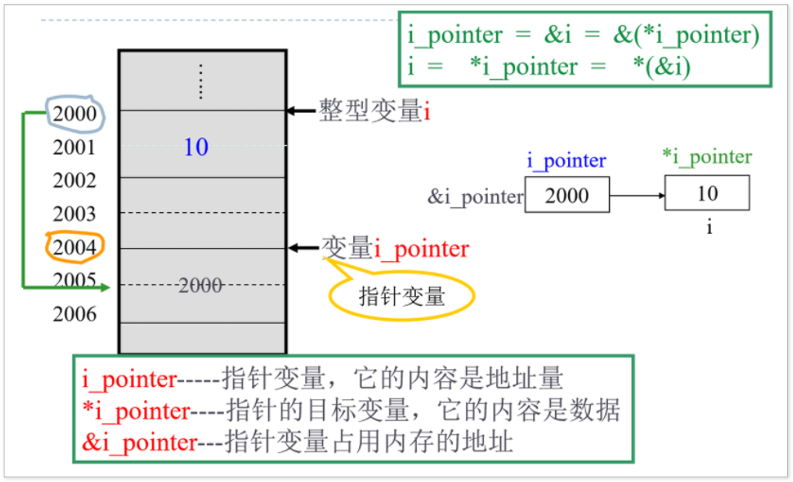
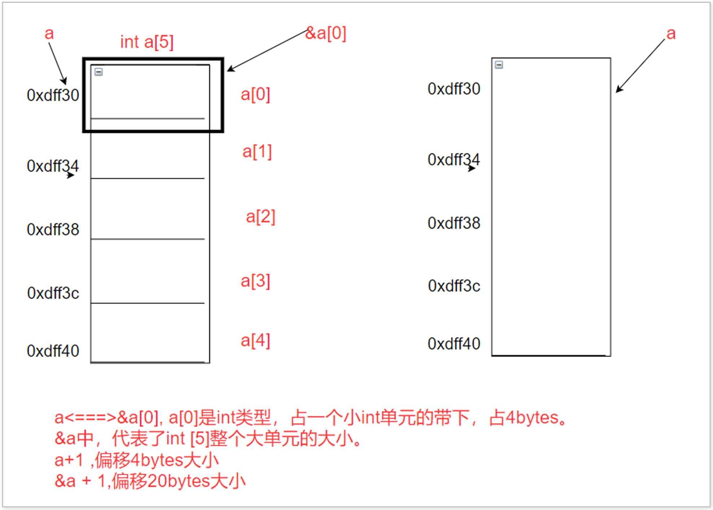
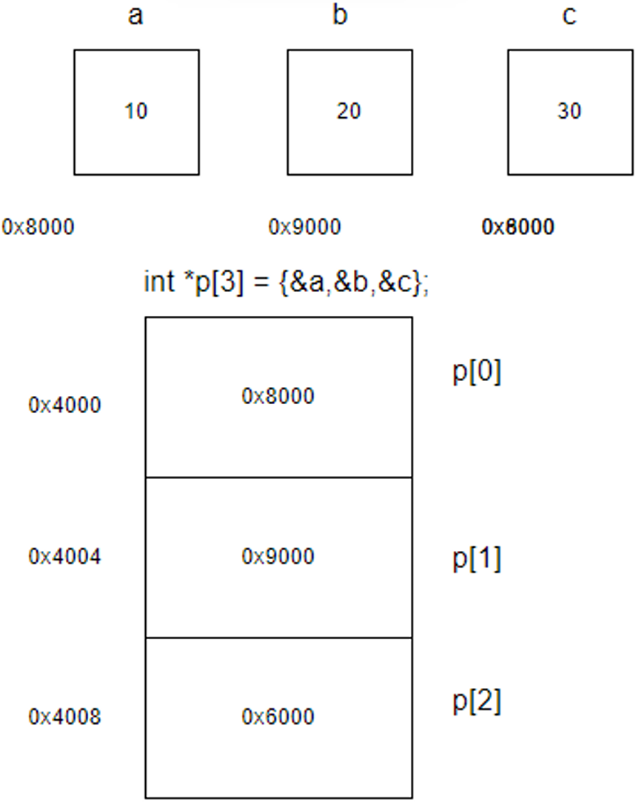

# 1.Linux基础命令

## 1.1 开发环境搭建

安装VM，安装ubuntu18.04

## 1.2 Windows和Linux

微软 Windows 操作系统将硬盘上的⼏个分区，⽤ A：、B：、C：、D：等符号标识。存取⽂件时⼀定要清楚存放在哪个磁盘的哪个⽬录下。


Linux 的⽂件组织模式犹如⼀颗倒置的树，这与 Windows ⽂件系统有很⼤差别。所有存储设备作为这颗树的⼀个⼦⽬录。存取⽂件时只需确定⽬录就可以了，⽆需考虑物理存储位置。


## 1.3 Linux路径含义

**/bin**：bin 是⼆进制（binary）英⽂缩写。 

**/boot**：存放的都是系统启动时要⽤到的程序。 

**/dev**：包含了所有 Linux 系统中使⽤的外部设备。 

**/etc**：存放了系统管理时要⽤到的各种配置⽂件和⼦⽬录。 

**/lib**：存放系统动态连接共享库的。 

**/home**：普通⽤户的主⽬录。

**/root**：根⽤户（超级⽤户）的主⽬录。

## 1.4 常用快捷键

开启一个新的终端：ctrl + alt + t

虚拟机全屏：ctrl + alt + 回⻋

清屏：Ctrl + l

终端字体变大：Ctrl 加 shift 加 +

终端字体缩小：ctrl + - 

鼠标退出虚拟机控制：ctrl + alt

## 1.5 Linux基础命令

| 命令  | 功能                                                         | 参数及格式                                                   |
| ----- | :----------------------------------------------------------- | ------------------------------------------------------------ |
| pwd   | print work directory 的缩写, 显示当前⽬录的绝对路径          |                                                              |
| cd    | change directory 的缩写, 切换⽬录；<br />绝对路径：以 / 为起点，遍历到⼦⽬录；<br />相对路径：以当前⽬录为起点，遍历到⼦⽬录。 | .   当前⽬录<br />..  上层⽬录 <br />-   上⼀次操作所在路径 <br />~   相当于 /home/ ⽤户名的路径 |
| ls    | list 单词的缩写, 列出当前⽬录的内容                          |                                                              |
| touch | 新建⼀个⽂件                                                 |                                                              |
| clear | 清屏                                                         |                                                              |
| mkdir | 在当前⽬录下新建⽂件夹                                       |                                                              |
| rm    | 默认删除⽂件，加上指定参数后，可删除⽂件夹                   | -r   删除文件夹<br />-f   强制执行                           |
| cp    | 复制⽂件 / ⽂件夹到指定⽬录                                  | 拷贝源文件到指定目录：   cp   源文件   目标路径<br />创建文件副本：   cp   源文件   目标文件<br />拷贝源文件夹：   cp   源文件夹   目标文件夹   -a |
| mv    | 移动文件                                                     | 把源文件移动到指定目录：mv   源文件   目标路径<br />把源文件重命名为目标文件：mv   源文件   目标文件<br />把源文件夹移动到指定目录：mv   原文件夹   目标文件夹 |

**例1：cd用法**

```shell
cd  /home/linux/Desktop   		#绝对路径的⽤法
cd  /home/linux           		#相对路径的⽤法
cd  ./Desktop
cd  ../                   		#返回上层⽬录
cd  -                     		#返回上次操作的路径
```

**例2：ls和pwd用法**

```shell
pwd                          	#显示当前⽬录
cd   /home/linux             	#进⼊linux⽂件夹中
ls                           	#列出当前⽬录下的内容
pwd
cd   ..                      	#进⼊上层⽬录
pwd
cd  ./linux                  	#进⼊当前⽬录下的linux⽂件夹中
 
```

**例3：mkdir、touch、rm用法**

```shell
cd     /home/linux                      #进⼊/home/linux⽂件夹
mkdir  Cbase                            #新建⽂件Cbase⽂件夹
cd    ./Cbase                           #进⼊Cbase⽂件夹
touch  log1.txt  log2.txt log3.txt      #创建log1.txt log2.txt log3.txt⽂件
mkdir  dirTest                          #新建dirTest⽬录
clear                                   #清屏
rm     log1.txt log2.txt                #删除log1.txt log2.txt⽂件
rm  -rf dirTest                         #删除dirTest⽂件夹
```

**例4：cp用法**

```shell
cp  hello.c   /home/linux/Cbase          #把hello.c拷⻉到Cbase⽂件夹中
cp  hello.c   world.c                    #把hello.c复制⼀份命名为world.c
cp  Cbase   ../    -a                    #把Cbase⽂件夹拷⻉到上层⽬录
```


**练习**5

①进⼊ / home/linux ⽬录, 利⽤ ls 查看当前⽂件下的内容，⽤ pwd 命令观察路径。

②再次进⼊ / etc ⽬录, 利⽤ ls 查看当前⽬录下的内容。

③再次进⼊到 / home/linux ⽬录下新建⼀个 first ⽂件夹

④进⼊ first ⽂件夹中新建⼀个 log1.txt 和 log2.txt, ⿏标双击打开写⼊ "Hello World"

⑤然后把 log1.txt 拷⻉到上层⽬录.

⑥然后把 log2.txt 重命名为 log.c

**答案**

①cd /home/linux；   ls；    pwd；

②cd /etc；ls

⑥cd /home/linux

mkdir first

cd first

touch log1.txt log2.txt

cp log1.txt ../

mv log2.txt log.c

# 2.Vim编辑器

## 2.1 Vim编辑器的介绍及使用

我们想要编写 C 语⾔代码，可以使⽤ linux 系统提供的⼯具才能进⾏代码的编写。代码编写完成之后，我们还需要验证书写的代码是否正确。这就需要编译器来进行验证。linux 系统为我们提供了⽐较好的开发⼯具。

Vim编辑器：书写代码的工具；

Gcc编译器：编译代码的工具。

## 2.2 Vim编辑器的基本操作

| 模式     | 使用方法                                                     |
| -------- | ------------------------------------------------------------ |
| 命令模式 | vim + hello.c 默认打开的默认, 不能书写代码, 只能进⾏复制, 粘贴等命令操作 |
| 插⼊模式 | 按下⼩写的 “ i" 键, 在终端的左下⻆会出现⼀个叫 做 "insert ”  的关键字, <br />便是进⼊插⼊模式, 可以书写代码了 |
| 底⾏模式 | 代码书写完毕键，按下 esc 键，退出插⼊模式。<br/>再按下 shift + “ :” 键, 可以使⽤以下指令：<br />w保存（write 的缩写）、 q 退出（quit 的缩写）、a 所有（all的缩写）、 ! 强制执⾏ |

常⽤指令： wq , q!

注：若是⽤⽼师提供的 linux 系统，可直接⽤空格键, 在终端的做左下脚出现**":"**, 表示进⼊底⾏模式。

注：以下操作要求在命令模式进⾏。 【按下 esc 键后，可进⼊命令模式】

| 命令 | 功能                                                         |
| ---- | ------------------------------------------------------------ |
| u    | 英文全称为undo，取消上一次操作（及恢复功能），相当于windows中的Ctrl+z |
| v    | v+↑or↓键，选中多行<br />v+←or→键，选中多个字符<br />相当于windows中的shift键 |
| y    | 复制                                                         |
| p    | 粘贴                                                         |
| x    | 剪切                                                         |


# 3.GCC编译器

## 3.1 GCC编译器的介绍及使用

GCC 它是由 GNU 开发的编程语⾔编译器。它是 GNU Compiler Collection（GNU编译器集合）的缩写。可以⽤来编译C,C++,Object-C 等多种语⾔。它是 Linux 下提供⼀般⽤户使⽤的标准编译器。

### 3.1.1 安装GCC编译器

```shell
sudo apt-get install gcc
```

### 3.1.2 GCC编译器的用法

**方法1：使用系统生成的可执行文件**

```shell
gcc hello.c 			#以64位的微处理器编译代码
gcc -m32 hello.c 		#以32位的微处理器编译代码
```

 系统默认会在当前⽬录下，⽣成⼀个叫做 a.out 的⽂件.【all out】

```shell
./a.out			#执⾏ a.out ⽂件，输出对应的结果.
```

**方法2：用户自定义可执行文件**

```shell
gcc hello.c -o exec 		#以64位的微处理器编译代码
gcc -m32 hello.c -o exec	#以32位的微处理器编译代码
```

⽤户⾃定义⽣成的可执⾏⽂件名字。

```shell
./exec 			#执⾏./exec ⽂件，输出对应的结果.
```

### 3.1.3 GCC编译的流程



预处理 ----> 把编写好的xx.c源代码⽣成我预处理过得 C 代码 xx.i

编译 ----> 把我们预处理过的代码⽣成我们的汇编代码 xx.s

汇编 ----> 把汇编代码⽣成我们的⽬标⽂件 xx.o

链接 ----> 把我们的⽬标⽂件⽣成我们的可执⾏⽂件

**练习：⾃⼰把下列代码写出来，⽤ GCC 编译器运⾏，运⾏查看结果。**

```c
#include <stdio.h>
int main()
{
    int a = 10;
    int sum = 0;
    sum = sum + 1;
    sum = sum + 2;
    sum = sum + 3;
    sum = sum + 4;
    sum = sum + 5;
    printf("sum = %d\n",sum);
    return 0;
}
```

# 4.c语言中的常量

## 4.1 整形常量

10、20、-5、-100

## 4.2 浮点型常量

3.1415926、-2.5、1e5、314e-2

## 4.3 字符常量

在 C 语⾔中规定，每个字符有个对应的 ascii 的整数值与之对应。  ⼀个字符常量占 1bytes， 1bytes = 8bit。

linux 中查询 ascii 码的⽅法 ： man ascii。

例如：'a'、‘b’、‘c’、‘d’、'A'、‘1’、‘8’。

## 4.4 字符串常量

字符串常量用 "" 括起来，等价于多个字符的结合 + '\0。

例如："hello"等价于'h'+'e'+'l'+'l'+'o'+'\n'

## 4.5 标识常量（宏定义）

⽤宏名来代替某些常量数据，在某些特殊的场合可以提⾼程序的可读性。  宏名替换后为常量，常⼤写。

**格式：**

```c
#define 标识符号名 常量数据
```

**例：**

```c
#define	MAX	100
#define	STR	"This is a example"
```

**课后任务：**

请⼤家说出 "88.88" 是下列哪种常量？ () 

A. 整型常量   B. 浮点型常量  C. 字符串常量  D. 字符常量

# 5.c语言中的输出函数

```c
printf("字符串 + 格式控制串",参数1,参数2,...);
```

**功能：**向屏幕上输出 " " 中的内容， " " 中字符串原样输出，格式控制串会被后⾯的参数给替换掉，参数的个数由格式控制串的个数来决定。

**参数：**

| 格式控制串 | 功能                                                |
| ---------- | --------------------------------------------------- |
| %d         | 输出⼗进制数，把后⾯参数当作⼗进制数据输出          |
| %c         | 输出字符                                            |
| %s         | 输出字符串                                          |
| %f         | 输出⼩数                                            |
| %e         | 以科学计数法的形式输出⼩数 ，3.14e10                |
| %o         | 输出⼋进制数, 若是加上 #, 会输出对应的标志位 0      |
| %x         | 输出⼗六进制数据, 若是加上 #, 会输出对应的标志位 0x |

**例1：**

```c
 #include <stdio.h>
 int main()
 {
        printf("int = %d %d %d\n",10,20,30);
        printf("char = %c %c %c\n",'X','Y','Z');
        printf("string = %s\n","welcome to china!");
        printf("float = %f\n",3.14159267);
        printf("float = %e\n",131492834.23234323);
        printf("=================================\n");
        printf("dec = %d\n",10); 
        printf("oct = %#o\n",10); 
        printf("hex = %#x\n",10); 
        return 0;
 }
```

 **输出：**

```output
int = 10 20 30
char = X Y Z
string = welcome to china!
float = 3.141593
float = 1.314928e+08
=================================
dec = 10
oct = 012
hex = 0xa
```

**例2：**

```c
#include <stdio.h>
 int main()
 {
        printf("%c = %d\n",'A','A');
        printf("%c = %d\n",'A' + 32,'A' + 32);
        printf("%c = %d\n",'1','1' - 48); 
        printf("%c = %d\n",'\141','\141'); 
        printf("%c = %d\n",'\x61','\x61'); 
        return 0;
 }
```

**输出：**

```
 A = 65
 a = 97
 1 = 1
 a = 97
 a = 97
```

**例3：**

```c
 #include <stdio.h>
 #define N  10
 #define M  N + N
 #define SUM  M * M
 int main()
 {
        printf("M = %d\n",M);  
        printf("SUM = %d\n",SUM);
        return 0;
 }
```

**输出：**

```
120
```

**练习：**

①要求利⽤ "%c : %d" 这种格式，向屏幕上输出’a’,‘m’,’ '对应的字符形式和⼗进制数形式。
	要求利⽤ %f 输出 3.14159287
	要求利⽤ %e 输出 31455452232.88232

```c
#include<stdio.h>
int main()
{
	printf("%c = %d\n", 'a', 'a');
	printf("%c = %d\n", 'm', 'm');
	printf("%f\n", 3.14159287);
	printf("%e\n", 31455452232.88232);

}
```

②printf(“data1 = %c : %d”,?,?); //? 中包含’A’思考如何变成’a’
	printf(“data2 = %d”, ?); //? 中包含’1’，思考如何通过’1’要求输出⼗进制数 1

```c
#include<stdio.h>
int main()
{
	printf("%c:%d\n", 'A'+32, 'A' + 32);
	printf("%d\n", '1' - 48);
	return 0;
}
```

# 6.c语言中的变量

在实际编程和⽣活中, 某些数据并不是⼀成不变的，⽽是根据实际的需求，可以时时改变。这样变量的应运⽽⽣。数据可以变量的量，我们叫做变量。本质是系统在内存中申请⼀块空间，根据⽤户的需求，随时改变申请空间中的数据。

| 数据类型  | 大小（Byte） |
| --------- | ------------ |
| short     | 2            |
| int       | 4            |
| long      | 4            |
| long long | 8            |
| float     | 4            |
| double    | 8            |
| char      | 1            |

变量名由字符、数字、下划线组成，⾸个单词⼀定要是字⺟或下划线。

**sizeof()函数：**

格式：sizeof(变量名) or sizeof(数据类型)

作用：获取某个变量或数据类型在内存中所占的大小

注意：sizeof()的返回值输出时用%ld占位

**例：**

```c
int a;
printf("sizeof(a) = %ld\n",sizeof(a));  
printf("sizeof(int) = %ld\n",sizeof(int))
```

**练习：**

要求⾃⼰设计 3 个变量 a,b,c。分别⽤来保存 10、3.14、'M’这 3 个数据；分别利⽤ sizeof 输出 a,b,c 的⼤⼩；然后输出 a,b,c 的值。

```c
#include<stdio.h>
int main()
{
	int a = 10;
	double b = 3.14;
	char c = 'M';
	printf("sizeof(a) = %ld\n", sizeof(a));
	printf("sizeof(b) = %ld\n", sizeof(b));
	printf("sizeof(c) = %ld\n", sizeof(c));
	printf("a = %d\n", a);
	printf("b = %lf\n", b);
	printf("c = %c\n", c);
	return 0;
}

```

# 7.c语言中的输入函数

## 7.1 获取变量内存地址的方法

**格式**：& + 变量名

**说明**：& 是取地址符号，获得 a 变量在内存中的地址。使用%p 打印变量在内存中的地址信息

**例：**

```c
#include<stdio.h>
int main()
{
	int a;
	printf("%p\n", &a);
	return 0;
}
```

**使用 gcc 编译：默认以64位输出**

```
0x7ffcee2869d4
```

**使用 gcc -m32 编译：以32位输出（推荐）**

```
0xff829a98
```

## 7.2 scanf()函数

格式：scanf(“格式控制串”, 变量 1 的地址，变量 2 的地址…);

功能：从键盘输⼊数据存放到变量 1，变量 2…, 变量 n 所表示的内存单元。

### 7.2.1 ⼗进制数的输⼊ [%d]

格式：scanf("%d%d...",变量1的地址，变量2的地址....);

功能：⽤户从键盘输⼊整数赋值给变量,以空格，回⻋，tab键作为输⼊的分隔符号。

### 7.2.2 ⼩数的输⼊ [%f], [%lf]

格式：scanf("%f%f...",变量1的地址，变量2的地址....);

功能：⽤户从键盘输⼊⼩数赋值给变量，以空格，回⻋，tab键作为输⼊的分隔符号。

### 7.2.3 字符的输⼊ [%c]

格式：scanf("%c%c...",变量1的地址，变量2的地址....);

功能：⽤户从键盘输⼊字符赋值给变量。字符数据必须连续写，没有对应的分隔符号。

[注: '\n','\t',' '这些也都是有效的字符]

**练习：**

①要求⽤从键盘输⼊两个整形数据，赋值给 a 和 b，并输出a和b的值；利⽤ %p 输出 a 和 b 的地址观察结果。

```c
#include<stdio.h>
int main()
{
	int a, b;
	printf("please input two number:");
	scanf("%d%d", &a, &b);
	printf("a = %d, b = %d\n", a, b);
	printf("&a = %p, &b = %p\n", &a, &b);
}
```

②要求⽤从键盘输⼊两个字符型数据，赋值给 a 和 b，并输出a和b的值；利⽤ %p 输出 a 和 b 的地址观察结果。

```c
#include<stdio.h>
int main()
{
	char a, b;
	printf("please input two character:");
	scanf("%c%c", &a, &b);
	printf("a = %c, b = %c\n", a, b);
	printf("&a = %p, &b = %p\n", &a, &b);
	return 0;
}
```

# 8.数据在内存中的存储

数据类型中，整形和字符型都可以分为两种, 分别⽤两个关键字对应。

|          | signed                       | unsigned               |
| -------- | ---------------------------- | ---------------------- |
| 含义     | 有符号数据 【正数, 0, 负数】 | ⽆符号数据 【正数，0】 |
| 常⽤写法 | signed int                   | unsigned int           |
| 特点     | 可省略                       | 不可省略               |

**例：**

```c
signed char  a ;   
unsinged char b;
signed int c;     
unsinged int  d;
```

**8bit数据的存储：**

char，有符号类型，占 1bytes。 可以表示负数、0、正数。范围 [-128~127] 

unsigned char，⽆符号类型，占 1bytes。可以表示 0、正数。范围 [0~255]

**超出范围数据的计算方法：**

①范围

char [-128 ~ 127] 正数、负数、0

unsigned char [0 ~ 255] 正数、0

②设计规则

⽆符号类型的数原码、反码、补码是它本身。[正数和 0]

有符号类型的数的最⾼位表示符号位，0 表示为正数，1 表示为负数。

负数的反码 = 符号位不变，其他位按位取反

负数的补码 = 反码 + 1

③计算方法

先计算整数的补码 (即 = 右边的数)

把补码赋值给变量，然后观察变量的数据类型，若是为 unsinged char 类型，⼀定为正数或0，原、反、补⼀样，%d输出的原码就是补码，直接转换为元素输出即可。若是为 char 类型，观察变量内存存储数据的最⾼位，1表示为负数，%d输出需要转换为原码输出。

**例1：**

```c
#include <stdio.h>
int main()
{
    char  a = 200; 
    printf("a = %d\n",a);  
    return 0;
}         
```

分析：

200=128+64+8 ===> 1100	1000

因为以补码方式存储，所以200直接转换成二进制就得到补码，补码占8位，赋值给a，a为char类型占8位，所以不会被截断

a的补码：1100	1000，

a的原码：1011	1000

输出时候以原码输出，故需要将补码转换成原码，所以为-56

**例2：**

```c
 #include <stdio.h>
 int main()
 {
    unsigned char b = 280;
    printf("b = %d\n",b); 
    return 0;
 } 
```

分析：

280=256+16+8===>1	0001	1000，

因为以补码方式存储，所以280直接转换成二进制就得到补码，补码占9位，赋值给b，b为char类型占8位，所以会被截断，高位的1会被砍掉.

b的补码：0001	1000

b的原码：0001	1000

输出时候以原码输出，故需要将补码转换成原码，所以为24。

**练习：**

char a = 180;
unsigned char b = 300;
要求以上数据⽤ %d 输出，请⼤家⽤笔算了之后，在通过代码验证。

分析a：

180 = 128 + 32 + 16 + 4 ===> 1011	0100

a的补码：1011	0100

b的原码：1100	1100

输出：-76

分析b：

300 = 256 + 32 + 8 + 4 ===> 1	0010	1100

b的补码：0010	1100

b的原码：0010	1100

输出：44

# 9.强制数据类型转换

## 9.1 显式强转

采⽤某⽅⽅式将某种数据类型强制转换位我们需要的数据类型。

注：强转只是临时强转，本身的数据类型没有改变。

格式：(需要强制的数据类型) 变量名

**例：**

```c
#include <stdio.h>
int main()
{
        int a = 0;
        float b = 3.1415926;
        a = (int)b;
        printf("a = %d\n",a);
        return 0;
}
```

输出：a=3

## 9.2 隐式强转

若是⽤户使⽤运算符两边的类型不匹配，并且⽤户没有显示的指定匹配那种类型。系统会默认触发隐式的强转, 强转规则如下：

```
double ←←←←←← float			⾼
↑
↑
long
↑
↑
unsigned 
↑
↑
int ←←←←←← char,short		低
```

**例：**

```c
#include <stdio.h>
int main()
{
    int a = -20;            
    unsigned int b = 6;     
    if((a + b) > 0)
    {
    	printf("a + b > 0\n");        
    }
    else
    {
    	printf("a + b <= 0\n");        
    }
    printf("result = %u\n",a + b); 
    return 0;
}
```

输出：

a + b > 0
result = 4294967282

分析：int和unsigned int相遇，int会自动转换成unsigned int，所以-20变20与6进行相加，故a+b>0.

# 10.c语言中的数组

**数组**：相同数据类型变量的集合。数组是为⽤户处理多个数据⽽设计, 使⽤数组可以给多个变量分配多个连续的内存，节省变量名的消耗.

## 10.1 一维数组的定义

```
数据类型 数组名 [元素的个数];
```

**注意：**

①数据类型：char、short、int、float、double、long、long long ；

②数组名：合法的标识符，以数字，字符，下划线组成，⾸个单词要是字⺟或下划线；

③元素个数：要求是⼀个确定的常量值。

**例：int  t[5];**

①数组的成员：t[0]、t[1]、t[2]、t[3]、t[4]

②每个成员的类型：int 

③数组a的类型：int [5]

④整个数组的⼤⼩：sizeof(int [5]) 或 sizeof(a)

⑤数组⼀个元素的⼤⼩：sizeof(a[0])

⑥元素的个数：sizeof(a)/sizeof(a[0])

⑦数组名代表数组⾸元素的地址a <======> &a[0]

**思考：数组⾸地址t编译器是如何找到对应t[0]、t[1]、t[2]、t[3]内存块的数据呢？**

t[0]=====>表示数组的⾸地址a偏移0个元素的⼤⼩，[]取该地址中的内容

t[1]=====>表示数组的⾸地址a偏移1个元素的⼤⼩，[]取该地址中的内容

t[2]=====>表示数组的⾸地址a偏移2个元素的⼤⼩，[]取该地址中的内容

t[3]=====>表示数组的⾸地址a偏移3个元素的⼤⼩，[]取该地址中的内容

## 10.2 一维数组的初始化

在定义数组的同时，给数组中的每⼀个成员变量，赋予⼀个初始的值。

例如：

```c
int a[5] = {10,20,30,40,50};
```

例如：

```c
int a[5] = {10,20,30}; 
// 这种叫部分初始化，未初始化的值，系统默认为0，故全部元素为{10,20,30,0,0}
```

例如：

```c
int  a[] = {10,20,30,40,50,60,70};
int len = sizeof(a)/sizeof(a[0]);
// 特点：系统会根据⽤户初始化的元素个数来分配对应的内存空间。
```

错误写法：

```c
int a[5] = 1,2,3,4,5; //没加大括号

int a[5];     
a[5] = {1,2,3,4,5}; //数组下标最大到a[4]

int m = 5;
int a[m]; //数组定义时的大小为一个常量，而不是变量
```

练习：

int a[ ] = {10,15,27,33,78,65};

①要求⽤户输出上述数组的内容；

②要求求上述数组中奇数的和；

③求上述数据中所有元素的平均值，省略⼩数，输出整数。

```c
#include<stdio.h>
int main()
{
	int a[] = {10, 15, 27, 33, 78, 65};
	int len = sizeof(a) / sizeof(a[0]);
	int i, sum = 0;
	printf("数组中各元素为：\n");
	for(i = 0; i < len; i++)
	{
		printf("%d ", a[i]);
		if(a[i] % 2 != 0)
		{
			sum += a[i];
		}
	}
	printf("\n");
	printf("数组中所有元素的和为：%d\n", sum);
	printf("数组中所有元素的平均值为：%d\n", sum / len);
	return 0;
}

```

输出：

```
数组中各元素为：
10 15 27 33 78 65 
数组中所有元素的和为：140
数组中所有元素的平均值为：23
```


## 10.3 字符数组和字符串

### 10.3.1 字符数组

它是⼀个 char/unsigned char 类型的数组，常⽤来存放字符或字符串。

**例如：**

```c
char  buf[5] = {'A','B','C','D','E'};
// 这代表定义了一个字符数组，并不是字符串
// 字符串必须要在末尾加上元素'\0'
```

**思考：**字符数组中只能存放字符或字符串 , 这句话对不对？ 

不对，还可以存放整数。

```c
char buf[5] = {65,66,67,68,69};  
```

### 10.3.2 字符串

**三种写法：**

```c
 char buf1[30] = "welcome";
 char buf2[30] = {"welcome"};
 char buf3[30] = {'w','e','l','c','o','m','e','\0'};
```

**例：用这三种写法，分别输出。**

```c
#include <stdio.h>
int main()
{
        char buf1[] = {"hello"};
        char buf2[] = "hello";
        char buf3[] = {'h','e','l','l','o','\0'};
        int i = 0;
        printf("buf1 : ");
        for(i = 0;buf1[i] != '\0';i++)
        {
                printf("%c ",buf1[i]); 
        }
        printf("\n");
        printf("===============================\n");
        printf("buf2 : ");
        for(i = 0;buf2[i] != '\0';i++)
        {
                printf("%c ",buf2[i]);        
        }
        printf("\n");
        printf("===============================\n");
        printf("buf3 : ");
        for(i = 0;buf3[i] != '\0';i++)
        {
                printf("%c ",buf3[i]);        
        }
        printf("\n");
        return 0;
}
```

运⾏结果：

```
buf1 : h e l l o 
===============================
buf2 : h e l l o 
===============================
buf3 : h e l l o 
```

**字符串的输入：**

```c
char buf[100] = {0}; // 表示初始化一个空字符串，所有元素都是'\0'
scanf("%s",字符数组的⾸地址);   
```

功能：⽤户从键盘输⼊任意⼀段字符串，存放到buf中。以回⻋，空格，tab键盘作为⽤户输⼊的结束符号。

**字符串的输出：**

```c
char buf[] = {"hello world"};
printf("%s\n",字符数组的⾸地址); 
```


功能：输出数组中第⼀个'\0'之前所有的字符，并显示到屏幕上。若是⽤户对应字符数组中没有'\0'，则⽤户输出乱码。

例：输入一个字符串，并输出（测试一下输入的字符串中有空格的情况）。

```c
#include <stdio.h>
int main()
{
        char name[100];
        printf("please input your name : ");
        scanf("%s",name);
        printf("NAME\n");
        printf("%s\n",name); 
        return 0;
}
```

运行结果：

```
please input your name : jack
NAME
jack
```

例：定义一个长度为16的字符数组，不要初始化，分别将'h'、'e'、'l'、‘l'、'o'四个字符赋值给下标为0到4的元素，下标为5的元素不要赋值'\0'，用字符串的形式%s输出看看是否会乱码。

```c
#include<stdio.h>
int main()
{
	char buf[16];
	buf[0] = 'h';
	buf[1] = 'e';
	buf[2] = 'l';
    buf[3] = 'l';
	buf[4] = 'o';
	printf("%s\n", buf);
	return 0;
}
```

例：一个字符串中有多个’\0‘的时候，会输出第一个’\0‘之前的字符串。

```c
 #include <stdio.h>
 int main()
 {
	char buf[100] = {'h','e','l','\0','X','Y','Z','\0'};
	printf("buf = %s\n",buf);
	return 0;
 }
```

运行结果：

```
hello
```

**练习：**

char buf[100] = {0};

要求⽤户从键盘输⼊字符数串存放到buf中，若是⽤户输⼊的字符数组中存在⼤写字符，则转换为⼩写字符，若是⼩写字符则不管，然后输出⽤户输⼊的数据。

```c
#include<stdio.h>
int main()
{
	char buf[100] = {0};
	int i;
	printf("please input a string:\n");
	scanf("%s", buf);
	printf("your string:\n%s\n", buf);
	for(i = 0; buf[i] != '\0'; i++)
	{
		if(buf[i] >= 'A' && buf[i] <= 'Z')
		{
			buf[i] += 32;
		}
	}
	printf("after converting:\n%s\n", buf);
	return 0;
}

```

运行结果：

```
please input a string:
AbCdEfGh! 
your string:
AbCdEfGh!
after converting:
abcdefgh!
```

## 10.4 二维数组的定义

⼀维数组是相同数据类型元素的集合，但是只能表示⼀⾏数据。 若是存在⾏和列相关的信息 (例如矩阵)，我们就需要⽤⼆位数组来表示。

```
数据类型 数组名 [⾏数][列数];
```

**例：**

```c
int a[3][2];
//在内存中按照还是按照⼀维数组的顺序排序的。只不过，为了⽅便⼈们识别，我们是按照⼆维的来理解。
```

①数组在内存中所占大小：sizeof(a) or 元素个数 * 一个元素大小；

②内存的存放方式：按行优先存放；

③定义⼆维数组的时候，⾏数可以省略不写，系统会根据默认初始化元素的个数来分配对应的内存空间。但是列数⼀定要写。(因为⼆维数组默认按⾏来进⾏优先存放的)

# 11.c语言中的指针

## 11.1 指针基础

```
      write
 data ------>ram
      read
 ram  ------> data
```

**把数据写入内存，把数据从内存中读取出来，通常有两种方式：**

①通过操作变量名来实现

```c
int  a; 
a = 100;  
printf("a = %d\n",a); 
```

②通过内存地址来进行读写操作

```c
int  a;
```

内存地址的获得⽅法:  &a

规则：*  +  地址：访问地址中的内存

```c
*(&a) = 100 ;
printf("*(&a) = %d\n",*(&a));
```

**例：**

```c
#include <stdio.h>
int main()
{
    int a = 80;
    *(&a) = 66; 
    printf("*(&a) = %d\n",*(&a));
    printf("a = %d\n",a); 
    return 0;
}
```

运⾏结果：

```shell
*(&a) = 66
a = 66
```

**指针类型的变量：**

```
常量				 变量的类型
-------------------------------
10					int 
3.15				float 
'A'					char 
0xdff88				?
(内存地址)
```

思考：内存地址该⽤什么样的类型来保存呢？

答：为了解决这样的问题，C语⾔的设计者创建了指针类型，来保存内存地址。

## 11.2 指针的定义

```c
数据类型 * 指针变量名;
```

**例：**

```c
char * p;  
short * q;  
int * m;    
int  data = 10;
int * p = &data;
*p = 88;
printf("*p = %d\n",*p)
```



**例：**

```c
#include <stdio.h>
int main()
{
        int data1 = 0,data2 = 0;
        int * p = &data1;  
        int * q = &data2;  
        int sum = 0;
        printf("please input two data : ");
        scanf("%d%d",p,q);
        printf("data1 = %d data2 = %d\n",data1,data2);
        sum = *p + *q;
        printf("data1 + data2 = %d\n",sum);
        sum = *p - *q;
        printf("data1 - data2 = %d\n",sum);
        sum = data1 * data2;
        printf("data1 * data2 = %d\n",sum);
        sum = data1 / data2;
        printf("data1 / data2 = %d\n",sum);
        return 0;
}
```

运⾏结果：

```
please input two data : 20 10
data1 = 20 data2 = 10
data1 + data2 = 30
data1 - data2 = 10
data1 * data2 = 200
data1 / data2 = 2
```

## 11.3 c语言中的特殊指针

### 11.3.1 野指针

**野指针**：野指针指的是指针中保存的是⽆效的内存地址。⽤户直接使⽤，系统会提示段错误。

**例如：**

```c
int *p;
*p = 800;
```

Segmentation fault (core dumped) 

段错误：⼀般由⽤户访问了⾮法的内存所导致。

**例：**

```c
#include <stdio.h>
int main()
{
    int * p;
    *p = 800;
    printf("*p = %d\n", *p);
    return 0;
}
```

运行结果：

```
Segmentation fault (core dumped)
```

### 11.3.2 void * 指针

void * 是⼀种特殊的指针类型，可⽤于存放任意对象的地址。

**例如：**

```c
int  a = 10;
void *p = &a; 
```

**缺点**：由于不知道地址中存放的是何种类型的数据，因此不能直接操作void*指针所指的对象。

**例：**

```c
#include <stdio.h>
int main()
{
    int data = 100;
    void *p = &data;
    printf("result = %d\n", *(int *)p);
    return 0;
}
```

运⾏结果：

```
result = 100
```

### 11.3.3 NULL指针

```c
#define	NULL (void *)0 
```

**⽤户习惯：**

```c
int *p = NULL;
```

含义：定义指针的时候，⼀般会把指针的值初始化为0地址，仅仅⽤于初始化，0地址我们⽤户⼀般没有执⾏权限。直接对0地址操作操作，系统会提示段错误。例如：

```c
int *p = NULL; 
*p = 800;
```

Segmentation fault (core dumped) 

段错误：⼀般由⽤户访问了⾮法的内存所导致。

**例：**

```c
#include <stdio.h>
int main()
{
    int data = 800;
    int *p = NULL;
    p = &data;
    printf("result = %d\n", *p);
    return 0;
}
```

## 11.4 一级指针简介

```c
int m = 20;
int *p = &m;
// 指针变量 p 本身的数据类型：int *
// 指针变量保存的对象的数据类型： int
```

### 11.4.1 大小端模式

不同系统使⽤的CPU不同，对数据的存储形式也有不同，分为以下两种。

⼤端模式：ARM、摩托罗拉
⼩端模式：intel、MIPS

**⼤端模式：**内存的⾼地址存储数据的低位，内存的低地址存储数据的⾼位。（低地址存⾼位---低对⾼）
**⼩端模式：**内存的低地址存储数据的低位，内存的⾼地址存储数据的⾼位。（低地址存低位---低对低）

例：int x = 0x12345678; 

```tex
               ⼩端模式                  大端模式
===================================================================
低地址
0xdff30        0x78                     0x12                <-----
0xdff31        0x56                     0x34
0xdff32        0x34                     0x56
0xdff33        0x12                     0x78
⾼地址
```

注意：

1位十六进制数 = 4位二进制数

1byte = 8位二进制数

1byte = 2位十六进制数

### 11.4.2 指针的结论

**①在 32bit 的操作系统中，所有类型的指针变量都占用4bytes。[因为地址为 4bytes]**

示例代码：

```c
#include <stdio.h>
int main()
 {
        char *x;
        short *y;
        int *z;
        printf("sizeof(x) = %d\n",sizeof(x));
        printf("sizeof(y) = %d\n",sizeof(y));
        printf("sizeof(z) = %d\n",sizeof(z));
        return 0;
}
```

运⾏结果：

```
 sizeof(x) = 4 
 sizeof(y) = 4 
 sizeof(z) = 4
```

**②不同类型的指针变量，对 C 语⾔中的同⼀块内存进⾏读取的时候，每次读取的字节数不同。**

(读取为指针变量 + *, 剩下数据类型的⼤⼩)，具体如下:

例：int a = 0x12345678; (ubuntu 默认⼩端模式 )

```tex
低地址
0xdff30        0x78   <-----
0xdff31        0x56   
0xdff32        0x34   
0xdff33        0x12   
⾼地址
```

```c
char *p = (char *)&a;
short *q = (short *)&a;
int *m = &a; 
// *p = 0x78
// *q = 0x5678
// *m = 0x12345678
```

示例代码：

```c
#include <stdio.h>
int main()
{
        char *x;
        short *y;
        int *z;
        int t = 0x12345678;
        x = (char *)&t;
        y = (short *)&t;
        z = &t;
        printf("*x = %#x\n",*x); 
        printf("*y = %#x\n",*y);
        printf("*z = %#x\n",*z);
}
```

运⾏结果：

```
*x = 0x78
*y = 0x5678
*z = 0x12345678
```

**③在 32bit 的操作系统中，不同类型的指针变量每次的移动⼤⼩不⼀样。**

（每次移动的⼤⼩为指针变量 + *, 剩下数据类型的⼤⼩），具体如下：

```c
int a = 0x12345678;
char *p = (char *)a;
short *q = (short *)a;
int *m = a; 
p++;	// 0x56
q++; 	// 0x5678
m++; 	// 0x12345678
```

示例代码：

```c
#include <stdio.h>
int main()
{
        char *x;
        short *y;
        int *z;
 		int t = 0x12345678;
        x = (char *)&t;
        y = (short *)&t;
        z = &t;
        printf("&t = %p\n",&t);
        printf("x = %p\n",x);
        printf("y = %p\n",y);
        printf("z = %p\n",z);
        printf("======================\n");
        x++;
        y++;
        z++;
        printf("&t = %p\n",&t);
        printf("x = %p\n",x);
        printf("y = %p\n",y);
        printf("z = %p\n",z);
        return 0;
}
```

运⾏结果：

```
&t = 0xff8734dc
x = 0xff8734dc
y = 0xff8734dc
z = 0xff8734dc
======================
&t = 0xff8734dc
x = 0xff8734dd
y = 0xff8734de
z = 0xff8734e0
```

**练习1：**

定义⼀个数组int a[5] = {0};要求⼤家从键盘上输⼊数据给数组赋值。

然后定义⼀个指针int *p_max;要求它保存最⼤值的地址。

然后通过*p_max输出最⼤值。

```c
#include<stdio.h>
int main()
{
	int a[5] = {0};
	int * p_max = a;
	int i;
	printf("请输入五个数字：");
	for(i = 0; i < 5; i++)
	{
		scanf("%d", &a[i]);
		if(*p_max < a[i])
		{
			p_max = &a[i];
		}
	}
	printf("p_max = %d\n", *p_max);
	return 0;
}

```

**练习2：**

```c
unsigned int data = 0x11223344;:
unsigned short *q = NULL;
unsigned short t1 = 0;
unsigned short t2 = 0; 
```

①要求指针q保存data的地址；

②要求利⽤q读取data的低2个字节赋值給t1 ===>0x3344；

​	要求利⽤q读取data的⾼2个字节赋值給t2 ===>0x1122；

③输出t1和t2的和与差。

```c
#include<stdio.h>
int main()
{
	unsigned int data = 0x11223344;
	unsigned short *q = NULL;
	unsigned short t1 = 0;
	unsigned short t2 = 0;
	q = (short *)&data;
	t1 = *q;
	t2 = *++q;
	printf("t1 = %#x\n", t1);
	printf("t2 = %#x\n", t2);
	printf("t1 + t2 = %#x\n", t1 + t2);
	printf("t1 - t2 = %#x\n", t1 - t2);
	return 0;
}

```

运行结果：

```
t1 = 0x3344
t2 = 0x1122
t1 + t2 = 0x4466
t1 - t2 = 0x2222
```


## 11.5 一级指针和一维数组

### 11.5.1 回忆数组

```c
int  a[5]; 
```

数组名代表数组⾸元素的地址：a <===> &a[0] <===> 0xdff30；

数组共有 5 个元素，分别是 a[0]~a[4]；

### 11.5.2 指针保存数组

```c
int  a[5]; 
```

a[0] <===> int；

&a[0] <===> int *； 

```c
int * p = &a[0]; 
```

⽽ a 和 &a[0] 是等价的，故我们也可以如下写法：

```c
int * p = a;
```

示例代码：

```c
#include <stdio.h>
int main()
{
	int a[5] = {10,20,30,40,50};
	printf("a = %p\n",a);
	printf("&a[0] = %p\n",&a[0]);
	return 0;
}
```

运行结果：

```
a = 0xffb2e6b8
&a[0] = 0xffb2e6b8
```

### 11.5.3 用一级指针遍历数组

```c
int  buf[5] = {10,20,30,40,50};           
int *p = &buf[0];        
```

buf[0]的数据类型为int

buf <===> &buf[0] <===> int * ;  

**结论：**buf[i] <===> *(buf + i) <===> *(p + i) <===> p[i]

示例代码：

```c
#include <stdio.h>
int main()
{
        int a[5] = {10,20,30,40,50};
        int *p = a; 
        printf("a[3] = %d\n",a[3]);
        printf("*(a + 3) = %d\n",*(a + 3));
        printf("*(p + 3) = %d\n",*(p + 3));
        printf("p[3] = %d\n",p[3]);
        return 0;
}
```

运⾏结果：

```
a[3] = 40
*(a + 3) = 40
*(p + 3) = 40
p[3] = 40
```

### 11.5.4 一级指针和一维数组名的区别

```c
int  a[5]; 
int * p = a;
```

①⼀级指针主要保存地址，占 4bytes，⽽数组有多个内存空间⽤来存放不同的数据，空间较⼤。

p的类型为int *，a 的类型为int [5]，因此p占用4字节，而a占用20字节。

②一级指针是个变量，可以随时改变，表示指向了另一个地址，数组名是⼀个地址常量，表示数组⾸元素的地址，常量不能更改。

```c
int a[5] = {10,20,30,40,50}; 
int *p = a; 
p++; // 可以，不会报错
a++; // 不可以，会报错
```

示例代码：

```c
#include <stdio.h>
int main()
{
        int a[5] = {10,20,30,40,50};
        int *p = a; 
        p++;
        printf("*p = %d\n",*p);
        p++;
        printf("*p = %d\n",*p);
        return 0;
}
```

运⾏结果：

```
*p = 20
*p = 30
```

### 11.5.5 a、&a[0]、&a之间的区别

```c
int a[5];
```

**内存图解：**



**结论：**

a <===> &a[0] 

a + 1<===> &a[0] + 1 

&a + 1 

a[0] 为 int 类型，故 &a[0] + 1 ⼀次偏移⼀个 int 类型的⼤⼩，4 bytes。

a 为 int [5] 类型，故 &a + 1  ⼀次偏移⼀个 int [5] 类型的⼤⼩，20 bytes。

**笔试题：**

char a[5] = {10,20,31,32,40};

*(((char *)(&a + 1)) - 3) - 2 ====>输出多少？

答案：19

**练习：**

```c
int a[5] = {10，20，30，40，50};
int *p = a;
```

要求通过a，a[i]和p，p[i]四种不同的形式输出数组的内容。

```c
#include<stdio.h>
int main()
{
	int a[5] = {10, 20, 30, 40, 50};
	int *p = a;	
	int i;
	printf("a的形式：");
	for(i = 0; i < 5; i++)
	{
		printf("%d ", *(a + i));
	}
	printf("\n");

	printf("a[i]的形式：");
	for(i = 0; i < 5; i++)
	{
		printf("%d ", a[i]);
	}
	printf("\n");

	printf("p的形式：");
	for(i = 0; i < 5; i++)
	{
		printf("%d ", *(p + i));
	}
	printf("\n");

	printf("p[i]的形式：");
	for(i = 0; i < 5; i++)
	{
		printf("%d ", p[i]);
	}
	printf("\n");
	return 0;
}

```

## 11.6 多级指针的使用

### 11.6.1 指针的设计规则

本质：所有的指针都是⽤来保存地址的，只不过因为保存地址的数据类型不同，从⽽拥有多种指针类型。

规则：

⼀级指针变量是⽤来保存普通变量的地址；

⼆级指针变量是⽤来保存⼀级指针变量本身⾃⼰的地址；

三级指针变量是⽤来保存⼆级指针变量本身⾃⼰的地址；
......

以⼆级指针为例，定义⽅式如下：

```c
数据类型 ** 变量名;
```

例如：

```c
int a = 10;
int * p = &a;  
int ** q = &p;
```

### 11.6.2 指针的使用结论

**①在 32bit 的系统中，所有的指针变量都是 4bytes。**

示例代码：

```c
#include <stdio.h>
int main()
{
        int *p = NULL;
        char **p_char = (char **)&p;
        short **p_short = (short **)&p;
        int **p_int = (int **)&p;
    	printf("sizeof(p_char) = %d\n", sizeof(p_char));
    	printf("sizeof(p_short) = %d\n", sizeof(p_short));
    	printf("sizeof(p_int) = %d\n", sizeof(p_int));
        return 0;
}
```

运⾏结果：

```c
sizeof(p_char) = 4
sizeof(p_short) = 4
sizeof(p_int) = 4
```

**②在 32bit 的系统中，多级指针 (⼆级和⼆级以上) 在移动的每次移动都是 4bytes，因为⼀个指针⼤⼩是4bytes。**

示例代码：

```c
#include <stdio.h>
int main()
{
        int *p = NULL;
        char **p_char = (char **)&p;
        short **p_short = (short **)&p;
    	int **p_int = (int **)&p;
        printf("p_char = %p\n",p_char);
        printf("p_short = %p\n",p_short);
        printf("p_int = %p\n",p_int);
        printf("============================\n");
        p_char++;
        p_short++;
        p_int ++;
        printf("p_char = %p\n",p_char); 
        printf("p_short = %p\n",p_short); 
        printf("p_int = %p\n",p_int); 
        return 0;
}
```

运⾏结果：

```
p_char = 0xfff0fabc
p_short = 0xfff0fabc
p_int = 0xfff0fabc
============================
p_char = 0xfff0fac0
p_short = 0xfff0fac0
p_int = 0xfff0fac0
```

### 11.6.3 二级指针和一维数组的转换

```c
int  a[5] = {10,20,30,40,50};
int *p = a;
int **q = &p;  
```

⽽根据⼀维数组得出结论： 

a[i] <===> *(a + i) <===> *(p + i) <===> p[i]

且当前*q <===> p，故

*(p + i) <===> p[i] <===> *( *q + i ) <===> ( *q )[i]

示例代码：

```c
#include <stdio.h>
int main()
{
        int a[5] = {10,11,12,13,14};
        int *p = a;
        int **q = &p;   
        printf("a[3] = %d\n",a[3]);
        printf("*(a + 3) = %d\n",*(a + 3));
        printf("*(p + 3) = %d\n",*(p + 3));
        printf("p[3] = %d\n",p[3]);
        printf("==========================\n");
        printf("*(*q + 3) = %d\n",*(*q + 3));
        printf("(*q)[3] = %d\n",(*q)[3]);
        return 0;
}
```

运行结果：

```
a[3] = 13
*(a + 3) = 13
*(p + 3) = 13
p[3] = 13
==========================
*(*q + 3) = 13
(*q)[3] = 13
int a[5] = {1,3,5,7,9};
int *p = NULL;
int **q = NULL;
```

## 11.7 指针数组

**前言：**

5个int类型变量组成的数组，我们叫做整型数组，例如int a[5]。

5个char类型变量组成的数组，我们叫做字符数组，例如char b[5]。

5个指针类型变量组成的数组，我们叫做指针数组。

**含义：**

指针数组：它本质是⼀个数组, 只不过该数组由多个指针来构成，所以，我们叫做指针数组。每个指针中存放的都是地址值，定义⼀个指针数组等价于定义了多个指针变量。

### 11.7.1 定义方式

```c
数据类型 * 变量名[元素个数];
```

例如： 

```
int * p[5];
```

①数组中的元素：p[0] p[1] p[2] p[3] p[4]；

②数组中每个元素的类型：int *

③整个数组的⼤⼩：sizeof(p)   ===>20bytes

④⼀个元素的⼤⼩：sizeof(p[0])  ===>4bytes

⑤元素的个数：sizeof(p) / sizeof(p[0])

⑥数组的⾸地址：p <===> &p[0]



示例代码：

```c
#include <stdio.h>
int main()
{
        int a = 10,b = 20,c = 30;
        int *p[3] = {&a,&b,&c};
        int n = sizeof(p)/sizeof(p[0]);
        int i = 0;
        printf("&a = %p\n",&a);
        printf("&b = %p\n",&b);
        printf("&c = %p\n",&c);
        printf("============================\n");
        printf("n = %d\n",n);
        for(i = 0;i < n;i++)
        {
                printf("*p[%d] = %d\n",i,*p[i]);        
        }
        return 0;
}
```

运⾏结果：

```
&a = 0xfff0e9cc
&b = 0xfff0e9d0
&c = 0xfff0e9d4
============================
n = 3
*p[0] = 10
*p[1] = 20
*p[2] = 30
```

### 11.7.2 指针数组⼯程的⽤法 (模拟 linux 底层的内核代码)

```c
int a = 10,b = 20,c = 30;
int  *p_array[] = {&a,&b,&c,NULL};
int i = 0;
for(i = 0;p_array[i] != NULL;i++)
{
       printf("%p\n",p_array[i])
}
```

示例代码：

```c
#include <stdio.h>
int main()
{
        char a[] = {"zhao"};
        char b[] = {"qian"};
        char c[] = {"sun"};
        char *q[] = {a,b,c,NULL};
        int i = 0;
        char *t = NULL;
        for(i = 0;q[i] != NULL;i++)
        {
                for(t = q[i];*t != '\0' ;t++)
                {
                    printf("%c ",*t);   
                }      
                printf("\n");
        }
        return 0;
}
```

运⾏结果：

```
z h a o 
q i a n 
s u n
```

### 11.7.3 二级指针保存指针数组的地址

示例⽤法：

```c
char a = 10,b = 20,c = 30;
char *array[] = {&a,&b,&c,NULL};
```

array <====>&array[0];

array[0]的类型是char *

&array[0]应该定义char ** 的类型来保存。故

```c
char a = 10,b = 20,c = 30;
char *array[] = {&a,&b,&c,NULL};
char ** q = array;  
```

⼀维数组的特性：

int a[5] = {10,20,30,40,50};   

int *p = a;

a[i] <===> *(a + i) <===> *(p + i) <==> p[i]

```
char a = 10,b = 20,c = 30;
char *array[] = {&a,&b,&c,NULL};
char ** q = array;    
```

指针数组的特点：取出元素获得的是地址

array[i] <====> *(array + i) <===> *(q + i) <===> q[i]

获得数据的⽅法：

*array[i] <====> *( *(array + i) ) <===> *( *(q + i) ) <===> *q[i]

示例代码：

```c
#include <stdio.h>
int main()
{
        int a = 100,b = 200,c = 300;
        int *t[] = {&a, &b,  &c,NULL};
        int i = 0,j = 0;
        int **q = t; 
        for(i = 0;t[i] != NULL;i++)
        {
                printf("%d ",*q[i]);        
        }
        printf("\n");
        return 0;
}
```


练习：

```
char a1[] = "abcde";
char a2[] = "XYZBBQ";
char *p_array[] = {a1,a2,NULL};
```

①要求把通过p_array把a1所有所有⼩写字符换成⼤写字符。

②要求把通过p_array把a2所有所有⼤写字符换成⼩写字符。

③输出a1和a2字符串的数据观察效果。

## 11.8 指针和二维数组

### 11.8.1 二维数组的基本概念

```c
数据类型	变量名 [ ⾏数 ][ 列数 ];
```

例如： 

```
int	a[3][2] ；
```

特点：

①数组名 a

②数组元素： 

```
a[0][0] ,a[0][1].... a[2][1] 
```

实际内存中的排列⽅式

```
----------------------------
低地址
                a[0][0]
                a[0][1]
                a[1][0]
                a[1][1]
                a[2][0]
                a[2][1]
⾼地址
```

认为理解为：

```
				a[0]    a[0][0]    a[0][1]
a				a[1]    a[1][0]    a[1][1]
				a[2]    a[2][0]    a[2][1]
```

### 11.8.2 指针数组和数组指针

经验：看后⾯，可以确定它是什么。指针数组是⼀个数组，数组指针是⼀个指针。

**指针数组**

指针数组本质上是⼀个数组，这个数组中存放都是地址数据。

```c
int  a = 10,b = 20,c = 30; 
int *p[3] = {&a,&b,&c};
```

**数组指针**

本质上是⼀个指针变量，这个变量可以⽤来记录⼀个数组类型的地址。

```
int a[3]; => 去掉名字，剩下的是类型 , int [3]
&a => 表示获取数组类型的地址，此时这个地址类型是 int (*)[3];

int a[3][2];  
a 表示的地址中存放了三个⼀维数组类型的数据, 此时这个地址的类型是 int (*)[2]
            a[0]    a[0][0]    a[0][1]
a           a[1]    a[1][0]    a[1][1]
            a[2]    a[2][0]    a[2][1]
            
a[0]:{a[0][0],a[0][1]}  =>  int [2]
a[1]:{a[1][0],a[1][1]}  =>  int [2]
a[2]:{a[2][0],a[2][1]}  =>  int [2]

a <===> &a[0]
a[0] <===>  int [2]
&a[0] <==>  int (*p)[2]
a <===> &a[0] <===> int (*p)[2]
*a <==> *(&a[0]) ====>  *a <===> a[0]
*a<===>a[0]<====>&a[0][0]<===>int *
a[0][0]<===>int 

总结：
int a[3]; int b[3][2];
a  : int *        => a  + 1 移动1个元素，4byte
&a : int (*)[3]   => &a + 1 移动3个元素, 12byte
b  : int (*)[2]   => b  + 1 移动2个元素，8byte
b[0]:int *        => b[0]+1 移动1个元素，4byte
&b  :int (*)[3][2]=> &b + 1 移动6个元素，24byte
```

# 12.C语言中的const关键字

## 12.1 const的基本含义

const 是 constant 的缩写, 意思是 "恒定不变的量"。在 C 语⾔中 const 来修饰变量，表示这个变量是不可以被修改的，拥有只读属性。通过 const 操作的变量，其值不能通过赋值或者递增、递减来修改，所以要⼀开始初始化变量；

## 12.2 const的基本用法

### 12.2.1 修饰普通变量

**格式：**

```c
数据类型 const 变量名 = 值;
或
const 数据类型 变量名 = 值；
```

**功能：**const 给修饰的变量添加了只读属性，⽆法通过变量名来直接修改变量的值，但可以通过指向该变量的指针来间接修改该变量的值。

**例⼦:**

```
int  const a = 100; 
const int  b = 200; 
a = 800;
```

**示例代码：**

```c
#include <stdio.h>
int main()
{
    double const pi = 3.14;  
    double *p = &pi;
    *p = 88.88;
    printf("pi = %lf\n",pi);
    return 0;
}
```

运⾏结果：

```
pi = 88.88
```

**思考：**为什么通过指针能够修改原来变量的值呢？

这个原因跟编译器有很⼤的关系。我们 gcc 编译是它在编译阶段的时候会进⾏检查。 const 可以理解为修饰了变量名，变量名拥有了只读属性。查看⽤户是否通过变量名来操作 , 若是操作了则会编译错误。

### 12.2.2 修饰指针变量

const 除了修饰变量外，还可以修饰指针变量。修饰指针有以下⼏种⽤法 : 

```c
int const *p;  
const int *p;  
int *const p;  
int  const * const p; 
const int * const p;  
```

**查看⽅法：**

观看 const 后⾯修饰的是什么。若是 p ，表示指针本身不能改。若是 *p 或 int 代表数值不能改。 若是有多个 const 代表都不能改。

**代码示例：**

```c
 #include <stdio.h>
 int main()
 {
    int data = 100;
    int const *x = &data;
    const int *y = &data;
    int *const z = &data;
    int const *const p = &data;
    const int *const q = &data;
    x++;
    (*x)++;
    y++;
    (*y)++;
    z++;
    (*z)++;
    p++;
    (*p)++;
    q++;
    (*q)++;
    return 0;
 }
```

运行结果：

```
 hello.c: In function ‘main’:
 hello.c:16:6: error: increment of read-only location ‘*x’
  (*x)++;
      ^~
 hello.c:19:6: error: increment of read-only location ‘*y’
  (*y)++;
      ^~
 hello.c:21:3: error: increment of read-only variable ‘z’
  z++;
   ^~
 hello.c:24:3: error: increment of read-only variable ‘p’
  p++;
   ^~
 hello.c:25:6: error: increment of read-only location ‘*p’
  (*p)++;
      ^~
 hello.c:27:3: error: increment of read-only variable ‘q’
  q++;
   ^~
 hello.c:28:6: error: increment of read-only location ‘*q’
  (*q)++;
```

练习：

⼤家查看下⾯的代码，观察哪⼀⾏代码运⾏，编译器会提示错误 ( )

```c
int main()
{
    int i = 10;
    const int *j = &i;
    j++;
    (*j)++;
    return 0;
}
```

A. 第 3 ⾏ B. 第 4 ⾏ C. 第 6 ⾏ D. 第 7 ⾏
答案：C

# 13.函数

## 13.1 函数初识

C语⾔强调模块化编程，这⾥所说的模块就是函数，即把每⼀个独⽴的功能均抽象为⼀个函数来实现。从⼀定意义上讲，C 语⾔就是由⼀系列函数串组成的。 

我们之前把所有代码都写在 main 函数中，这样虽然程序的功能正常实现，但显得杂乱⽆章，代码可读 性、可维护性较差。学完本节之后，应把每个具体的独⽴功能单位均抽象为⼀个函数，在 main 函数中调⽤各个函数。 

函数是⼀系列 C 语⾔语句的集合，为了完成某个可能会重复使⽤的功能， ⽽封装起来的代码。 

设计的好处： 实现模块化的编程思想，提⾼程序的可读性。

函数设计要求： ⻅名知意

## 13.2 全局变量、局部变量和静态变量

**全局变量**：在函数外部定义的变量 , 我们叫做全局变量。

```
特点：
①在本⽂件中的任何函数中都可以使⽤。----作⽤域
②在定义变量的时候，系统会申请内存空间，当main()函数结束的时候，系统会回收全局变量对应的内存空间。
----⽣命周期
③全局变量未初始化，值默认为0。
```

**局部变量**：在函数内部定义的变量，我们叫做局部变量。

```
特点：
①只能在定义它的那个函数内部使⽤，其他位置不能使⽤。---作⽤域
②调⽤函数时，运⾏在定义变量代码的时候，系统会申请内存空间，当定义该变量的函数调⽤结束后，系统会回收局部变量对应的内存空间。----⽣命周期
③局部变量未初始化，值默认为随机值。
```

示例代码：

```c
#include <stdio.h>
int global = 20; 
void do_global()
{
        global ++;
        printf("global = %d\n",global);
        return ;
}
void do_local()
{
        int t = 10;  
        t++;
        printf("t = %d\n",t); 
        return ;
}
int main()
{
        do_global();
        do_global();
        do_global();
        printf("======================\n");
        global++;
        printf("g = %d\n",global);
        do_local();
        do_local();
        do_local();
        return 0;
}
```

运行结果：

```
global = 21
global = 22
global = 23
======================
g = 24
t = 11
t = 11
t = 11
```

**静态局部变量**

格式：static  数据类型 变量名;

```
特点：
①静态局部变量，可以改变原来变量的⽣命周期，当定义该变量的函数调⽤结束后,系统不会回收对应的内存空间，当
main()函数结束后，内存空间才会被回收。
②只能在定义它的那个函数内部使⽤，其他位置不能使⽤。---作⽤域
③静态局部变量未初始化,值默认为0
```

示例代码：

```c
#include <stdio.h>
void do_local()
{
        static int t = 10;
        t++;
        printf("t = %d\n",t);
}
int main()
{
        do_local();
        do_local();
        do_local();
        return 0;
}
```

运⾏结果：

```
11
12
13
```

## 13.3 函数传参之数组

本质 ：函数传参的本质是变量间的赋值操作，数组名本质是⾸元素的地址，传递数组的⾸地址，我们定义指针来接收接⼝。

示例代码：

```c
 #include <stdio.h>
 void input_array(int *p,const int plen)
 {
        int i = 0;
        printf("please input %d data : ",plen);
        for(i = 0;i < plen;i++)
        {
                scanf("%d",&p[i]);        
        }
 }
 void output_array(int *p,const int plen)
 {
        int i = 0;
        for(i = 0;i < plen;i++)
        {
                printf("%d ",p[i]);
        }
        printf("\n");
 }
 int main(void)
 {
        int a[5] = {0};
        int len = sizeof(a)/sizeof(a[0]);
        input_array(a,len);
        output_array(a,len);
        return 0;
 }
```

## 13.4 字符串相关操作函数

头⽂件：#include <string.h>

### 13.4.1 strcpy

strcpy(char dest[], char src[])  

功能 :  把 src 数组中 '\0' 之前的所有字符，连同 '\0' ⼀起拷⻉到 dest 中去。要求在定义 dest 的时候，要⾜够⼤ .

参数 :   

```
@ dest      ⽬标数组 
@ src       源数组---- [ 数组⾸地址或字符串 ]
```

例如：

```c
char buf[20] = {0};
strcpy(buf,"hello");
printf("buf = %s\n",buf);
```

示例代码：

```c
#include <stdio.h>
#include <string.h>
int main()
{
        char buf[20] = {'h','e','l','l','o','\0'};
        int i = 0;
        strcpy(buf,"QQ");
        for(i = 0;i < 20;i++)
        {
                printf("%c : %d\n",buf[i],buf[i]);        
        }
        printf("buf = %s\n",buf); 
        return 0;
}
```

运行结果：

```
Q : 81
Q : 81
  : 0
l : 108
o : 111
  : 0
  : 0
  : 0
  : 0
  : 0
  : 0
  : 0
  : 0
  : 0
  : 0
  : 0
  : 0
  : 0
  : 0
  : 0
buf = QQ
```

### 13.4.2 strcat

strcat(char dest[], char src[]); 

功能：把 src 数组 '\0' 之前的字符串追加到 dest 字符串后 , 若是 dest 中有 '\0', 会把 dest 中的 '\0' 给覆盖掉 , 然后新组成的 dest 字符串会重新添加 '\0'。

参数：

```
⽬标数组    @ dest  
源数组      @ src   [字符数组或字符串]
```

例如：

```c
char buf[] = "hello";
strcat(buf," world");  
```

示例代码：

```c
#include <stdio.h> 
#include <string.h>
int main()
{
        char word[20];
        char explain[20];
        char sql[50];
        printf("please input you select word : ");
        gets(word);
        printf("please input word explain : ");
        gets(explain);
        strcpy(sql,word);        
        strcat(sql,explain);
        printf("%s\n",sql);
        return 0;
}
```

运行结果：

```
please input you select workd : hello
please input word explain : This a hello  
helloThis a hello 
```

## 13.5 指针函数

本质：是⼀个函数，只不过返回值是⼀个地址。

定义格式：

```c
返回值类型 * 函数名称 （类型 1 参数 1, 类型 2 参数 2 ,…）;
```

练习：

①要求⼤家是设计⼀个design_arary()函数，⾃⼰定义返回值和参数。要求design_array()函数中定义⼀个

static char a[100] = {0}; 然后把数组⾸地址和⻓度返回。

②设计⼀个input_array()函数，⾃定义返回值和参数，要求⽤户从键盘输⼊任意的字符串，存放到 a 数组中。

③设计⼀个output_array()函数，要求输出 a 数组中的每⼀个字符，以空格作为区分。w u h a n s h a n g h a i

④设计⼀个 cout_space() 函数，⾃定义返回和参数，要求⽤户统计数组 a 中⽤户 输⼊的空格个数，并返回值给 main 函数。

⑤main()函数调⽤以上函数，并输出空格个数。

```c
#include<stdio.h>
char * design_array(int * plen)
{
	static char a[100] = {0};
	*plen = sizeof(a) / sizeof(a[0]);
	printf("a = %p\n", a);
	return a;
}
void input_array(char *a)
{
	int i;
	printf("请输入字符串：");
	gets(a);
}

void output_array(char * a, int len)
{
	int i;
	printf("您输入的字符串为：");
	for(i = 0; i < len; i++)
	{
		printf("%c ", a[i]);
	}
	printf("\n");

}

int cout_space(char * a)
{
	int i, cnt = 0;
	for(i = 0; a[i] != '\0'; i++)
	{
		if(a[i] == ' ')
		{
			cnt++;
		}
	}
	return cnt;
}


int main()
{
	int len;
	char * p = design_array(&len);
	input_array(p);
	output_array(p, len);
	printf("字符串中空格的数量：%d\n", cout_space(p));
	return 0;
}
```

## 13.6 函数指针

### 13.6.1 函数指针

本质：是⼀个指针，只不过是⽤来保存函数的地址的。 通过函数指针来调⽤，我们需要的函数。

定义格式：

```c
数据类型 (*指针变量名)(类型1  参数1，类型2 参数2...);

注：
①函数名代表函数的⾸地址
②上述中的参数1，参数2..等可省略
```

例如： 

```c
int a;   
short b;  
int c[5];  
int add(int a,int b) 
{
	return a + b;
}
```

判断变量类型的⽅法 : 把变量名去掉，剩下的就是类型。

例如：

```c
int (*funp)(int ,int) = add;  
add(10,20);  
funp(10,20);  
```

示例代码：

```c
#include <stdio.h>
int add(int a,int b) 
{
        return a + b;
}
int sub(int a,int b) 
{
        return a - b;
}
int main(int argc, const char *argv[])
{
        int ret = 0;        
        ret = add(10,20);  
        printf("a + b = %d\n",ret);
        printf("add = %p\n",add);
        printf("============================\n");
        int (*funp)(int ,int ) = add; 
        printf("funp = %p\n",funp);
        ret = funp(10,20);  
        printf("a + b = %d\n",ret);
        funp = sub;
        ret = funp(10,20);
        printf("a - b = %d\n",ret);
        return 0;
 }
```

运行结果：

```
a + b = 30
add = 0x5657654d
============================
funp = 0x5657654d
a + b = 30
a - b = -10
```

### 13.6.2 回调函数

回调函数就是⼀个通过函数指针调⽤的函数。如果你把函数的地址作为参数传递给另⼀个函数，在另⼀个函数中通过指针来接收，通过指针来调⽤其函数，我们就说这是回调函数。

```c
#include <stdio.h>
int add(int a,int b)
{
    return a + b;
}
int sub(int a,int b)
{
    return a - b;
}
int calc(int a,int b,int (*pfun)(int,int))
{
      int result;
      result = pfun(a,b);
      return result;
}
int main()
{
    int result = 0;
    result = calc(20,10,add)
    printf("a + b = %d\n",result);
    result = calc(20,10,sub)
    printf("a - b = %d\n",result);
    return 0;
}
```

练习：

设计⼀个int find_max(int x,int y)函数，要求返回两个数中较⼤的值


设计⼀个int find_min(int x,int y)函数，要求返回两个数中较⼩的值


设计⼀个int get_result(int x,int y,int (*pfun)(int ,int))函数，内部调⽤pfun函数,x,y当作pfun的参数，返回对应的结果。

main函数调⽤上述函数，输出结果。

```c
#include<stdio.h>
int min(int a, int b)
{
	return a < b ? a : b;
}
int max(int a, int b)
{
	return a > b ? a : b;
}

int get_result(int a, int b, int (* pfunc)(int, int))
{
	return pfunc(a, b);
}
int main()
{
	printf("max:%d\n", get_result(10, 20, max));
	printf("min:%d\n", get_result(10, 20, min));
	return 0;
}
```

# 14.C语言宏定义的使用

## 14.1 宏定义

简介：

```c
格式：#define  宏名	常量
功能：宏名代替常量，做到⻅名知意
```

示例用法：

```c
#define  MAX  100
说明：
①表示MAX这个符号标识的值是100
②编译器会将宏替换成宏后⾯的内容
```

## 14.2 宏函数

简介：

```
#define 宏函数名(参数1，参数2)  表达式
特点：宏都是原样替换
```

示例用法：

```c
#define M	10
#define CALC(x)   (x * x)
int main()
{
    printf("M = %d\n",M);
    printf("Result = %d\n", CALC(M + M));    
    return 0;
}
```

运行结果：

```
M = 10
Result = 120
```

## 14.3 嵌入式开发常用宏操作do..while(0)

我们来看⼀个简单的例⼦：

```c
void print_demo_first()
{
        printf("demo first\n");
}
void print_demo_second()
{
        printf("demo second\n");
}
void print_demo_third()
{
        printf("demo second\n");
} 
#define   TEST()     printDemo1();printDemo2();
int main()
{
    TEST(); 
    return 0;
}
```

改变代码架构，若是存在 if… else 语句调⽤则会出错。 

例如：修改main()中代码

```c
int main()
{
	int n;
	scanf("%d", &n);
	if(n % 2 == 0)
		TEST();
	else
		print_demo_third();
    return 0;
}
```

解决⽅案：使⽤ do… while 语句防⽌编译出错。 注: 宏定义种 do… while 的 while 后⾯不能加;

例如：用do...while修改宏定义中的代码

```c
#define  TEST()   do{ \
	print_demo_first(); \
	print_demo_second();\
}while(0)
```

## 14.4 字符串化运算符

 \# 我们常称为字符串化运算符，因为它会把宏调⽤时的实参转换为字符串。

```
示例：
#define  FUN(x)   printf(#x "= %d\n",x)

FUN(4 + 2)
输出结果：4 + 2 = 6  
```

示例用法：

```c
#include <stdio.h>
#define STR(x)  #x
#define NUM 10
int main()
{
    printf("%s\n",STR(3));
    printf("%s\n",STR(NUM));
    return 0;
}
```

## 14.5 不定参数宏

简介：

```
C99标准中规定允许⽤户定义有省略号的宏，省略号必须放在参数列表的后⾯，以表示可选参数。
你可以⽤可选参数来调⽤这类宏。在代码中⽤...代表。他们被保存到__VA_ARGS__中。
__VA_ARGS__ : ⽤于在宏替换部分中，表示可变参数列表；
```

示例代码：

```c
#include <stdio.h>
#define LOG(...)   printf(__VA_ARGS__)
#define LOGSTR(fm,...) printf(fm,__VA_ARGS__);
int main()
{
    LOG("This Time is %d o'clock\n",9);
    LOG("This TIme is %d:%d:%d\n",18,12,23);
    LOGSTR("data = %d%s\n",100,"RMB");
    return 0;
}
```

运行结果：

```
This Time is 9 o'clock
This TIme is 18:12:23
data = 100RMB
```

练习：

写⼀个宏获取两个数中较⼤的值。 

```
#define  MAX_VALUE(x,y)   xxx 

例如 : 
int a = 10; 
int b = 20; 
int max;
```

```c
#include<stdio.h>
#define MAX_VALUE(x, y) x > y ? x : y
int main()
{
	int a = 10;
	int b = 20;
	int max = MAX_VALUE(a, b);
	printf("max = %d\n", max);
	return 0;
}
```

# 15.条件编译

## 15.1 判断宏名是否为真

格式：

```
#if  宏名
   C语⾔1;
#else 
   C语⾔2;
#endif
```

功能：为真编译C语⾔代码1，否则编译C语⾔代码2

示例代码：

```c
#include <stdio.h>
int main(int argc, const char *argv[])
{
        int a[5] = {10,20,30,40,50};        
        int i = 0;
        int *p = a;
	 	#if 0
	 		for(i = 0;i < 5;i++)
        	{
                printf("%d ",a[i]);        
        	}
        	putchar('\n');
 		#endif
          	for(i = 0;i < 5;i++)
        	{
                printf("%d ",p[i]);        
        	}
        	putchar('\n');
        return 0;
} 
```

注意：

```
int main(int argc, const char *argv[])
argc:命令行传递参数的个数
argv[0]:命令行传递的第一个参数
argv[1]:命令行传递的第二个参数
argv[2]:命令行传递的第三个参数
```

## 15.2 判断宏名是否没有定义

格式：

```c
#ifndef  宏名
   C语⾔语句
#endif
```

功能：若是没有定义，会执⾏对应的C语⾔语句,若是定义了则不会执⾏

示例代码：

```c
#include <stdio.h>
#define DEBUG 
int main(int argc, const char *argv[])
{
        int a[5] = {10,20,30,40,50};        
        int i = 0;
        int *p = a;
#ifndef DEBUG     
        for(i = 0;i < 5;i++)
        {
                printf("a[%d] = %d\n",i,a[i]);        
        }
#else
        for(i = 0;i < 5;i++)
        {
                printf("p[%d] = %d\n",i,p[i]);        
        }
#endif
        return 0;
}
```

运⾏结果：

```
p[0] = 10
p[1] = 20
p[2] = 30
p[3] = 40
p[4] = 50
```

# 16.C语言中的多文件编程

## 16.1 extern  关键字

功能：让全局变量 / 函数可扩展到其他⽂件中使⽤。

```
格式：extern  数据类型 全局变量名;
功能：让全局变量在其他⽂件中可⽤

格式：extern  返回值类型 函数名(数据类型 参数1, 数据类型 参数2,...);
功能：让函数在其他⽂件中可⽤调⽤
```

示例代码：

fun.c

```c
#include <stdio.h>
int global = 20;
void fun()
{
        printf("This is a example!\n");
        return ;
}
```

 main.c

```c
extern int global;   
extern void fun();   
int main()
{
        printf("global = %d\n",global);
        fun();
        return 0;
}
```

编译运⾏⽅法：

```shell
gcc fun.c  main.c
./a.out
```

运行结果：

```
global = 20
This is a example!
```

## 16.2 多文件编程框架

①头文件： head.h

包括内容：

```
a.防⽌其他头⽂件重复定义的宏
b.其他需要使⽤的头⽂件
c.函数的声明
d.宏定义
e.结构体或枚举类型的声明。(后⾯详解)
f.全局变量的声明
```

②功能文件： calc.c

含义：主要存放⼀些⽤户需要编写的逻辑代码函数，不包括主函数 main()

③组合逻辑的文件：main.c

含义 : main() 主要编写代码的地⽅。⽤于组合功能⽂件提供的函数接⼝，组合逻辑。


示例代码：

head.h

```c
#ifndef __HEAD_H__
#define __HEAD_H__ 
#include <stdio.h>
extern int m;
extern int n;
extern int find_max();
#define STR "you will become a better man"
#endif
```

 calc.c

```c
#include "head.h"
int m; 
int n;
int find_max()
{
        printf("%s\n",STR);
        return m > n ? m : n;
}
```

main.c

```c
#include "head.h"
int main(int argc, const char *argv[])
{
        int max_value = 0;
        printf("please input two number : ");
        scanf("%d%d",&m,&n);
        max_value = find_max();
        printf("max_value = %d\n",max_value);
        return 0;
}
```

编译：

```shell
gcc calc.c main.c
./a.out
```

输出结果： 

```
you will become a better manmax_value = 20
```

**以下代码，若是不添加 #ifndef 编译器会提示错误。**

head1.h

```c
#include <stdio.h>
int x = 10;
int y = 20;
```

head2.h

```c
#include "head1.h"
int z = 30;
void do_fun()
{
    printf("x = %d\n",x);
    return;
}
```

 main.c

```c
#include "head1.h"
#include "head2.h"
int main(int argc, const char *argv[])
{
        printf("x = %d\n",x);
        printf("y = %d\n",y);
        printf("z = %d\n",z);
        do_fun();
        return 0;
}
```

说明： 上述代码，程序从 main.c 开始运⾏，第⼀次运⾏运⾏到 head1.h 中，int x = 10 和 int y = 20 定义了⼀次，第⼆次 运⾏到 head2.h , ⽽ head2.h 中⼜运⾏了⼀次 head1.h，⼜定义了 int x = 10 和 int y = 20 一次，从⽽编译器会提 示重复定义。

为了防止编译器提示重复定义，我们可以修改head1.h和head2.h中的代码，如下所示：

head1.h

```c
#ifndef __HEAD1_H__
#define __HEAD1_H__
#include<stdio.h>


int x = 10;
int y = 20;

#endif
```

head2.h

```c
#ifndef __HEAD2_H__
#define __HEAD2_H__
#include "head1.h"
int z = 30;
void do_fun()
{
    printf("x = %d\n",x);
    return;
}
#endif
```

练习：

⾃⼰设计⼀个 calc.c head.h main.c 实现多⽂件编程； 

calc.c 中⾃⼰设计 add(),sub(),mul(),div() 等四个函数 ；

main.c 中包含 head.h 头⽂件 , 然后调⽤上⾯的函数，并输出结果。

head.h

```c
#ifndef __HEAD_H__
#define __HEAD_H__

#include<stdio.h>
extern int add(int a, int b);
extern int sub(int a, int b);
extern int mul(int a, int b);
extern double div(int a, int b);

#endif
```

calc.c

```c
#include"head.h"
int add(int a, int b)
{
	return a + b;
}

int sub(int a, int b)
{
	return a - b;
}

int mul(int a, int b)
{
	return a * b;
}

double div(int a, int b)
{
	return (double)a / (double)b;
}
```

main.c

```c
#include"head.h"
int main()
{
	int a, b;
	printf("请输入两个数字：");
	scanf("%d%d", &a, &b);
	printf("%d + %d = %d\n", a, b, add(a, b));
	printf("%d - %d = %d\n", a, b, sub(a, b));
	printf("%d * %d = %d\n", a, b, mul(a, b));
	printf("%d / %d = %lf\n", a, b, div(a, b));
	return 0;

}
```

