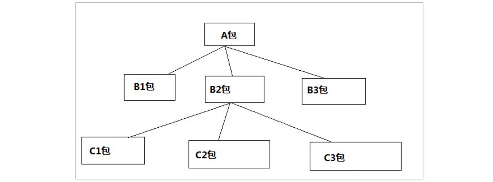

# 1.Linux系统简介

## 1.1 Unix系统简介

需要从⻉尔实验室的 UNIX 说起，1969 年，AT&T 公司的⻉尔实验室与 MIT 合作开发的 Unix，旨在于创建⼀个⽤于⼤型、并⾏、多⽤户的操作系统。 

Unix 的推⼴：从学校⾛进企业

Unix 的版本主要两个： AT&T System V ——就是俗称的 “系统 5” 、Berkley Software Distribution (BSD)

Linux操作系统的组件

一个操作系统想要跑起来，需要以下组件：

## 1.2 Unix家庭树


## 1.3 Linux系统的诞生

Linux 是⼀种操作系统。 

1991 年，芬兰赫尔⾟基⼤学的学⽣ Linus Torvals 为了能在家⾥的 PC 机上使⽤与学校⼀样的Unix操作系统，开始编写了类 UNIX. 

1991.8.25，Linus 就在 comp.os.minix 新闻组中⾸次发布了⼀个 Linux 内核的公共版本。


## 1.4 Linux的发行版本

**流⾏的 Linux 版本** 

Solaris、IBM AIX、Red Hat、Fedora Core、SUSE Debian、Mac OS X、Ubuntu

## 1.5 Ubuntu的发行版本代号

对于软件来说，发行版本就是在某个时间点，开发者把所有已经完成的代码、功能、修复等打包起来，形成一个完整的、可以对外发布的版本。这个版本可以是一个新的开始，也可以是对之前版本的更新或改进。


一般我们下载Ubuntu的时候，要下载带有LTS（长期支持）的版本，意味着 LTS 版本会收到更多的安全更新、补丁和可能的错误修复，以确保该版本的稳定性和可靠性。

## 1.6 Linux 操作系统的组件

**一个操作系统想要跑起来则需要以下组件：**

Linux 内核、Shell、⽂件系统、实⽤程序


### 1.6.1 Linux内核

内核是 Linux 系统的最底层，提供了系统的核⼼功能并允许进程以⼀种有序的⽅式访问硬件。 ⽤于控制进程、输⼊、输出设备、⽂件系统操作、管理内存。 这些都不需要⽤户参与，系统⾃⾏完成。

**Linux 内核版本** 

主版本：1.0 2.0 2.2 2.4 2.6    2,3 年更新

稳定版：2.0.40 2.2.12 2.4.18 2.6.35    1,2 ⽉更新 

稳定版更新：2.6.18.1 ~ 2.6.18.7     1,2 周更新

**Linux 内核结构**


### 1.6.2 Shell介绍

Shell的英文含义是“壳”，它是相对于内核来说的。在Linux中，shell是一个面向用户的命令接口，表现形式为一个可以由用户录入的界面，并且这个界面也能反馈运行信息。

Shell 是⼀个命令⾏解释器，它使得⽤户能够与操作系统进⾏交互。 

Shell 类型：Bourne Shell 最早的 Shell 、C Shell、Bourne again Shell …

# 2.Ubuntu软件包管理机制

## 2.1 简介

Ubuntu Linux 采⽤了 Debian 的软件包管理机制。由于软件包具有易⽤性、灵活性和扩展性的特点， 再加上 Internet 的⽀持，debian 软件包在 ubuntu 系统中被⼴泛使⽤。它使⽤户随时都能拥有最新的 Ubuntu 系统，这也是 Ubuntu 受到推崇的⼀个重要原因。因⽽，Deb 软件包管理也成为 Ubuntu 中最有活⼒的部分。本章将介绍 ubuntu 软件包管理器。

## 2.2 目前两种流行的软件包管理机制

最初，基于 Linux 系统的开发者在完成应⽤程序的开发之后，将很多的⼆进制⽂件发送给⽤户。因此，Debian-Linux ⾸先提出 “ 软件包” 的管理机制—— Deb 软件包，将应⽤程序的⼆进制⽂件、配置⽂档、man/info 帮助⻚⾯等⽂件合并打包在⼀个⽂件中，⽤户使⽤软件包管理器直接操作软件包，完成获取、安装、卸载、查询等操作。 

随即，Redhat Linux 基于这个理念推出了⾃⼰的软件包管理机制—— Rpm 软件包。当然，Redhat Linux 采⽤了⾃⼰的打包格式⽣成 Rpm 包⽂件，由 Rpm 包管理器负责安装、维护、查询，甚⾄软件包版本管理。由于 Redhat Linux 系统的普及，Rpm 软件包被⼴泛使⽤，甚⾄出现第三⽅开发的软件管理⼯具，专⻔管理 Rpm 格式的软件包。

ubuntu Linux 系统的软件包管理机制延续了 Debian 的包管理⽅法。

## 2.3 软件包说明

Debian 包⽂件包含了⼆进制可执⾏⽂件、库⽂件、配置⽂件和 man/info 帮助⻚⾯等⽂档。通常 Debian 包⽂件的后缀为. deb，因此称为 “ Deb 软件包” 。Ubuntu 有两种类型的软件包：⼆进制软件包（deb）和源码包（deb-src）。

⼆进制软件包（Binary Packages）：包含可执⾏⽂件、库⽂件、配置⽂件、man/info ⻚⾯、 版权声明和其他⽂档。 

源码包（Source Packages）：包含软件源代码、版本修改说明、构建指令以及编译⼯具等。 先由 tar ⼯具归档为. tar.gz ⽂件，然后再打包成. dsc ⽂件。

注：我们可以在 /etc/apt/source.list中来查看我们的两种包类型


**软件包组件**

main :  完全的⾃由软件。 

restricted :  不完全⾃由的软件。 

universe : ubuntu 官⽅不提供⽀持和补丁，全靠社区⽀持。 

multiverse :  ⾮⾃由软件，完全不提供⽀持和补丁。

**下面以：http://cn.archive.ubuntu.com/ubuntu/为例来讲解**


在 Ubuntu Linux 中，软件包的命名遵循以下约定：


例如：


```
软件包名：g++
软件版本：4.1.2
修正版本：9
体系架构：i386
包类型：deb 包
软件包：g++_4.1.2-9ubuntu2_i386.deb
```

# 3.Ubuntu软件安装命令详解

## 3.1 软件包安装工具简介

我们常常使⽤的软件包管理⼯具有两种，⼀种叫做 dpkg 软件包管理⼯具, 它是” debian package” 的 简写，是Debian 软件包管理器的基础。它是最早的 deb 软件包管理⼯具，他在 Debian Linux——提出软件包管理模式后随即就诞⽣了。使⽤ dpkg 可以实现软件包的安装、编译、卸载、查询，以及应⽤程序打包等功能。但是由于当时 Linux 系统规模 和 Internet ⽹络条件的限制，我们使⽤ <u>dpkg 安装软件包 的时候需要考虑软件包之前的依赖关系。也有⼈把它叫做本地安装⼯具</u>。 总之，dpkg 是⼀个底层的 软件包管理系统，<u>主要⽤于对已下载到本地和已安装的软件包进⾏管理</u>。



基于这个特性，我们的 dpkg 安装⼀般来说有可能要安装多个软件包。⽽我们 linux 系统中的依赖关系 相对复杂，因此就定义了⼀个依赖关系表以及优先级表。Ubuntu 中为每个软件包指定了⼀个优先级， 作为软件包管理器选择安装和卸载的⼀个依据。


## 3.2 dpkg软件包安装【本地安装】

### 3.2.1 安装软件

```bash
sudo dpkg -i 软件包 [安装单个软件包]
或
sudo apkg -i *.deb [多个软件包⼀起安装]

例如：sudo dpkg -i nano_2.2.6-1_i386.deb
```

### 3.2.2 移除已安装的软件包

```bash
sudo dpkg -r 软件包名

例如：sudo dpkg -r nano
```

### 3.2.3 移除已安装的软件包及配置文件

```bash
sudo dpkg -P 软件包名
```

### 3.2.4 列出软件包在系统所安装的文件

```bash
sudo dpkg -L 软件包名
```

### 3.2.5 列出软件包安装状态

列出软件包的安装状态以及详细信息。

```bash
sudo dpkg -s 软件包名
```

## 3.3 apt-get软件包安装【联网安装】

### 3.3.1 镜像站点服务器

APT 系列⼯具可能是 Deb 软件包管理⼯具中功能最 强⼤的。它会⾃动检测软件包之间的依赖关系。 因为它采⽤了集中式的软件仓库的机制，将各式各样 的软件包分⻔别类地存放在软件仓库中，进⾏有 效地组织和管理。然后，将软件仓库置于许许多多的镜像服务器中，并保持基本⼀致。（可理解为我们上⽹的时候，有很多的⽹站，每个⽹站中有⼀些下载的链接，每个下载的链接中就有很多的软件包，这个下载的链接就是 软件包仓库，这⾥的镜像站点服务器可理解为包含多个下载链接的⽹站）。这些镜像服务器就是它们的软件源（包含多个下载链接的⽹站的集合）。


我们可以在 /etc/apt/source.list 中来查看我们的软件源。这个路径就叫做镜像站点服务器。


内容如下：


### 3.3.2 索引文件

我们的镜像站点服务器只是告诉了我们。我们的软件包应该在哪⾥去下载。但是我们这些镜像站点具体 拥有哪些资源，对我们来说，不是很清楚。如果，我们每安装⼀个软件包就到我们的服务器上去寻找⼀ 遍，这样的话效率就太低了。因此，我们提出了⼀个概念，叫做**索引⽂件**。索引文件记录了每个软件名和它对应的下载网站，它的本质就是我们为服务器上的软件资源在本地列了⼀个清单，安装软件的时候主机会先在索引文件中查找该软件名，若找到则自动在该软件所对应的网站中进行下载。（可理解为⽹站服务器在本地的缓存）。

我们可以在 **/var/lib/apt/lists/** 这个⽬录来查看


### 3.3.3 下载的软件包所存放的路径

我们在 windows 上下载软件的时候，⼀般是会把. exe 的安装包下载到⼀个指定的路径，然后双击它进⾏安装。我们的 ubuntu 也是⼀样的，只不过这个下载路径是固定的，我们可以到 **/var/cache/apt/archives** 这个⽬录下来查看我们的软件包。


### 3.3.4 安装命令

```bash
sudo apt-get install 软件包名

例如： sudo apt-get install sl 或 sudo apt-get install btanks
```

注意：sudo apt-get install sl执行时可能会报告以下错误：

```
Reading package lists... Done
Building dependency tree       
Reading state information... Done
You might want to run 'apt --fix-broken install' to correct these.
The following packages have unmet dependencies:
 linux-headers-5.19.17-051917-generic : Depends: libc6 (>= 2.34) but 2.27-3ubuntu1.5 is to be installed
                                        Depends: libssl3 (>= 3.0.0) but it is not installable
E: Unmet dependencies. Try 'apt --fix-broken install' with no packages (or specify a solution).
```

使用sudo apt --fix-broken install修复即可！

### 3.3.5 卸载命令

```bash
sudo apt-get remove 软件包名

例如: sudo apt-get remove sl
```

### 3.3.6 更新索引文件命令

```bash
sudo apt-get update
```

### 3.3.7 清空存放下载软件包的目录

```bash
sudo apt-get clean
```

## 3.4 apt-get软件包总结

### 3.4.1 三个重要路径

```tex
/etc/apt/sources.list [⽂件] -> 镜像站点服务器地址 (可以理解成软件包的下载⽹站)
/var/lib/apt/lists [⽬录] -> 每个镜像站点软件包的索引⽂件（可以理解成我们软件包下载⽹站具体内容的缓存，例如：软件版本，软件名等等）
/var/cache/apt/archives [⽬录] -> 下载下来软件包存放路径
```

### 3.4.2 原理

我们使⽤ apt-get 命令下载⽂件的时候，默认是在镜像站点软件包的索引⽂件 [缓存] /var/lib/apt/lists中查找该软件的⼀些信息。

当我们找到索引⽂件中的软件信息之后，就进⼊了我们 的镜像站点服务器[⽹站]/etc/apt/sources.list地址来下载我们需要的软件，下载的⽂件存放在/var/cache/apt/archives⽬录下。


例：sudo apt-get install g++，当执行这条命令时，会先在/etc/apt/sources.list中找g++所在的网站A，然后 在/var/lib/apt/lists找到网站A对应的缓存，网站A对应的缓存中记录了g++在远程服务器的索引号，然后后台自动登录远程服务器并且拿着g++的索引号（05）找到05.g++.dep，然后再将g++.dep下载到主机的/var/cache/apt/archives目录中。

**练习**

⼤家利⽤ apt-get 命令安装⼀下 btanks，观察是什么样的现象。(把现象截图即可） 安装命令: sudo apt-get install btanks

# 4.Linux用户管理

## 4.1 原理

在 Linux 系统中，所有的⽤户和组像⼀个国家。如果国家要繁荣昌盛的话，需要治理得当，需要有主席或者总统，以及地⽅官员和⽼百姓组成。

首先，用户是操作者在Linux系统中的身份识别，其存在主要是为了限制权限。而组则是用户的集合，它的存在是为了归类用户以便于管理权限。每个用户都有一个与之对应的用户ID（UID）和组ID（GID），这是系统识别和管理用户的依据。

其次，当用户尝试登录Linux系统时，虽然输入的是用户名和密码，但系统实际上并不直接识别用户名。相反，它会查找/etc/passwd文件，该文件存储了所有用户的名称与ID的对应关系。如果找到了对应的用户名，系统会读取该用户的UID、GID、主目录和登录Shell等信息。然后，系统会核对密码，这通常在/etc/shadow文件中完成，该文件存储了加密后的用户密码。只有当用户名和密码都匹配时，用户才能成功登录。

那么，我们⾸先了解⼀ 下⼀些基本的概念。 在我们的 linux 中各个⽤户以权限来区分，Linux 中常⻅⽤户分为以下三种：

```
超级⽤户root：具有最⾼的权限，UID=0,GID=0；
系统⽤户：主要服务于系统应⽤，维护系统运⾏，不能用于登录。例如：uucp、daema 等；
普通⽤户：登录的⽤户。
```

组：具有相同权限的⽤户的集合。

## 4.2 Linux用户相关路径

### 4.2.1 /etc/passwd

显示/etc/passwd文件内容：

```shell
cat /etc/passwd
```


第⼀⾏ root 这⼀⾏，⼀共有七项，每⼀项的含义如下：


```tex
帐号名称：帐号名称由于对应⽤户ID，这个是系统默认⽤户root超级管理员，在同⼀个系统帐号名称是唯⼀的，⻓度根据不同的linux系统⽽定，⼀般是8位。 

密码：由于系统中还有⼀个/etc/shadow⽂件⽤于存放加密后的⼝令，所以在这⾥这⼀项是 “x” 来表示，如果⽤户没有设置⼝令，则该项为空。

⽤户ID：这个是系统内部⽤于来识别不同的⽤户的，不同的⽤户识别码不同，其中⽤户ID有以下⼏种：
0代表系统管理员
1-500系统预留的ID
500以上是普通⽤户使⽤，例如我现在使用的普通用户linux，他的用户id就是1000。

组ID：其实这个和⽤户ID差不多，⽤来规范群组，他与/etc/group有关。

描述信息：这个字段⼏乎没有什么作⽤，只是⽤来解释这个帐号的意义。⼀般常⻅的是⽤户全名信息。

⽤户根⽬录：就是⽤户登录系统的起始⽬录，⽤户登录系统后将⾸先进⼊该⽬录。root⽤户默认的是/root，普通⽤户的是/home。

⽤户登录shell：就是⽤户登录系统时使⽤的shell路径。
```

### 4.2.2 /etc/shadow

在早期的 unix 操作系统中，⽤户的帐号信息和⼝令信息都保存在 passwd ⽂件中，尽管系统已经对⼝令进⾏了加密，并且以密⽂的⽅式保存在 passwd ⽂件中，但是由于 passwd ⽂件对于系统中的所有⽤户是可读的，所以⼝令⽐较容易破解，存在较⼤的安全隐患。

现在使⽤ “ shadow” ⽂件保存密⽂的⽤户⼝令，使⽤ passwd ⽂件保存⽤户帐号其它信息。“ shadow” ⽂件只有管理员⽤户才可以读取其中的内容。由于这个⽂件可能被破解，所以⼀定不要将该⽂件内容泄露给他⼈，保证系统安全。

显示/etc/shadow内容：

```shell
cat /etc/shadow 
```


因为现在的用户名linux是普通用户，权限不够，所以我们临时获取管理员权限再来查看/etc/shadow文件内容：

```shell
sudo cat /etc/shadow
```


第⼀⾏数据如下。 【⽼版本 ubuntu 的截图】


```
密码：这才是真正的密码，并且已经加密过了，只能看到⼀些特殊符号。需要注意的是这些密码很难破解，但是不等于不能。还有密码栏的第⼀个字符为“*”表示这个⽤户不⽤来登录，如果哪个⽤户不想让他登录了，可以在他前⾯加个星；

上次改动密码的⽇期：这段记录了改动密码的最后⽇期，为什么是13798呢？这是因为linux计算⽇期的⽅法是以1970年1⽉1⽇作为1，1971年1⽉1⽇就是366，依次类推到我修改密码的⽇期表示为13798了。

密码不可被改动的天数：这个字段代表要经过多久才可以更改密码。如果是“0”代表密码可以随时更改。

密码需要重新更改的天数：由于害怕密码被⼈盗取⽽危害到整个系统的安全，所以安排了这个字段，你必须在这个时间内重新修改密码，否则这个帐号将暂时失效。上⾯的99999，表示密码不需要重新输⼊。

密码到期的警告期：当帐号的密码失效期限快到时，系统依据这个字段的设定发出警告，提醒⽤户“再过n天您的密码将过期，请尽快重新设定密码”。默认的是七天。
```

## 4.3 用户相关命令

### 4.3.1 切换进入超级⽤户 

```shell
sudo su root 	#切换到超级用户root
sudo su linux 	#切换到普通用户linux
```

### 4.3.2 添加用户

输⼊的时候除了密码，其他⼀路回⻋即可，可到 /home ⽬录下观察⽤户信息。

```shell
sudo adduser 用户名
```

### 4.3.3 删除用户

```shell
sudo deluser --remove-home  ⽤户名
```

### 4.3.4 修改密码

```shell
sudo passwd 用户名
```

### 4.3.5 关机和重启

```shell
sudo shutdown -h now	#⽴即关机
sudo reboot				#立即重启
```

# 5.Linux文件系统

## 5.1 挂载简介

在Linux中，挂载（Mount）是一个非常基础且重要的概念。我们可以将挂载想象成一个“连接”或“放置”的过程。

首先，Linux系统把一切都看作是文件，包括硬件设备。每个硬件设备，比如硬盘、U盘等，都有自己的文件系统，也就是一套文件的目录结构。

但是，这些硬件设备并不能直接被我们访问，就像新买的手机或电脑，我们需要先设置一下才能使用它们。在Linux中，为了让硬件设备可以被我们访问和使用，我们需要将硬件设备的文件系统“连接”或“放置”到Linux的文件系统目录树中。这个过程就叫做挂载。

具体来说，挂载就是将设备文件中的顶级目录连接到Linux根目录下的某个目录（这个目录通常被叫做挂载点）。这样，当我们访问这个挂载点时，就相当于访问了设备文件，也就可以读取或写入设备中的数据了。

需要注意的是，挂载点最好是新建的空目录，因为挂载操作会使得原有目录中的文件被隐藏。如果选择根目录或系统原有目录作为挂载点，可能会导致系统异常甚至崩溃。

总之，挂载就是Linux系统为了让硬件设备可以被我们访问和使用，将硬件设备的文件系统连接到Linux文件系统目录树中的过程。 

下图为 U 盘⽂件⽬录结构和 Linux 系统中的⽂件⽬录结构。


## 5.2 文件系统相关命令

### 5.2.1 查看目录的内容或文件的属性信息

```shell
ls
```

### 5.2.2 查看文件详细的属性

```shell
ls -ld /home/linux
```


第一部分：文件类型

drwxr-xr-x中开头的d表示该文件是目录文件。

```
常⻅⽂件类型标识字符：b、c、d、-、l、p、s
b：块设备⽂件（block）--硬盘
c：字符设备⽂件（character）--⿏标
d：⽬录⽂件（directroy）--⽂件夹 
-：普通⽂件（regular）
l：软链接⽂件（link）--windows快捷⽅式
p：管道⽂件（pipe）--常⽤于进程通信    
s：unix域socket⽂件（socket）--常⽤于进程通信
```

第二部分：权限 [⽂件所有者权限 + ⽂件所有者所在组的组员权限 +  其他⼈权限]

```
r读   w写   x执⾏
100   010   001 ===>⼋进制数：r：4  w：2  x：1
r--   -w-   --x

⽤⼋进制表示权限:0775，文件所有者权限：rwx   ⽂件所有者所在组的组员权限：rwx   其他⼈权限：-rx
```

第三部分：硬链接数

```
26 -> 硬链接数
```

第四部分：文件所有者名称

```
linux -> ⽂件所有者名
```

第五部分：⽂件所属于组

```
linux -> ⽂件所属于组
```

第六部分：文件大小

```
4096 -> 文件大小（默认单位byte）
```

第七部分：⽂件最后⼀次修改时间 

```
3月    7  20:14 -> 文件最后一次修改时间
```

第⼋部分 ：文件名

```
/home/linux ->文件名
```

### 5.2.3 ls常用指令

```shell
ls -a     #显示所有的⽂件，包括隐藏⽂件
ls -lh    #带单位(G,K,M)显示⽂件⼤⼩
```

### 5.2.4 修改文件的权限

```shell
chmod  权限  ⽂件名
```

常⽤： u: user （⽂件所有者） g: group （⽂件所属组） o: other( 其他⽤户 )

例：

```shell
chmod u+x test.c
chmod u+w test.c
chmod g-r test.c 
chmod o+x test.c
```

### 5.2.5 查看磁盘空间使用情况

```shell
df -Th
```

示例用法：

```shell
df -Th
 Filesystem     Type      Size  Used Avail Use% Mounted on
 /dev/sda1      ext4      7.4G  2.8G  4.2G  40% /
 udev           devtmpfs  241M  4.0K  241M   1% /dev
 tmpfs          tmpfs      50M  1.4M   49M   3% /run
 none           tmpfs     5.0M     0  5.0M   0% /run/lock
 none           tmpfs     248M  204K  248M   1% /run/shm
 /dev/sda6      ext4       12G  1.6G  9.4G  14% /home
 .host:/        vmhgfs     79G   67G   12G  85% /mnt/hgfs
```

### 5.2.6 挂载本地设备文件

```shell
sudo mount 设备文件 挂载点目录
```

示例用法：把根⽬录的/dev/sda1挂载到/mnt/udisk⽬录中

```shell
sudo mount /dev/sda1 /mnt/udisk
```

### 5.2.7 卸载设备

```shell
sudo umount 设备⽂件
```

示例用法：

```shell
sudo umount /dev/sda1
```

练习：

⼤家在 / mnt ⽬录下新建⼀个 mydisk ⽂件夹，测试⼀下把根⽬录挂载到 mydisk ⽂件夹下。

## 5.3 文件系统压缩相关命令

### 5.3.1 zip 压缩相关命令

压缩⽂件

```shell
zip   test.zip    hello.c  log.c
```

解压⽂件

```shell
unzip  test.zip
```

### 5.3.2 linux ⽀持常⽤的两种压缩格式

gzip：linux ⽀持的压缩格式的⼀种，优点是压缩速度较快；

bzip2：linux ⽀持的压缩格式的⼀种，优点是压缩后存储空间占⽤较⼩。

### 5.3.3 tar命令

该命令⼀般⽤来压缩 / 解压 gzip 和 bizp2 的⽂件。

**相关参数：**

```
c -> 创建
x -> 释放
z -> gzip操作
j -> bzip2操作
v -> 显示过程
f -> 指定⽂件名(⼀定需要放在最后)
```

**压缩文件/文件夹：**

```shell
sudo tar -czvf work.tar.gz work
sudo tar -cjvf work.tar.bz2 work
```

**解压⽂件：**

```shell
sudo tar -xzvf work.tar.gz
sudo tar -xjvf work.tar.bz2
或者
sudo tar -xvf work.tar.gz/work.tar.bz2(两种都可以释放)
```

**解压到指定位置【学⽣⾃学，⾃⼰测试】：**

```shell
tar  -xvf work.tar.gz -C 指定的⽬录
```

## 5.4 硬链接和软链接

**底层原理简介：**

⼤家在 windows 下可以看到我们桌⾯上有⼀些程序。双击它就可以运⾏了。在我们桌⾯上的图标只是 ⼀个快捷⽅式，它真正的运⾏路径是在其他的磁盘中。这个就是我们的 windows 中链接。我们的 Linux 系统中也存在类似的形式，我们 Linux 中的链接形式有两种，⼀种叫做软链接，⼀种叫做硬链 接。在讲解之前，⼤家需要先知道⼀些⽂件的基本知识。

**原理：**

Linux 系统中⼀个⽂件由⽬录项、inode 表和数据块组成。 test.c 

⽬录项：包括⽂件名和 inode 节点号 

Inode 表：包含⽂件的⼀些信息。例如，inode 号，⽂件类型，⽂件⼤⼩等待。

数据块：⽂件具体内容存放的地⽅。

当我们查看⼀个⽂件的时候，linux 系统的运⾏过程如下图。


**查找过程：**

①⾸先根据⽂件名，找到我们⽬录项中的 inode 号。 

②通过 inode 号进⼊我们 inode 表中，查找到该⽂件中⼀些信息。 

③然后通过 inode 表中的保存的数据区的指针，读取我们相应数据区的内容。

### 5.4.1 硬链接

本质：是给我们的⽂件取别名，与源⽂件直接关联。修改⼀个，另⼀个同时被修改。删除⼀个另 ⼀个不会有影响。

Linux 系统中规定，只有在⽂件的打开次数为 0（即⽂件这个时候没有打开），并且⽂件的硬连接数为 0，此时⽂件才会被删除。

特点：不能对⽬录操作。

**命令：**

查看 inode 号：

```shell
ls -i 文件名
```

创建硬链接：

```shell
ln 源文件名 硬链接文件名
```

### 5.4.2 软链接

本质：类似于我们 windows 的快捷⽅式，⽤来记录我们⽬标的路径。

特点：占用磁盘空间、可以对目录进行操作。

**命令：**

创建软链接：

```shell
ln -s 源文件 软链接文件
```

**图形原理：**


**练习1：**

在⽤户主⽬录 /home/linux 下以⾃⼰的名字创建⼀个⽬录 ( 例如： gdg) ；

进⼊该⽬录，并且在⾥⾯创建⼀个 hello.c；

将 gdg ⽂件夹打包并压缩成 gdg.tar.gz；

然后在新建⼀个（ gdg_test ） , 然后将 gdg.tar.gz 释放到该⽂件夹中；

最后删除删除 gdg,gdg.tar.gz ,gdg_test。

**练习2：**

⾃⼰新建⼀个 hello.c ⽂件分别设计硬链接和硬链接的操作。

# 6.Linux命令进阶

## 6.1 grep命令

功能：从文件中搜索字符串。

命令格式：

```shell
grep "字符串"  ⽂件
```

参数：

```
-n 显示⾏号
-R 递归及⼦⽬录
```

例如：

```shell
grep "hello" log.c		#在log.c⽂件中搜索"hello"字符串
grep "main" * -nR		#在当前⽬录及⼦⽬录所有⽂件中搜索main
```

## 6.2 find命令

功能：在指定路径下搜索文件。

命令格式：

```shell
find 路径 -name ⽂件名
```

例如：在/home/linux⽬录下搜索hello.c

```shell
find /home/linux -name hello.c    
```

## 6.3 管道连接符|

在Linux中，管道连接符 | 是一个非常有用且简单的工具，它允许我们将一个命令的输出作为另一个命令的输入。我们可以将它想象成一根“管子”，连接了两个命令，让第一个命令的“话”能够传给第二个命令“听”。

具体来说，当你使用 | 连接两个命令时，第一个命令的执行结果（通常是输出到屏幕的内容）会被“传递”到第二个命令，作为第二个命令的输入。这样，两个命令就可以协同工作，完成更复杂的任务。

举个例子，假设你想查看当前目录中所有文件的列表，并且只想看其中那些包含“txt”的文件。你可以使用以下命令组合：

```shell
ls -l | grep "txt"
```

这里，ls -l 命令会列出当前目录的所有文件和文件夹的详细信息，然后通过管道 |，这些信息被传递给 grep "txt" 命令。grep "txt" 命令会搜索包含“txt”的行，并把这些行打印到屏幕上。

所以，整个命令组合的意思就是：“列出当前目录的所有文件和文件夹的详细信息，并从中找出包含‘txt’的行”。

管道连接符 | 是Linux命令行中非常强大且灵活的工具，它允许你轻松地组合多个命令，完成各种复杂的任务。通过使用管道，你可以将简单的命令组合成强大的命令序列，从而实现各种高效的文本处理和数据处理操作。

例如：

```shell
cat /etc/passwd | grep -n "linux"
# cat /etc/passwd 显示出passwd文件的内容
# grep -n "linux" 在显示出的passwd文件的内容的基础上，在内容中查找"linux"字符串

ls /usr/include | grep "stdio.h"
# ls /usr/include 列出include文件夹中的内容
# grep "stdio.h"  在列出的include文件夹中内容的基础上，在这些内容中查找 "stdio.h"字符串
```

## 6.4 head命令

功能：显示文件开头的内容。

命令格式：

```shell
head -⾏数 ⽂件
```

例如：显示/etc/passwd⽂件开头前10⾏

```shell
head -10 /etc/passwd   
```

## 6.5 tail命令

功能：显示文件尾部指定的行数。

命令格式：

```shell
tail -⾏数 ⽂件
```

例如：显示/etc/passwd⽂件最后⼀⾏的信息

```shell
tail -1 /etc/passwd   
```

## 6.6 cut命令

功能：字符串裁剪。

注意：一般与管道联合使用。

命令格式：

```shell
cut -d "分割字符" -f  字段
```

参数：

```
-d	指定我们的分割字符    
-f	指定我们显示的区域
```

例如：

```shell
tail -1 /etc/passwd | cut -d ":" -f 1,3,4
grep "linux" /etc/passwd | cut -d ":" -f 1,3
```

## 6.7 wc命令

功能：统计某个⽂件的⾏数 / 单词个数 / 字节数。

命令格式：

```shell
wc 参数 文件
```

参数：

```
-l 显示⼀个⽂件的⾏数
-w 显示⼀个⽂件的单词个数
-c 显示⼀个⽂件的字节数
```

例如：log.txt⽂件内容如下：

```
{
	123
    abc
    789 ABCD
}
```

```shell
wc -l  log.txt
wc -w  log.txt
wc -c  log.txt
```

练习：

如何⽤命令显示 / etc/passwd 第 34 ⾏这⼀⾏的信息；

```shell
head -34 /etc/passwd | tail -1
```

如何获得 root ⽤户在 / etc/passwd 中以 ":" 分割的 1，3，4 ⾏的信息； 

```shell
grep "root" /etc/passwd | cut -d ":" -f 1,3,4
```

如何获得 linux ⽤户在 / etc/passwd 中的⾏号。

```shell
grep -n "linux" /etc/passwd | cut -d ":" -f 1
```

# 7.shell中的常用特殊字符

## 7.1 shell中的通配符

当⽤户需要⽤命令处理⼀组⽂件，例如 file1.txt, file2.txt, file3.txt … ⽤户不必⼀⼀输⼊⽂件名，可以 使⽤ shell 通配符。shell 通配符如下：

| 通配符 | 含义                             | 实例                                                         |
| ------ | -------------------------------- | ------------------------------------------------------------ |
| *      | 匹配任意⻓度的字符串             | ls file_*.txt <br />file_1.txt file_2.txt file_3.txt         |
| ?      | 匹配⼀个⻓度的字符串             | ls file_?.txt<br />file_1.txt file_a.txt file.x.txt          |
| [...]  | 匹配其中指定的⼀个字符           | ls file_[otr].txt <br />file_o.txt file_r.txt file_t.txt     |
| [-]    | 匹配指定的⼀个字符范围           | ls file_[a-z].txt <br />file_a.txt file_b.txt file_z.txt     |
| [^...] | 除了其中指定的字符，其他均可匹配 | ls file_[ ^obt].txt <br />显示除了 file_o.txt,file_b.txt,file_t.txt 外的其他⽂件 |

## 7.2 输入/输出重定向

输⼊ / 输出重定向是改变 shell 命令或程序默认的标准输⼊ / 输出⽬标，重新定向到新的⽬标。 

Linux 中默认的标准输⼊定义为键盘，标准输出定义为终端窗⼝。

⽤户可以为当前操作改变输⼊或输出，迫使某个特定命令的输⼊或输出来源作为外部⽂件。

### 7.2.1 输出重定向(>)

含义：把本来应该输出到屏幕上的正确的数据，修改输出到其他的地⽅ (⽂件)。

例如：

把hello world写⼊log.txt⽂件中，写⼊前会把log.txt⽂件内容清空

```shell
echo "hello world" > log
```

把"happy"以追加的⽅式写入log.txt文件中，写入前不会把log.txt文件内容清空

```shell
echo "happy" >> log 
```

### 7.2.2 输入重定向(<)

含义：改变默认的输⼊源，把本来应该从键盘输⼊的信息该从其他位置获取 (例如从⽂件中)。

例如：

```shell
cat /etc/passwd		#这⾥省略输出信息，读者可⾃⾏查看
cat < /etc/passwd	#输出结果同上⾯命令相同
#注意，虽然执⾏结果相同，但第⼀⾏代表是以键盘作为输⼊设备，
#⽽第⼆⾏代码是以/etc/passwd ⽂件作为输⼊设备。

cat a.txt 
cat < /etc/passwd > a.txt 
cat a.txt #输出了和/etc/passwd ⽂件内容相同的数据
#可以看到，通过重定向/etc/passwd 作为输⼊设备，并输出重定向到a.txt，
#最终实现了将/etc/passwd ⽂件中内容复制到a.txt 中。
```

### 7.2.3 错误重定向(2>)

含义：把本来应该输出到屏幕上错误的信息改输出到⽂件中。

例如：dasds123 本身是不存在的命令，它是⼀条错误的命令。本来应该向屏幕上输出 command not found ，这条命令现在会输出到 log.txt ⽂件中。

```shell
dasfs123 2> log.txt
```

## 7.3 命令置换

含义：将⼀个命令的输出当作另⼀个命令的参数，我们叫做命令置换。

格式：

```shell
command1 `command2`    
#command2的输出当作command1的参数
#注：这⾥不是单引号，⽽是反撇号! esc下⾯的键为反撇号
```

例如：

```shell
find `pwd` -name hello.c
ls `pws`
```

练习 ： 

利⽤输出重定向把 "Good Good Study" 存放到 log1.txt ⽂件中；

```shell
echo "Good Good Study" > log1.txt
```

使⽤ ls -l bye.txt 命令，利⽤出错重定向把出错的信息放到log2.txt中； 

注： [byte.txt 不存在，把命令的效果截图上传]

```shell
ls -l bye.txt 2> log2.txt
```

# 8.sed命令详解

## 8.1 sed命令概述

我们之前的学习中, Vim 采⽤的是交互式⽂本编辑模式，你可以⽤键盘命令来交互性地插⼊、删除或替换数据中的⽂本。但本节要讲的 sed 命令不同，它采⽤的是流编辑模式，最明显的特点 是，在 sed 处理数据之前，需要预先提供⼀组规则，sed 会按照此规则来编辑数据。

**sed命令使用场景：**

超⼤⽂件处理； 

对⽂件进⾏批量增加，替换等。 

有规律的⽂本，例如以分号，空格等分隔的⽇志⽂件等；

**说明：**

sed 会根据脚本命令来处理⽂本⽂件中的数据，这些命令要么从命令⾏中输⼊，要么存储在⼀个⽂本⽂件中，此命令执⾏数据的顺序如下： 

①每次仅读取⼀⾏内容； 

②根据提供的规则命令匹配并修改数据。

注意，sed 默认不会直接修改源⽂件数据，⽽是会将数据复制到缓冲区中，修改也仅限于缓冲区中的数据； 

③将执⾏结果输出。

当⼀⾏数据匹配完成后，它会继续读取下⼀⾏数据，并重复这个过程，直到将⽂件中所有数据处理完毕。


## 8.2 sed命令语法讲解

**命令格式：**

```shell
sed [options] '{command}[flags]' [filename]
#注意：[]中的数据必须存在，{}内容可以省略
```

**options命令选项：**

```
-e 脚本命令：该选项会将其后⾯的脚本命令添加到已有的命令中。
-f 脚本⽂件：该选项会将其⽂件中的脚本命令添加到已有的命令中。
-n：只显示匹配的⾏
-i：直接对原⽂件进⾏操作，会修改原⽂件内容。
```

**{command}[flags]：**

sed内部常⽤命令：

```
i：insert，在指定匹配到的⾏前⾯添加新⾏内容为string；
a：append，在指定或匹配到的⾏后⾯追加新⾏，内容为string；
d：delete，删除符合地址定界条件的的⾏；
p：print，默认sed对模式空间内的处理完毕后，将输出的结果输出在标准输出，添加p命令，相当于输出了原⽂，⼜⼀次输出了模式匹配处理后的内容；
s：查找并替换，默认只替换每⾏中第⼀次被模式匹配到的字符串，如果修饰符为g, 则为全部替换。
```

flags：

```
n：1~512之间的数字表示指定要替换的字符串出现第⼏次时才进⾏替换。
   例如，⼀⾏中有3个A，但⽤户只想替换第⼆个A，这时就⽤到这个标记；
g：对数据中所有匹配到的内容进⾏替换，如果没有g，则只会在第⼀次匹配成功时做替换操作。
   例如，⼀⾏数据中有3个A，则只会替换第⼀个A；
p：会打印与替换命令中指定的模式匹配的⾏。此标记通常与-n 选项⼀起使⽤。
```

## 8.3 使用场景

**场景1：显示/etc/passwd第三⾏的信息**

```shell
sed -n '3p' /etc/passwd      
#注：这⾥的3代表⾏数，p代表输出结果
===========================================================
bin:x:2:2:bin:/bin:/usr/sbin/nologin
```

**场景2：在/etc/passwd中第⼀⾏前添加⼀⾏内容为”Good Good Study"**

```shell
 sed -e '1iGood Good Study' /etc/passwd
 #注：这⾥的1代表第⼀⾏，i代表insert插⼊的意思。表示在第1⾏前插⼊新的字符串。
 =========================================================
 Good Good Study
 root:x:0:0:root:/root:/bin/bash
 daemon:x:1:1:daemon:/usr/sbin:/usr/sbin/nologin
 bin:x:2:2:bin:/bin:/usr/sbin/nologin
 sys:x:3:3:sys:/dev:/usr/sbin/nologin
 sync:x:4:65534:sync:/bin:/bin/sync
 games:x:5:60:games:/usr/games:/usr/sbin/nologin
 man:x:6:12:man:/var/cache/man:/usr/sbin/nologin
 lp:x:7:7:lp:/var/spool/lpd:/usr/sbin/nologin
 mail:x:8:8:mail:/var/mail:/usr/sbin/nologin
 ....
```

**场景3：**

格式：

```
sed 's/旧字符串/新字符串/g' ⽂件名
功能: 替换所有的字符串
 
sed 's/旧字符串/新字符串/数字' ⽂件名
功能：替换每⾏中第几次出现该字符串的数据，数字是几，就替换每行中第几次出现该字符串的数据
```

例：把 /etc/passwd 中所有名字为 root 的字符串改为class

```shell
sed -e 's/root/class/g' /etc/passwd
======================================================
class:x:0:0:class:/class:/bin/bash
daemon:x:1:1:daemon:/usr/sbin:/usr/sbin/nologin
bin:x:2:2:bin:/bin:/usr/sbin/nologin
sys:x:3:3:sys:/dev:/usr/sbin/nologin
sync:x:4:65534:sync:/bin:/bin/sync
games:x:5:60:games:/usr/games:/usr/sbin/nologin
man:x:6:12:man:/var/cache/man:/usr/sbin/nologin
...
```

例：把 /etc/passwd 每一行中root 第二次出现的字符串改为class

```shell
sed 's/root/class/2' /etc/passwd
=======================================================
root:x:0:0:class:/root:/bin/bash
daemon:x:1:1:daemon:/usr/sbin:/usr/sbin/nologin
bin:x:2:2:bin:/bin:/usr/sbin/nologin
sys:x:3:3:sys:/dev:/usr/sbin/nologin
sync:x:4:65534:sync:/bin:/bin/sync
```


```shell
sed -n 's/root/class/2p' /etc/passwd
=======================================================
class:x:0:0:class:/class:/bin/bash
```

注：-n 选项会禁⽌ sed 输出，但 p 标记会输出修改过的⾏，将⼆者匹配使⽤的效果就是只输出被替换命令修改过的⾏。

**场景 4： 删除 / etc/passwd 中内容并列出⾏号，并且将第 2~5 ⾏删除！**

```shell
cat -n /etc/passwd | sed '2,5d'
=======================================================
1        root:x:0:0:root:/root:/bin/bash
3        bin:x:2:2:bin:/bin:/usr/sbin/nologin
4        sys:x:3:3:sys:/dev:/usr/sbin/nologin
5        sync:x:4:65534:sync:/bin:/bin/sync
6        games:x:5:60:games:/usr/games:/usr/sbin/nologin
...
```

注： cat -n 会显示⾏号，这⾥利⽤管道来显示内容。

**场景 5： 把 / etc/passwd ⽂件中 root ⽤户的信息以带⾏号的形式重定向到 log.txt ⽂件中， 要求把 log.txt。⽂件中 root 替换为 linux. 并且 log.txt 中保存替换后的⽂件。**

```
cat /etc/passwd | grep -n "root" > log.txt
sed -i 's/root/linux/g' log.txt
cat log.txt
=====================================================
1:linux:x:0:0:linux:/linux:/bin/bash
```

练习：

```
HELLO LINUX!  
Linux is a free unix-type opterating system.  
This is a linux testfile!  
Linux test 
newLine
Google
Taobao
Runoob
Tesetfile
Wiki
```

把 2-6 ⾏信息删除，输出到屏幕上；

```
cat -n < log2.txt | sed -e '2,6d' 
```

在第 2 ⾏后添加 "drink tea" 字符串，并输出到屏幕上；

```
cat -n < log2.txt | sed '2adrink tea'
```

把 Taobao 替换为 muke。

```
sed 's/Taobao/muke/g' log2.txt
```

# 9.awk命令详解

## 9.1 awk命令概述

awk，实际上是一个强大的文本分析工具，它特别擅长对文本数据进行处理并生成报告。你可以将它想象成一个文本处理的小助手，专门帮助你对文本文件进行各种操作。

awk命令的工作方式是逐行读取文本文件的内容。它默认以空格或制表符（tab键）作为分隔符，将每行的内容切分成多个部分，每个部分我们称之为“字段”。然后，awk会根据你设定的条件或模式，对这些字段进行各种操作，比如打印、计算、比较等。

例如，假设你有一个包含学生成绩的文本文件，每行包括学生的姓名和分数。你可以使用awk命令来提取分数大于某个值的学生名单，或者计算所有学生的平均分等等。

调用awk命令有几种方式。最常见的是在命令行中直接使用，你可以指定分隔符、命令和要处理的文件。另外，你也可以将awk命令写入一个脚本文件，并通过脚本文件来执行awk命令。

之所以叫 AWK 是因为其取了三位创始⼈ Alfred Aho，Peter Weinberger, 和 Brian Kernighan 的 Family Name 的⾸字符。

注： sed 命令常⽤于⼀整⾏的处理。⽽ awk 更倾向于把⼀⾏分为多个 "字段" 然后进⾏处理。

**awk的适用场景：**

超⼤⽂件处理； 输出格式化的⽂本报表； 执⾏算数运算； 执⾏字符串操作等。

## 9.2 awk命令语法讲解

**格式：**

```
awk [options] 'pattern {action}' filename
```

options：可选参数

```
-F：指明输⼊时⽤到的字段分隔符，-F省略时默认分隔符为空格或tab键；
-v (var=VALUE)：⾃定义变量。
```

pattern：条件

action：动作是awk要执行的操作。这些操作可以是打印文本、计算数值、修改文本等。动作通常放在大括号 {} 里，这样awk就知道要执行哪些操作。

filename：⽂件名

示例 :

```shell
awk -F ":" '{print $1}' /etc/passwd
```

## 9.3 awk基础用法

```
awk '条件1 {动作1} 条件2 {动作2} ... ' ⽂件名
```

### 9.3.1 条件 (pattern) 

⼀般使⽤关系表达式作为条件，条件符合执⾏对应的动作。

```
x >  10   判断变量 x 是否⼤于10
x >= 10x  判断变量 x 是否⼤于等于10
x <= 10   判断变量 x 是否⼩于等于10
```

### 9.3.2 动作 (Action)

格式化输出、流程控制语句。

**例：新建⼀个 student.txt, 内容如下：**

```
ID    NAME     PHP    Linux    MySQL    Avereage
1     Liming   82      95       86         87.66
2     Sc       74      96       87         85.66
3     Gao      99      83       93         91.66
```

命令测试：

①输出student.txt⽂件所有内容

```shell
awk '{print}' student.txt
```

```
ID    NAME     PHP    Linux    MySQL    Avereage
1     Liming   82      95       86         87.66
2     Sc       74      96       87         85.66
3     Gao      99      83       93         91.66
```

②输出student.txt⽂件第2列内容

```shell
awk '{print $2}' student.txt   
```

```
NAME 
Liming 
Sc 
Gao
```

③格式输出student.txt⽂件第2列和第6列内容

```shell
awk '{print $2 $6}' student.txt    #不调整格式输出，连在⼀起
```

```
NAMEAvereage
Liming87.66
Sc85.66
Gao91.66
```

```shell
awk '{print $2 "\t" $6}' student.txt
```

```
NAME        Avereage
Liming        87.66
Sc            85.66
Gao           91.66
```

④找出tmpfs相关的磁盘信息，并输出第1列和第5列的内容

```shell
df -Th | grep "tmpfs" | awk '{print $1"\t"$5}'
```

```
udev         1.9G
tmpfs        388M
tmpfs        2.0G
tmpfs        5.0M
tmpfs        2.0G
tmpfs        391M
tmpfs        391M
```

场景设计：当我们发现我们的 / dev/sda1 磁盘空间占⽤率的数字

```shell
df -Th | grep "dev/sda1" | awk '{print $6}' | cut -d "%" -f
```

```
61
```

## 9.4 awk流程控制用法

### 9.4.1 awk BEGIN关键字

默认情况下，awk 会从输⼊中读取⼀⾏⽂本，然后针对该⾏的数据执⾏程序脚本，但有 时可能需要在处理数据前运⾏⼀些脚本命令，这就需要使⽤ BEGIN 关键字。

格式：

```shell
BEGIN{commands}
```

功能：在执⾏awk命令前，先执⾏BEGIN对应的动作。

示例⽤法：

```shell
awk '{print $2 "\t" $5}' student.txt 
```

```
NAME         MySQL
Liming        86
Sc            87
Gao           93
```

```shell
awk 'BEGIN{print "test start!"}{print $2 "\t" $5}' student.txt 
```

```
test start!
NAME        MySQL
Liming        86
Sc            87
Gao           93
```

### 9.4.2 awk END关键字

和 BEGIN 关键字相对应，END 关键字允许我们指定⼀些脚本命令，awk 会在读完数据后执⾏它们， 例如：

```shell
cat /etc/passwd | tail -1 | awk -F ":" 'BEGIN{print "The data3 File Contents:"}{print $2} END{print "game over"}'
```

```
x
End of File
```

练习：

获得 df -Th 命令中 / dev/sda1 显示的总磁盘的⼤⼩。

```shell
df -Th | grep "/dev/sda1" | awk '{print $3}'
```

# 10.shell脚本编程

## 10.1 shell脚本概述

### 10.1.1 什么是脚本？

脚本，就像我们平时看书的故事大纲，是一个故事或者任务的基本框架。在计算机领域，脚本其实就是一系列告诉电脑做什么的指令。你可以想象它是一个清单，上面写着一系列的任务，电脑会按照这些任务一步步来执行。

比如说，你想要电脑自动帮你打开网页、搜索某个信息、然后保存结果，你可以写一个脚本，把这些步骤都写进去。当你运行这个脚本时，电脑就会按照你写的步骤来操作。

脚本通常比完整的程序要简单一些，它们更适合用来完成一些简单的、重复性的任务。而且，脚本通常是用一些比较简单的语言来写的，这样普通人也能比较容易地看懂和修改。

总的来说，脚本就是一个告诉电脑怎么自动完成一系列任务的指令清单。

使⽤同⼀特定的描述性语⾔，依据⼀定的格式编写的可执⾏⽂件。 在 windows 中，⼤家可能常常⻅到，windows 中的脚本以. bat 结尾的。

### 10.1.2 什么是shell？

Shell可以理解为计算机的一个“翻译官”。当你在计算机上输入命令时，Shell会帮你“翻译”这些命令，让它们能被计算机理解并执行。简单来说，Shell就是一个命令行解释器，它允许你通过输入命令来与计算机进行交互。

你可以把Shell想象成一个中介，站在你和计算机之间。当你想要计算机做某件事时，你只需要告诉Shell你的需求（也就是输入相应的命令），然后Shell会帮你把这些需求传达给计算机。这样，你就能轻松地控制和管理计算机了。

### 10.1.3 什么是shell脚本？

shell脚本就像是我们给电脑写的一个“小纸条”，上面写着一系列命令，告诉电脑按照顺序执行这些命令。这些命令就像是我们平时告诉电脑做什么的小指令，比如打开文件、搜索信息、保存结果等。

当我们把这个“小纸条”给电脑时，电脑就会按照上面的命令一步步来操作。这样，我们就不需要每次都手动输入这些命令，只需要运行这个脚本，电脑就会自动帮我们完成这些任务。

Shell脚本非常适合用来完成一些重复的、简单的任务，比如每天定时备份文件、检查服务器状态等。通过编写Shell脚本，我们可以让电脑自动化地完成这些工作，节省我们的时间和精力。

### 10.1.4 shell脚本的运行方法

**⽅法 1：**

```
①建⽴XX.sh⽂件；
②赋予我们shell⽂件执⾏权限；
③执⾏shell⽂件(./xx.sh)。
```

**⽅法 2：**

```
①建⽴.sh⽂件；
②bash + XX.sh。
```

示例代码：

test01.sh

```shell
cd   /home/linux/Class
mkdir  Student
touch  log.txt
cp log.txt  ./Student
```

注意：有时候我们会看到别人写的shell脚本里第一行会有以下内容：

```
#! /bin/bash
```

#!表示我们使用的解释器类型，因此上面这行表示我们使用的shell解释器类型是bash。

## 10.2 shell中的变量

### 10.2.1 shell中的变量概述

我们 shell 变量不⽀持数据类型，他将任意赋值给变量的数据当作字符串识别。 

我们定义和给变量赋值的时候，不需要给钱（ $ ），我们输出的时候需要给钱。 

我们定义和给变量赋值的时候，等号两边不能有空格。

示例代码：

test02.sh

```shell
DATA=1
echo "DATA : $DATA"
```

### 10.2.2 shell中的变量分类

**用户自定义变量：**

```
特点：变量没有类型，不需要定义，直接使⽤，所有的内容被解释为字符串。

说明：
①在shell中引⽤⼀个变量必须要加$；
②在shell中，对变量赋值的时候，"="两边不能有空格；
③单引号引⽤的数据全部会转换为字符串。

示例：
str="hello world"
my_data=$str
echo "my_data = $my_data"
```

示例代码：

test03.sh

```shell
 str1="hello world"
 str2="say : ${str1}"
 echo $str2
 cmd=`ls`
 echo $cmd
 mystr1='say : ${str1}'
 echo $mystr1
```

**位置变量：**

```
$0：shell脚本的名字
$1-$9：第⼀个参数~第九个参数，空格做为分隔符
$#：位置参数的个数[不包括shell脚本本身]
$*：所有的位置参数
$@：所有的位置参数
$?：上⼀条命令的执⾏状态或获取shell函数的返回值
注：0代表状态为真，⾮0代表状态为假
$$：获得我们shell脚本的进程号
```

示例代码：

```shell
echo '$0' : $0
echo  
#注释：下⾯的| |，仅仅是作为区分，不做实际⽤途
echo '$1' : "|$1|"
echo '$2' : "|$2|"
echo '$3' : "|$3|"
echo '$4' : "|$4|"
echo '$5' : "|$5|"
echo '$6' : "|$6|"
echo '$7' : "|$7|"
echo '$8' : "|$8|"
echo '$9' : "|$9|"
echo '$10' : "|${10}|"
echo 
echo '$*' : "|$*|"
echo '$@' : "|$@|"
echo '$#' : "|$#|"
echo '$?' : "$?"
echo '$$' : "|$$|"
#read 类似于C语⾔getchar(),读取⽤户输⼊的⼀个数据。
read  
```

练习：

要求写⼀个 home1.sh 实现以下功能 ：

```
①在⽤户主⽬录新建⼀个⽬录 shell；
②拷⻉/etc/passwd⽂件到你的shell⽬录；
③将shell⽬录备份成shell-bak；
④对shell-bak进⾏压缩，压缩成shell-bak.tar.gz； 
⑤复制压缩后的⽂件到你的共享⽬录；
⑥查看共享⽬录 shell-bak.tar.gz 的⼤⼩。 ls -l 
```

```shell
#! /bin/bash 
mkdir shell
cp /etc/passwd /home/linux/shell 
cp /home/linux/shell /home/linux/shell-bak -a
sudo tar -czvf shell-bak.tar.gz /home/linux/shell-bak
cp /home/linux/shell-bak.tar.gz /mnt/hgfs/share/ 
ls -l /mnt/hgfs/share/shell-bak.tar.gz  
```

执行./home2.sh welcome to wuhan后要求输出实现以下功能：

```
file_name : home2.sh 
word_count : 3 
return_value : 0 
string : welcome to wuhan
```

```shell
#! /bin/bash 
echo 'file_name' : "$0"
echo 'word_count' : "$#"
echo 'return_value' : "$?"
echo 'string' : "$1 $2 $3"
```

或：

```shell
#! /bin/bash
file_name=$0
word_count=$#
return_value=$?
string="$1 $2 $3"

echo 'file_name' : "$file_name"
echo 'word_count' : "$word_count"
echo 'return_value' : "$return_value"
echo 'string' : "$string"
```

## 10.3 shell中的功能性语句

### 10.3.1 输入-read

格式：

```shell
read  变量1  变量2  变量3
```

功能：从键盘标准读⼊⼀⾏，并赋值给后⾯的变量。

示例：

```shell
read  var1  var2
```

特点：shell 编程中若是利⽤ read 函数读取参数的时候，若是输⼊ > ⼤于当前参数，则当前参数前⾯依次对⻬，最后⼀个把所有输⼊之后的参数全部当做最后一个参数输入。

若是输⼊ = 当前参数，正常输⼊

若是输⼊ < 当前参数，取输⼊的个数与当前参数对⻬，不⾜者补空格。

示例代码：

test-01.sh

```shell
#!  /bin/bash     
echo -n "Input var : "
read VAR1 VAR2
echo VAR1 : $VAR1
echo VAR2 : $VAR2
```

### 10.3.2 算数计算-expr

**格式：**

```shell
expr 第⼀个操作数 运算符 第⼆个操作数
```

**示例：**

```shell
var=`expr 1 + 3`
echo "var = $var"
```

**示例代码：**

expr.sh

```shell
#！/bin/bash
echo -n "Input two num : "
read DAT1  DAT2
RES=`expr $DAT1 + $DAT2`
echo "$DAT1 + $DAT2 = $RES"
RES=`expr $DAT1 - $DAT2`
echo "$DAT1 - $DAT2 = $RES"
RES=`expr $DAT1 \* $DAT2`
echo "$DAT1 * $DAT2 = $RES"
RES=`expr $DAT1 / $DAT2`
echo "$DAT1 / $DAT2 = $RES"
```

运行结果：

```
Input two num :  12  4
12 + 4 = 16
12 - 4 = 8
12 * 4 = 48
12 / 4 = 3
```

### 10.3.3 测试-test

注：test 测试的时候，若是⽤到 =，= 两边要有空格。

**比较字符串：**

`STR1 = STR2` 或 `STR1 == STR2`：如果STR1等于STR2，则为真

`STR1 != STR2`：如果STR1不等于STR2，则为真

`-z STR`：如果STR的长度为零，则为真

`-n STR`：如果STR的长度非零，则为真

示例：

```shell
test 123 == 321
echo $?

test -z 456
echo $?

STR=123
test $STR == 123
echo $?
```

示例代码：

```shell
# -n 代表输出不换⾏
echo -n "Input str1 str2 : "
read STR1 STR2

#test测试命令字符串的时候，建议被⼦字符串⽤""引⽤起来
test "$STR1" = "$STR2"
echo "|$STR1| = |$STR2|" : $?
test "STR1"  !=  "STR2"
test -n "$STR1"
echo "|$STR1| len is  no  zeor : $?"
test -z "$STR2"
echo "|$STR2| len is zero : $?"
```

**比较整数：**

`INT1 -eq INT2`：如果INT1等于INT2，则为真。

`INT1 -ne INT2`：如果INT1不等于INT2，则为真。

`INT1 -gt INT2`：如果INT1大于INT2，则为真。

`INT1 -ge INT2`：如果INT1大于等于INT2，则为真。

`INT1 -lt INT2`：如果INT1小于INT2，则为真。

`INT1 -le INT2`：如果INT1小于等于INT2，则为真。

示例代码：

```shell
echo -n "please input two int data : "
read VAR1 VAR2
test $VAR1 -eq $VAR2
echo "$VAR1 -eq $VAR2 : $?"
test $VAR1 -ne $VAR2
echo "$VAR1 -ne $VAR2 : $?"
test $VAR1 -gt $VAR2
echo "$VAR1 -gt $VAR2 : $?"
test $VAR1 -ge $VAR2
echo "$VAR1 -ge $VAR2 : $?"
test $VAR1 -lt $VAR2
echo "$VAR1 -lt $VAR2 : $?"
test $VAR1 -le $VAR2
echo "$VAR1 -le $VAR2 : $?"
```

**逻辑测试**：

`! EXPR`：如果EXPR为假，则为真。

`EXPR1 -a EXPR2` 或 `EXPR1 && EXPR2`：如果EXPR1和EXPR2都为真，则为真。

`EXPR1 -o EXPR2` 或 `EXPR1 || EXPR2`：如果EXPR1或EXPR2为真，则为真。

示例代码：

```
echo  -n  "Input on  number : "
read x
#(( x > 8 && x < 100))
test $x -gt 8 -a $x -lt 100
echo $?
```

**检查文件或目录是否存在**：

`-d FILE`：如果FILE存在且为目录，则为真。

`-f FILE`：如果FILE存在且为普通文件，则为真。

**检查文件的读、写、执行权限**：

`-r FILE`：如果FILE存在且可读，则为真。

`-w FILE`：如果FILE存在且可写，则为真。

`-x FILE`：如果FILE存在且可执行，则为真。

```shell
echo -n "please input a filename : "
read filename
#test -f $filename
[ -f $filename ]
echo "$filename : $?"
#test -d /home/linux
[ -d /home/linux ]
echo "/home/linux : $?"
```

练习 1：写⼀个 shell 脚本，要求⽤户从键盘输⼊年，⽉，⽇，输出的时候格式为 XX-XX-XX 

例如： 输⼊ 2022 9 1 , 输出 2022-9-1 

练习 2：写⼀个 shell 脚本，要求从键盘输⼊ 2 个数，输出这两个数的 +,-,*,/,%

练习3：写⼀个 shell 脚本，要求⽤户从键盘输⼊⼀个数。若是该数在 [0~60) 之间输出 0， 否则输出 1.

## 10.4 shell中的if语句

### 10.4.1 单分支语句

格式：

```shell
if [ 表达式 ]
then
	命令1
	命令2
fi
```

功能：表达式为真，执⾏命令 1 和命令 2 ，否则不执⾏。

常⽤：

```
-a 且的关系连接多个表达式 
-o 或的关系连接多个表达式
```

示例代码：输入一个文件夹名称，如果该文件夹存在则列出该文件夹中的所有文件

```shell
#!  /bin/bash
echo -n "Please input a dirname : "
read  dirname
#if  test -d  $dirname
if [ -d $dirname ]
then
	ls $dirname
fi
#exit 退出shell脚本的执⾏
exit
echo "123456"
```

### 10.4.2 单分支选择语句

格式：

```shell
if [ 表达式 ]
then 
	命令1
	...
else
	命令n
	...
fi
```

功能：表达式为真执⾏命令 1 ，否则执⾏命令 n

示例代码：

```shell
echo -n "Input data : "
read STR
if [ -d "$STR" ]
then
	ls $STR
	echo "This is a dir"
else
    if [ -f "$STR" ]
    then
        ls -l $STR
        echo "This is a file"
    else 
        echo "Other type!"
    fi
fi
```

### 10.4.3 多分支选择语句

格式：

```shell
if [ 表达式1 ]
then 
	命令1 
    ... 
elif [ 表达式2 ]
then
	命令2  
    ... 
elif [ 表达式n ]
then
	命令n
    ...
fi
```

功能：若是表达式 1 为真，执⾏对应的命令 1 ，否则判断表达式 2 ， 若是表达式 2 为真，执⾏对应的命令 2 ，否则判断表达式3，.... 若是表达式 n 为真，执⾏对应的命令 n。

示例代码：

```shell
#! /bin/bash
echo -n "please input two data : "
read VAR1 VAR2
SUM=`expr $VAR1 + $VAR2`
if [ $SUM -ge 0 -a $SUM -le 100 ]  #[0,100]
then
	echo "$SUM is [0,100]" 
elif [ $SUM -gt 0 -a $SUM -le 500 ] #(100,500]
then
	echo "$SUM is (100,500]" 
elif [ $SUM -gt 500 ] #sum > 500
then
	echo "$SUM is greater 500" 
fi
```

**练习1：写⼀个 shell 脚本实现下列功能：**

①要求⽤户从键盘输⼊⼀个⽂件名 (例如 log). 

②判断⽤户主⽬录 /home/linux 下，该⽂件是否存在。若是存在，则⽤ ls -l 显示⽂件的详细信息，然后结束 shell 脚本。

③若是不存在利⽤输出重定向⽂件中输出 "Good Study" 

```shell
#! /bin/bash
cd /home/linux 
echo -n "please input a file name:"
read file_name
if [ -f $file_name ]
then
	echo "$file_name 存在！"
	ls -l $file_name
	exit
else
	echo "good good study" > log
fi
```

**练习2：写⼀个 shell 脚本实现下列功能：**

①要求⽤户从键盘输⼊⼀个分数。并且赋值给 score 

②判断 score 的值，

若是 0 <= score < 60, 输出 E 

若是 60 <= score < 70, 输出 D 

若是 70 <= score < 80, 输出 C

若是 80 <= score < 90, 输出 B

若是 90 <= score <=100, 输出 A

```shell
#! /bin/bash 
echo -n "please a socre:"
read score
if [ $score -ge 0 -a $score -lt 60 ]
then
	echo "E"
elif [ $score -ge 60 -a $score -lt 70 ]
then
	echo "D"
elif [ $score -ge 70 -a $score -lt 80 ]
then
	echo "C"
elif [ $score -ge 80 -a $score -lt 90 ]
then
	echo "B"
elif [ $score -ge 90 -a $score -le 100 ]
then
	echo "A"
fi
```

## 10.5 shell中的case语句

格式：

```shell
case 字符串变量 in
	模式1)
		命令列表1
        ;;
    模式2)
		命令列表2
        ;;
    模式3)
		命令列表3
        ;;
    *)
		命令列表n
esac
```

功能：查看字符串变量和下列哪个模式匹配，找到对应的模式后，执⾏对应的命令列表。 若是所有模式都不匹配，则默认执⾏ * 下⾯的命令列表n。

示例代码1：匹配常量

```shell
#! /bin/bash
echo -n "Input String : "
read STR
case $STR in
    "ABC")                    #单个常量
       echo "ABC"    
       ;;
    "123")
       echo "123"
       ;;
    "AC" | "BC" | "1")        #多个常量
       echo "AC or BC or 1"
       ;;
    *)
       echo "Other"
esac
```

示例代码2：匹配变量

```shell
#! /bin/bash
echo -m "Input String : "
read STR
VAR="hello"
case $STR in
    "ABC")
       echo "ABC"
       ;;
    "$VAR")                #匹配变量
       echo "$VAR"
       ;;
    *)
       echo "Other"
esac
```

示例代码3：匹配字符串列表

```shell
#! /bin/bash
echo -m "Input String : "
read STR
VAR = "hello"
#匹配字符串列表
case $STR in
    "ABC")
       echo "ABC"
       ;;
    [1359abYW])               
       echo "$STR"
       ;;
    [0-2]）
       echo "$STR in [0-2]"
       ;;
    *)
       echo "Other"
esac
```

练习：

从键盘输⼊⼀个⽬录，测试 /home/linux 下该⽬录是否存在，如果这个⽬录存在，则提示⽤户 是否删除，⽤户输⼊Y、y、yes、YES 可以删除。 若是⽬录不存在，则新建这个⽬录。

```shell
#! /bin/bash 
echo -n "input a dir name:"
read dir 
if [ -d $dir ]
then
	echo "是否删除该目录？请选择[Y,y,yes,YES]"
	read choose
	case $choose in 
		"Y" | "y" | "YES" | "yes")
			rm -rf $dir
			echo "删除成功！"
			;;
		*)
			echo "请正确输入！"
			;;
	esac
else
	mkdir $dir
fi
```

## 10.6 shell中的循环语句

### 10.6.1 while循环

格式：

```shell
while [ 判断条件 ]
do
	命令列表
done
```

示例代码：

```shell
#!  /bin/bash
sum=0
i=1
while [ $i -le 100 ]
do
    sum=`expr $sum + $i`
    i=`expr $i + 1`
done
echo "sum = $sum i = $i"
```

### 10.6.2 for循环

格式：

```shell
for 变量名 in 单词表
do
	命令
done
```

⼯作原理： 

```
①循环的次数由单词的个数来决定；
②每次从单词表中取⼀个单词给变量，然后执⾏命令，直到所有的单词全部被取出来。 
```

构造单词表的⽅法 : 

```
①直接在 in 后⾯逐个单词写出来；
②通过变量来获得——命令置换。
```

示例代码1：

```shell
#!  /bin/bash
i=1
for var in "word1" "hello2" "shell3"
do
    echo $i : $var
    i=`expr $i + 1`
done
```

示例代码2：

```shell
#!  /bin/bash
list=`ls /`
i=1
echo $list | wc -w
for var in $list
do
    echo $i : $var
    i=`expr $i + 1`
done
```

示例代码3：

```shell
#!  /bin/bash
i=1
for var in $@
do
    echo $i : $var
    i=`expr $i + 1`
done
```

练习1：大家写一个bat.sh，要求实现批处理脚本的相关功能。

要求⽤户从命令⾏运⾏该脚本，通过$#判断命令⾏传递的参数的个数【参数个数不包含运⾏脚本本身】。

```
①若是参数是2个，第⼀个参数表示⽂件名，第⼆个参数表示创建⽂件的个数。示例如下：
./bat.sh log 3
默认创建3个⽂件, log_1.txt log_2.txt log_3.txt

②若是通过$#传递参数个数只有1个，则该参数表示⽂件名。创建默认个数5个⽂件。示例如下：
./bat log
默认创建5个⽂件 log_1.txt log_2.txt log_3.txt log_4.txt log_5.txt
```

```shell
name=`echo $@ | cut -d " " -f 1`
len=`echo $@ | cut -d " " -f 2`
count=$#
echo $name
echo $len
i=1
if [ $count -ge 2 ]
then
	while [ $i -le $len ]
	do
		touch "${name}_$i.txt"
		i=`expr $i + 1`
	done
else
	while [ $i -le $len ]
	do
		touch "${name}_$i.txt"
		i=`expr $i + 1`
	done
fi
```

练习2：要求⼤家写⼀个 dir.sh 实现下列功能。

```
①从命令⾏传递⼀个参数；
②判断传递的参数是否为⽬录；
③若是不为⽬录，则提示错误退出；
④若是为⽬录，统计该⽬录下普通⽂件和⽬录⽂件的个数【不包含隐藏⽂件】。
```

```shell
#! /bin/bash
if [ -d $@ ]
then
	echo `ls | wc -w`
else
	echo "error!"
	exit
fi
```

## 10.7 shell中的数组

根据我们学习 C 语⾔的经验，数组就是⼀系列数据的集合，这个数据就是我们之前学习的存储单个元素的最⼩单元变量，也就是说将⼀些列的元素整合到⼀个集合内，这个集合的名称就叫数组。当然与其他语⾔⼀样，数组具备⼏个条件，在 Shell 中数组仅⽀持⼀维数组，数组元素的下标从 0 开始，数组元素没有最⼤限制等。

在我们之前学习 C 语⾔的过程中，⼤家应该有所体会，当我们操作批量数据的时候，⼀个⼀个变量操作⾮常不便，此时我们可以使⽤⼀个数组集合，对整个数组集合进⾏遍历或其他操作，最终实现批量的效果，数组使得我们的脚本更具扩展性。

### 10.7.1 shell中数组的定义

数组的定义有两种⽅式，可分为直接定义和单元素定义。 

**直接定义：**

数组类似于变量定义，只不过将⾥⾯的值⽤⼩括号括起来，其中每个元素使⽤空格分隔。shell数组中元素的类型可以不⼀样，例如其中可以包含数字与字符串。

示例：

```shell
SHELL_ARRAY=(1 2 3 "hello Shell")
# 说明：SHELL_ARRAY为数组名
# 1，2，3为保存的数字，"hello Shell" 为保存的字符串
```

**单元素定义：**

Shell中数组下标从0开始，利⽤单个元素来定义数组。操作和C语⾔类似

示例：

```shell
[linux@linux]# SHELL_ARRAY[0]=1
[linux@linux]# SHELL_ARRAY[1]=2
[linux@linux]# SHELL_ARRAY[2]=3
[linux@linux]# SHELL_ARRAY[3]="hello Shell" 
```

### 10.7.2 shell中数组元素的获取

**获取单个元素：**

与变量的引⽤⼀样，数组可以获取单个位置的元素，利⽤  `${SHELL_ARRAY[num]} ` 。

示例用法：

```shell
[linux@linux]# echo ${SHELL_ARRAY[0]}    //获取AEG1数组中第⼀个元素1
[linux@linux]# echo ${SHELL_ARRAY[3]}    //获取AEG1数组中第四个元素hello Shell
```

**获取全部元素：**

获取数组全部元素使⽤  `${SHELL_ARRAY[*]}` 或  `${SHELL_ARRAY[@]} ` 。

示例用法：

```shell
[linux@linux]# echo ${SHELL_ARRAY[@]}
1 2 3 hello Shell

[linux@linux]# echo ${SHELL_ARRAY[*]}
1 2 3 hello Shell
```

**获取整个数组长度：**

数组⻓度即数组中元素的个数，可以利⽤ `${#SHELL_ARRAY[*]}` 或 `${#SHELL_ARRAY[@]}` 来获取，我们发现其实就是在获取数组全部元素前添加`#`来获取数组中元素的个数。

示例用法：

```shell
[linux@linux]# echo ${#SHELL_ARRAY[*]}
4

[linux@linux]# echo ${#SHELL_ARRAY[@]}
4
```

**获取单个元素的⻓度：**

对于数组中的单个元素我们也可以进⾏⻓度的获取，可以利⽤`${#SHELL_ARRAY[num]} `。

示例用法：

```shell
[linux@linux]# echo ${SHELL_ARRAY[@]} 
100 2 3 hello Shell 

[linux@linux]# echo ${SHELL_ARRAY[3]}   //获取第四个元素内容为：hello Shell
hello Shell

[linux@linux]# echo ${#SHELL_ARRAY[3]}  //获取第四个元素⻓度为11
11
```

### 10.7.3 操作数组

**增加：**

对数组元素的增加，直接对单个位置元素增加即可，例如：

```shell
[linux@linux]# SHELL_ARRAY[4]=10
[linux@linux]# echo ${SHELL_ARRAY[@]}
100 2 3 hello Shell 10

[linux@linux]# echo ${#SHELL_ARRAY[@]}
5
```

**删除：**

删除数组可以使⽤`unset`， `unset SHELL_ARRAY[num]`可以删除对应下标的数组元素，如果不带下标则删除数组的全部元素，例如：

```shell
[linux@linux]# echo ${SHELL_ARRAY[@]} 
100 3 hello Shell 10

[linux@linux]# unset SHELL_ARRAY[0]     //删除下标为0的元素
[linux@linux]# echo ${SHELL_ARRAY[@]}
3 hello Shell 10

[linux@linux]# unset SHELL_ARRAY        //删除整个数组元素
[linux@linux]# echo ${SHELL_ARRAY[@]}
```

### 10.7.4 shell中的关联数组

上述教⼤家使⽤的都是我们的普通数组，shell 中还提供了⼀种关联性数组，在使⽤关联数组前，必须先使⽤ 
`declare -A`声明它。

示例代码1：

```shell
[linux@linux]# declare -A ARGFILE    //定义关联数组
[linux@linux]# ARGFILE=([name1]=Shell [name2]=linux [name3]=arg) //关联数组元素赋值
[linux@linux]# echo ${ARGFILE[@]}    //查看关联数组中所有元素
arg linux Shell                      //输出顺序和定义的顺序⽆关

[linux@linux]# echo ${#ARGFILE[@]} 
3

[linux@linux]# echo ${ARGFILE[name1]} //查看索引为name1的元素值
Shell

[linux@linux]# echo ${!ARGFILE[@]}    //查看所有的key值
name3 name2 name1
```

示例演练：

shell.sh

```shell
#! /bin/bash
array=(1 2 3 4 5)
i=0
for var in ${array[@]} 
do
        echo "array[$i] = $var"
        i=`expr $i + 1`
done
declare -A ARGLIST
ARGLIST[key1]=1
ARGLIST[key2]=2
ARGLIST[key3]="shell"
for item in ${!ARGLIST[@]}
do
        echo "${item} ---> ${ARGLIST[$item]}"
done
```

练习：

①要求⽤循环输出下列数组中元素的下标。 

array=(7 5 6 3 2)。

```shell
#! /bin/bash 
array=(7 5 6 3 2)
for index in ${!array[@]}
do
	echo "$index --> ${array[$index]}"
done
```

②定义下列数组，要求⽤for循环打印下⾯这句话中字⺟个数不⼤于6的单词。

array=(I am westos teacher welcome to westos training class)。

```shell
array=(I am westos teacher welcome to westos training class)
i=0
for var in ${array[@]}
do
	if [ ${#array[$i]} -le 6 ]
	then
		echo "$var"
	fi
	i=`expr $i + 1`
done
```

## 10.8 shell中的函数

我们常常把完成固定功能、且多次使⽤的⼀组命令（语句）封装在⼀个特定的结构中，这种结构，我们就叫做函数。

### 10.8.1 函数的定义

格式：

```shell
#方式1
function 函数名()
{
	命令1
	命令2
	...
}

#方式1
函数名()
{
	命令1
	命令2
	...
}
```

示例用法：

```shell
#! /bin/bash
fun_test1()
{
	cd /home/linux
	mkdir new_dir
}
function fun_test2()
{
	cd /home/linux
	mkdir new_dir
}
```

### 10.8.2 函数的调用

格式：

```shell
#方式1：通过$?获得函数的返回值，用于返回数值
函数名 参数1 参数2
$? 获得return返回值

#⽅式2：通过echo来获得函数的结果，用于返回字符串
变量=`函数名 参数1 参数2`
#注意：此种⽅法是函数中的内容是通过echo输出，把echo输出的内容保存在变量中.
```

示例代码1：

```shell
#! /bin/bash
fun_test1()
{
	echo "fun_test1 is call"
	value = 20
	return $value
}
fun_test2()
{
	echo "fun_test2 is call"
	echo '$#' : $# 		# 获得函数参数的个数
	echo '$1' : $1 		# 获得第⼀个参数
	echo '$2' : $2 		# 获得第⼆个参数
	echo '$0' : $0 		# $0获得脚本名
	return `expr $1 + $2`
}
echo $0 start ....
echo "========================================"
#调⽤⽆参的函数
fun_test1
ret=$?
echo $ret
echo "========================================"
#调⽤有参函数
fun_test2 10 20
ret=$?
echo $ret
echo "========================================"
```

示例代码2：

```shell
#! /bin/bash
fun_test1()
{
	VAR="hello world"
	echo $VAR
}
echo $0 start ....
echo "==============================================="
echo "first VAR : $VAR"
#开始调⽤函数，不传参
fun_test1
echo "==============================================="
#shell中变量默认为全局变量，当shell函数调⽤后⽣效
echo "second VAR : $VAR"
str=`fun_test1`
echo $str
```

练习：

设计⼀个加法函数 add()，给函数传参 10,20, 计算 10 + 20 的和；

```shell
add()
{
	return `expr $1 + $2`
}
add 10 20
res=$?
echo "res = $res"
```

设计⼀个函数 output_string()，返回 "hello word" 字符串；

错误写法：

```shell
output_string()
{
	var="hello world"
	return $var
}
output_string
echo $?
#错误信息line 4: return: hello: numeric argument required
#2
```

在 Bash shell 脚本中，`return` 命令用于从函数中返回一个退出状态码给调用者。退出状态码通常是一个介于 0 到 255 之间的整数，其中 0 通常表示成功，而非零值表示错误或特定的退出条件。

在您的脚本中，您尝试使用 `return $var` 语句，这里 `$var` 的值是一个字符串 "hello world"。Bash 解释器尝试将 "hello world" 当作一个数值来处理，这显然是错误的，因此它抛出了 "numeric argument required" 的错误。

如果您想要从函数中输出一个字符串，您应该使用 `echo` 或 `printf` 命令，而不是 `return`。

正确写法：

```shell
output_string()
{
	var="hello world"
	echo $var
}
res=`output_string`
echo $res
```

# 11.Makefile工程管理

Makefile 主要使⽤在没有集成开发环境时，对⼯程⽂件进⾏⾃动化编译的⼯具。

Makefile 的本质是⼀个⽂件，需要配合 make 命令进⾏⾃动化编译。⽂件名常⾸字⺟⼤写。

Makefile ⽂件的命名：makefile 或者 Makefile。(推荐⾸字⺟⼤写的⽤法）

make 是⼀个命令⼯具，⽤来解释 makefile ⽂件中的代码，从⽽实现⾃动化编译。编译使⽤的编译器本质上还是 gcc。

Makefile ⽂件中定义了⼀系列的规则来指定哪些⽂件需要先编译, 哪些⽂件需要后编译, 哪些⽂件需要重新编译, 甚⾄于进⾏更复杂的功能操作。

## 11.1 Makefile安装命令

```shell
sudo apt-get install make
```

## 11.2 Makefile规则

### 11.2.1 Makefile 规则三要素

⽬标： 要⽣成的⽬标⽂件

依赖：⽬标⽂件由哪些⽂件⽣成

命令： 通过执⾏该命令由依赖⽂件⽣成⽬标

### 11.2.2 基本规则

```shell
⽬标: 依赖
<Tab> 命令 	#注意命令需要以tab键开始
```

示例代码：

fun.h

```c
#ifndef __FUN_H__
#define __FUN_H__
#include <stdio.h>
extern int global;
extern void print_value();
#endif
```

fun.c

```c
#include "fun.h"
#include <stdio.h>
int global = 20;
void print_value()
{
	printf("global = %d\n",global);
	return;
}
/*
在 fun.c 文件中，你定义了 global 变量和 print_value 函数。为了让其他包含 fun.h 的源文件知道这些定义存在于 fun.c 中，你需要在 fun.c 中包含 fun.h。这样，当其他 .c 文件包含 fun.h 时，它们就能知道 global 变量和 print_value 函数的存在，尽管它们的实际定义在 fun.c 中。
*/
```

main.c

```c
#include "fun.h"
int main()
{
	print_value();
	return 0;
}
```

Makefile

```shell
main_exec : main.o fun.o
gcc main.o fun.o -o main_exec

fun.o : fun.c
gcc -c fun.c -o fun.o

main.o : main.c
gcc -c main.c -o main.o
 
clean:
rm -rf *.o main_exec
```

执行命令：

```shell
make 			#执⾏默认的⽣成第⼀个⽬标的命令
make main_exec 	#执⾏⽣成main_exec⽬标的命令
make clean 		#执⾏clean⽬标的命令
```

**原理：**

当依赖文件不存在：

```
如果有的依赖⽂件不存在，则向下搜索规则，看是否有⽣成该依赖⽂件的规则:
如果有规则⽤来⽣成该依赖⽂件, 则执⾏规则中的命令⽣成依赖⽂件;
如果没有规则⽤来⽣成该依赖⽂件, 则报错。
```


当依赖文件存在：

```
如果所有依赖都存在, 
	检查规则中的⽬标是否需要更新, 
		必须先检查这些目标的所有依赖, 
			依赖中有任何⼀个被更新, 
	则其⽬标必须更新。(检查的规则是哪个时间⼤哪个最新——时间戳)
```


## 11.3 Makefile中的变量

Makefile 中使⽤变量有点类似于 C 语⾔中的宏定义, 使⽤该变量相当于内容替换, 使⽤变量可以使Makefile 易于维护, 修改起来变得简单。

### 11.3.1 普通变量

普通变量，⼀般是⽤户⾃⼰根据需求定义的变量。变量的定义要做到⻅名知意。

示例：

"="表示最终赋值，变量的值是整个Makefile中最后被指定的值。

```shell
OBJ_A = A
OBJ_B = $(OBJ_A) B
OBJ_A = AA
all:
	@echo "${OBJ_B}"
# 经过上⾯的赋值后，最后OBJ_B的值是AA B，⽽不是A B，
# 在make时，会把整个Makefile展开，来决定变量的值
```

```
在 Makefile 中，命令前面的 @ 符号用于抑制该命令在执行时的输出。默认情况下，当 make 执行 Makefile 中的命令时，它会打印出正在执行的命令。这对于调试很有用，因为它显示了 make 正在执行的确切命令。
但是，在某些情况下，你可能不希望 make 打印出命令，尤其是当这些命令是打印消息或其他不重要的操作时。在这些情况下，你可以在命令前加上 @ 来阻止 make 打印该命令。
```

“:=” 表示直接赋值，赋予当前位置的值。

```shell
OBJ_A := A
OBJ_B := $(OBJ_A) B
OBJ_A := AA
all:
	@echo "${OBJ_B}"
# 最后BIR_B的值是A B，即根据当前位置进⾏赋值。因此相当于C语言中的"="
# ":="才是真正意义上的直接赋值
```

“?=” 表示如果该变量没有被赋值，赋值予等号后⾯的值。

```shell
#@VAR := A
VAR ?= A
all:
	@echo "${VAR}"
```


### 11.3.2 自动变量

| 变量名 | 含义                                                         |
| ------ | ------------------------------------------------------------ |
| $@     | 规则中的⽬标集合，在模式规则中，如果有多个⽬标的话，<br />“$@”表示匹配模式中定义的⽬标集合。 |
| $<     | 表示匹配模式中定义的⽬标集合。依赖⽂件集合中的第⼀个⽂件。   |
| $^     | 所有依赖⽂件的集合，使⽤空格分开，如果在依赖⽂件中有多个重复的⽂件，<br />会去除重复的依赖⽂件，只保留⼀份。 |

