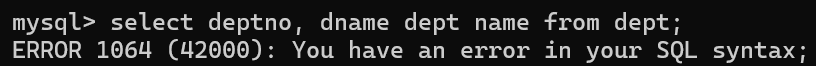
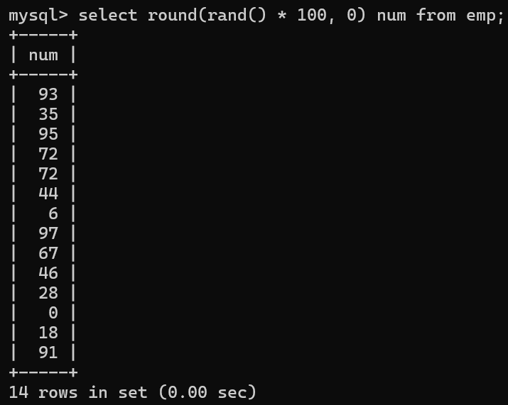

# 1.概述

## 1.1 数据库（Database，DB）

按照一定格式存储数据的一些文件的组合。
顾名思义：存储数据的仓库，实际上就是一堆文件。这些文件中存储了具有特定格式的数据。

## 1.2 数据库管理系统（DatabaseManagement，DBMS）

数据库管理系统是专门用来管理数据库中数据的，数据库管理系统可以对数据库当中的数据进行增删改查。

常见的数据库管理系统：MySQL、Oracle、MS SqlServer、DB2、sybase等....

## 1.3 SQL（结构化查询语言）

程序员需要学习SQL语句，程序员通过编写SQL语句，然后DBMS负责执行SQL语句，最终来完成数据库中数据的增删改查操作。

SQL是一套标准，程序员主要学习的就是SQL语句，这个SQL语句在mysql中可以使用，同时在Oracle中也可以使用，在DB2中也可以使用。  

## 1.4 三者之间的关系


先安装数据库管理系统MySQL，然后学习SQL语句怎么写，编写SQL语句之后，DBMS对SQL语句进行执行，最终来完成数据库的数据管理。

# 2.MySQL数据库管理系统的安装与卸载

## 2.1 安装步骤

第一步：先安装，选择“经典版”
第二步：需要进行MySQL数据库实例配置。
一路下一步就行了！！！！！

## 2.2 安装注意事项

- 端口号

  端口号port是任何一个软件/应用都会有的，端口号是应用的唯一代表。端口号通常和IP地址在一块，IP地址用来定位计算机的，端口号port是用来定位计算机上某个服务的/某个应用的！在同一台计算机上，端口号不能重复。具有唯一性。mysql数据库启动的时候，这个服务占有的默认端口号是3306这是大家都知道的事儿。记住。

- 字符编码方式：

  设置mysql数据库的字符编码方式为 UTF8，一定要注意：先选中第3个单选按钮，然后再选择utf8字符集。

- 服务名称：

  默认是：MySQL。不用改。

- 选择配置环境变量path：

  如果没有选择怎么办？你可以手动配置
  path=其它路径;C:\Program Files (x86)\MySQL\MySQL Server 5.5\bin

- mysql超级管理员用户名不能改，一定是：root

  - 你需要设置mysql数据库超级管理员的密码。我们设置为123456

  - 设置密码的同时，可以激活root账户远程访问。
    - 激活：表示root账号可以在外地登录。
    - 不激活：表示root账号只能在本机上使用。
  - 我这里选择激活了！

## 2.3 卸载步骤

第一步：双击安装包进行卸载删除。
第二步：删除目录：
     把C:\ProgramData下面的MySQL目录干掉。
     把C:\Program Files (x86)下面的MySQL目录干掉。

这样就卸载结束了！

# 3.MySQL服务

## 3.1 启动和关闭MySQL服务

- MySQL的服务可通过计算机-->右键-->管理-->服务和应用程序-->服务-->找mysql服务。
- MySQL的服务，默认是“启动”的状态，只有启动了mysql才能用。默认情况下是“自动”启动，自动启动表示下一次重启操作系统的时候自动启动该服务。

- 可以在服务上点击右键：
  - 启动
  - 重启服务
  - 停止服务
- 还可以改变服务的默认配置：
  - 服务上点击右键，属性，然后可以选择启动方式：
  -  自动（延迟启动）
  - 自动
  - 手动
  - 禁用

- 在windows操作系统当中，怎么使用命令来启动和关闭mysql服务呢？

  ```
  语法：
  net stop 服务名称;
  net start 服务名称;
  ```

​		其它服务的启停都可以采用以上的命令。

- 启动MySQL服务后就可以登陆MySQL数据库管理系统了。

## 3.2 登录MySQL数据库管理系统

使用bin目录下的mysql.exe命令来连接mysql数据库服务器

- 本地登录（显示编写密码的形式）：

  ```
  mysql -uroot -p123456
  ```

- 本地登录（隐藏密码的形式）：

  ```
  mysql -uroot -p
  Enter password: ******
  ```

# 4.MySQL常用命令

注意：

①命令以英文分号结尾；

②命令不区分大小写。

| 命令                      | 功能                       |
| ------------------------- | -------------------------- |
| exit;                     | 退出mysql                  |
| show databases;           | 查看mysql中有哪些数据库    |
| use 数据库名;             | 选择使用某个数据库         |
| create database 数据库名; | 创建数据库                 |
| show tables;              | 查看某个数据库下有哪些表   |
| select version();         | 查看mysql数据库的版本号    |
| select database();        | 查看当前使用的是哪个数据库 |
| \c                        | 用来终止一条命令的输入     |

# 5.表的概念与SQL语句的分类

## 5.1 表

- 数据库当中最基本的单元是表；
- 数据库当中是以表格的形式表示数据的，因为表比较直观；
- 任何一张表都有行和列：
  -  行（row）：被称为数据/记录。
  - 列（column）：被称为字段。

- 了解一下：
  - 每一个字段都有字段名、数据类型、约束等属性。
  - 字段名可以理解，是一个普通的名字，见名知意就行。
  - 数据类型：字符串，数字，日期等，后期讲。
  - 约束：约束也有很多，其中一个叫做唯一性约束，这种约束添加之后，该字段中的数据不能重复。

## 5.2 SQL语句的分类

- DQL：数据查询语言（凡是带有select关键字的都是查询语句）

  ```
  select...
  ```

- DML：数据操纵语言（凡是对表当中的数据进行增删改的都是DML）

  ```
  insert增、delete删、update改、这个主要是操纵表中的数据data。
  ```

- DDL：数据定义语言

  ```
  凡是带有create、drop、alter的都是DDL
  ```

  - DDL主要操作的是表的结构，不是表中的数据。

    - create：新建，等同于增

    - drop：删除

    - alter：修改

    - 这个增删改和DML不同，这个主要是对表结构进行操作。

- TCL：事务控制语言

  ```
  包括：
  事务提交：commit;
  事务回滚：rollback;
  ```

- DCL：数据控制语言

  ```
  例如：授权grant、撤销权限revoke....
  ```

# 6.数据查询

## 6.1 将sql文件中的数据导入数据库

```
create database bjpowernode; // 导入数据之前一定先要创建出该数据库
use bjpowernode; // 然后使用该数据库
source D:\course\03-MySQL\document\bjpowernode.sql // 最后才能导入成功
```

注意：路径中不可以有中文。


## 6.2 关于导入的这几张表


dept是部门表、emp是员工表、salgrade 是工资等级表。

## 6.3 查看表中数据

```
select * from 表名; //统一执行这个SQL语句。
```


## 6.4 查看表结构的命令

```
desc 表名；
```


## 6.5 简单查询

### 6.5.1 查询一个字段

```
select 字段名 from 表名;
```

**其中要注意：**
select和from都是关键字。
字段名和表名都是标识符。

**强调：**
对于SQL语句来说，是通用的，所有的SQL语句以“;”结尾。
另外SQL语句不区分大小写，都行。

### 6.5.2 查询两个及多个字段

```
select 字段名1, 字段名2, 字段名n from 表名;
```

### 6.5.3 查询所有字段

- 方式1：可以把每个字段都写上

  ```
  select a,b,c,d,e,f... from tablename;
  ```

- 方式2：可以使用*

  ```
  select * from tablename;
  ```

  - 这种方式的缺点：效率低、可读性差。
  - 在实际开发中不建议，可以自己玩没问题。
  - 你可以在DOS命令窗口中想快速的看一看全表数据可以采用这种方式。

### 6.5.4 给查询的列起别名

- 使用as关键字起别名

  

  - 注意：只是将显示的查询结果列名显示为deptname，原表列名还是叫：dname
  - 记住：select语句是永远都不会进行修改操作的。（因为只负责查询）

- as关键字也可以省略

  

- 起别名的时候，别名里面有空格就会报错

  

  - DBMS看到这样的语句，进行SQL语句的编译，不符合语法，编译报错。

  - 解决办法

    ```
    select deptno,dname 'dept name' from dept; //加单引号
    select deptno,dname "dept name" from dept; //加双引号
    ```

    

- 注意：
  - 在所有的数据库当中，字符串统一使用单引号括起来，单引号是标准，双引号在oracle数据库中用不了。但是在mysql中可以使用。
  - 再次强调：数据库中的字符串都是采用单引号括起来。这是标准的。双引号不标准。

### 6.5.5 字段可以使用数学表达

- 计算员工年薪？sal \* 12：

  

- 别名是中文，用单引号括起来

  

## 6.6 条件查询

条件查询：查询出来符合条件的数据。

### 6.6.1 语法格式

```
select
        字段1,字段2,字段3....
from 
        表名
where
        条件;
```

### 6.6.2 都有哪些条件

| 条件             | 含义                                                         |
| :--------------- | :----------------------------------------------------------- |
| =                | 等于                                                         |
| <>或!=           | 不等于                                                       |
| <                | 小于                                                         |
| <=               | 小于等于                                                     |
| >                | 大于                                                         |
| \>=              | 大于等于                                                     |
| between … and …. | 两个值之间, 等同于 >= and <=<br />使用between and的时候，必须遵循左小右大。<br/>between and是闭区间，包括两端的值。 |
| is null          | 为空<br />在数据库当中null不能使用等号进行衡量。需要使用is null，因为数据库中的null代表什么也没有，它不是一个值，所以不能使用等号衡量。 |
| is not null      | 不为空                                                       |
| and              | 并且                                                         |
| or               | 或者<br />and和or同时出现，and优先级较高。如果想让or先执行，需要加“小括号”，以后在开发中，如果不确定优先级，就加小括号就行了。 |
| in               | 在这个范围中，相当于多个 or<br />注意：in不是一个区间。in后面跟的是具体的值。 |
| not in           | 不在这个范围中，相当于多个 or                                |
| like             | 称为模糊查询，支持%或下划线匹配<br/>%：匹配任意多个字符<br/>下划线：任意一个字符。<br/>（%是一个特殊的符号，_ 也是一个特殊符号） |

假设t_student学生表如下：

```
name字段
----------------------
zhangsan
lisi
wangwu
zhaoliu
jack_son
```

找出名字中有“_”的？

```
// 错误写法
select name from t_student where name like '%_%'; 

// 正确写法
select name from t_student where name like '%\_%'; // \转义字符。
```

## 6.7 排序

注意：不指明降序或升序的话，默认按升序；

### 6.7.1 单字段排序

1.查询所有员工姓名与薪资，按薪资字段排序：


2.查询所有员工薪资，指定降序排序：


3.查询所有员工薪资，指定升序排序：


### 6.7.2 多字段排序

查询员工名字和薪资，要求按照薪资升序，如果薪资一样的话，再按照名字升序排列。


## 6.8 关键字顺序不能变

```
select
	...
from
	...
where
	...
order by
	...
以上语句的执行顺序必须掌握：
    第一步：from
    第二步：where
    第三步：select
    第四步：order by（排序总是在最后执行！）
```

## 6.9 数据处理函数

数据处理函数又被称为单行处理函数；

单行处理函数的特点：一个输入对应一个输出。

和单行处理函数相对的是：多行处理函数。（多行处理函数特点：多个输入，对应1个输出！）

### 6.9.1 lower(str) 转换小写


14个输入，最后还是14个输出。这是单行处理函数的特点。

### 6.9.2 upper(str) 转换大写


### 6.9.3 substr(str) 取子串

语法：substr( 被截取的字符串, 起始下标,截取的长度)

注意：起始下标从1开始，没有0.

1.找出员工名字第一个字母是A的员工信息：

方法一：模糊查询


方法二：取子串


2.将员工姓名首字母大写，其余字母小写来进行显示：


### 6.9.4 concat(str1, str2) 进行字符串的拼接


### 6.9.5 length(str) 获取字符串长度


### 6.9.6 trim(str) 去字符串前后空格


### 6.9.7 case..when..then..when..then..else..end

当员工的工作岗位是MANAGER的时候，工资上调10%，当工作岗位是SALESMAN的时候，工资上调50%,其它正常。
（注意：不修改数据库，只是将查询结果显示为工资上调）

```sql
select
	empno, ename, job, sal oldsal, 
	(
		case job 
			when 'MANAGER' then sal + sal * 0.1 
			when 'SALESMAN' then sal + sal * 0.5
 			else sal 
 		end
 	)newsal
from 
	emp;
```


### 6.9.8 round(x,y) 四舍五入

select后面可以跟某个表的字段名（可以等同看做变量名），也可以跟字面量/字面值（数据）。

```
select 1000 from emp;
select 'abc' from emp;
```

round(x, y)四舍五入函数：

当y > 0时，对x的小数部分进行四舍五入：


当y ≤ 0时，对x的整数部分进行四舍五入：


### 6.9.9 rand() 生成随机数

生成100以内的随机数：



### 6.9.10 ifnull(数据, 被当做哪个值)，可以将 null 转换成一个具体值

ifnull是空处理函数。专门处理空的。

在所有数据库当中，只要有NULL参与的数学运算，最终结果就是NULL。


注意：NULL只要参与运算，最终结果一定是NULL。为了避免这个现象，需要使用ifnull函数。

ifnull函数用法：ifnull(数据, 被当做哪个值)，如果“数据”为NULL的时候，把这个数据结构当做哪个值。

计算每个员工的年薪，年薪 = (月薪 + 月补助) \* 12：


## 6.10 分组函数

分组函数又称为多行处理函数，特点是：输入多行，最终输出一行。

| 函数名 | 功能   |
| ------ | ------ |
| count  | 计数   |
| sum    | 求和   |
| avg    | 平均值 |
| max    | 最大值 |
| min    | 最小值 |


1.找出最高工资：


2.找出最低工资：


3.计算工资和：


4.计算平均工资：


5.计算员工数量：


注意：

①分组函数在使用的时候必须先进行分组，然后才能用。如果你没有对数据进行分组，整张表默认为一组。

②分组函数自动忽略NULL，你不需要提前对NULL进行处理。

③分组函数中count(*)和count(具体字段)有什么区别？

```
count(具体字段)：表示统计该字段下所有不为NULL的元素的总数。
count(*)：统计表当中的总行数。（只要有一行数据count则++），因为每一行记录不可能都为NULL，一行数据中有一列不为NULL，则这行数据就是有效的。
```

④分组函数不能够直接使用在where子句中。

⑤所有的分组函数可以组合起来一起用。

