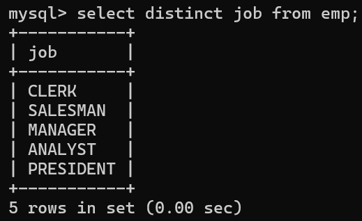
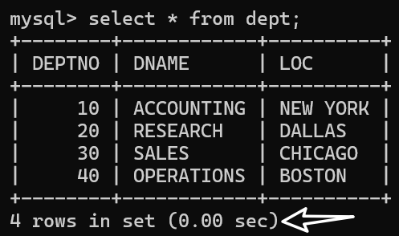
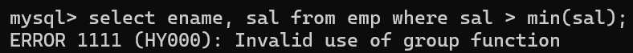
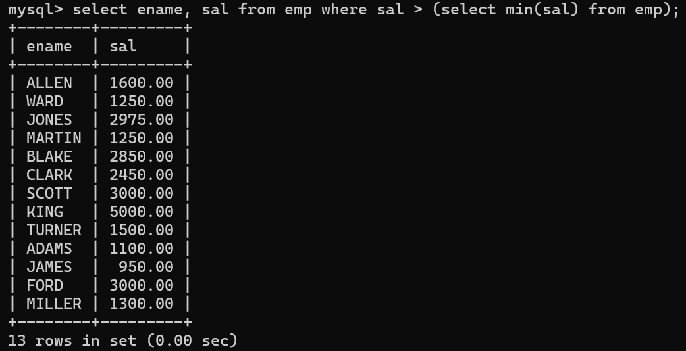
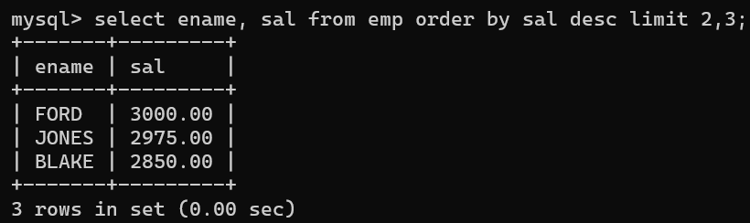
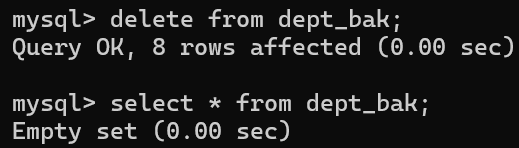
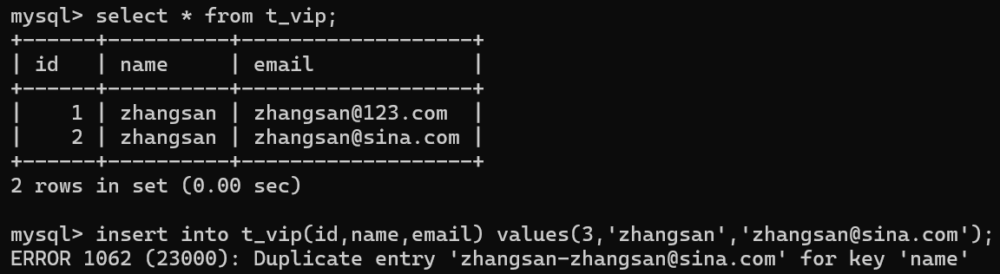
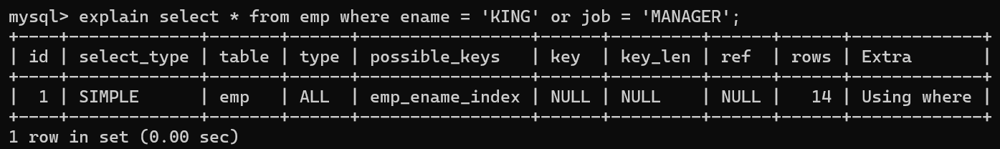

# 1.概述

## 1.1 数据库（Database，DB）

按照一定格式存储数据的一些文件的组合。
顾名思义：存储数据的仓库，实际上就是一堆文件。这些文件中存储了具有特定格式的数据。

## 1.2 数据库管理系统（DatabaseManagement，DBMS）

数据库管理系统是专门用来管理数据库中数据的，数据库管理系统可以对数据库当中的数据进行增删改查。

常见的数据库管理系统：MySQL、Oracle、MS SqlServer、DB2、sybase等....

## 1.3 SQL（结构化查询语言）

程序员需要学习SQL语句，程序员通过编写SQL语句，然后DBMS负责执行SQL语句，最终来完成数据库中数据的增删改查操作。

SQL是一套标准，程序员主要学习的就是SQL语句，这个SQL语句在mysql中可以使用，同时在Oracle中也可以使用，在DB2中也可以使用。  

## 1.4 三者之间的关系


先安装数据库管理系统MySQL，然后学习SQL语句怎么写，编写SQL语句之后，DBMS对SQL语句进行执行，最终来完成数据库的数据管理。

# 2.MySQL数据库管理系统的安装与卸载

## 2.1 安装步骤

第一步：先安装，选择“经典版”
第二步：需要进行MySQL数据库实例配置。
一路下一步就行了！！！！！

## 2.2 安装注意事项

- 端口号

  端口号port是任何一个软件/应用都会有的，端口号是应用的唯一代表。端口号通常和IP地址在一块，IP地址用来定位计算机的，端口号port是用来定位计算机上某个服务的/某个应用的！在同一台计算机上，端口号不能重复。具有唯一性。mysql数据库启动的时候，这个服务占有的默认端口号是3306这是大家都知道的事儿。记住。

- 字符编码方式：

  设置mysql数据库的字符编码方式为 UTF8，一定要注意：先选中第3个单选按钮，然后再选择utf8字符集。

- 服务名称：

  默认是：MySQL。不用改。

- 选择配置环境变量path：

  如果没有选择怎么办？你可以手动配置
  path=其它路径;C:\Program Files (x86)\MySQL\MySQL Server 5.5\bin

- mysql超级管理员用户名不能改，一定是：root

  - 你需要设置mysql数据库超级管理员的密码。我们设置为123456

  - 设置密码的同时，可以激活root账户远程访问。
    - 激活：表示root账号可以在外地登录。
    - 不激活：表示root账号只能在本机上使用。
  - 我这里选择激活了！

## 2.3 卸载步骤

第一步：双击安装包进行卸载删除。
第二步：删除目录：
     把C:\ProgramData下面的MySQL目录干掉。
     把C:\Program Files (x86)下面的MySQL目录干掉。

这样就卸载结束了！

# 3.MySQL服务

## 3.1 启动和关闭MySQL服务

- MySQL的服务可通过计算机-->右键-->管理-->服务和应用程序-->服务-->找mysql服务。
- MySQL的服务，默认是“启动”的状态，只有启动了mysql才能用。默认情况下是“自动”启动，自动启动表示下一次重启操作系统的时候自动启动该服务。

- 可以在服务上点击右键：
  - 启动
  - 重启服务
  - 停止服务
- 还可以改变服务的默认配置：
  - 服务上点击右键，属性，然后可以选择启动方式：
  -  自动（延迟启动）
  - 自动
  - 手动
  - 禁用

- 在windows操作系统当中，怎么使用命令来启动和关闭mysql服务呢？

  ```
  语法：
  net stop 服务名称;
  net start 服务名称;
  ```

​		其它服务的启停都可以采用以上的命令。

- 启动MySQL服务后就可以登陆MySQL数据库管理系统了。

## 3.2 登录MySQL数据库管理系统

使用bin目录下的mysql.exe命令来连接mysql数据库服务器

- 本地登录（显示编写密码的形式）：

  ```
  mysql -uroot -p123456
  ```

- 本地登录（隐藏密码的形式）：

  ```
  mysql -uroot -p
  Enter password: ******
  ```

# 4.MySQL常用命令

注意：

①命令以英文分号结尾；

②命令不区分大小写。

| 命令                      | 功能                       |
| ------------------------- | -------------------------- |
| exit;                     | 退出mysql                  |
| show databases;           | 查看mysql中有哪些数据库    |
| use 数据库名;             | 选择使用某个数据库         |
| create database 数据库名; | 创建数据库                 |
| show tables;              | 查看某个数据库下有哪些表   |
| select version();         | 查看mysql数据库的版本号    |
| select database();        | 查看当前使用的是哪个数据库 |
| \c                        | 用来终止一条命令的输入     |

# 5.表的概念与SQL语句的分类

## 5.1 表

- 数据库当中最基本的单元是表；
- 数据库当中是以表格的形式表示数据的，因为表比较直观；
- 任何一张表都有行和列：
  -  行（row）：被称为数据/记录。
  - 列（column）：被称为字段。

- 了解一下：
  - 每一个字段都有字段名、数据类型、约束等属性。
  - 字段名可以理解，是一个普通的名字，见名知意就行。
  - 数据类型：字符串，数字，日期等，后期讲。
  - 约束：约束也有很多，其中一个叫做唯一性约束，这种约束添加之后，该字段中的数据不能重复。

## 5.2 SQL语句的分类

- DQL：数据查询语言（凡是带有select关键字的都是查询语句）

  ```
  select...
  ```

- DML：数据操纵语言（凡是对表当中的数据进行增删改的都是DML）

  ```
  insert增、delete删、update改、这个主要是操纵表中的数据data。
  ```

- DDL：数据定义语言

  ```
  凡是带有create、drop、alter的都是DDL
  ```

  - DDL主要操作的是表的结构，不是表中的数据。

    - create：新建，等同于增

    - drop：删除

    - alter：修改

    - 这个增删改和DML不同，这个主要是对表结构进行操作。

- TCL：事务控制语言

  ```
  包括：
  事务提交：commit;
  事务回滚：rollback;
  ```

- DCL：数据控制语言

  ```
  例如：授权grant、撤销权限revoke....
  ```

# 6.单表查询

## 6.1 将sql文件中的数据导入数据库

```
create database bjpowernode; // 导入数据之前一定先要创建出该数据库
use bjpowernode; // 然后使用该数据库
source D:\course\03-MySQL\document\bjpowernode.sql // 最后才能导入成功
```

注意：路径中不可以有中文。


## 6.2 关于导入的这几张表


dept是部门表、emp是员工表、salgrade 是工资等级表。

## 6.3 查看表中数据

```
select * from 表名; //统一执行这个SQL语句。
```


## 6.4 查看表结构的命令

```
desc 表名；
```


## 6.5 简单查询

### 6.5.1 查询一个字段

```
select 字段名 from 表名;
```

**其中要注意：**
select和from都是关键字。
字段名和表名都是标识符。

**强调：**
对于SQL语句来说，是通用的，所有的SQL语句以“;”结尾。
另外SQL语句不区分大小写，都行。

### 6.5.2 查询两个及多个字段

```
select 字段名1, 字段名2, 字段名n from 表名;
```

### 6.5.3 查询所有字段

- 方式1：可以把每个字段都写上

  ```
  select a,b,c,d,e,f... from tablename;
  ```

- 方式2：可以使用*

  ```
  select * from tablename;
  ```

  - 这种方式的缺点：效率低、可读性差。
  - 在实际开发中不建议，可以自己玩没问题。
  - 你可以在DOS命令窗口中想快速的看一看全表数据可以采用这种方式。

### 6.5.4 给查询的列起别名

- 使用as关键字起别名

  

  - 注意：只是将显示的查询结果列名显示为deptname，原表列名还是叫：dname
  - 记住：select语句是永远都不会进行修改操作的。（因为只负责查询）

- as关键字也可以省略

  

- 起别名的时候，别名里面有空格就会报错

  

  - DBMS看到这样的语句，进行SQL语句的编译，不符合语法，编译报错。

  - 解决办法

    ```
    select deptno,dname 'dept name' from dept; //加单引号
    select deptno,dname "dept name" from dept; //加双引号
    ```

    

- 注意：
  - 在所有的数据库当中，字符串统一使用单引号括起来，单引号是标准，双引号在oracle数据库中用不了。但是在mysql中可以使用。
  - 再次强调：数据库中的字符串都是采用单引号括起来。这是标准的。双引号不标准。

### 6.5.5 字段可以使用数学表达

- 计算员工年薪？sal \* 12：

  

- 别名是中文，用单引号括起来

  

## 6.6 条件查询

条件查询：查询出来符合条件的数据。

### 6.6.1 语法格式

```
select
        字段1,字段2,字段3....
from 
        表名
where
        条件;
```

### 6.6.2 都有哪些条件

| 条件             | 含义                                                         |
| :--------------- | :----------------------------------------------------------- |
| =                | 等于                                                         |
| <>或!=           | 不等于                                                       |
| <                | 小于                                                         |
| <=               | 小于等于                                                     |
| >                | 大于                                                         |
| \>=              | 大于等于                                                     |
| between … and …. | 两个值之间, 等同于 >= and <=<br />使用between and的时候，必须遵循左小右大。<br/>between and是闭区间，包括两端的值。 |
| is null          | 为空<br />在数据库当中null不能使用等号进行衡量。需要使用is null，因为数据库中的null代表什么也没有，它不是一个值，所以不能使用等号衡量。 |
| is not null      | 不为空                                                       |
| and              | 并且                                                         |
| or               | 或者<br />and和or同时出现，and优先级较高。如果想让or先执行，需要加“小括号”，以后在开发中，如果不确定优先级，就加小括号就行了。 |
| in               | 在这个范围中，相当于多个 or<br />注意：in不是一个区间。in后面跟的是具体的值。 |
| not in           | 不在这个范围中，相当于多个 or                                |
| like             | 称为模糊查询，支持%或下划线匹配<br/>%：匹配任意多个字符<br/>下划线：任意一个字符。<br/>（%是一个特殊的符号，_ 也是一个特殊符号） |

假设t_student学生表如下：

```
name字段
----------------------
zhangsan
lisi
wangwu
zhaoliu
jack_son
```

找出名字中有“_”的？

```
// 错误写法
select name from t_student where name like '%_%'; 

// 正确写法
select name from t_student where name like '%\_%'; // \转义字符。
```

## 6.7 排序

注意：不指明降序或升序的话，默认按升序；

### 6.7.1 单字段排序

1.查询所有员工姓名与薪资，按薪资字段排序：


2.查询所有员工薪资，指定降序排序：


3.查询所有员工薪资，指定升序排序：


### 6.7.2 多字段排序

查询员工名字和薪资，要求按照薪资升序，如果薪资一样的话，再按照名字升序排列。


## 6.8 关键字执行顺序第一次总结

```
select
	...
from
	...
where
	...
order by
	...
以上语句的执行顺序必须掌握：
    第一步：from
    第二步：where
    第三步：select
    第四步：order by（排序总是在最后执行！）
```

## 6.9 数据处理函数

数据处理函数又被称为单行处理函数；

单行处理函数的特点：一个输入对应一个输出。

和单行处理函数相对的是：多行处理函数。（多行处理函数特点：多个输入，对应1个输出！）

### 6.9.1 lower(str) 转换小写


14个输入，最后还是14个输出。这是单行处理函数的特点。

### 6.9.2 upper(str) 转换大写


### 6.9.3 substr(str) 取子串

语法：substr( 被截取的字符串, 起始下标,截取的长度)

注意：起始下标从1开始，没有0.

1.找出员工名字第一个字母是A的员工信息：

方法一：模糊查询


方法二：取子串


2.将员工姓名首字母大写，其余字母小写来进行显示：


### 6.9.4 concat(str1, str2) 进行字符串的拼接


### 6.9.5 length(str) 获取字符串长度


### 6.9.6 trim(str) 去字符串前后空格


### 6.9.7 case..when..then..when..then..else..end

当员工的工作岗位是MANAGER的时候，工资上调10%，当工作岗位是SALESMAN的时候，工资上调50%,其它正常。
（注意：不修改数据库，只是将查询结果显示为工资上调）

```sql
select
	empno, ename, job, sal oldsal, 
	(
		case job 
			when 'MANAGER' then sal + sal * 0.1 
			when 'SALESMAN' then sal + sal * 0.5
 			else sal 
 		end
 	)newsal
from 
	emp;
```


### 6.9.8 round(x,y) 四舍五入

select后面可以跟某个表的字段名（可以等同看做变量名），也可以跟字面量/字面值（数据）。

```
select 1000 from emp;
select 'abc' from emp;
```

round(x, y)四舍五入函数：

当y > 0时，对x的小数部分进行四舍五入：


当y ≤ 0时，对x的整数部分进行四舍五入：


### 6.9.9 rand() 生成随机数

生成100以内的随机数：


### 6.9.10 ifnull(数据, 被当做哪个值)，可以将 null 转换成一个具体值

ifnull是空处理函数。专门处理空的。

在所有数据库当中，只要有NULL参与的数学运算，最终结果就是NULL。


注意：NULL只要参与运算，最终结果一定是NULL。为了避免这个现象，需要使用ifnull函数。

ifnull函数用法：ifnull(数据, 被当做哪个值)，如果“数据”为NULL的时候，把这个数据结构当做哪个值。

计算每个员工的年薪，年薪 = (月薪 + 月补助) \* 12：


## 6.10 分组函数

分组函数又称为多行处理函数，特点是：输入多行，最终输出一行。

| 函数名 | 功能   |
| ------ | ------ |
| count  | 计数   |
| sum    | 求和   |
| avg    | 平均值 |
| max    | 最大值 |
| min    | 最小值 |


1.找出最高工资：


2.找出最低工资：


3.计算工资和：


4.计算平均工资：


5.计算员工数量：


注意：

①分组函数在使用的时候必须先进行分组，然后才能用。如果你没有对数据进行分组，整张表默认为一组。

②分组函数自动忽略NULL，你不需要提前对NULL进行处理。

③分组函数中count(*)和count(具体字段)有什么区别？

```
count(具体字段)：表示统计该字段下所有不为NULL的元素的总数。
count(*)：统计表当中的总行数。（只要有一行数据count则++），因为每一行记录不可能都为NULL，一行数据中有一列不为NULL，则这行数据就是有效的。
```

④分组函数不能够直接使用在where子句中。

⑤所有的分组函数可以组合起来一起用。


## 6.11 分组查询

### 6.11.1 什么是分组查询？

在实际的应用中，可能有这样的需求，需要先进行分组，然后对每一组的数据进行操作。这个时候我们需要使用分组查询，怎么进行分组查询呢？

```
select
	...
from
	...
group by
	...     
```

例如：

计算每个部门的工资和？

计算每个工作岗位的平均薪资？

找出每个工作岗位的最高薪资？

### 6.11.2 关键字执行顺序第二次总结

    select
    	...
    from
    	...
    where
    	...
    group by
    	...
    order by
    	...

**以上关键字的顺序不能颠倒，需要记忆。执行顺序如下：**

```
1. from
2. where
3. group by
4. select
5. order by
```

为什么分组函数不能直接使用在where后面？

```
select ename,sal from emp where sal > min(sal);//报错。
因为分组函数在使用的时候必须先分组之后才能使用。
where执行的时候，还没有执行group by分组。所以where后面不能出现分组函数。

select sum(sal) from emp; 
这个没有分组，为啥sum()函数可以用呢？
因为select在group by之后执行。
```

### 6.11.3 分组查询例题

- 找出每个工作岗位的工资和

  - 实现思路：按照工作岗位分组，然后对工资求和。

  

  - 以上这个语句的执行顺序？

    - 先从emp表中查询数据。
    - 根据job字段进行分组。
    - 然后对每一组的数据进行sum(sal)

  - 以下语句在MySQL中可以执行，但是毫无意义：

    

    - 以上语句在oracle中执行报错。oracle的语法比mysql的语法严格。（mysql的语法相对来说松散一些！）
    - 重点结论：在一条select语句当中，如果有group by语句的话，select后面只能跟：参加分组的字段，以及分组函数。其它的一律不能跟。

- 找出每个部门的最高薪资

  - 实现思路：按照部门编号分组，求每一组的最大值。

  

- 找出“每个部门，不同工作岗位”的最高薪资

  - 技巧：两个字段联合成1个字段看。（两个字段联合分组）

    

- 使用having可以对分完组之后的数据进一步过滤

  - having不能单独使用，having不能代替where，having必须和group by联合使用。

  - 找出每个部门最高薪资，要求显示最高薪资大于3000的？

    

    - 思考一个问题：以上的sql语句执行效率是不是低？

    - 比较低，实际上可以这样考虑：先将大于3000的都找出来，然后再分组。

      

    - 优化策略：where和having，优先选择where，where实在完成不了了，再选择having。

- where没办法的情况

  - 找出每个部门平均薪资，要求显示平均薪资高于2500的。

    

### 6.11.4 关键字执行顺序第三次总结

```
select 
	...
from
	...
where
	...
group by
	...
having
	...
order by
	...
以上关键字只能按照这个顺序来，不能颠倒。

执行顺序？
    1. from
    2. where
    3. group by
    4. having
    5. select
    6. order by

从某张表中查询数据，先经过where条件筛选出有价值的数据。对这些有价值的数据进行分组。分组之后可以使用having继续筛选。select查询出来。最后排序输出！
```

找出每个岗位的平均薪资，要求显示平均薪资大于1500的，除MANAGER岗位之外，要求按照平均薪资降序排。


## 6.12 使用distinct关键字把查询结果去除重复记录

- 注意：原表数据不会被修改，只是查询结果去重。

- 例：查询emp表中所有的职位

  

  - 从查询结果可以看出，里面存在大量重复记录

  - 使用distinct关键字去重后如下：

    

- 以下写法是错误的，有语法错误：

  

  - distinct只能出现在所有字段的最前方。

- distinct出现在job,deptno两个字段之前，表示两个字段联合起来去重：

  

  

- 统计一下工作岗位的数量：

  

# 7.连接查询（多表查询）

## 7.1 什么是连接查询？

从一张表中单独查询，称为单表查询。

emp表和dept表联合起来查询数据，从emp表中取员工名字，从dept表中取部门名字。这种跨表查询，多张表联合起来查询数据，被称为连接查询。

## 7.2 连接查询的分类

### 7.2.1 根据语法的年代分类

SQL92：1992年的时候出现的语法；

SQL99：1999年的时候出现的语法；

我们这里重点学习SQL99.(这个过程中简单演示一个SQL92的例子)

### 7.2.2 根据表连接的方式分类

- 内连接：
  - 等值连接
  - 非等值连接
  - 自连接
- 外连接：
  - 左外连接（左连接）
  - 右外连接（右连接）
- 全连接（不讲）

## 7.3 笛卡尔积现象

- 当两张表进行连接查询时，没有任何条件的限制会发生笛卡尔积现象。

  - 案例：查询每个员工所在部门名称？

    

    

    ```
    mysql> select ename, dname from emp, dept;
    +--------+------------+
    | ename  | dname      |
    +--------+------------+
    | SMITH  | ACCOUNTING |
    | SMITH  | RESEARCH   |
    | SMITH  | SALES      |
    | SMITH  | OPERATIONS |
    。。。。。。。。。。。。。。。
    | MILLER | SALES      |
    | MILLER | OPERATIONS |
    +--------+------------+
    56 rows in set (0.00 sec)
    ```

    - 14 * 4 = 56

  - 当两张表进行连接查询，没有任何条件限制的时候，最终查询结果条数，是两张表条数的乘积，这种现象被称为：笛卡尔积现象。（笛卡尔发现的，这是一个数学现象。）

## 7.4 怎么避免笛卡尔积现象？

- 连接时加条件，满足这个条件的记录被筛选出来！


- 给表起别名，很重要，效率问题：


- 思考：最终查询的结果条数是14条，但是匹配的过程中，匹配的次数减少了吗？
  - 还是56次，只不过进行了四选一。次数没有减少。

- 注意：通过笛卡尔积现象得出，表的连接次数越多效率越低，尽量避免表的连接次数。

## 7.5 内连接

### 7.5.1 等值连接

- 案例：查询每个员工所在部门名称，显示员工名和部门名？

  - emp e和dept d表进行连接，条件是：e.deptno = d.deptno

  - SQL92语法：

    ```
    select 
    	e.ename,d.dname
    from
    	emp e, dept d
    where
    	e.deptno = d.deptno;
    ```

    - SQL92语法的缺点：结构不清晰，表的连接条件，和后期进一步筛选的条件，都放到了where后面。

  - SQL99语法：

    ```
    select 
    	e.ename,d.dname
    from
    	emp e
    join
    	dept d
    on
    	e.deptno = d.deptno;
    
    //inner可以省略（带着inner可读性更好！！！一眼就能看出来是内连接）
    select 
    	e.ename,d.dname
    from
    	emp e
    inner join
    	dept d
    on
    	e.deptno = d.deptno; // 条件是等量关系，所以被称为等值连接。
    ```

    - SQL99优点：表连接的条件是独立的，连接之后，如果还需要进一步筛选，再往后继续添加where

    - SQL99语法

      ```
      select 
      	...
      from
      	a
      join
      	b
      on
      	a和b的连接条件
      where
      	筛选条件
      ```

### 7.5.2 非等值连接

- 案例：找出每个员工的薪资等级，要求显示员工名、薪资、薪资等级？

  

  条件不是一个等量关系，称为非等值连接。

### 7.5.3 自连接

- 案例：查询员工的上级领导，要求显示员工名和对应的领导名。

  

  13条记录，没有KING。《内连接》

  以上就是内连接中的：自连接，技巧：一张表看做两张表。

## 7.6 外连接

- 内连接：A和B连接，AB两张表没有主次关系，平等的。

  ```
  select 
      e.ename,d.dname
  from
      emp e
  join
      dept d
  on
      e.deptno = d.deptno; //内连接的特点：完成能够匹配上这个条件的数据查询出来。
  ```

  

### 7.6.1 右外连接

```
select 
    e.ename,d.dname
from
    emp e 
right join 
    dept d
on
    e.deptno = d.deptno;

// outer是可以省略的，带着可读性强。
select 
    e.ename,d.dname
from
    emp e 
right outer join 
    dept d
on
    e.deptno = d.deptno;
```

- right代表什么：表示将join关键字右边的这张表看成主表，主要是为了将这张表的数据全部查询出来，捎带着关联查询左边的表。
- 在外连接当中，两张表连接，产生了主次关系。

### 7.6.2 左外连接

```
select 
    e.ename,d.dname
from
    dept d 
left join 
    emp e
on
    e.deptno = d.deptno;

// outer是可以省略的，带着可读性强。
select 
    e.ename,d.dname
from
    dept d 
left outer join 
    emp e
on
    e.deptno = d.deptno;
```

- 带有right的是右外连接，又叫做右连接；
- 带有left的是左外连接，又叫做左连接；
- 任何一个右连接都有左连接的写法；
- 任何一个左连接都有右连接的写法；

- 思考：外连接的查询结果条数一定是 >= 内连接的查询结果条数？正确。

### 7.6.3 外连接案例

- 案例：查询每个员工的上级领导，要求显示所有员工的名字和领导名？

  

- 三张表，四张表怎么连接

  ```
  select 
  	...
  from
  	a
  join
  	b
  on
  	a和b的连接条件
  join
  	c
  on
  	a和c的连接条件
  right join
  	d
  on
  	a和d的连接条件
  ```

  - 一条SQL中内连接和外连接可以混合。都可以出现！

- 案例：找出每个员工的部门名称以及工资等级，要求显示员工名、部门名、薪资、薪资等级？

  ```
  select 
  	e.ename,e.sal,d.dname,s.grade
  from
  	emp e
  join
  	dept d
  on 
  	e.deptno = d.deptno
  join
  	salgrade s
  on
  	e.sal between s.losal and s.hisal;
  ```

  

- 案例：找出每个员工的部门名称以及工资等级，还有上级领导，要求显示员工名、领导名、部门名、薪资、薪资等级？

```
select 
	e.ename,e.sal,d.dname,s.grade,l.ename
from
	emp e
join
	dept d
on 
	e.deptno = d.deptno
join
	salgrade s
on
	e.sal between s.losal and s.hisal
left join
	emp l
on
	e.mgr = l.empno;
```


# 8.子查询

## 8.1 什么是子查询？

select语句中嵌套select语句，被嵌套的select语句称为子查询。

## 8.2 子查询都可以出现在哪里呢？

```
select
	..(select).
from
	..(select).
where
	..(select).
```

## 8.3 where子句中的子查询

- 案例：找出比最低工资高的员工姓名和工资？

  - 错误思路

    

  - 正确实现思路：

    ```
    第一步：查询最低工资是多少
    select min(sal) from emp;
    第二步：找出>800的
    select ename,sal from emp where sal > 800;
    第三步：合并
    select ename,sal from emp where sal > (select min(sal) from emp);
    
    ```

    

## 8.4 from子句中的子查询

- 注意：from后面的子查询，可以将子查询的查询结果当做一张临时表。（技巧）

- 案例：找出每个岗位的平均工资的薪资等级。

  ```
  第一步：找出每个岗位的平均工资（按照岗位分组求平均值）
  select job,avg(sal) avgsal from emp group by job; //t表
  
  第二步：克服心理障碍，把以上的查询结果就当做一张真实存在的表e。
  select * from salgrade; //s表
  t表和s表进行表连接，条件：t表avg(sal) between s.losal and s.hisal;
  select 
  	t.*, s.grade
  from
  	(select job,avg(sal) as avgsal from emp group by job) t
  join
  	salgrade s
  on
  	t.avgsal between s.losal and s.hisal;
  
  ```

  


# 9.union合并查询结果集

- 案例：查询工作岗位是MANAGER和SALESMAN的员工？

  

  ```
  union的效率要高一些。对于表连接来说，每连接一次新表，则匹配的次数满足笛卡尔积，成倍的翻。。。
  但是union可以减少匹配的次数。在减少匹配次数的情况下，还可以完成两个结果集的拼接。
      a 连接 b 连接 c
      a 10条记录
      b 10条记录
      c 10条记录
      匹配次数是：1000
  
      a 连接 b一个结果：10 * 10 --> 100次
      a 连接 c一个结果：10 * 10 --> 100次
      使用union的话是：100次 + 100次 = 200次。（union把乘法变成了加法运算）
  
  union在使用的时候有注意事项吗？
      //错误的：union在进行结果集合并的时候，要求两个结果集的列数相同。
      select ename,job from emp where job = 'MANAGER'
      union
      select ename from emp where job = 'SALESMAN';
  
      // MYSQL可以，oracle语法严格 ，不可以，报错。要求：结果集合并时列和列的数据类型也要一致。
      select ename,job from emp where job = 'MANAGER'
      union
      select ename,sal from emp where job = 'SALESMAN';
  ```

# 10.limit关键字

## 10.1 limit作用

将查询结果集的一部分取出来。通常使用在分页查询当中。

百度默认：一页显示10条记录。

分页的作用是为了提高用户的体验，因为一次全部都查出来，用户体验差。可以一页一页翻页看。

## 10.2 limit用法

### 10.2.1 完整用法

```
limit startIndex, length
// startIndex是起始下标，length是长度，起始下标从0开始。
```

### 10.2.2 缺省用法

```
limit 5;
// 这是取前5.
```

### 10.2.3 limit用法案例

- 案例1：按照薪资降序，取出排名在前5名的员工？

  ```
  select 
  	ename,sal
  from
  	emp
  order by 
  	sal desc
  limit 5; //取前5
  
  select 
  	ename,sal
  from
  	emp
  order by 
  	sal desc
  limit 0,5;
  ```

  

  注意：mysql当中limit在order by之后执行！！！！！

- 案例2：取出工资排名在[3-5]名的员工。

  ```
  select 
  	ename,sal
  from
  	emp
  order by
  	sal desc
  limit
  	2, 3;
  // 2表示起始位置从下标2开始，就是第三条记录。
  // 3表示长度
  ```

  

- 案例3：取出工资排名在[5-9]名的员工。

  ```
  select 
  	ename,sal
  from
  	emp
  order by 
  	sal desc
  limit
  	4, 5;
  ```

  

## 10.3 使用limit进行分页

### 10.3.1 每页显示3条记录

```
第1页：limit 0,3        [0 1 2]
第2页：limit 3,3        [3 4 5]
第3页：limit 6,3        [6 7 8]
第4页：limit 9,3        [9 10 11]
```

### 10.3.2 每页显示pageSize条记录

```
第pageNo页：limit (pageNo - 1) * pageSize  , pageSize

    public static void main(String[] args){
        // 用户提交过来一个页码，以及每页显示的记录条数
        int pageNo = 5; //第5页
        int pageSize = 10; //每页显示10条

        int startIndex = (pageNo - 1) * pageSize;
        String sql = "select ...limit " + startIndex + ", " + pageSize;
    }

记公式：
    limit (pageNo-1)*pageSize , pageSize
```

## 10.4 关键字执行顺序第四次总结

```
select 
	...
from
	...
where
	...
group by
	...
having
	...
order by
	...
limit
	...
    
执行顺序？
    1.from
    2.where
    3.group by
    4.having
    5.select
    6.order by
    7.limit..
```

# 11.建表与数据的增删改

## 11.1 建表

### 11.1.1 建表的语法格式

```
create table 表名(
        字段名1 数据类型, 
        字段名2 数据类型, 
        字段名3 数据类型
);
```

- 表名：建议以t_ 或者 tbl_开始，可读性强。见名知意。
- 字段名：见名知意。
- 表名和字段名都属于标识符。

### 11.1.2 MySQL中的数据类型

| 数据类型         | 描述                                                         |
| ---------------- | ------------------------------------------------------------ |
| varchar(最长255) | 可变长度的字符串。<br />比较智能，节省空间。会根据实际的数据长度动态分配空间。<br />优点：节省空间<br/>缺点：需要动态分配空间，速度慢。 |
| char(最长255)    | 定长字符串<br/>不管实际的数据长度是多少，分配固定长度的空间去存储数据。<br/>使用不恰当的时候，可能会导致空间的浪费。<br/>优点：不需要动态分配空间，速度快。<br/>缺点：使用不当可能会导致空间的浪费。<br/><br />varchar和char我们应该怎么选择？<br/>性别字段你选什么？因为性别是固定长度的字符串，所以选择char。<br/>姓名字段你选什么？每一个人的名字长度不同，所以选择varchar。 |
| int(最长11)      | 数字中的整数型。等同于java的int。                            |
| bigint           | 数字中的长整型。等同于java中的long。                         |
| float            | 单精度浮点型数据                                             |
| double           | 双精度浮点型数据                                             |
| date             | 短日期类型                                                   |
| datetime         | 长日期类型                                                   |
| clob             | 字符大对象<br/>最多可以存储4G的字符串。<br/>比如：存储一篇文章，存储一个说明。<br/>超过255个字符的都要采用CLOB字符大对象来存储。<br/>Character Large OBject:CLOB |
| blob             | 二进制大对象<br/>Binary Large OBject<br/>专门用来存储图片、声音、视频等流媒体数据。<br/>往BLOB类型的字段上插入数据的时候，例如插入一个图片、视频等，<br/>你需要使用IO流才行。 |

### 11.1.3 创建一个学生表

字段：学号、姓名、年龄、性别、邮箱地址

```sql
create table t_student(
    no int,
    name varchar(32),
    sex char(1),
    age int(3),
    email varchar(255)
);
```


### 11.1.4 表的删除

```
drop table t_student; // 当这张表不存在的时候会报错！

// 如果这张表存在的话，删除
drop table if exists t_student;
```


### 11.1.5 利用某一张表的查询结果快速创建表

- 原理：将一个查询结果当做一张表新建，这个可以完成表的快速复制，表创建出来，同时表中的数据也存在了！

- 练习

  ```
  create table emp2 as select * from emp;
  ```

  

  ```
  create table mytable as select empno,ename from emp where job = 'MANAGER';
  ```

  

### 11.1.6 表结构的增删改

- 什么是对表结构的修改？
  - 添加一个字段，删除一个字段，修改一个字段！！！
  - 对表结构的修改需要使用：alter，属于DDL语句
  - DDL包括：create drop alter

- 注意：
  - 第一：在实际的开发中，需求一旦确定之后，表一旦设计好之后，很少的进行表结构的修改。因为开发进行中的时候，修改表结构，成本比较高。修改表的结构，对应的java代码就需要进行大量的修改。成本是比较高的。这个责任应该由设计人员来承担！
  - 第二：由于修改表结构的操作很少，所以我们不需要掌握，如果有一天真的要修改表结构，你可以使用工具！！！！修改表结构的操作是不需要写到java程序中的。实际上也不是java程序员的范畴。

## 11.2 数据的增删改

### 11.2.1 insert插入数据

- 语法格式：

  ```
  insert into 表名(字段名1,字段名2,字段名3...) values(值1,值2,值3);
  ```

- 注意：
  - 字段名和值要一一对应。
  - 什么是一一对应？数量要对应。数据类型要对应。

- 执行以下代码，观察

```
insert into t_student(no,name,sex,age,email) values(1,'zhangsan','m',20,'zhangsan@123.com');
```


```
insert into t_student(email,name,sex,age,no) values('lisi@123.com','lisi','f',20,2);
```


```
insert into t_student(no) values(3);
```


- 注意：

  - insert语句但凡是执行成功了，那么必然会多一条记录。
  - 没有给其它字段指定值的话，默认值是NULL。

- 把表t_student删除后，我们再重新插入一些数据

  ```sql
  drop table if exists t_student;
  create table t_student(
          no int,
          name varchar(32),
          sex char(1) default 'm',
          age int(3),
          email varchar(255)
  );
  ```

  

  

- insert语句中的“字段名”可以省略吗？可以

  ```
  insert into t_student values(2); //错误的
  ```

  - 注意：前面的字段名省略的话，等于都写上了！所以值也要都写上！

  ```
  insert into t_student values(2, 'lisi', 'f', 20, 'lisi@123.com');
  ```

- insert插入日期

  - 格式化数字函数：format(数字, '格式')

    ```
    select ename,format(sal, '$999,999') as sal from emp;
    ```

    

  - str_to_date：将字符串varchar类型转换成date类型

  - date_format：将date类型转换成具有一定格式的varchar字符串类型。

  - 创建一张t_user表，我们准备插入日期数据

    ```
    drop table if exists t_user;
    create table t_user(
            id int,
            name varchar(32),
            birth date // 生日也可以使用date日期类型
    );
    
    create table t_user(
            id int,
            name varchar(32),
            birth char(10) // 生日可以使用字符串，没问题。
    );
    // 生日：1990-10-11 （10个字符）
    ```

    - 注意：数据库中的有一条命名规范：所有的标识符都是全部小写，单词和单词之间使用下划线进行衔接。

    - 插入日期数据：

      ```
      insert into t_user(id,name,birth) values(1, 'zhangsan', '01-10-1990'); 
      // 1990年10月1日
      ```

      

      - 出问题了：原因是类型不匹配。数据库birth是date类型，这里给了一个字符串varchar。

      - 怎么办？可以使用str_to_date函数进行类型转换。str_to_date函数可以将字符串转换成日期类型date。

      - 语法格式：

        ```
        str_to_date('字符串日期', '日期格式')
        mysql的日期格式：
        %Y	年
        %m	月
        %d	日
        %h	时
        %i	分
        %s	秒
        ```

        ```
        insert into t_user(id,name,birth) values(1, 'zhangsan', str_to_date('01-10-1990','%d-%m-%Y'));
        ```

        

      - str_to_date函数可以把字符串varchar转换成日期date类型数据，通常使用在插入insert方面，因为插入的时候需要一个日期类型的数据，需要通过该函数将字符串转换成date。

      - 好消息：如果你提供的日期字符串是这个格式：%Y-%m-%d，str_to_date函数就不需要了！！！

        ```
        insert into t_user(id,name,birth) values(2, 'lisi', '1990-10-01');
        ```

        

      - 查询的时候可以以某个特定的日期格式展示吗？

        - 可以，date_format函数可以将日期类型转换成特定格式的字符串。

        - date_format函数怎么用？

          ```
          date_format(日期类型数据, '日期格式')
          // 这个函数通常使用在查询日期方面。设置展示的日期格式。
          ```

          

          - 以上的SQL语句实际上是进行了默认的日期格式化，自动将数据库中的date类型转换成varchar类型。并且采用的格式是mysql默认的日期格式：'%Y-%m-%d'

          ```
          select id,name,date_format(birth,'%Y/%m/%d') as birth from t_user;
          ```

          

          - java中的日期格式？yyyy-MM-dd HH:mm:ss SSS

    - date和datetime两个类型的区别？

      - date是短日期：只包括年月日信息。
      - datetime是长日期：包括年月日时分秒信息。

      ```
      drop table if exists t_user;
      create table t_user(
              id int,
              name varchar(32),
              birth date,
              create_time datetime
      );
      
              id是整数
              name是字符串
              birth是短日期
              create_time是这条记录的创建时间：长日期类型
      
      mysql短日期默认格式：%Y-%m-%d
      mysql长日期默认格式：%Y-%m-%d %h:%i:%s
      ```

      ```
      insert into t_user(id,name,birth,create_time) values(1,'zhangsan','1990-10-01','2020-03-18 15:49:50');
      ```

      

    - 在mysql当中怎么获取系统当前时间？

      - now() 函数，并且获取的时间带有：时分秒信息！！！！是datetime类型的。

        ```
        insert into t_user(id,name,birth,create_time) values(2,'lisi','1991-10-01',now());
        ```

        

- 使用insert可以一次插入多条记录

  - 语法

    ```
    insert into t_user(字段名1,字段名2) values(),(),(),();
    ```

  - 练习

    ```
    insert into t_user(id, name, birth, create_time) values
    (1, 'zs', '1980-10-11', now()),
    (2, 'lisi', '1981-10-11', now()),
    (3, 'wangwu', '1982-10-11', now());
    ```

    

- 将某张表的查询结果插入到另一张表中（很少用）

  - 先利用dept表的查询结果创建一张新表dept_bak

    ```
    create table dept_bak as select * from dept;
    ```

    

  - 在dept_bak表中插入我们从dept表中查询出来的结果

    ```
    insert into dept_bak select * from dept; //很少用！
    ```

    

### 11.2.2 update修改数据

- 语法格式

  ```
  update 表名 set 字段名1=值1,字段名2=值2,字段名3=值3... where 条件;
  ```

- 注意：没有条件限制会导致所有数据全部更新。

- 练习

  ```
  update t_user set name = 'jack', birth = '2000-10-11' where id = 2;
  ```

  

  ```
  update t_user set name = 'jack', birth = '2000-10-11', create_time = now() where id = 2;
  ```

  

  

  ```
  // 更新所有
  update t_user set name = 'abc';
  ```

  


### 11.2.3 delete删除数据

- 语法格式

  ```
  delete from 表名 where 条件;
  ```

- 注意：没有条件，整张表的数据会全部删除！

- 练习

  ```
  delete from t_user where id = 2;
  ```

  

  ```
  insert into t_user(id) values(2);
  
  delete from t_user; // 删除所有！
  ```

  

  

### 11.2.4 truncate删除数据（非常重要）

- 使用delete删除数据

  - 先利用dept表的查询结果创建一张新表dept_bak

    ```
    create table dept_bak as select * from dept;
    ```

    

  - 在dept_bak表中插入我们从dept表中查询出来的结果

    ```
    insert into dept_bak select * from dept; //很少用！
    ```

    

  - 删除dept_bak表中的数据

    ```
    delete from dept_bak; //这种删除数据的方式比较慢。
    ```

    

  - delete语句删除数据的原理？

    - 表中的数据被删除了，但是这个数据在硬盘上的真实存储空间不会被释放！！！

    - 这种删除缺点是：删除效率比较低。

    - 这种删除优点是：支持回滚，后悔了可以再恢复数据！回滚举例如下：

      ```
      mysql> select * from dept_bak;
      Empty set (0.00 sec)
      
      mysql> insert into dept_bak select * from dept;
      Query OK, 4 rows affected (0.00 sec)
      Records: 4  Duplicates: 0  Warnings: 0
      
      mysql> select * from dept_bak;
      +--------+------------+----------+
      | DEPTNO | DNAME      | LOC      |
      +--------+------------+----------+
      |     10 | ACCOUNTING | NEW YORK |
      |     20 | RESEARCH   | DALLAS   |
      |     30 | SALES      | CHICAGO  |
      |     40 | OPERATIONS | BOSTON   |
      +--------+------------+----------+
      4 rows in set (0.00 sec)
      
      mysql> start transaction;
      Query OK, 0 rows affected (0.00 sec)
      
      mysql> delete from dept_bak;
      Query OK, 4 rows affected (0.00 sec)
      
      mysql> select * from dept_bak;
      Empty set (0.00 sec)
      
      mysql> rollback;
      Query OK, 0 rows affected (0.00 sec)
      
      mysql> select * from dept_bak;
      +--------+------------+----------+
      | DEPTNO | DNAME      | LOC      |
      +--------+------------+----------+
      |     10 | ACCOUNTING | NEW YORK |
      |     20 | RESEARCH   | DALLAS   |
      |     30 | SALES      | CHICAGO  |
      |     40 | OPERATIONS | BOSTON   |
      +--------+------------+----------+
      4 rows in set (0.00 sec)
      ```

- 使用truncate删除数据

  - truncate语句删除数据的原理：
    - 这种删除效率比较高，表被一次截断，物理删除。
    - 这种删除缺点：不支持回滚。
    - 这种删除优点：快速。

  - 用法

    ```
    truncate table dept_bak; 
    //这种操作属于DDL操作
    ```

    ```mysql
    mysql> select * from dept_bak;
    +--------+------------+----------+
    | DEPTNO | DNAME      | LOC      |
    +--------+------------+----------+
    |     10 | ACCOUNTING | NEW YORK |
    |     20 | RESEARCH   | DALLAS   |
    |     30 | SALES      | CHICAGO  |
    |     40 | OPERATIONS | BOSTON   |
    +--------+------------+----------+
    4 rows in set (0.00 sec)
    
    mysql> start transaction;
    Query OK, 0 rows affected (0.00 sec)
    
    mysql> truncate table dept_bak;
    Query OK, 0 rows affected (0.00 sec)
    
    mysql> select * from dept_bak;
    Empty set (0.00 sec)
    
    mysql> rollback;
    Query OK, 0 rows affected (0.00 sec)
    
    mysql> select * from dept_bak;
    Empty set (0.00 sec)
    ```

  - 对于上亿条记录的大表：

    - 删除的时候，使用delete，也许需要执行1个小时才能删除完！效率较低。
    - 可以选择使用truncate删除表中的数据。只需要不到1秒钟的时间就删除结束。效率较高。
    - 但是使用truncate之前，必须仔细询问客户是否真的要删除，并警告删除之后不可恢复！

  - 注：
    - truncate是删除表中的数据，表还在！
    - drop table 表名; // 这不是删除表中的数据，这是把表删除。

# 12.约束（constraint）

在创建表的时候，我们可以给表中的字段加上一些约束，来保证这个表中数据的完整性、有效性！！！

## 12.1 约束类型

| 约束名称   | 关键字                           |
| ---------- | -------------------------------- |
| 非空约束   | not null                         |
| 唯一性约束 | unique                           |
| 主键约束   | primary key （简称PK）           |
| 外键约束   | foreign key（简称FK）            |
| 检查约束   | check（mysql不支持，oracle支持） |

## 12.2 非空约束 not null

- 非空约束not null约束的字段不能为NULL。

  ```
  drop table if exists t_vip;
  create table t_vip(
       id int,
       name varchar(255) not null  // not null只有列级约束，没有表级约束！
  );
  insert into t_vip(id,name) values(1,'zhangsan');
  ```

  ```
  mysql> insert into t_vip(id, name) values(1, 'zhangsan');
  Query OK, 1 row affected (0.00 sec)
  
  mysql> select * from t_vip;
  +------+----------+
  | id   | name     |
  +------+----------+
  |    1 | zhangsan |
  +------+----------+
  1 row in set (0.00 sec)
  
  mysql> insert into t_vip(id,name) values(2,'lisi');
  Query OK, 1 row affected (0.00 sec)
  
  mysql> select * from t_vip;
  +------+----------+
  | id   | name     |
  +------+----------+
  |    1 | zhangsan |
  |    2 | lisi     |
  +------+----------+
  2 rows in set (0.00 sec)
  
  mysql> insert into t_vip(id) values(3);
  ERROR 1364 (HY000): Field 'name' doesn't have a default value
  ```

- 小插曲：

  - xxxx.sql这种文件被称为sql脚本文件。sql脚本文件中编写了大量的sql语句。我们执行sql脚本文件的时候，该文件中所有的sql语句会全部执行！批量的执行SQL语句，可以使用sql脚本文件。

  - 在mysql当中怎么执行sql脚本呢？

    ```
    source sql脚本文件所在路径
    ```

    

    

  - 你在实际的工作中，第一天到了公司，项目经理会给你一个xxx.sql文件，你执行这个脚本文件，你电脑上的数据库数据就有了！ 

## 12.3 唯一性约束 unique

- 唯一性约束unique约束的字段不能重复，但是可以为NULL。

  ```
  drop table if exists t_vip;
  create table t_vip(
  id int,
  name varchar(255) unique,
  email varchar(255)
  );
  insert into t_vip(id,name,email) values(1,'zhangsan','zhangsan@123.com');
  insert into t_vip(id,name,email) values(2,'lisi','lisi@123.com');
  insert into t_vip(id,name,email) values(3,'wangwu','wangwu@123.com');
  insert into t_vip(id,name,email) values(4,'wangwu','wangwu@sina.com');
  ```

  

- name字段虽然被unique约束了，但是可以为NULL。

  ```
  insert into t_vip(id) values(4);
  insert into t_vip(id) values(5);
  ```

  

- 新需求：name和email两个字段联合起来具有唯一性！

  ```
  drop table if exists t_vip;
  create table t_vip(
  id int,
  name varchar(255) unique,
  email varchar(255) unique
  );
  
  // 约束直接添加到列后面的，叫做列级约束。
  ```

  - 这张表这样创建是不符合我以上“新需求”的。

  - 这样创建表示：name具有唯一性，email具有唯一性。各自唯一。

  - 以下这样的数据是符合我“新需求”的。但如果采用以上方式创建表的话，肯定创建失败，因为'zhangsan'和'zhangsan'重复了。

    ```
    insert into t_vip(id,name,email) values(1,'zhangsan','zhangsan@123.com');
    insert into t_vip(id,name,email) values(2,'zhangsan','zhangsan@sina.com');
    ```

    

  - 怎么创建这样的表，才能符合新需求呢？

    ```
    drop table if exists t_vip;
    create table t_vip(
            id int,
            name varchar(255),
            email varchar(255),
            unique(name,email) // 约束没有添加在列的后面，这种约束被称为表级约束。
    );
    insert into t_vip(id,name,email) values(1,'zhangsan','zhangsan@123.com');
    insert into t_vip(id,name,email) values(2,'zhangsan','zhangsan@sina.com');
    select * from t_vip;
    ```

    

    name和email两个字段联合起来唯一！！！

    ```
    insert into t_vip(id,name,email) values(3,'zhangsan','zhangsan@sina.com');
    ```

    

- 什么时候使用表级约束呢？

  - 需要给多个字段联合起来添加某一个约束的时候，需要使用表级约束。

- unique 和not null可以联合吗？

  ```
  drop table if exists t_vip;
  create table t_vip(
              id int,
              name varchar(255) not null unique
  );
  ```

  

  - 在mysql当中，如果一个字段同时被not null和unique约束的话，该字段自动变成主键字段。（注意：oracle中不一样！）

    ```
    insert into t_vip(id,name) values(1,'zhangsan');
    insert into t_vip(id,name) values(2,'zhangsan'); //错误了：name不能重复
    ```

    

    ```
    insert into t_vip(id) values(2); //错误了：name不能为NULL。
    ```

    

## 12.4 主键约束 primary key

- 主键约束的相关术语
  - 主键约束：就是一种约束。
  - 主键字段：该字段上添加了主键约束，这样的字段叫做：主键字段
  - 主键值：主键字段中的每一个值都叫做：主键值。

- 什么是主键？有啥用？
  - 主键值是每一行记录的唯一标识。
  - 主键值是每一行记录的身份证号！！！
  - 记住：任何一张表都应该有主键，没有主键，表无效！！

- 主键的特征：
  - not null + unique（主键值不能是NULL，同时也不能重复！）

- 怎么给一张表添加主键约束呢？

  ```
  drop table if exists t_vip;
  // 1个字段做主键，叫做：单一主键
  create table t_vip(
  id int primary key,  //列级约束
  name varchar(255)
  );
  insert into t_vip(id,name) values(1,'zhangsan');
  insert into t_vip(id,name) values(2,'lisi');
  
  
  ```

  ```
  //错误：主键值不能重复
  insert into t_vip(id,name) values(2,'wangwu');
  ```

  

  ```
  //错误：主键值不能为NULL
  insert into t_vip(name) values('zhaoliu');
  ```

  

- 可以这样添加主键吗，使用表级约束？可以

  ```
  drop table if exists t_vip;
  create table t_vip(
          id int,
          name varchar(255),
          primary key(id)  // 表级约束
  );
  insert into t_vip(id,name) values(1,'zhangsan');
  
  ```

  ```
  //错误，主键不允许重复，1和1重复了
  insert into t_vip(id,name) values(1,'lisi');
  ```

  

- 表级约束主要是给多个字段联合起来添加约束？

  ```
    drop table if exists t_vip;
    // id和name联合起来做主键：复合主键！！！！
    create table t_vip(
           id int,
           name varchar(255),
           email varchar(255),
           primary key(id,name)
    );
    insert into t_vip(id,name,email) values(1,'zhangsan','zhangsan@123.com');
    insert into t_vip(id,name,email) values(1,'lisi','lisi@123.com');
  
  ```

  ```
     //错误：不能重复
    insert into t_vip(id,name,email) values(1,'lisi','lisi@123.com');
  ```

  

  - 在实际开发中不建议使用复合主键。建议使用单一主键！因为主键值存在的意义就是这行记录的身份证号，只要意义达到即可，单一主键可以做到。复合主键比较复杂，不建议使用！！！

- 一个表中主键约束能加两个吗？

  ```
  drop table if exists t_vip;
  create table t_vip(
          id int primary key,
          name varchar(255) primary key
  );
  ```

  

  - 结论：一张表，主键约束只能添加1个。（主键只能有1个。）

- 主键值建议使用int、bigint、char等类型。不建议使用varchar来做主键。主键值一般都是数字，一般都是定长的！
- 主键除了单一主键和复合主键之外，还可以这样进行分类？
  - 自然主键：主键值是一个自然数，和业务没关系。
  - 业务主键：主键值和业务紧密关联，例如拿银行卡账号做主键值。这就是业务主键！

- 在实际开发中使用业务主键多，还是使用自然主键多一些？
  - 自然主键使用比较多，因为主键只要做到不重复就行，不需要有意义。
  - 业务主键不好，因为主键一旦和业务挂钩，那么当业务发生变动的时候，可能会影响到主键值，所以业务主键不建议使用。尽量使用自然主键。

- 在mysql当中，有一种机制，可以帮助我们自动维护一个主键值？

  ```
  drop table if exists t_vip;
  create table t_vip(
          id int primary key auto_increment, //auto_increment表示自增，从1开始，以1递增！
          name varchar(255)
  );
  insert into t_vip(name) values('zhangsan');
  insert into t_vip(name) values('zhangsan');
  insert into t_vip(name) values('zhangsan');
  insert into t_vip(name) values('zhangsan');
  insert into t_vip(name) values('zhangsan');
  insert into t_vip(name) values('zhangsan');
  insert into t_vip(name) values('zhangsan');
  insert into t_vip(name) values('zhangsan');
  select * from t_vip;
  ```

  

## 12.5 外键约束 foreign key

- 外键约束涉及到的相关术语：
  - 外键约束：一种约束（foreign key）；
  - 外键字段：该字段上添加了外键约束；
  - 外键值：外键字段当中的每一个值。

- 业务背景：请设计数据库表，来描述“班级和学生”的信息？

  - 第一种方案：班级和学生存储在一张表中？

    

    - 分析以上方案的缺点：数据冗余，空间浪费！这个设计是比较失败的！

  - 第二种方案：班级一张表、学生一张表？

    

    

    - 当cno字段没有任何约束的时候，可能会导致数据无效。可能出现一个102，但是102班级不存在。
    - 所以为了保证cno字段中的值都是100和101，需要给cno字段添加外键约束。
    - 那么：cno字段就是外键字段。cno字段中的每一个值都是外键值。

- 注意：
  - t_class是父表，t_student是子表
  - 删除表的顺序？先删子，再删父。
  - 创建表的顺序？先创建父，再创建子。
  - 删除数据的顺序？先删子，再删父。
  - 插入数据的顺序？先插入父，再插入子。
- 思考：子表中的外键引用的父表中的某个字段，被引用的这个字段必须是主键吗？
  - 不一定是主键，但至少具有unique约束。
- 测试：外键可以为NULL吗？
  - 外键值可以为NULL。

# 13.存储引擎（了解）

## 13.1 什么是存储引擎？

- 存储引擎是MySQL中特有的一个术语，其它数据库中没有。
- 实际上存储引擎是一个表存储/组织数据的方式。不同的存储引擎，表存储数据的方式不同。

## 13.2 怎么给表添加/指定“存储引擎”呢？

### 13.2.1 查看某张表的建表语句

```
show create table t_student;
```


- 从建表语句中可得出结论：
  - mysql默认的存储引擎是：InnoDB
  - mysql默认的字符编码方式是：utf8

### 13.2.2 建表时指定存储引擎以及字符编码方式

```
create table t_product(
        id int primary key,
        name varchar(255)
)engine=InnoDB default charset=gbk;
```

## 13.3 查看MySQL支持的所有存储引擎

```
show engines \G
```


## 13.4 MySQL常用的存储引擎

### 13.4.1 MyISAM存储引擎

- 它管理的表具有以下特征：
  - 使用三个文件表示每个表。
    - 格式文件 — 存储表结构的定义（mytable.frm）
    - 数据文件 — 存储表行的内容（mytable.MYD）
    - 索引文件 — 存储表上索引（mytable.MYI）：索引是一本书的目录，缩小扫描范围，提高查询效率的一种机制。

- 提示一下：

  - 对于一张表来说，只要是主键，或者加有unique约束的字段上会自动创建索引。

- MyISAM存储引擎特点：
  - 可被转换为压缩、只读表来节省空间，这是这种存储引擎的优势！！！！
  - MyISAM不支持事务机制，安全性低。

### 13.4.2 InnoDB存储引擎

这是mysql默认的存储引擎，同时也是一个重量级的存储引擎。InnoDB支持事务，支持数据库崩溃后自动恢复机制。
InnoDB存储引擎最主要的特点是：非常安全。

- 它管理的表具有下列主要特征：
  - 每个 InnoDB 表在数据库目录中以.frm 格式文件表示
  - InnoDB 表空间 tablespace 被用于存储表的内容（表空间是一个逻辑名称。表空间存储数据+索引。）
    - 提供一组用来记录事务性活动的日志文件
    - 用 COMMIT(提交)、SAVEPOINT 及ROLLBACK(回滚)支持事务处理
    - 提供全 ACID 兼容
    - 在 MySQL 服务器崩溃后提供自动恢复
    - 多版本（MVCC）和行级锁定
    - 支持外键及引用的完整性，包括级联删除和更新

- InnoDB最大的特点就是支持事务：以保证数据的安全。效率不是很高，并且也不能压缩，不能转换为只读，不能很好的节省存储空间。

### 13.4.3 MEMORY存储引擎

- 使用 MEMORY 存储引擎的表，其数据存储在内存中，且行的长度固定，这两个特点使得 MEMORY 存储引擎非常快。


- MEMORY 存储引擎管理的表具有下列特征：

  - 在数据库目录内，每个表均以.frm 格式的文件表示。
  - 表数据及索引被存储在内存中。（目的就是快，查询快！）
  - 表级锁机制。
  - 不能包含 TEXT 或 BLOB 字段。

- MEMORY 存储引擎以前被称为HEAP 引擎。


- MEMORY引擎优点：查询效率是最高的。不需要和硬盘交互。


- MEMORY引擎缺点：不安全，关机之后数据消失。因为数据和索引都是在内存当中。

# 14.事务（transaction）

## 14.1 什么是事务？

- 一个事务其实就是一个完整的业务逻辑，是一个最小的工作单元，不可再分。

- 什么是一个完整的业务逻辑？
  - 假设转账
    - 从A账户向B账户中转账10000.
    - 将A账户的钱减去10000（update语句）
    - 将B账户的钱加上10000（update语句）
  - 这就是一个完整的业务逻辑。
  - 以上的操作是一个最小的工作单元，要么同时成功，要么同时失败，不可再分。
  - 这两个update语句要求必须同时成功或者同时失败，这样才能保证钱是正确的。

- 只有DML语句才会有事务这一说，其它语句和事务无关！
  - insert、delete、update；
  - 只有以上的三个语句和事务有关系，其它都没有关系。因为 只有以上的三个语句是数据库表中数据进行增、删、改的。只要你的操作一旦涉及到数据的增、删、改，那么就一定要考虑安全问题。数据安全第一位！！！

- 假设所有的业务，只要一条DML语句就能完成，还有必要存在事务机制吗？
  - 正是因为做某件事的时候，需要多条DML语句共同联合起来才能完成，所以需要事务的存在。如果任何一件复杂的事儿都能一条DML语句搞定，那么事务则没有存在的价值了。

- 到底什么是事务呢？
  - 说到底，说到本质上，一个事务其实就是多条DML语句同时成功，或者同时失败！
  - 事务：就是批量的DML语句同时成功，或者同时失败！

- 事务是怎么做到多条DML语句同时成功和同时失败的呢？

  - InnoDB存储引擎：提供一组用来记录事务性活动的日志文件

    ```
    事务开启了：
    insert
    insert
    insert
    delete
    update
    update
    update
    事务结束了！
    ```

  - 在事务的执行过程中，每一条DML的操作都会记录到“事务性活动的日志文件”中。在事务的执行过程中，我们可以提交事务，也可以回滚事务。

    - 提交事务：清空事务性活动的日志文件，将数据全部彻底持久化到数据库表中。提交事务标志着，事务的结束。并且是一种全部成功的结束。


    - 回滚事务：将之前所有的DML操作全部撤销，并且清空事务性活动的日志文件。回滚事务标志着，事务的结束。并且是一种全部失败的结束。

## 14.2 事务的提交与回滚

### 14.2.1 事务的提交与回滚语句

- 提交事务语句

  ```
  commit;
  ```

- 回滚事务语句

  ```sql
  rollback;
  -- 回滚永远都是只能回滚到上一次的提交点！
  ```

### 14.2.2 事务的自动提交

- 测试一下，在mysql当中默认的事务行为是怎样的？
  - mysql默认情况下是支持自动提交事务的。（自动提交）

- 什么是自动提交？

  - 每执行一条DML语句，则提交一次！
  - 这种自动提交实际上是不符合我们的开发习惯，因为一个业务通常是需要多条DML语句共同执行才能完成的，为了保证数据的安全，必须要求同时成功之后再提交，所以不能执行一条就提交一条。

- 怎么将mysql的自动提交机制关闭掉呢？
  - 先执行这个命令：start transaction;

### 14.2.3 事务的提交与回滚演示

- 事务的回滚演示

  ```
  mysql> use bjpowernode;
  Database changed
  mysql> select * from dept_bak;
  Empty set (0.00 sec)
  
  mysql> start transaction;
  Query OK, 0 rows affected (0.00 sec)
  
  mysql> insert into dept_bak values(10,'abc', 'tj');
  Query OK, 1 row affected (0.00 sec)
  
  mysql> insert into dept_bak values(10,'abc', 'tj');
  Query OK, 1 row affected (0.00 sec)
  
  mysql> select * from dept_bak;
  +--------+-------+------+
  | DEPTNO | DNAME | LOC  |
  +--------+-------+------+
  |     10 | abc   | tj   |
  |     10 | abc   | tj   |
  +--------+-------+------+
  2 rows in set (0.00 sec)
  
  mysql> rollback;
  Query OK, 0 rows affected (0.00 sec)
  
  mysql> select * from dept_bak;
  Empty set (0.00 sec)
  ```

- 事务的提交演示

  ```
  mysql> use bjpowernode;
  Database changed
  mysql> select * from dept_bak;
  Empty set (0.00 sec)
  
  mysql> start transaction;
  Query OK, 0 rows affected (0.00 sec)
  
  mysql> insert into dept_bak values(20,'abc','tj');
  Query OK, 1 row affected (0.00 sec)
  
  mysql> insert into dept_bak values(20,'abc','tj');
  Query OK, 1 row affected (0.00 sec)
  
  mysql> insert into dept_bak values(20,'abc','tj');
  Query OK, 1 row affected (0.00 sec)
  
  mysql> insert into dept_bak values(20,'abc','tj');
  Query OK, 1 row affected (0.00 sec)
  
  mysql> commit;
  Query OK, 0 rows affected (0.02 sec)
  
  mysql> select * from dept_bak;
  +--------+-------+------+
  | DEPTNO | DNAME | LOC  |
  +--------+-------+------+
  |     20 | abc   | tj   |
  |     20 | abc   | tj   |
  |     20 | abc   | tj   |
  |     20 | abc   | tj   |
  +--------+-------+------+
  4 rows in set (0.00 sec)
  
  mysql> rollback;
  Query OK, 0 rows affected (0.00 sec)
  
  mysql> select * from dept_bak;
  +--------+-------+------+
  | DEPTNO | DNAME | LOC  |
  +--------+-------+------+
  |     20 | abc   | tj   |
  |     20 | abc   | tj   |
  |     20 | abc   | tj   |
  |     20 | abc   | tj   |
  +--------+-------+------+
  4 rows in set (0.00 sec)
  ```

## 14.3 事务的ACID特性

### 14.3.1 原子性（Atomicity）

说明事务是最小的工作单元。不可再分。

### 14.3.2 一致性（Consistency）

所有事务要求，在同一个事务当中，所有操作必须同时成功，或者同时失败，以保证数据的一致性。

### 14.3.3 隔离性（Isolation）

A事务和B事务之间具有一定的隔离。教室A和教室B之间有一道墙，这道墙就是隔离性。A事务在操作一张表的时候，另一个事务B也操作这张表会那样？？？

### 14.3.4 持久性（Durability）

事务最终结束的一个保障。事务提交，就相当于将没有保存到硬盘上的数据保存到硬盘上！

## 14.4 事务的隔离性——隔离级别

A教室和B教室中间有一道墙，这道墙可以很厚，也可以很薄。这就是事务的隔离级别。这道墙越厚，表示隔离级别就越高。事务和事务之间的隔离级别有4个级别，如下所示：

### 14.4.1 读未提交（read uncommitted）

- 什么是读未提交？
  - 最低的隔离级别，事务A可以读取到事务B未提交的数据；

- 读未提交存在的问题
  - 脏读现象！(Dirty Read)
  - 我们称读到了脏数据。
  - 这种隔离级别一般都是理论上的，大多数的数据库隔离级别都是二档起步！

### 14.4.2 读已提交（read committed）

- 什么是读已提交？
  - 事务A只能读取到事务B提交之后的数据。
- 读已提交解决的问题
  - 解决了脏读的现象。
- 读已提交存在的问题
  - 不可重复读取数据。
  - 什么是不可重复读取数据呢？
    - 在事务开启之后，第一次读到的数据是3条，当前事务还没有结束，可能第二次再读取的时候，读到的数据是4条，3不等于4称为不可重复读取。
    - 这种隔离级别是比较真实的数据，每一次读到的数据是绝对的真实。
    - oracle数据库默认的隔离级别是：读已提交（read committed）。

### 14.4.3 可重复读（repeatable read）

- 什么是可重复读？
  - 事务A开启之后，不管是多久，每一次在事务A中读取到的数据都是一致的。即使事务B将数据已经修改，并且提交了，事务A读取到的数据还是没有发生改变，这就是可重复读。
- 可重复读解决了什么问题？
  - 解决了不可重复读取数据。

- 可重复读存在的问题是什么？
  - 可以会出现幻影读。
  - 每一次读取到的数据都是幻象。不够真实！
  - 早晨9点开始开启了事务，只要事务不结束，到晚上9点，读到的数据还是那样！读到的是假象。不够绝对的真实。
  - mysql中默认的事务隔离级别就是这个！！！！！！！！！！！

### 14.4.4 序列化（serializable）

- 这是最高隔离级别，效率最低。解决了所有的问题。这种隔离级别表示事务排队，不能并发！
  - synchronized，线程同步（事务同步）
- 每一次读取到的数据都是最真实的，并且效率是最低的。

## 14.5 验证事务的隔离级别

- 查看隔离级别

  ```
  SELECT @@tx_isolation;
  ```

  

  - mysql默认的隔离级别

- 被测试的表t_user


### 14.5.1 验证：读未提交（read uncommited）

- 在第一个打开的CMD窗口中设置事务的隔离级别，将其关闭后重新打开两个CMD窗口；

  ```
  set global transaction isolation level read uncommitted;
  ```

  | 事务A                 | 事务B                                                        |
  | --------------------- | ------------------------------------------------------------ |
  | use bjpowernode;      |                                                              |
  |                       | use bjpowernode;                                             |
  | start transaction;    |                                                              |
  | select * from t_user; |                                                              |
  |                       | start transaction;                                           |
  |                       | insert into t_user(id,name,birth) values(4,'zhangsan','1983-10-11'); |
  | select * from t_user; |                                                              |

### 14.5.2 验证：读已提交（read commited）

- 在第一个打开的CMD窗口中设置事务的隔离级别，将其关闭后重新打开两个CMD窗口；

  ```
  set global transaction isolation level read committed;
  ```

  | 事务A                 | 事务B                                                        |
  | --------------------- | ------------------------------------------------------------ |
  | use bjpowernode;      |                                                              |
  |                       | use bjpowernode;                                             |
  | start transaction;    |                                                              |
  |                       | start transaction;                                           |
  | select * from t_user; |                                                              |
  |                       | insert into t_user(id,name,birth) values(4,'zhangsan','1983-10-11'); |
  | select * from t_user; |                                                              |
  |                       | commit;                                                      |
  | select * from t_user; |                                                              |

### 14.5.3 验证：可重复读（repeatable read）

- 在第一个打开的CMD窗口中设置事务的隔离级别，将其关闭后重新打开两个CMD窗口；

  ```
  set global transaction isolation level repeatable read;
  ```

  | 事务A                 | 事务B                                                        |
  | --------------------- | ------------------------------------------------------------ |
  | use bjpowernode;      |                                                              |
  |                       | use bjpowernode;                                             |
  | start transaction;    |                                                              |
  |                       | start transaction;                                           |
  | select * from t_user; |                                                              |
  |                       | insert into t_user(id,name,birth) values(5,'lisi','1984-10-11'); |
  |                       | insert into t_user(id,name,birth) values(6,'wangwu','1985-10-11'); |
  |                       | commit;                                                      |
  | select * from t_user; |                                                              |

### 14.5.4 验证：序列化（serializable）

- 在第一个打开的CMD窗口中设置事务的隔离级别，将其关闭后重新打开两个CMD窗口；

  ```
  set global transaction isolation level serializable;
  ```

  | 事务A                                                        | 事务B                 |
  | ------------------------------------------------------------ | --------------------- |
  | use bjpowernode;                                             |                       |
  |                                                              | use bjpowernode;      |
  | start transaction;                                           |                       |
  |                                                              | start transaction;    |
  | select * from t_user;                                        |                       |
  | insert into t_user(id,name,birth) values(6,'abc','1985-10-11'); |                       |
  |                                                              | select * from t_user; |

# 15.索引

## 15.1 什么是索引?

- 索引是在数据库表的字段上添加的，是为了提高查询效率存在的一种机制。一张表的一个字段可以添加一个索引，当然，多个字段联合起来也可以添加索引。索引相当于一本书的目录，是为了缩小扫描范围而存在的一种机制。


- 对于一本字典来说，查找某个汉字有两种方式：

  - 第一种方式：一页一页挨着找，直到找到为止，这种查找方式属于全字典扫描。效率比较低。
  - 第二种方式：先通过目录（索引）去定位一个大概的位置，然后直接定位到这个位置，做局域性扫描，缩小扫描的范围，快速的查找。这种查找方式属于通过索引检索，效率较高。

  

  ```
  select * from t_user where name = 'jack';
  ```

  - 以上的这条SQL语句会去name字段上扫描，为什么？
    - 因为查询条件是：name='jack'
    - 如果name字段上没有添加索引（目录），或者说没有给name字段创建索引，MySQL会进行全扫描，会将name字段上的每一个值都比对一遍。效率比较低。
    - MySQL在查询方面主要就是两种方式：
      - 第一种方式：全表扫描
      - 第二种方式：根据索引检索。

- 注意：

  - 在实际中，汉语字典前面的目录是排序的，按照a b c d e f....排序，为什么排序呢？因为只有排序了才会有区间查找这一说！（缩小扫描范围其实就是扫描某个区间罢了！）
  - 在mysql数据库当中索引也是需要排序的，并且这个索引的排序和TreeSet数据结构相同。TreeSet（TreeMap）底层是一个自平衡的二叉树！在mysql当中索引是一个B-Tree数据结构。遵循左小又大原则存放。采用中序遍历方式遍历取数据。

## 15.2 索引的实现原理

- 假设有一张用户表：t_user

  

  - 提醒1：在任何数据库当中主键上都会自动添加索引对象，id字段上自动有索引，因为id是PK。另外在mysql当中，一个字段上如果有unique约束的话，也会自动创建索引对象。

  - 提醒2：在任何数据库当中，任何一张表的任何一条记录在硬盘存储上都有一个硬盘的物理存储编号。

  - 提醒3：在mysql当中，索引是一个单独的对象，不同的存储引擎以不同的形式存在，在MyISAM存储引擎中，索引存储在一个.MYI文件中。在InnoDB存储引擎中，索引存储在一个逻辑名称叫做tablespace的当中。在MEMORY存储引擎当中索引被存储在内存当中。不管索引存储在哪里，索引在mysql当中都是一个树的形式存在。（自平衡二叉树：B-Tree）

    

## 15.3 给字段添加索引

### 15.3.1 什么条件下，我们会考虑给字段添加索引呢？

- 虽然在mysql当中，主键上，以及unique字段上都会自动添加索引的，但什么条件下，我们会考虑给字段添加索引呢？

  - 条件1：数据量庞大（到底有多么庞大算庞大，这个需要测试，因为每一个硬件环境不同）

  - 条件2：该字段经常出现在where的后面，以条件的形式存在，也就是说这个字段总是被扫描。

  - 条件3：该字段很少的DML(insert delete update)操作。（因为DML之后，索引需要重新排序。）

- 注意：建议不要随意添加索引，因为索引也是需要维护的，太多的话反而会降低系统的性能。建议通过主键查询，建议通过unique约束的字段进行查询，效率是比较高的。


### 15.3.2 索引的创建与删除

- 创建索引

  ```mysql
  create index emp_ename_index on emp(ename);
  -- 给emp表的ename字段添加索引，起名：emp_ename_index
  ```

- 删除索引

  ```mysql
  drop index emp_ename_index on emp;
  -- 将emp表上的emp_ename_index索引对象删除。
  ```

### 15.3.3 如何查看一个SQL语句是否使用了索引进行检索？

- 情形1：没有为ename字段添加索引

  ```mysql
  explain select * from emp where ename = 'KING';
  ```

  

  - 扫描14条记录：说明没有使用索引。type=ALL

- 情形2：已经为ename字段添加了索引

  ```mysql
  create index emp_ename_index on emp(ename);
  explain select * from emp where ename = 'KING';
  ```

  

  - 扫描1条记录：说明使用了索引。type=ref

### 15.3.4 索引有失效的时候，什么时候索引失效呢？

- 失效的第1种情况：

  ```
  select * from emp where ename like '%T';
  ```

  - ename上即使添加了索引，也不会走索引，为什么？

    - 原因是因为模糊匹配当中以“%”开头了！尽量避免模糊查询的时候以“%”开始。这是一种优化的手段/策略。

      ```
      explain select * from emp where ename like '%T';
      ```

      

- 失效的第2种情况：

  - 使用or的时候会失效，如果使用or那么要求or两边的条件字段都要有索引，才会走索引，如果其中一边有一个字段没有索引，那么另一个字段上的索引也会失效。所以这就是为什么不建议使用or的原因。

    ```
    explain select * from emp where ename = 'KING' or job = 'MANAGER';
    ```

    

- 失效的第3种情况：

  - 使用复合索引的时候，没有使用左侧的列查找，索引失效；

    - 复合索引：两个字段，或者更多的字段联合起来添加一个索引，叫做复合索引。

      ```
      create index emp_job_sal_index on emp(job,sal);
      ```

      ```
      explain select * from emp where job = 'MANAGER';
      ```

      

      ```
      explain select * from emp where sal = 800;
      ```

      

- 失效的第4种情况：

  - 在where当中索引列参加了运算，索引失效。

    ```
    create index emp_sal_index on emp(sal);
    ```

    ```
    explain select * from emp where sal = 800;
    ```

    

    ```
    explain select * from emp where sal+1 = 800;
    ```

    

- 失效的第5种情况：

  - 在where当中索引列使用了函数

    ```
    explain select * from emp where ename = 'smith';
    ```

    

    ```
    explain select * from emp where lower(ename) = 'smith';
    ```

    

- 索引是各种数据库进行优化的重要手段。优化的时候优先考虑的因素就是索引。

  - 索引在数据库当中分了很多类？
    - 单一索引：一个字段上添加索引。
    - 复合索引：两个字段或者更多的字段上添加索引。
    - 主键索引：主键上添加索引。
    - 唯一性索引：具有unique约束的字段上添加索引。

  - 注意：唯一性比较弱的字段上添加索引用处不大。


# 16.视图

## 16.1 什么是视图？

站在不同的角度去看待同一份数据。

## 16.2 视图对象的创建与删除

表复制：

```
create table dept2 as select * from dept;
```

dept2表中的数据：

```
select * from dept2;
```


- 视图对象的创建

  ```
  create view dept2_view as select * from dept2;  
  ```

- 视图对象的删除

  ```
  drop view dept2_view;
  ```

- 注意：只有DQL语句才能以view的形式创建。

  ```
  create view view_name as 这里的语句必须是DQL语句;
  ```

## 16.3 用视图做什么？

我们可以面向视图对象进行增删改查，对视图对象的增删改查，会导致原表被操作！（视图的特点：通过对视图的操作，会影响到原表数据。）

```mysql
-- 面向视图查询
select * from dept2_view; 

-- 面向视图插入
insert into dept2_view(deptno,dname,loc) values(60,'SALES', 'BEIJING');

-- 查询原表数据
select * from dept2;
```


```mysql
-- 面向视图删除
delete from dept2_view;

-- 查询原表数据
select * from dept2;

-- 创建视图对象
create view emp_dept_view
as
select e.ename, e.sal, d.dname from emp e join dept d on e.deptno = d.deptno;

-- 查询视图对象
select * from emp_dept_view;

```


```
-- 面向视图更新
update emp_dept_view set sal = 1000 where dname = 'ACCOUNTING';

-- 原表数据被更新
select * from emp;
```


## 16.4 视图对象在实际开发中到底有什么用？

方便，简化开发，利于维护。

```mysql
create view 
	emp_dept_view
as
    select 
    	e.ename,e.sal,d.dname
    from
    	emp e
    join
    	dept d
    on
    	e.deptno = d.deptno;
```

- 假设有一条非常复杂的SQL语句，而这条SQL语句需要在不同的位置上反复使用。每一次使用这个sql语句的时候都需要重新编写，很长，很麻烦，怎么办？
  - 可以把这条复杂的SQL语句以视图对象的形式新建。在需要编写这条SQL语句的位置直接使用视图对象，可以大大简化开发。并且利于后期的维护，因为修改的时候也只需要修改一个位置就行，只需要修改视图对象所映射的SQL语句。
- 我们以后面向视图开发的时候，使用视图的时候可以像使用table一样。可以对视图进行增删改查等操作。视图不是在内存当中，视图对象也是存储在硬盘上的，不会消失。

- 再提醒一下：视图对应的语句只能是DQL语句。但是视图对象创建完成之后，可以对视图进行增删改查等操作。


- 小插曲：增删改查，又叫做：CRUD。CRUD是在公司中程序员之间沟通的术语。一般我们很少说增删改查。一般都说CRUD。
  - C:Create（增）
  - R:Retrive（查：检索）
  - U:Update（改）
  - D:Delete（删）

# 17.DBA常用命令

- 重点掌握：数据的导入和导出（数据的备份），其它命令了解一下即可。（这个培训日志文档留着，以后忘了，可以打开文档复制粘贴。）


## 17.1 数据导出

- 在windows的dos命令窗口中：

  ```
  mysqldump bjpowernode>D:\bjpowernode.sql -uroot -p123456
  ```

- 可以导出指定的表吗？

  ```
  mysqldump bjpowernode emp>D:\bjpowernode.sql -uroot -p123456
  ```

## 17.2 数据导入

- 需要先登录到mysql数据库服务器上。

- 然后创建数据库：

  ```
  create database bjpowernode;
  ```

- 使用数据库：

  ```
  use bjpowernode
  ```

- 然后初始化数据库：

  ```
  source D:\bjpowernode.sql
  ```

# 18.数据库设计三范式

## 18.1 什么是数据库设计范式？

数据库表的设计依据。教你怎么进行数据库表的设计。

## 18.2 数据库设计范式共有3个？

第一范式：要求任何一张表必须有主键，每一个字段原子性不可再分。

第二范式：建立在第一范式的基础之上，要求所有非主键字段完全依赖主键，不要产生部分依赖。

第三范式：建立在第二范式的基础之上，要求所有非主键字段直接依赖主键，不要产生传递依赖。

声明：三范式是面试官经常问的，所以一定要熟记在心！

设计数据库表的时候，按照以上的范式进行，可以避免表中数据的冗余，空间的浪费。

## 18.3 第一范式

最核心，最重要的范式，所有表的设计都需要满足。必须有主键，并且每一个字段都是原子性不可再分。


- 以上是学生表，满足第一范式吗？
  - 不满足，第一：没有主键。第二：联系方式可以分为邮箱地址和电话


 以上学生表就满足第一范式了。

## 18.4 第二范式

建立在第一范式的基础之上，要求所有非主键字段必须完全依赖主键，不要产生部分依赖。


这张表描述了学生和老师的关系：（1个学生可能有多个老师，1个老师有多个学生）

这是非常典型的：多对多关系！

- 分析以上的表是否满足第一范式？

  - ·不满足第一范式。

  - 怎么满足第一范式呢？修改

    

  - 学生编号 教师编号，两个字段联合做主键，复合主键（PK: 学生编号+教师编号）

- 经过修改之后，以上的表满足了第一范式。但是满足第二范式吗？

  - 不满足，“张三”依赖1001，“王老师”依赖001，显然产生了部分依赖。

  - 产生部分依赖有什么缺点？
    - 数据冗余了。空间浪费了。“张三”重复了，“王老师”重复了。

-  为了让以上的表满足第二范式，你需要这样设计：

  - 使用三张表来表示多对多的关系！！！！

    

- 背口诀：多对多怎么设计？

  - 多对多，三张表，关系表两个外键！

## 18.5 第三范式

第三范式建立在第二范式的基础之上，要求所有非主键字段必须直接依赖主键，不要产生传递依赖。


以上表的设计是描述：班级和学生的关系。很显然是1对多关系！

一个教室中有多个学生。

- 分析以上表是否满足第一范式？

  - 满足第一范式，有主键。   
- 分析以上表是否满足第二范式？
  - 满足第二范式，因为主键不是复合主键，没有产生部分依赖。主键是单一主键。
- 分析以上表是否满足第三范式？
  - 第三范式要求：不要产生传递依赖！
  - 一年一班依赖01，01依赖1001，产生了传递依赖。
  - 不符合第三范式的要求。产生了数据的冗余。

- 那么应该怎么设计一对多呢？

  

  - 背口诀：一对多，两张表，多的表加外键！

## 18.6 总结表的设计

- 一对多：一对多，两张表，多的表加外键！！！！！！！！！！！！

- 多对多：多对多，三张表，关系表两个外键！！！！！！！！！！！！！！！

- 一对一：

  - 一对一放到一张表中不就行了吗？为啥还要拆分表？

  - 在实际的开发中，可能存在一张表字段太多，太庞大。这个时候要拆分表。

  - 一对一怎么设计？

    - 没有拆分表之前：一张表

      

    - 这种庞大的表建议拆分为两张：

      

    - 口诀：一对一，外键唯一！！！！！！！！！！

- 嘱咐一句话：

  - 数据库设计三范式是理论上的。

  - 实践和理论有的时候有偏差。


  - 最终的目的都是为了满足客户的需求，有的时候会拿冗余换执行速度。


  - 因为在sql当中，表和表之间连接次数越多，效率越低。（笛卡尔积）


  - 有的时候可能会存在冗余，但是为了减少表的连接次数，这样做也是合理的，并且对于开发人员来说，sql语句的编写难度也会降低。


  - 面试的时候把这句话说上：他就不会认为你是初级程序员了！


# 19.JDBC

## 19.1 什么是JDBC?

- Java DataBase Connectivity

- 在java语言中编写sql语句，对mysql数据库中的数据进行CRUD操作。

## 19.2 JDBC的相关类库在哪里？

```
java.sql.*;
```

## 19.3 JDBC本质上是一堆什么呢？

- `java.sql.*` 这个包下都是JDBC的接口，SUN公司制定的！

- JDBC是体现“接口作用”的非常经典的例子。JDBC降低了耦合度，提高了扩展力。对于java程序员来说，不需要关心数据库是哪个品牌。只要面向JDBC接口编程就行！

- JDBC整个程序的结构当中有三波人：

  - 第一波：SUN公司，负责制定JDBC接口。这些接口已经写好了，在java.sql.*;


  - 第二波：java.sql.*下面的所有接口都要有实现类，这些实现类是数据库厂家编写的。

    - 我们连接的是mysql数据库，mysql数据库厂家的实现类在哪里呢？

      ```
      mysql-connector-java-5.1.23-bin.jar
      ```

    - jar包中很多.class字节码文件，这是mysql数据库厂家写的接口实现！
    - 注意：如果连接的是oracle数据库，你需要从网上下载oracle的jar包。
    - mysql-connector-java-5.1.23-bin.jar 这个jar包有一个专业的术语，大家记住就行：mysql的驱动。如果是oracle的jar，被称为oracle的驱动。

  - 第三波：我们java程序员，面向JDBC接口写代码就行！


## 19.4 JDBC开发之前的准备工作

### 19.4.1 MySQL的驱动jar包，需要配置到classpath当中吗？

- mysql-connector-java-5.1.23-bin.jar里是字节码，是class文件。Java虚拟机的类加载器会去加载class文件，类加载器怎么能够找到这些class文件呢？

  - classpath没有配置的情况下，默认从当前路径下加载class。

  - classpath如果配置死了，例如：classpath=D:\abc，则表示固定只从d:\abc目录下找class

```
classpath=.;D:\course\04-JDBC\resources\MySql Connector Java 5.1.23\mysql-connector-java-5.1.23-bin.jar
```

- . 代表当前路径。
- 以上的classpath什么意思？
  - 类加载器从当前路径下加载class，如果当前路径下没找到，则去D:\course\04-JDBC\resources\MySql Connector Java 5.1.23\mysql-connector-java-5.1.23-bin.jar找class文件。

### 19.4.2 jar包需要解压吗？

不需要解压，java虚拟机的类加载器有这个能力找到class文件。

## 19.5 JDBC编程

### 19.5.1 JDBC编程六步

- 注册驱动：通知java程序我们即将要连接的是那个品牌的数据库。


- 获取数据库连接：java进程和mysql进程，两个进程之间的通道开启了。java进程可能在北京、mysql进程在上海。


- 获取数据库操作对象：这个对象很重要，用这个对象执行SQL的。


- 执行SQL语句：执行CRUD操作。


- 处理查询结果集：如果第四步是select语句，才有这个第五步。


- 释放资源：关闭所有的资源（因为JDBC毕竟是进程之间的通信，占用很多资源的，需要关闭）。

### 19.5.2 使用IDEA进行JDBC编程

第一步：在IDEA中创建一个新的空项目，新建一个lib文件夹

第二步：将本地文件夹中的mysql的jar包复制一下，粘贴到IDEA中的lib文件夹中


第三步：右击复制过来的mysql jar包，选择Add as Library，相当于配置classpath环境变量。


第四步：开始写代码

```java

```


