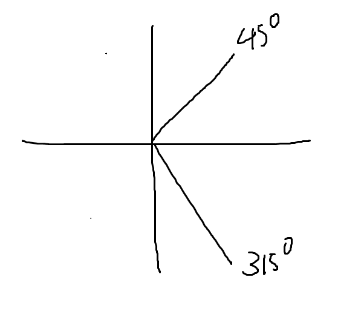

# 0.Unity引擎是什么

也就是专门做游戏的软件

# 1.引擎窗口

## 1.1 Scene和Hierarchy窗口

### 1.1.1 窗口布局layout


### 1.1.2 Hierarchy层级窗口


- 我们可以在Hierarchy窗口中创建或拖入各种游戏对象，比如模型、光源、图片、UI等内容。层级窗口中显示的就是一个场景中的所有对象。

- 我们目前只需要掌握创建自带的几种几何模型对象。

  

### 1.1.3 Scene场景窗口

- 我们可以在Scene窗口中查看所有游戏对象，设置所有游戏对象。

- 窗口上方工具条内容

  

- 关于Unity中的3D世界坐标轴

  

  - 红色为X轴正向

  - 绿色为Y轴正向

  - 蓝色为Z轴正向

    

  - 以屏幕为参照物

    - 垂直屏幕向内为Z正方向
    - 平行屏幕向右为X正方向
    - 平行屏幕向上为Y正方向

- 操作物体位置角度缩放

  

- 场景中的操作

  | 左键相关                                            | 右键相关                              | 中键相关                                       |
  | --------------------------------------------------- | ------------------------------------- | ---------------------------------------------- |
  | 长按Alt键+鼠标左键+移动鼠标：相对观察视口中心点旋转 | 鼠标右键按下+移动鼠标：旋转视口       | 滚动鼠标中间：相对屏幕中心点拉近拉远           |
  | 选中物体之后，按F键：居中显示物体                   | 鼠标右键按下+WASD：漫游场景           | 鼠标中间按下+移动鼠标：平移观察窗口            |
  |                                                     | 鼠标右键按下+WASD+Shift：快速漫游场景 | 长按ALT键+滚动鼠标中间：鼠标指哪就朝哪拉近拉远 |

## 1.2 Game窗口和Project窗口

### 1.2.1 Game窗口

- Game游戏窗口中显示的内容，是场景中摄像机拍摄范围内的游戏对象，是玩家通过屏幕能看到的东西。

  

### 1.2.2 Project工程窗口

- 窗口中显示的内容主要是Assets文件夹中的所有内容，主要用来管理资源脚本文件，所有游戏资源都会显示在该窗口中。

  

- Project工程窗口默认文件夹

  - Scenes：里面有一个默认空场景。
  - Packages：官方拓展包。

- 所支持的资源类型
  - 图片格式：jpg、png、tga
  - 模型格式：fbx、max、maya
  - 音效：wav、mp3、ogg
  - 文本：txt、json、bytes
  - 视频：mp4

## 1.3 Inspector和Console窗口

- Inspector检查窗口：查看场景中游戏对象关联的C#脚本信息。

  - 如果不选择场景中游戏对象或不进行任何相关设置，该界面不会显示任何信息。

    

  - 当选择场景中任意游戏对象时，该界面将显示和该游戏对象关联的C#脚本信息。

    

    - 红色部分：游戏对象的基本设置；
    - 蓝色部分：关联的C#脚本；
    - 绿色部分：脚本的公共成员变量。

    

- Console控制台窗口：用于查看调试信息的窗口，报错、警告、测试打印都可以显示在其中。

  - 默认未开启，可以在Window→General中开启，或者使用快捷键：Ctrl+Shift+C

    

    

- 总结：在Unity中做游戏就像在拍戏

  - Scene是舞台，所有演员都在舞台上；
  - Hierarchy是舞台演员名单；
  - Game是摄像机拍到的画面；
  - Inspector可以看到每个演员的剧本，它要扮演什么角色；
  - Project是后台，所有未上场的演员和没有使用的剧本都在这里；
  - Console是表演过程中的信息反馈。


# 2.生命周期函数（以下顺序也是执行顺序）

## 2.1 Awake()，只执行一次

- 当对象被创建时，自动调用Awake()，并且一个只调用一次。

- 目的是让一个对象刚被创建时，在Awake()中执行一些初始化的操作

  ```
  private void Awake()
  {
  	// 当我的脚本所在的类没有继承MonoBehaviour类的时候，使用Debug.Log("")打印信息
      Debug.Log("hello world!");
      
      // 当我的脚本所在的类继承MonoBehaviour类的时候，使用print("")打印信息
      print("hello world!");
  }
  ```

## 2.2 OnEnable()

- 如果想要当一个对象被激活时，进行一些逻辑处理，就可以写在OnEnable()函数中；

  ```
  private void OnEnable()
  {
      print("OnEnable函数被调用了");
  }
  ```

## 2.3 Start()，只执行一次

- 主要作用是用于初始化信息的，但是它相对Awake来说，要晚一点。因为它是在对象进行第一次帧更新之前才会执行的。

  ```
  void Start()
  {
  	print("Start函数被调用了");
  }
  ```

## 2.4 FixedUpdate()

- 根据设置的间隔时间，每间隔一段时间执行一次

- 间隔时间实在project setting中的Time里去设置的

  ```
  private void FixedUpdate()
  {
      print("FixedUpdate函数执行了！");
  }
  ```

## 2.5 Update()

- 根据设置的间隔时间，每间隔一段时间执行一次

- 主要用于处理游戏核心逻辑更新的函数

  ```
  void Update()
  {
  	print("Update函数被调用了");
  }
  ```

## 2.6 LateUpdate()

- 一般这个更新是用来处理摄像机位置更新相关内容的

- update和LateUpdate之间，unity进行了一些处理，处理我们动画相关的更新，所以LateUpdate()的执行是晚于update的

  ```
  private void LateUpdate()
  {
  	print("LateUpdate函数执行了！");
  }
  ```

## 2.7 OnDisable()

- 如果我们希望在一个对象失活时做一些处理，就可以在该函数中写逻辑

  ```
  private void OnDisable()
  {
  	print("OnDisable函数被调用了！");
  }
  ```

## 2.8 OnDestroy()，只执行一次

- 如果我们希望在一个对象被删除时做一些处理，就可以在该函数中写逻辑

  ```
  private void OnDestroy()
  {
  	print("OnDestroy函数被调用了！");
  }
  ```

## 2.9 总结

- 生命周期函数支持继承多态
- 这些生命周期函数，如果你不打算在其中写逻辑，那就不要在这写出该生命周期函数

- 如果对象是失活状态，该对象的所有生命周期函数都是无法执行的

# 3.Inspector窗口可编辑的变量

- 私有权限和保护权限的变量无法在Inspector窗口中显示

  ```
     private int num;			//不可以在Inspector窗口中显示
     protected bool gender;	//不可以在Inspector窗口中显示
  ```

- 加上强制序列化字段特性[SerializeField]就可以让私有权限和保护权限的变量在Inspector窗口中显示

  ```
      [SerializeField]
      private int num;		//可以在Inspector窗口中显示
  
      [SerializeField]
      protected bool gender;	//可以在Inspector窗口中显示
  ```

- 公共权限的变量可以在Inspector窗口中显示编辑

  ```
     public string name ;		//可以在Inspector窗口中显示
  ```

- 公共权限的变量也可以不让其显示编辑，需要在变量前加上特性[HideInInspector]

  ```
     [HideInInspector]
     public string name ;		//不可以在Inspector窗口中显示
  ```

- 字典和自定义类型（被class以及struct声明的）不能在Inspector窗口显示

  ```
  public class MyClass
  {
      public string no;
      public string name;
  }
  public struct MyStruct 
  {
      public string name; 
  
  }
  public enum MyEnum 
  {
      SPRING,
      SUMMER,
      AUTUMN,
      WINTER
  }
  
  public class Lesson2 : MonoBehaviour
  {
      public MyClass myClass; //不能在Inspector窗口显示
      public MyStruct myStruct;//不能在Inspector窗口显示
      public Dictionary<int, string> keyValuePairs = new Dictionary<int, string>();//不能在Inspector窗口显示
      public MyEnum myEnum;//可以在Inspector窗口显示
  }
  ```

- 让自定义类型（被class以及struct声明的）在Inspector窗口显示，需要加序列化特性[System.Serializable]

  ```
  [System.Serializable]
  public class MyClass
  {
      public string no;
      public string name;
  }
  [System.Serializable]
  public struct MyStruct 
  {
      public string name; 
  
  }
  public enum MyEnum 
  {
      SPRING,
      SUMMER,
      AUTUMN,
      WINTER
  }
  
  public class Lesson2 : MonoBehaviour
  {
      public MyClass myClass; //可以在Inspector窗口显示
      public MyStruct myStruct;//可以在Inspector窗口显示
      public Dictionary<int, string> keyValuePairs = new Dictionary<int, string>();//不能在Inspector窗口显示
      public MyEnum myEnum;//可以在Inspector窗口显示
  }
  ```

- 一些辅助特性

  - 分组说明特性[Header("分组说明")]

    ```
    public class Lesson2 : MonoBehaviour
    {
        [Header("基础属性")]
        public int no;
        public string name;
    
        [Header("战斗属性")]
        public string attack;
        public string defense;
    }
    ```

  - 间隔特性[Space()]，让两个字段上下出现间隔

    ```
    public class Lesson2 : MonoBehaviour
    {
        [Header("基础属性")]
        public int no;
        public string name;
    
        [Header("战斗属性")]
        public string attack;
        [Space()]
        public string defense;
    }
    ```

  - 修饰数值的滑条范围[Range(最小值, 最大值)]

    ```
    public class Lesson2 : MonoBehaviour
    {
        [Range(10, 20)]
        public int luck;
    }
    ```

  - 多行显示字符串，默认不写参数显示三行，写参数就是对应行，[Multiline(4)]

    ```
    public class Lesson2 : MonoBehaviour
    {
    	[Multiline(5)]
        public string addr;
    }
    ```

  - 滚动条显示字符串，默认不写参数就是超过三行显示滚动条

    - [TextArea(3, 4)]，表示最少显示3行，最多4行，超过4行就显示滚动条

      ```
      public class Lesson2 : MonoBehaviour
      {
      	[TextArea(3, 4)]
          public string addr;
      }
      ```

  - 为变量添加快捷方法[ContextMenuItem("显示按钮名", "方法名")]

    ```
    public class Lesson2 : MonoBehaviour
    {
      	[ContextMenuItem("重置钱", "Test")]
        public int money;
        public void Test() 
        {
            money = 99;
        }
    }  
    ```

  - 为方法添加特性能够在Inspector中执行，[ContextMenu("哈哈哈哈")]

    ```
    public class Lesson2 : MonoBehaviour
    {
      	[ContextMenu("测试方法")]
        public void TestMethod() 
        {
            print("测试方法");
        }
    }  
    
    ```

    

# 4.MonoBehaviour类中的重要内容

## 4.1 重要成员

### 4.1.1 获取本脚本所依附的GameObject

```
print(this.gameObject.name);
```

### 4.1.2 获取本脚本依附的GameObject的位置信息

```
 print(this.transform.position); // 游戏对象的位置信息
 print(this.transform.eulerAngles); // 游戏对象的角度信息
 print(this.transform.lossyScale); // 游戏对象的缩放大小信息
```

### 4.1.3 获取本脚本是否激活

```
this.enabled = false;
```

### 4.1.4 获取本脚本所依附的GameObject中所包含的其他GameObject成员的相关信息

```
public class NewBehaviourScript : MonoBehaviour
{
    public GameObject otherObject;
    void Start()
    {
        print("other name:" + otherObject.name);
        print("other position:" + otherObject.transform.position);
    }
}

```


## 4.2 重要方法

### 4.2.1 获取本脚本所依附的GameObject中的某个脚本

```
print(this.GetComponent<某个脚本名称>());
```


```
print(this.GetComponent<Lesson3_test>()); // 获取本脚本（Lesson3）
print(this.GetComponent<Lesson3_test>()); // 获取本脚本（Lesson3）所依附的Tank对象中的Lesson3_test
```

注意：只要你能得到场景中的对象或者对象依附的脚本，那你就可以获取到它的所有信息

### 4.2.2 得到自己挂载的多个脚本


方法1：数组

```
Lesson3_test[] lt = this.GetComponent<Lesson3_test>(true);
print(lt.Length);
```

方法2：List集合

```
List<Lesson3_test> list = new List<Lesson3_test>();
this.GetComponent(true, list);
print(list.Count);
```

### 4.2.3 得到子对象挂载的脚本（它默认也会找自己身上是否挂载该脚本）


函数是有一个参数的，不写的话默认是false，意思就是如果子对象失活，是不会去找这个对象上是否有某个脚本的；如果写true，即使失活也会找

```
print(this.GetComponentInChildren<Lesson3_test>(true));
```

### 4.2.4 得到子对象挂载的多个脚本


方法1：数组

```
Lesson3_test[] lt = this.GetComponentsInChildren<Lesson3_test>(true);
print(lt.Length);
```

方法2：List集合

```
List<Lesson3_test> list = new List<Lesson3_test>();
this.GetComponentsInChildren(true, list);
print(list.Count);
```

### 4.2.5 得到父对象挂载的脚本（它默认也会找自己身上是否挂载该脚本）


```
print(this.GetComponentInParent<Lesson3_test>());
```

### 4.2.5 得到父对象挂载的多个脚本

方法1：数组

```
Lesson3_test[] lt = this.GetComponentsInParent<Lesson3_test>();
print(lt.Length);
```

方法2：List集合

```
List<Lesson3_test> list = new List<Lesson3_test>();
this.GetComponentsInParent(true, list);
print(list.Count);
```

### 4.2.6 尝试获取脚本

提供了一个更加安全的，获取单个脚本的方法，如果得到了会返回true，然后再来进行逻辑处理即可。

方法1：

```
Lesson3_Test 13t;
if(this.TryGetComponent<Lesson3_Test>(out l3t)){
	// 逻辑处理
}
```

方法2：

```
if(this.GetComponent<脚本名>() != null){
	// 逻辑处理
}
```


## 4.2 一个继承了MonoBehavior的脚本中，this、this.gameObject、this.transform分别代表什么？

- this代表这个脚本对象
- this.gameObject代表这个脚本对象依附的GameObject游戏对象
- this.transform代表这个脚本对象依附的GameObject游戏对象的位置相关信息。

# 5.GameObject的成员变量

## 5.1 name

```
print(this.gameObject.name);
this.gameObject.name = "Lesson4_GameObject";
```

## 5.2 activeSelf(是否激活)

```
print("激活状态：" + this.gameObject.activeSelf);
```

## 5.3 isStatic(是否是静态)

```
 print("是否是静态：" + this.gameObject.isStatic);
```

## 5.4 layer(层级)

```
print("层级：" + this.gameObject.layer);
```

## 5.5 tag(标签)

```
print("标签：" + this.gameObject.tag);
```

## 5.6 transform(改变)

```
print("改变：" + this.gameObject.transform.position);
```

# 6.GameObject中的静态方法

## 6.1 CreatePrimitive(PrimitiveType.Cube);创建自带的几何体

```
GameObject obj = GameObject.CreatePrimitive(PrimitiveType.Cube);
obj.name = "lzk创建的几何体对象";
```

## 6.2 查找对象相关的方法

- 无法找到失活的对象，只能找到激活的对象
- 如果场景中存在多个满足条件的对象，我们无法准确找到是谁
- 得到某一个单个对象，目前有2种方式：
  - public从外部面板拖，进行关联
  - 通过API去找

### 6.2.1 Find("对象名称");通过对象名进行查找单个对象

- 它是从Hierarchy层级窗口中的对象中开始找的

- 这个查找效率比较低，因为它会在场景中的所有对象中去查找，没有找到，返回null。

```
      GameObject obj = GameObject.Find("陆忠凯");
      if (obj != null)
      {
          print(obj.name);
      }
      else 
      {
          print("没有找到相应对象！");
      }
```

### 6.2.2 FindWithTag("标签名称");通过标签名称来查找单个对象

```
        GameObject obj = GameObject.FindWithTag("Player");
        // 等同于 GameObject obj = GameObject.FindGameObjectWithTag("Player");
        if (obj != null)
        {
            print("按标签查找，找到了：" + obj.name);
        }
        else 
        {
            print("按标签查找，没找到！");
        }
```

### 6.2.3 通过标签名称来查找多个对象

- 找多个对象的API，只能通过tag去找多个，通过名字是没有找多个的方法的
- 通过tag找到多个对象，它也是只能找到激活对象，无法找到失活对象。

```
        GameObject[] objs = GameObject.FindGameObjectsWithTag("Player");
        print(objs.Length);
```

## 6.4 Instantiate(另一个对象)，根据已有的对象实例化对象（克隆对象）

- 它的作用是根据一个GameObject对象，创建出一个和它一模一样的对象

```
public GameObject myObj = null;
void Start()
{
    GameObject.Instantiate(myObj);
    //也可直接Instantiate(myobj);
}
```

- 如果继承了MonoBehavior，其实可以不用写GameObject.，一样可以使用。因为这个方法是unity里面的Object积累提供给我们的，所以可以直接用。

## 6.5 Destroy(对象or脚本)，删除对象（或脚本）

- 注意：这个Destroy方法，不会马上移除对象，只是给这个对象加了一个移除标识，一般情况下，它会在下一帧时把这个对象移除并从内存中移除。

- 如果没有特殊需求（也就是一定要马上移除一个对象），只建议使用上面的Destroy方法，因为该方法是异步的，会降低卡顿的几率。下面这个方法就是把对象从内存中移除了。

  ```
  GameObject.DestroyImmediate(myObj);
  ```

### 6.5.1 不延时删除

```
 GameObject.Destroy(myObj); //删除对象
 GameObject.Destroy(this); //删除脚本
```

### 6.5.2 延时几秒再删除

```
GameObject.Destroy(myObj, 5); // 延时删除对象
GameObject.Destroy(myObj, 5); // 延时删除脚本
```

## 6.6 过场景不移除某些对象，DontDestroyOnLoad(某些对象)

```
GameObject.DontDestroyOnLoad(this.gameObject); // 过场景而不移除这个脚本所依附的那些对象
```

# 7.GameObject中的成员方法

## 7.1 创建空物体

```
GameObject obj1 = new GameObject(); // 创建默认空物体
GameObject obj2 = new GameObject("陆忠凯创建的空物体"); // 创建空物体，并给它命名
GameObject obj3 = new GameObject("带脚本的空物体", typeof(Lesson1), typeof(Lesson2)); // 创建带脚本的空物体，所带的脚本为Lesson1和Lesson2
```

## 7.2 为对象动态添加脚本

- 如果想要动态的添加继承自MonoBehavior的脚本在某一个对象上，直接使用GameObject提供的实例方法即可

```
        GameObject obj4 = new GameObject();
        Lesson2 lesson4 = obj4.AddComponent<Lesson2>();
```

- 通过返回值，可以得到加入的脚本信息，从而进行一些处理

## 7.3 得到脚本的成员方法和继承MonoBehaviour的类得到脚本的方法一模一样。


## 7.4 标签比较

下面两种比较的方法是一样的

```
if (this.gameObject.CompareTag("Player")) 
{
	print("对象的标签是Player");
}

if (this.gameObject.tag == "Player") 
{
	print("对象的标签是Player");
}
```

## 7.5 设置激活失活

- false：失活；true：激活

```
GameObject obj2 = new GameObject("陆忠凯创建的空物体"); // 创建空物体，并给它命名
GameObject obj3 = new GameObject("带脚本的空物体", typeof(Lesson1), typeof(Lesson2));
obj2.SetActive(false);
obj3.SetActive(false);
```

# 8.GameObject相关的练习

8.1 一个空物体上挂了一个脚本，游戏运行时该脚本可以实例化出之前的坦克预设体。一般情况下，我们实例化出的对象，都是克隆的预设提，但是也可以拖场景上的对象进行克隆

```
    void Start()
    {
        //GameObject.Instantiate(obj);
        GameObject tank = GameObject.Find("Tank");
        if (tank != null) 
        {
            GameObject obj = GameObject.Instantiate(tank);
        }
    }
```

8.2 一个脚本A，一个脚本B，脚本A挂在A对象上，脚本B挂在B对象上。实现A脚本的Start函数中将B对象上的B脚本失活（用GameObject相关知识做）；

方法1：A对象关联B对象

方法2：查找，查找B对象，获取B对象的脚本，从而设置脚本失活

```
    void Start()
    {
        //b.GetComponent<B>().enabled = false;

        B b = GameObject.Find("B").GetComponent<B>();
        if (b != null) 
        {
            b.enabled = false;
        }
        

    }
```

8.3 一个对象A和一个对象B，在A上挂一个脚本，通过这个脚本可以让B对象改名，失活，延迟删除，立即删除。可以在Inspector窗口进行设置，让B实现不同的效果（提示：GameObject、枚举）

```
    public Do_Type type = Do_Type.RENAME;
    // Start is called before the first frame update
    void Start()
    {
        GameObject obj = GameObject.Find("ObjectB");
        if (obj != null) 
        {
            switch (type) 
            {
                case Do_Type.RENAME:
                    obj.name = "RenameB"; break;
                case Do_Type.NOT_ACTIVE:
                    obj.SetActive(false); break;
                case Do_Type.DELAY_DELETE:
                    GameObject.Destroy(obj, 5); break;
                case Do_Type.IMMEDIATE_DELETE: 
                    GameObject.DestroyImmediate(obj); break;
            }
        }
    }
```

# 9.Time

Time相关内容，主要用于游戏中参与位移、计时、时间暂停等

## 9.1时间缩放比例

- 时间停止

  ```
  Time.timeScale = 0;
  ```

- 时间恢复正常

  ```
  Time.timeScale = 1;
  ```

- 时间设置为两倍速

  ```
  Time.timeScale = 2;
  ```

## 9.2 帧间隔时间

帧间隔时间指的是在显示动画或视频时，从一帧画面显示完到下一帧画面开始显示所经过的时间。

在视频和游戏中，帧间隔时间一般以毫秒（ms）为单位，常用的显示频率是每秒显示30帧（FPS）或者60帧（FPS），这意味着帧间隔时间分别约为33毫秒和16毫秒。简单来说，帧间隔时间越短，画面就越流畅。

- 帧间隔时间，表示最近的一帧用了多长时间（秒）

- 帧间隔时间，主要是用来计算位移。
- 路程 = 时间 * 速度；
- 根据需求，选择参与计算的间隔时间；
- 如果希望游戏暂停时就不动的，那就使用deltaTime
- 如果希望不受暂停影响，那就使用unscaledDeltaTime

```
void Update()
{
    Time.timeScale = 0;
    print("受scale影响的帧时间间隔：" + Time.deltaTime);
    print("不受scale影响的帧时间间隔：" + Time.unscaledDeltaTime);
}
```


## 9.3 游戏开始到现在的时间

它主要用来计时 单机游戏中计时

- 受scale影响

  ```
  print("游戏开始到现在的时间:" + Time.time);
  ```

- 不受scale影响

  ```
  print("不受scale影响的游戏开始到现在的时间:" + Time.unscaledTime);
  ```

## 9.4 物理帧间隔时间，FixedUpdate

```
private void FixedUpdate()
{
    #region 知识点四 物理帧间隔时间 FixedUpdate
    //受scale影响
    //print(Time.fixedDeltaTime);
    //不受scale影响
    //print(Time.fixedUnscaledDeltaTime);
    #endregion
}
```

## 9.5 帧数

```
void Update()
{
    #region 知识点五 帧数
    //从开始到现在游戏跑了多少帧(次循环)
    print(Time.frameCount);
    #endregion
}
```

# 10.Vector3基础和位置相关

## 10.1 Vector3基础

Vector3主要是用来表示三维坐标系中的一个点或者一个向量。

- 声明

  ```
  Vector3 v = new Vector3();
  v.x = 10;
  v.y = 10;
  v.z = 10
  
  //只传xy，默认z是0
  Vector3 v2 = new Vector3(10, 10);
  
  //一步到位
  Vector3 v3 = new Vector3(10, 10, 10);
  ```

- Vector3的基本计算+-*/

  ```
  Vector3 v1 = new Vector3(1, 1, 1);
  Vector3 v2 = new Vector3(2, 2, 2);
  Vector3 v3 = new Vector3(3, 3, 3);
  print(v1 + v2);
  print(v1 - v2);
  print(v1 * 10);
  print(v2 / 10);
  ```

- 常用的坐标

  ```
  print(Vector3.zero); // 源点
  print(Vector3.up); // 上移动
  print(Vector3.down); // 下移动
  print(Vector3.left); // 左移动
  print(Vector3.right); // 右移动
  print(Vector3.forward); // 前进
  print(Vector3.back); // 后退
  ```

- 计算两个点之间的距离的方法

  ```
  Vector3 v1 = new Vector3(1, 1, 1);
  Vector3 v2 = new Vector3(2, 2, 2);
  print(Vector3.Distance(v1, v2));
  ```

## 10.2 位置

- 相对于世界坐标系，this.gameObject.transform

  - 通过position得到的位置，是相对于世界坐标系的原点的位置；
  - 可能和面板上显示的是不一样的；
  - 因为如果对象有父子关系，并且父对象位置不在原点，那么和面板上就是不一样的。

  ```
  print(this.transform.position);
  ```

- 相对于父对象的坐标系

  ```
  print(this.transform.localPosition);
  ```

- 注意：

  - 这两个坐标系对我们来说很重要，如果你想以面板坐标为准来进行位置设置，那一定是通过localPosition来进行设置的。

  - 这两个坐标系，可能出现一样的情况：

    - 父对象的坐标，就是世界坐标系的原点(0,0,0)。
    - 对象没有父对象，即两个对象处于平级。

  - 位置的赋值不能直接改变x,y,z（不能单独改x,y,z某一个值），只能整体改变。

    ```
    // 错误的写法
    this.transform.position.x = 10;
    
    // 正确写法
    this.transform.position = new Vector3(10, 10, 10);
    this.transform.localPosition = Vector3.up * 10;
    ```

  - 如果只想改变xyz其中一个值，xyz中剩下两个值要保持原来的值不变，依然是整体赋值

    - 只修改x的整体直接赋值

      ```
      this.transform.position = new Vector3(19, this.transform.position.y, this.transform.position.z);
      ```

    - 先把x取出来，再赋值

      ```
      Vector3 vPos = this.transform.localPosition;
      vPos.x = 10;
      this.transform.localPosition = vPos;
      ```

      

- 如果想得到对象当前的一个朝向，那么就是通过transform.出来的

  ```
  // 对象当前的面朝向
  this.transform.forward
  // 对象当前的头顶朝向
  this.transform.up
  // 对象当前的右手边
  this.transform.right
  ```

## 10.3 位移

理解坐标系下的位移计算公式：路程 = 方向 * 速度 * 时间。

- 方式1：自己计算

  - 想要变化的，就是position
  - 用当前的位置 + 我要移动多长距离，得出最终所在的位置

  ```
  void Update()
  {
  	this.transform.position += this.transform.forward * 1 * Time.deltaTime;
  }
  ```

  - 上段代码中，因为我用的是this.transform.forward，所以它始终会朝向相对于自己的面朝向去动（即上、下、左、右、前、后，这六个面，我把方向设置为哪个面，游戏对象就朝着哪个面移动）。

  ```
  void Update()
  {
  	this.transform.position += Vector3.forward * 1 * Time.deltaTime;
  }
  ```

  - 上段代码中，因为我用的是Vector3.forward，所以它始终会朝向相对于世界坐标系的方向去动（可以把世界坐标系想象成一个巨大的立方体，它也有上、下、左、右、前、后，这六个面）

  - 方向非常重要，因为它决定了你的前进方向。

- 方式2：API，this.transform.Translate(参数1，[参数2]);

  - 参数

    - 参数1：表示位移多少，路程 = 方向 * 速度 * 时间
    - 参数2：表示相对于哪个坐标系进行位移，默认该参数是相对于自己的坐标系的。

  - 相对于世界坐标系的Z轴动，始终是朝世界坐标系的z轴正方向移动。

    ```
    this.transform.Translate(Vector3.forward * 1 * Time.deltaTime, Space.World)
    ```

  - 相对于世界坐标的自己的面朝向去动，始终朝自己的面朝向移动

    ```
    this.transform.Translate(Vector3.forward * 1 * Time.deltaTime, Space.World)
    ```

  - 相对于自己的坐标系下的自己的面朝向向量移动（一定不会这样让物体移动）××××××

    ```
  
    ```
  
  - 相对于自己的坐标系下的z轴正方向移动，始终朝自己的面朝向移动。

    ```
    this.transform.Translate(Vector3.forward * 1 * Time.deltaTime, Space.Self)
    ```
  
  

## 10.4 角度和旋转

### 10.4.1 角度相关

- 相对于世界坐标角度

  ```
  this.transform.eulerAngles
  ```

- 相对父对象角度

  ```
  this.transform.localEulerAngles
  ```

- 注意：

  - 设置角度和设置位置一样，不能单独设置xyz，要一起设置。

  - 如果我们希望改变的角度是面板上显示的内容，那一定是改变相对于父对象的角度。

    ```
    this.transform.localEulerAngles = new Vector3(10, 10, 10);
    ```

### 10.4.2 角度相关

- 自己计算（省略不讲，和位置一样，不停的改变角度即可）

- API计算，主要功能是让对象自转动

  - Rotate重载1

    - 参数1：相当于是旋转的角度，每一帧

    - 参数2：默认不填的话就是相对于自己的坐标系进行的旋转

    - 例1：相对于自己的坐标系进行的旋转

      ```
      this.transform.Rotate(new Vector3(0, 10, 0) * Time.deltaTime);
      // x = 0,  y = 10, z = 0,  会沿着y轴转，每一帧转的角度为10，角度越大，转的越快
      // x = 10, y = 0,  z = 0,  会沿着x轴转，每一帧转的角度为10，角度越大，转的越快
      // x = 0,  y = 0,  z = 10, 会沿着z轴转，每一帧转的角度为10，角度越大，转的越快
      ```

    - 例2：相对于世界坐标系进行旋转

      ```
      this.transform.Rotate(new Vector3(0, 10, 0) * Time.deltaTime, Space.World);
      ```

  - Rotate重载2

    - 参数1：相对于哪个轴，进行转动

    - 参数2：是转动的角度是多少

    - 参数3：默认不填，就是相对于自己的坐标系进行旋转；如果填，可以填写相对于世界坐标系进行旋转。

    - 例1：相对于自己的坐标系进行的旋转

      ```
      this.transform.Rotate(Vector3.right, 10 * Time.deltaTime);
      ```

    - 例2：相对于世界坐标系进行的旋转

      ```
      this.transform.Rotate(Vector3.right, 10 * Time.deltaTime， Space.World);
      ```

  - 相对于某一个点转

    - 参数1：相对于哪一个点转，转圆圈

    - 参数2：相对于哪一个点的哪一个轴转圆圈

    - 参数3：转的度数，旋转的速度 * 时间

      ```
      this.transform.RotateAround(Vector3.zero, Vector3.up, 100 * Time.deltaTime);
      ```

      


## 练习

1.使用你之前创建的坦克预设体，在坦克下面加一个底座（用自带几何体即可）让其可以原地旋转，类似一个展览台

2.在第一题的基础上，让坦克的炮台可以自动左右来回旋转，炮管可以自动上下抬起



```
	public float rotateSpeed = 10;
    public float headRotateSpeed = 10;
    public float pkPosRotateSpeed = 10;

    // 头部位置信息
    public Transform head;
    public Transform pkPos;
   void Update()
   {
       /*******************练习题1：代码*******************/
       this.transform.Rotate(Vector3.up, rotateSpeed * Time.deltaTime);


       /*******************练习题2：代码*******************/
       // 炮台左右来回旋转
       head.Rotate(Vector3.up, headRotateSpeed * Time.deltaTime);
       // 通过head.localEulerAngles得到的角度，不会出现负数的情况
       // 虽然界面上显示的是负数，但是通过代码获取的，始终只能得到0~360之间的数字

       //只能是0~360,那就只能特殊判断了
       if (!(head.localEulerAngles.y >= 315 && head.localEulerAngles.y <= 360) && head.localEulerAngles.y >= 45 && headRotateSpeed > 0)
       {
           headRotateSpeed = -headRotateSpeed;
       }
       else if(!(head.localEulerAngles.y >= 0 && head.localEulerAngles.y <= 45) && head.localEulerAngles.y <= 315 && headRotateSpeed < 0)
       {
           headRotateSpeed = -headRotateSpeed;
       }


       pkPos.Rotate(Vector3.right, pkPosRotateSpeed * Time.deltaTime);
       if (!(pkPos.localEulerAngles.x >= 350 && pkPos.localEulerAngles.x <= 360) && pkPos.localEulerAngles.x >= 10 && pkPosRotateSpeed > 0)
       {
           pkPosRotateSpeed = -pkPosRotateSpeed;
       }
       else if (!(pkPos.localEulerAngles.x >= 0 && pkPos.localEulerAngles.x <= 10) && pkPos.localEulerAngles.x <= 350 && pkPosRotateSpeed < 0)
       {
           pkPosRotateSpeed = -pkPosRotateSpeed;
       }
   }
```

3.请用3个球体，模拟太阳、地球、月亮之间的旋转移动

## 10.5 缩放和看向

### 10.5.1 缩放

- 相对于世界坐标系

  ```
  this.transform.lossyScale
  ```

- 相对于本地坐标系

  ```
  this.transform.localScale
  ```

- 注意

  - 同样，缩放不能单独改x、y、z，只能整体改；

  - 相对于世界坐标系得缩放大小只能获取，不能修改

  - 我们一般要修改缩放大小，都是改得相对于父对象得缩放大小。

    ```
    this.transform.localScale = new Vector3(3, 3, 3);
    ```

  - Unity没有提供关于缩放得API，之前得旋转，位移，都提供了对应得API，但是缩放并没有提供。如果想要让缩放发生变化，只能自己写相应得缩放算法。

### 10.5.2 看向

- 让一个对象的面可以一直看向某一个点

  ```
  this.transform.LookAt(Vector3.zero);
  ```

- 让一个对象的面可以一直看向某个对象，看向一个对象，就传入一个对象的Transform信息

  ```
  Transform lookAtObj = null; // unity中拖一个对象过来关联这个lookAtObj
  this.transform.LookAt(lookAtObj);
  ```

## 10.6 父子关系

### 10.6.1 获取和设置父对象

- 获取父对象

  ```
  this.transform.parent.name;
  ```

- 设置父对象——断绝父子关系

  ```
  this.transform.parent.name = null;
  ```

- 设置父对象——认爸爸

  ```
  this.transform.parent = GameObject.Find("Father2").transform;
  ```

- 通过API来进行父子关系的设置

  - 设置父对象——断绝父子关系

    ```
    this.transform.SetParent(null);
    ```

  - 设置父对象——认爸爸

    ```
    this.transform.SetParent(GameObject.Fine("Father2").transform);
    ```

  - 参数

    - 参数1：我的父亲

    - 参数2：是否保留世界坐标的位置、角度、缩放信息

      - true：会保留世界坐标下的状态和父对象进行计算，得到本地坐标系的信息
      - false：不会保留世界坐标下的状态，会直接把世界坐标系下的位置角度缩放信息直接赋值到本地坐标系下

      ```
      this.transform.setParent(GameObject.Find("Father3").transform, false);
      ```

### 10.6.2 抛妻弃子

就是和自己的所有儿子断绝关系，没有父子关系了。

```
this.transform.DetachChildren();
```

### 10.6.3 获取子对象

- 按名字查找儿子

  - 找到儿子的transform信息。Find()方法是能够找到失活对象的，GameObject.Find()相关的查找是不能找到失活对象的。

    ```
    this.transform.Find("Cube(1)").name;
    ```

  - 该方法只能找到自己的儿子，不能找到自己的孙子！

    ```
    this.transform.Find("GrandSon").name;
    ```

  - 虽然它的效率比GameObject.Find要搞一点，但是前提是你必须知道父亲是谁，才能找。

- 遍历儿子

  - 失活的儿子也会算数量，但是找不到孙子，所以孙子不会算数量

    ```
    this.transform.childCount // 获取儿子数量
    ```

  - 通过索引号去得到自己对应的儿子，如果编号超出了儿子数量的范围，会直接报错的。返回值是transform，可以得到对应儿子的位置相关信息。

    ```
    this.transform.GetChild(index);
    ```

    ```
    for (int i = 0; i < this.transform.childCount; i++) 
    {
        print("孩子名字：" + this.transform.GetChild(i).name);
    }
    ```

### 10.6.4 儿子的操作

- 判断自己的爸爸是谁

  ```
  // 一个对象，判断自己是不是另一个对象的儿子
  if(son.IsChildOf(this.transform))
  {
  	print("是我的儿子");
  }
  ```

- 得到自己作为儿子的编号

  ```
  print(son.GetSiblingIndex());
  ```

- 把自己设置为第一个儿子

  ```
  son.SetAsFirstSibling();
  ```

- 把自己设置为第一个儿子

  ```
  son.SetAsLastSibling();
  ```

- 把自己设置为指定个儿子

  ```
  // 就算你填的数量，超出了范围（负数或者更大的数），也不会报错，而且会直接设置成最后一个编号
  son.SetSiblingIndex(1);
  ```

  

## 10.7 坐标转换

### 10.7.1 世界坐标转本地坐标

- 世界坐标系的点转换为相对本地坐标系的点

  - 世界坐标系转本地坐标系可以帮助我们大概判断一个相对位置

  ```
  print(Vector3.forward);//打印世界坐标系的向前的坐标
  print("转换后的点：" + this.transform.InverseTransformPoint(Vector3.forward));//把世界坐标系的点转换为本地坐标系的点
  
  //注意：坐标受到缩放大小影响
  ```

- 世界坐标系的方向转换为相对本地坐标系的方向

  - 不受缩放影响

    ```
    print("转换后的方向" + this.transform.InverseTransformDirection(Vector3.forward));
    ```

    

  - 受缩放影响

    ```
    print("转换后的方向" + this.transform.InverseTransformVector(Vector3.forward));
    ```

### 10.7.2 本地坐标转世界坐标

- 本地坐标系的点转为相对世界坐标系的点

  ```
  print("本地转世界点：" + this.transform.TransformPoint(Vector3.forward));
  ```

  

- 本地坐标系的方向转为相对世界坐标系的方向

  - 不受缩放影响

    ```
    print("本地转世界方向：" + this.transform.TransformDirection(Vector3.forward));
    ```

  - 受缩放影响

    ```
    print("本地转世界方向：" + this.transform.TransformVector(Vector3.forward));
    ```


### 练习

1.一个物体A，不管它在什么位置，写一个方法，只要执行这个方法就可以在它的左前方（-1,0,1）处创建一个空物体

```
void CreateObject() 
{
    GameObject obj = new GameObject("新物体！");
    obj.transform.position = this.transform.TransformPoint(-1, 0, 1);
}
```

2.一个物体A，不管它在什么位置，写一个方法，只要执行这个方法就可以在它的前方创建出3个球体，位置分别是（0,0,1）,（0,0,2）,（0,0,3）

```
void CreateNewObj() 
{
    for (int i = 1; i <= 3; i++) 
    {
        GameObject obj = GameObject.CreatePrimitive(PrimitiveType.Sphere);
        obj.transform.position = this.transform.TransformPoint(Vector3.forward * i);  
    }
}
```

# 11.Input鼠标键盘输入

## 11.1 鼠标在屏幕的位置

屏幕坐标的原点，是在屏幕左下角，往右是x轴正方向，往上是y轴正方向。

```
print(Input.mousePosition);
```

返回值是Vector3，但是只有x和y有值，z一直是0，是因为屏幕本来就是2D的，不存在3D。

## 11.2 检测鼠标输入

0左键、1右键、2中键

### 11.2.1 鼠标按下一瞬间进入

只有按下的这一瞬间进入一次。

```
if(Input.GetMouseButtonDown(0))
{
	print("鼠标左键按下了！");
}
```

### 11.2.2 鼠标抬起一瞬间进入

```
if(Input.GetMouseButtonUp(0))
{
	print("鼠标左键按下了！");
}
```

### 11.2.3 鼠标长按按下抬起都会进入

当按住按键不放时，会一直进入这个判断

```
if(Input.GetMouseButton(1))
{
	print("右键按下！");
}
```

### 11.2.4 鼠标中键滚动

- 返回值：
  - y = -1 表示往下滚动
  - y = 0  表示没有滚动
  - y = 1  表示往上滚动
  - 他的返回值是Vector，我们鼠标中键滚动，会改变其中的y值。

```
print(Input.mouseScrollDelta);
```

## 11.3 检测键盘输入

### 11.3.1 键盘按下

```
if(Input.GetKeyDown(KeyCode.W))
{
	print("w键按下");
}
```

### 11.3.2 传入字符串的重载

这里传入的字符串，不能是大写的，不然会报错

只能传入小写字符串

```
if(Input.GetKeyDown("q"))
{
	print("q键被按下了！");
}
```

### 11.3.3 键盘抬起

```
if(Input.GetKeyUp(KeyCode.w))
{
	print("w键抬起");
}
```


### 11.3.4 键盘长按

```
if(Input.GetKey(KeyCode.W))
{
	print("W键长按");
}
```


## 11.4 检测默认轴输入

我们学习鼠标，键盘输入主要是用来控制玩家，比如旋转，位移等等。所以unity提供了更方便的方法，来帮助我们控制对象的位移和旋转。

- 键盘AD按下时，返回-1到1之间的变换

  相当于得到这个值就是我们的左右方向，我们可以通过它来控制对象左右移动或者左右旋转；

  ```
  print(Input.GetAxis("Horizontal"));
  ```

- 键盘SW按下时，返回-1到1之间的变换

  得到的这个值，就是我们的上下方向，我们可以通过它来控制对象上下移动，或者上下旋转。

  ```
  print(Input.GetAxis("Vertical"));
  ```

- 鼠标横向移动时，返回-1到1左右之间的变换

  ```
  print(Input.GetAxis("Mouse X"));
  ```

- 鼠标竖向移动时，返回-1到1下上之间的变换

  ```
  print(Input.GetAxis("Mouse Y"));
  ```

  

## 11.5 其他

### 11.5.1 是否有任意键或鼠标长按

```
if(Input.anyKey)
{
	print("有一个键长按");
}
```


### 11.5.2 是否有任意键或鼠标按下

```
if(Input.anyKeyDown)
{
	print("有一个键按下");
	print(Input.inputString);
}
```

## 练习

1.使用之前的坦克预设体，用WASD键控制坦克的前景后退，左右转向

- 知识点：

  - Transform当中的位移、自转

  - 键盘输入

    ```
    Input.GetAxis("Horizontal") //水平方向，-1到1之间的值，0就是没有按下
    Input.GetAxis("Vertical") //竖直方向，-1到1之间的值，0就是没有按下
    ```

- ws键控制位移，公式：

  - 前进方向 * 速度 * 时间 * 当前是否移动（-1~1相当于正向还是反向的，不按就不动 0）

    ```
    this.transform.Translate(Vector3.forward * moveSpeed * Time.daltaTime * Input.GetAxis("Vertical"));
    ```

- ad键控制左右转向，公式：

  - 转动的轴 * 速度 * 时间 * 当前是否移动（-1~1相当于正向还是反向的，不按就不动 0）

    ```
    this.transform.Rotate(Vector3.up * rotateSpeed * Time.daltaTime * Input.GetAxis("Horizontal"));
    ```

2.在上一题的基础上，鼠标左右移动控制炮台的转向

- 知识点：鼠标输入

  ```
  Input.GetAxis("Mouse X");
  ```

  ```
  head.Rotate(Vector3.up * headTotateSpeed * Time.deltaTime * Input.GetAxis("Mouse x"));
  ```

  

# 12.屏幕相关

## 12.1 当前屏幕分辨率（显示器的分辨率）

```
Resolution r = Screen.currentResolution;
print("当前屏幕分辨率的宽：" + r.with);
print("当前屏幕分辨率的高：" + r.height);
```

## 12.2 屏幕窗口当前宽高（游戏窗口宽高）

```
print(Screen.width);
print(Screen.height);
```

## 12.3 屏幕休眠模式

```
Screen.sleepTimeout = SleepTimeout.NeverSleep;
```

## 12.4 设置分辨率

一般移动设备不使用

```
Screen.SetResolution(1920, 1080, false); // 第三个参数为true表示全屏，false表示非全屏

```

## 练习

1.在输入习题的基础上，鼠标滚轮控制控制炮管的抬起放下

```
Input.mouseScrollDelta.y
```

```
pkPos.Rotate(Vector3.right * pkRotateSpeed * Time.deltaTime * Input.mouseScrollDelta.y);
```

2.在上一题的基础上，加入长按鼠标右键移动鼠标可以让摄像机围着坦克旋转，改变观察坦克的视角

- 知识点：
  - 绕着某一个点的某一个轴旋转
  - 鼠标右键按下

```
 void Update()
 {
     this.transform.LookAt(target);
     if (Input.GetMouseButton(1)) 
     {
         this.transform.RotateAround(target.position, Vector3.up, roundSpeed * Time.deltaTime * Input.GetAxis("Mouse X"));
     }
 }
```


# 13.Camera代码相关

## 13.1 获取摄像机

### 13.1.1 主摄像机的获取

```
string name = Camera.main.name;
print(name);
```

注意：如果想通过这种方式快速获取摄像机，那么场景上必须有一个tag为MainCamera的摄像机；

### 13.1.2 获取所有摄像机

- 获取所有摄像机

  ```
  Camera[] allCamera = Camera.allCameras;
  print(allCamera.Length);
  ```

- 获取所有摄像机的数量、

  ```
  print("摄像机的数量：" + Camera.allCamerasCount);
  ```

## 13.2 摄像机的重要参数

### 13.2.1 界面上的参数，都可以在Camera中获取到

比如，下面这句代码，就是得到主摄像机对象上的深度，进行设置。

```
Camera.main.depth = 10;
```

### 13.2.2 世界坐标转屏幕坐标

转换过后，x和y对应的就是屏幕坐标，z对应的是这个3d物体离我们的摄像机有多远；

我们会用这个来做的最多的功能就是头顶血条相关的功能；

```
Vector3 v = Camera.main.WorldToScreenPoint(this.transform.position);
print(v);
```

### 13.2.3 屏幕坐标转世界坐标

之所以改变Z轴，是因为如果不改，Z轴默认为0；

转换过去的世界坐标系的点，永远都是一个点，可以理解为视口相交的焦点；

如果改变了Z，那么转换过去的世界坐标的点，就是相对于摄像机前方多少的单位的横截面上的世界坐标；

```
Vector3 v = Input.mousePosition;
v.z = 5;
obj.position = Camera.main.ScreenToWorldPoint(v);
```

# 14.物理系统碰撞检测

## 14.1 物理系统碰撞检测响应函数

和生命周期函数差不多。

函数中的关键参数：Collision collision

```
collision.collider：碰撞到的对象碰撞器的信息

collision.gameObject：碰撞对象的依附对象（GameObject）

collision.transform：碰撞对象的依附对象的位置信息

collision.contactCount：碰撞点数相关

ContacPoint[] pos = collision.contacts; 接触点，具体的坐标
```


- 碰撞触发接触时会自动执行这个函数

  ```
  private void OnCollisionEnter(Collision collision)
  {
  	print(this.name + "被" + collision.gameObject.name + "撞到了！");
  }
  ```

  

- 碰撞结束分离时会自动执行的函数

  ```
  private void OnCollisionExit(Collision collision)
  {
  	print(this.name + "与" + collision.gameObject.name + "分离了！");
  }
  
  ```

  

- 两个物体相互接触摩擦时，会不停的调用该函数

  ```
  private void OnCollisionStay(Collision collision)
  {
  	print(this.name + "与" + collision.gameObject.name + "正在相互摩擦！");
  }
  ```

  

## 14.2 触发器检测响应函数

- 触发开始的函数，当第一次接触时，会自动调用

  ```
  private void OnTriggerEnter(Collider other)
  {
  	print(this.name + "与" + other.name + "第一次接触了！");
  }
  ```

  

- 触发结束的函数，当水乳相融的状态结束时，会调用一次

  ```
  private void OnTriggerEnter(Collider other)
  {
  	print(this.name + "与" + other.name + "分离了！");
  }
  ```

  

- 当两个对象水乳相融的时候，会不停的调用

  ```
  private void OnTriggerEnter(Collider other)
  {
  	print(this.name + "与" + other.name + "正在水乳相融！");
  }
  ```

  

## 14.3 要明确什么时候会响应函数

1.只要挂载的对象能和别的物体产生碰撞或者触发那么对应的这6个函数就能够被响应

2.6个函数不是说我都得写我们一般是根据需求来进行选择书写

3.如果是一个异形物体，刚体在父对象上，如果你想通过子对象上挂脚本检测碰撞是不行的必须挂载到这个刚体父对象上

4.要明确物理碰撞和触发器响应的区别

## 14.4 碰撞和触发器函数都可以写成虚函数在子类去重写逻辑

一般会把想要重写的 碰撞和触发函数写成保护类型的没有必要写成public因为不会自己手动调用都是Unity通过反射帮助我们自动调用的

## 14.5 碰撞检测之刚体加力

### 14.5.1 刚体自带添加力的方法

给刚体加力的目标就是让其有一个速度，朝向某一个方向移动；

```c#
Rigidbody rigidBody = null;
```

- 首先应该获取刚体组件

  ```
  rigidBody = this.GetComponent<Rigidbody>();
  ```

- 添加力

  - 相对世界坐标

    - 世界坐标系z轴正方向加了一个力，加力过后，对象是否停止移动，是由阻力决定的

    - 如果阻力为0，那给了一个力过后，始终是不会停止运动；

      ```
      rigidBody.AddForce(Vector3.forward * 10);
      ```

    - 如果想要在世界坐标系方法中，让对象相对于自己的面朝向移动

      ```
      rigidBody.AddForce(this.transform.forward * 10);
      ```

    - 如果你希望即使有阻力，也希望对象一直动，那你就一直“推”就行了

      ```
      void Update()
      {
      	rigidBody.AddForce(Vector3.forward * 10);
      }
      ```

      

  - 相对本地坐标

    ```
    rigidBody.AddRelativeForce(Vector3.forward * 10);
    ```

- 添加扭矩力，让其旋转

  - 相对世界坐标

    ```
    rigidBody.AddTorque(Vector3.up * 10);
    ```

  - 相对本地坐标

    ```
    rigidBody.AddRelativeTorque(Vector3.up * 10);
    ```

- 直接改变速度

  - 这个速度方向是相对于世界坐标系的，如果要直接通过改变速度来让其移动，一定要注意这一点；

    ```
    rigidBody.velocity = Vector3.forward * 5;
    ```

- 模拟爆炸效果

  - 模拟爆炸的力，一定是所有希望产生爆炸效果影响的对象，都需要得到他们的刚体，来执行这个方法，才能都有效果；

    ```
    rigidBody.AddExplosionForce(100, Vector3.zero, 10);
    ```

### 14.5.2 力的几种模式（物理相关的游戏使用）

### 14.5.3 力场脚本

补充：刚体的休眠

```
void Update()
{
	if(rigidBody.IsSleeping())
	{
		// 就唤醒它
		rigidBody.WakeUp();
	}
}
```

# 15.代码控制音频源

## 15.1 代码控制播放停止

```
public class Lesson20 : MonoBehaviour
{
    // Start is called before the first frame update
    AudioSource audioSource;
    void Start()
    {
        audioSource = this.GetComponent<AudioSource>();
       
    }

    // Update is called once per frame
    void Update()
    {
        if (Input.GetKeyDown(KeyCode.P))
        {
            // 按P键，播放音效
            audioSource.Play();
        }
        if (Input.GetKeyDown(KeyCode.S))
        {
            // 按S键，停止播放音效
            audioSource.Stop();
        }
        if (Input.GetKeyDown(KeyCode.Space))
        {
            // 按空格键，暂停播放音效
            audioSource.Pause();
        }
        if (Input.GetKeyDown(KeyCode.X)) 
        {
            // 按X键，继续播放刚才暂停的音效
            audioSource.UnPause();
        }
    }
}

```


## 15.2 如何检测音效播放完毕

如果你希望某一个音效播放完毕后，想要做什么事情，那就可以再Update生命周期函数中，不停的去检测它的该属性，如果是false就代表播放完毕了。

```
void Update()
{
    if (audioSource.isPlaying)
    {
    	print("播放中");
    }
    else 
    {
    	print("播放结束");
    }
}
```

## 15.3 如何动态控制音效播放

- 直接再要播放音效的对象上挂载脚本，控制播放

  - 也就是15.1讲解的内容

- 实例化挂载了音效源脚本的对象

  - 这种方法其实用的比较少

    ```
    public class Lesson20 : MonoBehaviour
    {
        public GameObject audioTemp;
        void Start()
        {
            Instantiate(audioTemp);       
        }
    }
    ```

    

- 用一个AudioSource来控制播放不同的音效。

  ```
  public class Lesson20 : MonoBehaviour
  {
      public AudioClip audioClip;
      void Start()
      {
          AudioSource aus = this.gameObject.AddComponent<AudioSource>();
          aus.clip = audioClip;
          aus.Play();
      }
  }
  
  ```

# 16.GUI

## 16.1 工作原理和主要作用

### 16.1.1 GUI是什么

- 全称：及时模式游戏用户交互界面（IMGUI）
- 在unity中一般简称为GUI
- 它是一个代码驱动的UI系统；

### 16.1.2 GUI的主要作用

- 作为程序员的调试工具，创建游戏内调试工具；
- 为脚本组件创建自定义监视面板；
- 创建新的编辑器窗口和工具以拓展Unity本身（一般用作内置游戏工具）
- 注意：不要用它为玩家制作UI功能；

### 16.1.3 GUI的工作原理

- 在继承MonoBehaviour的脚本中的特殊函数力，调用GUI提供的方法，类似生命周期函数；

  ```
  private void OnGui()
  {
  	// 在其中写GUI相关代码，即可显示GUI内容
  }
  ```

- 注意：

  - 它每帧执行，相当于是用于专门绘制GUI界面的函数；
  - 一般只在其中执行GUI相关界面绘制和操作逻辑；
  - 该函数在OnDisable之前，LateUpdate之后执行；
  - 只要是继承Mono的脚本，都可以在OnGUI中绘制GUI；

## 16.2 重要参数及文本和按钮

### 16.2.1 GUI控件绘制的共同点

- 它们都是GUI公共类中提供的静态函数，直接调用即可；
- 它们的参数都大同小异
  - 位置参数：Rect参数中，x、y表示位置，w、h表示尺寸
  - 显示文本：string参数
  - 图片信息：Texture参数
  - 综合信息：GUIContent参数
  - 自定义样式：GUIStyle参数
- 每一种控件都有多种重载，都是各个参数的排列组合，必备的参数内容是位置信息和显示信息；

### 16.2.2 文本控件

- 基本使用

  ```
  public class Lesson2 : MonoBehaviour
  {
      // Start is called before the first frame update
      public Rect rect;
      public Texture texture ;
  
      private void OnGUI()
      {
          GUI.Label(new Rect(0, 0, 100, 20), "陆老师欢迎你！"); 
          GUI.Label(rect, texture);
      }
  }
  ```

- 综合使用

  ```
  public class Lesson2 : MonoBehaviour
  {
      public Rect rect;
      public GUIContent content;
   
      private void OnGUI()
      {
          GUI.Label(rect, content);
      }
  }
  ```

- 可以获取当前鼠标或者键盘选中的GUI控件对应的tooltip信息

  ```
  Debug.Log(GUI.tooltip);
  ```

- 自定义样式

  ```
  public class Lesson2 : MonoBehaviour
  {
  	public GUIStyle style;
      private void OnGUI()
      {
          GUI.Label(new Rect(0, 0, 100, 20), "陆老师欢迎你！", style); 
      }
  }
  ```

  

### 16.2.3 按钮控件

在按钮范围内，按下鼠标再抬起鼠标，才算一次点击，才会返回true

```
public class Lesson2 : MonoBehaviour
{
    // Start is called before the first frame update
    public Rect rect;
    public GUIContent content;
    public GUIStyle style;
    private void OnGUI()
    {

        if (GUI.Button(rect, content, style)) 
        {
            Debug.Log("按钮被点击了！");
        }

    }

```

## 16.3 单选按钮和复选框

### 16.3.1 单选按钮

- 普通样式

  ```
  public class Lesson3 : MonoBehaviour
  {
      // Start is called before the first frame update
      private bool isChecked;
      private void OnGUI()
      {
      	// 普通样式
          isChecked = GUI.Toggle(new Rect(0, 0, 100, 50), isChecked, "单选按钮");
      }
  }
  ```

- 自定义样式

  ```
  public class Lesson3 : MonoBehaviour
  {
      // Start is called before the first frame update
      private bool isChecked;
      public GUIStyle style;
      private void OnGUI()
      {
      	// 自定义样式
          isChecked = GUI.Toggle(new Rect(0, 0, 100, 50), isChecked, "单选按钮", style);
      }
  }
  ```

- 实现多个选项只能选中一个

  ```
  public class Lesson3 : MonoBehaviour
  {
      private int checkedIndex = 1;
      private void OnGUI()
      {
          if (GUI.Toggle(new Rect(0, 0, 100, 50), checkedIndex == 1, "选项1")) 
          {
              checkedIndex = 1;
          }
          if (GUI.Toggle(new Rect(0, 60, 100, 50), checkedIndex == 2, "选项2"))
          {
              checkedIndex = 2;
          }
          if (GUI.Toggle(new Rect(0, 120, 100, 50), checkedIndex == 3, "选项3"))
          {
              checkedIndex = 3;
          }
      }
  }
  
  ```

  


### 16.3.2 复选框

只要在长按按钮范围内，按下鼠标，就会一直返回true

```
if (GUI.RepeatButton(rect, content)) 
{
	Debug.Log("长按按钮被点击了！");
}
```

## 16.4 实现面板之间的相互控制与显示有三种方法

第一种：都写在一个OnGUI中，通过bool标识去控制显示隐藏

第二种：挂载在同一个对象上，通过控制脚本的失活激活，enable去控制代码是否执行，达到显示隐藏；

第三种：挂载在不同对象上，通过控制对象的失活激活来达到面板的显示隐藏；

关键：如何在多个面板之间相互调用显示隐藏，我们是通过静态变量和静态方法的形式，在Awake()时，初始化静态变量。如果要调用该方法，一开始，这个对象不能失活；

## 16.5 输入框和拖动条

### 16.5.1 输入框

- 普通输入

  ```
  public class Lesson4 : MonoBehaviour
  {
      // Start is called before the first frame update
      public Rect textFieldRect;
      public GUIStyle textFieldStyle;
      private string str = "";
      private void OnGUI()
      {
          str = GUI.TextField(textFieldRect, str, 5);
      }
  }
  ```

- 密码输入

  ```
  public class Lesson4 : MonoBehaviour
  {
      public Rect pwdFieldRect;
      private string pwd = "";
      private char ch = '·';
  
      private void OnGUI()
      {
          str = GUI.TextField(textFieldRect, str, 5);
          pwd = GUI.PasswordField(pwdFieldRect, pwd, ch);
      }
  }
  ```

  

### 16.5.2 拖动条

```
public class Lesson4 : MonoBehaviour
{
    // Start is called before the first frame update

    private float horizontalVal;
    public Rect horizontalSliderRect;

    private float verticalVal;
    public Rect verticalSliderRect;

    private void OnGUI()
    {
        str = GUI.TextField(textFieldRect, str, 5);
        pwd = GUI.PasswordField(pwdFieldRect, pwd, ch);

        horizontalVal = GUI.HorizontalSlider(horizontalSliderRect, horizontalVal, 0, 1);
        Debug.Log(horizontalVal);

        verticalVal = GUI.VerticalSlider(verticalSliderRect, verticalVal, 0, 1);
        Debug.Log(verticalVal);
    }
}

```

## 16.6 图片绘制和框绘制

### 16.6.1 图片绘制


```
public class Lesson5 : MonoBehaviour
{
    public Rect textureRect;
    public Texture texture; 
    
    public ScaleMode scaleMode; 
    /*
    ScaleMode是缩放模式类
    	模式1：ScaleAndCrop：会通过宽高比来计算图片，但是会影响裁剪
    	模式2：ScaleToFit：会自动根据宽高比进行计算，不会拉变形，会一直保持图片完全显示的状态
    	模式3：StretchToFill：始终填充满你传入的Rect范围
    */
    
    public bool alphaBlend = true;
    /*
    	alphaBlend是用来控制图片是否开启透明通道的
    */
    
    public float imageAspect = 0;
	/*
		imageAspect：自定义宽高比，如果不填，默认为0，就会使用图片原始宽高
	*/

    private void OnGUI()
    {
        GUI.DrawTexture(textureRect, texture, scaleMode， alphaBlend, imageAspect);

    }
}
```


### 16.6.2 框绘制

```
public class Lesson5 : MonoBehaviour
{
    public Rect textureRect;
    private void OnGUI()
    {
        GUI.Box(textureRect, "LZK");
    }
}
```

## 16.7 工具栏和选择网格

### 16.7.1 工具栏

```
public class Lesson6 : MonoBehaviour
{
    public Rect toolBarRect;
    private int toolBarIndex;
    private string[] toolBarOption = new string[] {"选项1", "选项2", "选项3"};

    private void OnGUI()
    {
        toolBarIndex = GUI.Toolbar(toolBarRect, toolBarIndex, toolBarOption);
        switch (toolBarIndex) 
        {
            case 0:
                break;
            case 1:
                break;
            case 2:
                break;
        }

    }
}

```


### 16.7.2 选择网格

```
public class Lesson6 : MonoBehaviour
{
    public Rect selectionGridRect;
    private int selectionIndex = 0;

    private void OnGUI()
    {
        selectionIndex = GUI.SelectionGrid(selectionGridRect, selectionIndex, toolBarOption, 1);
    }
}

```

## 16.8 分组和滚动列表

### 16.8.1 分组

```
public class Lesson7 : MonoBehaviour
{
    public Rect beginGroupPos;

    private void OnGUI()
    {
    	// 用于批量控制控件位置
    	// 可以理解为包裹着的控件加了一个父对象
    	// 可以通过控制分组来控制包裹控件的位置
        GUI.BeginGroup(beginGroupPos);

        GUI.Button(new Rect(0, 0, 100, 30), "submit");
        GUI.Label(new Rect(0, 60, 100, 30), "label");
        GUI.EndGroup();
    }

}

```

### 16.8.2 滚动列表

```
public class Lesson7 : MonoBehaviour
{
    
    public Rect beginScrollViewPos; // 滚动可视框的大小及位置
    private Vector2 nowPos; // 水平或垂直滚动条的位置和可视框中内容的位置，随着滚动条的拖动，可视框中的内容也在发生变化
    public Rect showPos; // 滚动可视框的显示的内容范围，范围越大，通过滚动条拖动看到的东西就越多
    private int index = 0;


    private void OnGUI()
    {
        nowPos = GUI.BeginScrollView(beginScrollViewPos, nowPos, showPos);

        index = GUI.SelectionGrid(new Rect(0, 0, 300, 300), index, new string[] {"张三","李四", "王五", "赵六", "钱七", "雷八", "吴九" }, 3);

        GUI.EndScrollView();

    }

}

```

## 16.9 窗口

```
public class Lesson8 : MonoBehaviour
{

    private Rect dragWinPos = new Rect(400, 400, 200, 150);
    private void OnGUI()
    {
        #region 知识点一 窗口
        //第一个参数 id 是窗口的唯一ID 不要和别的窗口重复
        //委托参数 是用于 绘制窗口用的函数 传入即可
        GUI.Window(1, new Rect(100, 100, 200, 150), DrawWindow, "测试窗口");
        //id对于我们来说 有一个重要作用 除了区分不同窗口 还可以在一个函数中去处理多个窗口的逻辑
        //通过id去区分他们
        GUI.Window(2, new Rect(100, 350, 200, 150), DrawWindow, "测试窗口2");
        #endregion

        #region 知识点二 模态窗口
        //模态窗口 可以让该其它控件不在有用
        //你可以理解该窗口在最上层 其它按钮都点击不到了
        //只能点击该窗口上控件

        //GUI.ModalWindow(3, new Rect(300, 100, 200, 150), DrawWindow, "模态窗口");
        #endregion

        #region 知识点三 拖动窗口
        //位置赋值只是前提
        dragWinPos = GUI.Window(4, dragWinPos, DrawWindow, "拖动窗口");
        #endregion
    }

    private void DrawWindow(int id)
    {
        switch (id)
        {
            case 1:
                GUI.Button(new Rect(0, 30, 30, 20), "1");
                break;
            case 2:
                GUI.Button(new Rect(0, 30, 30, 20), "2");
                break;
            case 3:
                GUI.Button(new Rect(0, 30, 30, 20), "3");
                break;
            case 4:
                //该API 写在窗口函数中调用 可以让窗口被拖动
                //传入Rect参数的重载 作用 
                //是决定窗口中哪一部分位置 可以被拖动
                //默认不填 就是无参重载 默认窗口的所有位置都能被拖动
                GUI.DragWindow(new Rect(0,0,1000,20));
                break;
        }
        
    }
}

```

## 16.10 自定义皮肤样式

```
public class Lesson9 : MonoBehaviour
{
    public GUIStyle style;

    public GUISkin skin;
    private void OnGUI()
    {
        #region 知识点一 全局颜色
        //全局的着色颜色 影响背景和文本颜色
        //GUI.color = Color.red;

        //文本着色颜色 会和 全局颜色相乘
        //GUI.contentColor = Color.yellow;
        //GUI.Button(new Rect(0, 0, 100, 30), "测试按钮");
        
        ////背景元素着色颜色 会和 全局颜色相乘
        //GUI.backgroundColor = Color.red;
        //GUI.Label(new Rect(0, 50, 100, 30), "测试按钮");
        //GUI.color = Color.white;
        //GUI.Button(new Rect(0, 100, 100, 30), "测试按钮", style);

        #endregion

        #region 知识点二 整体皮肤样式
        GUI.skin = skin;
        //虽然设置了皮肤 但是绘制时 如果使用GUIStyle参数 皮肤就没有
        GUI.Button(new Rect(0, 0, 100, 30), "测试按钮");

        GUI.skin = null;
        GUI.Button(new Rect(0, 50, 100, 30), "测试按钮2");

        //它可以帮助我们整套的设置 自定义样式 
        //相对单个控件设置Style要方便一些
        #endregion
    }
}
```


## 16.11 GUILayout自动布局

```C#
public class Lesson10 : MonoBehaviour
{
    private void OnGUI()
    {
        #region 知识点一 GUILayout 自动布局
        //主要用于进行编辑器开发 如果用它来做游戏UI不太合适
        GUI.BeginGroup(new Rect(100, 100, 200, 300));
        GUILayout.BeginVertical();

        GUILayout.Button("123", GUILayout.Width(200));
        GUILayout.Button("245666656565");
        GUILayout.Button("235", GUILayout.ExpandWidth(false));

        GUILayout.EndVertical();
        GUI.EndGroup();
        #endregion

        #region 知识点二 GUILayoutOption 布局选项
        //控件的固定宽高
        GUILayout.Width(300);
        GUILayout.Height(200);
        //允许控件的最小宽高
        GUILayout.MinWidth(50);
        GUILayout.MinHeight(50);
        //允许控件的最大宽高
        GUILayout.MaxWidth(100);
        GUILayout.MaxHeight(100);
        //允许或禁止水平拓展
        GUILayout.ExpandWidth(true);//允许
        GUILayout.ExpandHeight(false);//禁止
        GUILayout.ExpandHeight(true);//允许
        GUILayout.ExpandHeight(false);//禁止
        #endregion
    }
}
```

## 16.12 GUI实践小项目

编辑模式下让指定代码运行，可以在前面添加以下代码：

```
[ExecuteAlways]
...
```

GUI实践小项目导出的资源包可以直接在坦克游戏中导入使用。

# 17.数据持久化

## 17.1 PlayerPrefs

```
public class Lesson1_PlayerPrefs : MonoBehaviour
{
    // Start is called before the first frame update
    void Start()
    {
        #region 知识点一 PlayerPrefs是什么
        //是Unity提供的可以用于存储读取玩家数据的公共类
        #endregion

        #region 知识点二 存储相关
        //PlayerPrefs的数据存储 类似于键值对存储 一个键对应一个值
        //提供了存储3种数据的方法 int float string
        //键: string类型 
        //值：int float string 对应3种API

        PlayerPrefs.SetInt("myAge", 18);
        PlayerPrefs.SetFloat("myHeight", 177.5f);
        PlayerPrefs.SetString("myName", "唐老狮");

        //直接调用Set相关方法 只会把数据存到内存里
        //当游戏结束时 Unity会自动把数据存到硬盘中
        //如果游戏不是正常结束的 而是崩溃 数据是不会存到硬盘中的
        //只要调用该方法 就会马上存储到硬盘中
        PlayerPrefs.Save();

        //PlayerPrefs是有局限性的 它只能存3种类型的数据
        //如果你想要存储别的类型的数据 只能降低精度 或者上升精度来进行存储
        bool sex = true;
        PlayerPrefs.SetInt("sex", sex ? 1 : 0);

        //如果不同类型用同一键名进行存储 会进行覆盖
        PlayerPrefs.SetFloat("myAge", 20.2f);
        #endregion

        #region 知识点三 读取相关
        //注意 运行时 只要你Set了对应键值对
        //即使你没有马上存储Save在本地
        //也能够读取出信息

        //int
        int age = PlayerPrefs.GetInt("myAge");
        print(age);
        //前提是 如果找不到myAge对应的值 就会返回函数的第二个参数 默认值
        age = PlayerPrefs.GetInt("myAge", 100);
        print(age);

        //float
        float height = PlayerPrefs.GetFloat("myHeight", 1000f);
        print(height);

        //string
        string name = PlayerPrefs.GetString("myName");
        print(name);

        //第二个参数 默认值 对于我们的作用
        //就是 在得到没有的数据的时候 就可以用它来进行基础数据的初始化

        //判断数据是否存在
        if( PlayerPrefs.HasKey("myName") )
        {
            print("存在myName对应的键值对数据");
        }
        #endregion

        #region 知识点四 删除数据
        //删除指定键值对
        PlayerPrefs.DeleteKey("myAge");
        //删除所有存储的信息
        PlayerPrefs.DeleteAll();
        #endregion
    }

    // Update is called once per frame
    void Update()
    {
        
    }

    //总结
    // Set
    // Get
    // HasKey
    // Del
}

```

## 17.2 数据持久化实践小项目

最后导出的资源包作为数据持久化的工具，在坦克游戏中直接导入使用；

# 16.坦克游戏小项目

## 16.1 必备知识点

### 16.1.1 场景切换和退出游戏

- 场景切换

  ```
  using UnityEngine.SceneManagement;
  
  public class Lesson1 : MonoBehaviour
  {
      void Update()
      {
          if (Input.GetKeyDown(KeyCode.Space)) 
          {
              // 切换到场景2
              // 直接写代码切换场景可能会报错
              // 原因是没有把该场景加载到场景列表中
              SceneManager.LoadScene("Test2");
          }  
      }
  } 
  ```

- 退出游戏

  ```
  public class Lesson1 : MonoBehaviour
  {
      void Update()
      {
          if (Input.GetKeyDown(KeyCode.Escape)) 
          {
              Application.Quit();
          }        
      }
  } 
  ```


### 16.1.2 鼠标隐藏锁定相关

- 隐藏鼠标

  ```
  Cursor.visible = false;
  ```

- 锁定鼠标

  ```
  // Locaked表示锁定， 鼠标会被限制在屏幕的中心点，不仅会被锁定，还会被隐藏，可以通过ESC键摆脱编辑模式下的锁定
  Cursor.lockState = CursorLockMode.Locked; 
  
  // None表示不锁定
  Cursor.lockState = CursorLockMode.None;
  
  // 限制在窗口范围内
  Cursor.lockState = CursorLockMode.Confined;
  ```

  

- 设置鼠标图片

  ```
  public class Lesson2 : MonoBehaviour
  {
      // Start is called before the first frame update
  
      public Texture2D tex;
  
  
      void Start()
      {
  
          // 限制在窗口范围内
          Cursor.lockState = CursorLockMode.Confined;
  
          Cursor.SetCursor(tex, Vector2.zero, CursorMode.Auto);
  
      }
  
      // Update is called once per frame
      void Update()
      {
          
      }
  }
  
  ```

### 16.1.3 随机数和Unity自带委托相关

- 随机数

  ```
  // int 类型的随机数，范围[0, 100)
  int randomNum = Random.Range(0, 100);
  
  // float 类型的随机数，范围[1.1, 99.9)
  ```

### 16.1.4 模型资源的导入

- 模型由什么构成：骨肉皮
- Unity支持的模型格式：推荐FBX
- 学习阶段在哪里获取模型资源：Asset Store和淘宝

