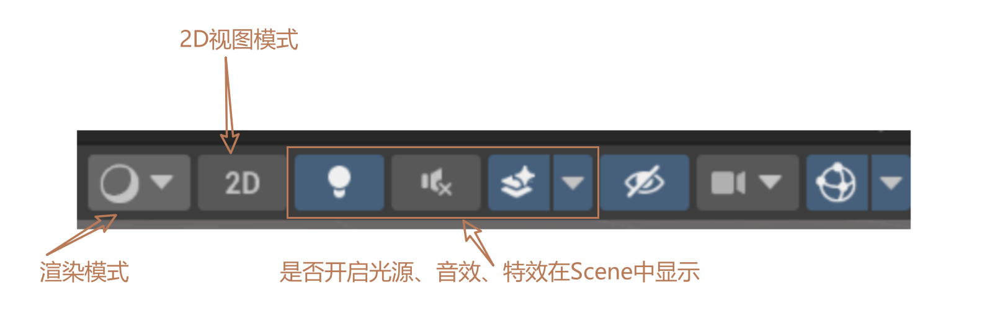
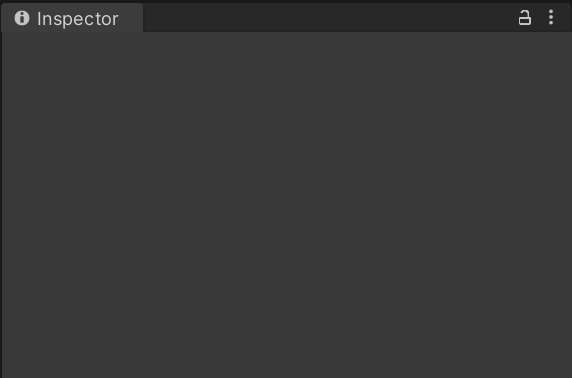
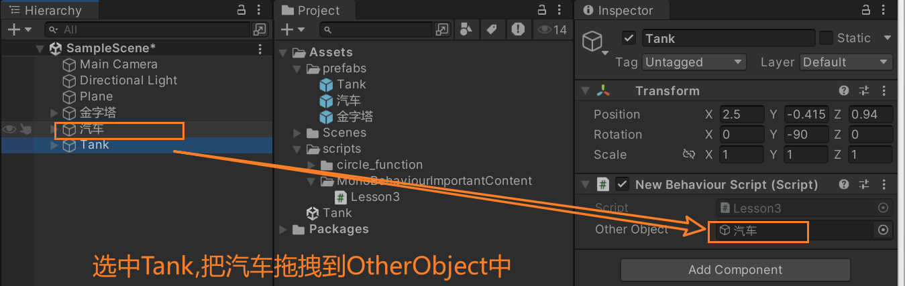

# 1.引擎窗口

## 1.1 Scene和Hierarchy窗口

### 1.1.1 窗口布局layout


### 1.1.2 Hierarchy层级窗口


- 我们可以在Hierarchy窗口中创建或拖入各种游戏对象，比如模型、光源、图片、UI等内容。层级窗口中显示的就是一个场景中的所有对象。

- 我们目前只需要掌握创建自带的几种几何模型对象。

  

### 1.1.3 Scene场景窗口

- 我们可以在Scene窗口中查看所有游戏对象，设置所有游戏对象。

- 窗口上方工具条内容

  

- 关于Unity中的3D世界坐标轴

  

  - 红色为X轴正向

  - 绿色为Y轴正向

  - 蓝色为Z轴正向

    

  - 以屏幕为参照物

    - 垂直屏幕向内为Z正方向
    - 平行屏幕向右为X正方向
    - 平行屏幕向上为Y正方向

- 操作物体位置角度缩放

  

- 场景中的操作

  | 左键相关                                            | 右键相关                              | 中键相关                                       |
  | --------------------------------------------------- | ------------------------------------- | ---------------------------------------------- |
  | 长按Alt键+鼠标左键+移动鼠标：相对观察视口中心点旋转 | 鼠标右键按下+移动鼠标：旋转视口       | 滚动鼠标中间：相对屏幕中心点拉近拉远           |
  | 选中物体之后，按F键：居中显示物体                   | 鼠标右键按下+WASD：漫游场景           | 鼠标中间按下+移动鼠标：平移观察窗口            |
  |                                                     | 鼠标右键按下+WASD+Shift：快速漫游场景 | 长按ALT键+滚动鼠标中间：鼠标指哪就朝哪拉近拉远 |

## 1.2 Game窗口和Project窗口

### 1.2.1 Game窗口

- Game游戏窗口中显示的内容，是场景中摄像机拍摄范围内的游戏对象，是玩家通过屏幕能看到的东西。

  

### 1.2.2 Project工程窗口

- 窗口中显示的内容主要是Assets文件夹中的所有内容，主要用来管理资源脚本文件，所有游戏资源都会显示在该窗口中。

  

- Project工程窗口默认文件夹

  - Scenes：里面有一个默认空场景。
  - Packages：官方拓展包。

- 所支持的资源类型
  - 图片格式：jpg、png、tga
  - 模型格式：fbx、max、maya
  - 音效：wav、mp3、ogg
  - 文本：txt、json、bytes
  - 视频：mp4

## 1.3 Inspector和Console窗口

- Inspector检查窗口：查看场景中游戏对象关联的C#脚本信息。

  - 如果不选择场景中游戏对象或不进行任何相关设置，该界面不会显示任何信息。

    

  - 当选择场景中任意游戏对象时，该界面将显示和该游戏对象关联的C#脚本信息。

    

    - 红色部分：游戏对象的基本设置；
    - 蓝色部分：关联的C#脚本；
    - 绿色部分：脚本的公共成员变量。

    

- Console控制台窗口：用于查看调试信息的窗口，报错、警告、测试打印都可以显示在其中。

  - 默认未开启，可以在Window→General中开启，或者使用快捷键：Ctrl+Shift+C

    

    

- 总结：在Unity中做游戏就像在拍戏

  - Scene是舞台，所有演员都在舞台上；
  - Hierarchy是舞台演员名单；
  - Game是摄像机拍到的画面；
  - Inspector可以看到每个演员的剧本，它要扮演什么角色；
  - Project是后台，所有未上场的演员和没有使用的剧本都在这里；
  - Console是表演过程中的信息反馈。


# 2.生命周期函数（以下顺序也是执行顺序）

## 2.1 Awake()，只执行一次

- 当对象被创建时，自动调用Awake()，并且一个只调用一次。

- 目的是让一个对象刚被创建时，在Awake()中执行一些初始化的操作

  ```
  private void Awake()
  {
  	// 当我的脚本所在的类没有继承MonoBehaviour类的时候，使用Debug.Log("")打印信息
      Debug.Log("hello world!");
      
      // 当我的脚本所在的类继承MonoBehaviour类的时候，使用print("")打印信息
      print("hello world!");
  }
  ```

## 2.2 OnEnable()

- 如果想要当一个对象被激活时，进行一些逻辑处理，就可以写在OnEnable()函数中；

  ```
  private void OnEnable()
  {
      print("OnEnable函数被调用了");
  }
  ```

## 2.3 Start()，只执行一次

- 主要作用是用于初始化信息的，但是它相对Awake来说，要晚一点。因为它是在对象进行第一次帧更新之前才会执行的。

  ```
  void Start()
  {
  	print("Start函数被调用了");
  }
  ```

## 2.4 FixedUpdate()

- 根据设置的间隔时间，每间隔一段时间执行一次

- 间隔时间实在project setting中的Time里去设置的

  ```
  private void FixedUpdate()
  {
      print("FixedUpdate函数执行了！");
  }
  ```

## 2.5 Update()

- 根据设置的间隔时间，每间隔一段时间执行一次

- 主要用于处理游戏核心逻辑更新的函数

  ```
  void Update()
  {
  	print("Update函数被调用了");
  }
  ```

## 2.6 LateUpdate()

- 一般这个更新是用来处理摄像机位置更新相关内容的

- update和LateUpdate之间，unity进行了一些处理，处理我们动画相关的更新，所以LateUpdate()的执行是晚于update的

  ```
  private void LateUpdate()
  {
  	print("LateUpdate函数执行了！");
  }
  ```

## 2.7 OnDisable()

- 如果我们希望在一个对象失活时做一些处理，就可以在该函数中写逻辑

  ```
  private void OnDisable()
  {
  	print("OnDisable函数被调用了！");
  }
  ```

## 2.8 OnDestroy()，只执行一次

- 如果我们希望在一个对象被删除时做一些处理，就可以在该函数中写逻辑

  ```
  private void OnDestroy()
  {
  	print("OnDestroy函数被调用了！");
  }
  ```

## 2.9 总结

- 生命周期函数支持继承多态
- 这些生命周期函数，如果你不打算在其中写逻辑，那就不要在这写出该生命周期函数

- 如果对象是失活状态，该对象的所有生命周期函数都是无法执行的

# 3.Inspector窗口可编辑的变量

- 私有权限和保护权限的变量无法在Inspector窗口中显示

  ```
     private int num;			//不可以在Inspector窗口中显示
     protected bool gender;	//不可以在Inspector窗口中显示
  ```

- 加上强制序列化字段特性[SerializeField]就可以让私有权限和保护权限的变量在Inspector窗口中显示

  ```
      [SerializeField]
      private int num;		//可以在Inspector窗口中显示
  
      [SerializeField]
      protected bool gender;	//可以在Inspector窗口中显示
  ```

- 公共权限的变量可以在Inspector窗口中显示编辑

  ```
     public string name ;		//可以在Inspector窗口中显示
  ```

- 公共权限的变量也可以不让其显示编辑，需要在变量前加上特性[HideInInspector]

  ```
     [HideInInspector]
     public string name ;		//不可以在Inspector窗口中显示
  ```

- 字典和自定义类型（被class以及struct声明的）不能在Inspector窗口显示

  ```
  public class MyClass
  {
      public string no;
      public string name;
  }
  public struct MyStruct 
  {
      public string name; 
  
  }
  public enum MyEnum 
  {
      SPRING,
      SUMMER,
      AUTUMN,
      WINTER
  }
  
  public class Lesson2 : MonoBehaviour
  {
      public MyClass myClass; //不能在Inspector窗口显示
      public MyStruct myStruct;//不能在Inspector窗口显示
      public Dictionary<int, string> keyValuePairs = new Dictionary<int, string>();//不能在Inspector窗口显示
      public MyEnum myEnum;//可以在Inspector窗口显示
  }
  ```

- 让自定义类型（被class以及struct声明的）在Inspector窗口显示，需要加序列化特性[System.Serializable]

  ```
  [System.Serializable]
  public class MyClass
  {
      public string no;
      public string name;
  }
  [System.Serializable]
  public struct MyStruct 
  {
      public string name; 
  
  }
  public enum MyEnum 
  {
      SPRING,
      SUMMER,
      AUTUMN,
      WINTER
  }
  
  public class Lesson2 : MonoBehaviour
  {
      public MyClass myClass; //可以在Inspector窗口显示
      public MyStruct myStruct;//可以在Inspector窗口显示
      public Dictionary<int, string> keyValuePairs = new Dictionary<int, string>();//不能在Inspector窗口显示
      public MyEnum myEnum;//可以在Inspector窗口显示
  }
  ```

- 一些辅助特性

  - 分组说明特性[Header("分组说明")]

    ```
    public class Lesson2 : MonoBehaviour
    {
        [Header("基础属性")]
        public int no;
        public string name;
    
        [Header("战斗属性")]
        public string attack;
        public string defense;
    }
    ```

  - 间隔特性[Space()]，让两个字段上下出现间隔

    ```
    public class Lesson2 : MonoBehaviour
    {
        [Header("基础属性")]
        public int no;
        public string name;
    
        [Header("战斗属性")]
        public string attack;
        [Space()]
        public string defense;
    }
    ```

  - 修饰数值的滑条范围[Range(最小值, 最大值)]

    ```
    public class Lesson2 : MonoBehaviour
    {
        [Range(10, 20)]
        public int luck;
    }
    ```

  - 多行显示字符串，默认不写参数显示三行，写参数就是对应行，[Multiline(4)]

    ```
    public class Lesson2 : MonoBehaviour
    {
    	[Multiline(5)]
        public string addr;
    }
    ```

  - 滚动条显示字符串，默认不写参数就是超过三行显示滚动条

    - [TextArea(3, 4)]，表示最少显示3行，最多4行，超过4行就显示滚动条

      ```
      public class Lesson2 : MonoBehaviour
      {
      	[TextArea(3, 4)]
          public string addr;
      }
      ```

  - 为变量添加快捷方法[ContextMenuItem("显示按钮名", "方法名")]

    ```
    public class Lesson2 : MonoBehaviour
    {
      	[ContextMenuItem("重置钱", "Test")]
        public int money;
        public void Test() 
        {
            money = 99;
        }
    }  
    ```

  - 为方法添加特性能够在Inspector中执行，[ContextMenu("哈哈哈哈")]

    ```
    public class Lesson2 : MonoBehaviour
    {
      	[ContextMenu("测试方法")]
        public void TestMethod() 
        {
            print("测试方法");
        }
    }  
    
    ```

    

# 4.MonoBehaviour类中的重要内容

## 4.1 重要成员

### 4.1.1 获取本脚本所依附的GameObject

```
print(this.gameObject.name);
```

### 4.1.2 获取本脚本依附的GameObject的位置信息

```
 print(this.transform.position); // 游戏对象的位置信息
 print(this.transform.eulerAngles); // 游戏对象的角度信息
 print(this.transform.lossyScale); // 游戏对象的缩放大小信息
```

### 4.1.3 获取本脚本是否激活

```
this.enabled = false;
```

### 4.1.4 获取本脚本所依附的GameObject中所包含的其他GameObject成员的相关信息

```
public class NewBehaviourScript : MonoBehaviour
{
    public GameObject otherObject;
    void Start()
    {
        print("other name:" + otherObject.name);
        print("other position:" + otherObject.transform.position);
    }
}

```



## 4.2 重要方法

### 4.2.1 获取本脚本所依附的GameObject中的某个脚本

```
print(this.GetComponent<某个脚本名称>());
```


```
print(this.GetComponent<Lesson3_test>()); // 获取本脚本（Lesson3）
print(this.GetComponent<Lesson3_test>()); // 获取本脚本（Lesson3）所依附的Tank对象中的Lesson3_test
```

注意：只要你能得到场景中的对象或者对象依附的脚本，那你就可以获取到它的所有信息

### 4.2.2 得到自己挂载的多个脚本


方法1：数组

```
Lesson3_test[] lt = this.GetComponent<Lesson3_test>(true);
print(lt.Length);
```

方法2：List集合

```
List<Lesson3_test> list = new List<Lesson3_test>();
this.GetComponent(true, list);
print(list.Count);
```

### 4.2.3 得到子对象挂载的脚本（它默认也会找自己身上是否挂载该脚本）


函数是有一个参数的，不写的话默认是false，意思就是如果子对象失活，是不会去找这个对象上是否有某个脚本的；如果写true，即使失活也会找

```
print(this.GetComponentInChildren<Lesson3_test>(true));
```

### 4.2.4 得到子对象挂载的多个脚本


方法1：数组

```
Lesson3_test[] lt = this.GetComponentsInChildren<Lesson3_test>(true);
print(lt.Length);
```

方法2：List集合

```
List<Lesson3_test> list = new List<Lesson3_test>();
this.GetComponentsInChildren(true, list);
print(list.Count);
```

### 4.2.5 得到父对象挂载的脚本（它默认也会找自己身上是否挂载该脚本）


```
print(this.GetComponentInParent<Lesson3_test>());
```

### 4.2.5 得到父对象挂载的多个脚本

方法1：数组

```
Lesson3_test[] lt = this.GetComponentsInParent<Lesson3_test>();
print(lt.Length);
```

方法2：List集合

```
List<Lesson3_test> list = new List<Lesson3_test>();
this.GetComponentsInParent(true, list);
print(list.Count);
```

### 4.2.6 尝试获取脚本

提供了一个更加安全的，获取单个脚本的方法，如果得到了会返回true，然后再来进行逻辑处理即可。

方法1：

```
Lesson3_Test 13t;
if(this.TryGetComponent<Lesson3_Test>(out l3t)){
	// 逻辑处理
}
```

方法2：

```
if(this.GetComponent<脚本名>() != null){
	// 逻辑处理
}
```


## 4.2 一个继承了MonoBehavior的脚本中，this、this.gameObject、this.transform分别代表什么？

- this代表这个脚本对象
- this.gameObject代表这个脚本对象依附的GameObject游戏对象
- this.transform代表这个脚本对象依附的GameObject游戏对象的位置相关信息。

# 5.GameObject的成员变量

## 5.1 name

```
print(this.gameObject.name);
this.gameObject.name = "Lesson4_GameObject";
```

## 5.2 activeSelf(是否激活)

```
print("激活状态：" + this.gameObject.activeSelf);
```

## 5.3 isStatic(是否是静态)

```
 print("是否是静态：" + this.gameObject.isStatic);
```

## 5.4 layer(层级)

```
print("层级：" + this.gameObject.layer);
```

## 5.5 tag(标签)

```
print("标签：" + this.gameObject.tag);
```

## 5.6 transform(改变)

```
print("改变：" + this.gameObject.transform.position);
```

# 6.GameObject中的静态方法

## 6.1 CreatePrimitive(PrimitiveType.Cube);创建自带的几何体

```
GameObject obj = GameObject.CreatePrimitive(PrimitiveType.Cube);
obj.name = "lzk创建的几何体对象";
```

## 6.2 查找对象相关的方法

- 无法找到失活的对象，只能找到激活的对象
- 如果场景中存在多个满足条件的对象，我们无法准确找到是谁
- 得到某一个单个对象，目前有2种方式：
  - public从外部面板拖，进行关联
  - 通过API去找

### 6.2.1 Find("对象名称");通过对象名进行查找单个对象

- 它是从Hierarchy层级窗口中的对象中开始找的

- 这个查找效率比较低，因为它会在场景中的所有对象中去查找，没有找到，返回null。

```
      GameObject obj = GameObject.Find("陆忠凯");
      if (obj != null)
      {
          print(obj.name);
      }
      else 
      {
          print("没有找到相应对象！");
      }
```

### 6.2.2 FindWithTag("标签名称");通过标签名称来查找单个对象

```
        GameObject obj = GameObject.FindWithTag("Player");
        // 等同于 GameObject obj = GameObject.FindGameObjectWithTag("Player");
        if (obj != null)
        {
            print("按标签查找，找到了：" + obj.name);
        }
        else 
        {
            print("按标签查找，没找到！");
        }
```

### 6.2.3 通过标签名称来查找多个对象

- 找多个对象的API，只能通过tag去找多个，通过名字是没有找多个的方法的
- 通过tag找到多个对象，它也是只能找到激活对象，无法找到失活对象。

```
        GameObject[] objs = GameObject.FindGameObjectsWithTag("Player");
        print(objs.Length);
```

## 6.4 Instantiate(另一个对象)，根据已有的对象实例化对象（克隆对象）

- 它的作用是根据一个GameObject对象，创建出一个和它一模一样的对象

```
public GameObject myObj = null;
void Start()
{
    GameObject.Instantiate(myObj);
    //也可直接Instantiate(myobj);
}
```

- 如果继承了MonoBehavior，其实可以不用写GameObject.，一样可以使用。因为这个方法是unity里面的Object积累提供给我们的，所以可以直接用。

## 6.5 Destroy(对象or脚本)，删除对象（或脚本）

- 注意：这个Destroy方法，不会马上移除对象，只是给这个对象加了一个移除标识，一般情况下，它会在下一帧时把这个对象移除并从内存中移除。

- 如果没有特殊需求（也就是一定要马上移除一个对象），只建议使用上面的Destroy方法，因为该方法是异步的，会降低卡顿的几率。下面这个方法就是把对象从内存中移除了。

  ```
  GameObject.DestroyImmediate(myObj);
  ```

### 6.5.1 不延时删除

```
 GameObject.Destroy(myObj); //删除对象
 GameObject.Destroy(this); //删除脚本
```

### 6.5.2 延时几秒再删除

```
GameObject.Destroy(myObj, 5); // 延时删除对象
GameObject.Destroy(myObj, 5); // 延时删除脚本
```

## 6.6 过场景不移除某些对象，DontDestroyOnLoad(某些对象)

```
GameObject.DontDestroyOnLoad(this.gameObject); // 过场景而不移除这个脚本所依附的那些对象
```

# 7.GameObject中的成员方法

## 7.1 创建空物体

```
GameObject obj1 = new GameObject(); // 创建默认空物体
GameObject obj2 = new GameObject("陆忠凯创建的空物体"); // 创建空物体，并给它命名
GameObject obj3 = new GameObject("带脚本的空物体", typeof(Lesson1), typeof(Lesson2)); // 创建带脚本的空物体，所带的脚本为Lesson1和Lesson2
```

## 7.2 为对象动态添加脚本

- 如果想要动态的添加继承自MonoBehavior的脚本在某一个对象上，直接使用GameObject提供的实例方法即可

```
        GameObject obj4 = new GameObject();
        Lesson2 lesson4 = obj4.AddComponent<Lesson2>();
```

- 通过返回值，可以得到加入的脚本信息，从而进行一些处理

## 7.3 得到脚本的成员方法和继承MonoBehaviour的类得到脚本的方法一模一样。


## 7.4 标签比较

下面两种比较的方法是一样的

```
if (this.gameObject.CompareTag("Player")) 
{
	print("对象的标签是Player");
}

if (this.gameObject.tag == "Player") 
{
	print("对象的标签是Player");
}
```

## 7.5 设置激活失活

- false：失活；true：激活

```
GameObject obj2 = new GameObject("陆忠凯创建的空物体"); // 创建空物体，并给它命名
GameObject obj3 = new GameObject("带脚本的空物体", typeof(Lesson1), typeof(Lesson2));
obj2.SetActive(false);
obj3.SetActive(false);
```

# 8.GameObject相关的练习

8.1 一个空物体上挂了一个脚本，游戏运行时该脚本可以实例化出之前的坦克预设体。一般情况下，我们实例化出的对象，都是克隆的预设提，但是也可以拖场景上的对象进行克隆

```
    void Start()
    {
        //GameObject.Instantiate(obj);
        GameObject tank = GameObject.Find("Tank");
        if (tank != null) 
        {
            GameObject obj = GameObject.Instantiate(tank);
        }
    }
```

8.2 一个脚本A，一个脚本B，脚本A挂在A对象上，脚本B挂在B对象上。实现A脚本的Start函数中将B对象上的B脚本失活（用GameObject相关知识做）；

方法1：A对象关联B对象

方法2：查找，查找B对象，获取B对象的脚本，从而设置脚本失活

```
    void Start()
    {
        //b.GetComponent<B>().enabled = false;

        B b = GameObject.Find("B").GetComponent<B>();
        if (b != null) 
        {
            b.enabled = false;
        }
        

    }
```

8.3 一个对象A和一个对象B，在A上挂一个脚本，通过这个脚本可以让B对象改名，失活，延迟删除，立即删除。可以在Inspector窗口进行设置，让B实现不同的效果（提示：GameObject、枚举）

```
    public Do_Type type = Do_Type.RENAME;
    // Start is called before the first frame update
    void Start()
    {
        GameObject obj = GameObject.Find("ObjectB");
        if (obj != null) 
        {
            switch (type) 
            {
                case Do_Type.RENAME:
                    obj.name = "RenameB"; break;
                case Do_Type.NOT_ACTIVE:
                    obj.SetActive(false); break;
                case Do_Type.DELAY_DELETE:
                    GameObject.Destroy(obj, 5); break;
                case Do_Type.IMMEDIATE_DELETE: 
                    GameObject.DestroyImmediate(obj); break;
            }
        }
    }
```

