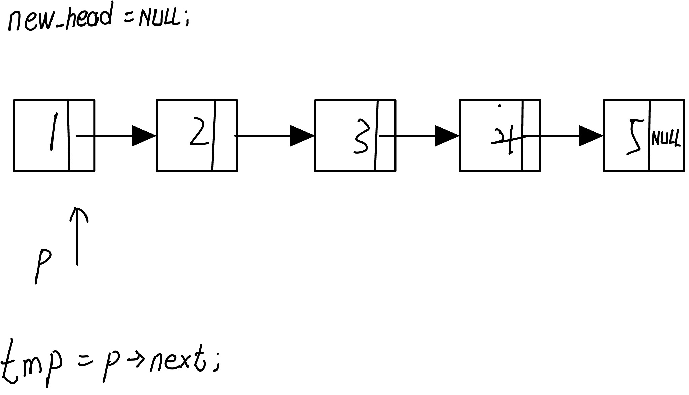

# Leetcode 题解 - 链表

## 1.找出两个链表的交点

[Leetcode](https://leetcode.com/problems/intersection-of-two-linked-lists/description/) / [力扣](https://leetcode-cn.com/problems/intersection-of-two-linked-lists/description/)


pA走过的路径为A链+B链

pB走过的路径为B链+A链

pA和pB走过的长度都相同，都是A链和B链的长度之和，相当于将两条链从尾端对齐，如果相交，则会提前在相交点相遇，如果没有相交点，则会在最后相遇。

```haskell
pA:1->2->3->4->5->6->null->9->5->6->null
pB:9->5->6->null->1->2->3->4->5->6->null
```

```c
struct ListNode *getIntersectionNode(struct ListNode *headA, struct ListNode *headB) {
    struct ListNode *pa = headA, *pb = headB;
    while(pa != pb)
    {
        pa = pa ? pa->next : headB;
        pb = pb ? pb->next : headA;
    }
    return pa;
}
```

## 2.翻转链表

206. Reverse Linked List (Easy)

[Leetcode](https://leetcode.com/problems/reverse-linked-list/description/) / [力扣](https://leetcode-cn.com/problems/reverse-linked-list/description/)



new_head指针：新链表的头指针，初始时new_head=NULL;

p指针：从旧链表中每次往下选择一个结点进行摘取，放到新链表中；

tmp指针：为了让p可以继续往下选择新结点，每次提前保存p选择结点的后继结点。

关键操作总结如下：

```c
tmp = p->next;
p->next = new_head;
new_head = p;
p = tmp;
```

实现代码：

```c
struct ListNode* reverseList(struct ListNode* head) {
   struct ListNode *new_head = NULL, *p = head;
   while(p)
   {
       struct ListNode* tmp = p->next;
       p->next = new_head;
       new_head = p;
       p = tmp;
   }
   return new_head; 
}
```

