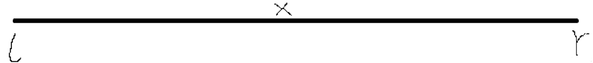
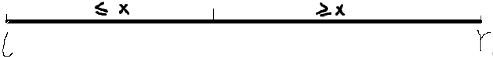
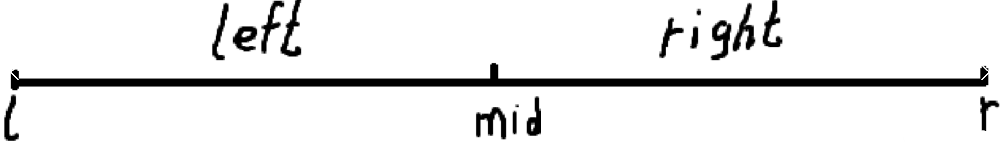
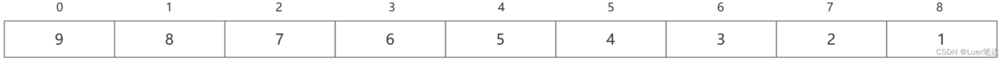
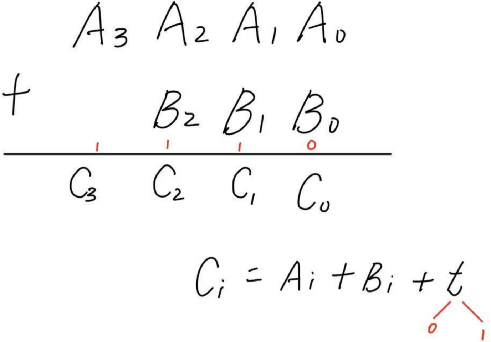

# 1.基础算法

## 1.1 快速排序

- 算法思想

  

  - 确定这组数中的分界点x：
    - 确定方式：取左边界q[l]、取中间值q[ (l+r) / 2 ]、取右边界限q[r]、随机取一个数

  - 调整区间（难点）：

    

    - 通过x的值将区间一分为二划分为两部分（这两部分长度不一定相等），使得左半部分中的所有元素值≤x，右半部分中的所有元素值≥x。

    - 注意：分界点上的数不一定是x，x可能在很奇怪的位置。

  - 递归排序左段和右段。

    - 左段排好序，右段排好序，左右拼接则整体排好序

- 代码

  ```c++
  #include<iostream>
  using namespace std;
  const int N = 1e6 + 10;
   
  int n;
  int q[N];
   
  void quick_sort(int q[], int l, int r)
  {
  	if (l >= r) return;
   
  	int x = q[(l+r)/2], i = l - 1, j = r + 1;//Acwing中把q[l]改为q[(l+r)/2]可提交成功！
  	while (i < j) 
  	{
  		do i++; while (q[i] < x);
  		do j--; while (q[j] > x);
  		
  		if (i < j) swap(q[i], q[j]);
  	}
  	quick_sort(q, l, j);
  	quick_sort(q, j + 1, r);
  }
   
  int main() 
  {
  	cin >> n;
  	for (int i = 0; i < n; i++) cin >> q[i];
  	quick_sort(q, 0, n - 1);
   
  	for (int i = 0; i < n; i++) cout << q[i] << " ";
  	return 0;
  }
  ```

  


## 1.2 归并排序

- 算法思想

  

  - 确定分界点：mid = ( l+r ) / 2；
  - 递归排序left部分和right部分
  - 归并：合二为一（将结果放到临时数组，最后再将临时数组中的结果放回原数组）

- 代码

  ```
  #include<iostream>
  using namespace std;
  
  const int N = 100010;
  int n;
  int q[N], tmp[N];
  
  
  void merge_sort(int q[], int l, int r) 
  {
  	if (l >= r) 
  	{
  		return;
  	}
  	int mid = (l + r) / 2;
  	merge_sort(q, l, mid), merge_sort(q, mid + 1, r);
  	int i = l, j = mid + 1, k = 0;
  	while (i <= mid && j <= r) 
  	{
  		if (q[i] <= q[j]) 
  		{
  			tmp[k++] = q[i++];
  		}
  		else 
  		{
  			tmp[k++] = q[j++];
  		}
  	}
  	while (i <= mid) 
  	{
  		tmp[k++] = q[i++];
  	}
  	while (j <= r) 
  	{
  		tmp[k++] = q[j++];
  	}
  
  	for (int i = l, j = 0; i <= r; i++, j++) 
  	{
  		q[i] = tmp[j];
  	}
  
  }
  int main() 
  {
  	cin >> n;
  	for (int i = 0; i < n; i++) 
  	{
  		cin >> q[i];
  	}
  	merge_sort(q, 0, n - 1);
  	for (int i = 0; i < n; i++) 
  	{
  		cout << q[i] << " ";
  	}
  	return 0;
  }
  ```

  

## 1.3 二分

### 1.3.1 整数二分

[789. 数的范围 - AcWing题库](https://www.acwing.com/problem/content/791/)

一般二分应用于无非下面这四种情况:
1：找大于等于某数的第一个数位置 （满足某个条件的第一个数）
2：找小于等于某数的最后一个数的位置 （满足某个条件的最后一个数）
3.查找最大值 （满足该边界的右边界）、
4.查找最小值 (满足该边界的左边界)

```
#include<iostream>
using namespace std;
const int N = 100010;
int n, m;
int q[N];

int searchLeft(int x)
{
    int l = 0, r = n - 1, mid;
	while (l < r)
	{
		mid = (l + r) / 2;
		if (x <= q[mid])
		{
			r = mid;
		}
		else
		{
			l = mid + 1;
		}
	}
	return l;
	// 这里返回l或r都是可以的，因为最后l一定等于r
	// 为了可读性，查找左边返回l
}

int searchRight(int x)
{
    int l = 0, r = n - 1, mid;
	while (l < r) 
	{
		mid = (l + r + 1) / 2;
		if (x >= q[mid]) 
		{
			l = mid;
		}
		else 
		{
			r = mid - 1;
		}
	}
	return r;
	// 这里返回l或r都是可以的，因为最后l一定等于r
	// 为了可读性，查找右边返回r
}

int main() 
{
	cin >> n >> m;
	for (int i = 0; i < n; i++) 
	{
		cin >> q[i];
	}
	int x;
	while (m--)
	{
		cin >> x;
		int l = searchLeft(x);
		if (x != q[l]) 
		{
			cout << "-1 -1" << endl;
		}
		else 
		{
			cout << l << " ";
			
			int r = searchRight(x);
			cout << r << endl;
		}
	}
	return 0;
}
```

### 1.3.2 浮点数二分

```
#include<iostream>
using namespace std;

int main()
{
    double x;
    cin >> x;
    double l = 0, r = x, mid;
    while(r - l >= 1e-8)
    {
        mid = (l + r) / 2;
        if(mid * mid >= x)
        {
            r = mid;
        }
        else
        {
            l = mid;
        }
    }
    cout << l << endl;
    return 0;
}
```


## 1.4 高精度

大整数存储方式：以数字“123456789”为例，把该数从个位到高位依次存储在以下数组中，因为进位后在数组末尾添加一个数字是很容易的。



### 1.4.1 加法

- 算法思想

  

- 代码

  ```c++
  #include<iostream>
  #include<vector>
  using namespace std;
  
  vector<int> add(vector<int> &a, vector<int> &b)
  {
      int t = 0;
      vector<int> c;
      for(int i = 0; i < a.size() || i < b.size(); i++)
      {
          if(i < a.size())
          {
              t += a[i];
          }
          if(i < b.size())
          {
              t += b[i];
          }
          c.push_back(t % 10);
          t /= 10;
      }
      if(t)
      {
          c.push_back(1);
      }
      return c;
  }
  
  int main()
  {
      string s1, s2;
      cin >> s1;
      cin >> s2;
      vector<int> a, b;
      for(int i = s1.size() - 1; i >= 0; i--)
      {
          a.push_back(s1[i] - '0');
      }
      for(int i = s2.size() - 1; i >= 0; i--)
      {
          b.push_back(s2[i] - '0');
      }
      vector<int> c = add(a, b);
      for(int i = c.size() - 1; i >= 0; i--)
      {
          cout << c[i];
      }
      cout << endl;
      return 0;
  }
  ```

  

## 1.5 前缀与差分


## 1.6 双指针算法


## 1.7 位运算


## 1.8 离散化


## 1.9 区间和并


# 2.数据结构


# 3.搜索与图论


# 4.数学知识


# 5.动态规划


# 6.贪心

