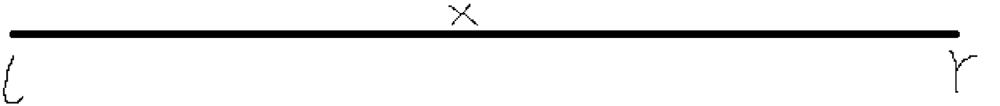
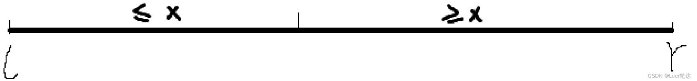

# 1.基础算法

## 1.1 快速排序

[785. 快速排序 - AcWing题库](https://www.acwing.com/problem/content/787/)

- 快速排序是基于分治法的

- 算法思想

  

  - 确定这组数中的分界点x

    - 确定方式：取左边界q[l]、取中间值q[ (l+r) / 2 ]、取右边界限q[r]、随机取一个数

  - 调整区间（难点）

    

    - 通过x的值将区间一分为二划分为两部分（这两部分长度不一定相等）
    - 使得左半部分中的所有元素值≤x，右半部分中的所有元素值≥x。
    - 【注意】分界点上的数不一定是x，x可能在很奇怪的位置。

  - 递归排序左段和右段

    - 左段排好序，右段排好序，左右拼接则整体排好序

- 代码实现

  ```
  #include<iostream>
  using namespace std;
  const int N = 1e6 + 10;
  
  int n;
  int q[N];
  
  void quick_sort(int q[], int l, int r)
  {
  	if (l >= r) return;
  
  	int x = q[(l+r)/2], i = l - 1, j = r + 1;//Acwing中把q[l]改为q[(l+r)/2]可提交成功！
  	while (i < j) 
  	{
  		do i++; while (q[i] < x);
  		do j--; while (q[j] > x);
  		
  		if (i < j) swap(q[i], q[j]);
  	}
  	quick_sort(q, l, j);
  	quick_sort(q, j + 1, r);
  }
  
  int main() 
  {
  	cin >> n;
  	for (int i = 0; i < n; i++) cin >> q[i];
  	quick_sort(q, 0, n - 1);
  
  	for (int i = 0; i < n; i++) cout << q[i] << " ";
  	return 0;
  }
  ```

  

