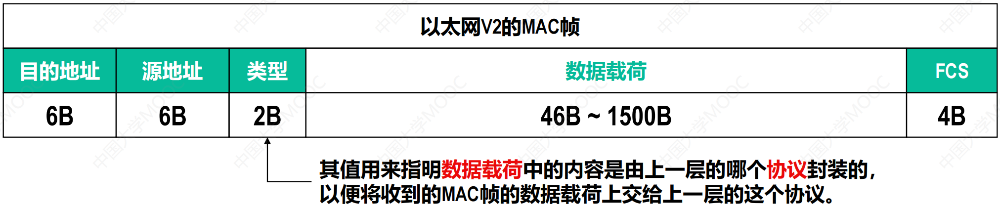

# 1.绪论

## 1.1 网络、互连网（互联网）和因特网

- 网络：网络由若干节点和连接这些节点的链路组成。
  - 多台计算机通过一台交换机互连起来形成一个网络，这多台计算机和这一台交换机都称为节点，计算机和交换机之间连接的线路称为链路。
- 互联网：多个网络还可以通过路由器互连起来，这样就构成了一个覆盖范围更大的网络，即互联网（或互连网）。
- 因特网：因特网是世界上最大的互连网络（用户数以亿计，互连的网络数以百万计）；

## 1.2 因特网的组成

- 边缘部分：由所有连接在因特网上的主机组成。这部分是用户直接使用的，用来进行通信（传送数据、音频或视频）和资源共享。

- 核心部分：由大量网络和连接这些网络的路由器组成。这部分是为边缘部分提供服务的（提供连通性和交换）。

  

## 1.3 三种交换技术

### 1.3.1 电路交换（用于电话网络）

- 通过物理线路的连接，动态的分配线路传输资源。
- 电路交换的过程
  - 建立连接（尝试占用通信资源）
  - 通信（一直占用通信资源）
  - 释放连接（归还通信资源）
- 电路交换的优缺点
  - 优点
    - 通信前从主叫端到被叫端建立一条专用的物理通路，在通信的全部时间内，两个用户始终占用端到端的线路资源。数据直送，传输速率高。
    - 电路交换更适用于：低频次，大量地数据传输。
  - 缺点
    - 建立/释放连接，需要额外的时间开销
    - 线路被通信双方独占，利用率低
    - 线路分配的灵活性差
    - 计算机之间数据往往是“突发式”传输，即往往会高频次、少量地传输数据。

### 1.3.2 报文交换（用于电报网络）

- 一份报文（电报）包含两部分信息
  - 控制信息：发送方地址、接收方地址
  - 用户所有数据

- 报文交换的优缺点
  - 优点
    - 通信前无需建立连接
    - 数据以“报文”为单位被交换节点之间“存储转发”，通信线路可以灵活分配
      - 存储转发的思想：把传送的数据单元先存储进中间节点，再根据目的地址转发至下一节点。
    - 在通信时间内，两个用户无需独占一整条物理线路，相比于电路交换，线路利用率高。
    - 交换节点支持“差错控制”（通过校验技术）
  - 缺点
    - 报文不定长，不方便存储转发管理
    - 长报文的存储转发时间开销大、缓存开销大
    - 长报文容易出错，重传代价高

### 1.3.3 分组交换（用于现代计算机网络）

- 把一份报文拆成多个大小相同的小报文，这些小报文被称为分组，每个分组也包含两部分的信息
  - 控制信息：发送方地址、接收方地址
  - 用户部分数据

- 分组交换的优缺点
  - 优点
    - 通信前无需建立连接
    - 数据以“分组”为单位被交换节点之间“存储转发”，通信线路可以灵活分配
      - 存储转发的思想：把传送的数据单元先存储进中间节点，再根据目的地址转发至下一节点。
    - 在通信时间内，两个用户无需独占一整条物理线路，相比于电路交换，线路利用率高。
    - 交换节点支持“差错控制”（通过校验技术）
    - 相比于报文交换，分组交换改进了如下问题
      - 分组定长，方便存储转发管理
      - 分组的存储转发时间开销小，缓存开销小
      - 分组不易出错，重传代价低
  - 缺点
    - 相比于报文交换，控制信息占比增加（每个分组都携带了一份控制信息）
    - 相比于电路交换，依然存在存储转发时延
    - 报文被拆分为多个分组，传输过程中可能出现失序、丢失等问题，增加处理的复杂度。

## 1.4 计算机网络的定义和分类

### 1.4.1 计算机网络的定义

- 最简单的定义：一些互连的、自治的计算机的集合；
  - 自治表示每台计算机都是独立的，它们有各自的软硬件
- 较好的定义：计算机网络主要是由一些通用的、可编程的硬件互连而成的，这些硬件硬件并非专门用来实现某一特定目的（例如，传送数据或视频信号）。这些可编程的硬件能够用来传送多种不同类型的数据，并能支持广泛的和日益增长的应用。

### 1.4.2 计算机网络的分类

- 按交换技术分类
  - 电路交换网
  - 报文交换网
  - 分组交换网
- 按使用者分类
  - 公用网（普通用户接入的电信网）
  - 专用网（如军队、银行使用的网络）
- 按传输介质分类
  - 有线网络
  - 无线网络
- 按覆盖范围分类
  - 广域网（WAN）
  - 城域网（MAN）
  - 局域网（LAN）
  - 个域网（PAN）
- 按拓扑结构分类
  - 总线型网络
  - 星型网络
  - 环型网络
  - 网状网络

## 1.5 计算机网络的性能指标

- 速率
  - 连接在计算机网络上的主机在数字信道上传输比特的速率，也称为比特率或数据率。
  - 基本单位：bit/s (b/s、bps)，常用单位：kb/s，Mb/s, Gb/s，Tb/s
- 带宽
  - 用来表示网络的通信线路所能传送数据的能力，因此网络带宽表示在单位时间内从网络中的某一点到另一点所能通过的“最高数据率”；单位与速率单位相同。
- 吞吐量
  - 吞吐量表示在单位时间内通过某个网络（或信道、接口）的数据量；
  - 吞吐量被经常用于对现实世界中的网络的一种测量，以便知道实际上到底有多少数据量能够通过网络；吞吐量受网络的带宽或额定速率的限制。
- 时延
  - 发送时延
  - 传播时延
  - 处理时延

## 1.6 计算机网络体系结构

- 常见的三种计算机网络体系结构

  - 开放系统互联参考模型（OSI）
    - 为了使得不同体系结构的计算机网络都能互连起来，国际标准化组织（ISO）提出了开放系统互连参考模型；
    - OSI刚被提出来时，采用TCP/IP体系结构的因特网已经抢先在全世界覆盖了相当大的范围。
    - 因此，OSI只停留在了理论方面，OSI在市场化方面输给了TCP/IP。

  - TCP/IP体系结构
    - 由于TCP/IP体系结构中包含大量的协议，而IP协议和TCP协议是其中最重要的两个协议，因此用TCP和IP这两个协议来表示整个协议大家族，常称为TCP/IP协议族。

  - 五层原理体系结构
    - TCP/IP体系结构为了将不同的网络接口进行互连，其网络接口层并没有规定什么具体内容，因此如果直接学习TCP/IP体系结构的话，可能物理层和数据链路层的学习我们就给忽略了，这对于我们学习计算机网络的完整体系结构来说就会缺少一部分内容。因此在学习计算机网络原理是往往采取折中的办法，也就是综合OSI参考模型和TCP/IP参考模型，采用一种原理参考模型。

- 计算机网络体系结构分层的必要性

  - 为什么要分层?
    - “分层”可以将庞大而复杂的问题转化为若干较小的局部问题，而这些较小的局部问题就比较容易研究和处理。

  - 物理层解决什么问题？
    - 主机A和主机B要想互连进行数据传输
      - 应该要采用什么传输介质？
      - 这根传输介质两端规定采用什么接口分别和主机A和主机B相连？
      - 这根传输介质中的数据应该采用什么信号进行传输？
  
  - 数据链路层解决什么问题？
    - 主机A、主机B和主机C通过一根总线互连进行数据传输
      - 如何标识网络中的各主机？
  
        - 假设主机A要给主机B发送数据，表示数据的信号会通过总线传播到总线上的每一个主机。
        - 那么主机B如何知道该数据是主机A发送给自己的，进而接受该数据，而主机C又如何知道该数据并不是发给自己的，进而丢弃该数据呢？
        - 这就需要解决如何标识网络中的各主机的问题，即主机编址问题。
  
        
  
      - 如何区分出地址和数据？
  
        - 主机在发送数据时应该给数据附加上源地址和目的地址。当其他主机收到后，根据目的地址和自身地址是否匹配，来决定是否接受该数据，还可以通过源地址知道是哪个主机发来的数据。
        - 要将源地址和目的地址附加到数据上，这就需要收发双方约定好数据的封装格式。发送方将待发送的数据按照实现约定好的格式进行封装（即在数据前面添加包含源地址、目的地址和其他一些控制信息的首部），然后将封装好的数据包发送出去。接收方收到数据包后，按照事先约定好的格式对其进行解封。
  
      - 各主机进行数据传输时，如何协调各主机竞争使用总线？
  
        
  
  - 网络层解决什么问题？
  
    解决了物理层和数据链路层各自所面临的问题后，就可以实现数据包在一个网络上传输了。然而，我们的网络应用往往不仅限于一个单独的网络上。例如，我们几乎每天使用的因特网，是由非常多的网络和路由器互连起来的，仅解决物理层和数据链路层的问题，还是不能正常工作。可以把下图所示的小型互联网看做因特网中很小的一部分，我们来看看在该小型互联网中，需要考虑的主要问题有哪些？
  
    
  
    - 数据包从N1网络中的某台主机传到N2网络中的某台主机，用什么来定位N2网络呢，又用什么来定位N2网络中的那台目的主机呢？IP地址；
  
    - 数据包从N1网络传到N2网络中间必然经过多条路径，这多条路径中有多台路由器，这就涉及到路由器如何转发分组和进行路由选择。
  
      
  
  - 运输层解决什么问题？
  
  - 应用层解决什么问题？

# 2.物理层

## 2.1 物理层要实现的功能

- 物理层要实现的功能是在各种传输媒体上传输比特0和1，进而给上面的数据链路层提供透明传输比特流的服务。
- 透明传输比特流的意思是数据链路层“看不见”（也无须看见）物理层究竟使用的是什么方法来传输比特流，数据链路层只管“享受”物理层提供的比特流传输服务即可。

## 2.2 物理层下面的传输媒体

- 有线传输媒体
  - 同轴电缆
  - 双绞线
  - 光纤
- 无线传输媒体
  - 无线电波
  - 微波
  - 红外线
  - 激光
  - 可见光

## 2.3 数字传输方式

### 2.3.1 串行传输和并行传输

- 串行传输：发送端和接收端之间只有一条数据传输线路，构成数据的多个比特在这条数据传输线路上逐比特依次传输。

  

- 并行传输：在发送端和接收端之间有多条数据传输线路，构成数据的多个比特被分别安排在不同的数据传输线路上同时传输。

  

### 2.3.2 单向通信、双向交替通信和双向同时通信

- 单向通信

  

- 双向交替通信

  

- 双向同时通信

  

## 2.4 编码与调制


- 消息、数据和信号
  - 在计算机网络中，需要由计算机处理和传输的文字、图片、音频和视频等内容，可以统称为消息。
  - 消息输入计算机后，就成为了有意义的二进制符号序列，即数据（比特0和比特1构成的数字序列）。
  - 计算机中的网卡将比特0和比特1变换成相应的信号发送到传输媒体。

- 基带信号
  - 由计算机输出的表示各种文字、图像、音频或视频文件的数字信号都属于基带信号。
  - 基带信号往往包含较多的低频成分，甚至包含（由连续个“0”或连续个“1”造成的）直流成分，而许多信道不能传输这种低频分量或直流分量，在通过不能传输这些成分的信道时，这些部分就传不过去，导致信号失真或丢失。因此需要对基带信号进行调制后才能在不能传输这些成分的信道上传输。

- 调制
  - 基带调制
    - 对数字基带信号的波形进行变换，使其能够与信道特性相适应，调制后的信号仍然是数字基带信号。
    - 由于基带调制是把数字信号转换成另一种形式的数字信号，因此基带调制也称为编码。
  - 带通调制
    - 将数字基带信号的频率范围搬移到较高的频段，并转换成模拟信号，使其能够在模拟信道中传输。

# 3.数据链路层

## 3.1 数据链路层的三个重要问题

### 3.1.1 封装成帧和透明传输

- 封装成帧
  - 就是给网络层交付下来的分组添加一个首部和一个尾部，这样就构成了一个帧。
  - 帧的首部和尾部中包含有一些重要的控制信息。例如，帧首部中往往包含帧开始符、帧的源地址和目的地址，而帧尾部中往往包含帧校验序列和帧结束符。
  - 接收方的数据链路层在收到物理层交付上来的比特流后，根据帧首部中的帧开始符和帧尾部中的帧结束符，从收到的比特流中识别出帧的开始和结束，也就是进行帧定界。
- 透明传输
  - 如果在帧的数据载荷部分恰好也出现了帧定界符（帧开始符或帧结束符），就会造成接收方数据链路层出现帧定界的错误。
  - 如果不解决上述问题，则数据链路层就会对上层交付的协议数据单元（PDU）的内容有所限制，即PDU中不能包含帧定界符。
  - 如果能够采取措施，使得数据链路层对上层交付的PDU的内容没有任何限制，就好像数据链路层不存在一样，就称其为透明传输。
  - 实现透明传输的方法有两种：字节填充和比特填充。

### 3.1.2 差错检测

实际的通信链路都是不理想的。表示比特的信号在信道上传输时，不可避免地会产生失真，甚至出现更严重的错误。这就会导致比特在传输过程中产生差错：比特1可能会变成比特0，而比特0也可能变成比特1。这种传输差错称为比特差错。常用的检错技术有：奇偶校验和循环冗余校验。

- 奇偶校验

  - 奇校验是在待发送的数据后面添加1个校验位，使得添加该校验位后的整个数据中比特1的个数为奇数。

  - 偶校验是在待发送的数据后面添加1个校验位，使得添加该校验位后的整个数据中比特1的个数为偶数。

    

    

  - 在所传输的数据中，如果有奇数个位发生误码，则所包含比特1 的数量的奇偶性会发生改变，可以检测出误码。

  - 在所传输的数据中，如果有偶数个位发生误码，则所包含比特1 的数量的奇偶性不会发生改变，无法检测出误码（漏检）。

- 循环冗余码校验

  - 收发双方约定好一个生成多项式G(X) 。

  - 发送方基于待发送的数据和生成多项式G(X)，计算出差错检测码（冗余码），将冗余码添加到待发送数据的后面一起传输。

  - 接收方收到数据和冗余码后，通过生成多项式G(X) 来计算收到的数据和冗余码是否产生了误码。

    

    ​													

    ​												

### 3.1.3 可靠传输

- 可靠传输的相关基本概念

  - 使用差错检测技术（例如循环冗余码校验），接收方的数据链路层就可检测出帧再传输过程中是否产生了误码（比特错误）。如果检测出了误码：
    - 若数据链路层向其上层提供的是不可靠的传输服务，则接收方的数据链路层丢弃有误码的帧即可；
    - 若数据链路层向其上层提供的是可靠的传输服务，这就需要数据链路层通过某种机制实现发送方发送什么，接受方就能收到什么。有线链路误码率低，一般不要求数据链路层向其上层提供可靠传输服务，而无线链路误码率高，一般要求数据链路层为其上层提供可靠传输服务。三种实现可靠传输的机制分别是：停止-等待协议、回退N帧协议、选择重传协议。

- 停止等待协议

  - 基本原理：所谓停止-等待协议，就是指发送方每发送完一个数据分组就必须停下来，等待接收方发来的确认分组或否认分组。

    - 最简单的情况的策略

      

      - 缺陷：如果数据分组丢失，发送方将无法受到确认分组，更别提否认分组了。

    - 数据分组丢失的情况的处理策略

      

      - 缺陷：如果接收方发过来的确认分组在中途丢失，发送方则一直收不到确认分组，因此发送方必将重传之前的分组，此时接收方必然受到了与之前相同的分组，此时就产生了分组重复的传输差错。

    - 确认分组丢失的情况的处理策略

      

      - 为了防止发送方收到重复的确认分组，确认分组也需要编号

        

  - 停止等待协议缺点：

    - 当数据分组发送时延 < 往返时间时，信道利用率很低。

    - 因此对于数据分组发送时延较小，但往返时间很大（例如卫星链路）的应用，不适用于使用停止-等待协议来实现可靠传输。

    - 对于数据分组发送时延较小，但往返时间很大的情况下，收发双方可以不采用信道利用率很低的停止等待协议，可以采用使用流水线传输方式的 “回退N帧协议”。

      - 所谓流水线传输就是指发送方在未收到接收方发来确认分组的情况下，可以连续发送多个数据分组，而不必每发送完一个数据分组就停下来等待接收方的确认分组。这种传输方式可以明显提高信道利用率。

        

- 回退N帧协议

  - 回退N帧协议采用流水线传输方式，并且利用发送窗口来限制发送方连续发送数据分组的数量。

  - 发送窗口和接受窗口的理解

    - 发送方需要维护一个发送窗口，在未收到接受方确认分组的情况下，发送方可将序号落入发送窗口内的所有数据分组连续发送出去。

    - 接收方需要维护一个接受窗口，只有正确到达接收方且序号落入接受窗口内的数据分组才被接受方接受。

      

    - 发送窗口和接受窗口的滑动情况如下：
      - 接收方每正确收到一个序号落入接受窗口的数据分组，就将接收窗口向前滑动一个位置，这样就有一个新的序号落入接受窗口。与此同时，接收方还要给发送方发送针对该数据分组的确认分组。
      - 发送方每收到一个按序确认的确认分组，就将发送窗口向前滑动一个位置，这样就有一个新的序号落入发送窗口，序号落入发送窗口内的数据分组可继续被发送。

  - 回退N帧协议的工作过程
    - 无传输差错的情况
    - 有传输差错、超时重传、回退N帧的情况 
    - 累计确认的情况

  - 缺陷：
    - 回退N帧协议在无数据分组差错的情况下，其信道利用率比停止-等待协议要高不少。但是，一个数据分组的差错就可能引起大量数据分组的重传，而这些重传的数据分组原本已经正确到达接收方，但是由于序号未落入接收窗口内而被接收方丢弃。显然，这些数据分组的重传是对通信资源的严重浪费。
    - 为了进一步提高信道利用率，可以设法只重传出现差错的数据分组，这就需要接收窗口的尺寸大于1，以便先收下失序但正确到达接收方且序号落入接受窗口内的数据分组，等到所缺数据分组收齐后，在一并送交上层，这就是选择重传协议。

- 选择重传协议
  - 为了使发送方仅重传出现差错的数据分组，接收方不能再采用累积确认，而需要对每一个正确接收的数据分组进行逐一确认。接收方需要有足够的缓存空间，来暂存失序但正确到达接收方且序号落入接收窗口内的数据分组。
  - 一般情况下，在选择重传协议中，发送窗口和接收窗口是相同的。

## 3.2 点对点协议（PPP协议）

- PPP协议就采用了上面三个重要问题的处理策略。

### 3.2.1 PPP协议用在什么地方呢？

- 因特网用户的计算机通过点对点链路连接到某个ISP进而接入因特网，用户计算机与ISP通信是所采用的数据链路层协议一般就是PPP协议。

  

  - 点对点链路：是指在计算机网络和通信系统中，两台设备之间通过物理介质直接连接的一种通信方式。点对点链路的主要特点是只有两个终端设备参与通信，没有其他设备共享这条链路。即两台设备之间有一条独立的物理线路，数据直接从一个设备传输到另一个设备，不经过任何中间设备或节点。

- 广泛应用于广域网路由器之间的专用线路。

  

### 3.2.2 PPP协议-封装成帧

- PPP协议帧格式

  

### 3.2.3 PPP协议-透明传输

- 字节填充
- 零比特填充

### 3.2.4 PPP协议-差错检测

- 使用循环冗余码校验

### 3.2.5 PPP协议工作过程

- 以用户主机拨号接入因特网服务提供者ISP 的拨号服务器的过程为例：

  

## 3.3 共享式以太网

### 3.3.1 以太网的基本概念

- 什么是以太？

  - 以太（ether）这个词最早出现在古希腊哲学中，用来指代一种无形的物质，认为它充满了整个宇宙，是光和电磁波传播的介质。

  - 在物理学上，19世纪的科学家也曾假设存在一种“以太”，认为光波在真空中传播需要一种介质。但是后来通过实验（如著名的迈克尔逊-莫雷实验），证明这种假设是错误的。于是，物理学中的“以太”概念被淘汰了。


- 为什么称为以太网？
  - 发明者们借用了“以太”这个概念，来形容一种无处不在的媒介，使网络中的所有设备都能通过这种“无形的媒介”相互通信。

- 为什么会出现以太网？
  - 没有以太网出现时，什么样的问题会出现？
    - 要在计算机之间传输数据，需要使用磁带、软盘等物理介质手动传递，这既麻烦又耗时。
    - 各种不同厂商生产的计算机和设备使用不同的通信协议，难以实现互相连接和通信。
    - 当时的网络解决方案速度慢、配置复杂且昂贵，不适合大规模普及。


- 以太网的出现又解决了什么问题？
  - 通过以太网，计算机可以相互连接，组成一个局域网（LAN），使得计算机之间可以方便地通信和共享资源。
  - 以太网提供了高效的数据传输方式，不再需要依赖物理介质传递数据。文件、图片和其他数据可以通过网络快速传输。
  - 以太网采用标准化的通信协议，不同厂商的设备可以轻松互联和通信，增强了设备间的兼容性。
  - 以太网设备相对便宜，安装和维护成本低，使得网络技术能够普及到更多的地方。

- 什么是以太网？
  - 以太网（Ethernet）是一种计算机网络技术，用于在局域网（LAN）中连接设备。以太网是一种有线技术，通过电缆将计算机、打印机、路由器等设备连接在一起，使它们能够相互通信和共享资源。


### 3.3.2 网络适配器和MAC地址

- 网络适配器

  - 要将计算机连接到局域网，需要使用相应的网络适配器（Adapter），这些网络适配器一般简称为“网卡”。
  - 网卡构成简述
    - EEPROM：是用来存储MAC地址和网卡相关信息的电可擦写可编程只读存储器。
    - PCI接口：是网卡与计算机主板的接口。
    - RJ45网络接口：就是插网线的那个插口。

  - 网卡的并行传输和串行传输

    

    - 在计算机内部，网卡与CPU之间的通信，是通过计算机主板上的I/O总线以并行传输方式进行的。
    - 网卡与外部以太网（局域网）之间的通信，一般是通过传输媒体（同轴电缆、双绞线、光纤）以串行方式进行的。
    - 显然，网卡除了要实现物理层和数据链路层的功能，其另外一个重要功能就是要进行并行传输和串行传输的转换。
    - 由于网络的传输速率和计算机内部总线上的传输速率并不相同，因此在网卡的核心芯片中都会包含用于缓存数据的存储器。

  - 网卡驱动程序

    - 在确保网卡硬件正确的情况下，为了使网卡正常工作，还必须要在计算机操作系统中为网卡安装相应的设备驱动程序。
    - 驱动程序负责驱动网卡发送和接受帧。

- MAC地址

  - MAC地址的作用

    - 对于点对点信道（可以理解为一条链路两台主机），由于只有两个主机分别连接在信道的两端，因此其数据链路层不需要使用地址。

      

    - 然而，当多个主机连接在同一个广播信道上，要想实现两个主机之间的通信，则每个主机都必须有一个唯一的标识，即一个数据链路层地址。

      

    - 在每个主机发送的帧的首部中，都携带有发送主机（源主机）和接收主机（目的主机）的数据链路层地址。由于这类地址是用于媒体接入控制（Medium Access Control，MAC）的，因此被称为MAC地址。

  - IEEE 802局域网的MAC地址

    - IEEE 802标准为局域网规定了一种由48比特构成的MAC地址，从左至右依次为第一字节到第六字节。

    - 前三个字节是组织唯一标识符（OUI），它标识了制造商或组织，也就是说，它告诉你这个网卡是由哪个公司制造的。生产网卡的制造商需要向IEEE的注册管理机构申请一个或多个OUI。

    - 这部分是制造商为特定网卡分配的序列号。它确保在同一制造商生产的所有网卡中，这个序列号都是唯一的。

      

### 3.3.3 CSMA/CD协议

- 基本原理

  - 共享总线以太网具有天然的广播特性，即使总线上的某个站点给另一个站点发送单播帧，表示帧的信号也会沿着总线传播到总线上的其他各站点。站点中的网卡根据所收到的帧的目的MAC地址与自己的MAC地址是否匹配，来决定是否接受或丢弃帧。这样就在具有广播特性的总线上实现了一对一的通信。

    

  - 当某个站点在总线上发送帧时，总线资源就会被该站点独占。此时如果总线上的其他站点也要在总线上发送帧，就会产生信号碰撞。

    

  - 共享总线以太网的一个重要问题是：如何协调总线上的各站点争用总线。为了解决该问题，以太网使用了一种专用协议CSMA/CD，它是载波监听多址接入/碰撞检测的英文缩写词。

  - CSMA/CD协议的要点如下：

    - 多址接入：多个站点连接在一条总线上，它们竞争使用总线。

    - 载波监听：每一个站点在发送帧之前，先要检测一下总线上是否有其他站点在发送帧。若检测到总线空闲96比特时间，则发送帧；若检测到总线“忙”，则继续监测并等待总线转为空闲96比特时间后发送帧。因此可将载波监听比喻为“先听后说”。

    - 碰撞检测：每一个正在发送帧的站点必须“边发送帧边检测碰撞”。一旦发现总线上出现碰撞，就立即停止发送，退避一段随机时间后再次从载波监听开始进行发送。因此，可将碰撞检测比喻为“边说边听，一旦冲突，立即停说，等待时机，重新再说”。

      - 我们可能会有这样的疑问：既然站点在发送帧之前对总线进行了载波监听，检测到总线空闲后才进行发送，那么为什么在发送帧的过程中还要边发送帧边检测碰撞呢？

      - 这是因为站点检测到总线空闲时，总线并不一定是空闲的。如下图所示，主机B检测到总线空闲96比特时间后在总线上发送帧，稍后主机C也有帧要发送，主机C进行载波监听，检测到总线空闲，但此时总线并不空闲，只是主机B发送的信号还未传播到主机C。

        

      - 综上所述，使用CSMA/CD协议的共享总线以太网上的各站点，只是尽量避免碰撞并在出现碰撞时做出退避后重发的处理，但不能完全避免碰撞。

- 争用期

  

  - 从图中可以看出，最先发送帧的主机A，在开始发送帧后最多经过2τ时长（即δ→0）就可检测出所发送的帧是否遭遇了碰撞。
  - 因此，共享总线以太网的端到端往返时间2τ被称为争用期或碰撞窗口。
  - 共享总线以太网上的某个站点在开始发送帧后经过争用期2τ这段时间还没有检测到碰撞，就可以肯定这次发送不会产生碰撞。

- 退避算法

  - 共享总线以太网中正在发送帧的站点一边发送帧一边检测碰撞，当检测到碰撞时就立即停止发送，退避一段随机时间后再重新发送。那么，这段随机时间应该如何选择呢？

    

  - 如果连续多次发生碰撞，就表明可能有较多的站点参与竞争信道。但使用上述退避算法可使重传需要推迟的平均时间随重传次数而增大（即动态退避），因而减小产生碰撞的概率。
  - 当重传达16 次仍不能成功时，就表明同时打算发送帧的站点太多，以至于连续产生碰撞，此时应放弃重传并向高层报告。


### 3.3.4 使用同轴电缆和机械连接点的共享总线以太网

- 早期的传统以太网是使用粗同轴电缆的共享总线以太网，后来发展到使用价格相对便宜的细同轴电缆。因为那个时候人们普遍认为无源电缆比有源器件更可靠，但事实并非如此。

- 每一台要接入到总线的主机，都必须要配套使用一块带有BNC接口的网卡和一个BNC T型接口。为了避免信号的反射，在总线的两端还需要各连接一个终端匹配电阻。因此，这样的网络中就会有大量的机械连接点。

  

- 缺陷：若总线上的某个机械连接点接触不良或断开，则整个网络通信就不稳定或彻底断网。

### 3.3.5 使用集线器的共享式以太网

- 在使用细同轴电缆的共享总线以太网之后，以太网发展出来了一种使用大规模集成电路来替代总线、并且可靠性非常高的设备，叫作集线器（Hub）。

- 站点连接到集线器的传输媒体也转而使用更便宜、更灵活的双绞线电缆。

  

- 使用集线器的以太网物理拓扑结构是星型的。
- 使用集线器的共享式以太网典型代表：10BASE-T以太网
  - 10表示传输速率为10Mb/s
  - BASE表示采用基带信号进行传输
  - T表示采用双绞线作为传输媒体
  - 10BASE-T以太网通信距离较短，每台主机到集线器的距离不能超过100m。

### 3.3.6 在物理层扩展以太网

- 扩展站点与集线器之间的距离

  - 问题：

    - 10BASE-T以太网通信距离较短，每台主机到集线器的距离不能超过100m
    - 超过100m会导致它们之间所传输的信号就会衰减到使CSMA/CD协议无法正常工作。

  - 解决方案：

    - 可使用光纤和一对光纤调制解调器来扩展主机和集线器之间的距离。

      

- 扩展共享式以太网的覆盖范围和站点的数量

  - 以太网集线器一般具有8~32个接口，如果要连接的站点数量超过了单个集线器能够提供的接口数量，就需要使用多个集线器，这样就可以连接成覆盖更大范围、连接更多站点的多级星型以太网。

  - 采用多个集线器连接而成的多级星型以太网，在扩展了网络覆盖范围和站点数量的同时，也带来了一些负面因素。

    - 例如，某公司的两个部门各有一个10BASE-T以太网。为了让这两个以太网之间可以通信，可使用一个主干集线器将它们连接起来，形成一个更大的网络，如下图所示。

    
    
    - 在这个更大的碰撞域中，其中的每个站点相较于它们原先所在的独立碰撞域所遭遇碰撞的可能性会明显增加。

### 3.3.7 在数据链路层扩展以太网

- 问题：使用集线器在物理层扩展共享式以太网会形成更大的碰撞域。

- 解决：在扩展共享式以太网时，为了避免形成更大的碰撞域，可以使用网桥在数据链路层扩展共享式以太网。

  - 与使用主干集线器进行扩展不同，使用网桥进行扩展，并不会将原本两个独立的碰撞域合并成一个更大的碰撞域。

    

  - 因为网桥（bridge）工作在数据链路层（包含其下的物理层），因此网桥具备属于数据链路层范畴的相关能力。例如网桥可以识别帧的结构，网桥可以根据帧首部中的目的MAC地址和网桥自身的帧转发表来转发或丢弃所收到的帧。

- 网桥的基本工作原理

  

## 3.4 交换式以太网


- 网桥的缺点：网桥的接口数量很少，通常只有2~4个，一般只能用来连接不同的网段。
- 交换机：1990年面世的交换式集线器，实质上是具有多个接口的网桥。交换式集线器常称为以太网交换机或二层交换机。“二层”是指以太网交换机工作在数据链路层，仅使用交换机（而不是用集线器）的以太网就是交换式以太网。
  - 交换机的优点：接口数量多，不仅能连接不同的网段，还可以连接主机、集线器或另一个交换机。

### 3.4.1 以太网交换机

以太网交换机（以下简称交换机）的每个接口可以连接计算机，也可以连接集线器或另一个交换机。


- 当交换机的接口与计算机或交换机连接时，可以工作在全双工方式，并能在自身内部同时连通多对接口，使每一对相互通信的计算机都能像独占传输媒体那样，无碰撞地传输数据，这样就不需要使用CSMA/CD协议了。
- 当交换机的接口连接的是集线器时，该接口就只能使用CSMA/CD协议并只能工作在半双工方式。现在的交换机和计算机中的网卡都能自动识别上述两种情况，并自动切换到相应的工作方式。

### 3.4.2 共享式以太网与交换式以太网的对比

下面举例说明使用集线器的共享式以太网与全部使用交换机的交换式以太网的区别。请读者注意，这里假设交换机已经通过自学习算法逐步建立了完整的转发表。

- 主机发送单播帧的情况

  

- 主机发送广播帧的情况

  

- 多对主机间同时通信的情况

  

- 总结：集线器既不隔离广播域也不隔离碰撞域，而交换机不隔离广播域但隔离碰撞域。

## 3.5 以太网的MAC帧格式

- 以太网的MAC帧格式有以太网V2和IEEE 802.3两种标准。
- 这两种标准的MAC帧格式的差别很小（仅在类型字段有差别）。

- 由于现在市场上流行的都是以太网V2的MAC帧，因此本节只介绍以太网V2的MAC帧格式。

### 3.5.1 以太网V2的MAC帧格式



### 3.5.2 物理层前导码

- 以太网V2的数据链路层将封装好的MAC帧交付给物理层进行发送。
- 物理层在发送MAC帧之前还要在其前面添加8字节的前导码，目的是使接收方的时钟同步，并做好接收准备。

### 3.5.3 无效的MAC帧

- 接收方收到的无效的MAC帧包括以下几种：

  - MAC帧的长度不是整数个字节

  - 通过MAC帧的FCS字段的值检测出帧有误码

  - MAC帧的长度不在64~1518字节之间

- 接收方收到无效的MAC帧时，就简单将其丢弃，以太网的数据链路层没有重传机制。

## 3.6 虚拟局域网

- 问题：交换式以太网中的所有站点都属于同一个广播域，随着交换式以太网规模的扩大，广播域也相应扩大，巨大的广播域会带来广播风暴。
  - 当广播风暴发生时，大量的广播帧充斥网络，网络设备需要处理这些大量的无用信息，导致网络带宽被占满，正常的数据通信变得非常缓慢或完全停止。
- 解决：虚拟局域网。

- 虚拟局域网

  - 虚拟局域网（Virtual Local Area Network，VLAN）是一种将局域网内的站点划分成与物理位置无关的逻辑组的技术，一个逻辑组就是一个VLAN，VLAN中的各站点具有某些共同的应用需求。属于同一VLAN的站点之间可以直接进行通信，而不属于同一VLAN的站点之间不能直接通信。网络管理员可对局域网中的各交换机进行配置来建立多个逻辑上独立的VLAN。连接在同一交换机上的多个站点可以属于不同的VLAN，而属于同一VLAN的多个站点可以连接在不同的交换机上。

  - 请看以下的例子，理解虚拟局域网

    - 下图中，每层楼分别使用了一台交换机将本层楼中的所有主机连接形成了一个局域网。为了使分布在这三个楼层的三个局域网之间可以相互通信，可以将他们通过另外一个以太网交换机连接成一个更大的局域网。这样原来的每一个局域网就成为现在这个局域网的一个网段。该局域网中的个主机属于同一个广播域，若某个主机发送广播帧，则其他所有主机都能收到该广播帧。

    

    - 根据应用需求，现在需要将上图中的局域网划分成VLAN1和VLAN2两个虚拟局域网，这需要在各相关交换机上进行相应的配置来实现。划分成功后，VLAN1中的广播帧不会传送到传到VLAN2，而VLAN2中的广播帧也不会传送到VLAN1，如下图所示：

      

      

# 4.网络层

## 4.1 网络层的核心功能

网络层的主要任务就是将分组从源主机经过多个网络和多段链路传输到目的主机，可以将该任务划分为分组转发和路由选择两种重要的功能。

### 4.1.1 分组转发

当路由器从自己的某个接口所连接的链路（或网络）上收到一个分组后，根据自己的路由表将该分组从自己其他适当的接口转发给下一跳路由器或目的主机，这就是所谓的“分组转发”。


### 4.1.2 路由选择

源主机和目的主机之间可能存在存在多条路径，网络层需要决定选择哪一条路径来传送分组，这就是所谓的“路由选择”。

## 4.2 网络层向上层提供的两种服务

### 4.2.1 面向连接的虚电路服务

- 核心思想：可靠通信应由网络自身来保证（也就是建立的这条虚电路中的所有节点都不出现问题，分组就能有序不丢不误码到达接收端）。

  

- 借助上图理解虚电路服务

  - 当两台计算机进行通信时，应当首先建立网络层的连接，也就是建立一条虚电路，以保证通信双方所需要的一切网络资源。
  - 双方沿着已建立的虚电路发送分组。分组会按照它们在虚电路上发送的顺序到达目的地，不需要在接收端进行排序。
  - 通信结束后，需要释放之前建立的虚电路

### 4.2.2 面向无连接的数据报服务

因特网采用了无连接的数据报服务。

- 核心思想：可靠通信应当由用户主机来保证。（也就是分组经过的这多条路径随时有可能出现失序丢失误码，接收端主机收到失序的分组要进行重排序，收到丢失误码的分组则要请求发送方重传）

  

- 借助上图理解数据报服务

  - 当两台计算机通信时，它们的网络层不需要建立连接。
  - 每个分组可走不同的路径。因此，每个分组的首部都必须携带目的主机的完整地址。这种通信方式所传送的分组可能误码、丢失、重复和失序。接收方需要对收到的分组进行排序和重组。
  - 通信结束后，没有需要释放的连接。

## 4.3 网际协议（IP）

- 网际协议（Internet Protocol，IP）是TCP/IP体系结构网际层中的核心协议。
- 由于网际协议（IP）是TCP/IP体系结构网际层中的核心协议，因此TCP/IP体系结构的网络层常被称为网际层或IP层。

### 4.3.1 异构网络互连

- 因特网是由全世界范围内数以百万计的网络通过路由器互连起来的。这些网络的拓扑结构、性能以及所使用的网络协议都互不相同，这是由用户需求的多样性造成的，没有一种单一的网络能够适应所有用户的需求。

- 要将众多的异构型网络都互连起来，并且能够互相通信，则会面临许多需要解决的问题。
  
  - 不同的路由选择技术
  - 不同的寻址方案
  - 不同的最大分组长度
  
- 下图表示的是因特网的一小部分，由多个异构网络通过路由器进行互连。这些异构网络的网络层都是用相同的网际协议IP，从网络层的角度看，它们好像是一个统一的网络，即IP网。使用IP网的好处是，当IP网上的主机进行通信时，就好像在一个单个网络上通信一样，它们看不见互连的各网络的具体异构细节（例如寻址方式、路由选择协议等）。

  

### 4.3.2 IPv4地址及其编址方法

IPv4地址是给IP网上的每一个主机（或路由器）的每一个接口分配的一个在全世界范围内唯一的32比特的标识符。

IPv4地址的编址方法经历了下图所示的三个历史阶段：


- IPv4地址的表示方法：

  - 由于IPv4地址由32比特构成，不方便阅读、记录以及输入等，因此IPv4地址采用点分十进制表示方法以方便用户使用。

- 分类编址：

  - 分类编址方法将32比特的IPv4地址分为以下两部分：

    

  - 分类编址的IPv4地址分为以下五类：

    

    - 注意：

      - A类、B类和C类地址都是单播地址，只有单播地址可以分配给网络中的主机（或路由器）的各接口。
      - 主机号为“全0”的地址是网络地址，不能分配给主机（或路由器）的各接口。
      - 主机号为“全1”的地址是广播地址，不能分配给主机（或路由器）的各接口。
    - 分类编址缺点：分类编址方法不够灵活且容易造成大量地址浪费，划分子网编址方法对其进行改进（“打补丁”）。

- 划分子网

  - 为什么要划分子网？

    - 例：某单位有一个大型的局域网需要连接到因特网，如果申请一个C类网络号，其可以分配的IPv4地址数量只有254个（有2个地址用于特殊目的：“全0”地址用作网络地址，“全1”地址用作广播地址），不够使用。因此该单位申请了一个B类网络号145.13，其可分配的IPv4地址数量达到了65534个，给每台计算机和路由器的接口分配1个IPv4地址后，还剩余大量的地址。这些剩余的IPv4地址只能由该单位的同一个网络使用，而其他单位的网络不能使用。随着该单位计算机网络的发展和建设，该单位又新增了一些计算机，并且需要将原来的网络划分成3个独立的网络，称其为子网1、子网2和子网3，如下图所示：

      

      

      

      

  - 如何划分子网？从主机号部分借用一些比特用作子网号。

  - 人们或者计算机如何知道从主机号部分借用了多少比特用作子网号呢？工具：子网掩码。

  - 问：已知某个网络的地址为218.75.230.0，使用子网掩码255.255.255.128对其进行子网划分，如何划分？动脑想。

- 无分类编址

  - IPv4划分子网的编址方法虽然一定程度上缓解了地址浪费的问题，但是数量巨大的C类网络由于其每个网络所包含的地址数量太少，不能满足大多数机构的需求，从而没有得到充分使用，而IPv4地址加速全面耗尽的威胁仍在继续。

  - 无分类域间路由选择（CIDR）消除了传统A类、B类和C类地址以及划分子网的概念，因此可以更加有效地分配IPv4地址资源，并且可以再IPv6使用之前允许因特网的规模继续增长。
  - CIDR把32比特的IPv4地址从划分子网的三级结构（网络号，子网号，主机号）又改回了（网络号，主机号），但是在CIDR中网络号称为网络前缀，而且网络前缀是不定长的。
  - 在分类编址中，给定一个IPv4地址，根据其左起第1个十进制数就可以确定其类别，进而找出其网络号和主机号。但在无分类编址中，由于网络前缀是不定长的，仅从IPv4地址自身是无法确定其网络前缀和主机号的。为此，CIDR采用了与IPv4地址配合使用的32位地址掩码。当给定一个无分类编址的IPv4地址时，通常需要配套给定其地址掩码。
  - 为了简单起见，通常不明确给出配套的地址掩码的点分十进制形式，而是在无分类编址的IPv4地址后面加上斜线“/”，在斜线之后写上网络前缀所占的比特数量（即地址掩码中左起连续比特1的数量），这种记法称为斜线记法或CIDR记法。
  - 实际上，CIDR是将网络前缀都相同的、连续的多个无分类IPv4地址，组成一个“CIDR地址块”，只要知道CIDR地址块中的任何一个地址，就可以知道该地址块的以下全部细节：
    - 地址块中的最小地址
    - 地址块中的最大地址
    - 地址块中的地址数量
    - 地址块中聚合某类网络（A类、B类、C类）的数量
    - 地址掩码
  - 问：给定无分类编址的IPv4地址为128.14.35.7/20，找出其所在CIDR地址块的全部细节。

### 4.2.3 IPv4地址与MAC地址

- IPv4地址与MAC地址的封装位置

  - 源IP地址和目的IP地址被封装在IP数据报（网际层协议数据单元PDU）的首部;
  - 源MAC地址和目的MAC地址被封装在帧（数据链路层协议数据单元PDU）的首部；

  

- 数据包传送过程中IPv4地址与MAC地址的变化情况

  

- IPv4地址与MAC地址的关系

  - 因特网为什么要使用IP 地址和MAC 地址这两种类型的地址来共同完成寻址工作，仅使用MAC 地址进行通信不可以吗？
    - 如果仅使用MAC 地址进行通信，则会出现以下主要问题：
      - 因特网中的每台路由器的路由表中就必须记录因特网上所有主机和路由器各接口的MAC 地址。
      - 手工给各路由器配置路由表几乎是不可能完成的任务，即使使用路由协议让路由器通过相互交换路由信息来自动构建路由表，也会因为路由信息需要包含海量的MAC 地址信息而严重占用通信资源。
      - 包含海量MAC 地址的路由信息需要路由器具备极大的存储空间，并且会给分组的查表转发带来非常大的时延。
    
    - 因特网的网际层使用IP地址进行寻址，就可使因特网中各路由器的路由表中的路由记录的数量大大减少，因为只需记录部分网络的网络地址，而不是记录每个网络中各通信设备的各接口的MAC地址。路由器收到IP数据报后，根据其首部中的目的IP地址的网络号部分，基于自己的路由表进行查表转发。查表转发的结果可以指明IP数据报的下一跳路由器的IP地址，但无法指明该IP地址所对应的MAC地址。因此，在数据链路层封装该IP数据报成为帧时，帧首部中的目的MAC地址字段就无法填
      写，该问题需要使用网际层中的地址解析协议ARP来解决。
    
      

### 4.2.4 地址解析协议ARP

- 功能：通过已知IP地址找到其相应的MAC地址；

- 原理：每个主机都有一张ARP缓存表，里面存储着该主机已知的IP地址与MAC地址的对应关系，填写MAC地址时先查表，表中没有就要向目的主机发送ARP请求报文，目的主机收到该报文后，先将源主机的IP地址与MAC地址的对应关系保存到自己的ARP缓存表中，接着会给源主机发送ARP响应报文。源主机收到后先将目的主机的IP地址与MAC地址的对应关系保存到自己的ARP缓存表中，接着就能填写目的主机的MAC地址了，最后0就可以给目的主机发送分组了。

  

### 4.2.5 IP数据报的发送和转发过程

IP数据报的发送和转发过程包含以下两个过程：

主机发送IP数据报 、路由器转发IP数据报。

- 主机发送IP数据报

  

  - 同一个网络中的主机之间可以直接通信，这属于直接交付。不同网络中的主机之间的通信，需要通过默认网关（路由器）来中转，这属于间接交付。
  - 对于直接交付，源主机只需要通过ARP协议获取到同一网络中的目的主机的MAC地址，就可以将IP数据报封装成帧后发送给目的主机。
  - 对于间接交付，源主机需要通过ARP协议获取到同一网络中的默认网关的MAC地址，然后将IP数据报封装成帧后发送给默认网关（路由器），由默认网关（路由器）进行转发。
  - 问题：源主机如何知道目的主机是否与自己在同一个网络中呢？
    - 将源主机的地址掩码，分别与源主机的IP地址和目的主机的IP地址做与运算，把算出来的两个网络地址进行比较看是否相同就能得出是否在同一个网络中。

- 路由器转发IP数据报

  

  - 路由器收到某个正确的IP数据报（IP数据报生存时间未结束且首部无误码）后，会基于IP数据报首部中的目的IP地址在自己的路由表中进行查询。
    - 如果查询到匹配的路由条目，就按照该路由条目的指示进行转发。
    - 如果查询不到匹配的路由条目，就丢弃该IP数据报，并向发送该IP数据报的源主机发送差错报告。

### 4.2.6 IP数据报的首部格式


## 4.4 静态路由配置

静态路由配置是指用户或网络运维人员使用路由器的相关命令给路由器人工配置路由表。

### 4.4.1 直连路由和非直连路由

直连路由：当网络运维人员给路由器的各接口配置了IP地址和地址掩码后，路由器就可自行得出自己的各接口分别与哪些网络是直连的（即中间没有其他路由器）。路由器将这些直连路由条目记录在自己的路由表中，动态得出。

非直连路由：中间得经过其他路由器，需要由人工配置。

### 4.4.2 默认路由和特定主机路由

由网络运维人员配置；

- 默认路由：当路由器查询不到匹配的路由条目时，就按照默认路由条目中“下一跳”的指示进行转发。这样可以减少路由表所占用的空间以及搜索路由表所耗费的时间。
- 特定主机路由：对网络的连接或路由表进行排错时非常方便。

## 4.5 因特网的路由选择协议

### 4.5.1 路由选择分类

- 静态路由选择：采用人工配置方式给路由器添加网络路由、默认路由和特定主机路由；适用于小规模网络；
- 动态路由选择：路由器通过路由选择协议自动获取路由信息；适用于大规模网络；

### 4.5.2 因特网采用分层次的路由选择协议

- 将整个因特网划分为许多较小的自治系统（AS），例如，一个较大的因特网服务提供商（ISP）就可以划分为一个自治系统。在自治系统内部和自治系统外部采用不同类别的路由选择协议，分别进行路由选择；


- 自治系统之间的路由选择简称为域间路由选择，自治系统内部的路由选择简称为域内路由选择；
- 域间路由选择使用外部网关协议这个类别的路由选择协议，域内路由选择使用内部网关协议这个类别的路由选择协议。

### 4.5.3 路由信息协议（RIP）

- 路由信息协议的相关基本概念

  - RIP距离的概念

    - RIP要求自治系统内的每一个路由器，都要维护从它自己到自治系统内其他每一个网络的距离记录。这是一组距离记录，称为距离向量。
    - RIP使用跳数作为度量来衡量到达目的网络的距离。
      - RIP将路由器到直连网络的距离定义为1；
      - RIP将路由器到非直连网络的距离定义为所经过的路由器数量加1；
      - 距离等于16时相当于不可达。因此RIP只适用于小型互联网络。

    

  - RIP三个重要特点

    - 仅和相邻路由器交换信息；
    - 交换的信息是路由器自己的路由表（自己的路由表中存放了本路由器到所在自治系统中所有网络的最短RIP距离，以及到每个网络应该经过的下一跳路由器）；
    - 每隔30秒交换一次。

- RIP基本工作过程

  - 路由器刚开始工作时，只知道自己到直连网络的距离为1；

    

  - 每个路由器仅和相邻路由器周期性地交换并更新路由信息。

    

  - 若干次交换和更新后，每个路由器都知道到达本自治系统内各网络的最短距离和下一跳路由器，称为收敛。

- RIP的距离向量算法

  运行RIP的路由器周期性地向其所有相邻路由器发送RIP更新报文。路由器收到每一个相邻路由器发来的RIP更新报文后，都会根据RIP更新报文中的路由信息来更新自己的路由表。

  

  

  

  

  

  

  

- RIP的优缺点
  - 优点
    - 实现简单、路由器开销小；
    - 如果一个路由器发现了RIP距离更短的路由，那么这种更新信息就传播得很快，即“好消息传播得快”。
    
  - 缺点
    - RIP限制了最大RIP距离为15，这就限制了使用RIP得自治系统得规模；
    
    - 相邻路由器之间交换的路由信息是路由器中得完整路由表，因而随着网络规模的扩大，开销也就增加；
    
    - “坏消息传播得慢”，使更新过程得收敛时间过长。因此，对于规模较大的AS就应当使用OSPF协议。
    
      

### 4.5.4 开放最短路径优先协议（OSPF）

- OSPF的相关基本概念

  ```
  开放最短路径优先（Open Shortest Path First，OSPF）协议是为了克服路由信息协议RIP的缺点在1989年开发出来的。
  	“开放”表明OSPF协议不是受某一厂商控制，而是公开发表的。
  	“最短路径优先”是因为使用了Dijkstra提出的最短路径算法（Shortest Path First，SPF）。
  OSPF是基于链路状态的，而不像RIP是基于距离向量的。
  OSPF基于链路状态并采用最短路径算法计算路由，从算法上保证了不会产生路由环路。
  OSPF不限制网络规模，更新效率高，收敛速度快。
  ```

  - 链路状态

    - 链路状态（Link State，LS）是指本路由器都和哪些路由器相邻，以及相应链路的“代价（cost）”。

    - “代价”用来表示费用、距离、时延和带宽等，这些都由网络管理人员来决定。

      

  - 邻居关系的建立与维护

    - OSPF相邻路由器之间通过交互问候（Hello）分组来建立和维护邻居关系。

    - 问候（Hello）分组封装在IP数据报中，发往组播地址224.0.0.5。IP数据报首部中的协议号字段的取值为89，表明IP数据报的数据载荷为OSPF分组。

      

    - 问候（Hello）分组的发送周期为10秒。若40秒未收到来自邻居路由器的问候（Hello）分组，
      则认为邻居路由器不可达。每个路由器都会建立一张邻居表。

      

      - 对邻居R2的判活倒计时还有36秒，若在判活倒计时减少到0之前再次收到了来自R2的Hello分组，则重新启动针对该邻居条目的40秒判活倒计时。否则，当判活倒计时减少为0时，则判定该邻居路由器不可达。

  - 链路状态通告

    - 使用OSPF的每个路由器都会产生链路状态通告（Link State Advertisement，LSA）。

    - LSA中包含以下两类链路状态信息：

      - 直连网络的链路状态信息

      - 邻居路由器的链路状态信息

        

  - 链路状态更新分组

    - 链路状态通告LSA被封装在链路状态更新（Link State Update，LSU）分组中，采用可靠的洪泛法（Flooding）进行发送。

      - 洪泛法是指路由器向自己所有的邻居路由器发送链路状态更新分组，收到该分组的各路由器又将该分组转发给自己所有的邻居路由器（但其上游路由器除外），以此类推

      - 可靠是指收到链路状态更新分组后要发送确认，收到重复的更新分组无需再次转发，但要发送一次确认。

        

  - 链路状态数据库

    - 使用OSPF的每一个路由器都有一个链路状态数据库（Link State Database，LSDB），用于存储链路状态通告LSA。

    - 通过各路由器洪泛发送封装有各自链路状态通告LSA的链路状态更新分组LSU，各路由器的链路状态数据库LSDB最终将达到一致。

      

  - 基于LSDB进行最短路径优先计算

    - 使用OSPF的各路由器，基于链路状态数据库LSDB进行最短路径优先计算，构建出各自到达其他各路由器的最短路径，即构建各自的路由表。

      

- OSPF的五种分组类型
  - 问候分组：用来发现和维护邻居路由器的可达性。
  - 数据库描述分组：用来向邻居路由器给出自己的链路状态数据库中的所有链路状态项目的摘要信息。
  - 链路状态请求分组：用来向邻居路由器请求发送某些链路状态项目的详细信息。
  - 链路状态更新分组：路由器使用链路状态更新分组将其链路状态信息进行洪泛发送，即用洪泛法对整个系统更新链路状态。
  - 链路状态确认分组：对链路状态更新分组的确认分组。

- OSPF的基本工作过程

  

- OSPF划分区域

  - 为了使OSPF协议能够用于规模很大的网络，OSPF把一个自治系统AS再划分为若干个更小的范围，称为区域（area）。

    

  - 划分区域的好处就是把利用洪泛法交换链路状态信息的范围局限于每一个区域，而不是整个自治系统AS，这样就减少了整个网络上的通信量。


### 4.5.5 边界网关协议（BGP）

- 边界网关协议的相关基本概念

  - 使用BGP寻找最佳路由是无意义的

    - 边界网关协议（Border Gateway Protocol，BGP）属于外部网关协议EGP这个类别，用于自治系统AS之间的路由选择协议。

    

    - 由于在不同AS内度量路由的“代价”（距离、带宽、费用等）可能不同，因此对于AS之间的路由选择，使用统一的“代价”作为度量来寻找最佳路由是不行的。

    - 【举例】对于AS之间的路由选择，使用统一的“代价”作为度量来寻找最佳路由是不行的。

      

    - AS之间的路由选择还必须考虑相关策略（政治、经济、安全等）。

      

    - 综上：BGP只能是力求寻找一条能够到达目的网络且比较好的路由（即不能兜圈子），而并非要寻找一条最佳路由。
  
  - BGP边界路由器
  
    - 在配置BGP时，每个AS的管理员要选择至少一个路由器作为该AS的“BGP发言人”。一般来说，两个BGP发言人都是通过一个共享网络连接在一起的，而BGP发言人往往就是BGP边界路由器。
  
      
  
    - 使用TCP连接交换路由信息的两个BGP发言人，彼此称为对方的邻站（neighbor）或对等站（peer）。BGP发言人除了运行BGP协议外，还必须运行自己所在AS所使用的内部网关协议IGP，例如RIP或OSPF。
  
    - BGP发言人交换网络可达性的信息，也就是要到达某个网络所要经过的一系列自治系统。当BGP发言人相互交换了网络可达性的信息后，各BGP发言人就根据所采用的策略，从收到的路由信息中找出到达各自治系统的较好的路由，也就是构造出树形结构且不存在环路的自治系统连通图。
  
      

### 4.5.6 路由器的工作原理

- 整个路由器的结构可划分为两大部分，路由选择部分和分组转发部分。


