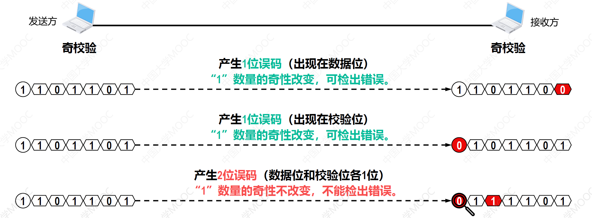

# 1.绪论

## 1.1 网络、互连网（互联网）和因特网

- 网络：网络由若干节点和连接这些节点的链路组成。
  - 多台计算机通过一台交换机互连起来形成一个网络，这多台计算机和这一台交换机都称为节点，计算机和交换机之间连接的线路称为链路。
- 互联网：多个网络还可以通过路由器互连起来，这样就构成了一个覆盖范围更大的网络，即互联网（或互连网）。
- 因特网：因特网是世界上最大的互连网络（用户数以亿计，互连的网络数以百万计）；

## 1.2 因特网的组成

- 边缘部分：由所有连接在因特网上的主机组成。这部分是用户直接使用的，用来进行通信（传送数据、音频或视频）和资源共享。

- 核心部分：由大量网络和连接这些网络的路由器组成。这部分是为边缘部分提供服务的（提供连通性和交换）。

  

## 1.3 三种交换技术

### 1.3.1 电路交换（用于电话网络）

- 通过物理线路的连接，动态的分配线路传输资源。
- 电路交换的过程
  - 建立连接（尝试占用通信资源）
  - 通信（一直占用通信资源）
  - 释放连接（归还通信资源）
- 电路交换的优缺点
  - 优点
    - 通信前从主叫端到被叫端建立一条专用的物理通路，在通信的全部时间内，两个用户始终占用端到端的线路资源。数据直送，传输速率高。
    - 电路交换更适用于：低频次，大量地数据传输。
  - 缺点
    - 建立/释放连接，需要额外的时间开销
    - 线路被通信双方独占，利用率低
    - 线路分配的灵活性差
    - 计算机之间数据往往是“突发式”传输，即往往会高频次、少量地传输数据。

### 1.3.2 报文交换（用于电报网络）

- 一份报文（电报）包含两部分信息
  - 控制信息：发送方地址、接收方地址
  - 用户所有数据

- 报文交换的优缺点
  - 优点
    - 通信前无需建立连接
    - 数据以“报文”为单位被交换节点之间“存储转发”，通信线路可以灵活分配
      - 存储转发的思想：把传送的数据单元先存储进中间节点，再根据目的地址转发至下一节点。
    - 在通信时间内，两个用户无需独占一整条物理线路，相比于电路交换，线路利用率高。
    - 交换节点支持“差错控制”（通过校验技术）
  - 缺点
    - 报文不定长，不方便存储转发管理
    - 长报文的存储转发时间开销大、缓存开销大
    - 长报文容易出错，重传代价高

### 1.3.3 分组交换（用于现代计算机网络）

- 把一份报文拆成多个大小相同的小报文，这些小报文被称为分组，每个分组也包含两部分的信息
  - 控制信息：发送方地址、接收方地址
  - 用户部分数据

- 分组交换的优缺点
  - 优点
    - 通信前无需建立连接
    - 数据以“分组”为单位被交换节点之间“存储转发”，通信线路可以灵活分配
      - 存储转发的思想：把传送的数据单元先存储进中间节点，再根据目的地址转发至下一节点。
    - 在通信时间内，两个用户无需独占一整条物理线路，相比于电路交换，线路利用率高。
    - 交换节点支持“差错控制”（通过校验技术）
    - 相比于报文交换，分组交换改进了如下问题
      - 分组定长，方便存储转发管理
      - 分组的存储转发时间开销小，缓存开销小
      - 分组不易出错，重传代价低
  - 缺点
    - 相比于报文交换，控制信息占比增加（每个分组都携带了一份控制信息）
    - 相比于电路交换，依然存在存储转发时延
    - 报文被拆分为多个分组，传输过程中可能出现失序、丢失等问题，增加处理的复杂度。

## 1.4 计算机网络的定义和分类

### 1.4.1 计算机网络的定义

- 最简单的定义：一些互连的、自治的计算机的集合；
  - 自治表示每台计算机都是独立的，它们有各自的软硬件
- 较好的定义：计算机网络主要是由一些通用的、可编程的硬件互连而成的，这些硬件硬件并非专门用来实现某一特定目的（例如，传送数据或视频信号）。这些可编程的硬件能够用来传送多种不同类型的数据，并能支持广泛的和日益增长的应用。

### 1.4.2 计算机网络的分类

- 按交换技术分类
  - 电路交换网
  - 报文交换网
  - 分组交换网
- 按使用者分类
  - 公用网（普通用户接入的电信网）
  - 专用网（如军队、银行使用的网络）
- 按传输介质分类
  - 有线网络
  - 无线网络
- 按覆盖范围分类
  - 广域网（WAN）
  - 城域网（MAN）
  - 局域网（LAN）
  - 个域网（PAN）
- 按拓扑结构分类
  - 总线型网络
  - 星型网络
  - 环型网络
  - 网状网络

## 1.5 计算机网络的性能指标

- 速率
  - 连接在计算机网络上的主机在数字信道上传输比特的速率，也称为比特率或数据率。
  - 基本单位：bit/s (b/s、bps)，常用单位：kb/s，Mb/s, Gb/s，Tb/s
- 带宽
  - 用来表示网络的通信线路所能传送数据的能力，因此网络带宽表示在单位时间内从网络中的某一点到另一点所能通过的“最高数据率”；单位与速率单位相同。
- 吞吐量
  - 吞吐量表示在单位时间内通过某个网络（或信道、接口）的数据量；
  - 吞吐量被经常用于对现实世界中的网络的一种测量，以便知道实际上到底有多少数据量能够通过网络；吞吐量受网络的带宽或额定速率的限制。
- 时延
  - 发送时延
  - 传播时延
  - 处理时延

## 1.6 计算机网络体系结构

- 常见的三种计算机网络体系结构

  - 开放系统互联参考模型（OSI）
    - 为了使得不同体系结构的计算机网络都能互连起来，国际标准化组织（ISO）提出了开放系统互连参考模型；
    - OSI刚被提出来时，采用TCP/IP体系结构的因特网已经抢先在全世界覆盖了相当大的范围。
    - 因此，OSI只停留在了理论方面，OSI在市场化方面输给了TCP/IP。

  - TCP/IP体系结构
    - 由于TCP/IP体系结构中包含大量的协议，而IP协议和TCP协议是其中最重要的两个协议，因此用TCP和IP这两个协议来表示整个协议大家族，常称为TCP/IP协议族。

  - 五层原理体系结构
    - TCP/IP体系结构为了将不同的网络接口进行互连，其网络接口层并没有规定什么具体内容，因此如果直接学习TCP/IP体系结构的话，可能物理层和数据链路层的学习我们就给忽略了，这对于我们学习计算机网络的完整体系结构来说就会缺少一部分内容。因此在学习计算机网络原理是往往采取折中的办法，也就是综合OSI参考模型和TCP/IP参考模型，采用一种原理参考模型。

- 计算机网络体系结构分层的必要性

  - 为什么要分层?
    - “分层”可以将庞大而复杂的问题转化为若干较小的局部问题，而这些较小的局部问题就比较容易研究和处理。

  - 物理层解决什么问题？
    - 主机A和主机B要想互连进行数据传输
      - 应该要采用什么传输介质？
      - 这根传输介质两端规定采用什么接口分别和主机A和主机B相连？
      - 这根传输介质中的数据应该采用什么信号进行传输？
  - 数据链路层解决什么问题？
    - 主机A、主机B和主机C通过一根总线互连进行数据传输
      - 如何识别网络中的每一台主机？MAC地址
      - 如何区分出地址和数据？通信的双方事先规定好数据包的格式
      - 各主机进行数据传输时，如何协调各主机竞争使用总线？

# 2.物理层

## 2.1 物理层要实现的功能

- 物理层要实现的功能是在各种传输媒体上传输比特0和1，进而给上面的数据链路层提供透明传输比特流的服务。
- 透明传输比特流的意思是数据链路层“看不见”（也无须看见）物理层究竟使用的是什么方法来传输比特流，数据链路层只管“享受”物理层提供的比特流传输服务即可。

## 2.2 物理层下面的传输媒体

- 有线传输媒体
  - 同轴电缆
  - 双绞线
  - 光纤
- 无线传输媒体
  - 无线电波
  - 微波
  - 红外线
  - 激光
  - 可见光

## 2.3 数字传输方式

### 2.3.1 串行传输和并行传输

- 串行传输：发送端和接收端之间只有一条数据传输线路，构成数据的多个比特在这条数据传输线路上逐比特依次传输。

  

- 并行传输：在发送端和接收端之间有多条数据传输线路，构成数据的多个比特被分别安排在不同的数据传输线路上同时传输。

  

### 2.3.2 单向通信、双向交替通信和双向同时通信

- 单向通信

  

- 双向交替通信

  

- 双向同时通信

  

## 2.4 编码与调制

- 消息、数据和信号
  - 在计算机网络中，需要由计算机处理和传输的文字、图片、音频和视频等内容，可以统称为消息。
  - 消息输入计算机后，就成为了有意义的二进制符号序列，即数据（比特0和比特1构成的数字序列）。
  - 计算机中的网卡将比特0和比特1变换成相应的信号发送到传输媒体。

- 基带信号
  - 由计算机输出的表示各种文字、图像、音频或视频文件的数字信号都属于基带信号。
  - 基带信号往往包含较多的低频成分，甚至包含（由连续个“0”或连续个“1”造成的）直流成分，而许多信道不能传输这种低频分量或直流分量，在通过不能传输这些成分的信道时，这些部分就传不过去，导致信号失真或丢失。因此需要对基带信号进行调制后才能在不能传输这些成分的信道上传输。

- 调制
  - 基带调制
    - 对数字基带信号的波形进行变换，使其能够与信道特性相适应，调制后的信号仍然是数字基带信号。
    - 由于基带调制是把数字信号转换成另一种形式的数字信号，因此基带调制也称为编码。
  - 带通调制
    - 将数字基带信号的频率范围搬移到较高的频段，并转换成模拟信号，是其能够在模拟信道中传输。

# 3.数据链路层

## 3.1 数据链路层的三个重要问题

### 3.1.1 封装成帧和透明传输

- 封装成帧
  - 就是给网络层交付下来的分组添加一个首部和一个尾部，这样就构成了一个帧。
  - 帧的首部和尾部中包含有一些重要的控制信息。例如，帧首部中往往包含帧开始符、帧的源地址和目的地址，而帧尾部中往往包含帧校验序列和帧结束符。
  - 接收方的数据链路层在收到物理层交付上来的比特流后，根据帧首部中的帧开始符和帧尾部中的帧结束符，从收到的比特流中识别出帧的开始和结束，也就是进行帧定界。
- 透明传输
  - 如果在帧的数据载荷部分恰好也出现了帧定界符（帧开始符或帧结束符），就会造成接收方数据链路层出现帧定界的错误。
  - 如果不解决上述问题，则数据链路层就会对上层交付的协议数据单元（PDU）的内容有所限制，即PDU中不能包含帧定界符。
  - 如果能够采取措施，使得数据链路层对上层交付的PDU的内容没有任何限制，就好像数据链路层不存在一样，就称其为透明传输。
  - 实现透明传输的方法有两种：字节填充和比特填充。

### 3.1.2 差错检测

实际的通信链路都是不理想的。表示比特的信号在信道上传输是，不可避免地会产生失真，甚至出现更严重的错误。这就会导致比特在传输过程中产生差错：比特1可能会变成比特0，而比特0也可能变成比特1。这种传输差错称为比特差错。常用的检错技术有：奇偶校验和循环冗余校验。

- 奇偶校验

  - 奇校验是在待发送的数据后面添加1个校验位，使得添加该校验位后的整个数据中比特1的个数为奇数。

  - 偶校验是在待发送的数据后面添加1个校验位，使得添加该校验位后的整个数据中比特1的个数为偶数。

    

    

  - 在所传输的数据中，如果有奇数个位发生误码，则所包含比特1 的数量的奇偶性会发生改变，可以检测出误码。

  - 在所传输的数据中，如果有偶数个位发生误码，则所包含比特1 的数量的奇偶性不会发生改变，无法检测出误码（漏检）。

- 循环冗余码校验

  - 收发双方约定好一个生成多项式G(X) 。

  - 发送方基于待发送的数据和生成多项式G(X)，计算出差错检测码（冗余码），将冗余码添加到待发送数据的后面一起传输。

  - 接收方收到数据和冗余码后，通过生成多项式G(X) 来计算收到的数据和冗余码是否产生了误码。

    

    ​													

    ​												

### 3.1.3 可靠传输

- 可靠传输的相关基本概念

  - 使用差错检测技术（例如循环冗余码校验），接收方的数据链路层就可检测出帧再传输过程中是否产生了误码（比特错误）。如果检测出了误码：
    - 若数据链路层向其上层提供的是不可靠的传输服务，则接收方的数据链路层丢弃有误码的帧即可；
    - 若数据链路层向其上层提供的是可靠的传输服务，这就需要数据链路层通过某种机制实现发送方发送什么，接受方就能收到什么。有线链路误码率低，一般不要求数据链路层向其上层提供可靠传输服务，而无线链路误码率高，一般要求数据链路层为其上层提供可靠传输服务。三种实现可靠传输的机制分别是：停止-等待协议、回退N帧协议、选择重传协议。

- 停止等待协议

  - 基本原理：所谓停止-等待协议，就是指发送方每发送完一个数据分组就必须停下来，等待接收方发来的确认分组或否认分组。

    - 最简单的情况的策略

      

      - 缺陷：如果数据分组丢失，发送方将无法受到确认分组，更别提否认分组了。

    - 数据分组丢失的情况的处理策略

      

      - 缺陷：如果接收方发过来的确认分组在中途丢失，发送方则一直收不到确认分组，因此发送方必将重传之前的分组，此时接收方必然受到了与之前相同的分组，此时就产生了分组重复的传输差错。

    - 确认分组丢失的情况的处理策略

      

      - 为了防止发送方收到重复的确认分组，确认分组也需要编号

        
